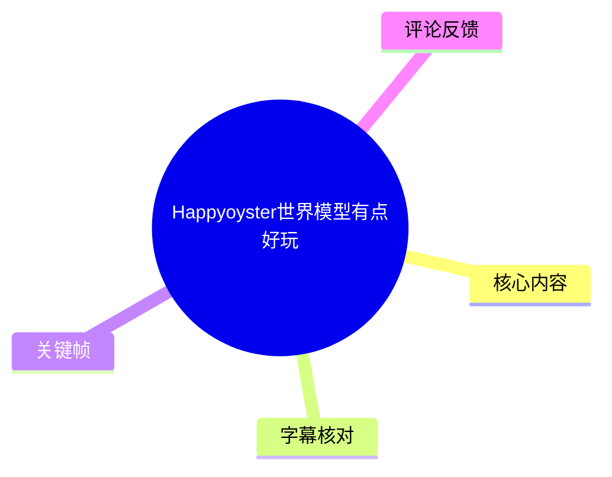
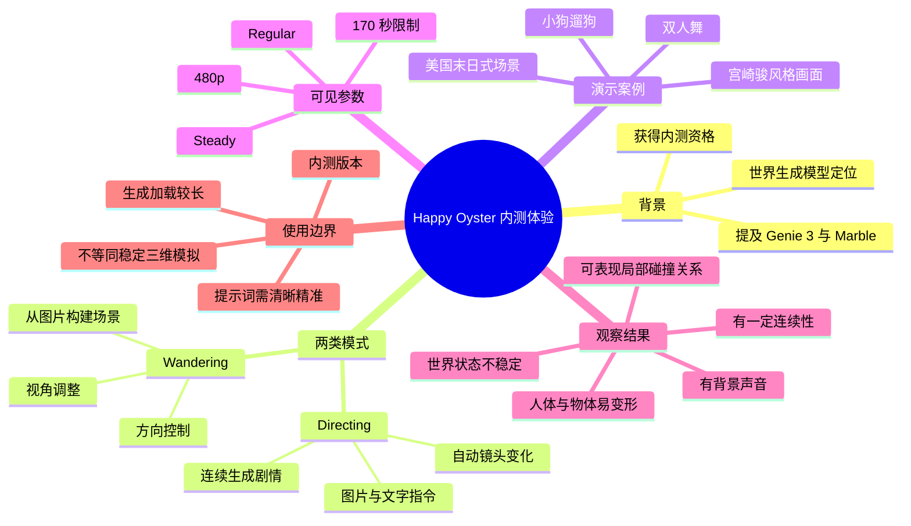
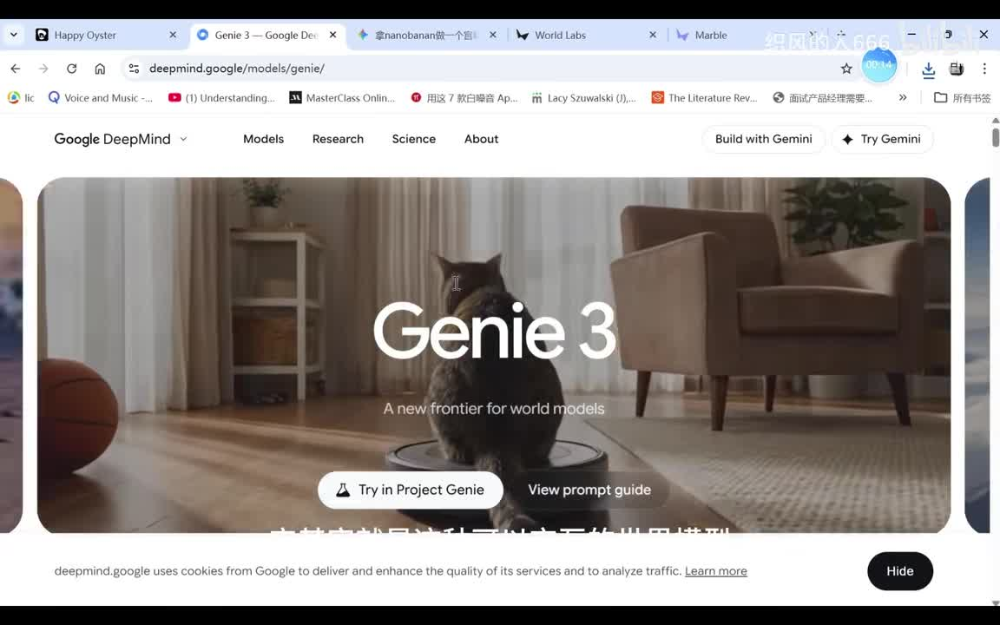
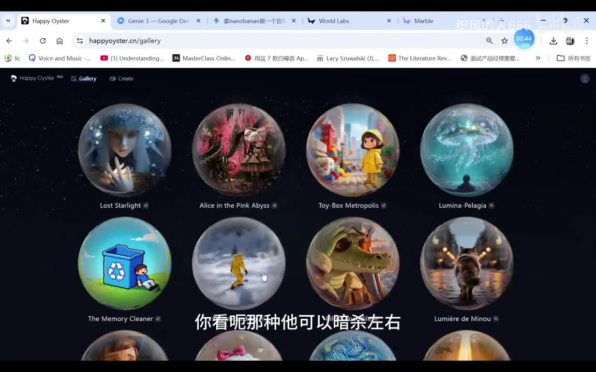
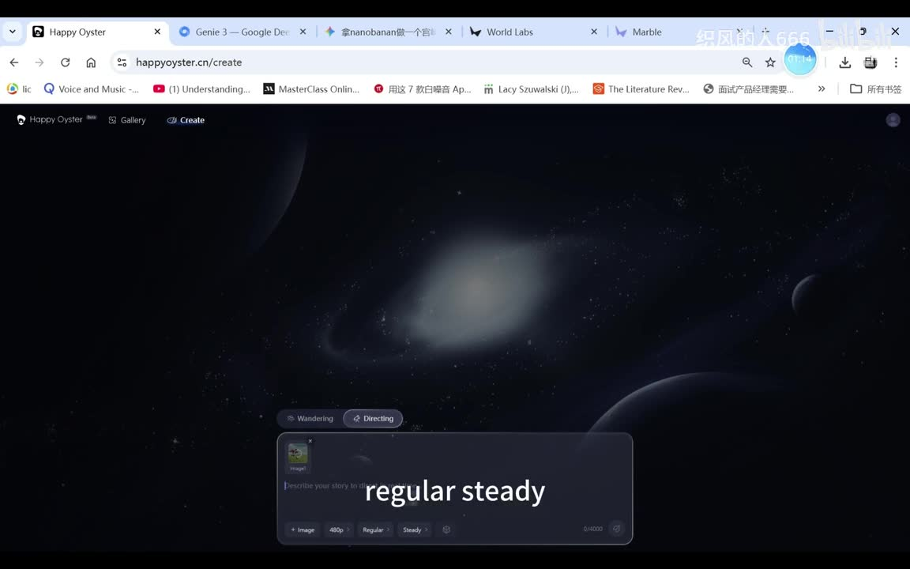

# Happyoyster世界模型有点好玩

> 来源：[Bilibili 视频](https://www.bilibili.com/video/BV1T8ooBEE8q) 
> UP 主：织风的人666｜视频时长：11 分 41 秒｜分辨率：1728×1080 
> 视频简介：UP 主获得 Happy Oyster 内测资格后进行实测；简介标注 `06:10` 为 Wandering 模式、`08:04` 为双人舞演示。

## 小结

视频记录了 UP 主对 **Happy Oyster** 的一次内测体验。UP 主将其归入“世界生成模型”范畴，并以 Google 的 Genie 3、李飞飞团队的 Marble 为相关参照；不过，关于这些产品的定位、能力与技术实现，视频主要是个人口述与界面展示，不能据此视为完整的官方技术说明。

实测中展示了两类交互形式：**Directing（导演/指令）模式**与 **Wandering（漫游）模式**。前者基于输入图像和持续追加的文字指令，让画面在连续生成中推进；后者则允许用户以方向控制和视角调整的方式，在由图片构建的场景中移动，体验上更接近可交互的游戏场景。

Directing 演示使用了一张由 Nano Banana 生成的、带有宫崎骏风格倾向的画面。UP 主在界面中选择了 `480p`、`Regular`、`Steady` 等可见选项；生成过程中，角色会跑动、长出翅膀、飞行、拔剑并触发新角色/场景。它体现了模型可自行补足镜头变化和剧情衔接的一面，但也暴露出明显的角色、肢体与物体一致性问题，例如香蕉长出腿、身体部位错位、角色形体突变等。

Wandering 演示显示，模型能从单张图构建可向前、向左、向斜前方移动的视角，并在部分画面中维持建筑、地面、人物脸部和牵引绳等对象。UP 主认为它表现出一定地形、碰撞或物理关系意识；但当视角切换到此前的着火区域时，场景会变成汽车，说明世界状态与空间一致性仍不稳定。

最后的双人舞案例进一步说明难点：连续舞蹈涉及复杂的人体手脚动作，人物会出现鞋子抽象、飞起、变光头、动作语义偏离、惊悚化场景突变等问题。视频的核心价值不在于证明其已具备稳定 3D 世界模拟能力，而在于展示了一种将“图像/文本生成”与“实时导航、镜头变化、连续叙事”结合的交互形态。

该体验具有强时效性：视频基于内测资格录制，产品入口、时长额度、模式名称、参数、生成质量和开放范围均可能在后续版本变化。适合关注 AI 视频生成、交互式世界模型、生成式游戏原型及产品体验设计的人阅读。

## 思维导图

## 目录

- [背景：内测与“世界生成模型”定位](#背景内测与世界生成模型定位)
- [功能结构：Directing 与 Wandering](#功能结构directing-与-wandering)
- [Directing：连续指令生成实验](#directing连续指令生成实验)
- [Wandering：图片构建可漫游场景](#wandering图片构建可漫游场景)
- [小狗遛狗案例：局部物理关系与识别偏差](#小狗遛狗案例局部物理关系与识别偏差)
- [双人舞案例：复杂人体动作的失稳](#双人舞案例复杂人体动作的失稳)
- [操作步骤、参数与复现实务](#操作步骤参数与复现实务)
- [结论、限制与时效性](#结论限制与时效性)
- [字幕比对](#字幕比对)
- [评论分析](#评论分析)
- [处理记录](#处理记录)

## [背景：内测与“世界生成模型”定位](https://www.bilibili.com/video/BV1T8ooBEE8q?t=0)

UP 主在开头说明，自己于前一天取得了 Oyster 的 Happy Oyster 内测资格，并立即进行了试用。其主观评价是“非常牛”。

视频将 Happy Oyster 描述为可生成、且可交互的“世界生成模型”。作为背景参照，UP 主口述提及：

- Google 的 **Genie 3**：被描述为可交互的世界模型生成方向；
- 李飞飞团队的 **Marble**：被描述为可做场景交互式互动；
- Happy Oyster：UP 主强调这是自己能够实际试到的国产产品/服务。

这里需要区分三个层次：

1. **视频事实**：UP 主展示了 Happy Oyster 的网页界面和实际生成结果。
2. **UP 主体验判断**：其认为这种交互形式具有新鲜感、颠覆感。
3. **尚未在素材中验证的部分**：模型架构、训练数据、实际物理引擎、是否为显式 3D 表示、与 Genie 3/Marble 的性能比较等，视频均未提供官方材料或测试指标。

> 图：该关键帧展示浏览器中的 Genie 3 页面，画面文字包括 “Genie 3” 与 “A new frontier for world models”。它说明 UP 主在介绍 Happy Oyster 前，确实以 Genie 3 作为“世界模型”背景参照；但这不构成两者能力相同或性能可比的证据。

## [功能结构：Directing 与 Wandering](https://www.bilibili.com/video/BV1T8ooBEE8q?t=41)

UP 主将 Happy Oyster 的使用方式概括为两种。

### 1. Wandering：角色漫游与方向控制

该模式的体验接近操控游戏角色：

- 用户可使用上下左右方向控制移动；
- 可尝试向斜前、斜右等方向移动；
- 可以切换或调整观察视角；
- 模型依据输入图像构建一个可探索场景。

视频中，UP 主将其形容为“像打游戏一样”。后续实测显示，移动与画面响应之间存在一定对应关系，但并不能稳定保持整个场景的对象、材质与状态。

### 2. Directing：在连续画面中追加导演式指令

该模式在固定或延续的场景中持续生成画面。UP 主的理解是：

- 不再像传统短视频生成工具那样，按单帧或若干秒片段分别生成；
- 用户可在动画延续过程中继续输入 Prompt；
- 系统会按照后续指令推进人物和剧情；
- 模型可能自行补足镜头切换、角色动作、场景变化及背景声音。

“每一分钟告诉它要做什么”的说法是 UP 主的概括，并非素材中可确认的固定指令间隔或产品规格。实际演示中，用户是在生成进行时持续观察、再决定下一动作。

> 图：该关键帧展示 Happy Oyster 的 Gallery 页面，多个球形缩略图对应不同风格和场景的世界示例。它有助于理解该产品的使用入口包含示例世界浏览，而不仅是单一文本输入界面。

## [Directing：连续指令生成实验](https://www.bilibili.com/video/BV1T8ooBEE8q?t=80)

### 输入与界面可见选项

UP 主先进行一个 Directing 实验，称使用 Gemini / Nano Banana 制作了一张具有“宫崎骏风格”倾向的初始画面。字幕中有关工具名的识别存在误差，结合上下文与页面标签，较可靠的表述是：

- 初始图像被称为由 **Nano Banana** 制作；
- 浏览器标签中可见与 Gemini、Nano Banana 相关的页面；
- 视频没有给出完整的初始图 Prompt，因此无法复原图片生成条件。

界面中能辨认的选项包括：

| 项目 | 视频可见内容 | 可确认程度 |
| --- | --- | --- |
| 模式 | Directing | 高 |
| 分辨率 | `480p` | 高 |
| 生成风格/强度选项 | `Regular` | 高，仅确认文字可见 |
| 稳定性/运动选项 | `Steady` | 高，仅确认文字可见 |
| 文本输入计数 | `0/4000` | 高，疑似输入上限显示 |
| 生成时长限制 | 右上角显示约 `170 秒` | 中高，来自 UP 主口述与界面观察 |
| 初始图 | 由外部图像生成工具制作 | 中，具体工具名需结合上下文校正 |

> 图：该关键帧展示 Happy Oyster 的 Create 页面，底部输入区上方可见 `Wandering` 和 `Directing` 标签，输入区附近可见 `480p`、`Regular`、`Steady` 与 `0/4000`。这是视频中最直接的参数依据；图片价值在于将“模式”和“可见参数”与口述内容对应起来。

### 演示过程与效果

生成启动后，UP 主指出加载时间较长，并表示会在视频中倍速处理等待过程。随后画面中的人物开始奔跑；UP 主还指出生成画面带有背景声音。

在后续连续指令中，人物/场景出现了如下变化：

1. 人物长出翅膀并飞起；
2. 系统自行完成了一些视角转换；
3. 人物从胸口拔出剑；
4. 初始画面的香蕉元素被生成出腿部等拟人化结构；
5. 角色出现自行攻击、肢体/五官错位等异常；
6. 画面中生成出被称为“黑丑大帝”的对象或角色；
7. 场景从白天转为黑夜；
8. UP 主尝试推动“公主”等剧情元素，但模型输出并不完全符合预期；
9. 在 170 秒倒计时结束前，最后一段意图未完全呈现。

UP 主的主要观察是：当 Prompt 较有限时，模型会自行扩展剧情，因此会产生意外、混沌甚至荒诞的结果；若提示词足够清晰、精确，理论上可能得到更有效的剧情推进。这里“可能”是其体验性判断，视频没有提供对照测试来证明提示词精度与一致性之间的定量关系。

> 图：该关键帧显示 “Your world is coming to life” 的生成进度界面及 `54%` 进度。它直接支持“生成存在明显等待时间”的记录，也说明视频展示的是在线生成流程，而非预先渲染好的成片。

### Directing 的可迁移经验

从该案例可提炼出以下实践原则：

- **先准备清晰的初始图**：初始图决定角色、构图、风格和场景锚点；图像本身越含混，后续生成越可能偏移。
- **拆分叙事动作**：不要在单条指令中堆叠过多角色、物件和因果链；可按“移动—转向—拿起物体—执行动作—切换场景”逐步推进。
- **优先描述可观察状态**：相比抽象意图，明确描述人物位置、服装、持有物、镜头和动作，更便于检查偏离。
- **预留重试空间**：长序列存在物体增生、肢体崩坏、角色身份漂移的风险，重要镜头应保留独立重生或回退方案。
- **将自动镜头视为不确定变量**：模型的自动视角变化可能增强戏剧性，也可能破坏构图连续性；对镜头一致性要求高时，需要持续复核输出。

## [Wandering：图片构建可漫游场景](https://www.bilibili.com/video/BV1T8ooBEE8q?t=309)

第二段演示被 UP 主形容为带有《美国末日》氛围的交互场景。其基本流程是：**给模型一张图，模型以该图为基础构建可移动的世界。**

### 视频中展示的控制与反馈

UP 主在画面左下角操作方向控制：

- 按“上”：角色/视角向前移动；
- 按“左”：向左移动；
- 演示中还出现向斜前方、斜右方移动；
- 通过另一控制区域调整视角；
- 场景中可看到楼体、地面、人物等元素。

UP 主认为模型“有体积碰撞”“有地形”，依据是移动过程中画面呈现了空间方向感，并非完全无约束地平面滑动。该判断应谨慎理解：素材只展示了视觉行为，未展示碰撞盒、几何网格、深度图或物理模拟日志，因此只能说**输出呈现了局部空间约束的视觉效果**，不能确认其底层具有传统游戏引擎式碰撞系统。

### 一致性问题

UP 主随后通过调整视角，回看此前疑似着火的位置，发现该区域不再保持原先状态，甚至“变成汽车了”。这说明：

- 单次局部画面可以显得稳定；
- 随着移动和观察角度变化，世界对象可能重绘或替换；
- 场景的跨视角持久性尚不足以保证可靠探索；
- 对需要地图、任务状态、物品位置长期一致的游戏式应用而言，仍需额外的状态管理或人工筛选。

这一点也是评估“世界模型”体验时的关键：能自由移动不等于拥有稳定、可重复访问的完整三维世界。

## [小狗遛狗案例：局部物理关系与识别偏差](https://www.bilibili.com/video/BV1T8ooBEE8q?t=370)

视频简介明确标注 `06:10` 为 Wandering 模式。此处 UP 主以自己的小狗“豆仔”为输入/主体进行“云遛狗”式演示；其口述说明原始场景是在地铁地库拍摄，因此环境限制相对少。

### 观察到的结果

- 用户可控制小狗前进、转向和观察视角；
- 远处出现人物，且人物与狗的比例明显异常，出现“狗比人还大”的情况；
- UP 主尝试切换视角查看小狗正脸，发现脸部一度消失或失真；
- 后续小狗形象有所恢复，但身份识别并不稳定；
- 牵引绳的位置发生卷曲、延续，UP 主据此认为模型有一点物理碰撞意识；
- 小狗的腿部和臀部在部分画面中保留了原有风格特征。

### 对输入提示的启示

UP 主推测，小狗难以稳定识别，可能与指令中没有明确写出“这是一条狗”有关。虽然这只是一种未验证的解释，但可作为实操检查项：

1. 在图像输入之外明确声明主体类别，例如“画面主体是一只宠物狗”；
2. 给出身份稳定词，如毛色、体型、项圈、牵引绳、品种特征；
3. 明确人与狗的尺度关系，避免出现主体比例反转；
4. 明确镜头目标，例如“镜头绕到狗的正面，保持狗脸完整可见”；
5. 对牵引绳、地面、车辆等关键相互作用对象单独描述，不把其稳定性完全交给模型补全。

需要注意，牵引绳卷曲并不能证明模型进行了严格的物理求解；它最多说明输出在该段画面中保留了某种局部关联。

## [双人舞案例：复杂人体动作的失稳](https://www.bilibili.com/video/BV1T8ooBEE8q?t=484)

视频简介标注 `08:04` 为“双人舞爆笑”。UP 主先提到此前某次尝试“没跑通”，随后进入新的双人舞生成片段，并判断跳舞难度较高，原因是人的手、腿等复杂动作更难维持。

### 输出中出现的偏差

双人舞的连续生成中，UP 主观察到：

- 预期的拥抱、举起、旋转动作与实际画面不一致；
- 女子被抬起后，动作关系发生偏离；
- 人物鞋子变得抽象；
- 人物/角色会飞起；
- 男子出现光头等身份外观突变；
- 场景气氛突然趋向恐怖片或《寂静岭》式效果；
- 人物动作被踢飞、形态变化、角色重现等异常连续事件；
- 尽管存在较多失真，女主角的建模在部分时刻被 UP 主评价为“非常到位”。

该案例反映的是生成式连续视频的常见高难度区域：双人接触、肢体遮挡、快速运动、重心变化、服装与鞋子细节、人物身份维持、镜头切换和动作语义都需要同时稳定。视频中没有提供每一步 Prompt，因此无法把具体失误归因于某一条指令或某个模型模块。

### 对创作使用的建议

若将此类功能用于舞蹈、打斗或双人互动原型，应采用更保守的工作流：

- 先生成短距离移动或单人基础姿态；
- 再逐步引入第二个角色；
- 避免一开始就要求“抱起—旋转—抛接—落地”等多阶段动作链；
- 固定人物外观、服装、镜头距离及场景；
- 每次只验证一个动作目标；
- 对可用片段及时导出保存，避免后续连续生成破坏已满意的画面。

## [操作步骤、参数与复现实务](https://www.bilibili.com/video/BV1T8ooBEE8q?t=69)

以下流程按视频实际展示的使用逻辑整理，不补充视频未出现的 API、命令行、账户价格或隐藏参数。

### 步骤 1：进入 Happy Oyster 的示例或创建入口

视频中可见 Happy Oyster 网页包含：

- `Gallery`：浏览多个示例世界；
- `Create`：创建新世界；
- 创建页中可切换 `Wandering` 与 `Directing`。

建议先在 Gallery 中观察示例，以理解输入风格、场景复杂度与输出预期，再进入 Create 进行试验。

### 步骤 2：准备初始图像

Directing 与 Wandering 都依赖初始视觉场景。视频中的两类输入思路是：

- 风格化人物/香蕉画面：用于连续剧情；
- 现实照片中的人物、小狗及地库环境：用于可漫游场景。

初始图应尽量具有：

- 明确主体；
- 视觉层次清晰的前景、中景、背景；
- 角色与物体间较清楚的尺度关系；
- 低遮挡、低歧义的主体轮廓；
- 对后续叙事有帮助的空间结构。

### 步骤 3：选择模式与可见参数

视频画面可确认的选择如下：

| 目标 | 适合的模式 | 视频中的对应表现 |
| --- | --- | --- |
| 让故事、动作和镜头持续发展 | Directing | 宫崎骏风格人物连续冒险、自动换视角 |
| 让用户移动并观察场景 | Wandering | 场景内前进、斜走、调视角、遛狗 |
| 保持较轻量的输出规格 | `480p` | UP 主创建 Directing 世界时选择 |
| 使用界面所示预设 | `Regular`、`Steady` | 视频中可见，但具体算法含义未说明 |

**不可擅自推断：**`Regular` 与 `Steady` 具体控制的是画质、帧率、运动幅度、采样策略还是其他内部参数，素材未给出官方解释，因此只记录其为界面中被选择的预设文字。

### 步骤 4：等待世界生成完成

视频中生成界面显示了进度，UP 主明确表示加载时间较长。实际使用时应注意：

- 不要将实时生成理解为无等待交互；
- 生成完成前应避免基于尚未稳定的画面作结论；
- 视频中观察到右上角约有 `170 秒` 的时间限制，应提前设计要验证的动作；
- 该时长限制只适用于录制时的内测界面，未来版本可能改变。

### 步骤 5：通过小步指令验证连续性

对于 Directing：

1. 先让主体执行一个短动作；
2. 检查主体身份、服装、脸部、道具是否保留；
3. 再添加下一动作与镜头要求；
4. 每轮检查是否出现新生物体、肢体错位、风格跳变；
5. 若目标是成片，优先保留质量较好的局部片段。

对于 Wandering：

1. 先向前移动，检查地面与主要对象；
2. 再改变视角、回头或横移；
3. 核验此前出现过的建筑、火焰、车辆等对象是否仍然存在；
4. 检查主体比例是否稳定；
5. 对需要强一致性的场景，在多个视角反复验证后再使用。

## [结论、限制与时效性](https://www.bilibili.com/video/BV1T8ooBEE8q?t=664)

### 视频可支持的结论

Happy Oyster 在视频中展示出一种不同于单次短视频生成的交互形态：

- 用户能以指令持续影响生成中的叙事；
- 用户能在从图片延展出的场景中进行方向移动与视角调整；
- 输出可以包含自动镜头变化与背景声音；
- 在局部时间段、局部视角内，人物、建筑、地形或牵引绳等元素可呈现一定连续性。

UP 主最终认为，这种形式与模式“有点颠覆”，原因不只是画面质量，还在于生成、操控、探索三者被放入同一体验流程。

### 主要限制

| 限制类别 | 视频中表现 | 影响 |
| --- | --- | --- |
| 世界状态一致性 | 原先着火区域切换视角后变为汽车 | 难以依赖场景进行长期探索或任务设计 |
| 主体身份一致性 | 小狗脸部消失、男性变光头、人物反复变形 | 不适合直接用于高要求角色叙事 |
| 人体动作 | 双人舞的抬举、旋转等动作偏离语义 | 双人交互、舞蹈、打斗仍是高风险题材 |
| 物体与肢体结构 | 香蕉长腿、脚长到鼻子、鞋子抽象 | 画面可能快速进入荒诞或不可用状态 |
| 指令可控性 | 有些目标未呈现，剧情由模型自行延展 | 不能假定 Prompt 会被精确执行 |
| 生成速度 | UP 主称加载时间较长 | 限制即时创作和高频试错 |
| 时长额度 | 右上角约 170 秒倒计时 | 长剧情需要拆段或选择重点动作 |

### 时效性说明

- 本视频反映的是 UP 主在 **内测资格** 下的单次或少量试用体验；
- 元数据记录的发布时间为 2026-04-26，但素材抓取时间与评论时间存在不一致，应以页面实时信息为准；
- 产品功能、限额、可见预设、质量、开放地区与访问资格都可能变化；
- 视频没有包含官方定价、排队机制、模型版本号、API、版权条款或数据处理政策，不能据此推导产品的正式商业能力。

## [字幕比对](https://www.bilibili.com/video/BV1T8ooBEE8q?t=0)

本次任务中，**站内字幕与 ASR 字幕均已获取并比对**。两份字幕都保留了大部分口述顺序，但 ASR 在英语产品名、模式名、中文同音词和较快的感叹性语句上误识别较多。

| 字幕来源 | 完整性 | 专有名词 | 时间轴 | 主要问题 |
| --- | --- | --- | --- | --- |
| Bilibili 站内字幕 | 较完整，基本覆盖全片 | 相对较好，但仍有“JI3”“金米奶”等误写 | 素材提供的是文本，未提供逐条时间码 | 个别断句、口语重复、模型/工具名音译不准 |
| 本次 ASR 字幕 | 覆盖全片，保留较多口语细节 | 较弱，存在大量同音替换和英文误识别 | 素材提供的是文本，未提供逐条时间码 | 如“Gini3”“精米奶”“deracking”“wandering”“Cro”等识别不稳定，部分句子语义破碎 |

### 最终字幕选择

正文以 **Bilibili 站内字幕为主**，以本次 ASR 辅助补全；遇到两者冲突时，优先采用：

1. 视频上下文；
2. 界面关键帧中可见的文字；
3. 两份字幕中语义更通顺、且与上下文一致的表述；
4. 无法确认时保留不确定性，不将猜测写成事实。

### 重要校正与保留项

| 原始识别 | 正文采用 | 校正依据 |
| --- | --- | --- |
| `JI3` / `Gini3` | Genie 3 | UP 主正在浏览 Google DeepMind 的 Genie 3 页面，关键帧可见标题 |
| `金米奶` / `精米奶` / `jimmy night` | Gemini（仅作为上下文提及） | 浏览器标签和语境指向 Gemini；但初始图具体生成流程仍未完整展示 |
| `nano banana` / `nano brana` | Nano Banana | 两份字幕均接近该名称，且浏览器标签可见相关文字 |
| `directing` / `deracking` | Directing | 创建页模式标签可见 `Directing` |
| `wondering` / `wandering` | Wandering | 视频简介明确写明 `06:10是wandering模式`，创建页可见该标签 |
| `400468480P` / `408 480p` | 480p | 创建页关键帧明确可见 `480p` |
| “物理碰撞” | “呈现局部物理/碰撞关系的视觉效果” | 这是 UP 主体验判断，素材不足以确认底层物理实现 |

## [评论分析](https://www.bilibili.com/video/BV1T8ooBEE8q?t=664)

以下仅分析可获取的热评前三条。评论反映用户体验和观点，不作为已经验证的技术事实。

### 1. DSYULTRA：角色必须出现导致系统难以“跑掉”

> “真服了这个模型是不是记得原先角色一定要出现所以让角色换衣服什么的模型就跑不了[笑哭]”

- **评论观点**：评论者猜测模型可能有维持原始角色出现的倾向，因此当用户想通过换衣服等方式改变角色时，模型会受到原角色约束。
- **与视频的对应**：视频确实出现角色变形、人物外观变化、香蕉拟人化等现象，但没有专门测试“换衣服是否导致无法摆脱原角色”。
- **可信度与边界**：这是基于观看结果的推测，未提供可复现 Prompt 或对照样本，不能得出模型存在特定角色记忆机制的结论。

### 2. onbionlion：对突破物质规则的震撼感

> “ai太恐怖了，真的有一种一切都有可能的感觉了，打破常规物质宇宙法则思维局限，让人意识到规则之外是存在真实的，虽然不可触碰但的确存在”

- **评论观点**：评论者强调生成内容超越现实物理常规所带来的冲击感。
- **与视频的对应**：视频中的飞行、肢体突变、物体变化和场景惊悚化，确实会带来“规则被打破”的视觉体验。
- **可信度与边界**：这属于审美与哲学感受。视频中的“打破物理规则”更可能意味着生成不稳定或不受现实约束，不能说明模型发现了现实世界之外的真实规律。

### 3. myplxdm：导演模式类似连续图/视频生成，真正亮点是可玩性

> “导演模式其实就是用文生视频或图生视频将视频连接起来，这个主要靠模型，只要模型强一般也能做出来，而且目前也有问题召唤出来的会变，一致性也差。就是能在3d世界玩那个厉害”

- **评论观点**：评论者认为 Directing 模式可理解为文生视频或图生视频的连续连接；目前主要问题是召唤物变化和一致性差；更突出的部分是可在“3D 世界”中游玩。
- **与视频的对应**：该评论与实测高度相关：Directing 中确有物体/角色变化与一致性问题，Wandering 的可移动体验也确实是视频重点。
- **可信度与边界**：前半段是合理的产品形态分析，但视频未披露实现原理，不能确认 Directing 的底层就是“将视频连接起来”；“3D 世界”也应限定为视觉上具有可探索空间感，不能据此确认其使用了稳定显式 3D 场景表示。

## [处理记录](https://www.bilibili.com/video/BV1T8ooBEE8q?t=0)

- **Worker ID**：`worker-mrj0www4-e8d79408`
- **模型**：`gpt-5.6-terra`
- **调用工具与素材**：视频元数据、视频素材清单、站内字幕文本、本次 ASR 字幕文本、热评 JSON、关键帧路径与已提供关键帧画面。
- **字幕选择**：已执行本次 ASR；正文以站内字幕为主、ASR 为交叉验证。产品名、模式名和参数优先依据关键帧与上下文校正。
- **关键帧选择依据**：
  - `frames/frame-001.jpg`：展示 Genie 3 页面，支撑视频中的背景参照；
  - `frames/frame-002.jpg`：展示 Happy Oyster Gallery，说明示例世界入口；
  - `frames/frame-003.jpg`：展示 Create 页面及 `Wandering`、`Directing`、`480p`、`Regular`、`Steady` 等可见参数；
  - `frames/frame-004.jpg`：展示世界生成进度，支撑“需等待加载”的记录。
- **未选用其余关键帧的原因**：素材仅提供了 `frame-005` 至 `frame-012` 的路径，未提供对应画面内容；为避免对未见画面作描述，不在正文中引用。
- **评论处理范围**：仅处理可获取热评前三条，未扩展至其他评论或弹幕。
- **缓存清理**：任务素材目录中记录的产物包括 `merged.mp4`、音频、帧、字幕、ASR 与评论文件；本整理过程未执行文件删除操作，未报告额外缓存残留或清理失败。
- **未解决问题**：
  - Happy Oyster 的官方模型架构、版本号、价格、内测规则与数据政策未在素材中提供；
  - `Regular`、`Steady` 的精确定义未在视频中说明；
  - 170 秒限制是否为账户级、单次生成级或内测临时限制，无法确认；
  - 视频中的“物理碰撞”“3D 世界”仅能确认体验层面的视觉表现，不能推断底层技术实现。

## 评论分析

本次流程未获取到可用热评，因此不推断观众态度或额外结论。
