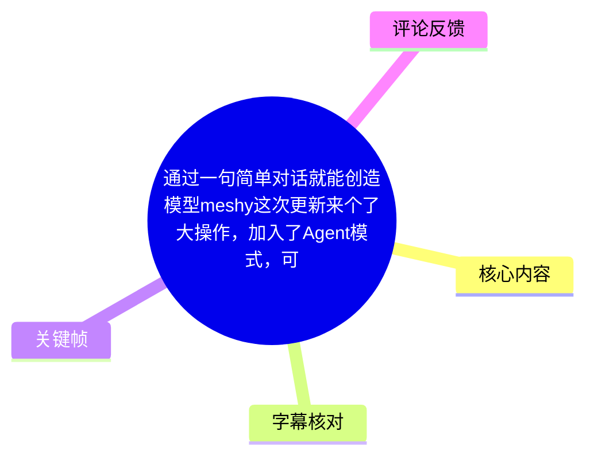
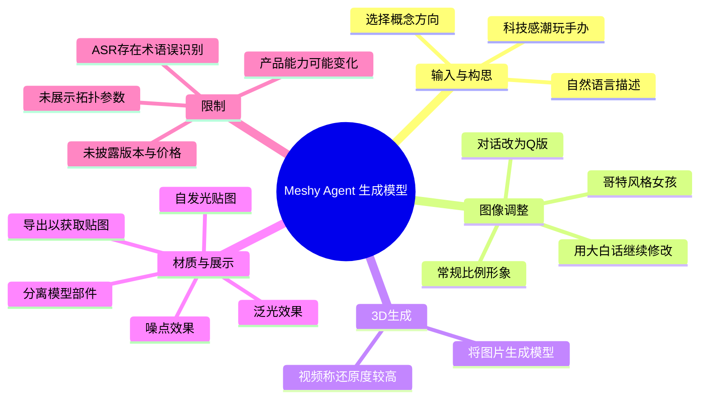
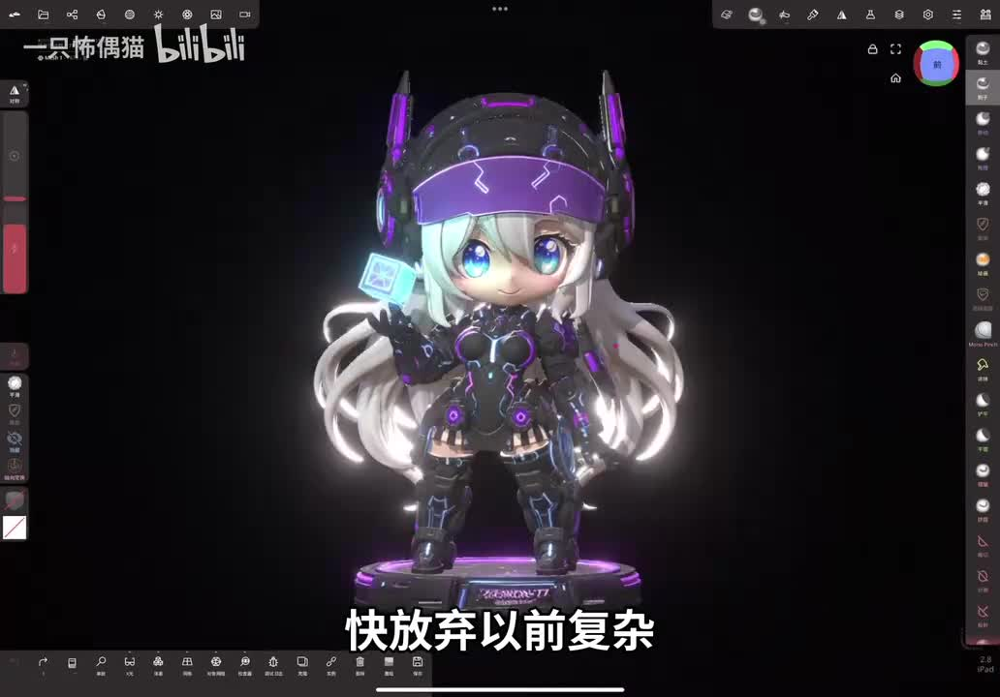
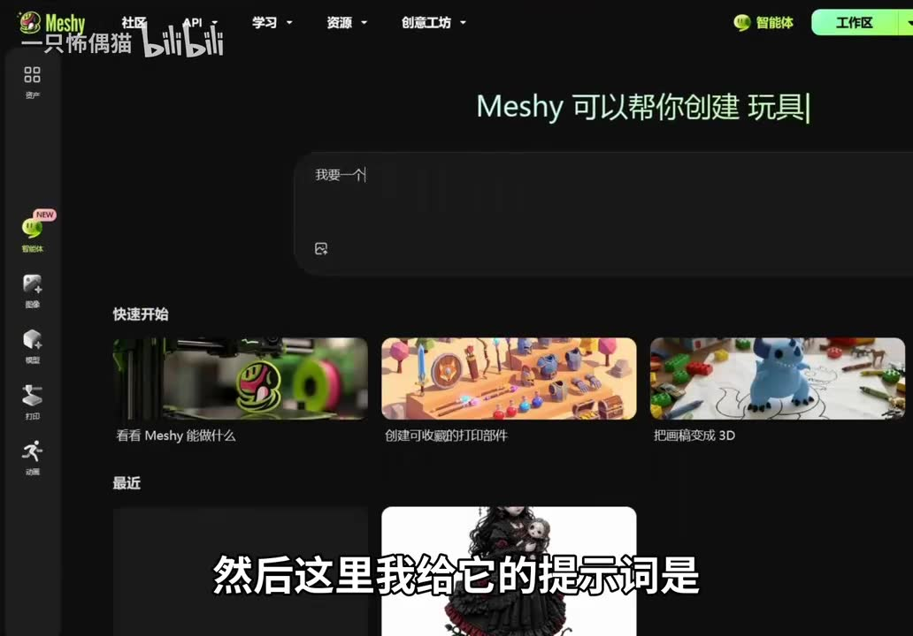
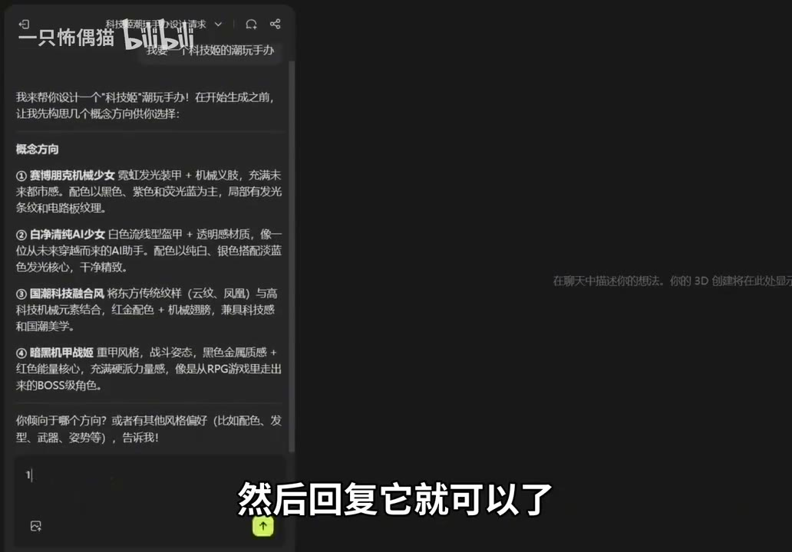
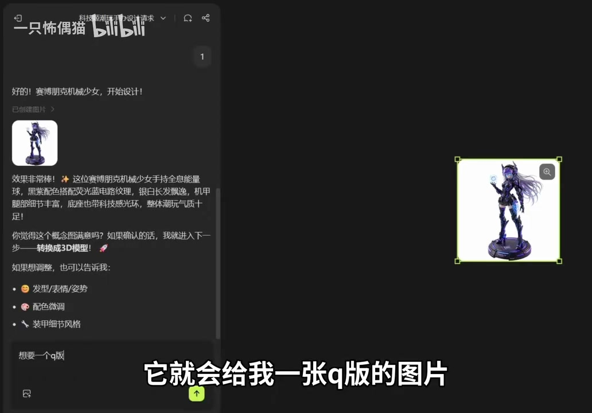

# 通过一句简单对话就能创造模型：Meshy Agent 模式与材质后处理演示

> 来源：[Bilibili 视频](https://www.bilibili.com/video/BV1FRJG6XE44)<br>
> UP 主：一只怖偶猫｜视频时长：125 秒｜分类标签：AI、建模、3D、模型、Agent、AI 生成  
> 注：发布时间按元数据中的 Unix 时间戳换算为 UTC；实际本地展示时间可能因时区不同而不同。

## 小结

视频展示了 Meshy 新增的 **Agent（智能体）工作流**：用户可先用自然语言描述想要的潮玩/角色概念，在智能体给出的概念方向中选择其一，再通过继续对话调整比例与风格，最后让系统将生成图片转为 3D 模型。

UP 的核心案例是“科技感潮玩手办”。流程中先生成常规比例角色，再用一句“想要一个 Q 版”将其改为 Q 版；视频声称两版在外形、姿势和表情等关键特征上保持一致。随后又演示了哥特风格女孩的生成与修改入口，强调可以用“大白话”表达不满意之处。

模型下载后，视频进入一款移动端/平板端 3D 编辑应用进行材质增强：将对象分离、导出以取得贴图、将贴图接入自发光通道，再在后期处理中打开泛光（Bloom）与噪点（Grain）效果。其目标是获得发光零件与类似油画颗粒的视觉质感。

本视频适合希望快速完成“文本构思 → 概念图 → 3D 模型 → 简单展示渲染”的 AI 建模初学者。需要注意的是，视频没有给出 Meshy Agent 的版本号、套餐/积分消耗、模型面数、拓扑质量、贴图分辨率、格式兼容性或商用授权信息；“还原度高”“听得懂人话”等均属于 UP 的演示评价，而非独立测试结论。

内容具有明显时效性：Meshy 的 Agent 界面、生成能力、可用地区、额度及导出选项都可能随产品更新而改变。ASR 覆盖到约 124.18 秒，未识别到开头约 28 秒的明确语音内容；正文时间轴仅采用可用 ASR 分段起点，不依据文字顺序补猜时间。

## 思维导图





## 目录

- [开场成果与功能定位](#开场成果与功能定位-002838)
- [Meshy Agent：从自然语言到概念图](#meshy-agent从自然语言到概念图-002838)
- [比例、风格与图生模型](#比例风格与图生模型-005268)
- [材质处理：自发光、泛光与噪点](#材质处理自发光泛光与噪点-011682)
- [可复用操作清单与参数边界](#可复用操作清单与参数边界-014018)
- [结论、限制与时效性](#结论限制与时效性-020418)
- [字幕比对](#字幕比对)
- [评论分析](#评论分析)
- [处理记录](#处理记录)

## [开场成果与功能定位](https://www.bilibili.com/video/BV1FRJG6XE44?t=28) [00:28]

ASR 在 `00:28.380` 开始识别到连续旁白。UP 以“这些模型都是一句话生成的”为开场主张，并将传统 3D 工作流概括为“复杂繁琐”。随后说明 Meshy 已加入 Agent 模式，用户可通过对话生成模型。

这里的“对话生成模型”在本视频中并非只输入一句文本便直接获得最终 3D 文件，而是包含以下中间环节：

1. 用文本提出对象及风格需求；
2. Agent 生成多个概念方向；
3. 用户选择方向或继续提出修改；
4. 获得概念图片；
5. 要求系统将图片转为模型；
6. 下载模型并进入后续材质处理。

因此，视频呈现的是一个由对话驱动的多阶段流程，而不是对模型几何结构进行逐点控制的传统建模方法。



> 图：该画面展示一个带紫色发光元素的 Q 版科技角色及其在 3D 编辑界面中的最终观感。它直观对应视频的“先生成角色、再增加发光与后期效果”的成果主张，适合作为理解目标效果的参照。关键帧文件未提供逐帧时间戳，故不将其精确绑定到某一秒。

## [Meshy Agent：从自然语言到概念图](https://www.bilibili.com/video/BV1FRJG6XE44?t=28) [00:28]

### 进入智能体工作区

UP 说明的入口是：点击页面右上方的“智能体”，打开其工作页面。画面中可见 Meshy 页面顶部的“智能体”和“工作区”入口，左侧导航也出现带 `NEW` 标识的智能体入口。



> 图：画面显示 Meshy 的智能体界面，中央提示“Meshy 可以帮你创建 玩具”，左侧导航中可见“智能体”入口。这是确认视频所讲功能属于 Meshy Agent 工作页、而非普通单次生成页的关键证据。

### 提示词与概念选择

UP 给出的需求概念为“想要一个科技感的潮玩手办”。Agent 并未立即跳到最终模型，而是先基于描述输出多个“概念方向”，供用户选择喜欢的方向，再回复确认。

画面中的概念方向包括但不限于：

- 赛博朋克机械少女；
- 白净清纯 AI 少女；
- 国潮科技融合风；
- 暗黑机甲战姬。

这说明视频中 Agent 的作用不仅是执行一次生成，还会先将较宽泛的文字需求拆成可选择的设计方案。对用户而言，这一步可用于先确定人物气质、配色、服装语言和整体风格，再进入图像或模型生成。



> 图：聊天面板中列出多个带有角色设定、色彩与风格描述的“概念方向”，底部等待用户回复选择。该画面说明“选择概念”是视频工作流中的明确步骤，而不是视频作者在画外自行完成的操作。

### 经验：先锁定不可变要素，再要求风格变化

从后续“正比改 Q 版”的例子可归纳出一个实用提示策略：第一轮描述中应尽量明确希望保留的设计锚点，例如角色类型、服装轮廓、主要配色、道具、姿势或表情；之后再单独要求更改比例或风格。这样更容易判断二次生成是否保持了关键角色特征。

但视频没有展示完整原始提示词、随机种子、负面提示词或生成参数，因此不能据此推断该一致性在所有任务中都可稳定复现。

## [比例、风格与图生模型](https://www.bilibili.com/video/BV1FRJG6XE44?t=52) [00:52]

### 用对话将常规比例改为 Q 版

UP 表示，系统先生成了一个“正比”的形象；当自己希望改为 Q 版时，只需直接告诉 Agent “想要一个 Q 版”。随后系统生成 Q 版图片。

视频的对比结论是：正比版与 Q 版在外形、姿势、表情等关键要点上“全部一致”。这应理解为本次演示样本中的观察结果。图片生成本身存在随机性，实际使用时仍建议保留满意版本，并对二次结果逐项检查以下内容：

| 检查项 | 视频关注点 | 实操意义 |
| --- | --- | --- |
| 外形/服装 | 是否保留原角色设计 | 避免角色设定漂移 |
| 姿势 | 是否延续原图动作 | 影响后续模型轮廓与展示构图 |
| 表情 | 是否符合原角色气质 | 对潮玩角色辨识度重要 |
| 比例 | 是否确实转为 Q 版 | 是本次修改的主要目标 |
| 配色与发光细节 | 是否仍保留科技感 | 影响材质和后期处理的可延续性 |



> 图：聊天窗口中显示角色图像，输入区可见“想要一个q版”的意图，画面右侧呈现生成结果。这一关键帧直接证明视频采用的是自然语言迭代修改，而不是重新手工建模。

### 生成哥特风格女孩与继续修改

在 `00:52.680` 起的 ASR 段中，UP 又让 Agent 生成“哥特风格女孩”。视频称界面弹出风格选择窗口，用户只需快速选择想要的对应风格。

如果图像效果不满意，UP 建议直接用自然语言告知修改目标。视频没有给出固定的修改模板，但结合其演示，较清晰的写法可包含：

- **改什么**：比例、脸型、表情、姿势、服饰、颜色或材质观感；
- **保留什么**：角色主体、武器、头饰、主色等；
- **目标风格**：Q 版、哥特、赛博、国潮等；
- **期望程度**：例如“略微”“更明显”“保持其他部分不变”。

上述是依据视频流程整理的表达框架，不是视频提供的系统指令或保证有效的提示词参数。

### 将图片转为模型

UP 接着对 Agent 下达“把这两个图都直接生成模型”的要求，称系统根据图面生成的模型效果不错、还原度较高。这里的输入是前面已生成的图片，视频逻辑属于 **图像到 3D 模型** 的转换。

视频未展示或披露下列技术信息：

- 输出网格的面数、四边面/三角面比例；
- UV 展开质量与贴图分辨率；
- 骨骼绑定、动画能力或可编辑性；
- 是否存在背面补全、薄部件破损、穿插等常见图生 3D 问题；
- 最终导出的文件格式、尺寸单位与许可证；
- 生成时长的精确数值。

因此，该案例能够说明功能路径与视觉成果，但不足以评估模型用于游戏资产、3D 打印、动画绑定或生产级渲染时的可靠性。

## [材质处理：自发光、泛光与噪点](https://www.bilibili.com/video/BV1FRJG6XE44?t=76) [01:16]

> 说明：ASR 在这一段将后续打开的应用名称识别为“弄麦”，未能可靠还原产品名；关键帧仅能确认其为带材质与后期设置的 3D 编辑界面。为避免编造，以下称其为“后续 3D 编辑应用”。

UP 将生成的模型下载后，使用后续 3D 编辑应用丰富材质。其演示重点是让手部方块/部件呈现发光效果。

### 视频所述自发光处理顺序

1. 打开左上角“第三个”工具；
2. 点击“分离”，将模型部件拆分；
3. 点击左上角文件相关图标；
4. 在导出格式中选择 ASR 识别为“OBG”的格式后导出；
5. 导出的目的并非最终交付，而是“获取贴图”；
6. 点击左上角圆形/“大饼”样式图标；
7. 下滑至最底部，找到“自发光贴图”；
8. 将取得的贴图拖入/放入对应方块；
9. 方块即可发光。

### 格式与术语的不确定性

ASR 将格式识别为“OBG”。该拼写不是本视频中可由字幕可靠确认的常见 3D 交换格式名称，可能是发音或识别误差；不能在无界面文字证据的情况下直接断定为某一格式。实际操作时应以软件导出菜单中显示的格式名称为准，并验证导出文件是否确实包含所需纹理资源。

同样，“左上角第三个工具”“圆形图标”等说法依赖视频录制时的界面排列。软件更新、窗口大小或平台不同都可能改变图标位置，优先根据功能名称（分离、导出、自发光贴图）寻找，而不要机械依赖图标序号。

## [可复用操作清单与参数边界](https://www.bilibili.com/video/BV1FRJG6XE44?t=100) [01:40]

### 泛光：让发光区域产生扩散感

UP 继续操作左上角“倒数第三个”图标，在“后期处理”中勾选“泛光效果”。视频说明，勾选后光线会自然散发出来。

可将其理解为对亮部进行屏幕空间的视觉扩散处理：自发光贴图负责定义“哪里亮”，泛光负责塑造“亮部向周围扩散”的视觉印象。两者在视频中的先后关系如下：

```text
模型部件分离
  → 获取/使用对应贴图
  → 设置自发光贴图（定义发光区域）
  → 开启泛光（制造光晕扩散）
```

### 噪点：增加颗粒质感

在相同的“后期处理”区域中，UP 下滑找到“噪点”功能并勾选。视频称其能带来类似油画颗粒的效果。

```text
后期处理
  ├─ 泛光：增强发光视觉扩散
  └─ 噪点：增加画面颗粒感
```


> 图：角色的紫色光源、轮廓亮部与整体氛围可用于观察“自发光 + 泛光”组合后的主观视觉结果。画面没有提供泛光强度、阈值、噪点密度或颜色等数值面板，因此不能从视频中提取可复现的具体参数。

### 实操注意事项

| 环节 | 视频给出的做法 | 需要额外确认的限制 |
| --- | --- | --- |
| 图像生成 | 对话描述需求、选择概念、持续修改 | 未展示提示词全文与生成参数 |
| 图生模型 | 要求将两张图片生成模型 | 未展示网格质量、UV、背面与拓扑 |
| 部件处理 | 先执行“分离” | 分离是否保留材质槽、对象层级和 UV 未说明 |
| 导出贴图 | 通过导出取得贴图 | 格式名被 ASR 识别为“OBG”，需以实际菜单为准 |
| 发光 | 接入“自发光贴图” | 未给出强度、颜色、色彩空间等参数 |
| 泛光 | 后期处理中勾选泛光 | 未给出阈值、半径、强度，过强可能导致画面泛白 |
| 噪点 | 后期处理中勾选噪点 | 未给出粒度或强度，过强可能掩盖贴图细节 |

## [结论、限制与时效性](https://www.bilibili.com/video/BV1FRJG6XE44?t=124) [02:04]

本视频最有价值的经验是将 AI 3D 创作拆解为“概念选择—对话迭代—图生模型—材质后期”四个可控阶段。对于不熟悉传统建模软件的用户，Meshy Agent 的对话入口降低了从角色想法到可查看 3D 结果的表达门槛；对于已有美术方向的用户，概念选项和保留/修改式对话也提供了较快的前期探索方式。

不过，视频结尾“更简单、更智能、更便捷”的评价主要反映作者体验。若要把该流程用于实际项目，仍应单独验证：

1. **资产可用性**：检查网格完整性、法线、面数、贴图、UV 与比例；
2. **编辑与交付**：确认模型能否在目标软件、引擎或打印流程中正常导入；
3. **版权与合规**：查看当前平台的账号条款、生成内容权属及商用许可；
4. **成本与性能**：确认 Agent 与图生 3D 的积分、订阅限制、排队时间及生成次数；
5. **视觉稳定性**：对不同提示词、不同角色与多轮修改进行重复测试，不能用单个演示样本概括稳定性；
6. **后期可迁移性**：不同 3D 编辑应用的自发光、泛光和噪点实现不同，视频中的图标位置及操作路径不一定通用。

## 字幕比对

| 字幕来源 | 完整性 | 专有名词 | 时间轴 | 主要问题 |
| --- | --- | --- | --- | --- |
| Bilibili 站内字幕 | 未提供可用字幕 | 无法核验 | 无法使用 | 素材记录显示站内字幕工具因 URL 无效退出，未取得可比对文本 |
| 本次 ASR 字幕 | 识别 5 段，语音覆盖约 95.8 秒，占全片约 77.13% | `Meshy`、`Agent` 可由标题、画面和语境校正；部分软件/格式词不可靠 | 有真实分段时间，覆盖 `00:28.380–02:04.180` | 首段时长仅 0.24 秒却包含大量文本；断句不足；“match”“弄麦”“OBG”等存在误识别 |

本次 ASR 使用 `medium` 模型，识别语言为中文（置信度 `0.9951171875`），运行于 CUDA / float16 环境；ASR 结果**未**标记 `noAudioStream=true`，因此可以确认源视频存在可供识别的音轨，并非无音轨素材。

最终正文以本次 ASR 的真实时间码作为时间轴依据，并结合标题与关键帧做有限术语校正：

- ASR 中的“match加入了agent模式”依据标题、页面品牌和关键帧校正为 **Meshy 加入 Agent 模式**；
- “Q 版”由画面字幕与对话内容支持；
- “弄麦”未获得足够界面文字证据确认具体应用名，因此保留为“后续 3D 编辑应用”；
- “OBG”无法可靠确认具体文件格式，因此不擅自改写为某种格式；
- 视频开头至 `00:28.380` 缺少可用 ASR 文本，故未基于画面顺序虚构对应旁白或精确时间。

## 评论分析

仅获取到 1 条热评，少于可处理上限 3 条。

| 热评 | 点赞 | 观点概括 | 可验证性与补充价值 |
| --- | ---: | --- | --- |
| “好用心的视频！”——无语0无语00无 | 0 | 认可视频制作的用心程度 | 属于主观观感，没有补充 Meshy 功能、价格、技术质量或操作问题，不能作为产品能力验证依据 |

目前可获取评论中没有出现关于 Agent 可用性、模型质量、订阅成本、格式兼容或教程步骤的争议与补充信息。因此，评论区不能为视频中的技术主张提供额外佐证。

## 处理记录

- Worker ID：`worker-mrj0wbly-5dc4e50c`
- 模型：`gpt-5.6-terra`
- 调用工具与素材：视频元数据读取、音频提取、关键帧提取、ASR 转写（`medium` / CUDA / float16）、评论抓取；站内字幕抓取曾执行，但因 `Invalid URL` 未获得可用结果。
- 字幕选择：站内字幕不可用；采用本次 ASR 的 5 个带时间戳分段作为时间轴来源，并对 `Meshy`、`Agent` 等可由标题和画面确认的术语进行校正。对应用名和“OBG”格式名保留不确定性说明。
- 关键帧选择依据：`frame-002.jpg` 用于确认 Meshy 智能体入口与工作页；`frame-003.jpg` 用于展示概念方向选择；`frame-004.jpg` 用于展示“改为 Q 版”的对话迭代；`frame-001.jpg` 用于呈现带发光效果的最终角色观感。
- 缓存清理：提供的素材与执行记录中未包含缓存清理日志，无法确认是否已执行缓存清理；不作已清理的虚假声明。
- 未解决问题：缺少站内字幕；关键帧无单独时间戳；ASR 的应用名和导出格式词存在明显误识别；视频未提供 Meshy 版本、费用、导出参数、模型技术规格与授权信息。
