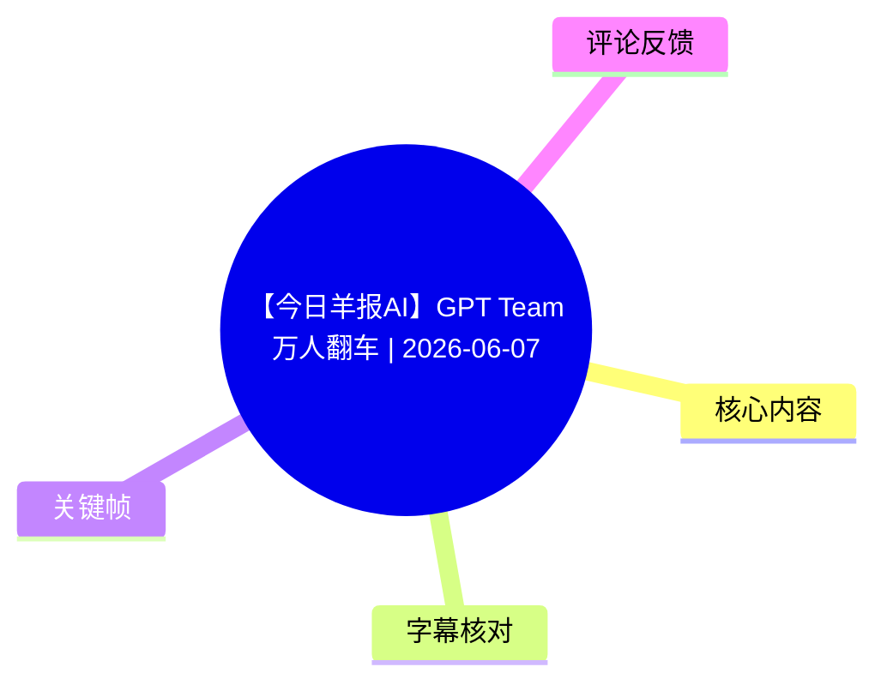
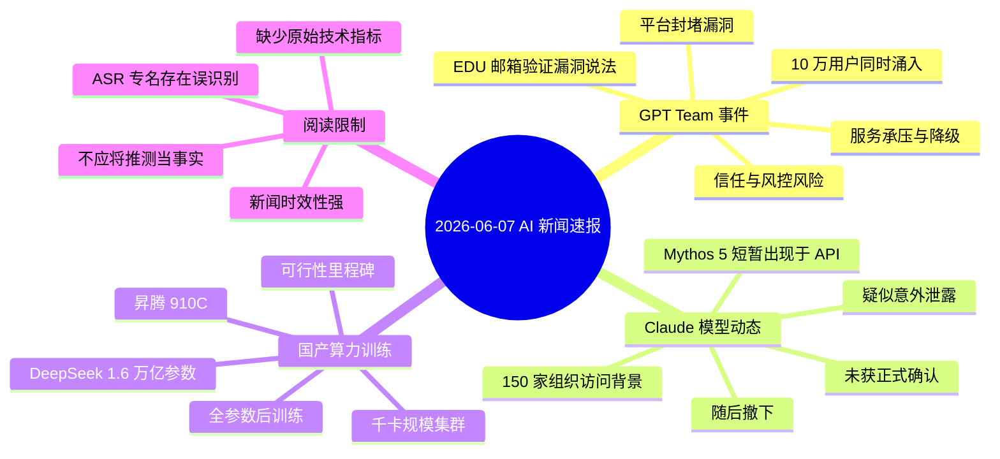

# 【今日羊报AI】GPT Team万人翻车 | 2026-06-07

> 来源：[Bilibili 视频](https://www.bilibili.com/video/BV1gMEx6BERe)  
> UP 主：Youngs羊示｜合集：AIcode｜视频时长：100 秒  
> 本期为 AI 新闻速报。标题、简介标注日期为 **2026-06-07**；其中事件均应视为该日期附近的新闻陈述，后续状态可能已经变化。

## 小结

视频以约 100 秒汇总了三件 AI 圈热点：其一，GPT Team 被指因教育邮箱（EDU）验证漏洞遭到大量用户涌入，视频称高峰有 **10 万用户同时在线**，并称服务因此受压；其二，Claude 的一个被称为 **Mythos 5** 的模型据称曾短暂出现在 API 中、随后下架；其三，**千卡规模昇腾 910C 集群**被称已跑通 DeepSeek **1.6 万亿参数**模型的全参数后训练。

第一条新闻的重点不在于获取方式，而在于身份／资格验证一旦被绕过，传播会将单点漏洞迅速放大成服务容量、付费体系和平台信任问题。视频叙述的事件链为：漏洞被发现并传播、用户集中涌入、服务端承压、平台降级和封堵、活动结束。

第二条新闻的证据强度较弱。视频使用“偷偷上线”“疑似意外泄露”“很可能”等措辞，说明“模型短暂出现”及其与下一代旗舰模型的关系并未在视频中得到官方确认；“此前访问权限扩展到 150 家组织”是视频给出的相关背景参数，而不是对模型正式发布的证明。

第三条新闻强调国产算力在超大规模训练上的可行性：千卡集群、昇腾 910C、1.6 万亿参数、全参数后训练是核心技术信息。但视频没有给出训练数据、训练时长、吞吐、精度、并行策略、稳定性指标或与其他平台的对照，因此不能据此推导其综合训练效率或商业可用性。

本视频适合希望快速了解当日 AI 行业动态的读者。它是新闻线索汇总，而非官方公告、技术报告或可复现实验教程；涉及漏洞、模型泄露和训练突破的结论，都应回到平台公告、论文、技术报告或原始截图进一步核验。

## 思维导图

## 目录

- [背景、范围与时效性](#背景范围与时效性-0034)
- [GPT Team：资格验证漏洞与服务挤压](#gpt-team资格验证漏洞与服务挤压-0034)
- [Claude：Mythos-5 短暂 API 上线传闻](#claudemythos-5-短暂-api-上线传闻-0037)
- [昇腾 910C：1.6 万亿参数全参数后训练](#昇腾-910c16-万亿参数全参数后训练-0101)
- [视频中的事件流程、可迁移经验与限制](#视频中的事件流程可迁移经验与限制-0034)
- [关键参数清单](#关键参数清单-0034)
- [字幕比对与文本校正](#字幕比对与文本校正-0034)
- [评论分析](#评论分析)
- [处理记录](#处理记录)

## 背景、范围与时效性 [00:34](https://www.bilibili.com/video/BV1gMEx6BERe?t=34)

视频标题为“今日羊报 AI”，简介明确列出三项热点：GPT Team 的 SSO／教育邮箱漏洞与并发挤压、Claude Mythos 5 的短暂 API 出现、以及昇腾 910C 集群完成 DeepSeek 大参数模型训练。ASR 原始分段从 **00:34.040** 开始识别到新闻口播，因此本篇新闻主体时间轴以该真实 ASR 起点为准。

需要注意两层时效性：

1. **新闻时效性**：视频对应日期为 2026-06-07。漏洞是否已修复、API 模型是否仍可见、训练成果是否有后续技术细节，均可能在发布后变化。
2. **证据时效性与层级**：视频属于二次播报。其内“发现”“疑似”“很可能”等措辞反映的是播报时的线索或判断，并不等同于 OpenAI、Anthropic 或相关训练方的正式确认。

> 图：画面以“今日羊报 AI”演播室呈现，并在底部概括“十万人同时挤爆服务器、Claude 偷偷上线新模型又被秒删、国产算力跑通万亿参数训练”。它直观对应本期的三段新闻结构，适合作为全文的主题索引。

## GPT Team：资格验证漏洞与服务挤压 [00:34](https://www.bilibili.com/video/BV1gMEx6BERe?t=34)

### 视频陈述的事件经过

ASR 在 00:34.040—00:36.500 的原始分段中集中播报：一名俄罗斯用户发现教育邮箱相关漏洞；使用带有 `@wishtoapp.edu.kg` 后缀的邮箱，据称可以免费激活 GPT Team。随后消息传播，大量用户集中进入，视频称 **10 万用户同时涌入 Team** 并将服务器“挤爆”。

视频进一步称，平台侧出现降级处置，OpenAI 紧急封堵漏洞，活动最终结束；并提及有人以很低成本开通 Team 账号。这里的“很低成本”在 ASR 中识别不清，且没有可靠画面或原始资料可校正具体金额，本文不将其写为确定数值。

### 技术与运营含义

从视频叙述可整理出如下因果链，但这只是对播报内容的结构化复述：

1. 教育资格验证存在可被错误接受的邮箱域名或身份校验路径。
2. 获取资格的消息在网络中快速扩散。
3. 用户在短时间内以相近目标集中发起注册、登录或开通请求。
4. 服务的认证、注册、套餐分配或后端资源因此承受异常并发压力。
5. 平台采取降级、封堵或修正资格验证等措施，结束异常活动。

视频没有说明漏洞究竟位于 SSO 协议、域名白名单、学校资格库、账户创建流程还是套餐权益分配环节。因此，不能把“教育邮箱漏洞”进一步解释成某种确定的技术漏洞类型，更不能据此复现或尝试绕过平台资格验证。

> 图：画面以机房告警视觉表现服务压力，并显示“用 @wishtoapp.edu.kg 后缀的邮箱”的视频字幕。它有助于将“资格验证问题”与“突发流量／服务承压”两层影响区分开；该图是新闻表达画面，不是漏洞技术证据或操作指引。

### 视频给出的判断

视频的结论是：短期“狂欢”会透支平台信任。这个判断对应的是服务公平性与资格验证的风险，而非单纯的服务器性能问题。对于提供教育优惠、团队套餐或试用权益的平台，资格校验与异常流量控制需要同时成立：只封一个域名不能证明同类验证缺陷已完全消失，只扩容也不能解决非授权资格涌入的问题。

## Claude：Mythos 5 短暂 API 上线传闻 [00:37](https://www.bilibili.com/video/BV1gMEx6BERe?t=37)

### 视频播报内容

在 ASR 原始分段 **00:36.500—01:00.520** 中，视频称 Anthropic 曾将一个名为 **Mythos 5** 的新模型放上 API，但不久后撤下。视频还提到，此前 Mythos 的访问权限“刚扩展到 **150 家组织**”，这次短暂出现被描述为“疑似一次意外泄露”。

视频称社区对此反应强烈：有人截到画面，也有人批评 Anthropic 再次进行“饥饿营销”。这些均为视频转述的社区反应，不能作为模型存在、开放范围或产品策略的独立验证。

### 需要严格区分的事实层级

| 内容 | 视频中的表述强度 | 本文处理方式 |
| --- | --- | --- |
| API 中曾短暂出现名为 Mythos 5 的模型 | “偷偷上线”“没多久就撤掉” | 作为视频播报的事件线索记录，未视为官方确认。 |
| Mythos 访问权扩展到 150 家组织 | 直接陈述 | 作为视频提供的背景参数记录，缺少原始公告佐证。 |
| 这是一次意外泄露 | “疑似” | 明确保留不确定性。 |
| Mythos 5 是下一代旗舰测试版本 | “很可能” | 仅为视频推测，不能据此判断模型能力、发布日期或产品定位。 |

### 对开发者和观察者的启示

若 API 控制台、模型列表或短时返回结果出现未公告模型，稳妥做法应是记录可公开核验的时间、接口响应和官方状态页，再等待官方说明；不应仅凭短暂可见的名称推断性能、权限、价格或上线日期。本视频没有提供 API 调用参数、模型能力测试、上下文长度、定价、速率限制或正式文档，因此不存在可复现的使用步骤。

## 昇腾 910C：1.6 万亿参数全参数后训练 [01:01](https://www.bilibili.com/video/BV1gMEx6BERe?t=61)

### 视频播报的技术结论

ASR 原始分段 **01:00.520—01:24.700** 称：**千卡规模的昇腾 910C 集群**成功跑通了 **DeepSeek 1.6 万亿参数模型的全参数后训练**。视频将此称为国产 AI 算力的里程碑，并认为其证明了国产算力在超大规模训练任务上的可行性。

这里有三个不可互换的技术关键词：

- **千卡规模**：指集群规模量级，视频未给出确切卡数、节点数、网络拓扑或互联方案。
- **1.6 万亿参数**：是视频给出的模型参数量级。视频未说明该参数量对应的具体模型版本、稠密／混合专家结构、激活参数量或模型配置。
- **全参数后训练**：视频强调不是只训练少量适配器参数的轻量微调；但未说明所含阶段、数据规模、优化器、精度格式、checkpoint 策略或评测标准。

### 该成果能说明什么，不能说明什么

**可以按视频表述理解为：**

- 在所述任务与集群条件下，昇腾 910C 集群完成了一个超大参数量模型的全参数后训练流程；
- 这为国产算力承担大规模训练工作负载提供了一个可行性信号；
- 在全球 AI 芯片供应紧张的背景下，该信号具有产业层面的现实意义。

**不能从视频直接推出：**

- 训练速度、MFU、吞吐或单位 token 成本优于其他 GPU／加速器方案；
- 训练过程在所有规模、模型架构和数据集上均稳定可用；
- 训练后的模型能力已经达到某一公开基准；
- 该集群的软硬件配置可被其他团队无条件复制。

### 缺失但决定技术评价的参数

视频没有提供以下指标，因而无法完成严格的训练工程评估：

- 集群精确规模与节点配置；
- 网络互联、通信库和并行策略；
- 模型结构与实际激活参数；
- BF16／FP16／FP8 等训练精度；
- 全局 batch size、序列长度、训练 token 数；
- 训练时长、有效吞吐、故障恢复记录；
- 收敛曲线、损失变化及下游评测结果；
- 与其他硬件平台的同任务对照。

## 视频中的事件流程、可迁移经验与限制 [00:34](https://www.bilibili.com/video/BV1gMEx6BERe?t=34)

### 视频实际提供的“步骤”

本片不是操作教程，没有演示账户开通、API 调用、模型训练配置或代码。可从视频中整理出的只有新闻事件顺序：

| 顺序 | 事件 | 视频支持范围 |
| --- | --- | --- |
| 1 | 教育邮箱相关的资格验证问题被发现。 | GPT Team 新闻陈述。 |
| 2 | 消息扩散，大量用户涌向服务。 | 视频称“10 万用户同时涌入”。 |
| 3 | 服务端承压，平台采取降级与封堵。 | 视频陈述，未给出官方处置细节。 |
| 4 | API 中出现 Mythos 5 的线索，随后撤下。 | 作为疑似泄露播报。 |
| 5 | 千卡昇腾 910C 集群完成 1.6 万亿参数全参数后训练。 | 作为技术里程碑播报。 |

### 可迁移的经验

以下是基于视频内容作出的风险整理，不是视频中已展示的具体操作方案：

1. **权益校验要以多因素验证为中心**：仅依赖邮箱后缀等单一标识，容易在大规模传播时成为风险放大器。
2. **异常资格事件与容量事件应联动处理**：资格校验异常会引发注册、登录、计费和资源分配的连锁高峰，风控、限流、降级与审计不能割裂。
3. **短暂出现的模型名称不等于发布**：在没有公告、文档和稳定可用接口前，不应将控制台线索写成既定产品事实。
4. **“跑通”是工程可行性信号，不是全面性能结论**：大型训练项目必须同时报告规模、稳定性、效率、收敛与评测，才能形成可比较的技术结论。

## 关键参数清单 [00:34](https://www.bilibili.com/video/BV1gMEx6BERe?t=34)

| 项目 | 视频给出的参数或名称 | 含义与边界 |
| --- | --- | --- |
| 视频时长 | 100 秒 | 元数据时长；ASR 诊断音频时长为 99.413 秒。 |
| GPT Team 并发规模 | 10 万用户同时在线／涌入 | 视频口径，未附平台监控或官方公告。 |
| 涉及身份线索 | 教育邮箱、`@wishtoapp.edu.kg` | 视频用于描述事件；不构成可用性保证，也不应尝试绕过资格验证。 |
| Claude 相关模型 | Mythos 5 | 名称依据视频标题简介与口播语境校正；并无正式发布材料。 |
| Mythos 访问背景 | 150 家组织 | 视频陈述，未提供组织名单、时间或权限范围。 |
| 训练集群规模 | 千卡规模 | 仅为量级，未提供确切加速卡数量。 |
| 训练硬件 | 昇腾 910C | 视频所称硬件型号。 |
| 模型参数量 | 1.6 万亿参数 | 未给出模型结构与实际激活参数。 |
| 训练形式 | 全参数后训练 | 未给出数据、优化器、精度、并行和评测指标。 |

## 字幕比对与文本校正 [00:34](https://www.bilibili.com/video/BV1gMEx6BERe?t=34)

### 比对结论

已检查站内字幕与本次 ASR。源素材存在可用音频：ASR 诊断未标记 `noAudioStream=true`，并报告语音覆盖约 **65.58%**、首段语音起点 **00:34.040**、末段语音终点 **01:39.240**。因此，本片不是“无音轨”视频。

不过，两份字幕的内容质量和时间轴都存在明显问题：

| 字幕来源 | 完整性 | 专有名词 | 时间轴 | 主要问题 |
| --- | --- | --- | --- | --- |
| Bilibili 站内字幕 `p01-ai-zh.srt` | 与本视频新闻主题不对应 | 无 GPT Team、Claude、昇腾等关键信息 | 00:00.120—01:02.760，形式完整 | 内容为“无法改变现状”“人生如棋”等励志文本，明显不是本片新闻口播，未采用。 |
| 本次 ASR 原始结果 `asr-result.json` | 覆盖四段新闻口播，诊断语音覆盖 65.58% | 多处误识别，但可借元数据和画面语境校正 | 原始段为 00:34.040—01:39.240；与 100 秒视频时长大体接近 | 单段文本过长、断句不足；导出的 SRT 后三段错误延展至 01:39.240 之外。 |
| 本次 ASR 导出 SRT | 表面有 4 段 | 误识别继承自 ASR | 第 2—4 段结束时间超过视频 100 秒时长 | 时间轴不可靠，未作为章节定位依据。 |

### 最终字幕选择

正文以 **ASR 原始 JSON 分段的起始时间**作为章节时间轴依据，分别使用 00:34、00:36.5、01:00.52、01:24.7 的真实分段时间；不使用时间越界的 ASR 导出 SRT。由于站内字幕内容完全不匹配，未将其纳入新闻转写。

以下为基于元数据、视频简介、已提供关键帧字幕和上下文进行的必要校正：

| ASR 误识别或不确定写法 | 采用写法 | 校正依据 |
| --- | --- | --- |
| `GPT Tim` | GPT Team | 视频标题、简介与关键帧字幕明确为 GPT Team。 |
| `Cloud`／`Anthrope` | Claude／Anthropic | 视频简介写明 Claude；ASR 的语境为模型 API 事件。 |
| `Messas5`／`Messass` | Mythos 5／Mythos | 视频简介明确写为 Claude Mythos 5。 |
| `DeepSec` | DeepSeek | 视频简介、标签中均出现 DeepSeek。 |
| `生騰910C` | 昇腾 910C | 视频简介明确为“昇腾910C”。 |
| `牵卡规模` | 千卡规模 | 结合中文语义与简介“千卡昇腾910C”校正。 |
| ASR 中“挤块钱” | 不确定，不保留具体金额 | 音频识别文本无法稳定还原，缺少画面或原始文本佐证。 |

## 评论分析

热评接口返回的可获取评论数为 **0**，没有可分析的热评前三条。

因此，本文不虚构观众观点，也不将视频简介、弹幕或其他来源的讨论替代为评论分析。元数据显示该视频当时回复数为 0，与“无可获取热评”的结果一致。

## 处理记录

- **Worker ID**：`worker-mrj0wbly-5dc4e50c`
- **模型**：`gpt-5.6-terra`
- **使用素材与工具结果**：读取视频元数据、视频简介、站内 SRT、ASR 诊断与原始分段、ASR SRT、关键帧清单／提供的关键帧画面、评论 JSON。
- **字幕选择**：站内字幕与视频主题明显不符，未采用；检查并采用本次 ASR 的原始 JSON 分段起点定位。ASR 导出 SRT 存在超出视频时长的时间轴异常，不作为定位依据。
- **关键帧选择依据**：`frames/frame-002.jpg` 展示本期三项新闻摘要，作为全片主题图；`frames/frame-003.jpg` 展示服务器告警意象及教育邮箱后缀字幕，服务于 GPT Team 事件说明。未为关键帧推定未经提供的精确时间点。
- **缓存清理**：素材清单未提供缓存清理执行日志；本文不声称已执行未记录的清理操作。
- **未解决问题**：缺少 OpenAI、Anthropic、训练执行方的原始公告或技术报告；GPT Team 事件的漏洞机制和费用信息无法由现有素材确认；Mythos 5 的正式名称、上线状态和能力未验证；昇腾训练的性能、收敛和配置指标未提供。
