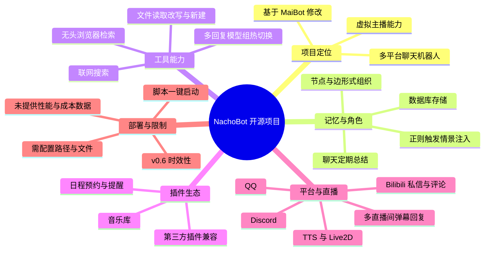
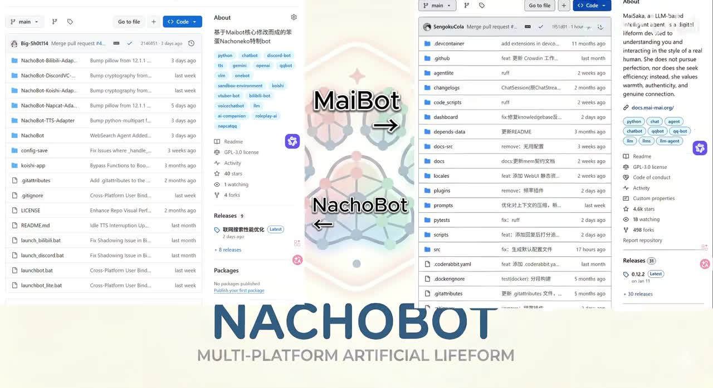
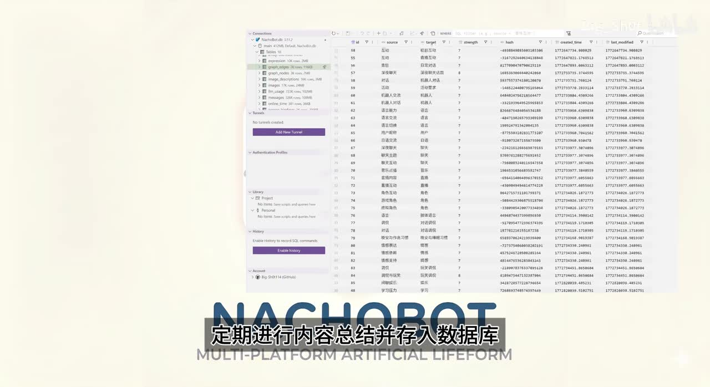
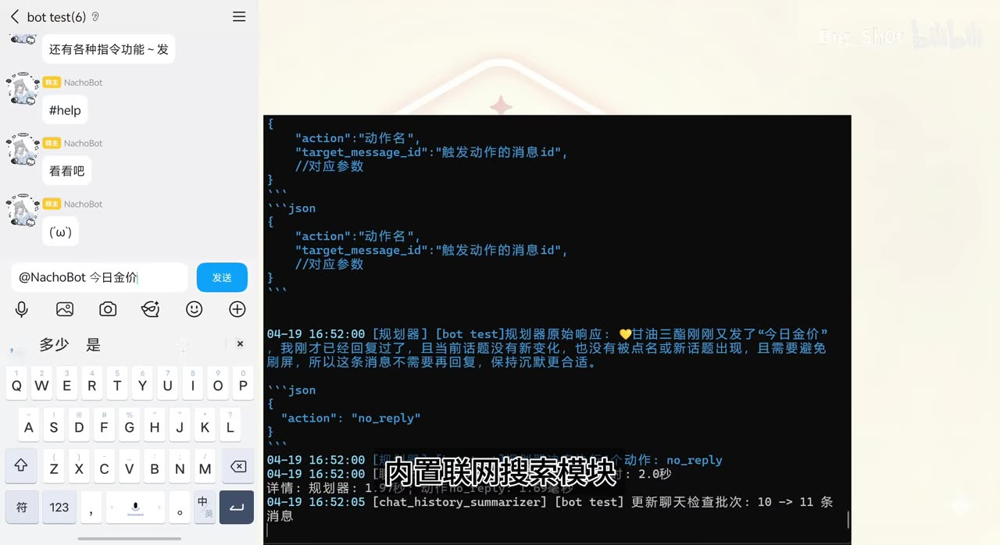
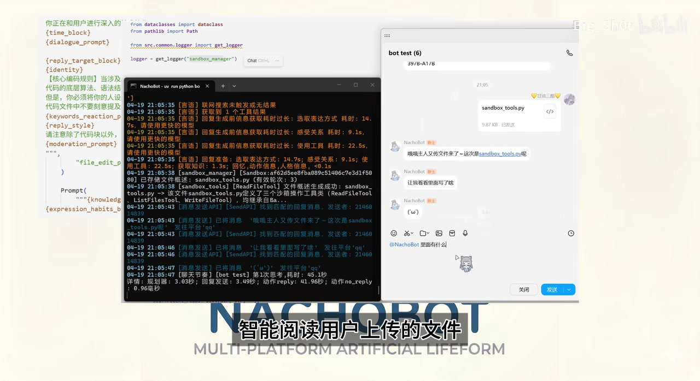

# 【开源】你有这么可爱的赛博女儿自己直播赚钱

> 来源：[Bilibili 视频](https://www.bilibili.com/video/BV18bo4BqEYP) 
> UP 主：Big_Sh0t｜视频时长：05:21｜分类集合：AIcode  
> 视频简介：感谢各位大佬为开源社区作出的贡献！

## 小结

视频介绍了开源项目 **NachoBot**：它被定位为一个“多平台人工生命体”式的聊天与直播机器人。根据视频陈述，项目由作者在 MaiBot 基础版本上修改而来，重点增强了长期记忆、情景注入、联网检索、文件读写、插件、多模型组切换及跨平台适配能力。

项目的核心思路并非只让大模型逐条回复消息，而是让机器人通过周期性总结保存聊天内容、借助节点与边组织记忆，并在特定上下文中通过正则规则注入情景提示。视频称，这些机制可用于维持角色设定、补足特定场景信息，并降低 AI 幻觉风险；但视频没有给出量化评测，因此“降低幻觉”的具体效果仍属项目方主张。

在生产力功能上，NachoBot 可由模型判断是否需要联网搜索或文件读写：联网时经无头浏览器检索，并在首次结果基础上进行二次查询；文件场景中可读取用户上传文件，按要求改写或新建文件并返回。它还支持多个回复模型组，通过指令热切换，以应对上游 API 服务不可用的情况。

平台侧，视频明确提到 QQ、Discord 与 Bilibili 等接入方向；Bilibili 侧支持私信、动态及视频评论区回复、对自身评论的回复，以及对评论区 `@` 的响应。直播方面，可接入多个直播间回复弹幕，并可将某个房间设为主直播间、启用 TTS 与 Live2D 以作为虚拟主播运行。

部署门槛是视频强调的卖点之一：项目据称已提供脚本一键启动和依赖自动管理；用户修改若干路径或将配置文件放入正确目录后，运行批处理脚本即可安装依赖并拉起底层组件。这里的“零编程基础部署”是视频用语，实际仍需要正确填写路径、准备配置和对应平台账号条件。

时效性方面，视频提到“最近的 v0.6 版本”新增平台绑定功能。该版本信息、可用插件、平台接口状态、上游模型服务与部署脚本均可能随项目更新而变化；素材中未提供仓库 URL、许可证全文、硬件最低配置、模型成本或平台授权细则，使用前应以项目仓库当前文档为准。

## 思维导图

## 目录

- [项目定位与演示开场](#项目定位与演示开场-000012)
- [记忆、情景注入与联网检索](#记忆情景注入与联网检索-000031)
- [文件沙盒、多模型组与插件](#文件沙盒多模型组与插件-000117)
- [多平台接入与语音频道](#多平台接入与语音频道-000231)
- [Bilibili 互动与直播虚拟主播](#bilibili-互动与直播虚拟主播-000317)
- [直播低延迟优化与平台绑定](#直播低延迟优化与平台绑定-000349)
- [部署步骤、参数与限制](#部署步骤参数与限制-000457)
- [字幕比对](#字幕比对)
- [评论分析](#评论分析)
- [处理记录](#处理记录)

## 项目定位与演示开场 [00:00:12](https://www.bilibili.com/video/BV18bo4BqEYP?t=12)

开场以角色口吻完成自我介绍，随后进入项目说明。站内字幕与本次 ASR 都能确认项目名称近似为 **NachoBot**；关键帧中的 GitHub 页面中央文字也清晰呈现 “MaiBot → NachoBot” 与 “NACHOBOT MULTI-PLATFORM ARTIFICIAL LIFEFOR[M]”，可作为项目名称和定位的画面佐证。

视频称 NachoBot 是基于“铅弹可乐大佬”的 MaiBot 某个 `0.10.3` 相关版本修改而来。不过站内字幕写作“0.10.3倍的版本”，ASR 识别为“0.1 0.3倍”，两者均不足以可靠确定准确的上游版本号，因此不应据此推断项目的具体分支或提交版本。

视频所述的主要改动方向包括：

1. 针对核心进行大量修改和客制化。
2. 增强、优化记忆储存与提取模块。
3. 面向用户的情感需求、私聊和群聊场景。
4. 扩充联网搜索、文件处理、模型组、插件与平台适配能力。

> 图：画面同时展示多个 GitHub 仓库页面，并以“MaiBot → NachoBot”强调项目源流；它有助于区分视频介绍的 NachoBot 与其上游 MaiBot。画面可见仓库与更新记录，但未提供可直接访问的仓库链接，本文不据此补写 URL。

## 记忆、情景注入与联网检索 [00:00:31](https://www.bilibili.com/video/BV18bo4BqEYP?t=31)

### 记忆存储与周期性总结

视频称，NachoBot 会在私聊和群聊中**定期进行内容总结并存入数据库**。随后会对每日内容进行解析，并以“节点与边”的形式储存。这里可以理解为项目试图将聊天信息从纯文本历史提升为具有关联关系的记忆结构，但视频没有说明：

- 使用的数据库类型；
- 节点、边的精确定义；
- 检索排序或召回算法；
- 记忆保存期限、删除策略；
- 用户是否可导出、审计或清除记忆。

因此，“节点与边”的描述只能记录为视频的架构表述，不能进一步等同于某种特定图数据库或知识图谱实现。

> 图：画面展示数据库管理界面，并配有“定期进行内容总结并存入数据库”的字幕。它直观说明视频强调的是可持续积累的记忆，而不是仅依赖单轮上下文。

### 情景注入：角色补全与幻觉控制

视频称项目支持通过 **ORAT**（站内字幕如此显示，具体缩写未被可靠展开）添加“情景注入系统”。其工作描述为：

1. 为经常出现的特定情形预设指定内容；
2. 在上下文中通过正则表达式触发；
3. 将对应内容注入回复上下文；
4. 用于补全角色性格设定，并避免或减少 AI 幻觉。

这是一种“规则触发 + 提示词注入”的设计思路。其优点是可针对高频场景进行约束，但限制也明显：规则覆盖范围有限，正则触发可能误触发或漏触发；而且提示词注入并不能保证模型事实正确。视频未提供对照实验、错误率或实际提示词内容。

### 联网搜索流程

视频描述的联网搜索模块包含以下顺序：

1. 由 LLM 智能判断当前对话是否需要联网搜索。
2. 通过无头浏览器自行搜索和查询。
3. 基于第一次查询结果进行“VRS 二次查询”（站内字幕如此转写，缩写具体含义不明）。
4. 将查询结果整合、注入上下文。
5. 生成最终回复。

> 图：左侧为移动端聊天窗口，中间是带有规则器、回复、搜索耗时等信息的控制台；字幕直接标出“内置联网搜索模块”。该帧有助于理解搜索不是单独网页工具，而被纳入机器人回复决策链路。

需要注意，视频只描述了搜索流程，没有说明搜索引擎来源、网页可信度筛选、来源引用方式、反爬处理、隐私处理或失败回退策略。涉及新闻、医学、法律、金融等高风险内容时，不能因机器人“联网”而默认其输出准确。

## 文件沙盒、多模型组与插件 [00:01:17](https://www.bilibili.com/video/BV18bo4BqEYP?t=77)

### 文件读写与生产力支持

视频把“沙盒系统”作为生产力能力的一部分，描述的流程为：

1. LLM 判断用户是否存在文件读写意图。
2. 系统智能阅读用户上传的文件。
3. 根据用户要求改写现有文件，或新建文件。
4. 将处理后的文件发送给用户。

画面演示中，用户上传了名为 `sandbox_tools.py` 的文件，并询问“里面有什么”；机器人返回文件已收到并准备查看，随后用户提出进一步修改要求。控制台中也可见文件处理相关日志和工具名，但素材不足以确认其完整权限边界。

> 图：画面并列展示代码、控制台日志和桌面端聊天窗口，字幕为“智能阅读用户上传的文件”。它是视频对文件处理能力最直接的演示证据，也提示部署者需要格外重视文件访问范围与执行隔离。

**使用限制与安全提醒：**

- 视频说的是“文件读写意图判断”，并未说明模型误判时的确认机制。
- 未说明沙盒是否完全隔离、是否能执行上传代码、是否限制网络访问。
- 若机器人部署在包含敏感文件的主机上，应避免给予其不必要的目录读取或写入权限。
- 对外发送文件前，应检查是否包含凭据、路径、聊天记录或其他隐私信息。

### 模型组与热切换

视频还提到更细致的模型组分类，可应对不同模型需求；同时可配置多个回复模型组，并通过指令热切换，目的在于避免上游 API 服务不可用时机器人完全失效。

这一设计适合具备多个模型供应商、不同成本/延迟要求的部署场景。视频未提供：

- 模型组配置字段；
- 路由策略；
- 热切换命令示例；
- 上下文、记忆在切换中的兼容性；
- 不同模型的价格、速率限制和输出质量对比。

### 内置与第三方插件

视频列举的插件能力包括：

| 插件/类别 | 视频描述的用途 | 备注 |
| --- | --- | --- |
| 信使插件 | 向 bot 发起日程预约，具备定时提醒功能 | “boss”等称谓来自字幕识别，具体对象命名不确定 |
| 音乐库插件 | 上传音频文件，通过自然语言触发，在聊天中以气泡形式发送 | 字幕将音频格式转写为 “double EV” / “WUV”，无法可靠确认准确格式 |
| 第三方插件 | 兼容 MaiBot 插件商店中的插件 | 视频称可对优质第三方插件修改优化，并保留原作者署名 |
| 聊天记录总结插件 | 被举为第三方插件例子 | 原作者名称在字幕中存在识别误差 |
| “麦麦空间”插件 | 被举为第三方插件例子 | 插件名及作者拼写应以仓库为准 |

视频关于保留原作者署名的表述，反映了作者对二次修改插件的署名处理态度；但实际许可证兼容性仍需逐个核对原插件许可证，不能仅凭口头说明判断可再分发范围。

## 多平台接入与语音频道 [00:02:31](https://www.bilibili.com/video/BV18bo4BqEYP?t=151)

视频称，除 MaiBot 原生支持的 QQ 外，NachoBot 还通过某个“框架”连接 Discord，并通过 API 连接 Bilibili；三者均使用各自独立的适配器连接核心。

由于站内字幕将框架名称识别为“KVC”，ASR 对这一段识别为“LibreApr”等明显错误文本，无法从现有素材准确还原框架的正式名称。因此可确认的是**独立适配器架构**与 QQ / Discord / Bilibili 三类接入目标，不能确认中间适配框架的准确技术名称。

视频还说明，Discord 平台除了针对平台特性的移植适配外，机器人可以加入语音频道自由发言，并在他人说话时不进行打断。该能力通常意味着需要语音活动检测、播放队列或发言状态协调，但视频没有展示具体算法、音频输入来源、打断判定阈值或权限配置。

## Bilibili 互动与直播虚拟主播 [00:03:17](https://www.bilibili.com/video/BV18bo4BqEYP?t=197)

### Bilibili 评论与私信能力

视频明确列出的 Bilibili 互动范围包括：

- 基础私信；
- 对自己动态及视频下评论区的回复；
- 对自己已发送评论的回复；
- 对他人在评论区中 `@` 机器人的回复。

这说明项目试图让机器人在 Bilibili 内容生态内持续互动，而不局限于单个聊天窗口。使用这类能力时，需要特别留意 Bilibili 当前开放能力、账号权限、频率限制、反垃圾规则与自动化行为规范；视频未给出这些平台合规细节。

### 多直播间与虚拟主播模式

视频称机器人支持接入多个直播间执行普通弹幕回复，也可将某个特定房间设为“主直播间”，并开启：

- **TTS**：文本转语音；
- **Live2D**：驱动虚拟形象显示；

从而将机器人作为虚拟主播运行。

这与标题中“自己直播赚钱”的叙事相关，但视频并未展示收入、打赏结算、直播审核通过率、观众规模或商业化配置。因此，标题中的“赚钱”不能解读为项目保证收益；素材能够确认的是其具备被用于直播互动和虚拟主播呈现的设计目标。

## 直播低延迟优化与平台绑定 [00:03:49](https://www.bilibili.com/video/BV18bo4BqEYP?t=229)

### 低延迟场景的本地模型与搜索流程

针对直播间低延迟要求，视频称项目内置本地轻量级 **VLM** 和 **ASR** 模型，用户可按设备情况选择是否启用。

- **VLM**：视觉语言模型，通常用于理解图片或画面。
- **ASR**：自动语音识别，用于将语音转换为文本。

视频没有给出模型名称、显存占用、CPU/GPU 要求、推理速度或准确率，因而不能据此判断普通电脑是否能流畅使用。部署时应按仓库实际要求选择是否启用本地模型，并预留直播编码、TTS、Live2D 和大模型请求的总体资源。

直播间的联网搜索模块被描述为“特制优化版本”，关键差异是：

1. 最小化调用 LLM 的数量；
2. 由回复模型组全权判断是否需要搜索；
3. 对有必要检索的内容打标记并生成问题；
4. 系统检索后，将结果返回给大模型生成最终回复。

这种设计试图减少不必要的模型调用，以降低直播响应延迟。不过搜索本身仍受网络、页面加载、搜索引擎响应和模型输出速度影响；视频未给出端到端延迟数据。

### v0.6 平台绑定与跨平台记忆

视频称，“最近的 v0.6 版本”新增平台绑定功能。用户在不同平台发送指定验证码后，可绑定其不同平台账号。绑定后，用户将拥有一个“模制标志”（站内字幕原词，可能是某种标识符，但无法可靠确认正式名），用于存放用户在多平台分别与机器人的记忆。

视频进一步描述：

- 即使解绑，各个平台原有记忆仍会分别保留；
- 绑定期间新增的记忆会被复制三份；
- 分别存入原本的平台侧。

这项机制的目标是跨平台身份关联与记忆同步，但视频没有说明验证码有效期、账号冒用防护、解绑后的数据删除能力、复制冲突处理、记忆合并规则及隐私告知机制。对部署者而言，这些问题比“能否绑定”更关键，尤其是在机器人长期保存聊天内容时。

## 部署步骤、参数与限制 [00:04:57](https://www.bilibili.com/video/BV18bo4BqEYP?t=297)

视频给出的部署描述较简略，但可整理为以下实际顺序：

1. 获取项目文件与所需配置。
2. 根据自己的环境，修改“几条路径”；或将配置文件放入正确目录。
3. 点击/运行批处理脚本。
4. 脚本自动安装依赖。
5. 脚本拉起所需底层组件。
6. 根据需要配置平台适配、模型组、直播间、TTS、Live2D、本地 VLM/ASR 等功能。

视频宣称这一流程可实现“零编程基础部署”，但这里的“零编程”不等于“零配置”。至少仍需具备以下准备：

| 准备项 | 视频可确认的信息 | 素材未提供的信息 |
| --- | --- | --- |
| 路径配置 | 需要修改若干路径或正确放置配置文件 | 具体文件名、字段和目录结构 |
| 依赖管理 | 批处理脚本可自动安装依赖 | 支持的操作系统、Python/Node 版本、镜像源 |
| 底层组件 | 脚本会拉起全部底层组件 | 组件清单、端口、启动顺序与故障排查方式 |
| 模型服务 | 支持多个回复模型组及本地轻量模型 | API Key 配置、供应商、模型版本和费用 |
| 平台接入 | 涉及 QQ、Discord、Bilibili 与直播间 | 鉴权方式、权限范围、账号风控与接口限制 |
| 内容与数据 | 保存聊天记忆、上传文件、跨平台绑定 | 数据位置、加密、备份、删除与隐私策略 |

### 最终结论

NachoBot 的价值在于将角色化对话、长期记忆、工具调用、多平台适配和直播展示整合到一个开源项目中。对希望搭建个人 AI 伙伴、社群机器人或直播互动角色的用户，它提供了较完整的功能方向。

但在实际采用前，应把视频中的功能宣传与可运行条件分开验证：确认仓库版本、许可证、平台接口可用性、账号合规性、模型费用、机器性能、数据安全边界及自动回复风控。视频明确称项目“完全开源免费”，但这通常只代表项目代码本身的获取成本；第三方模型 API、服务器、域名、代理、语音服务和直播运营仍可能产生费用。

## 字幕比对

| 字幕来源 | 完整性 | 专有名词 | 时间轴 | 主要问题 |
| --- | --- | --- | --- | --- |
| Bilibili 站内字幕 | 覆盖从 00:00:00 到 00:05:19，包含中段角色对白与主要功能介绍 | 项目名、平台名和技术缩写存在不少同音/错字，但整体优于 ASR | 分段细，时间可直接使用 | 如“ORAT”“KVC”“VRS”“double EV”等无法可靠还原；上游版本表述不清 |
| 本次 ASR 字幕 | 16 个长分段，语音覆盖约 290.09 秒，占总时长约 90.6% | 对 NachoBot、MaiBot、Bilibili、Discord、插件名等识别误差较多 | 具有真实起止时间；最大无语音/未识别间隔为 00:02:59.270—00:03:14.530 | 长句合并严重，专有名词如 “Edgyobot”“Belly Belly”“LibreApr”失真，不宜直接作为术语依据 |

### 最终字幕选择与校正原则

本文以**站内字幕为主要内容与时间轴依据**，并逐段检查本次 ASR 的起止时间与语义覆盖。ASR 诊断显示语言为中文、置信度约 `0.9897`、存在实际音频流，且没有 `noAudioStream=true` 标记；因此并非无音轨视频。

以下内容通过关键帧画面、站内字幕与上下文进行了谨慎校正：

- `Edgyobot` / `ajobot`：结合关键帧 GitHub 标识，统一记作 **NachoBot**。
- `MyBot`：结合画面中心“MaiBot → NachoBot”，记作 **MaiBot**。
- `Belly Belly`：按站内字幕与视频平台语境记作 **Bilibili**。
- `DISCD` / `Discords`：按站内字幕语境记作 **Discord**。
- “VLM”“ASR”“TTS”“Live2D”：站内字幕和 ASR 对这些缩写存在不同程度误识别，但其在对应功能语境中可相互印证。
- 上游版本号、适配框架名、部分插件作者和音频格式：现有字幕互相无法可靠验证，本文保留不确定性，不擅自补全。

## 评论分析

本次素材仅获取到 **2 条**热评，未达到三条；以下仅分析可获取内容，不将评论观点视为已验证事实。

1. **白貓貓醬**（25 赞）：  
   > “我太蠢了，要是能一键下载就好了”

   评论表达的核心诉求是希望项目提供更直接的“一键下载”入口。这与视频中强调的“一键启动”“自动管理依赖”相呼应，说明观看者仍可能把“部署便利”与“获取项目便利”区分开来。评论没有说明其遇到的具体下载障碍，也不能据此判断项目是否真的缺少发布包或下载方式。

2. **黄昏要塞**（7 赞）：  
   > “从小猫的时候到现在云养成女儿，莫名的感觉十分的开心^_^[星星眼]”

   该评论体现出用户对机器人角色长期迭代和陪伴感的情感认同，与视频强调“情感需求”“记忆”和“赛博女儿”的定位一致。它是社区体验反馈，不构成对项目技术稳定性、实际能力或商业化效果的验证。

## 处理记录

- Worker ID：`worker-mrj0www4-e8d79408`
- 模型：`gpt-5.6-terra`
- 使用的素材与工具结果：视频元数据、站内时间轴字幕 `p01-ai-zh.srt`、本次 ASR 结果 `asr-result.json` 与 `transcript.srt`、关键帧目录 `frames/`、热评数据 `comments/comments.json`。
- ASR 检查：本次 ASR 使用 `medium` 模型、CUDA、`float16`；识别语言为中文，语言概率约 `0.989746`，带真实时间戳。诊断未标记 `noAudioStream=true`，故按有音轨视频处理。
- 字幕选择：以站内字幕作为主时间轴与主语义来源；对项目名、平台名等明显错字结合 ASR、关键帧和语境谨慎校正；对无法验证的版本号、框架名、插件作者名和格式名保留原始不确定性。
- 关键帧选择依据：选用 `frame-001` 说明项目与 MaiBot 的关系及 GitHub 仓库画面；`frame-002` 对应数据库记忆总结；`frame-003` 对应联网搜索模块；`frame-004` 对应上传文件读取与改写演示。图片均使用相对路径，且仅用于支撑正文中已有的视频陈述。
- 热评处理：仅分析可获取的前 2 条热评；素材未返回第 3 条，未扩展抓取或补造评论。
- 缓存清理：提供的素材中未包含缓存清理执行记录，无法确认是否已清理；本文不虚构清理结果。
- 未解决问题：未提供项目仓库 URL、准确上游版本、完整配置说明、硬件要求、许可证细则、模型成本、平台鉴权与数据隐私机制；这些均需以项目后续仓库和文档为准。
