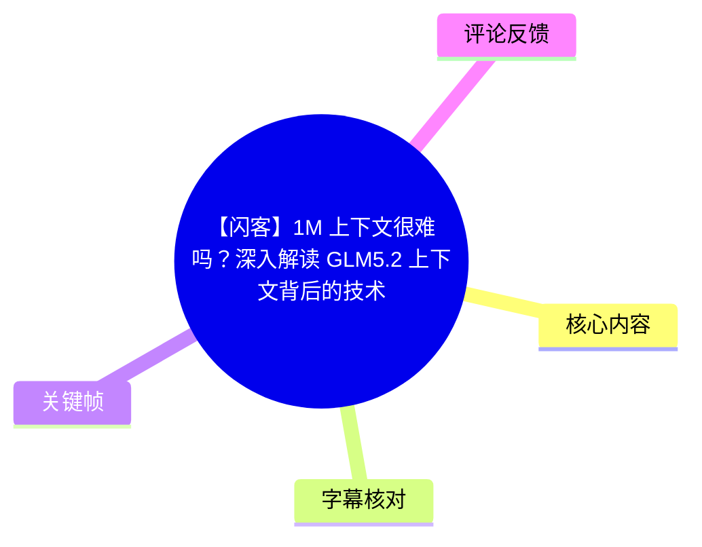
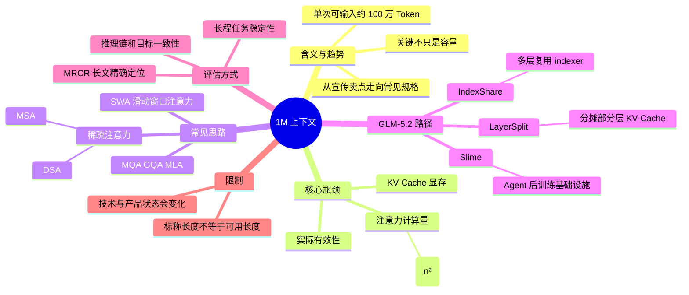
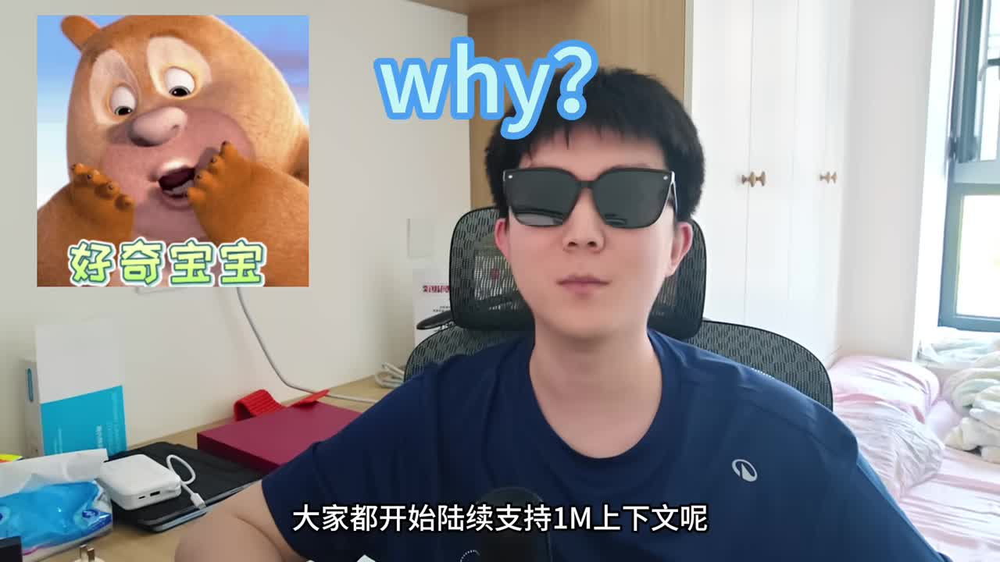
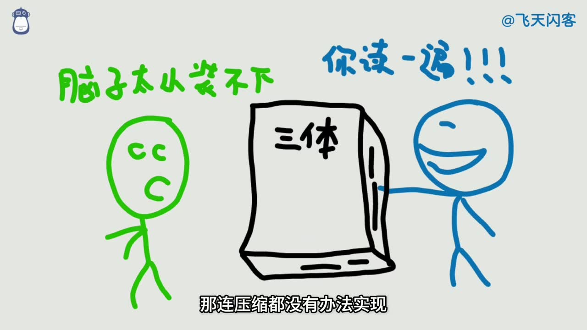
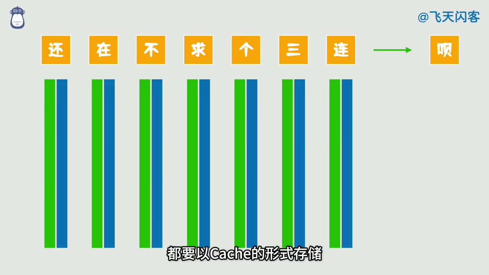
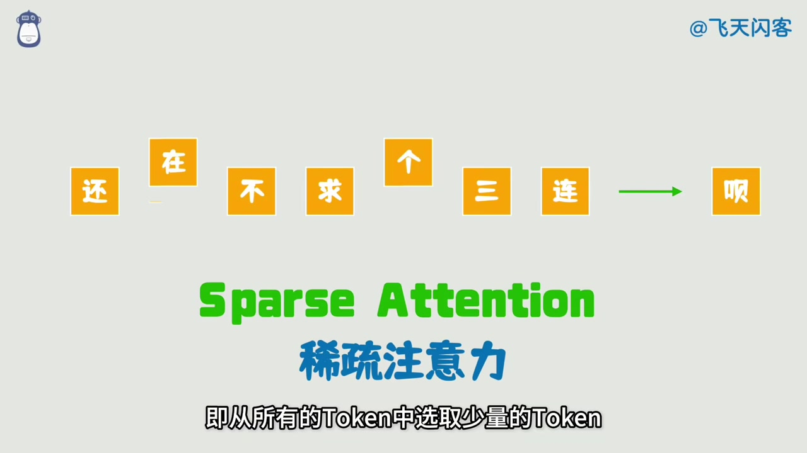

# 【闪客】1M 上下文很难吗？深入解读 GLM5.2 上下文背后的技术

> 来源：[Bilibili 视频](https://www.bilibili.com/video/BV1uVLX6uEYC)  
> UP 主：飞天闪客｜时长：06:19｜合集：AIcode  
> 视频简介提供的官方资料入口：[GLM-5.2 官方博客](https://z.ai/blog/glm-5.2)

## 小结

视频围绕“**1M 上下文**”展开：它指某个具体模型能够在一次请求中接收约 **100 万个 Token**。UP 主认为，长上下文从过去颇具宣传意味的能力，正在成为主流模型的常见规格；但“标称支持 1M”不等于模型能够经济、准确、稳定地使用这段上下文。

长上下文的两项底层成本是：其一，注意力机制带来的计算量会随上下文长度呈 **\(O(n^2)\)** 增长；其二，每个 Token 的 KV 向量需要保留在 **KV Cache** 中，持续消耗显存。视频将 MQA、GQA、MLA 归入缓解 KV Cache 压力的手段，并将 SWA（滑动窗口注意力）与稀疏注意力作为降低注意力计算代价的思路。

视频以 GLM-5.2 为例，介绍三项与长上下文相关的技术或基础设施：**IndexShare** 通过多个注意力层复用同一 indexer 的结果减少索引计算；**LayerSplit** 让单张 GPU 仅持有部分层的 KV Cache，以降低单卡显存占用；**Slime** 则是面向 Agent 强化学习和复杂后训练任务的基础设施框架。

评估长上下文不能只看“能否塞入整本《三体》”。视频给出两个更实用的方向：一是长文本中的**精确定位与逐字输出**，例如 MRCR；二是 Agent 在超长任务运行中能否保持上下文、逻辑和目标，不因遗忘而逐渐偏航。视频中展示了在 ZCode 内用 GLM-5.2 测试 MRCR 问题，并称输出与标准答案“一字不差”。

这是一支基于视频讲解与其引用技术报告的科普整理，不构成对各模型能力、成本、基准分数或技术细节的独立复现验证。模型版本、上下文上限、产品可用性及具体实现都可能随发布更新变化；截至视频素材所反映的时点，最重要的判断不是“谁有 1M”，而是谁能以较低成本、较高可靠性把 1M 上下文用于长程任务。

## 思维导图

## 目录

- [背景：1M 上下文为何成为话题](#背景1m-上下文为何成为话题)
- [1M 的含义与小窗口的实际痛点](#1m-的含义与小窗口的实际痛点)
- [长上下文的底层成本：计算量与 KV Cache](#长上下文的底层成本计算量与-kv-cache)
- [从滑动窗口到稀疏注意力](#从滑动窗口到稀疏注意力)
- [如何判断长上下文是否真的有效](#如何判断长上下文是否真的有效)
- [长程 Agent 任务：不遗忘、不偏航](#长程-agent-任务不遗忘不偏航)
- [GLM-5.2 的组合方案：IndexShare、LayerSplit 与 Slime](#glm-52-的组合方案indexsharelayersplit-与-slime)
- [结论：从容量竞争转向有效利用](#结论从容量竞争转向有效利用)
- [字幕比对](#字幕比对)
- [评论分析](#评论分析)
- [处理记录](#处理记录)

## 背景：1M 上下文为何成为话题

### 行业叙事与问题意识 [00:00](https://www.bilibili.com/video/BV1uVLX6uEYC?t=0)

视频开头将“1M 上下文”描述为正在迅速成为标配的能力，并列举海外的 Claude、OpenAI、Gemini，以及国内的 DeepSeek、MiniMax、MiMo 和最新 GLM 等模型或厂商。这里是视频的行业观察，不应直接理解为这些产品在所有版本、所有入口、所有计费档位下都具备相同的 1M 输入能力。

UP 主提出三个问题：

1. 为什么各家开始陆续支持 1M 上下文？
2. 不同模型的 1M 上下文效果是否相同？
3. 智谱最新 GLM-5.2 的方案有什么不同？

> 图：画面以“why?”与“好奇宝宝”引出问题，人物字幕明确指向“大家都开始陆续支持 1M 上下文呢”。它适合作为视频讨论从产品趋势切入的视觉锚点。

### 1M 的含义与小窗口的实际痛点 [00:23](https://www.bilibili.com/video/BV1uVLX6uEYC?t=23)

视频定义的“1M 上下文”并不是泛指某个聊天产品“记忆很好”，而是指**特定模型在单次输入中支持接收约 100 万 Token**。

小上下文窗口的困难主要发生在多轮对话或一次性输入大量材料时：

- 输入超过窗口上限，会收到长度达到上限的提示。
- 多轮对话累积后，通常只能选择清空部分历史，或把历史内容压缩成摘要。
- 清空会直接丢失信息；压缩也是有损过程。
- 若单轮就需要提交大量资料，压缩本身还要消耗上下文窗口，可能连“先压缩再处理”的空间都不够。

因此，视频将 1M 上下文视作处理大型代码库、长文档、海量资料和长周期 Agent 任务的基础能力之一，但并未宣称它能自动解决全部任务问题。

> 图：画面用“脑子太小装不下”“《三体》”“你读一遍”作类比，并配合“那连压缩都没有办法实现”的字幕。该关键帧直观说明：当原始材料本身已接近窗口上限时，摘要压缩也不是零成本步骤。

## 长上下文的底层成本：计算量与 KV Cache

### 注意力计算为何随长度变重 [00:52](https://www.bilibili.com/video/BV1uVLX6uEYC?t=52)

视频把难点归为大模型架构中的两部分：**注意力层计算量**与 **KV Cache**。

按视频的简化解释，一个 Token 在注意力计算中需要与此前 Token 进行相关性计算。若按全量两两关系处理，上下文越长，计算规模越大，复杂度呈：

\[
O(n^2)
\]

其中 \(n\) 是上下文中的 Token 数量。这个表达说明的是标准全注意力机制中常见的理论增长趋势；视频没有提供特定模型在 1M Token 下的实际延迟、吞吐量、硬件配置或精确成本数据。

### KV Cache：上下文长度对应的显存压力 [01:10](https://www.bilibili.com/video/BV1uVLX6uEYC?t=70)

除计算外，模型还要将各 Token 的 Key/Value 向量以缓存形式保留，即 **KV Cache**。随着输入序列变长，KV Cache 占用也会持续累积，形成显存瓶颈。

视频提到可以借助以下方式缓解显存压力：

| 方法 | 视频中的定位 | 视频未展开的部分 |
| --- | --- | --- |
| MQA | 缓解 KV Cache 显存占用的压缩思路之一 | 未说明模型结构和压缩比例 |
| GQA | 同上 | 未提供实现参数 |
| MLA | 同上 | 未在视频中给出具体公式或部署细节 |

这些术语在视频中被作为方向性示例，而非完整技术教程。若需要比较实现差异，应回到各模型的技术报告、模型卡或代码实现。

> 图：画面将多个文字 Token 下方配对的绿色、蓝色柱形表示为缓存，并配有“都要以 Cache 的形式存储”字幕。它帮助理解显存压力不是抽象的“模型很大”，而是每增加 Token 都会新增一段需保留的状态。

## 从滑动窗口到稀疏注意力

### SWA：只看固定窗口，但可能遗漏远处信息 [01:21](https://www.bilibili.com/video/BV1uVLX6uEYC?t=81)

视频介绍了 **SWA（Sliding Window Attention，滑动窗口注意力）**：每次仅计算固定窗口内的 Token，而把距离太远的 Token 忽略。

它的优势是直接控制每次参与计算的上下文范围；但视频认为，仅按距离远近进行取舍比较粗糙，因而更像“治标不治本”。远距离信息可能恰好是当前问题最重要的证据，而近距离内容也可能无关。

### 稀疏注意力：从全部 Token 中挑选少量重点 [01:37](https://www.bilibili.com/video/BV1uVLX6uEYC?t=97)

**稀疏注意力（Sparse Attention）**的核心是：不让所有 Token 全部参与注意力计算，而是从全部 Token 中选择一部分 Token 参与。视频特别强调，“怎么选”是不同厂商方案的差异所在。

视频列举的命名包括：

- DeepSeek Sparse Attention，简称 **DSA**；
- MiniMax Sparse Attention，视频称其简称为 **MSA**；
- GLM-5.2 没有在视频中被描述为使用一个单独命名的稀疏注意力方案，而是采用多项技术组合。

视频的逻辑链条是：

1. 全注意力的计算量随长度快速增长；
2. SWA 通过固定距离裁剪降低成本，但信息选择较粗；
3. 稀疏注意力尝试按相关性等策略选出少量重点 Token；
4. 选择器、索引器及跨层复用策略，成为进一步优化的对象。

> 图：画面以“Sparse Attention / 稀疏注意力”标注说明“从所有的 Token 中选取少量的 Token”。这是理解后续 DSA 与 IndexShare 的关键过渡图：优化的重点不只是“缩短窗口”，还包括“更聪明地挑选信息”。

## 如何判断长上下文是否真的有效

### 长文本定位与 MRCR 测试 [02:06](https://www.bilibili.com/video/BV1uVLX6uEYC?t=126)

视频指出，解决计算量与 KV Cache 还不够，关键是模型读入长文本后是否真的能正确使用其中信息。举例来说，即便模型能把《三体》放入上下文，若无法回答“叶文洁是谁”，就不能称为有效长上下文。

第一个评估方向是**长文定位能力**：能否从大量信息中找出指定句子或段落。

视频提到经典 benchmark **MRCR**，并概述其中一种题型：

1. 整个上下文包含数千篇主题不同的短文；
2. 最终问题要求找出“第四篇与鼻子相关的短文”；
3. 还要求在这段短文前加入给定的、无意义的字符串；
4. 输出要求一字不差；
5. 随机无意义字符串会形成干扰。

这种任务同时考察：

- 在极长、主题混杂材料中定位目标的能力；
- 对“第几篇”“何种主题”等约束的理解；
- 对原文内容的准确复制；
- 在随机干扰中保持指令一致性的能力。

### 视频中的演示步骤 [02:47](https://www.bilibili.com/video/BV1uVLX6uEYC?t=167)

UP 主展示的操作过程为：

1. 将完整 MRCR 题目复制给 GLM-5.2；
2. 在智谱的 **ZCode** 环境中使用内置模型；
3. 等待模型生成答案；
4. 复制模型答案；
5. 与原始题目中的正确答案进行对比；
6. 视频称对比结果“一字不差”，据此判定通过此次测试。

这里应区分演示结论与可推广结论：视频记录的是一次展示中的结果，未披露完整 Prompt、随机种子、模型具体版本、温度参数、重复测试次数、失败样本或自动化评分脚本。因此，它能说明该视频展示的单次案例，但不足以单独证明模型在所有 1M 长文本任务上的通用准确率。

## 长程 Agent 任务：不遗忘、不偏航

### 长程能力不只是检索 [03:03](https://www.bilibili.com/video/BV1uVLX6uEYC?t=183)

视频给出的第二个评估方向，是连续执行超长任务时能否保留此前对话信息，避免任务目标“越飘越远”。这比“从长文里找一句话”更接近 Agent 实际运行的情形。

视频提到 **Frontier SWE**，认为长上下文只是基础要求，更重要的是 Agent 在长时间运行中的稳定性。此处视频没有给出 Frontier SWE 的正式定义、评分办法或具体成绩，因此应将其视为 UP 主用于说明长程任务难度的案例名称。

### FrogsGame 与 SWE Marathon 作为难任务示例 [03:19](https://www.bilibili.com/video/BV1uVLX6uEYC?t=199)

视频还提到两类高难任务：

- **FrogsGame post training**：要求对模型进行后训练，以解决“青蛙游戏”棋盘问题；视频称其工程复杂度接近高级开发者，甚至架构师级别。
- **SWE Marathon**：视频称每个任务几乎相当于一个工程团队数月的工作量，并举例“用 Rust 从零重写 C 语言编译器”。

这些例子的共同点不是单纯文本长度，而是任务需要长期维持：

- 初始目标与约束；
- 前序设计决策；
- 多轮工具调用或代码修改后的状态；
- 前后逻辑一致性；
- 遇到中间错误后的纠偏能力。

视频建议，若觉得分配给 Agent 的任务过于简单，可以在这些高难任务集合中寻找挑战；但未提供具体访问地址、数据集链接或复现实验步骤。

## GLM-5.2 的组合方案：IndexShare、LayerSplit 与 Slime

### 总目标：计算量、显存占用、有效性 [03:51](https://www.bilibili.com/video/BV1uVLX6uEYC?t=231)

视频对“高质量长上下文”的总结是，同时处理三个问题：

1. **计算量**；
2. **显存占用**；
3. **有效性**。

只有在三者之间取得较好平衡，才可能实现视频所说的“性价比高、工程能力优秀”的长上下文效果。这个判断也解释了为何不能只用上下文长度作为模型能力排序指标。

### IndexShare：多个注意力层共享 indexer [04:06](https://www.bilibili.com/video/BV1uVLX6uEYC?t=246)

视频以 DeepSeek 的 DSA 为参照，描述稀疏注意力中的 indexer 工作方式：

1. indexer 为每个历史 Token 打分；
2. 按分数筛选出 Top-K Token；
3. 只对这些 Token 执行后续注意力计算；
4. 由此降低计算量。

但问题在于：即使后续只选 Top-K，indexer 仍要遍历全部历史 Token。Transformer 层数较多时，这部分开销仍不可忽略。

视频将 **IndexShare** 解释为：让多个注意力层共享同一个 indexer。底层完成索引计算后，另外三层不再重复计算，直接复用结果，从而进一步减少计算量。

> 视频明确说的是“其他三层”复用底层结果，说明其讲解中采用了“一组四层”的示例结构；但视频未说明这一分组是否适用于全部模型配置，也未给出共享层数、精度影响或性能数据。

### LayerSplit：分摊 KV Cache 以减轻单卡显存 [04:50](https://www.bilibili.com/video/BV1uVLX6uEYC?t=290)

第二项技术是 **LayerSplit**。视频的简化描述是：

- 不再让每张 GPU 存储全部层的 KV Cache；
- 每张 GPU 只持有部分层对应的 KV Cache；
- 目标是降低单卡显存占用。

这是一种围绕多 GPU 资源分配的工程优化思路。视频没有展开 GPU 间的通信开销、调度方式、并行策略、吞吐变化或故障处理，因此不能从本视频推导出它一定降低端到端延迟；视频只明确说明其目标是降低**单卡**显存压力。

### Slime：支持 Agent 后训练与任务组织 [05:03](https://www.bilibili.com/video/BV1uVLX6uEYC?t=303)

第三项内容是智谱开发的 **Slime**。视频将其称为面向 Agent 后训练的基础设施框架，用于支持：

- 智能体强化学习；
- 复杂后训练任务；
- 多种训练方式；
- 任务组织；

其视频中的定位是提升长程任务训练效果。需要注意，Slime 属于训练和任务组织基础设施，与 IndexShare、LayerSplit 这类更直接针对推理计算或显存问题的机制不同；三者共同构成视频所说的“组合技术”路径，但处理的是不同层面的挑战。

## 结论：从容量竞争转向有效利用

### “能装下”之外，更重要的是长期推理链 [05:29](https://www.bilibili.com/video/BV1uVLX6uEYC?t=329)

视频结尾重申，1M 上下文已经从早期的宣传卖点，接近各大模型厂商的常见能力。过去人们常用“能否塞下一整部《三体》”形容上下文长度；但在 Agent 时代，更重要的是支持长程任务。

视频对“有效上下文”的标准是：

- 不仅能记住很久以前的内容；
- 还能维持长期推理链；
- 在任务过程中保持思路清晰；
- 保持前后逻辑一致；
- 让目标从开始贯穿到结束。

因此，实践中应避免只问“模型标称多长上下文”，而应针对真实工作负载验证：

| 验证维度 | 应关注的问题 |
| --- | --- |
| 容量 | 实际入口的输入、输出与总上下文限制分别是多少？ |
| 成本 | 长输入时的延迟、吞吐、计费和硬件占用是否可接受？ |
| 检索准确性 | 能否定位远距离关键证据并准确引用？ |
| 指令稳定性 | 长对话、长工作流后是否仍遵循初始约束？ |
| 任务完成度 | 是否能持续推进多步骤任务，而非只做单轮问答？ |
| 工程适配性 | 在代码库、文档库、工具调用和多 Agent 协作中是否稳定？ |

### 限制与时效性

- 视频中的模型能力、产品名称和技术描述反映的是该视频制作时点的材料；后续版本、上下文规格、部署方式与可用入口可能变化。
- “1M Token”是 Token 数量，不等于固定字数、固定汉字数或固定文件大小；不同 tokenizer 下实际可容纳内容不同。
- 视频没有提供 GLM-5.2 的成本、速度、精度曲线、模型配置或公开复现数据，不能据此量化比较其与其他模型的优劣。
- MRCR 演示是单次可见案例，不能替代系统基准评测。
- 视频对 DeepSeek、MiniMax 等方案只作概念性对比；具体术语、缩写和实现细节应以各自技术报告为准。
- 视频最后预测未来上下文会继续变长，同时认为会出现更聪明、更有效的解决手段。这是视频作者的判断与展望，而非已被本素材验证的事实。

## 字幕比对

| 字幕来源 | 完整性 | 专有名词 | 时间轴 | 主要问题 |
| --- | --- | --- | --- | --- |
| Bilibili 站内中文字幕 `p01-ai-zh.srt` | 覆盖 00:00:00.040—00:06:17.840，完整 | 大量同音/识别错误，如“遗照上下文”“质朴”“GRM”“KB 缓存”“Slam” | 分段细、与视频全程对应，可直接用于章节定位 | 术语错字较多，需根据上下文及其他站内译文校正 |
| Bilibili 站内英文字幕 `p01-ai-en.srt` | 覆盖完整 | 对 IndexShare、LayerSplit、SLIME、KV Cache、Top-K 等英文术语较清晰 | 与中文轨时间基本一致 | 个别语义有明显矛盾：约 03:00 处写“don’t quite match”，却紧接着说通过测试 |
| 本次 ASR `medium` | 检测到中文音轨；语音覆盖约 352.46 秒，占视频约 93.06% | 英文术语、中文词汇混淆较多，如“上岸文”“GRM”“KB”“Deep Thick” | 有时间戳，但仅 17 个超长分段；首段从 00:00:23.860 开始，未覆盖片头前约 24 秒 | 分段过粗、误识别密集，不适合作为正文主字幕 |
| 站内阿拉伯语/西语/日语/葡语字幕 | 均覆盖主要内容 | 可辅助核对部分英文专名 | 时间轴完整 | 均为机器翻译轨，个别缩写与结果描述存在偏差 |

### 最终字幕选择与校正原则

正文以 **Bilibili 站内中文时间轴字幕**作为时间定位基础，并使用站内英文、西语等轨和本次中文 ASR 作交叉核对。原因是站内中文字幕具有全程细粒度时间轴，而本次 ASR 的时间段过长、术语误识别较多。

本次 ASR 已被检查：其结果中**未标记 `noAudioStream=true`**，且诊断显示识别到中文音轨（语言概率约 0.9995），因此不能将音频识别问题归因于“源视频没有音轨”。

结合多份字幕、视频标题、简介与画面上下文，正文统一校正为：

- “一兆上下文 / 遗照上下文 / 上岸文” → **1M 上下文**
- “质朴” → **智谱**
- “GRM / GRN / gm m5.2” → **GLM-5.2**
- “Deepseq / Deep Thick” → **DeepSeek**
- “KB 缓存 / kv catch” → **KV Cache**
- “MLRA” → **MLA**
- “Slam” → **Slime**
- “长城任务 / 长程任劳” → **长程任务**
- “RUS 语言” → **Rust 语言**

对于 MRCR 演示的结论，采用中文、西语、阿拉伯语字幕及 ASR 一致表达的“**一字不差**”；英文、日语、葡语轨在该处出现“略有不同”却仍判定通过的内部矛盾，不作为该结论的依据。

## 评论分析

以下仅基于本次可获取的热评前三条，评论观点不等同于已验证事实。

1. **A_BUCKET_OF_LAVA**（6 赞）：“本来256k是一个巨大的门槛...”
   - 观点：评论者感叹上下文窗口从 256K 向 1M 发展的跨度。
   - 补充价值：与视频“1M 正逐步成为标配”的趋势判断形成呼应，反映用户对上下文长度门槛变化的直观感受。
   - 限制：未说明所指模型、时期、成本或评价维度，不能据此确认 256K 在整个行业中的实际技术门槛。

2. **灰帽子1991**（5 赞）：“不就是DeepSeek 开源了么，你看DeepSeek v4出来前那个模型支持1M上下文了。”
   - 观点：评论者将 1M 上下文的推进与 DeepSeek 开源及其后续模型发展联系起来。
   - 争议与可信度：这是未经展开论证的个人归因。视频确实提到了 DeepSeek 的 DSA，但没有说明“DeepSeek 开源”是其他厂商支持 1M 上下文的直接原因，也没有提供“v4 前模型”对应版本及规格的证据。
   - 结论：可作为社区讨论中的因果假设，不能当作视频已证实的行业事实。

3. **六只QoQ**（3 赞）：“@MilkyAi 详细总结，发我邮箱”
   - 观点：评论者表达了获取详细总结的需求。
   - 补充价值：说明视频的信息密度与可整理性较高，观众希望将其转化为可阅读、可传播的文档。
   - 限制：这不是对技术内容的评价，也未提供可核验的额外信息。

## 处理记录

- Worker ID：`worker-mrj0wjed-b0c290ad`
- 生成模型：`gpt-5.6-terra`
- ASR 模型：`medium`，CUDA / `float16`，识别语言为中文。
- 使用素材与工具产物：
  - 视频元数据与封面信息；
  - 站内多语言 SRT 字幕；
  - 本次 ASR 结果、ASR SRT 与覆盖诊断；
  - 已提取关键帧；
  - 可获取热评前三条。
- 字幕选择：以站内中文字幕 `p01-ai-zh.srt` 的细粒度时间轴为主；以英文、西语等站内字幕及本次 ASR 交叉校正专有名词和语义。ASR 已检查，未发现 `noAudioStream=true` 标记。
- 时间轴依据：正文时间点优先按站内 SRT 的真实起止时间换算为秒数生成，未按文字顺序猜测位置。
- 关键帧选择依据：
  - `frame-001.jpg`：开场提出“为何支持 1M 上下文”的主题问题；
  - `frame-002.jpg`：表现小窗口下“压缩也受限”的痛点；
  - `frame-003.jpg`：可视化 KV Cache 的存储概念；
  - `frame-004.jpg`：明确呈现 Sparse Attention 的“选取少量 Token”机制。
- 缓存清理：素材中未提供缓存清理日志或清理结果；为避免编造，记录为**未提供，无法确认**。
- 未解决问题：
  - 未提供 GLM-5.2 技术报告正文，无法对视频中 IndexShare、LayerSplit、Slime 的实现细节作独立验证；
  - 未提供 MRCR 测试完整输入、模型参数与复现环境，无法复核视频演示的“一字不差”结果；
  - 各模型当前产品版本、价格、上下文上限及可访问性可能已变化，需查询对应官方最新资料。
