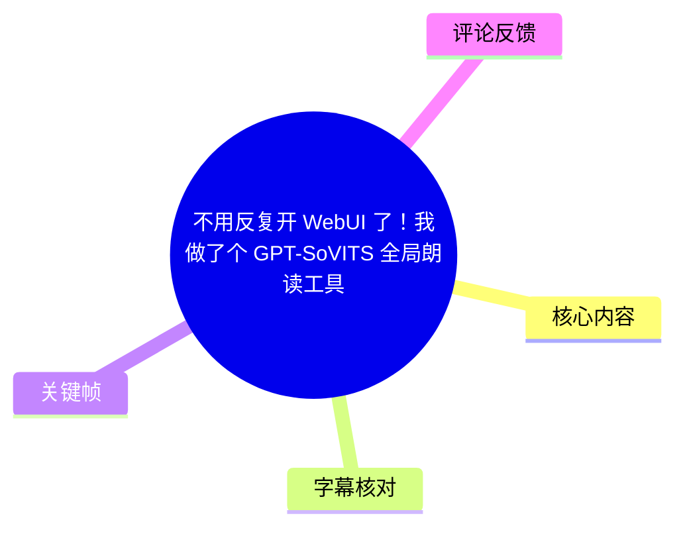
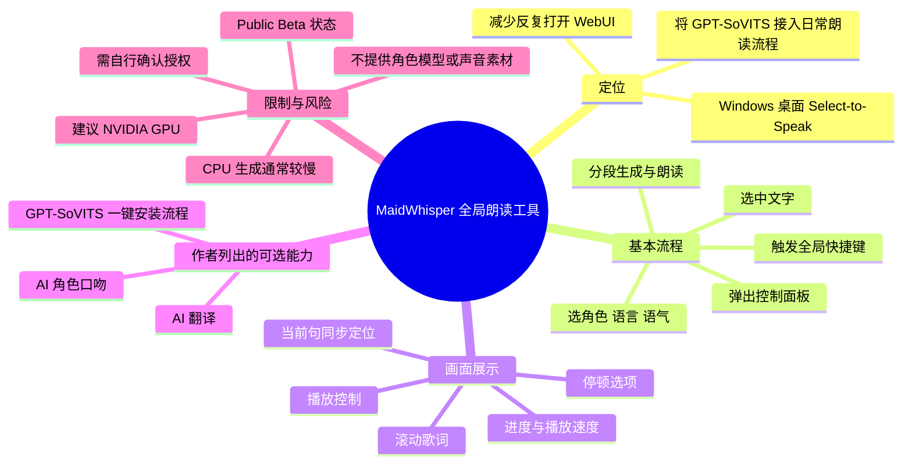
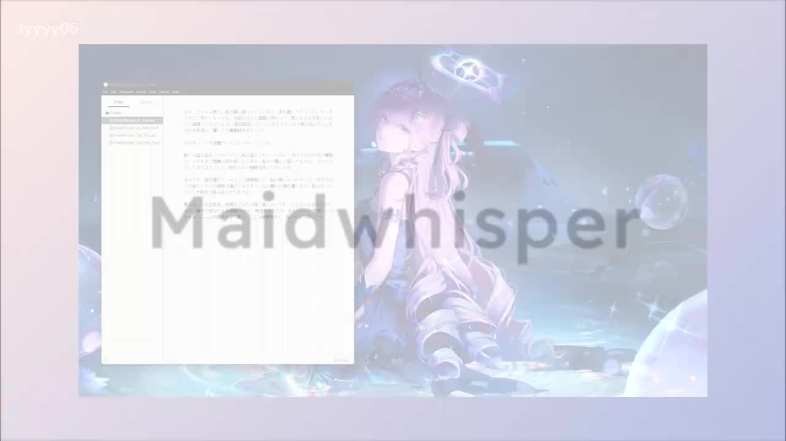
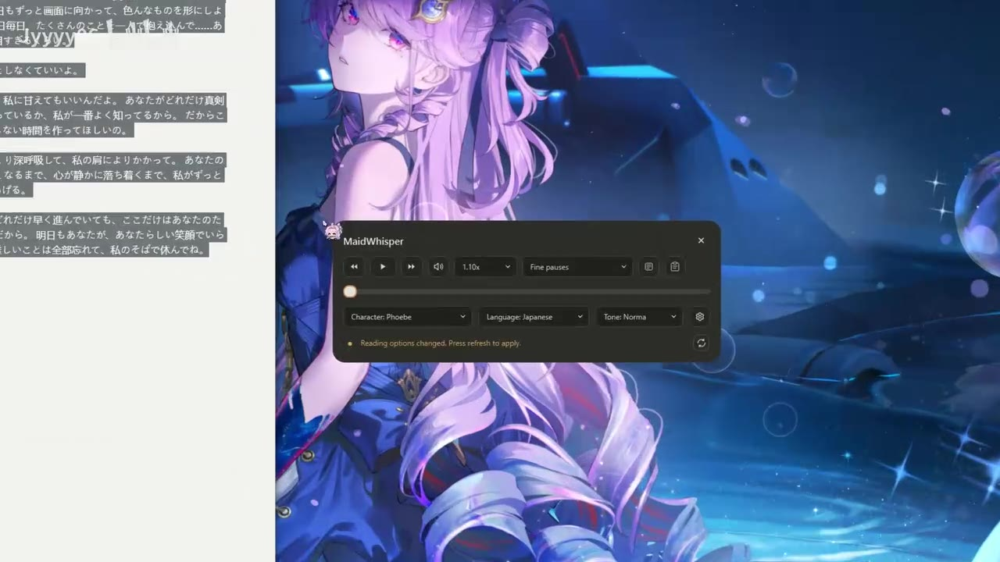
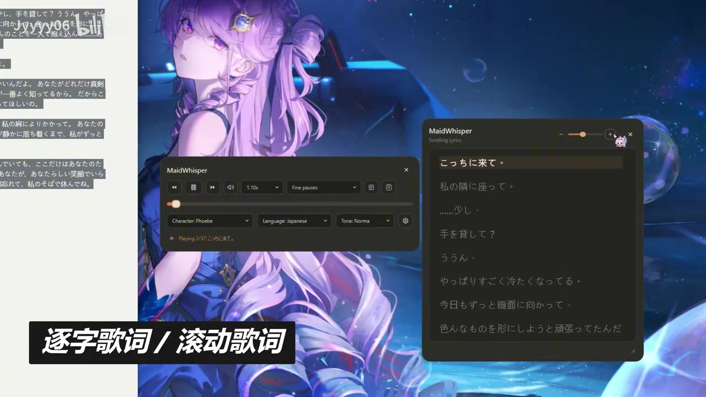
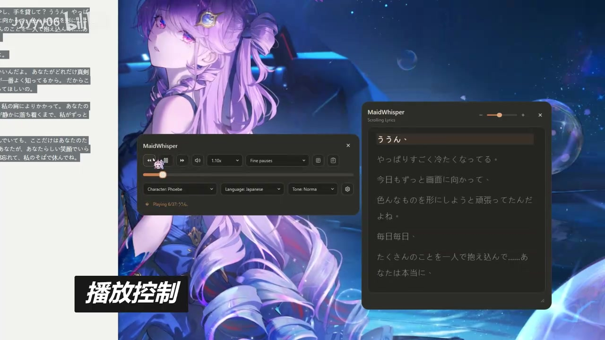

# 不用反复开 WebUI 了！我做了个 GPT-SoVITS 全局朗读工具

> 来源：[Bilibili 视频](https://www.bilibili.com/video/BV11p7k6uEup) 
> UP 主：RyuuMeow｜时长：1 分 09 秒｜合集：AIcode 
> 项目状态：作者描述为 **Public Beta**；仓库链接见视频简介：<https://github.com/RyuuMeow/MaidWhisper>

## 小结

视频展示了作者制作的 Windows 桌面工具 **MaidWhisper**。其定位不是替代 GPT-SoVITS 本身，而是把常见的“打开 WebUI、输入文本、配置角色、生成并播放”的流程，收束为更接近日常使用的系统级朗读工作流。

根据作者简介，基本链路为：**选中文字 → 按全局快捷键 → 弹出控制面板 → 选择角色、语言、语气 → 分段生成并朗读**。画面中可见独立的 MaidWhisper 控制窗，提供播放控制、播放进度、速度选择、停顿选项，以及角色（Character）、语言（Language）、语气（Tone）等下拉配置。

演示重点落在朗读期间的交互体验：工具可显示逐句/滚动歌词（即分段文本的同步展示），并能在文本滚动窗中定位当前播放句。画面还展示了播放/暂停、前后跳转、音量、进度拖动等控制元素，使生成后的语音不只是一次性播放。

作者在简介中列出的扩展能力还包括：可选 AI 翻译、可选 AI 角色口吻、可选 GPT-SoVITS 一键安装流程。需要注意的是，这些能力来自作者文字说明；短视频画面明确展示的是播放控制、角色/语言/语气选择和滚动歌词，并未逐项演示全部扩展功能。

适合已经拥有或计划使用 GPT-SoVITS、希望在 Windows 中更方便地对选中文本进行角色朗读的用户。主要限制是：作者建议使用 **NVIDIA GPU**，并明确提示 CPU 生成通常很慢；工具不提供角色模型或声音素材，使用者需自行确认模型及生成内容的授权。

## 思维导图

## 目录

- [产品定位与工作流](#产品定位与工作流-0013)
- [控制面板：角色、语言、语气与播放参数](#控制面板角色语言语气与播放参数-0025)
- [逐句歌词与滚动文本同步](#逐句歌词与滚动文本同步-0038)
- [播放控制与分段朗读状态](#播放控制与分段朗读状态-0051)
- [实践步骤、参数与适用条件](#实践步骤参数与适用条件)
- [限制、授权与时效性](#限制授权与时效性)
- [字幕比对](#字幕比对)
- [评论分析](#评论分析)
- [处理记录](#处理记录)

## [产品定位与工作流 [00:13]](https://www.bilibili.com/video/BV11p7k6uEup?t=13)

MaidWhisper 被作者描述为 Windows 桌面端的 **Select-to-Speak** 工具，目标是把 GPT-SoVITS 从需要反复进入 WebUI 的操作方式，改造成可在日常桌面环境中调用的系统级朗读流程。

作者在简介中给出的实际操作顺序如下：

1. 在任意可选中文本的界面中选中内容；
2. 按下系统级全局快捷键；
3. 弹出 MaidWhisper 控制面板；
4. 快速选择角色、语言和语气；
5. 由工具按段生成语音并播放。

这里“全局”的含义应理解为作者在简介中声明的“系统级全局快捷键”；素材未给出具体热键组合、支持的应用范围或快捷键冲突处理方式，因此不能补写为某个具体按键。

画面开头以 “MaidWhisper” 标识覆盖在桌面与文本窗口上，直观传达其作为桌面层工具、面向既有文本内容进行朗读的使用场景。

> 图：该关键帧将普通文本窗口、桌面背景与 “MaidWhisper” 标识并置，说明视频讨论的是桌面朗读工具而非单独的网页界面。它有助于理解“减少反复打开 WebUI”的问题背景。

## [控制面板：角色、语言、语气与播放参数 [00:25]](https://www.bilibili.com/video/BV11p7k6uEup?t=25)

画面中的 MaidWhisper 弹出控制面板包含以下可见元素：

- **播放控制按钮**：可见上一段/后退、播放、下一段/前进等图标式按钮；
- **音量控制**：可见扬声器图标；
- **播放速度下拉框**：演示画面显示为 **`1.10x`**；
- **停顿选项下拉框**：演示画面显示为 **`Fine pauses`**；
- **进度条**：可通过滑块观察或调整当前播放位置；
- **角色选择**：下拉框显示 **`Character: Phoebe`**；
- **语言选择**：下拉框显示 **`Language: Japanese`**；
- **语气选择**：下拉框显示 **`Tone: Norma...`**，画面文字末尾被截断，不能据此断言完整选项名称；
- **刷新/应用提示**：可见英文提示“Reading options changed. Press refresh to apply.”，即更改朗读选项后需要按刷新按钮应用。

这些控件说明，MaidWhisper 将“生成前的声音配置”与“生成后的播放控制”集中在一个小型浮动面板中。需要区分的是：画面展示了界面存在这些设置，并不能证明每种配置组合都已在视频中完整生成、试听或对比。

> 图：关键帧直接显示 MaidWhisper 控制面板，其中包括 `Character: Phoebe`、`Language: Japanese`、速度 `1.10x` 与 `Fine pauses`。这是确认视频展示具体参数控件的主要视觉证据。

## [逐句歌词与滚动文本同步 [00:38]](https://www.bilibili.com/video/BV11p7k6uEup?t=38)

视频用“**逐字歌词 / 滚动歌词**”的中文大字说明文本同步功能。画面右侧打开名为 **Scrolling Lyrics** 的独立窗口，日文文本按行排列，当前播放内容以高亮行标识；左侧控制面板则显示播放状态。

这种设计对应作者简介里的“可点击歌词与同步播放”功能。就画面可确认的范围而言：

- 文本被拆分为多个可播放的片段/行；
- 滚动窗口会将当前播放行置于显著位置；
- 当前行与控制面板中的播放进度共同反映朗读状态；
- 界面呈现了歌词窗口与控制面板同时存在的工作方式。

“可点击歌词”是作者简介明确列出的功能，但该关键帧只显示歌词窗口和当前行高亮，没有直接记录鼠标点击某行后跳转播放的交互过程。因此，本文不将“点击跳转是否准确、能否跨段定位”视为已经由视频实测验证的结论。

> 图：右侧 `Scrolling Lyrics` 窗口显示多行日文文本，首行处于高亮状态；左侧为播放面板。该帧是理解“分段文本—当前句—播放进度”同步关系的核心画面证据。

## [播放控制与分段朗读状态 [00:51]](https://www.bilibili.com/video/BV11p7k6uEup?t=51)

后段画面以“**播放控制**”标注突出交互部分。控制面板可见播放/暂停状态、进度条、速度和停顿选项；滚动歌词窗口持续将当前句高亮。面板底部还显示类似 **`Playing 6/37`** 的分段播放状态，后接正在播放的日文文本片段。

基于这一画面，可确认的交互思路是：

- 长文本并非只作为单一不可见音频输出，而是具有分段状态；
- 用户可在播放过程中查看当前段落；
- 前后段、播放/暂停、进度和播放速度等控制，被整合进同一控制区域；
- 文本展示窗口与音频播放界面并存，便于跟读或核对朗读内容。

但视频没有展示导出文件、保存生成音频、历史任务管理、批量队列、异常重试或长文最大长度等功能。因此，不能由“可播放分段”进一步推断其支持音频文件导出或具备特定的任务管理能力。

> 图：画面突出“播放控制”，左侧面板显示播放进度和控制按钮，右侧歌词窗将“ううん～”一行高亮。面板底部可见分段播放提示，证明演示内容以多段形式被播放和定位。

## 实践步骤、参数与适用条件

### 可依据作者描述复现的最小使用流程

在未提供安装文档、快捷键配置和实际安装过程的视频素材前，以下仅整理作者已明确说明的使用路径：

1. **准备运行环境**
   - 使用 Windows 桌面环境；
   - 准备可供 GPT-SoVITS 使用的角色模型及声音相关素材；
   - 优先准备 NVIDIA GPU 环境。作者明确提示 CPU 生成通常很慢。

2. **安装并配置工具**
   - 作者简介列有“可选 GPT-SoVITS 一键安装流程”；
   - 这表示工具可能提供安装辅助选项，但视频未展示安装界面、依赖版本、安装目录或成功标准，具体操作应以项目仓库当前文档为准。

3. **选取目标文本**
   - 在支持文本选择的界面中选中文本；
   - 使用全局快捷键召唤控制面板。
   - 视频与简介均未提供快捷键键位，不能假定为某个常见组合。

4. **设置朗读选项**
   - 选择角色（Character）；
   - 选择语言（Language）；
   - 选择语气（Tone）；
   - 可按需要调整播放速度和停顿方式；
   - 更改选项后，画面提示需按刷新按钮应用设置。

5. **生成并朗读**
   - 工具按段生成并播放；
   - 在播放面板中处理播放/暂停、前后段、音量、速度与进度；
   - 通过滚动歌词窗口查看正在朗读的文本行。

### 演示中实际可见的参数

| 类别 | 画面可见值/控件 | 可确认范围 |
| --- | --- | --- |
| 角色 | `Character: Phoebe` | 这是演示所选角色标签，不代表工具只支持该角色。 |
| 语言 | `Language: Japanese` | 当前演示为日语朗读场景。 |
| 语气 | `Tone: Norma...` | 文字在画面中截断，完整名称不确定。 |
| 速度 | `1.10x` | 为演示时可见的播放速度。 |
| 停顿 | `Fine pauses` | 为演示时显示的停顿选项。 |
| 分段状态 | 类似 `Playing 6/37` | 表明演示文本至少被切分为 37 段；仅能作为该次演示状态，不应外推为固定分段上限或算法。 |

## 限制、授权与时效性

### 性能与硬件限制

作者在简介中明确提示：

- **建议使用 NVIDIA GPU**；
- **CPU 生成通常很慢**。

这属于生成环节的现实限制。视频展示了流畅的播放与文本同步界面，但未提供生成耗时、显卡型号、显存需求、模型大小、首段延迟或不同文本长度下的性能数据，因此不能据此给出性能承诺。

### 模型、声音素材与授权

作者特别说明：

- MaidWhisper **不提供角色模型或声音素材**；
- 使用者需要自行确认模型及生成内容的授权。

这意味着工具界面中可选择的“角色”并不等于软件本体附带了可自由使用的角色音色。将第三方模型、游戏角色声音或其他素材用于生成、传播或商业用途前，需独立核实来源许可、模型许可及相关内容权利。

### 功能边界

作者列出 AI 翻译、AI 角色口吻与 GPT-SoVITS 一键安装流程为“可选”能力；但素材未披露：

- 所使用的翻译模型或 API；
- AI 角色口吻的提示词、模型或效果边界；
- 支持的 GPT-SoVITS 版本；
- 支持的语言与模型格式；
- 是否能导出朗读音频文件；
- 是否支持离线运行、联网服务或数据处理策略；
- 崩溃恢复、缓存策略和隐私处理方式。

因此，以上未知项应在试用前以 GitHub 仓库的最新 README、Release、Issue 和许可证为准。

### 时效性

视频元数据发布时间为 2026-06-05，采集时间为 2026-07-16；且项目被作者标为 **Public Beta**。桌面工具的安装方式、支持功能、界面字段和兼容性均可能随后续提交而改变。本文记录的是该视频及其采集时可获得简介所呈现的状态，而非对当前仓库版本的保证。

## 字幕比对

| 字幕来源 | 完整性 | 专有名词 | 时间轴 | 主要问题 |
| --- | --- | --- | --- | --- |
| Bilibili 站内字幕 | 不可用 | 无法核对 | 无 | 素材明确说明未提供可用站内字幕。 |
| 本次 ASR 字幕 | 仅覆盖约 29.85 秒语音，约占视频 43.36% | 未识别出 MaidWhisper、GPT-SoVITS 等产品信息 | 有：5 个真实 SRT 分段 | 识别语言为日语；内容主要是演示朗读文本，未覆盖/未转写界面功能、中文功能标注和作者简介中的产品说明。 |

本次 ASR 使用 `medium` 模型，自动语言识别结果为日语（置信度约 `0.9761`），在 CUDA / float16 环境下处理。ASR 结果**未标记** `noAudioStream=true`，且实际取得了 5 段带时间戳的日语语音，因此源视频不是“没有音轨”的情形。

本次 ASR 的可用真实时间段为：

| 时间 | ASR 日语文本（按原始识别结果保留） | 用途与局限 |
| --- | --- | --- |
| [00:13.740](https://www.bilibili.com/video/BV11p7k6uEup?t=13)–[00:22.330](https://www.bilibili.com/video/BV11p7k6uEup?t=22) | 私の隣に座って 少し…手を…んん…手を貸して少し 手をかしてんん | 对应日语朗读演示，不是产品功能讲解。 |
| [00:25.210](https://www.bilibili.com/video/BV11p7k6uEup?t=25)–[00:34.090](https://www.bilibili.com/video/BV11p7k6uEup?t=34) | 毎日 たくさんのことを一人で抱え込んであなたは本当に優しくて真面目すぎるくらいあのね | 对应日语朗读演示。 |
| [00:38.820](https://www.bilibili.com/video/BV11p7k6uEup?t=38)–[00:45.990](https://www.bilibili.com/video/BV11p7k6uEup?t=45) | もう完璧で言おうとしなくていいよ時には立ち止まってもいいし私に甘えてもいいんだよ | 对应滚动歌词展示期间的朗读内容。 |
| [00:51.400](https://www.bilibili.com/video/BV11p7k6uEup?t=51)–[00:54.490](https://www.bilibili.com/video/BV11p7k6uEup?t=54) | その隣には少し手を掛けて | 对应后段播放控制演示。 |
| [00:56.630](https://www.bilibili.com/video/BV11p7k6uEup?t=56)–[00:58.750](https://www.bilibili.com/video/BV11p7k6uEup?t=58) | やっぱりすごく冷たくなってる | 对应后段播放控制演示。 |

### 最终字幕与事实校正策略

由于没有站内字幕，本文不能用站内文稿补全语义；同时，ASR 内容是工具正在朗读的日语文本，不是作者对产品功能的口述说明。故最终采用以下分层方式：

1. **时间轴**：优先采用 ASR SRT 的真实起始时间换算为秒数，章节链接使用 13、25、38、51 秒；
2. **朗读内容**：保留 ASR 所识别的日语文本，不强行翻译或纠正未获证实的词句；
3. **界面功能**：以关键帧中可见的英文控件、中文叠字和作者简介为依据；
4. **关键术语校正**：`MaidWhisper`、`GPT-SoVITS`、`Character: Phoebe`、`Language: Japanese`、`Fine pauses` 来自画面或元数据，而非 ASR；
5. **不确定项**：将画面截断的 `Tone: Norma...` 原样标注为截断文本，不补全为未经素材确认的名称。

## 评论分析

以下仅处理本次可获取的热评前三条。评论是用户反馈，不构成对产品能力的验证。

1. **Pwicdsummer（4 赞）**：“这种up整活最狠了[doge][打call][打call][打call]”
   - **观点**：以玩笑和鼓励的语气肯定作者的创作风格。
   - **补充信息**：没有提供功能、安装或效果方面的事实信息。
   - **可信度判断**：属于情绪性反馈，不能作为工具性能或可用性的证据。

2. **樱花世界第一可爱（1 赞）**：“好东西”
   - **观点**：对项目表达正面评价。
   - **补充信息**：未说明具体认可的是全局快捷键、语音效果、滚动歌词还是安装体验。
   - **可信度判断**：可反映部分观众的初步兴趣，但缺乏可复现细节。

3. **小年永不言败（1 赞）**：“这个可以讲朗读的语音转换成音频文件吗”
   - **观点/疑问**：关心朗读结果能否导出为音频文件。
   - **补充信息**：该问题恰好指出视频与简介未明确交代的能力边界。
   - **可信度判断**：这是提问而非功能确认。现有素材未展示导出操作，也没有作者回复，因此不能判断 MaidWhisper 是否支持保存为音频文件。

## 处理记录

- Worker ID：`worker-mrj0wjed-b0c290ad`
- 模型：`gpt-5.6-terra`
- 调用工具与模型：素材解析结果中的 ASR 使用 `medium` 模型，自动语言检测；本文整理模型为 `gpt-5.6-terra`。
- 使用的应用工具：视频元数据读取、关键帧抽取、音频 ASR、站内字幕检查、热评抓取。
- 字幕选择：站内字幕不可用；已检查本次 ASR。采用 ASR SRT 的真实时间戳作为章节时间轴，但不将其日语朗读文本误作产品讲解；功能事实由关键帧与作者简介交叉确认。
- 关键帧选择依据：
  - `frames/frame-001.jpg`：展示 MaidWhisper 的桌面工具定位与文本使用场景；
  - `frames/frame-002.jpg`：清楚显示角色、语言、语气、速度、停顿及刷新提示；
  - `frames/frame-003.jpg`：清楚显示滚动歌词窗口与当前行高亮；
  - `frames/frame-004.jpg`：清楚显示播放控制、同步歌词和分段播放状态。
- 缓存清理：未提供缓存清理执行日志；不能声称已完成清理。
- 未解决问题：
  - 未获取到站内字幕；
  - 视频未给出全局快捷键的具体键位；
  - 未验证音频导出、安装细节、支持模型版本、性能数据及隐私/联网策略；
  - `Tone: Norma...` 在关键帧中显示不完整，完整语气名称无法确认。
