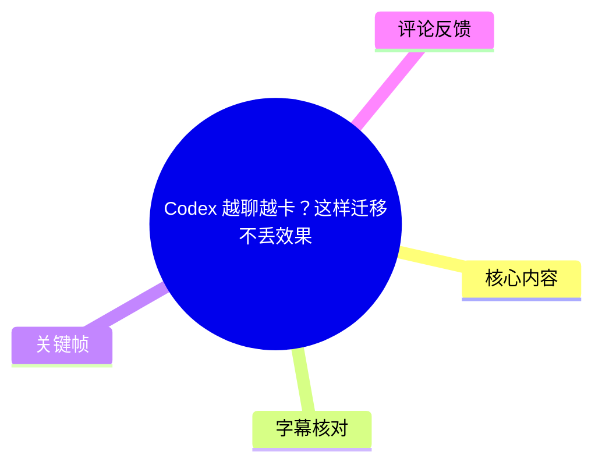
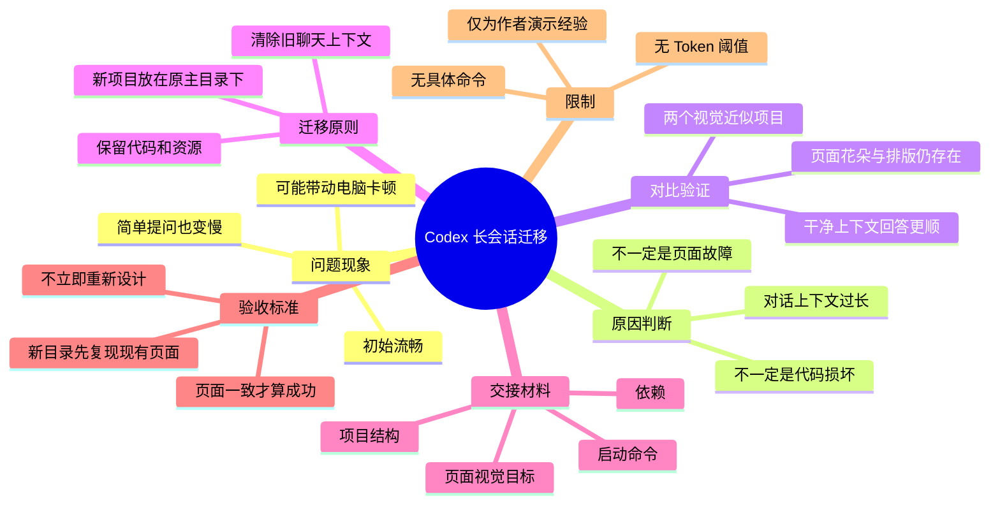
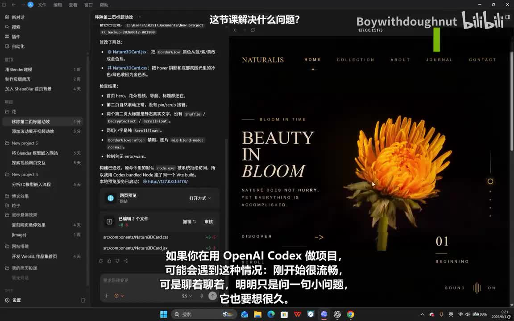
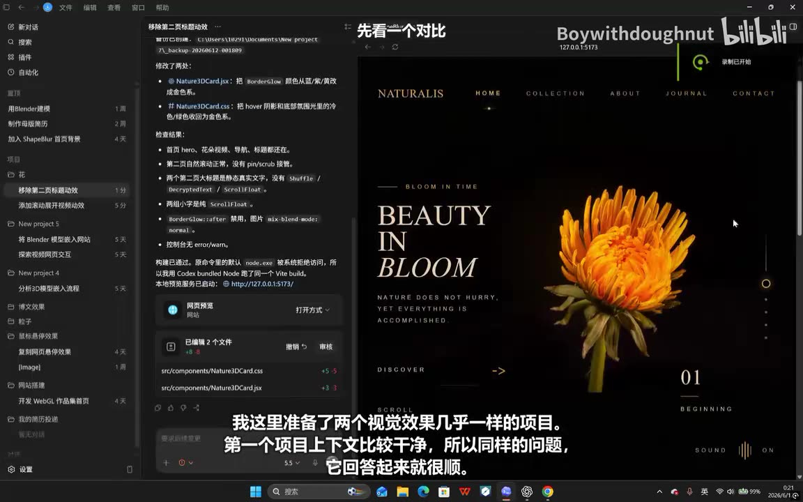

# Codex 越聊越卡？这样迁移不丢效果

> 来源：[Bilibili 视频](https://www.bilibili.com/video/BV14tJ46qEKV)<br>
> UP 主：Boywithdoughnut｜视频时长：02:19｜合集：AIcode

## 小结

视频讨论使用 OpenAI Codex 做项目时，随着对话持续累积，简单问题也可能开始响应缓慢，甚至让本机操作变卡的现象。UP 主的核心判断是：这不必然代表代码或页面已经损坏，常见原因是**当前会话需要在每次回复前处理过长的历史上下文**。

视频通过两个视觉效果近似的项目作对比：页面预览中的花朵、排版和整体结构均仍存在，因此先排除了“页面本身坏掉”的可能；随后将卡顿归因于第二个项目的对话历史过长。这里是视频作者基于演示给出的经验性诊断，并非对 Codex 内部实现机制的官方说明。

解决策略不是继续等待，而是“迁移项目”：保留已有代码与资源，切换到一个新对话，以清除冗长、混乱的聊天上下文。迁移时，新项目应在原有主文件夹内新建子文件夹，而不是放到无关位置；作者认为这样更有利于沿用资源、样式与视觉信息。

迁移前，需从旧项目生成一份项目总结；总结至少覆盖项目结构、依赖、启动命令和最终页面的预期外观。将该总结交给新对话后，先要求其在新子目录中**复现当前页面**，而不是马上重新设计；“页面一致”才是迁移成功的验收条件。

本视频适合已用 Codex 或类似 AI 编程对话工具制作前端项目，并遇到长会话变慢问题的用户。它没有给出上下文长度阈值、Token 数、具体命令、迁移成功率或官方性能依据；因此该流程应视为工作流经验，实施前仍应自行备份并验证项目能否启动。

## 思维导图





## 目录

- [问题背景：长上下文可能导致变慢](#问题背景长上下文可能导致变慢)
- [对比演示：先排除页面损坏](#对比演示先排除页面损坏)
- [迁移方法：保留项目、切换上下文](#迁移方法保留项目切换上下文)
- [实操流程与验收标准](#实操流程与验收标准)
- [结论、限制与时效性](#结论限制与时效性)
- [字幕比对](#字幕比对)
- [评论分析](#评论分析)
- [处理记录](#处理记录)

## [问题背景：长上下文可能导致变慢](https://www.bilibili.com/video/BV14tJ46qEKV?t=0)

视频开头描述了一种使用体验：用 OpenAI Codex 做项目时，开始阶段较流畅；持续聊天后，即使只是提出一个小问题，工具也会“想很久”。

作者提醒，用户面对这种情况时，容易先怀疑代码写坏或页面出了问题。但视频的判断是：**不一定是项目代码或页面本身的问题，可能只是对话上下文太长。**

在作者的解释中，历史消息过长意味着 Codex 在每次回答之前，都要处理大量旧信息，因此响应会逐步变慢，严重时还可能让电脑一起卡顿。视频未展示 Token 计数、CPU/GPU 占用或 Codex 的官方性能日志，故这一因果关系应理解为作者基于实际工作流给出的诊断思路。



> 图：画面同时呈现左侧的 Codex 工作区、任务/对话内容与右侧页面预览；它建立了视频所讨论的场景——在持续进行的 AI 编程项目中观察响应与页面结果。

## [对比演示：先排除页面损坏](https://www.bilibili.com/video/BV14tJ46qEKV?t=25)

作者准备了两个视觉效果“几乎一样”的项目，以说明卡顿不必然来自页面故障。

### 干净上下文的项目

第一个项目的上下文较干净。对于同样的问题，作者称其回答过程较顺畅。画面预览中可见黑色背景的花卉主题页面，包含橙色花朵、英文标题与导航排版。



> 图：左侧显示项目工作区与文字说明，右侧显示完整的花朵主题首屏。该画面用于支撑“在视觉结果近似的前提下，干净上下文的项目响应较顺”的对比前提。

### 页面状态仍正常

作者特别查看页面预览，指出花朵、排版和页面结构仍然存在。这一步的目的并不是证明所有代码都无问题，而是先排除明显的页面崩坏或视觉丢失。


> 图：预览区可见花朵主视觉、导航、标题和下方内容区，左侧对话中出现“太好了，当前状态稳住了”的文字。它有助于理解视频的验收重点：迁移前先确认既有页面状态可作为复现目标。

### 长对话历史的项目

第二个 Codex 项目的画面与第一个大致相同，但其对话历史已经很长。作者据此说明，视觉页面相近并不意味着会话负担相同：后一项目由于要处理大量旧信息而更慢，甚至会影响电脑流畅性。


> 图：该帧仍显示花朵主题网站，但视频字幕强调“问题不是代码坏了”。它与前后对比共同传达：应将页面视觉状态与会话上下文负担分开判断。

## [迁移方法：保留项目、切换上下文](https://www.bilibili.com/video/BV14tJ46qEKV?t=63)

作者给出的解决方案是迁移，而非继续等待旧会话完成。迁移的含义是：

1. **保留代码和资源**：不要求舍弃现有项目成果。
2. **清理冗长聊天上下文**：通过开启新对话，避免继续承载旧会话中的长历史。
3. **在原主文件夹下创建新子文件夹**：旧子项目与新子项目位于同一个主目录之下。

视频强调第三点：不要把新项目“随便建到外面”。作者认为，旧、新子项目在同一主目录下时，资源、样式和视觉信息更容易联动，新项目复现原页面时不容易走样。

这一点是作者的项目组织建议。视频没有展示目录树的完整文件名、软链接/相对路径规则、版本控制状态，也没有说明不同操作系统或不同构建工具下是否必须采用相同目录结构。因此，在实际项目中，仍需检查资源引用路径、环境变量、依赖安装位置及构建配置。

## [实操流程与验收标准](https://www.bilibili.com/video/BV14tJ46qEKV?t=99)

### 1. 在旧项目生成交接总结

迁移之前，作者要求在旧项目里生成一份总结。站内字幕将该词显示为“end of summer”，本次 ASR 将其误识别为“Hand of Summary”；结合紧邻语句“这个总结要写清楚……”以及视频语义，本笔记仅将其记为**项目总结（summary）**，不将不稳定的英文转写当作确定的命令名称。

该总结需要写清四类信息：

| 内容 | 视频要求 | 迁移中的作用 |
| --- | --- | --- |
| 项目结构 | 说明项目如何组织 | 帮助新对话定位页面、组件与资源关系 |
| 依赖 | 列出项目依赖 | 便于恢复运行环境 |
| 启动命令 | 写明如何启动 | 让新项目可以按既有方式运行 |
| 最终页面外观 | 描述页面应长什么样 | 作为视觉复现与一致性验收依据 |

视频没有提供可直接复制的总结模板、命令行命令或文件格式。下面的结构仅是根据视频明确列出的四项信息整理的记录框架，不是视频提供的原始提示词：

```text
项目总结
- 项目结构：页面、组件、资源所在位置及主要关系
- 依赖：当前项目需要的依赖项
- 启动命令：用于本地启动项目的命令
- 目标页面：当前页面的布局、视觉元素与应保留的交互/状态
```

### 2. 在主文件夹中新建子文件夹

在原主文件夹下创建新的子级文件夹，将其作为新项目的工作位置。视频的关键不是简单复制到任意位置，而是让新、旧子项目保留在共同的主目录范围内。

### 3. 将总结发送给新对话

把旧项目生成的项目总结交给新的 Codex 对话，并要求它在新子文件夹中工作。这里的目标不是让新对话自由发挥，而是基于交接材料理解已有项目的运行方式和视觉目标。

### 4. 先复现，不要立即重设计

作者明确要求：新对话首先复现当前页面，不要“一上来重新设计”。也就是说，迁移的首要任务是保持既有成果，而非借迁移机会修改风格、重构页面或增加新需求。

### 5. 用“页面一致”验收迁移

视频给出的成功标准是**页面一致**。只有新子目录中的页面复现了当前页面，迁移才算成功；此后才有条件继续在较短的新上下文中迭代。

完整顺序可概括为：

```text
旧项目生成项目总结
        ↓
在原主文件夹下建立新子文件夹
        ↓
把总结提供给新对话
        ↓
要求新对话先复现当前页面
        ↓
核验页面一致性
        ↓
在新会话继续开发
```

作者的预期收益是：在不丢失代码、资源和视觉效果的前提下，让新会话变快。

## [结论、限制与时效性](https://www.bilibili.com/video/BV14tJ46qEKV?t=122)

### 可迁移的经验

- 遇到 AI 编程会话越聊越慢时，应先区分“项目损坏”与“上下文过长”两类问题。
- 若已有页面状态正确，可将其当作迁移基线，而不是直接重新做项目。
- 在新会话开始前，结构化交接信息比只说“帮我继续做”更有利于保持连续性。
- 将“页面复现一致”设为第一阶段验收标准，可减少迁移后悄然跑偏的风险。

### 视频未覆盖的限制

1. **没有量化阈值**：未说明达到多少 Token、多少轮对话或何种响应时间后应迁移。
2. **没有自动化方法**：未提供导出会话、复制项目、安装依赖、运行项目或校验视觉一致性的具体命令。
3. **没有完整数据安全方案**：未提到 Git 提交、压缩备份、锁文件、环境变量、数据库与密钥如何迁移。
4. **没有验证所有项目类型**：演示集中于网页视觉效果项目，是否适用于多包仓库、后端服务、数据库驱动项目或复杂部署环境，视频未验证。
5. **“同主目录更易联动”不是通用技术保证**：项目是否能复用资源，仍取决于真实路径、配置和构建系统，而不只取决于文件夹层级。

### 时效性

视频元数据的发布时间为 2026 年 6 月。Codex 的产品形态、上下文管理机制、客户端功能、模型版本与项目工作区能力都可能在后续更新中变化。因此，视频中的迁移策略可作为通用的“短上下文 + 明确交接”经验，但不应替代当前版本官方文档、项目备份与实际测试。

## [字幕比对](https://www.bilibili.com/video/BV14tJ46qEKV?t=0)

本次同时检查了站内字幕与 ASR。ASR 诊断显示：语言为中文，识别模型为 `medium`，音频时长约 138.83 秒，语音覆盖约 94.27%，共有 18 段，且**没有** `noAudioStream=true` 标记；因此可确认素材存在音轨，ASR 不是因无音轨而缺失。

| 字幕来源 | 完整性 | 专有名词 | 时间轴 | 主要问题 |
| --- | --- | --- | --- | --- |
| Bilibili 站内字幕 | 覆盖 00:00:00.080–00:02:18.820，内容完整 | “OpenAI Codex”正确；“end of summer”疑为不稳定转写 | 分段细，适合定位章节 | “新项目不要随便溅到外面”“新的子集文件夹”等词存在明显错字；英文总结名称不可靠 |
| 本次 ASR 字幕 | 覆盖 00:00:00–00:02:18.760，语音覆盖率 94.27% | 多次将 Codex 识别为“Codecs/Codec”；将总结词识别为“Hand of Summary” | 时间段连续、可用于交叉核对 | 多处繁简混用和语义错误，如“对话力实已经非常涨了”“新子级文件家”“视觉一臆” |

### 最终字幕选择

正文以**站内字幕的细粒度时间轴**作为章节链接依据，并以本次 ASR 交叉检查语句连续性与覆盖范围。两份字幕对以下关键内容一致，可视为可靠：

- 使用 OpenAI Codex 做项目时会出现长会话后变慢的情况；
- 原因判断为上下文太长；
- 保留代码和资源，迁移到新项目/新对话；
- 新子文件夹建在原主文件夹下；
- 交接总结须含项目结构、依赖、启动命令和页面目标；
- 新项目先复现页面，不要直接重设计；
- 页面一致才算迁移成功。

对于“总结”的英文名称，两份字幕分别给出“end of summer”和“Hand of Summary”，彼此冲突，且都不适合作为可执行命令。本笔记依照上下文与画面任务信息统一写作“项目总结（summary）”，不扩展为未被证实的具体文件名、系统指令或命令。

## [评论分析](https://www.bilibili.com/video/BV14tJ46qEKV?t=135)

仅处理本次可获取的热评前三条：

1. **Boywithdoughnut（3 赞）**  
   UP 主称该视频也是用 Codex 全流程制作，且已检查逻辑和音频同步，并邀请观众在评论区提问。  
   - 补充价值：说明作者自述使用了与主题相关的工具完成视频制作。  
   - 可信度边界：这是作者自我陈述，不能替代对视频技术结论的独立验证。

2. **丁老师疯了（1 赞）**  
   评论建议“应该输出为 `agents.md`，这样当不得不迁移上下文时可以让新线程读取上下文”。  
   - 补充价值：提供了一种将项目交接信息固化为文档的具体实践方向，与视频的“先生成总结”思路一致。  
   - 争议/限制：视频本身未提到 `agents.md`，也未说明 Codex 是否会自动读取该文件；它是评论者的建议，不应视为视频已验证的标准流程。

3. **梨花风起_（0 赞）**  
   评论询问“手动压缩上下文有用不”。  
   - 补充价值：指出除新建会话迁移外，可能还存在“压缩上下文”的替代思路。  
   - 结论边界：素材中没有作者回复，也没有实测结果，因此无法据此判断手动压缩是否有效、何时有效或如何操作。

## [处理记录](https://www.bilibili.com/video/BV14tJ46qEKV?t=0)

- Worker ID：`worker-mrj0wjed-b0c290ad`
- 整理模型：`gpt-5.6-terra`
- ASR 模型与参数：`medium`；语言识别为 `zh`，置信度 `0.99755859375`；设备 `cuda`；计算类型 `float16`
- 使用的素材工具产物：站内 SRT `p01-ai-zh.srt`、ASR SRT、ASR 结果诊断、12 张关键帧路径、视频元数据、可获取热评前三条。
- 字幕选择：以站内 SRT 的细粒度真实分段作为时间轴基准；检查本次 ASR 后用于交叉校验。ASR 未标记 `noAudioStream=true`，故未采用“无音轨”处理路径。
- 关键帧选择依据：
  - `frame-001.jpg`：开场同时展示 Codex 工作区与网页预览，适合说明使用场景；
  - `frame-002.jpg`：画面文字强调问题不必然是代码损坏，适合说明诊断分流；
  - `frame-003.jpg`：展示干净上下文项目和完整花朵页面，适合对比实验前提；
  - `frame-004.jpg`：展示页面元素仍存在，适合说明迁移前的视觉基线与验收目标。
- 缓存清理：提供的素材中未包含缓存清理执行记录，无法确认是否已清理；本记录不虚构清理结果。
- 未解决问题：
  - “end of summer”与“Hand of Summary”均为字幕不稳定转写，无法确认原始英文术语；
  - 未提供项目的实际目录、代码、命令、依赖清单或性能数据，无法复现实测；
  - 未提供评论中“手动压缩上下文”的后续回复或验证结果。

## 评论分析

- 热评 1：这个视频也是codex全流程制作的，大家可以放心观看，逻辑没有任何问题，音频都是同步的，我都有检查过，有任何问题评论区可以问哦！[打call]
- 热评 2：不是，你应该输出为agents.md，这样当你不得不迁移上下文时可以让新线程读取上下文
- 热评 3：手动压缩上下文有用不

以上内容是观众反馈摘录，只用于补充理解视频反响，不作为正文事实依据。
