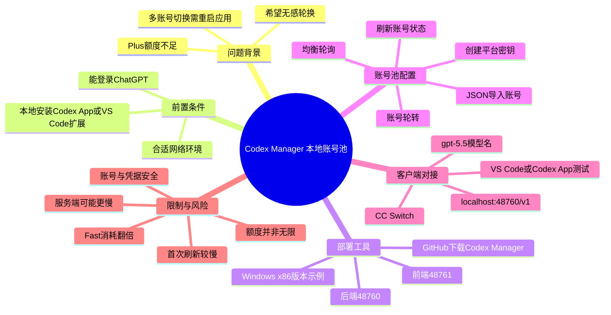
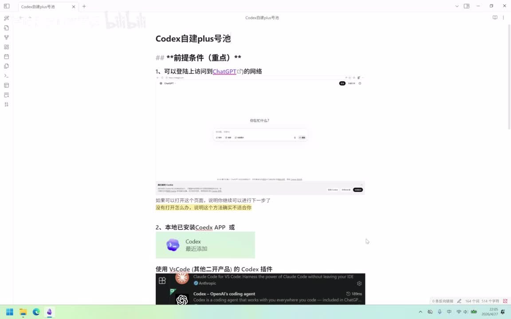
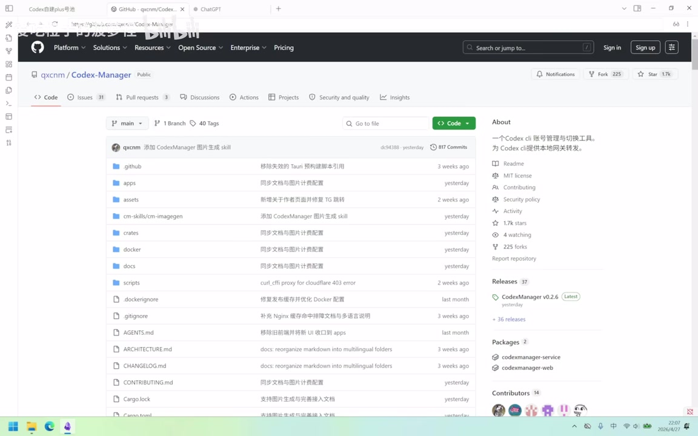
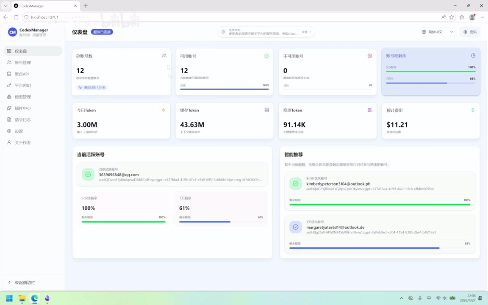

# codex/plus本地自建号池，无限爽用

> 来源：[Bilibili 视频](https://www.bilibili.com/video/BV1jToCBoEcy)  
> UP 主：像素Agent｜时长：12 分 32 秒｜合集：AIcode  
> 视频描述：分享使用经验，有问题评论区可以讨论，感谢作者开源工具！

## 小结

视频讲解了一种将多个 Codex/Plus 账号接入本地 **Codex Manager** 的做法：由工具统一管理账号状态、额度与轮转，再通过一个平台密钥和本地 API 地址对接 CC Switch、VS Code 中的 Codex 扩展或 Codex App，以减少人工切换账号、重启应用的麻烦。

作者的实际动机是 Plus 账号额度不足，且多账号手动切换时需要重启 Codex App 或 VS Code。他在演示中展示了一个含 12 个账号的管理面板，并称自己还曾在可访问 ChatGPT 的服务器部署同类服务、托管账号后通过 API 调用。

核心流程是：确认可正常登录 ChatGPT 且本地已有 Codex 客户端/扩展；从 GitHub 下载 Windows 版本的 Codex Manager；启动后导入 JSON 格式账号文件；创建启用“账号轮转”的平台密钥；将密钥、`localhost:48760/v1` 与模型名配置进 CC Switch；最后在 VS Code 或 Codex App 发起请求，并在请求日志中检查结果。

视频中出现的关键参数包括：前端端口 `48761`、后端端口 `48760`、对接地址 `localhost:48760/v1`、建议的轮询策略“均衡轮询”、模型名示例 `gpt-5.5`。作者称 Fast 服务等级会有“二倍积分消耗”，并建议无明确需求时跟随请求；这些均为视频作者的经验陈述，未在本素材中获得外部验证。

标题中的“无限爽用”应理解为通过多个账号汇集、轮转来延长可用额度的宣传性表达，而不是无限资源保证。每个账号依然受其自身额度、可用性、服务条款、网络环境和风控策略影响。账号购买、共享、托管或以非官方方式绕过额度限制，均可能带来账号安全、隐私、付费争议及平台规则风险。

## 思维导图




## 目录

- [背景、目标与前置条件](#背景目标与前置条件)
- [下载并启动 Codex Manager](#下载并启动-codex-manager)
- [管理面板、密钥与模型设置](#管理面板密钥与模型设置)
- [账号导入、刷新与轮询策略](#账号导入刷新与轮询策略)
- [使用 CC Switch 对接本地 API](#使用-cc-switch-对接本地-api)
- [客户端验证、日志与性能观察](#客户端验证日志与性能观察)
- [完整操作清单](#完整操作清单)
- [限制、风险与时效性](#限制风险与时效性)
- [字幕比对](#字幕比对)
- [评论分析](#评论分析)
- [处理记录](#处理记录)

## 背景、目标与前置条件 [00:00:00](https://www.bilibili.com/video/BV1jToCBoEcy?t=0)

作者称自己是 Plus 用户，但使用 Codex 时经常遇到账号额度不够的问题；视频还提到此前 Plus 等级用户的额度“骤降”。为延长可用量，作者另购两个账号、共使用三个账号，但每次切换账号都需要重启 Codex App 或 VS Code，操作负担较高。

因此，本视频的目标不是修改单个账号的额度，而是把多个账号放进同一管理工具，由统一入口调配、轮换，以取得作者所称的“无感切号”效果。

### 视频给出的前置条件

1. **能够访问并登录 ChatGPT。**  
   作者明确表示，若连 ChatGPT 页面都无法打开，就无法继续该视频中的后续操作。
2. **本地已安装客户端。**  
   可选 Codex App，或在 VS Code 中安装 Codex 扩展。
3. **具备多个可导入的 Plus 账号。**  
   视频后段演示以 JSON 文件导入账号，但没有展示 JSON 的完整字段结构。
4. **网络环境应能稳定访问相关服务。**  
   作者后面将此描述为“比较安全/合适的网络节点”，称可减少 CF（应指 Cloudflare）拦截情况；这只是其经验判断，并不构成绕过风控的保证。



> 图：画面列出“可以登录访问 ChatGPT 的网络”以及本地安装 Codex App 或 VS Code Codex 插件两项要求。它说明本方案建立在账号能够正常登录、客户端已准备完成的前提上。

## 下载并启动 Codex Manager [00:02:00](https://www.bilibili.com/video/BV1jToCBoEcy?t=120)

作者在此引入本视频的关键工具：**Codex Manager**。从画面可见，其 GitHub 仓库为 `qxcmm/Codex-Manager`；视频将其描述为面向 Codex CLI 账号管理与切换的工具，并表示该地址由作者放在说明位置。



> 图：GitHub 仓库页面展示了 `qxcmm / Codex-Manager`、项目说明和 Releases 区域。该画面为“工具来源与下载发布页”的视觉依据；版本、下载项和项目状态会变化，应以访问时仓库内容为准。

### 作者演示的 Windows 启动方式

1. 进入项目 GitHub 地址。
2. 下载最新压缩包。
3. 作者使用 Windows，因此选择视频口述的 Windows x86 版本；站内字幕将文件名识别为类似 `codexmanager service`，ASR 识别存在明显拼写误差，无法仅凭字幕确认完整发布文件名。
4. 解压到桌面中的文件夹。作者称初始目录中大致有三个文件。
5. 直接打开服务程序。作者口述为类似 `Codex Manager Start` 的启动文件，但两个字幕来源对文件名识别均不稳定，建议以实际 Release 包内的可执行文件/项目文档为准。
6. 程序正常启动后会在浏览器打开管理界面。

### 本地端口

| 用途 | 视频口述参数 |
| --- | --- |
| 前端页面端口 | `48761` |
| 后端 API 端口 | `48760` |

作者在 [00:03:13](https://www.bilibili.com/video/BV1jToCBoEcy?t=193) 说明，浏览器管理界面使用 `48761`，后端使用 `48760`。后续 CC Switch 的请求地址即基于后端端口构造。

## 管理面板、密钥与模型设置 [00:03:13](https://www.bilibili.com/video/BV1jToCBoEcy?t=193)

启动后，作者展示 Codex Manager 仪表盘。左侧菜单包含仪表盘、账号管理、聚合 API、平台密钥、模型管理、插件中心、请求日志与设置等模块。作者认为日常最常用的是仪表盘和账号管理。



> 图：仪表盘展示总账号数、可用/不可用账号、账号池剩余量、Token 与预计费用等卡片，并显示当前活跃账号和智能推荐区域。它有助于理解该工具将多账号状态聚合到一个界面，而非只保存单一 API 配置。

作者的画面中有 12 个账号，并称“连接性可用 12 个”。这是其演示环境中的账户数，不是工具的固定上限，也不意味着其他用户可以获得相同可用性。

### 平台密钥：作为统一调用入口 [00:04:07](https://www.bilibili.com/video/BV1jToCBoEcy?t=247)

作者说明，平台密钥初始为空，需要自行创建；名称可以自定义。其建议如下：

| 配置项 | 作者建议/说明 |
| --- | --- |
| 调度方式 | 选择“账号轮转” |
| 可选账号范围 | 可只选 Plus，也可选“全部账号” |
| 默认绑定模型 | 建议“跟随请求” |
| 推理等级 | 可自行指定，或“跟随请求” |
| 服务等级 | 可选 Fast；作者通常建议“跟随请求” |
| 外部服务 | 如有外接聚合 API，可接入聚合 API |

作者特别说明，使用 API 接到 VS Code 插件时，可能无法在插件中选择 Fast 服务等级；若确实必须使用 Fast，可在密钥侧启用。否则建议跟随请求，并称 Fast 会产生“二倍积分消耗”。素材没有提供该积分机制的官方定义、计费规则或验证截图，因此不应将其作为普遍适用的计费结论。

### 模型配置：视频中的示例与不确定点 [00:05:13](https://www.bilibili.com/video/BV1jToCBoEcy?t=313)

作者表示自己对模型做过“覆盖”，并建议将某个模型条目后的“高级 JSON”复制到编辑模型页面，其他内容不必修改。视频口述先提到类似 `GPT 5.4`，随后多次明确提到模型名 `GPT 5.5` / `gpt-5.5`。

由于站内字幕与 ASR 均对具体模型名称、界面术语有混淆，能够较稳妥确认的是：

- 客户端对接时作者填写的模型名示例为 **`gpt-5.5`**；
- 模型编辑区域涉及复制“高级 JSON”；
- 作者选择“云端同步”；
- 作者称推理等级可以设为最高；
- 视频没有展示可供复核的完整 JSON 内容，不能据此复现具体模型定义。

因此，模型名称和 JSON 应以运行时工具已同步的模型列表、项目文档及账户实际可用模型为准，不能仅照抄口述。

### 请求日志与作者的使用数据 [00:05:55](https://www.bilibili.com/video/BV1jToCBoEcy?t=355)

作者说请求日志可逐条查看调用情况，并给出自己环境中的数据：

- 本地界面看到的请求数：`1782` 条；
- 加上服务器端部署，累计“6000 多条”；
- 异常请求：`20` 条；
- 作者称多数异常由其主动中断 Codex 对话造成，较少由“安全页”导致。

这些数字仅反映作者当时的个人使用记录，不是性能基准、成功率承诺或产品 SLA。

作者还称，自己曾在香港或其他可访问 ChatGPT 的服务器上部署该工具，把账号托管到服务器，通过 API 调用以免每次在本地启动服务。但后续测试环节又建议优先本地使用，理由是服务器接入后显示/响应可能更慢。

## 账号导入、刷新与轮询策略 [00:06:58](https://www.bilibili.com/video/BV1jToCBoEcy?t=418)

### 设置项与轮询

作者在设置页只做简要说明：

- **轮询策略**：建议使用“均衡轮询”。
- **Free 账号使用模型**：建议跟随请求，但作者称本视频主要搭建 Plus 账号池，因此不重点使用 Free 账号。
- **任务**：作者建议“全部打开”。
- **运行模式**：按个人需求选择。

这些选项依赖软件版本和界面实现，视频未展示全部配置项的含义与默认值；如遇界面不同，不应据此强行套用。

### 账号来源与导入形式 [00:07:06](https://www.bilibili.com/video/BV1jToCBoEcy?t=426)

作者称账号可以使用自有的 Plus 账号服务导入，也邀请观众私信获取账号。账号导入采用 **JSON 文件**形式。视频为演示准备了三个账号，并先删除其中两个已存在账号，再重新导入。

> 不建议将来源不明的账号、Cookie、访问令牌或 JSON 凭据交给第三方，更不应在聊天、截图、日志或公共仓库中泄露。视频没有提供账号来源的合法性、授权范围及数据处理说明。

### 视频演示的导入与刷新步骤 [00:08:05](https://www.bilibili.com/video/BV1jToCBoEcy?t=485)

1. 在“账号管理”中选择“添加账号”或“选择文件”。
2. 选中本地账号 JSON 文件并打开。
3. 工具提示两个账号完成更新，导入的条目出现在列表底部。
4. 新导入账号起初显示为“未知”。
5. 可使用顶部“账号刷新”、单个账号的刷新按钮，或条目末尾菜单内的刷新操作。
6. 作者提示首次刷新可能较慢。
7. 刷新完成后，界面展示该账号的剩余额度状态。

作者展示的某一账号状态为：

| 时间窗口 | 画面/口述中的剩余状态 |
| --- | --- |
| 5 小时 | `100%` |
| 7 天 | `72%` |

作者表示该账号此前已使用一部分，并口述自己配合另一服务器端累计“100 多刀”消耗。这是作者个人账户情况；“刀”对应的具体计费口径、币种换算和账单来源均未在素材中披露。

## 使用 CC Switch 对接本地 API [00:09:14](https://www.bilibili.com/video/BV1jToCBoEcy?t=554)

作者使用 **CC Switch** 作为对接客户端，并称也可以使用其他方式，但本视频只实际展示 CC Switch。

### 可确认的关键配置

| 配置项 | 视频中给出的值/操作 |
| --- | --- |
| 密钥 | 从 Codex Manager 的“平台密钥”复制 |
| 请求地址 | `localhost:48760/v1` |
| 模型名 | `gpt-5.5` |
| 配置来源 | 账号池页面的引导图标可打开示例配置 |
| 其他字段 | 作者称可不填写，也可将引导配置整体粘贴 |

可按视频中的字段关系理解为：

```text
API Key    = 在 Codex Manager「平台密钥」中创建并复制的值
Base URL   = localhost:48760/v1
Model      = gpt-5.5
```

> 上述内容是视频演示的本地配置样例，不是通用官方接口文档。尤其不要将真实平台密钥写进公开配置、截图、日志或版本控制系统。

### 导入引导配置 [00:09:44](https://www.bilibili.com/video/BV1jToCBoEcy?t=584)

作者说明，可点击账号池页面上方的引导图标，复制其中的配置内容，再粘贴进 CC Switch 的配置页。其强调通常“什么都不用管”，但要注意模型名：

- 工具可能自动同步模型；
- 若模型没有自动同步，需要手动修改为对应的模型名称；
- 每一行据称带有注释；
- 其他字段不建议随意改动。

这里的“直接粘贴即可”以作者界面和版本为前提。若本地版本、CC Switch 版本或接口协议不同，应检查字段含义与连接测试结果，而不是忽略认证失败、模型不存在或地址不可达等报错。

## 客户端验证、日志与性能观察 [00:10:38](https://www.bilibili.com/video/BV1jToCBoEcy?t=638)

配置完成后，作者将配置页最小化，并在 VS Code 的 Codex 插件中进行测试；其称也可以使用 Codex App，且客户端会自行登录。

作者给 Codex 下达了“部署 Codex Manager 到服务器”的简单任务，并提到曾把服务器账号密码提供给它，但随后应自行重置密码。这个展示实际反映出敏感凭据处理风险：

- 不应将生产服务器的长期密码直接提供给任何不受控服务或智能体；
- 如必须使用自动化部署，应使用最小权限、短期凭据、隔离环境和审计机制；
- 视频中“事后重置密码”不能替代部署前的权限控制。

### 作者展示的测试结果 [00:11:38](https://www.bilibili.com/video/BV1jToCBoEcy?t=698)

作者在请求日志中查看了约 `22:17:53` 的记录，并称吞吐量正常。口述中的耗时为：

| 指标 | 作者口述 |
| --- | --- |
| 总用时 | `6.8 秒` |
| “收向”/后续阶段用时 | `5.4 秒` |

“收向”是字幕与 ASR 均未能可靠识别的术语，无法确定它对应首包、接收、生成还是其他统计字段。可确认的是作者认为刚开始会略慢，服务器端接入可能更慢，建议本地使用即可。

## 完整操作清单 [00:01:15](https://www.bilibili.com/video/BV1jToCBoEcy?t=75)

以下按视频实际顺序整理，补充了必要的验证点；未展示的 JSON 字段、具体下载文件名和模型高级配置不作臆测。

1. **检查基础连通性**  
   能在浏览器中正常访问并登录 ChatGPT；本地已安装 Codex App，或在 VS Code 安装 Codex 扩展。

2. **获取 Codex Manager**  
   从视频展示的 GitHub 项目 Releases 下载与当前系统相匹配的发布包。作者以 Windows 为例。

3. **解压并启动本地服务**  
   解压发布包，运行包内对应的启动程序；确认浏览器管理页可打开。视频参数为前端 `48761`、后端 `48760`。

4. **核对管理页状态**  
   查看仪表盘与账号管理。初次使用时，不应把界面计数或费用估算当作最终账单依据。

5. **导入自己有权使用的账号 JSON**  
   在账号管理中选择添加账号/选择文件，导入 JSON。避免使用来源不明、未经授权或包含他人敏感凭据的文件。

6. **刷新账号状态**  
   对导入后的“未知”账号执行顶部批量刷新、单项刷新或菜单刷新。首次刷新可能较慢；等待结果后确认可用状态与额度状态。

7. **创建平台密钥**  
   在“平台密钥”创建密钥。作者建议选择账号轮转；账号范围可按实际账户类型设置；模型、推理等级和服务等级可使用“跟随请求”。

8. **设置调度策略**  
   在设置中将轮询设为“均衡轮询”。视频称任务可以全部开启，运行模式依个人需求决定。

9. **配置模型**  
   以工具当前可识别的模型列表为准。作者客户端示例使用 `gpt-5.5`；若使用高级 JSON，先备份原配置，避免粘贴来源不明内容。

10. **在 CC Switch 添加本地服务**  
    粘贴平台密钥，填写：
    ```text
    Base URL: localhost:48760/v1
    Model:    gpt-5.5
    ```
    也可使用账号池引导页面提供的配置文本，但应逐项确认其中没有错误地址、泄露密钥或不适合本地的参数。

11. **发起最小测试并查日志**  
    在 VS Code Codex 插件或 Codex App 提交低风险测试任务；回到请求日志确认实际路由、耗时和错误。失败时优先检查本地服务是否运行、端口是否被占用、模型名是否同步以及账号刷新状态。

12. **评估是否需要服务器部署**  
    作者曾部署到服务器以便随时调用，但其后也认为服务器可能更慢，推荐本地。若确需远程部署，应优先处理访问控制、TLS、密钥轮换、日志脱敏和服务器权限隔离，不能把本地无认证接口直接暴露到公网。

## 限制、风险与时效性 [00:12:04](https://www.bilibili.com/video/BV1jToCBoEcy?t=724)

### 视频方案能解决什么、不能解决什么

| 维度 | 可解决/改善 | 不能保证 |
| --- | --- | --- |
| 使用体验 | 减少多账号之间的人工切换与重启 | 所有客户端都兼容该接入方式 |
| 额度调度 | 将多个已导入账号轮转使用 | 单个或总体额度无限 |
| 可观测性 | 集中查看账号状态与请求日志 | 日志统计绝对准确或等同官方账单 |
| 部署位置 | 可本地运行，也可按作者经验部署服务器 | 服务器必然更快、更稳定 |
| 连通性 | 依赖可登录 ChatGPT 的网络环境 | 不受网络、风控或安全页影响 |

### 账号、合规与安全风险

1. **额度不是无限。**  
   多账号轮转只是聚合不同账号的可用量；账号自身仍有时段额度、订阅状态和可用性限制。

2. **平台规则风险。**  
   多账号购买、账号交易、共享、托管、批量轮转以及将订阅权益转为第三方 API 使用，可能与服务提供方的条款、区域政策或账号使用规则冲突。视频未讨论规则允许性，实施前应自行核对官方最新条款。

3. **账号凭据风险。**  
   JSON 导入文件、平台密钥和服务端托管均可能包含访问令牌或登录信息。泄露后可能造成账号被盗、数据暴露或费用损失。

4. **本地接口暴露风险。**  
   `localhost` 默认只供本机访问；若通过端口映射、反向代理或公网 IP 暴露后端，应增加认证、加密、访问白名单和日志保护。

5. **模型与接口时效性。**  
   视频口述的 `gpt-5.5`、端口、工具界面和 GitHub Release 名称均可能随版本变化。视频中“昨天更新”等表述只对应录制时点，不能代表当前项目状态。

6. **性能结论有限。**  
   作者展示的 `6.8 秒` 与 `5.4 秒` 是单次个人测试，缺少并发量、网络位置、任务复杂度和统计方法，不能外推为稳定性能。

### 时效性说明

元数据和画面显示该视频发布于 **2026-04-27** 附近；本次素材抓取时间为 **2026-07-16**。工具版本、模型可用性、账号额度、价格、接口和服务规则均可能在此期间或之后变化。尤其是视频中有关 Plus 额度、Fast 消耗、账号可用性和模型名的说法，应在实际使用前以官方页面、工具仓库文档和当前客户端界面复核。

## 字幕比对

本视频同时提供站内中文字幕与本次 ASR。ASR 诊断显示：语言为中文，置信度 `0.9921875`，音频时长 `751.04` 秒，语音覆盖 `84.54%`，共 56 段；诊断中**没有** `noAudioStream=true` 标记，说明源视频存在音轨，本次 ASR 结果可供检查，并非无音轨素材。

| 字幕来源 | 完整性 | 专有名词 | 时间轴 | 主要问题 |
| --- | --- | --- | --- | --- |
| Bilibili 站内字幕 | 覆盖从 00:00:00.620 至 00:12:30.980，分段细 | 相对可用，但将 Codex Manager、文件名、模型术语多处转写错误 | 精细，适合作为章节时间轴依据 | 有“COTEST耗池”“classimanager service”“GBT”等误识别 |
| 本次 ASR（medium） | 覆盖至 00:12:30.590，语音覆盖 84.54% | 专有名词误识别更多 | 有真实分段时间，但单段较长 | 如“运达”“货号”“sochost”“GBT”等错误，且在 00:08:28.690—00:08:37.430 存在约 8.74 秒大间隔 |
| 关键帧与上下文 | 仅覆盖抽帧时刻 | 可校正部分界面名称 | 不替代字幕 | 无法从画面复原未展示的完整 JSON、发布文件名或术语细节 |

### 最终字幕选择与校正原则

- **时间轴优先采用站内 SRT 的起止时间**，因为其分段更细，且与 ASR 的整体时间位置相互印证。
- **正文文本采用站内字幕为主、ASR 交叉核对、关键帧辅助校正**。
- 依据口述上下文与画面，将两份字幕中的 `COTEST`、`quest manager`、`Codes Manager` 等统一整理为 **Codex Manager**。
- 将 `sochost48760-v1` 结合站内字幕和上下文整理为 **`localhost:48760/v1`**。
- 模型名称以视频反复口述的 **`gpt-5.5`** 记录；至于前段疑似出现的 `GPT 5.4`、高级 JSON 具体内容，因识别不稳定且未提供完整画面文本，保留不确定性，不扩写为确定配置。
- 站内与 ASR 对启动文件名称、日志中的第二项耗时字段均无法可靠一致，正文已明确标注无法确认，而非补造。

## 评论分析

仅处理本次可获取的热评前三条；评论属于观众观点或个人经验，不应视为已验证事实。

1. **P6cket_Jay（6 赞）**  
   > “如果是额度限制的话 买多个plus和买一个Pro的方案差在哪里呢”

   该评论提出核心替代方案比较：多个 Plus 账号池与单个 Pro 订阅的额度、成本、管理复杂度和风险差异。视频没有回答这一问题，也未提供 Pro 的价格、额度或条款，因此无法据本素材判断哪个方案更优。该问题反而指出，采用账号池前应比较总成本、合规性与维护成本，而不能只看轮转效果。

2. **HooinKyoma_001（7 赞）**  
   > “找到了一个1块=10$的api站，已经站起来猛猛蹬codex了”

   评论者声称找到低价 API 站并正在使用，但未提供平台名称、服务条款、计费截图、稳定性或安全证明。“1 块=10 美元”的兑换/计费表述也缺少上下文，不能作为价格事实或可复现方案。使用非官方或不明 API 服务还可能增加数据泄露、模型冒用和余额风险。

3. **七线牛马（4 赞）**  
   > “感谢佬对本项目的认可和无意宣传”

   该评论显示评论者可能与视频展示的项目存在关联，或自称是项目方/参与者；但素材未提供身份验证，不能据此确认其开发者身份。它至少表明视频可能在为开源项目带来传播，但不改变对项目版本、功能、安全性和规则兼容性需独立核实的要求。

## 处理记录

- **Worker ID**：worker-mrj0www4-e8d79408
- **模型**：gpt-5.6-terra
- **调用工具与素材**：视频元数据、站内字幕 `p01-ai-zh.srt`、本次 ASR 结果 `asr/asr-result.json` 与 `asr/transcript.srt`、12 张关键帧、热评 JSON。
- **ASR 检查结果**：已检查本次 ASR；识别模型为 `medium`，中文识别概率 `0.9921875`，音频时长 `751.04` 秒，未标记 `noAudioStream=true`，因此按“有音轨”处理。
- **字幕选择**：章节时间轴采用站内 SRT 的真实起止时间；正文以站内字幕为主，并使用 ASR 对照语义与时间覆盖，以关键帧校正 Codex Manager、GitHub 页面、端口和界面模块等内容。对无法可靠识别的文件名、JSON 和日志字段明确保留不确定性。
- **关键帧选择依据**：`frame-001.jpg` 用于验证前置条件页面；`frame-003.jpg` 用于验证 GitHub 项目来源与 Releases 区域；`frame-004.jpg` 用于验证 Codex Manager 的仪表盘、账号管理和统计面板。所选帧均直接支撑正文中的界面与流程说明。
- **评论处理范围**：仅分析可获取热评前三条，未扩展至其他评论或回复。
- **缓存清理**：本任务仅接收并整理既有素材清单，未产生可确认的额外下载缓存；未提供缓存清理执行日志，故不虚报清理结果。
- **未解决问题**：无法从素材可靠确认完整 JSON 格式、实际 Release 文件名、`gpt-5.5` 的官方可用性、Fast 的准确计费机制、作者账号来源与服务条款兼容性，以及请求日志中“5.4 秒”对应的具体指标。
