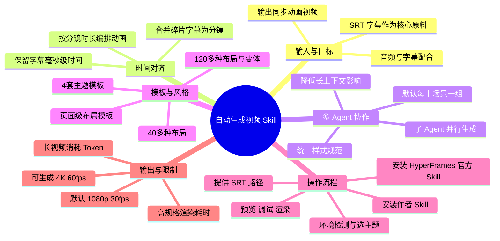

# Skill自动化工作流：告别手动做画面！从一段文字到爆款精美视频，全自动一键生成！

> 来源：[Bilibili 视频](https://www.bilibili.com/video/BV1ftEv61EkH)  
> UP 主：YangAgent｜时长：10 分 09 秒｜分辨率：3840×2160  
> 标签：AI、AI 动画、AI 视频、Skill、工作流、HyperFrames、OpenClaw

## 小结

这期视频介绍了一套用于知识科普、解析和教学类视频的自动化画面生成 Skill。其输入核心是带精确时间信息的 SRT 字幕文件；工作流据此合并语义连贯的字幕片段、生成分镜与代码动画，并输出与原始音频时间线对齐的视频。

作者将它定位为上一期“文字生成音频和字幕”工作流的后续环节：前一环把文字变为音频与字幕，本期 Skill 再把字幕转化为画面。两者串联后，理论上可形成“文字 → 音频与 SRT → 动画视频”的自动化链路，但视频本身未提供完整的项目仓库、命令文本或实际测试数据，因此不能据此确认所有环境中的可复现性。

工作流的稳定性设计有两个重点：其一，长视频按**默认每 10 个分镜场景**分组，由多个子 Agent 并行生成，以规避单 Agent 上下文过长、后段注意力下降与顺序生成耗时过长的问题；其二，通过页面级布局模板和统一主题样式约束减少模型差异。作者称内置 **4 套主题模板**，拥有 **40 多种布局及变体合计 120 多种方案**。

实际使用上，先安装 HyperFrames 官方 Skill，再安装作者的 Skill；向 Agent 提供 SRT 路径并选择主题后，流程会检查 HyperFrames、FFmpeg 等依赖。默认输出为 **1080p、30 fps** 预览版本；可要求生成 **4K、60 fps**，但长视频高规格渲染会明显耗时，作者建议先在调试模式逐场景确认，再渲染终版。

该方案并非无成本：代码动画生成会随时长增加而提高 Token 与渲染成本；页面级模板换来稳定性，也牺牲一部分自由设计空间；4K 60 fps 对长视频渲染时间要求较高。视频中“免费分享”“不挑模型”“效果差异极小”等是作者陈述，应结合实际 Skill 版本、模型、订阅方案及本地硬件验证。

## 思维导图

## 目录

- [背景：画面制作是知识视频的高耗时环节](#背景画面制作是知识视频的高耗时环节)
- [工作流总览：从音频与字幕到同步视频](#工作流总览从音频与字幕到同步视频)
- [时间自动对齐：为什么以 SRT 为起点](#时间自动对齐为什么以-srt-为起点)
- [长视频生成：多 Agent 分组并行机制](#长视频生成多-agent-分组并行机制)
- [稳定画面：页面级布局与主题模板](#稳定画面页面级布局与主题模板)
- [安装、生成与文件输出](#安装生成与文件输出)
- [调试、高清渲染与 SRT 获取](#调试高清渲染与-srt-获取)
- [限制、适用范围与时效性](#限制适用范围与时效性)
- [字幕比对](#字幕比对)
- [评论分析](#评论分析)
- [处理记录](#处理记录)

## [背景：画面制作是知识视频的高耗时环节](https://www.bilibili.com/video/BV1ftEv61EkH?t=0)

作者将目标用户指向制作知识科普、内容解析、教学视频的人群。其判断是：写稿与录音相对容易，而“配画面”更容易成为制作瓶颈——静态图片容易显得单调，手工制作动画则可能让一条几分钟的视频占用大半天，且成品未必理想。

本期工作流试图自动化的并非全部视频生产，而是其中的**画面制作、动画编排和画面—音频时间对齐**环节。使用者仍需准备或生成音频及与之对应的字幕；视频后段也给出通过剪辑软件或上一期 Skill 获取 SRT 的方法。

> 图：关键帧直接展示了作者定义的工作流链路：以“音频 + 字幕文件”为输入，依次经历拆分分镜、设计画面、编排动画节奏，最后输出完整同步视频。它是理解本期输入与输出边界的核心示意图。

作者称该 Skill 与其上一期“音频字幕自动生成 Skill”可自然衔接：前者负责“文字 → 音频和字幕”，本期负责“字幕 → 自动生成画面”。这里的“从一段文字到完整视频”依赖两个工作流的组合，而不是本期 Skill 单独仅输入文字即可完成。

> 图：画面强调要“把最耗时的画面制作环节释放出去”，并以“文字 → 音频和字幕”“字幕 → 自动生成画面”说明两期工作流的分工。这有助于避免把本期 Skill 误解为独立的纯文本视频生成工具。

## [工作流总览：从音频与字幕到同步视频](https://www.bilibili.com/video/BV1ftEv61EkH?t=55)

作者介绍，这套 Skill 基于 **HyperFrames** 代码动画框架自动合成视频。其过程可按以下逻辑理解：

1. 用户提供音频与对应的 SRT 字幕文件。
2. Skill 读取 SRT 的文本和时间信息。
3. 系统依据语义连贯性，把碎片字幕合并为更完整的分镜场景。
4. 系统为场景匹配页面布局、填入文本、数据、图表或其他内容，并编排动画。
5. 最后按字幕所携带的时间轴合成视频，使画面与音频对齐。

视频开头的效果展示强调，画面段落和动画节奏会自动对齐到音频、字幕的时间轴。这里应理解为工作流的设计目标和作者展示的结果；成片的准确度仍会受 SRT 时间轴质量、文本正确性、Agent 生成结果和渲染环境影响。

作者提到的主要卖点包括：

- 主流模型生成的效果差异较小；
- 可用自然语言修改单独场景，不必重跑整条视频；
- 支持 4K 60 fps 输出；
- 可在 Claude Code、OpenCode 等 Agent 环境中使用；
- Skill 与文档据作者称免费分享。

其中，视频素材没有给出完整的模型对比表、支持环境兼容清单、授权协议或下载地址，因此上述范围不能进一步外推。

## [时间自动对齐：为什么以 SRT 为起点](https://www.bilibili.com/video/BV1ftEv61EkH?t=132)

作者称 SRT 是工作流“唯一的原材料”，但在前文的演示语境中，它与对应音频共同构成生产所需素材。SRT 被作为控制起点，原因是字幕条目天然包含每句话或片段的起止时间；作者口述其精度可到毫秒级。

流程中的关键数据保留方式如下：

1. **读取字幕文件**：取得文本内容与每段字幕的时间范围。
2. **语义合并**：把过于碎片化的字幕，按内容连贯性合并为完整分镜。
3. **保留场景时间信息**：每个分镜保留开始时间、持续时长，以及内部每句字幕的相对时间点。
4. **计算动画时长**：后续画面或动画不再靠人工估计时长，而是按照场景的保留时间信息计算。
5. **与原始音频对齐**：由于画面遵循与音频对应的字幕时间轴，最终合成时可实现画面节奏与旁白对齐。

这个思路的核心不是“AI 自动猜测语音节奏”，而是将已经存在的字幕时间码用作动画时间控制依据。因此，SRT 的准确性是整个流程的基础：如果字幕识别错字、断句错误、时间偏移或与最终音频不一致，自动生成的视频也会继承这些问题。

## [长视频生成：多 Agent 分组并行机制](https://www.bilibili.com/video/BV1ftEv61EkH?t=206)

对于十几分钟、包含数十个分镜场景的视频，作者没有采用单 Agent 依次写完全部场景的模式。其指出单 Agent 长链路生成会面临两类问题：

- **上下文限制与质量衰减**：场景积累后，模型注意力可能分散，后段生成效果下降，甚至可能发生时间对不齐等问题。
- **串行执行耗时**：一个场景接一个场景生成，整体等待时间长。

为此，Skill 会将场景分组，默认将**每 10 个场景交给一个子 Agent**，让多个子 Agent 并行生成。该设计试图同时降低每个 Agent 所需处理的上下文长度，并提高长视频项目的生成速度。

并行带来的风险是视觉割裂：若不同 Agent 各自设计背景、色彩、字体和间距，同一视频中可能出现风格断层。作者的解决方式是让所有子 Agent 遵循同一整套视觉基础规范，包括：

- 背景色；
- 文字颜色；
- 主色值；
- 字体与字号；
- 间距及比例等。

因此，多 Agent 机制的分工是“场景内容和动画的并行制作”，而统一性由模板和样式规范负责。视频没有披露子 Agent 的具体提示词、冲突处理逻辑、失败重试策略或最终合并算法，无法据素材判断其对复杂项目的稳定程度。

## [稳定画面：页面级布局与主题模板](https://www.bilibili.com/video/BV1ftEv61EkH?t=276)

> 图：关键帧以“第一，模型不挑”为标题，明确对应作者对跨主流模型稳定性的主张。它适合与下文的模板策略一同阅读，而不应被视为独立性能测试证据。

作者将本方案与其此前 Remotion 视频制作 Skill 作比较。此前方案采用偏**组件级模板**的思路，例如预设卡片、数字、图表组件，再由 Agent 将组件自由组合为画面。该方式上限高，但对模型的前端设计与组合能力依赖较大；换用不同模型可能产生明显差异。

本期改为**页面级布局模板**：针对知识视频常见内容类型，预先设计完整页面结构。视频中列举的适用内容包括：

- 一句话陈述；
- 数据展示；
- 对比说明；
- 流程步骤；
- 时间线；
- 清单列表等。

作者称系统准备了几十种完整布局，并有多种变体；元数据描述进一步给出“40 多种布局 + 变体共 120 多种”的数量。以数据展示为例，可有柱状图、环形图和大数字等不同变体。

Agent 在生成单一场景时，主要负责：

1. 判断当前分镜内容属于何种表达类型；
2. 从预设页面级布局中选择合适方案；
3. 填入文字、数据、图表或其他素材；
4. 依据场景时间编排动画。

这种设计将“页面骨架”预先固定，减少模型从零设计版式的任务，从而试图缩小不同模型之间的结果差异。作者的结论是：即便模型前端能力一般，也更容易得到结构清晰、效果稳定的画面。

对应代价也被作者明确说明：预设布局会降低画面自由度与灵活性。换言之，它更适用于可归入既有表达范式的知识型内容；若项目需要高度定制、非标准叙事或独特视觉表达，页面级模板可能构成约束。

主题方面，作者称当前内置 **4 套主题模板**，示例包括暗色科技风、牛皮纸质感、蓝白配色等。用户在生成开始时选择主题，整套视频将按该主题的色彩与视觉气质呈现，以保持前后一致。

## [安装、生成与文件输出](https://www.bilibili.com/video/BV1ftEv61EkH?t=368)

> 图：关键帧标明“本期分两部分”，即先说明原理、后讲安装和实操。它解释了本视频从机制介绍切换到操作流程的位置。

作者给出的安装顺序为先基础、后工作流：

1. **安装 HyperFrames 官方 Skill**  
   这是 Agent 能够编写和生成代码动画的基础。视频中展示了在命令行输入安装命令、选择正在使用的 Agent 工具、选择“全局安装”，再确认安装的操作。  
   但本次 ASR 未可靠识别屏幕中的具体命令，素材也未提供命令文本；因此不能补写或猜测安装命令。

2. **安装作者自己的 Skill**  
   作者表示随后执行另一条命令，并以类似方式选择 Agent 工具和全局安装。具体命令同样未在可用字幕中完整保留。

3. **向 Agent 发起任务**  
   用户可将文档中的安装/使用说明直接发送给 Agent，并指定 SRT 字幕文件路径。之后 Skill 开始执行。

4. **环境检测**  
   Skill 会检查 HyperFrames、FFmpeg 等依赖是否安装。若存在缺失依赖，流程会停止并提示；用户可以自行安装，也可以让 Agent 协助安装。

5. **选择风格**  
   通过环境检测后，Skill 会提示选择主题风格；具体效果可参考作者文档中列出的示例。

6. **开始生成**  
   主题确定后进入分镜、页面与动画生成流程。

项目目录方面，作者称代码项目会创建在**字幕文件同级目录**下，外层使用一个工作流文件夹，内部再按生成日期创建子文件夹；最终视频位于该项目目录内。视频未提供确切的文件夹名称、文件结构树或输出文件名，因此不宜将其写成固定路径规范。

### 默认输出参数

| 项目 | 视频中说明 |
| --- | --- |
| 默认分辨率 | 1080p |
| 默认帧率 | 30 fps |
| 默认用途 | 预览整体效果 |
| 高规格输出 | 可要求 4K、60 fps |
| 基础依赖示例 | HyperFrames、FFmpeg |
| 长视频并行规则 | 默认每 10 个场景分配一个子 Agent |

默认预览成片若已满足需求，作者建议直接将其拖入剪辑软件，再与音频、字幕进行合成。这里表明自动生成项目仍可能需要在后期软件中完成最终素材组合，具体是否已内嵌音轨应以实际项目输出为准。

## [调试、高清渲染与 SRT 获取](https://www.bilibili.com/video/BV1ftEv61EkH?t=457)

### 单场景调试流程

当某些场景动画效果不理想时，作者建议不要重跑整条视频，而是按场景调试：

1. 告诉 Agent 对当前项目启动调试模式。
2. 同时提供对应音频文件的路径。
3. Skill 会将音频挂到时间轨道上，并启动调试服务。
4. 在浏览器中打开对应地址，进入调试界面。
5. 界面中可查看每个场景对应的画面与音频位置。
6. 用自然语言向 Agent 描述需改动的场景和预期效果。
7. Agent 完成修改后，调试界面实时刷新，可立即查看更新结果。
8. 全部场景确认后，要求取消调试模式；作者称该操作会移除音频轨道。
9. 再重新合成视频。

该方法的关键经验是将“整条视频重生成”转化为“定位到一个场景、描述一个问题、查看实时结果”的循环，从而降低返工范围。视频没有展示具体浏览器地址、调试命令或场景定位格式，实际调用方式需以 Skill 文档或 Agent 反馈为准。

### 4K 60 fps 输出与成本控制

如需高规格成片，作者称只需向 Agent 提出制作 4K 60 fps 视频的请求。但其同时提醒：

- 代码驱动动画的视频越长，计算量越大；
- 视频时长增加，也会提高 Token 消耗；
- 一个十来分钟的 4K 60 fps 视频可能渲染数十分钟；
- 因此应先在调试模式中完成逐场景优化，确认整体满意后再生成终版；
- 若直接按 Token 计费，尤其处理长视频时，成本可能较高；作者更建议在具备类似 Coding Plan 的订阅条件下使用。

以上“数十分钟”是作者针对十来分钟视频的经验性提醒，不构成固定性能承诺。实际时间还受项目复杂度、设备配置、渲染器、并行能力与网络/模型响应速度影响。

### 获取 SRT 的两种方式

作者给出两条 SRT 来源路径：

1. **剪辑软件导出**
   - 对已录制音频执行字幕识别；
   - 检查字幕正确性；
   - 在导出窗口选择字幕导出；
   - 格式选择 SRT。

2. **使用上一期文字转音频与字幕 Skill**
   - 将文字自动生成音频与字幕；
   - 直接使用生成的字幕文件作为本期工作流输入；
   - 用以减少人工制作字幕的时间。

无论采用何种方式，导出后都应检查文本、断句和时间码是否与最终音频匹配。因为本工作流以 SRT 控制画面时长，字幕质量会直接影响分镜语义与同步效果。

## [限制、适用范围与时效性](https://www.bilibili.com/video/BV1ftEv61EkH?t=568)

### 可迁移经验

- **以结构化时间数据驱动画面**：带时间码的字幕可使画面、旁白与动画节奏有共同的时间基准。
- **先固定版式，再让模型填充内容**：对于结构化知识表达，页面级模板能降低模型设计能力差异带来的波动。
- **长任务分块并行**：将长视频分镜按组交由多个 Agent 处理，可同时控制上下文规模和等待时间。
- **先低规格验证，再高规格渲染**：1080p 30 fps 预览与单场景调试，有助于避免把高成本渲染花在未确认的内容上。
- **将字幕校对前置**：任何字幕错误、时间偏差都可能传播到后续自动分镜与动画时间线。

### 已知限制

| 类别 | 限制或风险 |
| --- | --- |
| 输入质量 | SRT 错字、断句不当、时间码偏移，会影响分镜与同步。 |
| 模板自由度 | 页面级布局提高稳定性，但限制了完全自由的页面设计。 |
| 成本 | 视频越长，代码生成和 Token 消耗越高；按量计费时需提前估算。 |
| 渲染时间 | 4K 60 fps 尤其耗时，十来分钟视频可能耗费数十分钟。 |
| 环境依赖 | 需要 HyperFrames、FFmpeg 等环境；缺失依赖会中止流程。 |
| 信息缺口 | 素材未给出具体安装命令、完整文档链接、模型兼容清单、许可证与基准测试。 |

### 时效性说明

视频元数据的发布时间按 Unix 时间戳换算为 2026 年 6 月，素材抓取时间为 2026-07-13。AI Agent 工具、HyperFrames、Claude Code、OpenCode、模型计费和 Skill 安装方式更新频繁，本文仅记录该视频及其提供素材中的说法，不能保证当前版本仍具有相同的命令、主题数量、布局数量、依赖关系或性能表现。

“主流模型效果差异很小”“Skill 与文档全部免费分享”“支持 4K 60 fps”等均为作者在视频/简介中的陈述；由于没有提供独立测试过程和完整公开文档内容，建议在实际使用前确认最新版仓库、依赖、收费规则与输出授权。

## [字幕比对](https://www.bilibili.com/video/BV1ftEv61EkH?t=0)

本次已执行 ASR。站内字幕抓取失败，素材记录中的警告为：`subtitles: Tool process exited with code 1. Missing JSON resource URL.`，因此没有可用的 Bilibili 站内字幕可供逐句比对。

| 字幕来源 | 完整性 | 专有名词 | 时间轴 | 主要问题 |
| --- | --- | --- | --- | --- |
| Bilibili 站内字幕 | 未提供可用字幕 | 无法评估 | 无法评估 | 字幕工具未取得 JSON 资源 URL，无法下载或核对。 |
| 本次 ASR 字幕 | 覆盖了视频主要内容与操作顺序 | 存在较多识别偏差 | 提供素材未附逐条时间戳 | “Skill”“HyperFrames”“Agent”等词有误识别、重复和同音替换。 |

### 最终字幕采用策略

正文以本次 ASR 为主要文本依据，并结合视频标题、简介、标签、关键帧中的可见文字进行有限校正。由于没有站内字幕，无法进行站内字幕与 ASR 的逐字一致性验证；未能确认的命令、界面选项及路径均不补写。

重要校正如下：

| ASR 中的表达 | 正文采用 | 校正依据 |
| --- | --- | --- |
| “Skyl”“Skew”“SKU”“sql” | Skill | 视频标题、简介、关键帧中的“自动生成视频 Skill”。 |
| “hyperframes”及近似误识别 | HyperFrames | 视频简介与标签明确标注 HyperFrames。 |
| “A阵”“A-Lint” | Agent / Agent 环境 | 上下文说明为选择正在使用的 Agent 工具；具体产品名无法确认。 |
| “HP 的电源 FMPEG” | HyperFrames、FFmpeg 等依赖 | ASR 语义与视频简介的技术上下文；“HP 的电源”不按字面采用。 |
| “Remotion 视频制作 skill” | Remotion 视频制作 Skill | ASR 在该处识别相对清楚，且符合作者对旧方案的对比叙述。 |

ASR 存在多处重复句子，例如“本期视频我会分两部分来讲”“一目了然”等；本文已按语义去重。关于“精确到毫秒”的表述，正文保留为作者对 SRT 时间信息的说明，而非对实际生成误差的独立测量结论。

## [评论分析](https://www.bilibili.com/video/BV1ftEv61EkH?t=600)

仅处理本次可获取的热评前三条。三条评论均未提供技术细节、失败案例或外部验证信息，主要反映观众希望获得工作流的分享或获取方式。

1. **铁律交易**（2 赞）：“已三连，求”  
   - 观点：表达支持后请求内容，语义未明确说明想索取的具体资源，但结合视频主题，可能指向工作流或文档。  
   - 补充信息：无。  
   - 可信度与价值：仅能反映获取意愿，不能用于验证工作流效果、免费性或可用性。

2. **PLATO1118**（2 赞）：“已三连求工作流”  
   - 观点：明确希望获得工作流。  
   - 补充信息：无。  
   - 可信度与价值：侧面说明观众对可复用资源有需求；并不证明作者已经在评论区提供下载渠道。

3. **superzhou827**（1 赞）：“厉害了🤙👍，三连了，求分享”  
   - 观点：肯定视频展示效果，并请求分享。  
   - 补充信息：无。  
   - 可信度与价值：属于正向反馈，不包含对输出质量、安装成功率、成本或模型兼容性的可验证信息。

总体而言，前三条热评集中在“求工作流/求分享”，未形成实操经验或争议讨论。评论中的请求不能替代对视频简介所称“免费分享”的实际可获取性核验。

## [处理记录](https://www.bilibili.com/video/BV1ftEv61EkH?t=0)

- Worker ID：`worker-mrj0wbly-5dc4e50c`
- 模型：`gpt-5.6-terra`
- 调用工具与素材：视频元数据、视频简介、关键帧清单、关键帧图像、ASR 字幕、热评 JSON、素材处理警告记录。
- 使用的应用工具：素材采集流程已输出 `merged.mp4`、`audio/audio.wav`、`frames/`、`comments/comments.json` 与 `asr/`；站内字幕抓取工具执行失败。
- 字幕选择：本次 ASR 已执行且作为正文主要依据；站内字幕未提供可用资源，未进行逐字合并。对 Skill、HyperFrames、FFmpeg、Remotion 等术语以元数据、简介与关键帧上下文做了保守校正。
- 关键帧选择依据：  
  - `frames/frame-001.jpg`：展示输入、分镜、画面、动画、输出的完整链路，适合说明工作流边界。  
  - `frames/frame-002.jpg`：展示本期与上一期 Skill 的衔接关系，适合澄清“文字到视频”需两个环节配合。  
  - `frames/frame-003.jpg`：直接呈现“模型不挑”主张，适合引入页面级模板的稳定性逻辑。  
  - `frames/frame-004.jpg`：展示视频内容结构，适合标记原理讲解向实操讲解的过渡。  
  其余关键帧路径虽在清单中提供，但未附可核验画面内容，未为增加图片数量而推测使用。
- 缓存清理：未提供缓存清理执行结果；未将素材清单之外的文件或操作虚构为已清理。
- 未解决问题：具体安装命令、Skill 获取链接、许可证、完整目录结构、实际模型清单、主题名称全表、布局模板全表、渲染基准与项目成功率均未在可用素材中完整提供。

## 评论分析

本次流程未获取到可用热评，因此不推断观众态度或额外结论。
