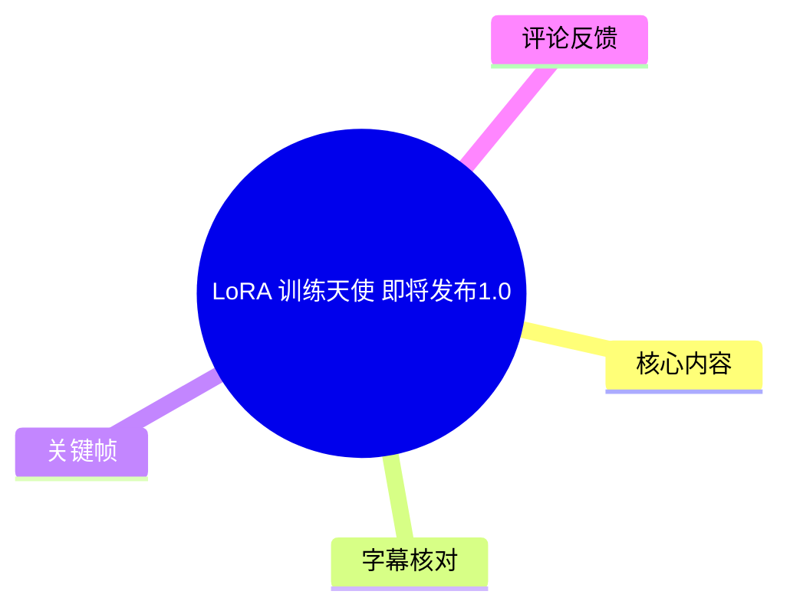
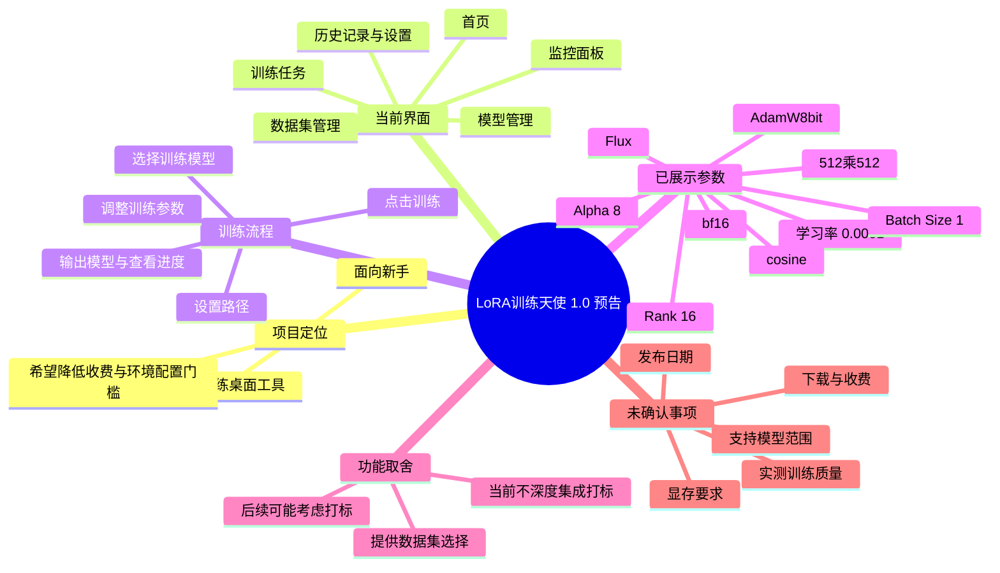
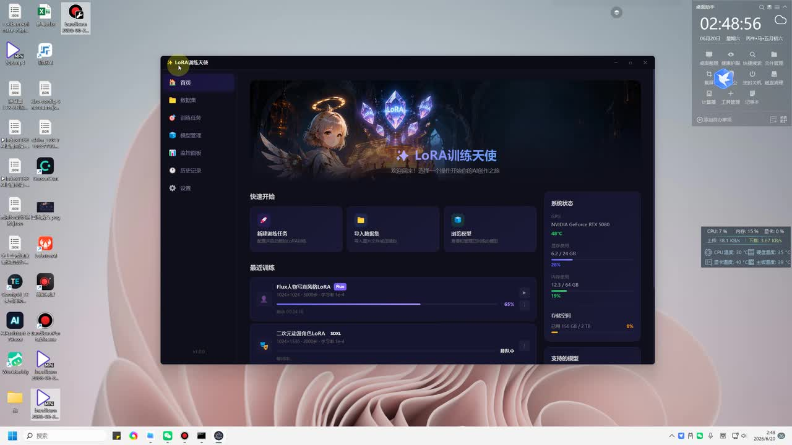
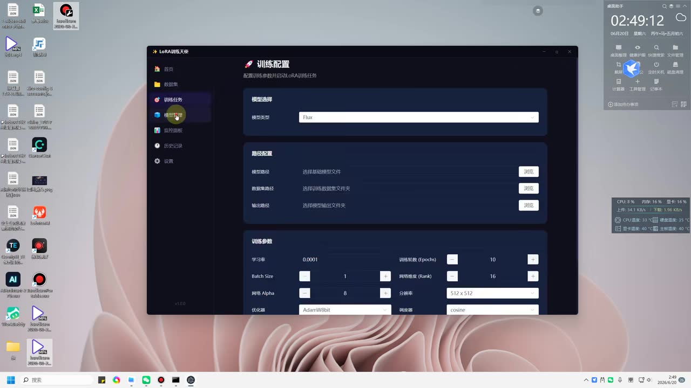
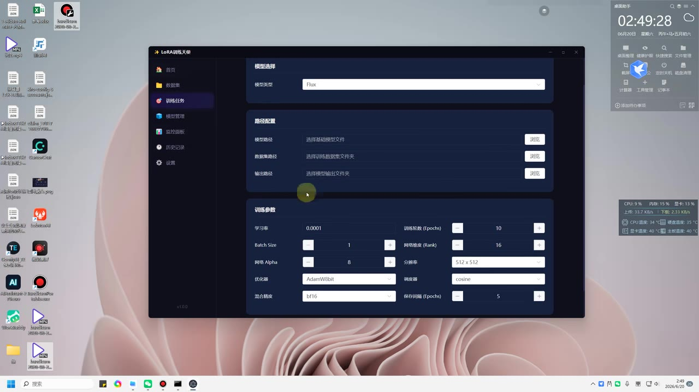
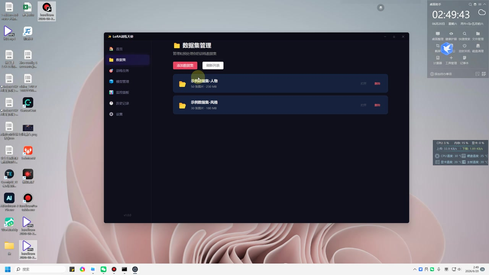

# LoRA 训练天使 即将发布1.0

> 来源：[Bilibili 视频](https://www.bilibili.com/video/BV1igjk6WEBf)<br>
> UP 主：LoRA训练天使｜发布时间：2026-06-20｜视频时长：03:27｜分辨率：2560×1440  
> 标签：`lora训练器`、`训练天使`、`lora`

## 小结

这是一个名为 **“LoRA训练天使”** 的 LoRA 训练桌面工具预告。UP 主表示，项目动机是降低国内用户使用 LoRA 训练器时可能遇到的收费、环境配置和操作复杂度，希望做成面向新手、以较少配置完成训练的工具。

视频展示的当前界面已包括：首页、数据集、训练任务、模型管理、监控面板、历史记录和设置等导航项；训练页可选择模型、配置模型/数据集/输出路径，并调整学习率、Batch Size、网络 Rank 与 Alpha、分辨率、优化器、精度、学习率调度器、保存间隔等参数。

视频中强调的交互路线是“选择训练模型后点击训练”，即尽可能压缩训练流程。UP 主明确表示，**当前版本不计划把数据打标功能深度集成到软件中**，原因是打标方式需要随素材类型变化，且打标环节会引入更多复杂问题；后续是否加入仍仅是可能性，并非已公布功能。

画面中的训练配置以 **Flux** 为已选模型，显示学习率 `0.0001`、Batch Size `1`、Rank `16`、网络 Alpha `8`、分辨率 `512 × 512`、优化器 `AdamW8bit`、混合精度 `bf16`、调度器 `cosine`、训练轮数 `10`、保存间隔 `5 Epochs`。这些是演示 UI 中显示的值，视频没有证明它们适用于所有底模、数据集或显卡配置，不能直接视为通用推荐配方。

视频标题称“即将发布 1.0”，但内容属于预告和界面展示，未给出发布日期、下载方式、许可证、收费规则、支持的全部底模、训练后端、最低显存、操作系统范围或实际训练效果对比。因此，该项目功能状态与可用性具有明显时效性，应以 UP 主后续发布信息为准。

## 思维导图





## 目录

- [项目背景与定位](#项目背景与定位-000001)
- [界面结构与已展示功能](#界面结构与已展示功能-000025)
- [训练配置：路径、模型与参数](#训练配置路径模型与参数-000025)
- [数据集管理与打标功能取舍](#数据集管理与打标功能取舍-000049)
- [极简训练流程与进度监控](#极简训练流程与进度监控-000113)
- [开发动机、开源基础与发布状态](#开发动机开源基础与发布状态-000145)
- [技术经验、限制与时效性](#技术经验限制与时效性-000301)
- [字幕比对](#字幕比对)
- [评论分析](#评论分析)
- [处理记录](#处理记录)

## [项目背景与定位](https://www.bilibili.com/video/BV1igjk6WEBf?t=1) `00:00:01`

UP 主在开场介绍其正在制作的 LoRA 训练工具，并称项目名为“LoRA训练天使”。本次内容是在端午节期间制作的预告性展示，重点不是演示一次完整训练，而是说明产品方向和展示初步 UI。

视频提出的主要问题包括：

1. **工具获取与收费问题**：UP 主认为，国内可用训练工具可能存在“没有”或“收费”的情况，并表达了对部分收费水平的不满。这是创作者的个人判断，视频没有给出具体产品、价格或横向对比数据。
2. **环境配置成本**：UP 主提到使用其他训练方案时遇到环境问题，需要持续排查和解决；其目标是把这些复杂度封装到更易用的桌面工具中。
3. **新手操作门槛**：产品希望提供较少步骤的训练入口，让用户在选定模型、设置必要项后即可发起训练。
4. **生态内容计划**：UP 主称会从训练相关内容切入 AI 圈，并可能分享模型；但未说明模型来源、授权、发布平台或具体时间。

这里的“LoRA”是指一种常用于扩散模型等生成式模型微调的低秩适配方法。视频的实际重点是训练器的操作界面与产品定位，而不是解释 LoRA 数学原理或给出可复现实验。



> 图：关键帧展示深色主题的“LoRA训练天使”首页。左侧可见“首页、数据集、训练任务、模型管理、监控面板、历史记录、设置”等导航；中央有“新建LoRA训练任务、导入数据集、浏览模型”等快捷入口。这张图直接证明视频展示的是桌面端多模块管理工具，而非只有单一命令行入口。

## [界面结构与已展示功能](https://www.bilibili.com/video/BV1igjk6WEBf?t=25) `00:00:25`

从首页和侧栏画面可确认，当前 UI 至少规划了以下模块：

| 模块 | 画面中可见内容 | 可确认范围 |
| --- | --- | --- |
| 首页 | 快捷开始卡片、最近训练、系统状态、支持的模型区域 | 可作为训练入口和状态概览 |
| 数据集 | 数据集列表、添加数据集、刷新列表 | 可管理已导入数据集 |
| 训练任务 | 训练配置页面 | 可选择模型、路径和训练参数 |
| 模型管理 | 左侧导航项存在 | 具体管理能力未展示 |
| 监控面板 | 左侧导航项存在；首页也有系统状态与训练进度区域 | 可能用于查看状态，但详情未展示 |
| 历史记录 | 左侧导航项存在 | 具体记录内容未展示 |
| 设置 | 左侧导航项存在 | 配置项未展示 |

首页“最近训练”区域能看到两个示例任务，其中一个名称含有“Flux人像写真风格LoRA”，另一个名称含有“二次元动漫角色LoRA”，并带有进度条。这至少说明界面设计中考虑了不同用途的 LoRA 任务与任务进度展示；但视频没有展示这些任务是否实际完成，也没有给出训练样本和生成结果。

右侧“系统状态”卡片可见显卡名称为 **NVIDIA GeForce RTX 5080**，并显示显存、内存和存储等占用信息。该信息只能说明录屏环境正在展示该硬件状态；不能据此推出软件的最低硬件要求或 Flux 训练所需显存。


> 图：首页中“最近训练”与“系统状态”并列出现，体现出该工具试图同时覆盖任务发起、任务追踪和本机资源观察。画面并未展示资源监控是否会影响训练、是否支持多 GPU 或远程设备。

## [训练配置：路径、模型与参数](https://www.bilibili.com/video/BV1igjk6WEBf?t=25) `00:00:25`

训练任务页标题为“训练配置”，副标题表达了“配置训练参数并启动 LoRA 训练任务”的用途。视频实际展示了模型选择、路径配置和训练参数三部分。

### 模型与路径配置

画面中“模型选择”下拉框已选中：

- **模型类型：`Flux`**

“路径配置”区域提供三个带“浏览”按钮的输入项：

| 配置项 | 画面提示文字 | 作用 |
| --- | --- | --- |
| 模型路径 | 选择基础模型文件 | 指定待训练的基础模型文件 |
| 数据集路径 | 选择训练数据集文件夹 | 指定训练素材所在目录 |
| 输出路径 | 选择模型输出文件夹 | 指定训练产物保存位置 |

视频没有展示实际选择的文件、文件格式、目录结构、图像数量、标注文件格式、模型权重格式或路径校验规则。因此，不能仅凭界面推断其完整支持范围。

### 画面中显示的训练参数

下表逐项记录训练页当前可见值。它们是演示状态，视频没有说明是否为默认值、是否会因模型类型自动变化，也没有说明调参理由。

| 参数 | 画面显示值 | 视频可确认的含义 |
| --- | ---: | --- |
| 学习率 | `0.0001` | 可在训练页配置 |
| Batch Size | `1` | 可用加减控件调整 |
| 网络 Alpha | `8` | 可用加减控件调整 |
| 优化器 | `AdamW8bit` | 通过下拉框选择 |
| 混合精度 | `bf16` | 通过下拉框选择 |
| 训练轮数（Epochs） | `10` | 可用加减控件调整 |
| 网络维度（Rank） | `16` | 可用加减控件调整 |
| 分辨率 | `512 × 512` | 通过下拉框选择 |
| 学习率调度器 | `cosine` | 通过下拉框选择 |
| 保存间隔（Epochs） | `5` | 可用加减控件调整 |



> 图：该帧是视频中最关键的技术界面证据：模型类型为 Flux，且可见模型路径、数据集路径、输出路径与大部分训练参数。它能帮助读者区分“视频口头承诺的极简操作”与“实际仍需填写的训练配置项”。



> 图：该帧更完整地呈现路径配置和参数区，确认了 `AdamW8bit`、`bf16`、`cosine`、`512 × 512`、`10 Epochs` 与每 `5 Epochs` 保存等 UI 显示值。参数是否真实生效、是否可编辑到其他范围，视频未验证。

### 参数理解与使用边界

从通用训练概念看，这些字段分别对应训练步幅、单次批量、LoRA 容量、数值精度、优化策略、学习率变化方式与检查点保存频率；但视频没有讲解它们的原理或推荐区间。因此，基于本视频可迁移的经验是：

1. 训练器将关键配置集中在一个页面，便于先完成最小可用设置。
2. 数据集、基础模型和输出位置仍是用户必须明确提供的输入。
3. 即使界面追求“一键训练”，参数选择仍可能对训练速度、显存占用和结果产生影响。
4. 对于 Flux、SD 或其他模型，不能在没有验证的情况下照搬同一组参数。

## [数据集管理与打标功能取舍](https://www.bilibili.com/video/BV1igjk6WEBf?t=49) `00:00:49`

UP 主在此段明确讨论了为什么当前不把打标功能作为核心集成功能：

- 许多工具或网站可以完成打标；
- 打标可能面对各种具体问题；
- 不同类型的数据或训练目标需要不同的打标方式；
- 因此当前优先做“数据集选择”与训练本身，而不是把打标流程全部塞入训练器；
- 后续“可能会考虑”打标功能，但不是当前已实现或承诺发布的能力。

这里的“打标”在 LoRA 训练语境中通常涉及为训练图像准备文字描述、标签或对应元数据。视频没有具体说明支持何种标注格式，也没有展示自动打标、人工编辑、标签清洗、反推提示词、JSON/CSV/TXT 导入等能力。

数据集管理页画面显示：

- 按钮：**添加数据集**、**刷新列表**；
- 示例数据集：**示例数据集-人物**，显示 `50 张图片 · 230 MB`；
- 示例数据集：**示例数据集-风格**，显示 `30 张图片 · 180 MB`；
- 每项右侧有“打开”“删除”操作。



> 图：该帧说明工具至少具有数据集条目管理的界面设计，并以“人物”和“风格”两个示例集合区分训练素材类型。图中数量与容量属于示例数据，不等于 LoRA 训练的官方最低或推荐数据量。

### 可执行的最小流程

根据视频界面和口述，能整理出的操作顺序如下；其中“准备标注”和“验证结果”是训练实践通常需要的环节，但视频没有展示工具内如何完成，故单独标明。

1. 进入“数据集”页，点击“添加数据集”，导入训练素材目录。
2. 在工具外或以其他方式完成所需的数据准备与打标；视频当前并未承诺内置打标。
3. 进入“训练任务”页。
4. 在“模型选择”中选定要训练的模型类型；视频示例为 `Flux`。
5. 分别通过“浏览”指定基础模型文件、数据集文件夹和模型输出文件夹。
6. 按任务需要设置学习率、Batch Size、Rank、Alpha、分辨率、优化器、精度、Epoch、调度器和保存间隔。
7. 发起训练，并查看工具保留的训练进度或监控信息。
8. 从输出目录取得模型文件，再自行进行推理验证；视频没有展示这一验证步骤。

## [极简训练流程与进度监控](https://www.bilibili.com/video/BV1igjk6WEBf?t=73) `00:01:13`

UP 主在这段反复强调当前方案的取舍：希望集成可训练的模型，用户选择模型后点击训练即可；不希望过度加入不必要的功能。训练完成后的核心产物是输出模型。

不过，UP 主也提到原本想去掉某些监控/控制类内容，但考虑到用户可能需要查看训练进度，最终保留了较简短的状态展示。这与首页画面中“最近训练”进度条及“系统状态”区域相对应。

可将产品的当前交互思路概括为：

```text
准备基础模型、数据集与输出目录
            ↓
选择模型类型
            ↓
设置或确认少量训练参数
            ↓
点击训练
            ↓
查看训练进度 / 系统状态
            ↓
取得输出模型
```

需要注意，视频中的“一键”或“点击一下”是对产品目标体验的概括，而非表示训练本身不再需要数据准备、模型选择、路径设置和参数确认。训练时间、失败重试、显存不足、数据质量、输出质量与兼容性问题均未在视频中实测。

## [开发动机、开源基础与发布状态](https://www.bilibili.com/video/BV1igjk6WEBf?t=105) `00:01:45`

UP 主称，希望做出这款训练器以回应自己对高收费工具和环境配置问题的体验，并希望借助较新的 AI 编程方式制作一款更适合“小白”的工具。关于“会轰动 AI 界”“冲击”既有产品等说法，属于创作者愿景或宣传性表达，不应视为已被市场或技术指标验证的事实。

在约 `00:02:34` 后，UP 主表示会利用开源项目/作者的基础来完成工具，并在 `00:02:57` 左右切换画面查看作者信息。但现有 ASR 对项目名和作者名的识别不可靠，视频提供的文字素材中也没有可稳定复核的名称。因此只能确认：

- 创作者声称将使用某位开发者的开源训练相关基础；
- 创作者称 SD 及“秋叶”等既有训练器此前也使用相关基础进行训练；
- **具体开源项目名称、作者、许可证、版本号、代码仓库地址和集成方式均无法从现有材料可靠确认。**

在结尾，UP 主再次表示想制作自己的 LoRA 训练器，并邀请观众提出意见；本视频只是预告。

## [技术经验、限制与时效性](https://www.bilibili.com/video/BV1igjk6WEBf?t=181) `00:03:01`

### 可迁移的产品设计经验

1. **把高频路径放在首页**：新建训练、导入数据集、浏览模型等入口集中展示，能减少新手寻找功能的成本。
2. **将复杂性分层**：训练参数没有完全隐藏，但被集中在同一页；这比将环境、模型、数据和运行指令分散在多个工具中更易理解。
3. **避免过早覆盖所有环节**：对打标功能采取暂不深度集成的策略，体现出先解决训练主链路、再考虑扩展功能的产品取舍。
4. **保留进度可见性**：即使产品追求简化，训练任务仍需要基础的进度和资源状态反馈，以便用户判断是否正在运行。

### 视频未解决或未验证的技术问题

| 问题 | 视频状态 |
| --- | --- |
| 1.0 正式发布日期 | 未公布 |
| 下载地址、安装方式、系统支持范围 | 未公布 |
| 价格、免费范围、商业使用规则 | 未公布 |
| 完整支持的模型类型 | 未公布；画面仅明确展示 Flux |
| 是否支持 SD、SDXL 或其他架构的具体版本 | 仅有口头关联说法，未展示配置或实测 |
| 训练后端与开源依赖 | 声称会使用开源基础，但名称和版本无法可靠确认 |
| 最低/推荐显存与硬件要求 | 未公布 |
| 16GB 显存能否训练 | 未回答、未实测 |
| 数据集标注格式及打标工作流 | 未公布；当前不深度集成打标 |
| 实际训练速度、稳定性与生成效果 | 未展示 |
| 失败处理、日志、断点续训、多卡/远程训练 | 未展示 |
| 模型输出格式及推理兼容性 | 未展示 |

### 时效性说明

视频发布于 2026-06-20，标题为“即将发布1.0”。画面左下角可见版本样式文本，但仅凭当前素材不宜将其作为正式发布状态的证据。工具仍可能在功能、参数默认值、支持模型、依赖库及收费策略上发生变化。

因此，本文只记录视频中实际说出或画面实际显示的内容。任何关于“免费”“全面支持所有模型”“适配所有硬件”“可一键完成高质量训练”的结论，都需要等待正式版本、文档、代码仓库或独立实测验证。

## 字幕比对

| 字幕来源 | 完整性 | 专有名词 | 时间轴 | 主要问题 |
| --- | --- | --- | --- | --- |
| Bilibili 站内字幕 | 未提供可用字幕 | 无法核验 | 无法使用 | 本次素材中没有可用站内字幕文件 |
| 本次 ASR 字幕 | 较高：覆盖约 194.28 秒，占音频时长约 94.11% | 存在多处误识别 | 可用：共 10 段，带精确 SRT 起止时间 | “LoRA”“训练器”“打标”“AI Toolkit/开源项目”等词出现明显音近误识别；个别句子断裂或语义不完整 |

本次 ASR 使用 `medium` 模型，识别语言为中文，语言概率为 `0.99365234375`；音频时长约 `206.44` 秒，首段语音从 `00:00:01.140` 开始，最后一段至 `00:03:24.280`。诊断中没有 `noAudioStream=true` 标记，且已生成音频与带时间戳 ASR 结果，因此本视频并非“无音轨素材”的情况。

最终采用策略如下：

- **时间轴**：以本次 ASR 的 SRT 分段时间为准，所有章节链接均基于真实分段起点换算秒数。
- **正文术语**：结合视频标题、UP 主名称、左上角软件名和 UI 文本，将 ASR 中反复出现的“Lola”“训员天使”“训读机”等校正为“LoRA”“LoRA训练天使”“训练器”。
- **参数与界面文字**：以关键帧中可直接读取的 UI 为优先证据，例如 `Flux`、`0.0001`、`AdamW8bit`、`bf16` 与 `cosine`。
- **无法可靠校正的词语**：ASR 中类似“Aon Token / AirToking / AirToken”“机油”等表述无法仅依据当前素材唯一确定；正文不将其扩写为具体产品或项目名称。
- **未用站内字幕补正**：因未提供可用站内字幕，无法进行站内字幕与 ASR 的逐句交叉验证。

## 评论分析

以下仅处理本次可获取的热评前三条。每条评论均为观众个人表达，不构成对产品能力的验证。

1. **流碎丶**：`“三连了，蹲蹲anima”`（获赞 1）  
   - 观点：表达支持，并期待与“anima”相关的内容或能力。  
   - 补充信息：评论未解释“anima”具体指模型、功能还是其他项目。  
   - 可信度与边界：视频正文没有展示或提及名为“anima”的支持项，不能据此推断软件会支持它。

2. **平安xxa**：`“己三连”`（获赞 1）  
   - 观点：表示已点赞、投币、收藏式的支持。  
   - 补充信息：没有提出技术问题或提供产品实测信息。  
   - 可信度与边界：只能反映有限的早期互动意愿，不能反映产品性能。

3. **弦之又弦**：`“关注UP了，不知道16G显存能不能训练。”`（获赞 1）  
   - 观点：关注工具对 `16GB` 显存设备的可用性。  
   - 补充信息：该问题与实际用户门槛直接相关。  
   - 可信度与边界：视频没有给出最低显存或 16GB 显存实测结果；首页出现 RTX 5080 的状态卡也不能替代硬件需求说明。该问题在现有素材中仍未解决。

## 处理记录

- **Worker ID**：`worker-mrj0www4-e8d79408`
- **模型**：`gpt-5.6-terra`
- **调用工具与素材**：视频元数据读取、音频提取、ASR 转写（`medium`，CUDA，`float16`）、ASR SRT 时间轴、关键帧画面理解、热评读取。
- **字幕检查与选择**：站内字幕未提供可用文件；已检查本次 ASR 结果。采用 ASR 的精确分段时间轴，并用标题、UI 可见文字和上下文对明显术语误识别进行有限校正。
- **关键帧选择依据**：选择 `frame-001.jpg` 说明产品首页、导航和系统状态；选择 `frame-002.jpg` 与 `frame-003.jpg` 记录训练配置、模型类型、路径和参数；选择 `frame-004.jpg` 记录数据集管理页与示例集合。图片均用于支撑正文中可直接观察的 UI 信息，不用于推断未展示功能。
- **缓存清理**：素材中未提供缓存清理执行日志；无法确认是否已清理缓存，因此不将其记为已完成。
- **未解决问题**：正式发布日期、下载与安装方式、收费与许可证、开源依赖名称、完整模型支持范围、真实训练后端、16GB 显存兼容性、数据标注格式、训练效果与性能均未在本视频中得到可靠验证。
