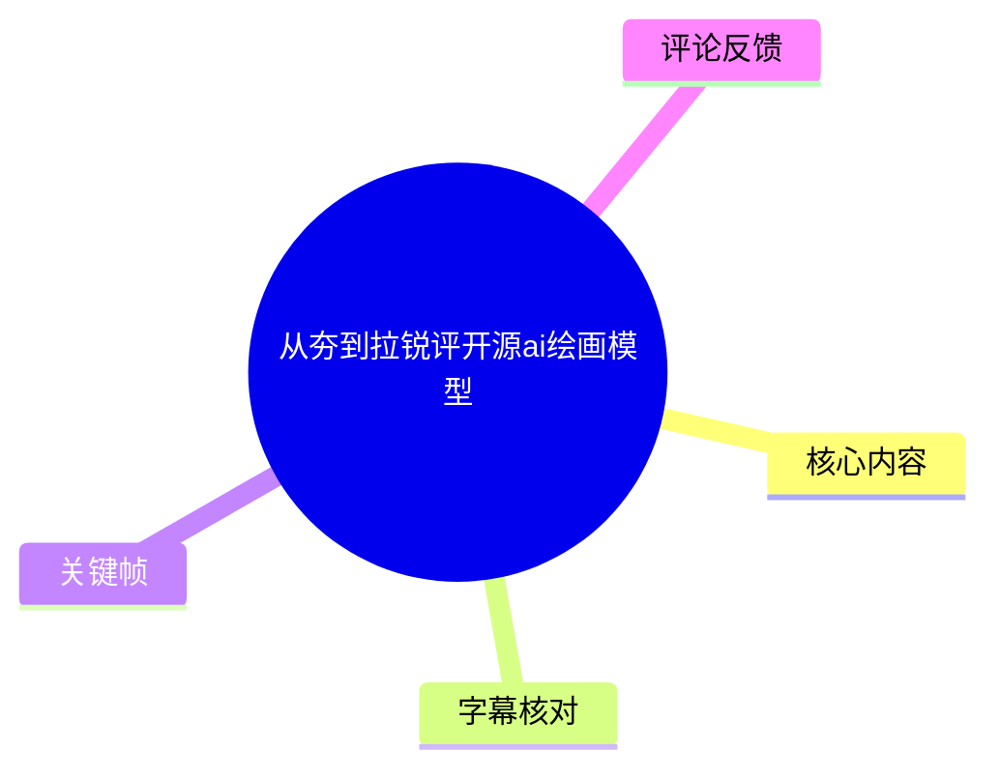
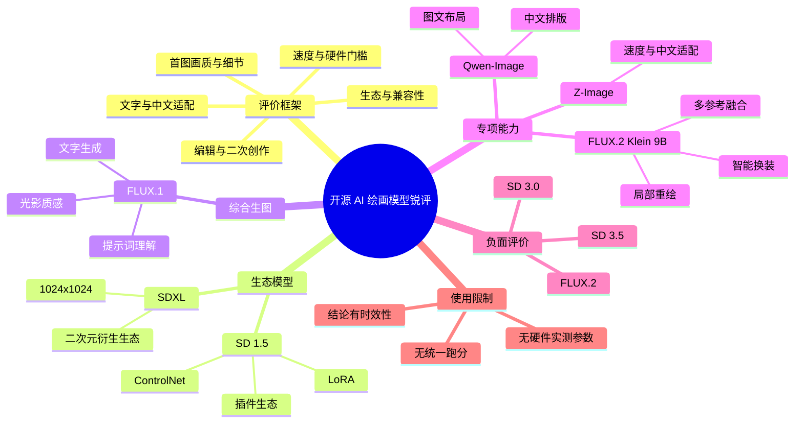
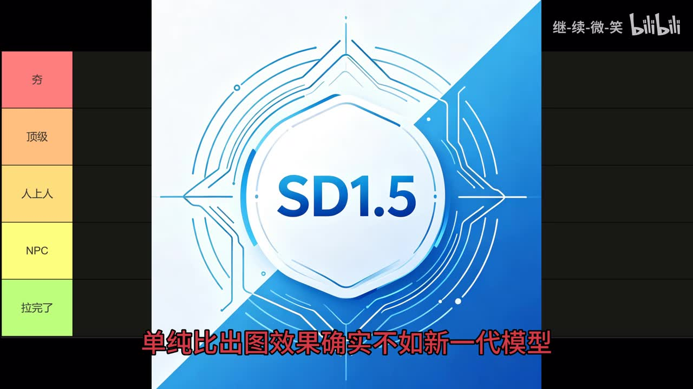
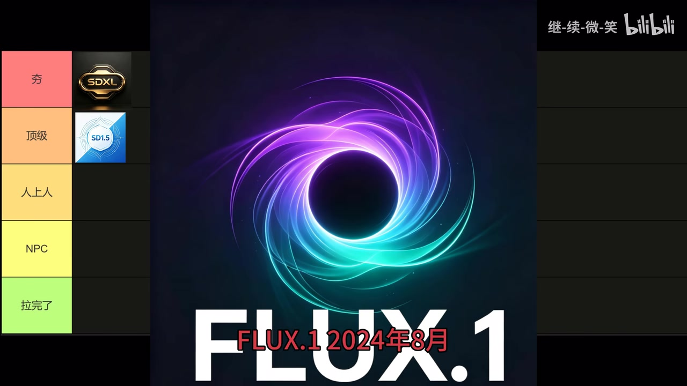

## 小结

视频以“夯、顶级、人上人、NPC、拉完了”五档主观榜单，快速评价多个开源 AI 绘画模型。作者实际采用的判断维度并不只是首图画质，还包括模型生态、中文与文字生成、提示词理解、图文排版、推理速度、显存/硬件门槛，以及局部编辑和二次创作能力。

作者将 **Stable Diffusion 1.5** 视为“生态型基座”：其原始出图已不及新一代模型，但围绕它形成的衍生模型、LoRA、ControlNet 和插件工作流仍具兼容性价值。**SDXL** 因原生 1024×1024 分辨率、构图与细节升级，以及二次元衍生生态，被放在最高档“夯”。

综合文生图方面，作者最认可 **FLUX.1**，认为其在文字生成、细节、真实光影和提示词理解方面表现突出。相对地，**Stable Diffusion 3.0、Stable Diffusion 3.5** 被认为缺乏画质和实用性竞争力；这属于作者的当期经验判断，并非统一基准测试结论。

视频还区分了专项模型与通用模型：**Qwen-Image** 被描述为中文汉字排版、图文布局的专项强项；**Z-Image** 被认为兼顾速度、质量、中文适配和较低硬件门槛；**FLUX.2** 虽然出图不差，却因硬件要求高而被认为不适合普通消费级显卡。结尾的 **FLUX.2 Klein 9B** 则被定位为局部重绘、多参考融合、智能换装等 AI 修图/二创工具。

本视频未展示统一提示词、种子、采样器、显卡型号、显存占用、推理步数、对比样张或许可证信息。因此，榜单适合作为模型初筛和任务拆分的参考，不应直接视为可复现的绝对性能排名。视频发布于 2026 年 6 月，模型版本、量化方案、前端支持与社区生态均可能快速变化。

## 思维导图

## 目录

- [视频形式、评级口径与信息时效](#视频形式评级口径与信息时效)
- [生态基座：Stable Diffusion 1.5 与 SDXL](#生态基座stable-diffusion-15-与-sdxl)
- [综合文生图：FLUX.1](#综合文生图flux1)
- [弱势评价：Stable Diffusion 3.0 与 3.5](#弱势评价stable-diffusion-30-与-35)
- [中文图文专项：Qwen-Image](#中文图文专项qwen-image)
- [速度、部署与硬件：Z-Image、FLUX.2](#速度部署与硬件z-imageflux2)
- [编辑与二创：FLUX.2 Klein 9B](#编辑与二创flux2-klein-9b)
- [选型步骤、已知参数与边界](#选型步骤已知参数与边界)
- [结论与限制](#结论与限制)
- [字幕比对](#字幕比对)
- [评论分析](#评论分析)
- [处理记录](#处理记录)

## 视频形式、评级口径与信息时效 [00:00](https://www.bilibili.com/video/BV1j1EE6FErH?t=0)

视频时长为 192 秒，分辨率为 3840×2160。ASR 的第一段有效语音从 **00:00:33.300** 开始，因此前约 33 秒主要是榜单和画面铺垫；没有可用站内字幕可用于补齐此前的逐字内容。

画面左侧展示五个评价档位：

| 档位 | 视频中的作用 |
| --- | --- |
| 夯 | 最高正面评价 |
| 顶级 | 强烈认可，但低于“夯” |
| 人上人 | 较强的专项或综合定位 |
| NPC | 相对普通、存在明显限制 |
| 拉完了 | 明确负面评价 |

这些词是作者的表达风格和主观分级，不等同于官方评测、论文排名或标准化跑分。视频口述涉及的模型发布时间、模型能力和硬件门槛，均应理解为视频制作时的说法；素材没有给出官方公告、下载页或基准报告作为交叉验证来源。

## 生态基座：Stable Diffusion 1.5 与 SDXL [00:33](https://www.bilibili.com/video/BV1j1EE6FErH?t=33)

### Stable Diffusion 1.5：原始出图退位，生态仍有价值 [00:33](https://www.bilibili.com/video/BV1j1EE6FErH?t=33)

作者称 **Stable Diffusion 1.5** 于 2022 年 10 月发布，是把 AI 绘画带入大众视野的开源基座。视频强调，它的重要性来自围绕该体系长期积累的生态，而不是当前与新模型直接比较的原始首图效果。

作者列举或概括的生态构成包括：

- 海量衍生模型；
- LoRA 等轻量化微调资源；
- ControlNet 等可控生成能力；
- 各类插件、前端、脚本与工作流；
- 长期沉淀的社区教程与兼容经验。

视频同时承认：单纯比较原生出图，SD 1.5 已不如新一代模型；但从生态完善度和兼容性看，作者认为其仍难以被完全替代，并将其放入“顶级”档。

> 图：画面中央为“SD1.5”，左侧为五档榜单，底部字幕写有“单纯比出图效果确实不如新一代模型”。该帧直接支持“原始效果不占优、但仍被纳入高档位”的双重判断。

### SDXL：1024×1024 与综合能力升级 [00:34](https://www.bilibili.com/video/BV1j1EE6FErH?t=34)

根据 ASR 的下一真实分段，作者称 **SDXL** 于 2023 年 7 月发布，关键参数是分辨率提升至 **1024×1024**。视频认为它提升了：

1. 构图能力；
2. 画面细节；
3. 提示词理解；
4. 开源 AI 绘画中的综合表现。

作者还提到其衍生的“光辉模型”和“小马模型”仍是二次元领域的重要选择。但这两个中文专名来自 ASR 长段转写，素材未提供可核验的官方英文名称或版本号，因此不延展为具体模型清单。

作者以“正式撑起了开源 AI 绘画的半壁江山”概括 SDXL 的影响力，并将其放在“夯”档。

> 图：画面左侧可见 SDXL 被放入“夯”档，SD 1.5 位于其下的“顶级”档；底部字幕为“正式撑起了开源 AI 绘画的半壁江山”。该帧用于理解作者对两者的相对排序。

## 综合文生图：FLUX.1 [00:58](https://www.bilibili.com/video/BV1j1EE6FErH?t=58)

作者称 **FLUX.1** 于 2024 年 8 月由 Black Forest Labs（黑森林实验室）发布，并口述其为“12B 参数”的模型。ASR 对该参数转写为“E2B”，存在明显识别不稳定，因此本文仅记录视频可辨语义“约 12B”，不据此确认具体权重变体。

作者对 FLUX.1 的正面评价包括：

- 改善 AI 绘画中的文字扭曲、写字难看问题；
- 画面细节丰富；
- 光影质感真实、细腻；
- 自然语言提示词理解更准确；
- 可覆盖二次元、艺术创作、场景渲染等多种风格。

视频将其称为“综合能力天花板”，并给出“夯爆了”的最高正面评价。需要区分的是，“彻底解决文字问题”“全能驾驭”等属于作者的概括性判断：素材中没有提供文字准确率、失败样本比例、同提示词对照图或统一硬件测试，不能将其视为量化验证后的绝对结论。

> 图：画面显示“FLUX.1 2024年8月”，并保留五档榜单背景。该帧有助于确认视频讨论对象及作者口述的发布时间点。

## 弱势评价：Stable Diffusion 3.0 与 3.5 [01:22](https://www.bilibili.com/video/BV1j1EE6FErH?t=82)

### Stable Diffusion 3.0：被作者视为过渡产品 [01:22](https://www.bilibili.com/video/BV1j1EE6FErH?t=82)

作者表示，若不是制作此次盘点，许多人可能已经忽略 **Stable Diffusion 3.0**。其给出的负面理由包括：

- 上线后没有亮眼表现；
- 体验与热度偏低；
- 画质和实用性均未形成优势；
- 更像一个过渡产品。

作者将其直接归入“拉完了”档。这里反映的是视频制作时的市场竞争和作者体验，不代表该模型的所有版本、微调模型、工作流或特定任务均不可用。

### Stable Diffusion 3.5：迭代未能扭转低评价 [01:46](https://www.bilibili.com/video/BV1j1EE6FErH?t=106)

作者认为 **Stable Diffusion 3.5** 作为迭代版，没有改变 3.0 的弱势印象。视频中的评价包括：

- 整体表现依旧不佳；
- 相比同季主流模型缺乏竞争力；
- “参数虚高”、体验一般；
- 与 3.0 一脉相承，同属“拉完了”。

“参数虚高”是作者观点，而不是素材所展示的实测参数结论。视频未给出 SD 3.5 的精确参数量、推理成本、显存使用、采样配置、对照样张或许可证条件；若将其用于实际部署，仍需单独核对目标版本的官方文档和任务样例。

## 中文图文专项：Qwen-Image [01:46](https://www.bilibili.com/video/BV1j1EE6FErH?t=106)

本段 ASR 将模型名转写为“Q&Q Image”。结合后续“中文汉字排版、图文布局、国内创作场景”等连续语义，本文以 **Qwen-Image** 记录；这是基于上下文的专名校正，而不是来自站内字幕或官方链接的二次确认。

作者称该模型于 2025 年 8 月发布，重点评价其以下专项能力：

- 中文汉字生成；
- 中文文字排版；
- 图文布局；
- 面向亚洲审美与国内创作场景的适配。

视频的取舍也很明确：作者认为它在中文图文设计这一细分赛道中“独一档”，但综合作画能力与同季顶尖模型相比并不突出。因此，其定位不是全能文生图模型，而是偏中文设计和版式任务的专项强项。

适合优先验证的任务包括中文海报、社媒封面、信息图、电商文案图和带文字的视觉内容；但对于角色一致性、复杂写实、纯美术创作或复杂场景，不能仅凭其中文排版优势推导出全面领先。

## 速度、部署与硬件：Z-Image、FLUX.2 [02:10](https://www.bilibili.com/video/BV1j1EE6FErH?t=130)

### Z-Image：速度、质量与中文适配 [02:10](https://www.bilibili.com/video/BV1j1EE6FErH?t=130)

ASR 将模型名识别为“Z1-Image”。本文使用 **Z-Image** 作为更符合语义的写法，并保留专名未被站内字幕核验的不确定性。

作者称其于 2025 年 11 月发布，认为它实现了速度与质量兼顾，具体理由包括：

- 推理步数较少；
- 出图效率高；
- 对硬件门槛进行了优化；
- 较低显存环境下也可运行；
- 中文适配较好；
- 可用于插画、商业构图和日常出图。

作者认为其“没有明显短板”，并给予最高正面评价。需要注意的是，视频没有给出“少推理步数”的具体数值，也没有提供最低显存、显卡型号、分辨率、批量大小、量化方式或实测耗时。因此，“低显存可流畅运行”只能作为相对评价，不能直接转换为设备采购或部署规格。

### FLUX.2：出图尚可，但硬件要求被认为过高 [02:34](https://www.bilibili.com/video/BV1j1EE6FErH?t=154)

作者称 **FLUX.2** 与 Z-Image 同期发布，并认可其原始出图效果“不算差”。但视频认为其存在明显短板，尤其是：

1. 硬件要求高；
2. 普通消费级显卡难以带动；
3. 同赛道中，Z-Image 的热度和综合表现更突出；
4. 对比后被认为沦为“陪跑背景板”。

视频传达的可迁移经验是：选型不应只看单张图效果。若模型的显存占用、推理速度或设备要求超出可接受范围，实际生产中的可部署性和单位时间产出可能会比画质更重要。

不过，素材未给出 FLUX.2 的显存数值、最低配置、模型尺寸、优化方案或对照设备；“普通消费显卡带不动”是作者的概括性说法，不能据此判断所有量化或远程推理形式均不可用。

## 编辑与二创：FLUX.2 Klein 9B [02:58](https://www.bilibili.com/video/BV1j1EE6FErH?t=178)

末段 ASR 对模型名识别较不稳定，呈现为“NDCFlux2-Client-9B”。结合“黑森林实验室最新编辑神器”及后续功能描述，本文暂记为 **FLUX.2 Klein 9B**；该名称为基于语义的校正，仍需以官方资料或清晰原始字幕进一步确认。

作者将其定位为面向 AI 修图和二次创作的编辑工具，而不只是纯文生图模型。视频明确列出三项核心能力：

| 能力 | 视频中的任务含义 |
| --- | --- |
| 局部重绘 | 修改、替换或补全画面指定区域 |
| 多参考图融合 | 综合多个参考图中的人物、服装或视觉元素 |
| 智能换装 | 在保留主体条件下改变服装效果 |

作者认为该模型兼顾出图速度与画面质量，并称其在 AI 修图、二次创作领域“几乎没有对手”，给出最高档综合评价。

但视频没有展示编辑前后对比、遮罩设置、参考图数量、人物身份保持效果、失败案例或具体工作流。因此，局部重绘、多参考融合和换装能力虽是视频明确提到的卖点，实际效果和可控边界仍需在目标任务中验证。

## 选型步骤、已知参数与边界 [02:10](https://www.bilibili.com/video/BV1j1EE6FErH?t=130)

视频没有演示安装、下载、命令、节点工作流或参数配置。以下步骤是根据视频已明确使用的评价维度整理的选型框架，不是视频中的操作教程。

1. **先按任务拆分模型类型。**
   - 需要成熟插件、控制能力和历史资产复用：优先考虑 SD 1.5 生态。
   - 需要较成熟的开源综合底座与二次元衍生体系：关注 SDXL。
   - 追求综合文生图、细节、光影和提示词理解：评估 FLUX.1。
   - 需要中文文字、版式与图文设计：评估 Qwen-Image。
   - 需要效率、中文适配与相对低硬件门槛：评估 Z-Image。
   - 需要局部编辑、多参考融合与换装：评估 FLUX.2 Klein 9B。

2. **再评估硬件和吞吐。**  
   视频明确把硬件门槛作为 Z-Image 与 FLUX.2 的关键差异：前者被描述为对低显存更友好，后者被描述为普通消费级显卡难以带动。实际部署须以具体版本、量化方案、分辨率和官方要求为准。

3. **把专项能力与通用能力分开测试。**  
   Qwen-Image 的中文排版强项不等于所有美术任务都领先；FLUX.1 的综合文生图评价也不自动等于它在专业图文排版、局部编辑或资产控制上最优。

4. **建立统一样例进行复测。**  
   对候选模型使用一致的提示词、画幅、种子、步数、采样/调度策略和硬件环境，分别记录文字正确率、构图、人物一致性、生成速度、显存占用、失败率和后续可编辑性。

### 视频明确出现的参数与条件

| 项目 | 视频信息 | 素材未提供的信息 |
| --- | --- | --- |
| SDXL 分辨率 | 1024×1024 | 是否为推荐分辨率、具体生成设置 |
| FLUX.1 参数量 | 口述约 12B，ASR 不稳定 | 精确模型变体、权重规格 |
| Z-Image 推理 | “推理步数小” | 步数、采样器、耗时、测试硬件 |
| Z-Image 硬件 | “低显存也能流畅运行” | 最低显存、显卡型号、量化方式 |
| FLUX.2 硬件 | “要求极高，普通消费显卡带不动” | 显存数值、最低配置、优化方案 |
| 编辑功能 | 局部重绘、多参考融合、智能换装 | 输入格式、参考图上限、控制参数 |

## 结论与限制 [02:58](https://www.bilibili.com/video/BV1j1EE6FErH?t=178)

视频的核心思路是以“生态、画质、专项能力、部署成本、编辑能力”多维度选模型，而非以单一总分进行绝对排序。

- **SD 1.5**：价值主要在生态和兼容性，而非当前原始首图。
- **SDXL**：作者认可其 1024×1024 原生能力、综合表现和二次元衍生生态。
- **FLUX.1**：被作者定位为综合文生图能力强的模型。
- **Qwen-Image**：重点在中文文字排版和图文布局，不应直接当作全能画质模型。
- **Z-Image**：作者强调其效率、中文适配和相对友好的部署体验。
- **FLUX.2**：作者认为其硬件成本削弱了实际竞争力。
- **FLUX.2 Klein 9B**：偏局部编辑、多参考融合和智能换装的二创场景。
- **SD 3.0、SD 3.5**：作者给出明显负面评价，但未提供统一基准来证明其在全部任务中的表现。

主要限制如下：

1. 视频是短时主观锐评，非完整评测或教程；
2. 没有统一提示词、种子、对照样张、显卡配置、显存占用和推理参数；
3. 部分专名和参数受 ASR 误识别影响，已在正文逐项标注；
4. 发布后模型的版本、许可证、量化方式、社区生态和前端支持可能变化；
5. “夯”“拉完了”等评价具有明显个人风格，应结合具体任务自行复测。

## 字幕比对 [00:33](https://www.bilibili.com/video/BV1j1EE6FErH?t=33)

| 字幕来源 | 完整性 | 专有名词 | 时间轴 | 主要问题 |
| --- | --- | --- | --- | --- |
| Bilibili 站内字幕 | 未提供可用字幕 | 无法评估 | 无法使用 | 素材记录显示字幕抓取过程因 `Invalid URL` 退出，未产出站内字幕文件 |
| 本次 ASR 字幕 | 覆盖 00:00:33.300—00:03:10.830，语音覆盖约 157.39 秒 | 多处存在不稳定转写 | 有 8 段真实 SRT 起止时间 | 每段文本过长、断句不足；模型名、参数和部分术语有同音误识别 |

本次 ASR 使用 `medium` 模型，语言识别为中文，语言概率为 `0.99267578125`，运行环境为 CUDA / `float16`。诊断显示音频时长约 191.04 秒，未报告大间隙，且 **未标记 `noAudioStream=true`**，说明源视频存在音轨；因此不是“无音轨”情形。

由于站内字幕不可用，正文采用本次 ASR 的真实 SRT 时间轴作为章节定位依据，并以可见关键帧中的模型名、榜单位置与画面字幕辅助理解。重要处理如下：

| ASR 转写 | 正文处理 | 说明 |
| --- | --- | --- |
| “StableD Fusion” | 规范为 Stable Diffusion | 上下文可稳定辨认 |
| “Q&Q Image” | 记作 Qwen-Image，并保留校正说明 | 中文排版与图文布局语义高度对应，但无站内字幕可复核 |
| “Z1-Image” | 记作 Z-Image，并标注不确定性 | 音近转写，未据此添加素材外事实 |
| “NDCFlux2-Client-9B” | 暂记 FLUX.2 Klein 9B，并标注不稳 | 后文明确指向黑森林实验室编辑模型及其功能 |
| “E2B 参数” | 处理为“约 12B 参数”的口述信息 | ASR 对数字和字母识别不稳定 |
| “光辉模型和小马模型” | 保留为语义概括，不展开具体名称 | 专名无法由现有素材可靠确认 |

## 评论分析 [00:33](https://www.bilibili.com/video/BV1j1EE6FErH?t=33)

仅处理本次可获取的热评前三条。素材请求上限为 3 条，但实际返回 2 条，因此第三条无法分析，不以普通评论或推测内容补足。

1. **大行星坠落（163 赞）**  
   评论认为：“sd 1.5 已经事实上退出生态圈了，但它是 AI 生图社区发展中不可磨灭的丰碑，应该给它单开一列。”  
   - **补充价值**：与视频“原始出图不如新模型、但生态和历史贡献重要”的判断形成呼应。  
   - **需要保留的分歧**：“事实上退出生态圈”是评论者的观察，不是视频给出的统计结论；视频反而强调 SD 1.5 的生态兼容性仍具价值。

2. **伊羲（124 赞）**  
   评论称：“anima 大哥夯中夯。最近刷巨构视频挺喜欢的，试着用 anima 跑的巨构。”  
   - **补充价值**：说明创作者对模型的实际偏好高度依赖题材，“巨构”类视频可能存在不同于视频榜单的专项选择。  
   - **可信度与边界**：视频正文没有讨论 anima，也没有提供其版本、参数、样张或与榜单模型的对比；该评论仅是个人使用体验，不能据此加入正式排名。

3. **第三条热评**  
   `comments/comments.json` 中仅有两条可获取项目，第三条未返回，无法进行内容分析。

## 处理记录 [00:00](https://www.bilibili.com/video/BV1j1EE6FErH?t=0)

- Worker ID：`worker-mrj0wbly-5dc4e50c`
- 生成模型：`gpt-5.6-terra`
- ASR 模型：`medium`，中文识别，CUDA，`float16`
- 使用的素材产物：`merged.mp4`、`audio/audio.wav`、`asr/transcript.srt`、`asr/asr-result.json`、`frames/`、`comments/comments.json`
- 字幕选择：未提供可用 Bilibili 站内字幕；已检查本次 ASR，采用其 8 个带真实起止时间的 SRT 分段作为时间轴依据。
- 关键帧依据：
  - `frames/frame-002.jpg`：SD 1.5 卡片、五档榜单及“原始出图不如新一代模型”的画面字幕；
  - `frames/frame-003.jpg`：SDXL 与 SD 1.5 的相对档位，以及“撑起开源 AI 绘画半壁江山”的画面字幕；
  - `frames/frame-004.jpg`：FLUX.1 名称和“2024 年 8 月”的画面信息。
- 关键帧使用原则：仅选取能直接支持正文中模型身份、相对档位或口述时间点的画面；未将未经画面或 ASR 支持的细节作为事实。
- 缓存清理：素材未提供缓存清理执行记录；为避免编造，不声明已执行清理。
- 未解决问题：站内字幕抓取因无效 URL 未成功；Qwen-Image、Z-Image、FLUX.2 Klein 9B、部分衍生模型名称及 FLUX.1“12B”参数均存在 ASR 转写不确定性，正文已明确标注。

## 评论分析

- 热评 1：sd 1.5 已经事实上退出生态圈了，但它是AI生图社区发展中不可磨灭的丰碑，应该给它单开一列[呲牙]
- 热评 2：anima大哥夯中夯。最近刷巨构视频挺喜欢的，试着用anima跑的巨构。

以上内容是观众反馈摘录，只用于补充理解视频反响，不作为正文事实依据。
