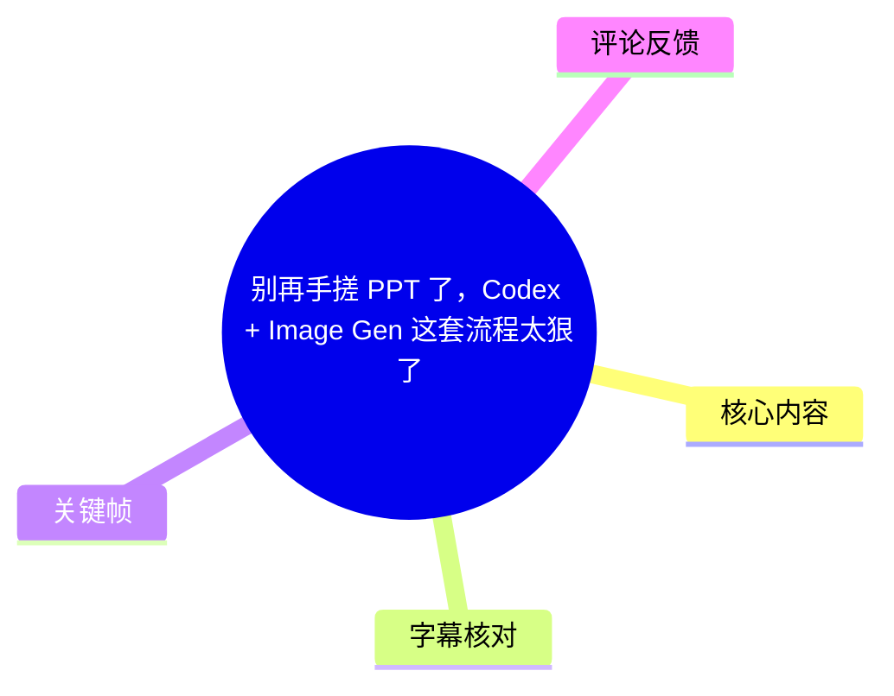
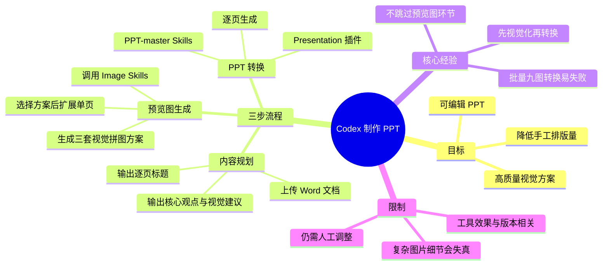
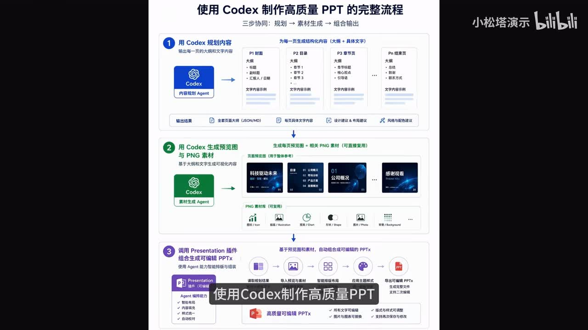
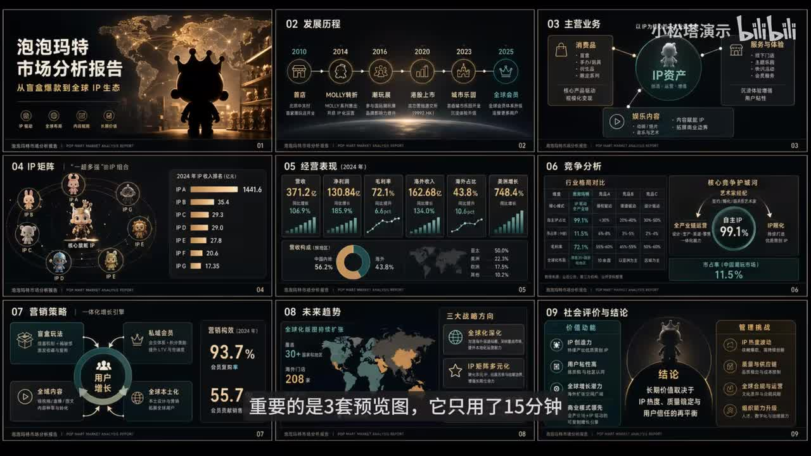
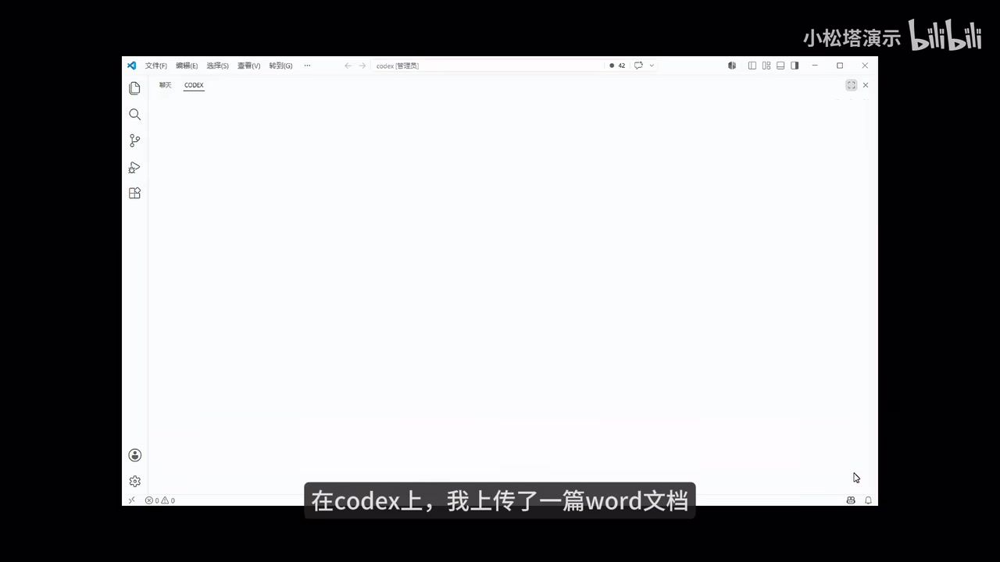
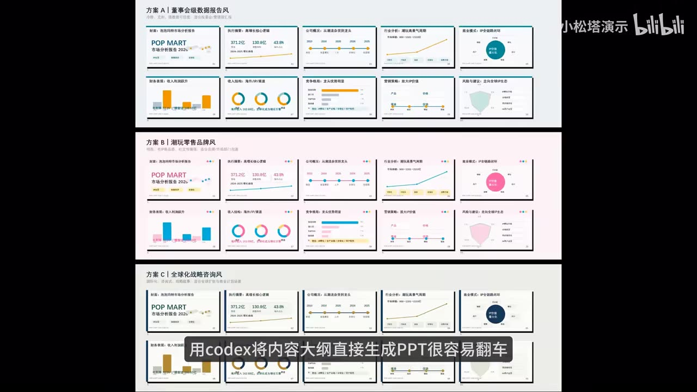

# 别再手搓 PPT 了，Codex + Image Gen 这套流程太狠了

> 来源：[Bilibili 视频](https://www.bilibili.com/video/BV17WEk6aEA1)  
> UP 主：小松塔演示｜时长：3 分 52 秒｜合集：AIcode  
> 标签：AI PPT、Codex、Image、PPT、Agent、教程

## 小结

视频展示了一套以 **Codex + Image Skills + PPT 转换 Skills/Presentation 插件** 为核心的 AI 制作 PPT 流程：先把原始 Word 文档转为逐页内容大纲，再生成带版式设计的预览图，最后将预览图逐页转换成可编辑 PPT。

作者最强调的经验是：**不要把内容大纲直接一次性生成完整 PPT**。其原因不是内容不能生成，而是直接生成容易“翻车”；先经过“预览图/视觉方案”这一中间层，可以让文本信息先被组织为可审阅的视觉设计，再进入可编辑 PPT 的制作阶段。

流程中有两个明确的调用方式：生成预览图时，在对话框输入 `/` 并选择 `image`；调用 Codex 内置 `Presentation` 插件时，通过 `@` 呼出。作者还对工具作出场景化区分：`Presentation` 更适合结构简单的内容，较轻便高效；面对图像内容更复杂的情况，视频仍认为 `PPT-master Skills` 有竞争力，但转换细节仍可能需要人工调整。

视频中的实测限制同样重要：作者尝试把 **9 张预览图一次性转成一套完整 PPT**，结果失败；经过多轮测试后，推荐改为**上传图片后逐页调用 Skills 或插件生成**。这意味着流程稳定性与批处理效率之间存在取舍，也与热评中关于 Token 消耗高的问题相互印证，但评论中的具体额度与工具版本并未被视频验证。

本视频适合已经能使用 Codex、希望把文档转换为演示文稿的人。它提供的是工作流和操作入口，而非完整逐字提示词；作者称已整理提示词，并表示可通过私信获取。工具界面、Skills 名称、调用权限和生成效果都可能随产品版本变化，应以使用时实际界面为准。

## 思维导图

## 目录

- [流程概览与为何不能直接生成 PPT](#流程概览与为何不能直接生成-ppt)
- [第一步：用 Codex 规划逐页内容](#第一步用-codex-规划逐页内容)
- [第二步：生成并筛选 PPT 预览图](#第二步生成并筛选-ppt-预览图)
- [第三步：将图片转换为可编辑 PPT](#第三步将图片转换为可编辑-ppt)
- [实操清单、参数与限制](#实操清单参数与限制)
- [结论与时效性](#结论与时效性)
- [字幕比对](#字幕比对)
- [评论分析](#评论分析)
- [处理记录](#处理记录)

## [流程概览与为何不能直接生成 PPT](https://www.bilibili.com/video/BV17WEk6aEA1?t=24)

作者将高质量 PPT 制作归纳为三段式协作：

1. **用 Codex 规划内容大纲**；
2. **调用 Image 生成预览图**；
3. **调用 Skills 生成可编辑 PPT**。

其中第二步不是可有可无的装饰环节。作者明确表示，若将内容大纲直接交给 Codex 生成 PPT，结果“很容易翻车”。视频提出的替代路径是：先利用文中称为 `Image2` 的图像生成能力理解文字信息，并将其转化为可用的视觉设计；再基于该视觉方案制作可编辑文件。

> 图：关键帧以流程图形式呈现“规划 → 素材/预览图生成 → 组合输出”的三段流程，有助于理解预览图作为文本大纲与最终 PPT 之间的中间产物，而不是单纯封面图。

### [为什么要保留“预览图”层](https://www.bilibili.com/video/BV17WEk6aEA1?t=36)

从视频表述看，预览图的作用包括：

- 将文字层面的内容大纲转化为可检查的视觉布局；
- 让信息层级、数据重点、图标和装饰元素先在图片阶段呈现；
- 允许用户先选择视觉风格，再把拼图中的页面扩展为单独幻灯片；
- 降低直接从内容大纲跳转至复杂可编辑 PPT 时的失控风险。

作者把 Image 的价值描述为“具有 PPT 设计思维的助手”。这属于作者对工具效果的主观判断，不等同于不同主题、不同模型版本下都能稳定获得专业设计质量。

> 图：关键帧展示了一个九页市场分析主题的深色预览拼图。它直观说明视频所称“预览图”并非单页插画，而是一组包含封面、时间线、数据卡片、竞争分析和结论页的整套页面设计草案。

## [第一步：用 Codex 规划逐页内容](https://www.bilibili.com/video/BV17WEk6aEA1?t=57)

### 输入：Word 文档加提示词

作者在 Codex 中上传一篇 **Word 文档**，并附加一段提示词。视频未完整展示该提示词原文，但明确说明希望 Codex 为每一页 PPT 输出以下内容：

- 页面标题；
- 核心观点；
- 正文/专门要点；
- 视觉建议。

> 图：关键帧显示 Codex 所在工作界面，是“上传 Word 文档作为内容输入”这一操作前提的画面依据；画面未展示完整提示词文本，因此本文不补写未出现的原文提示词。

### [输出：逐页结构化内容与视觉建议](https://www.bilibili.com/video/BV17WEk6aEA1?t=73)

等待生成后，Codex 会清晰列出每一页的标题、视觉建议等内容。作者以第二页为例说明：

- 原始整段文字被拆解为**时间线**；
- 页面逻辑更清楚；
- 视觉建议会标注每个时间节点；
- 节点可配合门店、IP 等小图标。

这一步的本质是把“文档章节”进一步拆解成“演示页面单元”。视频没有给出固定页数、固定字体、页尺寸、配色参数或任何可复用的完整提示词模板，因此不能将这些未展示内容视作作者的硬性配置。

### 内容规划阶段的可复用检查项

根据视频实际展示的输出字段，执行时可以逐页检查：

| 检查项 | 视频中的对应要求 | 价值 |
| --- | --- | --- |
| 页面标题 | 每页给出标题 | 确定单页表达主题 |
| 核心观点 | 每页给出核心观点 | 避免一页承载多个主结论 |
| 正文要点 | 给出专门/正文要点 | 为后续信息分层提供材料 |
| 视觉建议 | 给出视觉建议 | 为图表、时间线、IP 图标等元素预留设计方向 |
| 叙事逻辑 | 示例为时间线拆解 | 让页面结构适配内容关系 |

## [第二步：生成并筛选 PPT 预览图](https://www.bilibili.com/video/BV17WEk6aEA1?t=92)

### [提示词中要求考虑的五类条件](https://www.bilibili.com/video/BV17WEk6aEA1?t=96)

作者继续输入提示词，让 Codex 根据 PPT 大纲和每页内容生成 **3 版不同视觉风格的 PPT 拼图方案**。视频明确列出的生成依据为：

1. PPT 的主题；
2. 行业属性；
3. 内容密度；
4. 受众场景；
5. 叙事风格。

这里的“拼图方案”可以理解为将多页页面缩略图排布在一张或一组预览图中，先用于判断整套演示的风格一致性与页面节奏。作者随后从方案中选择一套，再逐页扩展。

### [调用 Image Skills 的方式](https://www.bilibili.com/video/BV17WEk6aEA1?t=110)

视频给出的具体操作是：

1. 在对话框中输入斜杠 `/`；
2. 系统自动弹出 Skills 列表；
3. 选择 `image`；
4. 让 Codex 生成视觉预览方案。

> 注意：视频站内中文字幕将个别词写为“c skills”“cortex”，但从画面、ASR 上下文和全片工具名称可校正为 **Skills** 与 **Codex**。该调用方式对应视频录制时的界面；实际入口可能随版本变化。

### [三套风格与作者选择](https://www.bilibili.com/video/BV17WEk6aEA1?t=121)

作者称 Codex 生成了三组视觉风格：

- 数据报告风；
- 潮玩风；
- 安峰战略咨询风。

作者选择了**第二种风格，即潮玩风**，并继续调用 Image Skills，把拼图中的每一页依次扩展成独立 PPT 页面。

> 图：关键帧同时呈现三套方案，直接支撑“先生成三种风格再选择”的步骤。它还能用于比较同一主题在配色、图表、装饰元素和版式上的不同处理，避免在尚未确定视觉方向时直接转换成 PPT。

### [作者评价的视觉产物特征](https://www.bilibili.com/video/BV17WEk6aEA1?t=137)

打开预览图后，作者认为其视觉处理有以下特点：

- 调用了较多 IP 视觉元素；
- 对信息进行了可视化处理；
- 将重要数据单独列出；
- 达到结构化表达和可视化呈现的效果。

这些特征说明预览图不仅承担“好看”的作用，也承担信息筛选、强调与组织的功能。需要注意的是，视频展示的案例主题与潮玩/IP 市场分析相关，因此 IP 元素可能特别适合该样例；其他行业不必机械复用此类视觉符号。

## [第三步：将图片转换为可编辑 PPT](https://www.bilibili.com/video/BV17WEk6aEA1?t=155)

### [两种转换工具及适用差异](https://www.bilibili.com/video/BV17WEk6aEA1?t=158)

作者提到两种将图片转为 PPT 的路径：

| 工具/能力 | 视频中的定位 | 调用方式或特点 |
| --- | --- | --- |
| `PPT-master Skills` | 作者在上期视频推荐过；面对本次较复杂图片，整体表现仍“抗打” | 用于图片转 PPT |
| Codex 内置 `Presentation` 插件 | 相比 PPT-master，处理结构简单的内容时更轻便、效率更高 | 输入 `@` 可呼出 |

视频没有给出两者的版本号、定价、Token 消耗规则、支持的文件格式、导出标准或可编辑元素保真率测试，因此上述比较应仅理解为作者在视频录制情境中的经验结论。

### [失败案例：九张预览图一次性转换](https://www.bilibili.com/video/BV17WEk6aEA1?t=180)

作者尝试将 **9 张预览图** 一次性生成一套完整 PPT，最终结果“翻车”。视频没有展开失败文件的具体问题类型，例如是否涉及文字识别、布局错位、图片遗漏、页面顺序、图表重建或编辑性缺失，因此不能进一步归因。

经过几轮测试，作者给出的更稳妥方案是：

1. 上传图片；
2. 调用 Skills 或插件；
3. **一张一张地生成 PPT**；
4. 对剩余细节手动调整。

这一结论是本视频最具操作性的限制条件：当输入页面多、图像内容复杂时，应优先追求逐页可控，而非一次性批量完成。

### [结果评价与人工收尾](https://www.bilibili.com/video/BV17WEk6aEA1?t=201)

作者对最终效果的评价是：

- `PPT-master Skills` 整体仍然表现不错；
- 本次图像内容较复杂；
- 部分细节转换还不完美；
- 剩余部分需要“手搓调节”。

视频最终强调：无论是人工制作还是让 AI 代劳，能把工作完成好的人仍需要具备判断和思考能力。换言之，AI 生成流程减少的是重复排版与初稿制作成本，而不能替代内容理解、信息取舍和审美决策。

## [实操清单、参数与限制](https://www.bilibili.com/video/BV17WEk6aEA1?t=57)

### 推荐执行顺序

1. **准备源内容**：整理为 Word 文档。
2. **上传至 Codex**：附加内容规划提示词。
3. **获得逐页结构**：检查标题、核心观点、正文要点、视觉建议是否完整。
4. **调用 Image Skills**：在对话框输入 `/`，选择 `image`。
5. **生成 3 套预览方案**：要求模型依据主题、行业属性、内容密度、受众场景、叙事风格生成。
6. **选择视觉方向**：在多套预览中选定风格。
7. **扩展成单页预览图**：继续调用 Image Skills，将拼图中的页面逐页展开。
8. **选择转换工具**：
   - 内容结构较简单时，可尝试 `Presentation`；
   - 需要图片转 PPT 时，可使用 `PPT-master Skills`。
9. **逐页转换**：上传单张页面预览图，逐张生成可编辑 PPT。
10. **人工验收与调整**：重点检查复杂图片中的文字、数据、局部布局与视觉细节。

### 视频明确出现的参数与数量

| 项目 | 视频信息 |
| --- | --- |
| 视频时长 | 3 分 52 秒 |
| 预览图风格方案数 | 3 套 |
| 作者称生成三套预览图耗时 | 15 分钟 |
| 作者尝试批量转换的预览图数量 | 9 张 |
| 更稳妥的转换粒度 | 一张图片对应一页 PPT |
| Image Skills 调用入口 | `/` 后选择 `image` |
| Presentation 插件调用入口 | `@` |
| 复杂内容的后处理 | 需要人工调整 |

### 不应忽略的限制

- **15 分钟是作者案例的陈述，不是通用性能承诺**。输入文档长度、图像生成排队、工具权限、模型版本和提示词质量都会影响时长。
- **逐页转换更稳，但可能增加调用次数和资源消耗**。视频未提供具体 Token 统计。
- **复杂图像并非完全可逆地转成原生 PPT 元素**。作者已明确指出细节转换不完美。
- **预览图中的信息正确性仍需人工校验**。生成图表、数字、时间线或行业数据时，视觉完整不等于事实准确。
- **工具名称与交互入口具有时效性**。`Image Skills`、`PPT-master Skills`、`Presentation` 的可用性和行为应以实际产品界面为准。
- **版权与素材风险未在视频展开**。若使用 IP 形象、品牌标识或外部图片，应自行确认使用权；视频只说明使用了较多 IP 视觉元素，并未提供授权说明。

## [结论与时效性](https://www.bilibili.com/video/BV17WEk6aEA1?t=204)

这套方法的核心不是“让 AI 一键生成 PPT”，而是把任务拆成三个可控阶段：

> **内容结构化 → 视觉方案化 → 可编辑文件化**

其中，预览图是关键的质量闸门：它让用户在进入 PPT 转换前确认内容结构、风格和重点数据的表达方式。对于复杂主题，先审图、再逐页转换，通常比直接从大纲生成整套 PPT 更符合视频中的实测经验。

但这并不意味着人工工作消失。用户仍需要：

- 判断每页是否只表达一个重点；
- 审核 AI 生成的文字、数据与图表；
- 选择合适的视觉风格；
- 修复复杂页面的转换失真；
- 对最终演示稿承担内容与设计质量责任。

本视频发布时间对应元数据中的 2026 年 6 月。AI 产品的界面、模型能力、插件入口、计费/限额与导出质量变化较快，本文记录的是视频所展示流程，而非对当前任意版本 Codex 的功能保证。

## 字幕比对

| 字幕来源 | 完整性 | 专有名词 | 时间轴 | 主要问题 |
| --- | --- | --- | --- | --- |
| Bilibili 站内中文字幕 `p01-ai-zh.srt` | 覆盖 00:00:00.140—00:03:51.980，完整 | 主体正确，可识别 Codex、Image、Skills、PPT-master、Presentation | 分段细，适合作为章节时间轴依据 | 存在“cortex”“c skills”“安峰战略咨询风”等识别/转写不稳定处；“数据报告风、潮玩风、战略咨询风”在个别分段中断开 |
| 本次 ASR（medium） | 诊断覆盖率 85.12%，有音频识别结果 | Codex、Image Skills、PPT Master、Presentation 多数可辨 | 首段从 00:00:33.120 才开始，明显遗漏视频前 33 秒；每段约 24 秒且文本粘连 | 多处错字与同音误识，如“设计白板”“实际式”“PPP”“数捷”“图屏转PPT”；不适合作为精确章节定位主来源 |

### 最终字幕选择

本文以 **Bilibili 站内中文字幕 `p01-ai-zh.srt`** 作为主字幕和时间轴依据，原因是其覆盖完整、分段更细，且与视频提供的关键帧内容相符；本次 ASR 已按要求检查，但其首段时间戳晚于站内字幕约 33 秒，且文本粘连、错字较多，因此仅用于交叉确认语音语言与工具名称。

ASR 诊断中**未标记 `noAudioStream=true`**，并检测到中文语音，语言概率为 `0.99169921875`；因此该视频并非无音轨素材。ASR 的时间覆盖异常应理解为识别结果的分段/对齐问题，而不是源视频没有音频。

经站内字幕、ASR 与关键帧上下文校正的关键术语包括：

- 站内字幕中的 `cortex`：应为 **Codex**；
- 站内字幕中的 `c skills`：应为 **Skills**；
- `image`：指通过 Skills 菜单选择的 **Image Skills**；
- `PPT master skills`：统一记为 **PPT-master Skills**；
- `presentation`：记为 Codex 内置 **Presentation** 插件；
- 风格名称：视频明确为数据报告风、潮玩风、战略咨询风；“安峰战略咨询风”保留为站内字幕中的具体表述，但其准确拼写无法仅凭现有素材独立验证。

## 评论分析

以下仅分析可获取的热评前三条。评论反映的是用户体验或个人判断，不应视为已验证事实。

1. **sunny七月残雪｜7 赞**  
   评论称：逐页转 PPT 的 Token 消耗很大，生成四五页后接近五小时用量上限；其每上传一张图片都会重复粘贴完整提示词，并询问是否有“整套生成且不翻车”的办法。  
   - **补充价值**：指出视频推荐的逐页稳定方案可能带来较高资源成本，与作者“九图一次性转换翻车”的经验形成现实取舍。  
   - **可信度边界**：评论没有提供工具版本、具体套餐、提示词长度、图片分辨率或调用日志，无法判断 Token 高消耗是否由重复粘贴提示词、产品额度还是其他设置导致。视频本身也未给出解决 Token 成本的方案。

2. **鸡哥玩AI｜5 赞**  
   评论称：未使用 Codex，而是使用 “GPT 5.4 + PPT master skill” 图片转 PPT，感觉效果较差，许多地方失真。  
   - **补充价值**：从另一种工具组合侧面反映，图片转 PPT 的失真问题并非作者案例独有，尤其在复杂内容中可能存在。  
   - **可信度边界**：该评论所用模型、图片内容、Skill 版本均与视频未必一致，不能据此比较 Codex 与其他模型的优劣，也不能量化“失真”程度。

3. **嗯嗯的知识｜5 赞**  
   评论称：感谢分享，并认为“用下来还是它最全面、最真实”。  
   - **补充价值**：体现该观众对视频流程或相关工具的正面主观评价。  
   - **可信度边界**：未说明“它”具体指代哪一工具、使用场景、测试条件或比较对象，信息不足以形成可验证的产品结论。

## 处理记录

- **Worker ID**：worker-mrj0wjed-b0c290ad
- **模型**：gpt-5.6-terra
- **调用工具与素材**：视频元数据、Bilibili 站内时间轴字幕、ASR 结果与诊断、关键帧、热评数据。
- **字幕选择**：采用 `p01-ai-zh.srt` 为主字幕与时间轴来源；已检查本次 ASR。ASR 检测为中文音轨，未出现 `noAudioStream=true`，但首段从 33.12 秒开始且错字、粘连较多，故不作为主时间轴。
- **关键帧选择依据**：
  - `frames/frame-001.jpg`：展示九页预览拼图，支撑“预览图作为整套视觉方案”的说明；
  - `frames/frame-002.jpg`：展示三步流程图，支撑工作流总览；
  - `frames/frame-003.jpg`：展示三种视觉方案，支撑风格生成与选择步骤；
  - `frames/frame-004.jpg`：展示 Codex 界面，支撑上传 Word 文档的操作前提。
- **评论处理范围**：仅使用可获取热评前三条，未扩展至其他评论或回复。
- **缓存清理**：未提供可执行的缓存清理日志或结果；本文不虚构清理操作。
- **未解决问题**：
  - 视频未公开完整提示词，无法复原原始模板；
  - “安峰战略咨询风”的名称拼写无法仅凭现有字幕与关键帧独立核验；
  - 未提供转换失败样例与 Token/额度日志，无法量化批量转换失败率或资源消耗。
