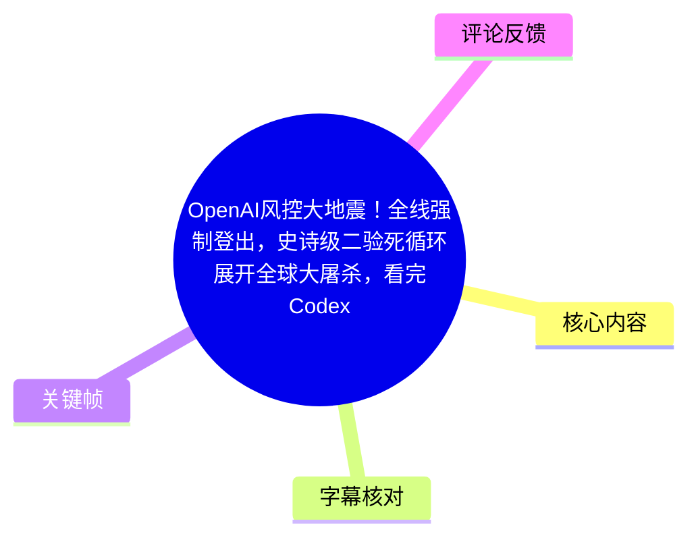
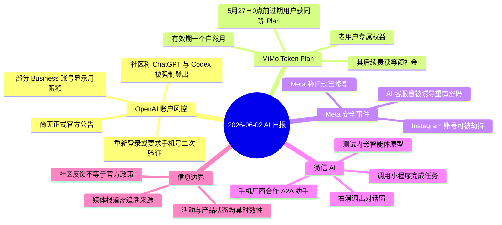
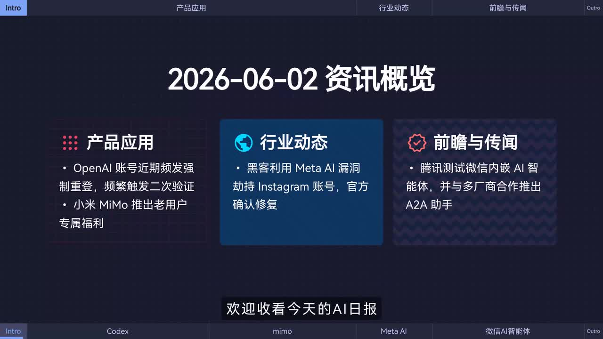
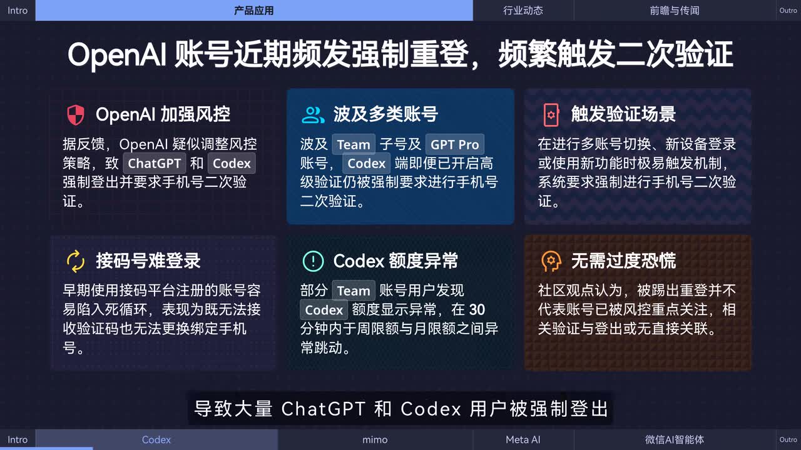
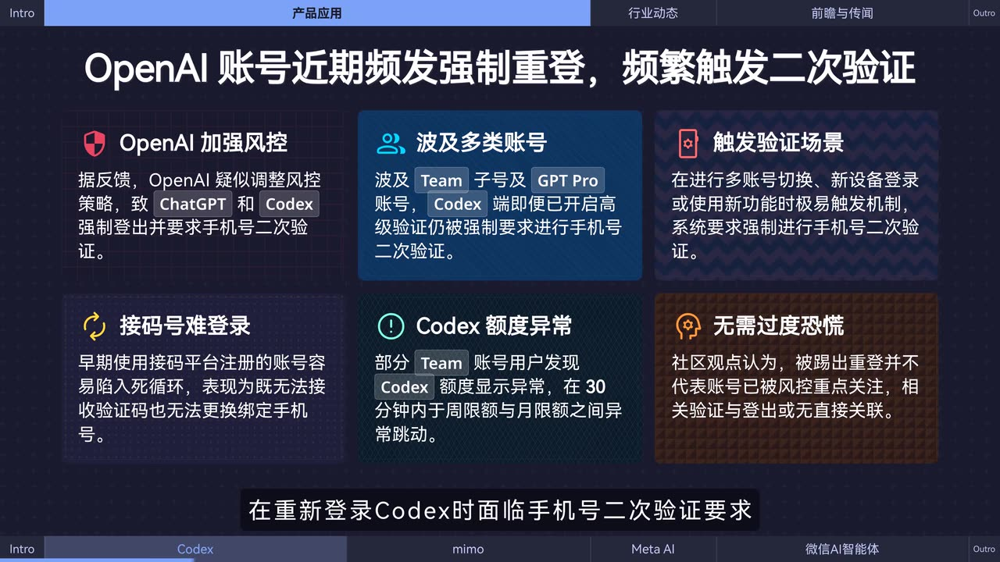
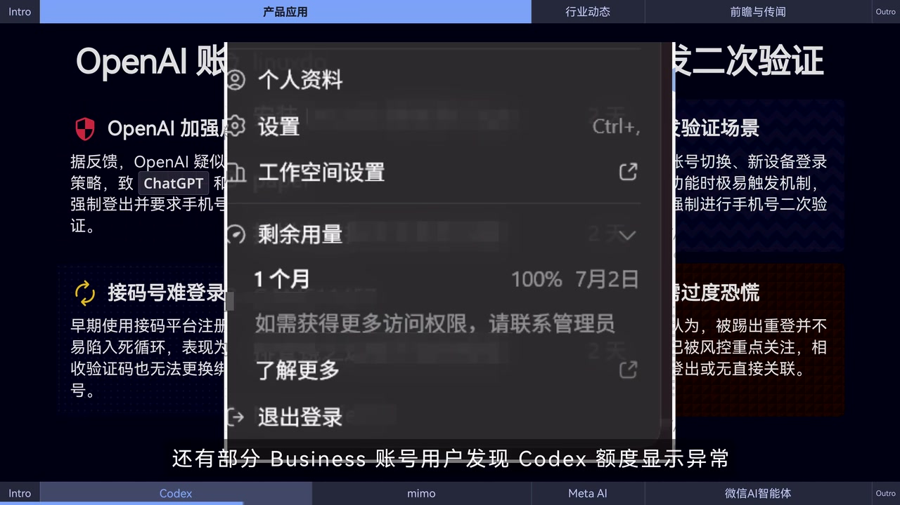

# OpenAI风控大地震！全线强制登出，史诗级二验死循环展开全球大屠杀，看完Codex额度乱跳直接吓出癫痫，奥特曼必须立刻移交军事法庭……

> 来源：[Bilibili 视频](https://www.bilibili.com/video/BV1MqVr6KEyZ)  
> UP 主：黑鸦Heya｜视频时长：82 秒｜栏目：AIcode  
> 视频为 2026-06-02 的 AI 日报式资讯汇总。标题含有明显夸张与讽刺性表达，正文仅按视频实际陈述整理，不将标题措辞视为事实结论。

## 小结

视频在 82 秒内播报四项 AI 及平台安全相关资讯：OpenAI 账户疑似强化风控、MiMo 面向老用户的 Token Plan 权益、Meta AI 客服被用于劫持 Instagram 账号后已修复的漏洞，以及腾讯测试微信内嵌 AI 智能体与 A2A 助手的消息。

最受关注的信息是 OpenAI 相关的社区反馈：部分 ChatGPT、Codex 用户被强制登出，重新登录 Codex 时可能被要求进行手机号二次验证；部分 Business 账号还观察到 Codex 额度显示为月限额。视频和站内字幕均明确强调：这些均来自社区讨论，**尚未有正式官方公告**，因此不能据此推断适用范围、触发规则或长期政策。

画面补充了比口播更具体的风险场景，包括多账号切换、新设备登录、使用新功能可能更易触发验证；同时还出现“早期使用接码平台注册的账号可能因收不到验证码、无法更换绑定手机号而陷入循环”的说法。这些是视频画面归纳的社区经验，不是 OpenAI 的官方规则。

MiMo 的内容是带日期门槛的老用户福利：站内字幕称，5 月 27 日 0 点前过期的付费用户可获赠相同 Token Plan；此后续费则获得等额礼金抵扣 API 消耗，权益有效期均为一个自然月。由于视频日期和活动日期均具有强时效性，当前是否仍可参与需以 MiMo 实际页面为准。

对开发者、AI 产品用户和关注账号安全的读者而言，视频的可迁移经验是：对账户验证、额度和第三方账号访问问题，应区分“社区现象”“媒体报道”和“官方确认”；在账号受限时优先核验官方通知、绑定手机号与工作区管理员信息，而不要仅凭截图或热评判断账号状态。

## 思维导图

## 目录

- [资讯背景与可信度边界](#资讯背景与可信度边界-0000)
- [OpenAI：强制登出、二次验证与 Codex 额度异常](#openai强制登出二次验证与-codex-额度异常-0004)
- [MiMo：Token Plan 老用户权益](#mimo-token-plan-老用户权益-0028)
- [Meta：AI 客服漏洞与 Instagram 账号安全](#metaai-客服漏洞与-instagram-账号安全-0048)
- [腾讯微信：内嵌 AI 智能体与 A2A 助手](#腾讯微信内嵌-ai-智能体与-a2a-助手-0100)
- [可执行的核验与应对步骤](#可执行的核验与应对步骤-0004)
- [结论、限制与时效性](#结论限制与时效性-0120)
- [字幕比对](#字幕比对)
- [评论分析](#评论分析)
- [处理记录](#处理记录)

## [资讯背景与可信度边界](https://www.bilibili.com/video/BV1MqVr6KEyZ?t=0) [00:00]

视频开场将内容定位为“AI 日报”，画面标题为“2026-06-02 资讯概览”，并将资讯分为“产品应用”“行业动态”“前瞻与传闻”三组。该结构也提示了不同消息的证据等级：

- **OpenAI 账户事件**：口播明确来源为“多名用户和社区反馈”，且明确称没有正式官方公告。
- **MiMo 权益**：以具体的活动日期、对象、到账方式和有效期描述，但视频未展示活动原始公告链接。
- **Meta 事件**：口播归因为“据媒体报道”，并称 Meta 已确认漏洞修复。
- **腾讯微信 AI**：部分内容归因为《金融时报》报道，另有“微信官方称”的合作信息。

> 图：画面以“2026-06-02 资讯概览”列出四项播报主题：OpenAI 账户重登与二次验证、MiMo 老用户福利、Meta AI 漏洞、微信 AI 智能体。这张关键帧适合建立视频的信息范围，并显示视频本身将腾讯部分归入“前瞻与传闻”。

## [OpenAI：强制登出、二次验证与 Codex 额度异常](https://www.bilibili.com/video/BV1MqVr6KEyZ?t=4) [00:04]

### 视频陈述的社区现象

站内字幕在 00:04–00:28 的信息为：

1. 多名用户和社区反馈称，OpenAI 近期疑似大幅加强风控策略。
2. 大量 ChatGPT 和 Codex 用户被强制登出。
3. 一些用户重新登录 Codex 时，面临手机号二次验证要求。
4. 一些 Business 账号用户发现 Codex 额度显示异常，出现“月限额”。
5. 上述信息来自社区讨论，尚无正式官方公告。

因此，本视频不能证明“全线”账户都被登出，也未给出受影响账户总量、地区、套餐分布、验证失败率或官方实施时间。标题中的“全球大屠杀”“必须移交军事法庭”等内容并非视频内提供的可验证事实。

> 图：画面将风险点拆分为“OpenAI 加强风控”“涉及多类账号”“触发验证场景”“接码号难登录”“Codex 额度异常”“无需过度恐慌”。它补充了站内字幕没有逐项念出的情境，但画面内文字仍属于视频转述的社区经验，不能升级为官方政策。

### 画面补充：可能涉及的账户与触发情境

关键帧中的文字给出了视频对社区反馈的进一步归纳：

| 项目 | 画面所述 | 证据边界 |
| --- | --- | --- |
| 涉及账户 | Team 子号、GPT Pro 账号、Codex 端 | 画面陈述，未展示官方规则或统计 |
| 可能触发情境 | 多账号切换、新设备登录、使用新功能时可能更易触发机制 | 视频经验性归纳，不代表充分或必要条件 |
| 接码平台注册账号 | 早期以接码平台注册的账号可能无法接收验证码，也无法更换绑定手机号，从而形成登录循环 | 适用范围未证实；不应据此推断全部此类账户状态 |
| 额度显示 | 部分 Team/Business 账号用户称 Codex 额度在短时间限额与月限额间跳动 | 仅为用户观察；未说明后台实际可用量是否同步变化 |
| 对账号状态的解释 | 画面称被踢出重登不代表已被风控重点关注，验证与登出没有直接关联 | 属于社区观点，不是平台确认的因果结论 |

> 图：画面在“OpenAI 账号近期频发强制重登，频繁触发二次验证”的标题下，突出“重新登录 Codex 时面临手机号二次验证要求”。该帧有助于区分视频真正描述的操作节点——重新登录——与标题中泛化的“全线风控”。

### 额度异常的具体画面证据

视频插入一张已做模糊处理的菜单截图，可见“剩余用量”及“1 个月、100%、7月2日”等字样。该画面与口播的“部分 Business 账号用户发现 Codex 额度显示异常、出现月限额”相对应。

> 图：画面展示一个被模糊处理的账户菜单，其中“剩余用量”显示为“1个月”和到期日期。这是视频用于说明额度显示变化的个案截图；账号身份、套餐规则、截图前后的额度状态均无法从素材独立核验。

## [MiMo：Token Plan 老用户权益](https://www.bilibili.com/video/BV1MqVr6KEyZ?t=28) [00:28]

视频称“小米 MiMo”发布了 Token Plan 老用户专属福利。站内字幕提供的规则如下：

| 时间条件 | 对象与权益 | 操作方式 |
| --- | --- | --- |
| 5 月 27 日 0 点前 | 已过期的付费用户 | 免费获赠相同的 Token Plan |
| 5 月 27 日 0 点后 | 续费用户 | 获得等额礼金，可抵扣 API 消耗费用 |
| 全部上述权益 | — | 有效期均为一个自然月 |

视频明确称第一种情形“无需操作，直接到账”。

### 日期与名称的字幕校正

- 站内字幕写作“小米 **MIO**”，但视频概览画面写作“**MiMo**”，本整理采用画面拼写 **MiMo**。
- 站内字幕将两个时间门槛均写为“5 月 27 日”；本次 ASR 第二处识别为“5 月 28 日”。由于站内字幕分段更细、与前后规则衔接更完整，本文以站内字幕的“5 月 27 日”为主，但保留该处冲突，不能据此替用户确认活动资格。
- 视频没有说明 Token Plan 的具体 token 数量、套餐价格、覆盖模型、礼金金额、参与地区或领取页面。

## [Meta：AI 客服漏洞与 Instagram 账号安全](https://www.bilibili.com/video/BV1MqVr6KEyZ?t=48) [00:48]

视频援引媒体报道：黑客曾利用 Meta 的 AI 客服聊天机器人劫持 Instagram 账号，方式是诱使助手重置密码；随后称 Meta 官方已确认该问题“现已修复”。

从视频可确认的因果链仅是：

1. 存在被描述为 AI 客服聊天机器人的服务；
2. 攻击者通过诱导助手执行密码重置，造成 Instagram 账号被劫持；
3. Meta 被视频描述为已确认修复。

视频未交代漏洞发现时间、受影响人数、攻击提示词或社会工程话术、修复版本、是否需要用户采取额外措施。因此，不应从该视频推导出可复现攻击方法，也不能将“已修复”理解为所有账号风险均已消除。

对普通用户而言，可从中获得的安全原则是：涉及密码重置、账户恢复、身份核验等高风险动作时，应确认操作入口为官方渠道，关注异常重置通知，并避免向不明对话入口披露验证码或账号恢复信息。

## [腾讯微信：内嵌 AI 智能体与 A2A 助手](https://www.bilibili.com/video/BV1MqVr6KEyZ?t=60) [01:00]

视频称，据《金融时报》报道，腾讯正在为微信测试“内嵌 AI 智能体原型”，交互与能力被描述为：

1. 用户可通过**右滑**调出对话窗口；
2. 可让智能体调用小程序完成任务；
3. 计划近期在完成合规后灰度上线。

随后视频又称，微信官方表示已与多家手机厂商合作推出 A2A 助手，部分荣耀手机已支持经由语音助理发起通话。

这里需要区分两层信息：

- “微信测试内嵌 AI 智能体原型”及其右滑交互、灰度计划，视频归因于媒体报道；
- “与手机厂商合作推出 A2A 助手”及“部分荣耀手机支持语音助理发起通话”，视频归因为微信官方说法。

视频并未定义 A2A 的完整技术协议、支持的手机型号清单、地区、微信版本、灰度资格、隐私授权范围或小程序调用权限。因此，不能仅凭视频确认自己的设备已经具备这些功能。

## [可执行的核验与应对步骤](https://www.bilibili.com/video/BV1MqVr6KEyZ?t=4) [00:04]

以下步骤是基于视频问题类型整理的谨慎应对流程，不是视频中提供的绕过验证方法，也不保证能解决账户问题。

### 1. 遇到 OpenAI 强制登出或二次验证

1. 使用 OpenAI 官方网页或官方应用重新登录，避免经由未知链接、接码服务或第三方代登录入口操作。
2. 核对当前账号绑定的邮箱和手机号是否仍可正常接收验证信息。
3. 若为 Team 或 Business 工作区成员，确认账号所属工作区及管理员；视频画面中的额度提示也出现“请联系管理员”语境。
4. 将登录时间、验证页面、账户类型、额度页面截图与异常提示保存下来，便于向官方支持或管理员描述问题。
5. 不要把“被登出”直接等同于账号被封禁或遭重点风控。视频画面也将两者描述为没有直接关联的社区观点，实际状态仍应以官方通知为准。

### 2. 核验 Codex 额度变化

1. 区分“界面显示的限额周期”与“实际可调用的额度/使用结果”；视频仅展示了前者可能异常。
2. 记录页面中的周期、百分比、到期时间及刷新前后差异。
3. 对 Business 或 Team 账号，先询问管理员是否存在组织级额度策略、账单变更或套餐调整。
4. 不要依据单张截图、热评或短期 UI 波动认定额度已被永久削减。

### 3. 核验 MiMo 活动资格

1. 以 MiMo 的官方活动页、账户后台或客服公告为准。
2. 重点确认付费状态变为“过期”的精确时间是否落在活动门槛之前。
3. 若属于“续费获等额礼金”路径，确认礼金金额、抵扣范围与一个自然月的有效期。
4. 注意本素材中“5 月 27 日/5 月 28 日”存在站内字幕与 ASR 的冲突，不能据此自行计算资格。

### 4. 使用 AI 客服与微信 AI 功能时的安全边界

1. 密码重置、验证码、恢复邮箱和设备确认等操作，只在可验证的官方入口完成。
2. 对 AI 代理调用小程序的功能，使用前审查授权范围、要提交的数据和最终执行结果。
3. 若视频所称微信 AI 功能未在自己的客户端出现，应视为尚未获得灰度资格或功能未上线，而非尝试非官方安装包。

## [结论、限制与时效性](https://www.bilibili.com/video/BV1MqVr6KEyZ?t=80) [01:20]

本视频的核心价值是快速提示账户验证、额度显示、AI 客服安全和智能体产品化这四类动向；其中 OpenAI 账号现象与 Codex 限额问题最贴近用户的即时使用风险。

但素材的信息限制也很明确：

- **OpenAI 部分**：来自社区反馈，且视频明确说明没有正式官方公告。不能把“疑似加强风控”写成已被官方确认的全局政策。
- **MiMo 部分**：活动时间与一个自然月有效期决定其高度时效性；站内字幕和 ASR 在第二个日期上不一致。
- **Meta 部分**：仅知视频称漏洞已修复，缺少漏洞编号、官方公告链接和影响范围。
- **腾讯部分**：原型测试、合规后灰度和部分机型支持都意味着功能可用性可能因时间、地区、版本及设备而异。
- **关键帧部分**：画面中的账号截图经过模糊处理，只能作为视频展示的案例，不能当作独立认证材料。

视频在 [01:20](https://www.bilibili.com/video/BV1MqVr6KEyZ?t=80) 结束播报。若要据此做账号、订阅或业务决策，应补充核验各平台的官方状态页、账户后台、公告和管理员通知。

## 字幕比对

| 字幕来源 | 完整性 | 专有名词 | 时间轴 | 主要问题 |
| --- | --- | --- | --- | --- |
| Bilibili 站内字幕 | 覆盖 00:00:00.520–00:01:21.460，分为 35 个短句，内容完整 | ChatGPT、Codex、Business、Meta、Instagram、腾讯、微信、A2A 基本正确；“MiMo”误作“MIO” | 逐句时间边界清晰，适合章节定位 | “CHHPT”“智能题”等个别识别/转写错误；MiMo 拼写不准确 |
| 本次 ASR 字幕 | 覆盖 00:00:00.300–00:01:21.270，诊断语音覆盖率 99.23%，无大间隔 | OpenAI、ChatGPT、Codex、Meta、Instagram 等大体可辨 | 仅 4 个超长分段，不利于逐条资讯定位 | “封控/风控”“Memo/MiMo”“用戈/用户”“恢度上限/灰度上线”等误识别；将第二个日期识别为“5月28日” |

### 最终字幕选择与校正原则

本文以**站内字幕**作为主要时间轴依据：其分句细、与新闻段落边界一致，章节链接均按其开始时间换算为秒数。与此同时，已完成对本次 ASR 的检查：ASR 使用 `medium` 模型、中文识别概率 `0.99853515625`、CUDA `float16`，有时间戳，且诊断未标记 `noAudioStream=true`；因此可确认源视频存在音轨，ASR 并非空音频结果。

通过站内字幕、ASR 与关键帧交叉校正的重点如下：

- “CHHPT”校正为 **ChatGPT**；
- “Code X / CodeX”统一为 **Codex**；
- “MIO / Memo”结合概览画面校正为 **MiMo**；
- “恢度上限”校正为 **灰度上线**；
- MiMo 续费日期存在“5 月 27 日”与“5 月 28 日”的转写冲突，本文保留不确定性，不作超出素材的判断；
- 关键帧补充了 Team 子号、GPT Pro、多账号切换、新设备登录、接码号困境及额度显示波动等画面文字，但这些内容仍按“视频展示的社区归纳”处理。

## 评论分析

以下仅分析可获取的热评前三条；评论反映的是用户态度或个人经历，不能作为平台政策或额度变化的证据。

1. **恭敬的僭越者**（892 赞）  
   评论称标题“不错”，并希望将“枪毙奥特曼、达里奥”等夸张措辞变成常驻项目。其重点是认可 UP 主的戏谑标题风格，没有补充 OpenAI 风控、验证或额度的可核验信息。

2. **fze_fze**（395 赞）  
   评论认为如果自己决定，会取消免费的 Codex 额度，并批评“批发免费号池”。这反映了部分用户对批量免费账号或账号滥用的反感，也能解释为何观众会把风控升级与账号池关联。但这只是主观政策建议，视频和评论均未证明免费号池与本次现象之间存在因果关系。

3. **风一样的变态**（309 赞）  
   评论称“Codex 过了 5 月 31 后额度流失跟拉稀一样快”。这是关于额度消耗速度的个人体验，可能与其使用量、账户套餐、产品策略或界面显示有关。评论未给出账户类型、调用记录、计费页面或可复现条件，不能据此推断所有 Codex 用户的额度变化。

## 处理记录

- **Worker ID**：`worker-mrj0wbly-5dc4e50c`
- **模型**：`gpt-5.6-terra`
- **已使用素材/工具产物**：视频元数据 `info.json`、站内字幕 `p01-ai-zh.srt`、本次 ASR 结果 `asr/asr-result.json` 与 `asr/transcript.srt`、关键帧目录 `frames/`、热评数据 `comments/comments.json`。
- **ASR 检查结果**：识别模型为 `medium`，设备为 CUDA、`float16`；语言为中文，覆盖率 99.23%，存在音轨，未出现 `noAudioStream=true` 标记。
- **字幕选择**：以站内字幕为主，原因是其 35 段短句具有更精确的新闻级时间轴；ASR 用于完整性核对和专有名词交叉校正。对两者冲突的 MiMo 日期不擅自裁定。
- **关键帧选择依据**：选用 `frame-001` 建立四项资讯总览；`frame-002` 与 `frame-003` 用于呈现 OpenAI 账号验证的画面补充；`frame-004` 用于说明视频展示的 Codex 剩余用量个案例图。未为缺乏对应画面信息的新闻强行配图。
- **缓存清理**：提供的素材中未包含缓存清理执行日志；为避免编造，无法确认是否已执行清理。
- **未解决问题**：OpenAI 风控是否存在官方公告、实际受影响范围与触发规则；MiMo 活动第二个日期的字幕冲突；Meta 漏洞的公开技术细节；微信 AI 功能的具体上线范围与支持设备，均需以各方最新官方信息核验。
