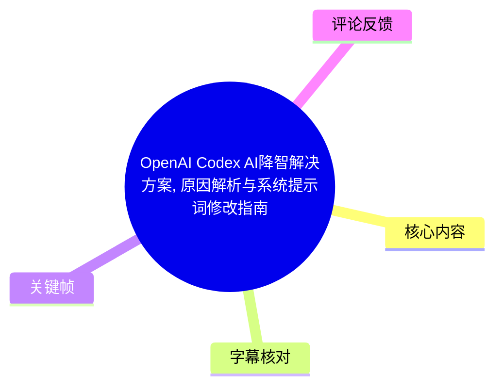
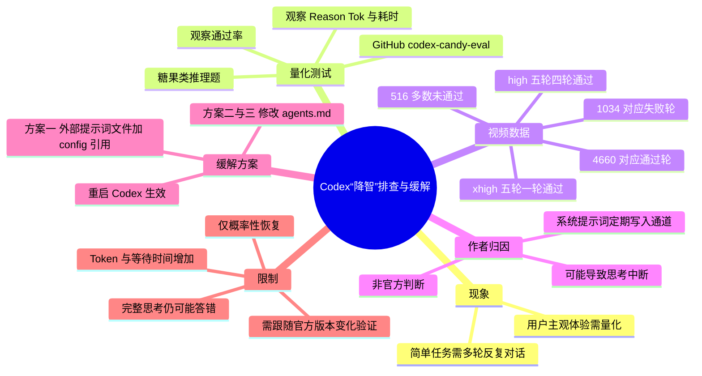
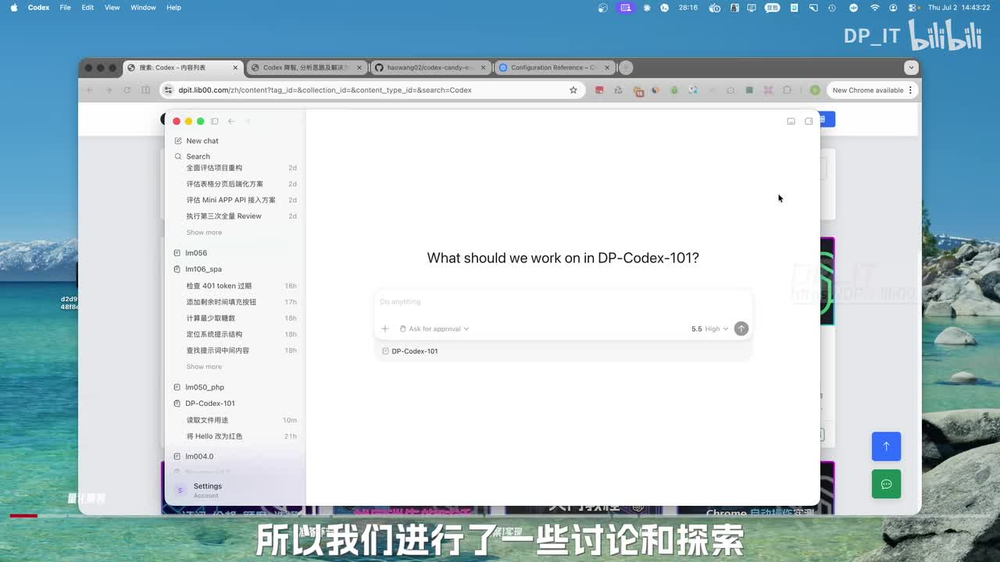
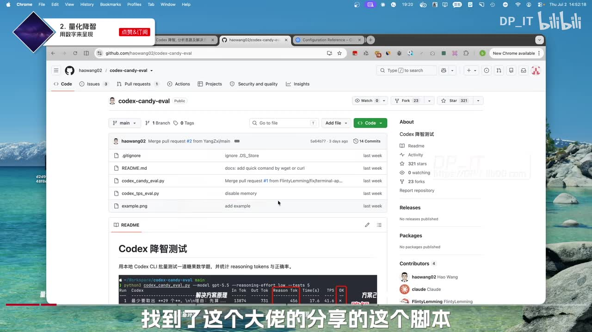
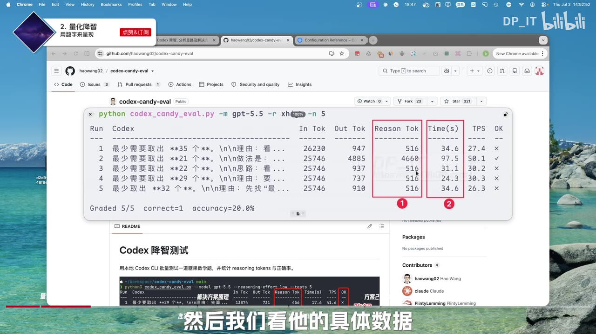
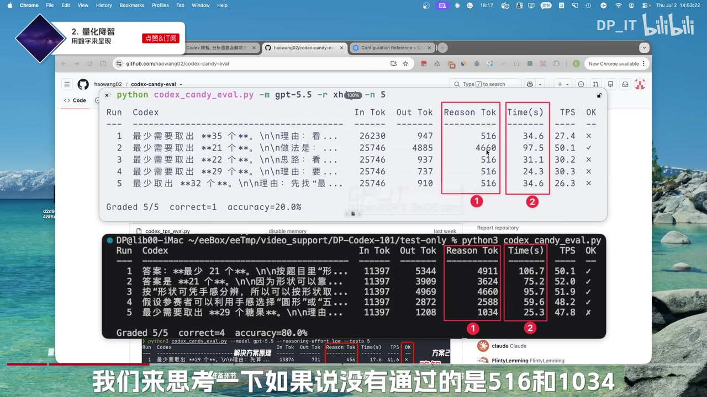

# OpenAI Codex AI降智解决方案, 原因解析与系统提示词修改指南

> 来源：[Bilibili 视频](https://www.bilibili.com/video/BV1zMTE6NEFM)  
> UP 主：DP_IT｜合集：AIcode｜时长：08:23  
> 发布时间：2026-07-03 08:30（按元数据 Unix 时间戳换算，时区未标注）  
> 标签：教程、提示词工程、AI 降智现象、OpenAI、Codex、AI 编程

## 小结

视频讨论了部分 Codex 用户近期感受到的“降智”现象：原本能较顺畅完成的编程或推理任务，变成需要多轮反复对话才能推进。UP 主没有把“降智”仅停留在主观体验层面，而是借助 GitHub 上的 `codex-candy-eval` 测试脚本，以糖果类推理题的通过率、推理 Token（Reason Tok）与耗时作为观察指标。

视频展示的第一组测试中，使用 `gpt-5.5`、推理强度 `xhigh` 进行 5 轮测试，仅 1 轮通过；通过的那轮 Reason Tok 为 `4660`，其余未通过的多为 `516`。UP 主自己的第二组测试将推理强度设为 `high`，同样运行 5 轮，其中 4 轮通过、1 轮失败；失败轮的 Reason Tok 为 `1034`。据此，视频提出一个**作者个人的、非官方结论**：较短的推理 Token 可能意味着思考过程被提前截断，而更长的推理过程更有机会完成任务。

作者将可能原因定位到 Codex 的系统提示词：其中据称存在要求 Codex 定期向某个“CO”通道写入内容的指令；视频称这一动作会中断思考。解决思路不是修改模型本身，而是在 Codex 官方允许配置的范围内，通过外部提示词文件或 `agents.md` 追加指令，覆盖或规避这类中断性要求。

视频推荐的方案一是：关闭 Codex、创建一个包含预设内容的提示词文件、在用户目录下 Codex 的 `config` 文件中增加指向该文件的配置、重启 Codex。方案二和方案三则通过修改 `agents.md` 追加提示词来规避中断。**素材未提供视频中创建文件的完整文本、配置键名、具体路径和三套方案的逐字内容，因此本文不会补写或猜测可直接复制的配置。**

该方案被作者定义为概率性缓解，而非永久恢复或官方修复：即使获得更完整的思考链，模型仍可能答错；同时，较完整的推理通常意味着更多推理 Token、更长等待时间，以及潜在的配额或成本压力。适合已经使用 Codex 且能自行备份和回滚配置的开发者参考；不应将视频的归因、性能结论或兼容性视为 OpenAI 官方结论。

## 思维导图





## 目录

- [背景、范围与时效性](#背景范围与时效性)
- [量化“降智”：测试脚本与数据](#量化降智测试脚本与数据)
- [可能原因：系统提示词与思考中断](#可能原因系统提示词与思考中断)
- [修改系统提示词的三类方案](#修改系统提示词的三类方案)
- [实践步骤、参数与回滚建议](#实践步骤参数与回滚建议)
- [结论、限制与可迁移经验](#结论限制与可迁移经验)
- [字幕比对](#字幕比对)
- [评论分析](#评论分析)
- [处理记录](#处理记录)

## 背景、范围与时效性 [00:00](https://www.bilibili.com/video/BV1zMTE6NEFM?t=0)

视频开头称，UP 主及频道部分观众近期遇到 Codex“降智”：过去较容易处理的问题，当前需要通过多轮任务与对话才能解决。这里的“降智”是用户体验性描述，不等同于模型能力、权重、服务策略或 API 能力已经被官方确认发生变化。

作者作出免责声明：视频以教学为目的，部分资源来自网络公开分享。其讨论对象是 Codex 的使用表现与客户端提示词配置，并非对 OpenAI 后端模型、API 服务或订阅策略作出可验证的官方诊断。



> 图：关键帧展示 Codex 应用的对话工作界面，是理解视频所指“Codex App/客户端”使用场景的基础。它有助于区分：视频主要讨论的是 Codex 工作流与配置层面的行为，而不是泛指所有 AI 产品。

### 信息时效性

- 视频元数据发布时间为 2026-07-03；素材抓取时间为 2026-07-13。
- 作者称相关系统提示词记录大约在“几个月以前”加入，但未在给定素材中提供精确版本号、提交记录链接或生效日期。
- Codex 的系统提示词、配置格式、`agents.md` 支持方式和官方政策均可能随客户端更新改变；视频方法必须以当时的官方文档和本机版本为准。
- 视频口述中出现“OpenAR”“APR”“CO”等 ASR 近音或识别不稳定词。结合上下文，本文仅在必要处保留其原始不确定性，不把它们扩展为未被素材确认的技术名词。

## 量化“降智”：测试脚本与数据 [00:42](https://www.bilibili.com/video/BV1zMTE6NEFM?t=42)

作者认为，“做得慢”“做得不好”若仅是主观感受，难以分析，因此采用测试脚本将现象数据化。视频展示 GitHub 仓库 `haowang02/codex-candy-eval`，并说明其核心方法是以糖果题这类需要较多思考的任务测试 Codex，记录：

1. 是否通过题目；
2. 思考／推理 Token（画面字段为 `Reason Tok`）；
3. 完成耗时（画面字段为 `Time(s)`）；
4. 画面还列出了输入 Token、输出 Token、TPS 等字段。



> 图：画面显示 GitHub 项目 `codex-candy-eval` 及其 README 区域，说明视频测试依托的是公开分享脚本，而非作者自行声称的官方评测体系。该来源性质决定测试结果更适合用作现象观察，不能直接等价为通用模型基准。

### 第一组：`gpt-5.5` + `xhigh`，5 轮

视频称第一组数据使用脚本、`gpt-5.5` 模型与 `xhigh` 推理强度运行 5 轮，结果为仅 1 轮通过。关键帧中可读取的结果如下：

| 轮次 | Reason Tok | Time(s) | 通过情况 |
| --- | ---: | ---: | --- |
| 1 | 516 | 34.6 | 未通过 |
| 2 | 4660 | 97.5 | 通过 |
| 3 | 516 | 31.1 | 未通过 |
| 4 | 516 | 24.3 | 未通过 |
| 5 | 516 | 34.6 | 未通过 |
| 汇总 | — | — | `correct=1`，`accuracy=20.0%` |



> 图：该帧直接呈现第一组的 5 轮输出，并用红框强调 `Reason Tok` 与 `Time(s)`。其价值在于可核对视频口述的核心观察：唯一通过的一轮为 4660 Reason Tok、97.5 秒，其余多为 516 Reason Tok 且失败。

作者据此指出，耗时与 Reason Tok 在这组样本中呈正向对应关系：Reason Tok 为 4660 的通过轮耗时也明显更长。但应注意，这只是一组 5 次样本中的共同出现，不能据此推出“Token 越多必然越正确”或严格的统计因果关系。

### 第二组：`gpt-5.5` + `high`，5 轮 [02:05](https://www.bilibili.com/video/BV1zMTE6NEFM?t=125)

第二组由作者本人测试，模型相同，推理强度由 `xhigh` 调整为 `high`，同样进行 5 轮。视频口述结论为“只有一轮没通过”；未通过一轮的 Reason Tok 是 `1034`。画面中可见汇总为 `correct=4`、`accuracy=80.0%`。



> 图：该帧将第一组与第二组终端输出并列：上方第一组仅 1/5 正确，下方第二组为 4/5 正确，并显示第二组失败轮的 1034 Reason Tok。它适合用于理解作者为何反复强调 516、1034 和约 4660 这几个数值。

### 视频给出的解释与其证据边界

作者要求观众记住 `516` 和 `1034`，并提出自己的理解：若 516、1034 Token 的轮次未通过，而约 4660 Token 的轮次通过，可能意味着前两者的思考过程不完整，长 Token 推理过程相对完整。

这一段必须区分为三层：

- **画面可见事实**：两组各 5 次测试的具体 Token、耗时和通过标记。
- **作者的工作假设**：较短的 Reason Tok 可能对应被截断或不完整的思考。
- **尚未证实的部分**：Reason Tok 长度本身不是正确率保证；题目抽样、温度／随机性、上下文、网络与服务负载、工具调用、客户端版本等都可能影响结果。视频也明确承认，完整思考后仍可能答错。

## 可能原因：系统提示词与思考中断 [03:14](https://www.bilibili.com/video/BV1zMTE6NEFM?t=194)

视频进入解决方案时提出，Codex 系统提示词中存在“两段”与问题相关的内容。这两段据称要求 Codex 每隔一段时间向某个“CO”通道写入内容；口述一处为“每 30 分钟”，结尾总结处又提到“30 秒向某一通道输出”。两处单位相互矛盾，且 ASR 对通道名识别不稳定，因此不能将具体间隔或通道名称当作已确认参数。

作者的判断链条是：

1. Codex 的系统提示词要求模型定期执行通道输出；
2. 该输出操作会中断正在进行的思考；
3. 思考中断可能造成 516、1034 这类较短的推理 Token；
4. 因而通过提示词覆盖，阻止或规避该动作，可提高模型完成完整思考链的概率。

视频还称，Codex 连接的“API”部分没有问题，作者将问题聚焦在 Codex 系统提示词层。但这仍是作者基于测试与观察作出的归因，不是 OpenAI 的故障公告、根因分析或修复承诺。

### 合法性主张 [04:13](https://www.bilibili.com/video/BV1zMTE6NEFM?t=253)

作者表示，自己检索了 OpenAI 官方 Codex 文档，认为官方允许通过接口修改相关内容，因此视频方案在官方允许范围内进行。素材未提供该文档的具体 URL、条款原文或对应配置字段。

实践上应将这项表述理解为：**在执行前自行查验当前版本官方文档**。特别需要确认以下问题：

- 当前客户端是否仍支持系统级或项目级指令文件；
- 配置文件的正式字段、路径写法和优先级；
- 该配置是否仅影响本地客户端，还是影响远程服务行为；
- 相关修改是否与组织策略、账号权限、订阅条款或安全机制冲突。

## 修改系统提示词的三类方案 [04:35](https://www.bilibili.com/video/BV1zMTE6NEFM?t=275)

视频称共有三种方案，并推荐方案一。三种方案的共同目的，是通过额外提示词减弱或规避作者所认为的“强制中断思考”行为，而不是改变 Codex 模型参数或 API 模型本身。

### 方案一：外部提示词文件 + `config` 引用（视频推荐）

视频口述的实际顺序如下：

1. 关闭 Codex 程序。
2. 新建一个文件。
3. 将视频页面／关联文章中提供的内容复制到文件中。
4. 找到用户根目录下 Codex 文件夹中的 `config` 文件并编辑。
5. 在配置中增加一条记录，使其指向新建文件的完整路径。
6. 可在命令行中将新建文件拖入终端，以获得完整路径并复制。
7. 保存后重启 Codex，使配置生效。

视频没有在给定文字素材中提供以下关键内容：

- 新建文件的文件名与扩展名；
- 需要粘贴的完整提示词；
- `config` 中应添加的精确键名、等号／引号格式；
- Windows、macOS、Linux 各自的用户目录和配置位置；
- 是否需要转义空格、使用绝对路径或相对路径。

因此，以下内容只能作为**结构示意**，不是可运行配置：

```text
Codex 配置文件
  └─ 某个“外部提示词／指令文件”相关字段
       └─ 指向新建文件的完整本机路径
```

不能根据视频截取信息自行杜撰配置行后直接写入生产环境。

### 方案二、方案三：修改 `agents.md`

作者说明，方案二和方案三直接修改 `agents.md`，方式相同：通过追加提示词规避 Codex 强制出现的思考中断。视频未在提供素材中给出两种方案之间的差异、适用场景、`agents.md` 的准确位置或追加文本。

可以从视频确认的只有：

- 操作载体是 `agents.md`；
- 操作方向是追加提示词；
- 目标是规避作者所指的中断；
- 它们与方案一一样服务于“尽可能完成完整思考链”的目标。

因此，若要采用这两种方法，应优先打开视频描述中给出的关联资源页面，或查验当前 Codex 官方文档，获取原始文本与版本匹配的路径说明。

### 三种方案的对比

| 维度 | 方案一：外部文件 + `config` | 方案二、三：`agents.md` 追加 |
| --- | --- | --- |
| 视频推荐程度 | 作者明确推荐 | 未明确优先推荐 |
| 修改入口 | 新建文件，并在 Codex `config` 中引用 | 直接修改 `agents.md` |
| 实现机制 | 通过配置加载外部提示词 | 通过追加提示词生效 |
| 可从素材确认的步骤 | 较完整 | 仅确认“追加提示词” |
| 素材缺失信息 | 文件内容、配置键名、完整路径 | 文件位置、追加内容、两方案差异 |
| 共同目标 | 尽可能避免思考被中断 | 尽可能避免思考被中断 |

## 实践步骤、参数与回滚建议 [05:07](https://www.bilibili.com/video/BV1zMTE6NEFM?t=307)

以下流程严格基于视频所述步骤整理，并补充不改变视频事实的安全操作原则。凡是视频未给出具体内容之处，均保留为“从原视频关联资源或官方文档取得”。

### 操作前准备

1. **确认目标与范围**：该方法针对视频所称的 Codex 客户端系统提示词中断问题，并不保证解决所有答错、缓慢、网络异常或配额限制问题。
2. **确认版本兼容性**：记录 Codex 客户端版本、操作系统、当前配置文件位置与现有自定义指令。
3. **备份原文件**：复制 `config` 与既有 `agents.md`（如存在），保留原始版本，以便回滚。
4. **获取原始内容**：通过视频描述给出的关联资源页 `https://dpit.lib00.com/zh/content/1242/uncovering-the-reason-behind-openai-codex-ai-downgrade-system-prompt-configuration-guide` 或当前官方文档，核对提示词文本与字段格式。
5. **退出 Codex**：按视频要求，修改前关闭 Codex 程序，避免客户端退出时覆盖配置或继续占用文件。

### 按方案一执行

1. 新建视频所需的提示词文件。
2. 粘贴来自原始关联资源的完整内容；不要依据本文或 ASR 推测文本。
3. 使用终端拖拽文件获取完整路径，或通过系统文件信息复制绝对路径。
4. 打开用户根目录中 Codex 文件夹内的 `config`。
5. 按原始资源／官方文档格式增加指向该文件的记录。
6. 保存配置文件。
7. 重启 Codex。
8. 使用固定任务进行前后对比测试：至少记录任务文本、执行日期、客户端版本、推理设置、Reason Tok、耗时、结果以及是否发生中断。

### 视频明确提到的测试参数

| 项目 | 视频内容 |
| --- | --- |
| 测试类型 | 糖果类、要求较多思考的任务 |
| 评估脚本 | GitHub 上的 `codex-candy-eval` |
| 展示模型名 | `gpt-5.5` |
| 推理强度之一 | `xhigh` |
| 推理强度之二 | `high` |
| 每组测试轮数 | 5 轮 |
| 重点观察字段 | Reason Tok、Time(s)、是否通过 |
| 第一组汇总 | 1/5 通过，20.0% |
| 第二组汇总 | 4/5 通过，80.0% |

### 验证与回滚

视频强调优化目标是“尽可能完成完整思考链”，不是保证答案正确。因此验证时不能只看单次成功，应使用同一批任务多次测试，并分别观察正确率、Reason Tok 和响应时长。

如出现以下情况，应恢复备份并停止继续叠加提示词：

- Codex 无法启动、配置解析失败或行为明显异常；
- 输出持续变慢，成本／配额消耗不可接受；
- 新配置与团队、项目或安全要求冲突；
- 当前官方文档已废弃或变更所依赖的配置接口。

## 结论、限制与可迁移经验 [07:04](https://www.bilibili.com/video/BV1zMTE6NEFM?t=424)

### 视频结论

作者总结认为，问题更可能处于 Codex 的系统提示词层，而非其连接的 API 层；相关定期输出指令可能是为了节省 Token、提升效率，但副作用是中断用户任务中的连续思考。作者也推测在算力紧张或资源竞争场景下，用户体验变化可能更明显。

这些关于设计动机、资源压力和系统根因的内容都属于视频作者推测，缺少官方说明或对照实验支撑，应与已展示的测试结果区分开来。

### 明确限制

1. **不是一劳永逸的“智力恢复”**：作者明确称其为概率性效果。
2. **完整思考不保证正确**：即使思考链更完整，模型也可能做错题或做错工程决策。
3. **更多 Token 与更长等待**：作者将其视为主要副作用；对有配额、成本或响应时限要求的用户尤其重要。
4. **样本量有限**：视频展示两组、各 5 次的糖果题测试，不能代表所有模型、所有任务和所有时间段。
5. **性能指标不等于能力因果**：Reason Tok 较短可能与任务、系统、中断或随机性有关，单靠 Token 不能证明唯一根因。
6. **配置具有版本风险**：系统提示词、配置接口与文件规则可能随 Codex 版本变化。
7. **缺少完整可复现配置**：给定素材没有包含提示词正文和精确 `config` 行，本文不能提供可直接执行的修改代码。

### 可迁移经验

- 将“模型变笨了”的感受拆分成可测指标：成功率、推理 Token、耗时、重试次数与任务类型。
- 对客户端配置、项目指令和模型服务端行为分层排查，避免把全部现象直接归咎于模型本身。
- 任何对系统级提示词或指令文件的调整都应当可回滚，并保留前后测试记录。
- 优化“稳定完成复杂任务”常常需要在准确性、延迟、Token 消耗和成本之间做取舍，而不是单一追求更长推理。

## 字幕比对

本次任务中站内字幕与 ASR 均已获取；其中站内字幕实际只有重复的“♪ 音乐 ♪”，无法承载视频内容。正文以本次 ASR 为主要文本依据，并结合关键帧中的可见项目名、终端字段和数值进行校正。

| 字幕来源 | 完整性 | 专有名词 | 时间轴 | 主要问题 |
| --- | --- | --- | --- | --- |
| Bilibili 站内字幕 | 极低：仅重复出现“♪ 音乐 ♪” | 无法识别 Codex、模型、脚本或配置名 | 未提供可用语义时间信息 | 没有实际口述内容，不能用于知识整理 |
| 本次 ASR 字幕 | 高：覆盖开场、测试、归因、方案、限制与结尾 | 基本可识别 Codex、`agents.md`、`config`、`gpt-5.5` 等 | 提供连续语义顺序，但原始素材未给出逐句时间戳 | 有同音／近音错误和单位歧义，如“降制”“OpenAR”“APR”“CO”、30 分钟／30 秒不一致 |

### 采用与校正规则

- **最终采用**：本次 ASR 为主，关键帧和上下文为辅助；站内字幕不作为内容依据。
- **已由画面校正的词语**：
  - ASR“降制”统一按语境写为“降智”；
  - 测试仓库由画面确认是 `haowang02/codex-candy-eval`；
  - 画面字段为 `Reason Tok`、`Time(s)`、`TPS`、`OK`；
  - 配置文件名按 ASR 写作 `config`，项目指令文件名为 `agents.md`。
- **保留不确定性的词语**：
  - ASR 中“CO”未能仅凭素材确认其准确通道名称；
  - “每30分钟”与“30秒”存在冲突，本文不将任一数值作为确定配置参数；
  - ASR 的“OpenAR”“APR”不符合稳定术语，结合上下文仅概括为“官方 Codex 文档／API”，不据此推定产品或接口细节。

## 评论分析

以下仅处理可获取热评前三条。评论反映的是用户体验与观点，不构成对视频技术归因的验证。

### 1. QIjixiJI（3 赞）

> “强！，之前Claude desktop降智，我都默默忍受了，忘记了还能反制，还得用的人多啊，感谢分享”

- **观点概括**：评论者将视频方法理解为面对 AI 工具体验下降时可主动采取的“反制”或调整，而不是被动忍受。
- **补充信息**：提到 Claude Desktop 也曾有类似主观“降智”体验，但没有给出版本、测试条件或实际操作细节。
- **可信度与边界**：这是跨产品的个人经验，能说明用户对 AI 工具行为波动的普遍感受，不能证明 Claude 与 Codex 出现相同技术原因，更不能验证本视频方案对 Claude 有效。

### 2. 萌动超超（36 赞）

> “我感觉很明显的是agent干活干了一半，经常会像是换了一个新的模型进来，反应一阵才能搞明白自己正在干嘛”

- **观点概括**：评论者描述 Agent 执行到中途时像丢失上下文，需要重新理解任务。
- **与视频的关系**：该体验与视频所说的“思考中断”在现象层面相呼应，说明该解释获得部分观众共鸣。
- **可信度与边界**：评论没有日志、Token 记录、复现步骤或版本信息。“像换了一个模型”是形象化感受，不应被视为模型实际切换的证据。

### 3. 我爱小朵拉（17 赞）

> “其实还是因为目前的订阅覆盖不了综合成本……很多公司其实都在想办法降本……对于复杂问题处理来说就很难受了……”

- **观点概括**：评论者推测 AI 公司可能因订阅收入与综合成本之间的压力，在不重要任务上节省资源，从而影响复杂问题体验。
- **与视频的关系**：这与作者对“节省 Token、提升效率”的动机推测方向相近。
- **可信度与边界**：该评论属于商业动机猜测，未提供财务数据、服务策略或官方说明。它可以作为理解用户担忧的背景，不可作为 Codex 系统提示词设计目的或降智原因的事实依据。

## 处理记录

- **Worker ID**：worker-mrj0wjed-b0c290ad
- **模型**：gpt-5.6-terra
- **调用工具与素材**：视频元数据、素材清单、站内字幕、已执行的 ASR 字幕、关键帧清单与可获取热评数据；未对外部网页、GitHub 仓库或 OpenAI 文档进行额外事实补全。
- **字幕选择**：站内字幕仅含重复“♪ 音乐 ♪”，信息不可用；本次 ASR 已执行并作为正文主依据。对项目名、字段名、模型名、Token 数值等，以关键帧可见文字和上下文进行了有限校正；无法确认的术语和时间单位明确保留不确定性。
- **关键帧选择依据**：
  - `frames/frame-001.jpg`：展示 Codex 对话工作界面，适合说明问题发生场景；
  - `frames/frame-002.jpg`：展示 `codex-candy-eval` GitHub 页面，支撑测试脚本来源；
  - `frames/frame-003.jpg`：展示第一组 5 轮测试的 Reason Tok、耗时与正确率，是核心数据证据；
  - `frames/frame-004.jpg`：并列展示两组测试，适合比较 516、1034、4660 等视频重点数值。
- **未选用其余关键帧的原因**：给定正文所需的测试背景、数据比较和方法框架已可由上述帧支撑；未获得其余帧的可靠画面内容说明，避免对其内容作未经验证的解释。
- **缓存清理**：本任务仅使用提供的素材索引与帧路径生成文档，未生成需保留的临时下载、转码或中间缓存；无额外缓存待清理。
- **未解决问题**：
  - 视频中三套方案的完整提示词正文、精确配置键名和文件路径未包含在给定素材中；
  - 系统提示词中具体通道名及定期输出间隔存在 ASR 歧义；
  - OpenAI 官方文档的具体条款与当前客户端版本兼容性未在本任务素材内得到验证。
