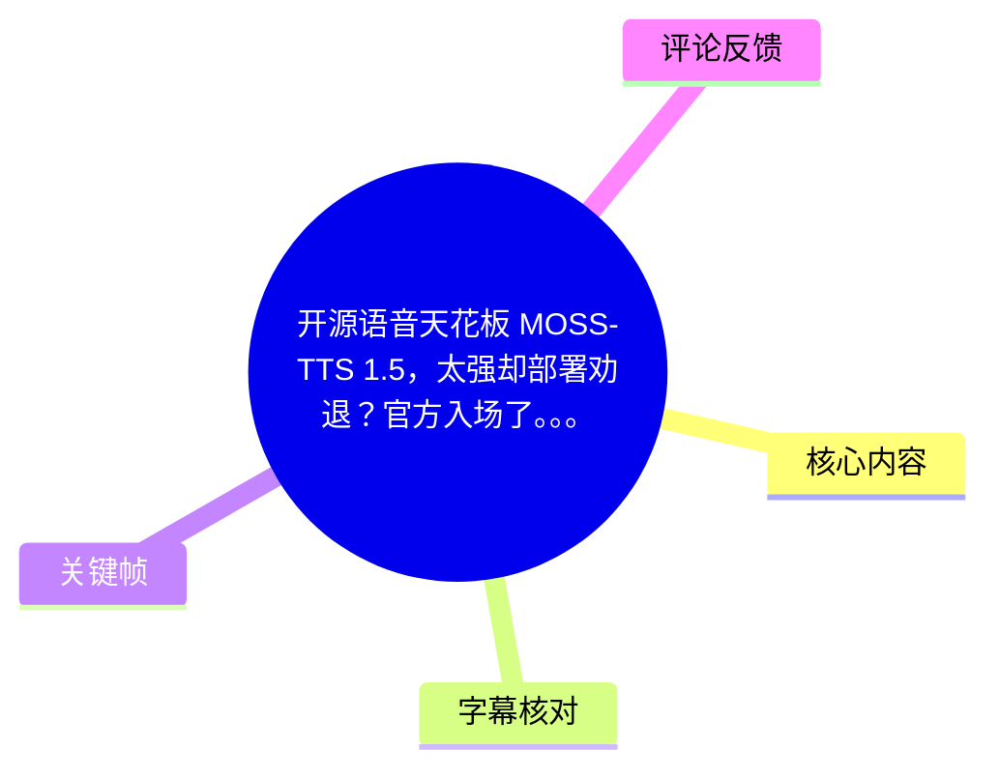
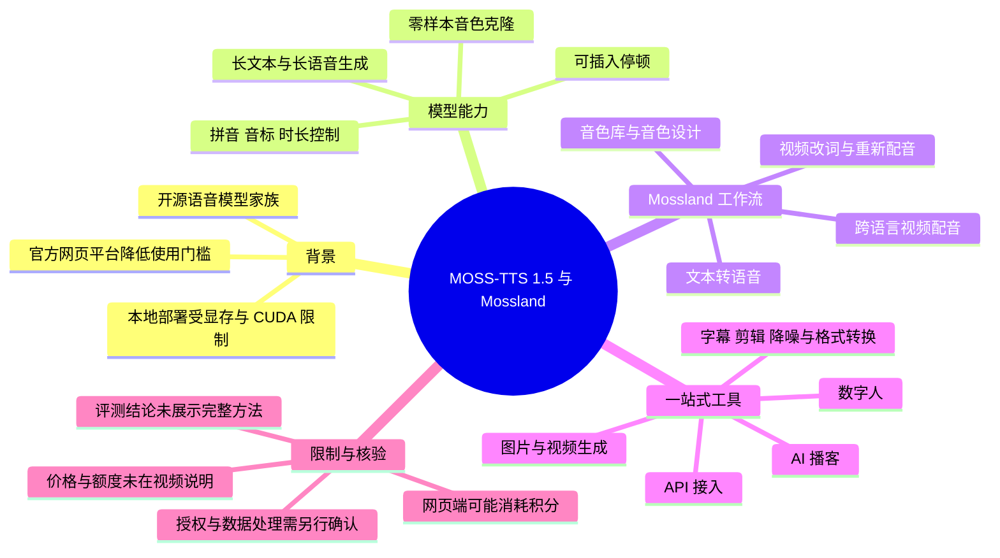
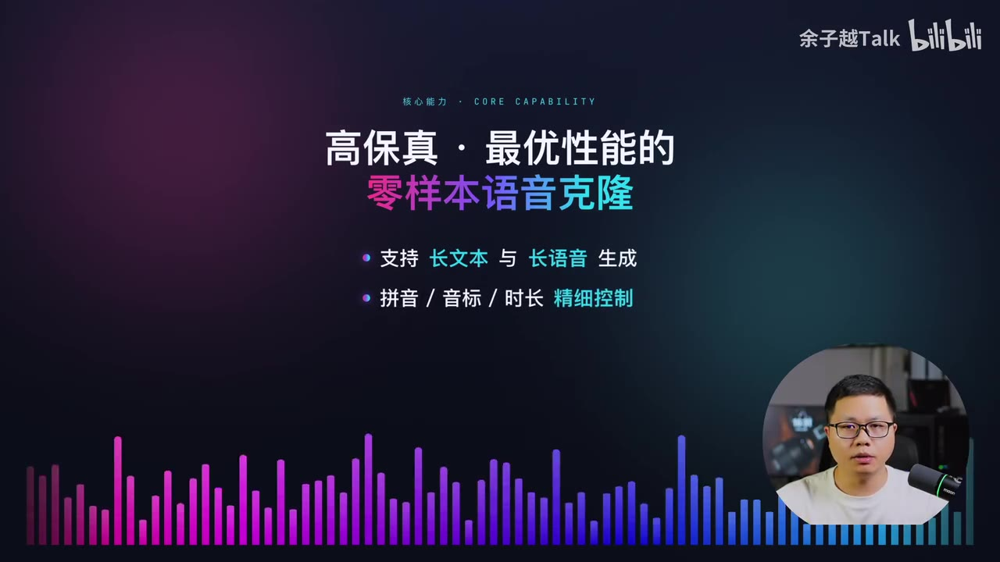
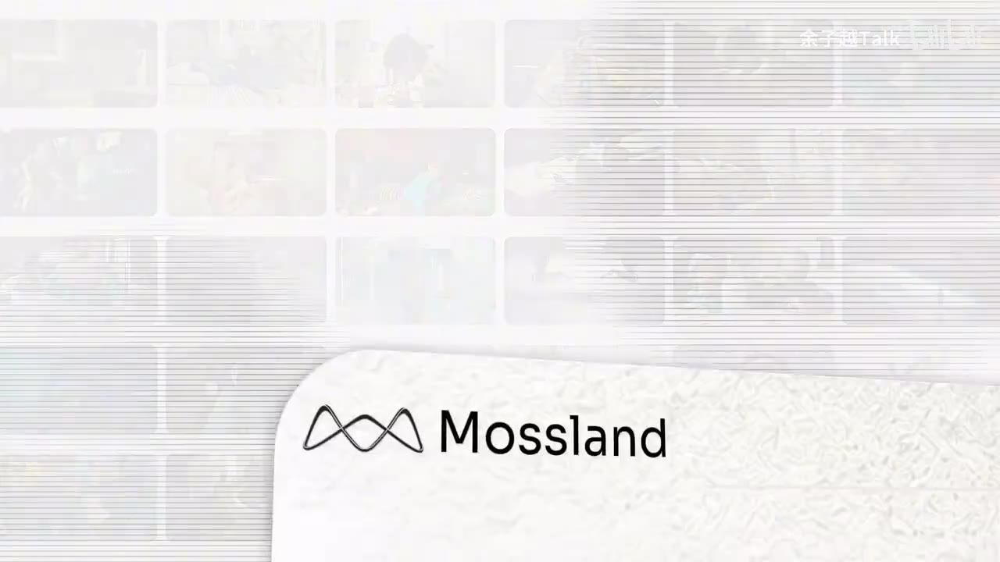
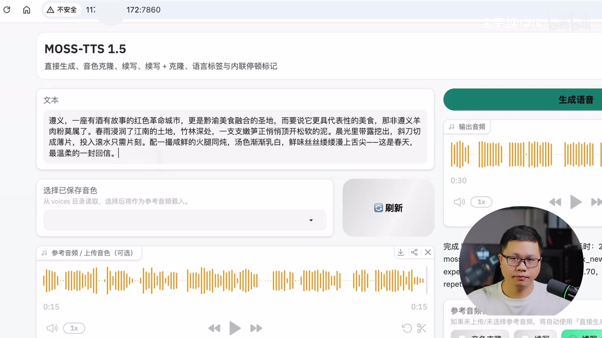
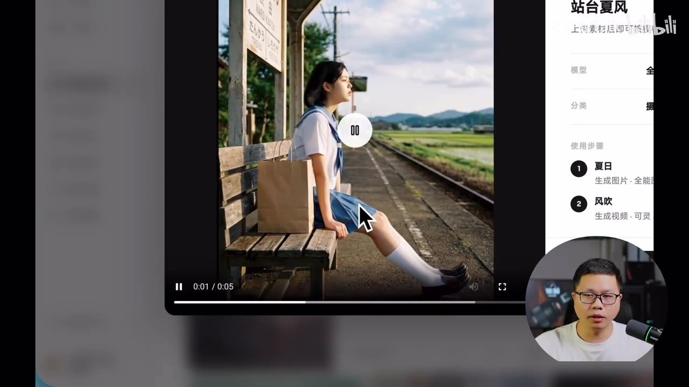

# 开源语音天花板 MOSS-TTS 1.5，太强却部署劝退？官方入场了。。。

> 来源：[Bilibili 视频](https://www.bilibili.com/video/BV1pLNq6xEjt) 
> UP 主：余子越Talk｜发布时间：2026-07-15｜视频时长：05:06 
> 标签：TTS、Mossland、文字转语音、音色克隆、AI 配音、MOSS-TTS

## 小结

视频围绕开源语音模型家族 **MOSS-TTS 1.5** 及其官方网页平台 **Mossland** 展开。UP 主的核心观点是：MOSS-TTS 1.5 的语音生成、零样本音色克隆和可控性表现突出，但旗舰模型的本地部署受 CUDA 环境、显存等条件限制；Mossland 将模型接入网页端，降低了直接使用门槛。

视频将 MOSS-TTS 的能力概括为高保真零样本语音克隆、长文本/长语音生成，以及拼音、音标、时长和停顿等细粒度控制。UP 主还提到该模型支持多语言能力，并称其在主观评测中表现优异；这些属于视频转述的模型宣传或评测结论，视频内未展示评测集、样本量、评分流程及可复现实验，因此不宜直接等同于独立验证结论。

Mossland 不只提供文字转语音：视频演示或介绍了单人/多人语音合成、上传音频复刻音色、文字描述生成音色、视频错误台词修正、换音色、跨语言配音、AI 播客、数字人、字幕与剪辑等音视频工具，以及图片/视频生成和 API 接入。

实际操作上，视频呈现的是一条低代码流程：在网页输入文本或上传素材，选取或创建音色，生成后试听、修改文本或导出结果。对没有本地 GPU 环境、希望快速制作配音或改稿的创作者，这种托管式工作流更直接；对需要私有化部署、成本可控或大规模批处理的用户，则还需额外核实 API 定价、积分规则、数据授权、并发和导出限制。

需要特别区分“模型开源”与“网页服务免费”。热评指出网页版生成会消耗积分、积分不足可能需要付费；视频本身没有给出免费额度、单次消耗、订阅价格或 API 计费参数。因此，网页端降低的是部署门槛，不代表使用没有持续成本。

信息具有时效性：视频发布于 2026-07-15，平台接入模型、支持的第三方模型、1080P 数字人规格、积分政策和 API 能力均可能在后续调整。本文仅整理视频与附带素材中出现的内容，不将其延伸为当前实时产品状态。

## 思维导图

## 目录

- [模型定位、能力与部署门槛](#模型定位能力与部署门槛)
- [Mossland：把本地模型转为浏览器服务](#mossland把本地模型转为浏览器服务)
- [语音合成与音色工作流](#语音合成与音色工作流)
- [视频配音、改词与跨语言处理](#视频配音改词与跨语言处理)
- [播客、数字人与工具集](#播客数字人与工具集)
- [图像视频生成与 API](#图像视频生成与-api)
- [可复用的操作步骤与适用场景](#可复用的操作步骤与适用场景)
- [限制、成本与时效性](#限制成本与时效性)
- [字幕比对](#字幕比对)
- [评论分析](#评论分析)
- [处理记录](#处理记录)

## [模型定位、能力与部署门槛](https://www.bilibili.com/video/BV1pLNq6xEjt?t=20)

### [模型能力：零样本克隆与细粒度控制（00:20）](https://www.bilibili.com/video/BV1pLNq6xEjt?t=20)

视频先回顾 MOSS-TTS 1.5。UP 主将其描述为 OpenMOSS 团队开源的语音模型家族，并称其配音效果可与主流闭源模型相比。视频中明确提到的能力包括：

1. **零样本语音克隆**：用参考音频复刻目标音色，不要求先为每一个声音进行模型训练。
2. **长文本、长语音生成**：面向较长段落而不局限于单句生成。
3. **发音与时长控制**：支持对拼音、音标、时长进行更细的约束。
4. **停顿控制**：可在语句中插入停顿，使节奏更接近预期表达。
5. **多语言能力**：ASR 识别到“31种……”相关表述，但该处专有名词和具体限定被严重识别错误；因此本文只保留“视频称其具备多语言相关能力”，不据此确认准确语种数或技术名称。
6. **主观评测表现**：UP 主称对话模型 MOSS-TTSD 在主观竞技场中优于豆包、Gemini 2.5 Pro。该说法为视频陈述，未附带评测链接、指标定义或复现条件。

> 图：画面列出“高保真·最优性能的零样本语音克隆”“支持长文本与长语音生成”“拼音/音标/时长精细控制”。它把视频口述中最关键的能力边界集中呈现出来，也可用于辨认 ASR 中被误写的“高保增”等词。

### [为什么“强”却可能部署劝退（00:45）](https://www.bilibili.com/video/BV1pLNq6xEjt?t=45)

UP 主指出，本地运行旗舰模型的障碍主要不在于功能理解，而在于运行条件：

- 需要正确配置软件环境；
- 需要 CUDA 相关环境；
- 需要足够显存；
- 任一环节不足，都可能导致无法顺利在本机启动或推理。

视频没有展示安装命令、硬件型号、最低显存数值、推理吞吐、量化方式或系统兼容性，因此不能从本视频推导出具体部署配置。这里的可迁移经验是：当模型能力很强但本地门槛较高时，应先区分自己的需求是“试用生成效果”还是“私有化、离线和规模化生产”。前者可选择托管服务，后者仍必须核对官方仓库的部署文档和实际硬件要求。

## [Mossland：把本地模型转为浏览器服务](https://www.bilibili.com/video/BV1pLNq6xEjt?t=70)

### [平台定位与核心变化（01:10）](https://www.bilibili.com/video/BV1pLNq6xEjt?t=70)

视频介绍 Mossland 为以语音能力为核心的一站式 AIGC 创作平台。UP 主强调的变化是：平台已接入 MOSS-TTS 1.5，因此用户不必先在本地配置模型环境，即可在浏览器中直接调用相关能力。

这并不意味着模型本身的本地部署难题被消除，而是把计算和部署环节转移给平台侧。对用户而言，工作重心由“安装依赖、配置显卡、排查环境”变成“登录平台、选择工具、提交任务、消耗平台资源”。

> 图：画面展示 Mossland 标识与产品界面过场，用于说明视频从模型能力介绍转入官方平台方案。它能帮助区分“开源模型 MOSS-TTS”与“网页产品 Mossland”这两个层次。

视频描述的平台能力覆盖声音生产的上下游：从文本生成语音、建立音色资产，到视频配音、播客、数字人、转写与剪辑，再延展到图像和视频生成。应注意，这种“全包”是功能范围描述，不等同于每项能力均由同一个 MOSS 模型提供。

## [语音合成与音色工作流](https://www.bilibili.com/video/BV1pLNq6xEjt?t=94)

### [文本转语音：输入文本、选音色、生成（01:34）](https://www.bilibili.com/video/BV1pLNq6xEjt?t=94)

语音合成是 UP 主认为平台“效果最能打”的部分。视频给出的基础操作路径为：

1. 在文本框输入待朗读内容；
2. 从已保存的音色中选择目标声音；
3. 点击“生成语音”；
4. 在输出区播放、试听生成结果；
5. 如需调整，修改文本、替换音色或重新生成。

界面画面中可见“文本”“选择已保存音色”“参考音频/上传音色（可选）”“生成语音”等区域，并有生成结果波形与播放器。界面还提示“从 voices 目录读取，选择后将作为参考音频载入”，但视频未说明该目录是云端项目目录、本地目录映射，还是产品内部资源目录，不能据此扩展解释。

> 图：画面同时展示文本输入、音色选择、参考音频波形与输出音频波形，是理解“文本 + 音色/参考音频 → 语音结果”这一核心交互链条的关键帧。

视频分别播放了两类结果：

- **单人合成**：用一段叙述文本展示自然朗读效果；
- **多人对话合成**：用“早安 101”式双人广播片段展示不同角色轮流说话的场景。

视频没有给出多人对话时的角色数量上限、角色标记语法、每个角色是否必须绑定独立音色、一次任务的文本长度上限，也没有展示生成耗时。因此，实际使用时应以平台界面的当期限制为准。

### [音色库、上传复刻与文字设计音色（01:59）](https://www.bilibili.com/video/BV1pLNq6xEjt?t=119)

当预置音色库中没有所需声音时，视频给出两种扩展途径：

| 方式 | 输入 | 视频说明的结果 | 注意事项 |
| --- | --- | --- | --- |
| 参考音频复刻 | 上传一段音频 | 复刻出高度相似的音色 | 视频未说明参考音频最短时长、采样要求与相似度边界 |
| 文字描述设计 | 一句自然语言描述 | 生成与描述对应的音色 | 示例为低沉、慵懒、略带烟嗓的男声；结果具有生成随机性 |
| 音色资产沉淀 | 已生成或已复刻音色 | 保存到个人音色库 | 视频未说明保存数量、跨项目复用规则或导出权限 |

这里值得保留的创作经验是：**先明确需求，再决定使用克隆还是设计**。若目标是保留某个已有且已获授权的说话人风格，使用参考音频克隆更贴近目标；若只是需要“情绪、年龄感、声线质感”等抽象属性，则可优先用自然语言描述生成，避免不必要地使用真实人物声音。

涉及音色克隆时，视频没有讨论肖像权、声音人格权益、录音授权或平台审核政策。实际使用者应确保对参考音频、人物声音和最终发布内容拥有合法授权，不应用于冒充、欺诈或误导性表达。

## [视频配音、改词与跨语言处理](https://www.bilibili.com/video/BV1pLNq6xEjt?t=165)

### [改一个词并保持原视频表达（02:45）](https://www.bilibili.com/video/BV1pLNq6xEjt?t=165)

视频展示了视频配音中的“错词修正”场景：原视频里一句话中的“朋友”被说错，用户上传视频后，平台先识别其中的文字；用户在文本中修改错误词，再一键生成修正后的配音。UP 主称模型会按原视频的语气、情绪重新配音。

视频演示前后的文字差异为：

- 原句片段：“拿钱做我的朋友……”
- 修正后片段：“拿钱做我的女朋友……”

可整理为以下工作流：

1. 上传已有视频；
2. 等待平台识别视频中的语音文字；
3. 在转写文本中定位错误位置；
4. 修改指定词语；
5. 提交重新配音；
6. 对比修改后的音频是否与画面、原有情绪和上下文匹配。

这类能力适合口播录错词、产品名改名、局部文案更新等情况。不过，视频未提供口型同步精度、可编辑的最小片段、背景音乐保留方式、人声与环境声分离方式，或失败后的人工微调能力。若画面包含人物正脸特写，尤其应自行检查修正语音是否造成明显口型不匹配。

### [换音色与跨语言配音（03:13）](https://www.bilibili.com/video/BV1pLNq6xEjt?t=193)

在局部改词之外，视频还介绍两个方向：

- **全新音色替换**：为已有视频换上另一种声音；
- **跨语言配音**：将中文视频转为其他语言的配音版本。

前者可用于统一系列内容的配音风格、将真人原声替换为授权的品牌声音；后者可服务于跨语言传播。两者都依赖对原视频语音内容的正确理解，因此处理前建议人工核对专有名词、数字、品牌名、人物名和容易歧义的表达。

视频只说明可“一键”完成中文视频转其他语言配音，没有列出目标语种、是否自动翻译、是否保留时间轴、是否生成字幕、译文是否可编辑、是否做唇形适配。因此“一键”应理解为产品入口层面的流程简化，不应推断为所有语言、所有视频类型都具有同等质量。

## [播客、数字人与工具集](https://www.bilibili.com/video/BV1pLNq6xEjt?t=218)

### [AI 播客：从主题到成片的链路（03:38）](https://www.bilibili.com/video/BV1pLNq6xEjt?t=218)

视频给出的 AI 播客链路包括：

1. 输入播客主题；
2. 平台先生成文案；
3. 用户确认文案；
4. 一键生成配音、配乐与混音；
5. 得到可直接发布的播客成品。

其中“确认文案”是流程中最重要的人工检查点。语音生成质量再高，也不能替代对事实、观点、版权素材和表达风格的审核。对于知识类、新闻类和商业内容，建议在确认前至少复核：标题、人物/机构名称、数字、日期、引用来源、结论强度，以及是否存在不应被自动配乐掩盖的重要提示。

### [数字人与后期工具（03:38）](https://www.bilibili.com/video/BV1pLNq6xEjt?t=218)

视频称数字人功能支持：

- 形象控制；
- 动作控制；
- **最高 1080P** 规格。

同时，工具集包含或提及：

- 添加字幕；
- 视频剪辑；
- 音频提取；
- 音视频降噪；
- 格式转换。

以上列表反映产品覆盖面，但视频没有逐项演示，也未给出输入格式、文件大小、时长上限、导出水印、队列等待时间、降噪强度或数字人渲染时长。若把平台纳入稳定生产流程，应先使用短素材验证质量，再确认批量任务、成品交付和成本是否符合要求。

## [图像视频生成与 API](https://www.bilibili.com/video/BV1pLNq6xEjt?t=242)

### [图像与视频生成入口（04:02）](https://www.bilibili.com/video/BV1pLNq6xEjt?t=242)

除语音和音视频工具外，视频称平台还支持图片、视频生成，并接入“可灵、Seedance、S-GEM”等主流模型或服务名称。由于 ASR 对模型名称存在误识别风险，本文保留画面与口播所能辨识的名称，不将其扩展为具体版本、厂商或能力参数。

UP 主展示了若干生成视频片段拼接而成的约 30 秒成片。该段主要作为视觉效果展示，缺少提示词、模型版本、生成参数、单段时长、迭代次数和后期处理过程，因而不能作为稳定产出质量或速度的量化依据。

> 图：画面显示一段竖屏生成视频及右侧使用步骤，体现平台已将视频生成纳入工作台。它的价值在于说明该视频的讨论范围已由 TTS 扩展到多模态创作，而不是证明所有生成效果均由 MOSS-TTS 实现。

### [API：接入自己的工作流（04:52）](https://www.bilibili.com/video/BV1pLNq6xEjt?t=292)

视频最后称上述能力开放了 API，开发者可以接入自己的工作流。视频简介中给出两个入口：

- Mossland 体验地址：<https://mossland.mosi.cn>
- 模思开放平台 Mossland API：<https://platform.mosi.cn>

视频没有展示 API 文档、鉴权方式、请求参数、并发配额、回调机制、错误码、语音文件存储方式或计费方式。因此，开发接入前应优先检查官方文档中的以下问题：

1. 可调用的具体模型和接口范围；
2. API Key 的创建、权限和轮换机制；
3. 同步/异步任务模式及结果轮询或回调方式；
4. 输入文本、音频、视频的格式和大小限制；
5. 内容保存期限、数据使用条款与隐私处理；
6. 计费单位、免费额度、失败任务是否扣费；
7. 商用许可、音色克隆授权与地区限制。

## [可复用的操作步骤与适用场景](https://www.bilibili.com/video/BV1pLNq6xEjt?t=94)

### [场景一：快速制作一段 AI 配音（01:34）](https://www.bilibili.com/video/BV1pLNq6xEjt?t=94)

适合短视频口播、课程旁白、产品介绍、故事朗读等场景。

1. 准备已校对的文本，尤其处理好数字、英文、缩写和专名；
2. 在 Mossland 的语音合成页面粘贴文本；
3. 选择预置音色，或从个人音色库选择已有声音；
4. 如需特定声音，上传已获授权的参考音频；
5. 生成后试听，检查发音、停顿、重音、情绪和语速；
6. 对不理想处修改文本表达或替换音色后重新生成；
7. 导出前核验是否存在费用、积分消耗或水印提示。

### [场景二：建立可复用的品牌音色资产（01:59）](https://www.bilibili.com/video/BV1pLNq6xEjt?t=119)

适合需要长期保持统一声音形象的账号或团队。

1. 明确音色来源和授权范围；
2. 选择“参考音频复刻”或“文字描述设计”；
3. 对不同语速、情绪、长短文本分别生成测试样本；
4. 给通过测试的音色建立清晰命名和用途标签；
5. 保存到个人音色库，供后续视频、播客或数字人任务复用；
6. 发布前避免使用容易让受众误认为真人亲自发声的误导性表达。

### [场景三：修正已发布前的视频台词（02:45）](https://www.bilibili.com/video/BV1pLNq6xEjt?t=165)

适合局部错词且不希望整段重录的情况。

1. 上传原视频；
2. 检查自动转写文本，不应直接相信识别结果；
3. 定位需要更正的词或句；
4. 修改文字后生成替换配音；
5. 重点检查替换片段的情绪连续性、背景声衔接和人物口型；
6. 若属于重要信息、金额、法规、医疗或金融内容，应由人工复听确认。

### [场景四：从主题到播客成片（03:38）](https://www.bilibili.com/video/BV1pLNq6xEjt?t=218)

适合希望快速完成“策划—文稿—配音—混音”的内容生产者。

1. 输入主题与目标受众；
2. 获取平台生成的初稿；
3. 人工审核并修改文案；
4. 指定所需音色、配乐和表达风格；
5. 生成音频后检查人声清晰度、配乐音量和内容准确性；
6. 确认有权使用所选音乐、声音和素材后再发布。

## [限制、成本与时效性](https://www.bilibili.com/video/BV1pLNq6xEjt?t=45)

### [视频已说明的限制](https://www.bilibili.com/video/BV1pLNq6xEjt?t=45)

- 本地部署旗舰模型需要处理环境、CUDA 与显存条件；
- 网页服务解决的是本地运行门槛，而非所有成本或权限问题；
- 视频虽展示了效果，但没有提供可复现的硬件、模型版本、参数、延迟和成本数据；
- API 被提及但未展示调用细节。

### [需要额外核验的风险](https://www.bilibili.com/video/BV1pLNq6xEjt?t=292)

- **成本风险**：热评称网页版生成需消耗积分；官方当期收费规则、免费额度和 API 价格需另行查询。
- **质量风险**：自动转写、翻译、改词和换音色可能错读专有名词、改变语义或造成音画不同步。
- **授权风险**：克隆真实人物音色、上传他人录音、使用生成素材进行商业发布，都需要确认授权与平台条款。
- **数据风险**：上传原始音频、视频、会议内容或客户资料前，应核对平台的数据留存、训练使用、删除机制和隐私政策。
- **模型归因风险**：MOSS-TTS 是语音模型家族；平台中图片、视频生成及其他工具可能接入第三方模型，不能将所有结果都归因于 MOSS-TTS 1.5。

### [时效性说明](https://www.bilibili.com/video/BV1pLNq6xEjt?t=70)

本文所整理的功能、模型接入情况和产品规格以视频发布时所述为准。尤其是网页端积分、价格、可用模型、1080P 支持范围、第三方模型接入和 API 接口，均可能在视频发布后发生更新。使用前应以 Mossland 产品页面及开放平台文档的当期信息为准。

## 字幕比对

| 字幕来源 | 完整性 | 专有名词 | 时间轴 | 主要问题 |
| --- | --- | --- | --- | --- |
| Bilibili 站内字幕 | 未提供可用字幕 | 无法核验 | 无法使用 | 素材记录显示字幕获取工具因 URL 无效退出，未获得可比较的站内字幕文件 |
| 本次 ASR 字幕 | 共 16 段，覆盖约 222.35 秒语音；含演示留白和成片播放段 | 存在明显误识别 | 可用，带 SRT 起止时间 | 将“MOSS-TTS”“OpenMOSS”“Gemini”“音色”“低沉”“工具集”等识别为近音或错词；部分模型名称与“31种”后的表述不可靠 |

本次 ASR 使用 `large-v3-turbo`，识别语言为中文，语言概率为 `0.998046875`，音频总时长约 `305.28` 秒。诊断结果未标记 `noAudioStream=true`，且已成功得到带时间戳的音频识别结果，因此本视频存在可用音轨；并非无音轨视频。

最终采用 **本次 ASR 的 SRT 时间轴** 作为章节定位依据，并以关键帧、视频标题、简介及上下文对术语进行谨慎校正。主要校正如下：

| ASR 原识别 | 正文采用 | 校正依据 |
| --- | --- | --- |
| MOS TTS / MOS TTTS | MOSS-TTS 1.5 | 视频标题、简介、界面标题与关键帧 |
| OpenMOS | OpenMOSS | 视频简介中出现 OpenMOSS 团队 |
| 高保增 | 高保真 | 关键帧中的清晰文字 |
| 诱音 / 音设 | 语音 / 音色 | 语义与产品界面上下文 |
| 低层慵懒带点烟赏 | 低沉、慵懒、带点烟嗓 | ASR 语义修正；仅作为视频示例描述 |
| 可林、C-Dance、C-GEM | 可灵、Seedance、S-GEM（名称仍保留谨慎） | 口播上下文；未获得可完整核对的产品清单 |
| 31种语盐绿化 | 不确认具体表述 | ASR 错误严重，视频材料不足以可靠还原 |

ASR 在 `00:00:07.700—00:00:20.960`、`00:00:55.620—00:01:10.480`、`00:04:14.200—00:04:43.800` 等区间存在较大空白，结合视频结构判断，主要对应语音效果试听、界面过场或生成视频展示，不应被误认为字幕遗漏的连续讲解内容。

## 评论分析

仅处理本次素材中可获取的热评前三条。评论是用户观点，不作为平台价格或产品能力的已验证事实。

1. **BIN封之境（9 赞）**  
   观点是网页版“不算免费”，因为生成会消耗积分，积分不足时需要付费。该评论补充了视频未说明的成本维度，提醒读者不能把“免部署”直接理解为“免费使用”。但评论没有给出具体积分规则、价格截图或官方条款，需以平台当期定价页面为准。

2. **赚钱炒股-ray（3 赞）**  
   评论认为收费平台不应与开源模型直接放在一起比较。这个质疑指出了两个不同层面的概念：**开源模型的许可与可部署性**，以及**托管网页平台的商业化使用成本**。视频本身确实同时讨论了 MOSS-TTS 和 Mossland，阅读时应分别评估：前者关注模型能力与部署，后者关注产品体验、成本和服务条款。

3. **幸运渔帽（2 赞）**  
   评论内容为“阔以”，表达了简短认可，但没有提供具体体验、技术细节或可验证补充信息。因此，它只能反映一位观众的积极态度，信息增量有限。

## 处理记录

- Worker ID：`worker-mrj0wbly-5dc4e50c`
- 调用模型：`gpt-5.6-terra`
- 使用的素材与工具结果：
  - 视频元数据、简介、标签与热评数据；
  - 音频文件：`audio/audio.wav`；
  - ASR 模型：`large-v3-turbo`，设备：`cuda`，计算类型：`int8_float16`；
  - ASR 时间轴文件：`asr/transcript.srt`、`asr/asr-result.json`；
  - 关键帧目录：`frames/`；
  - 热评文件：`comments/comments.json`。
- 字幕选择：
  - 未提供可用 Bilibili 站内字幕；素材警告显示字幕抓取工具因 `Invalid URL` 未成功获得字幕。
  - 已检查本次 ASR，源视频存在音轨且 ASR 含可用时间戳。
  - 正文时间轴以 ASR SRT 的真实起始秒数生成；术语以关键帧、标题、简介和上下文谨慎校对。
- 关键帧选择依据：
  - `frames/frame-001.jpg`：展示 MOSS-TTS 1.5 的文本、音色、参考音频和输出波形，支撑核心 TTS 流程；
  - `frames/frame-002.jpg`：清晰列出零样本克隆、长文本/语音、拼音/音标/时长控制，支撑能力说明；
  - `frames/frame-003.jpg`：展示 Mossland 品牌过场，用于区分网页平台与开源模型；
  - `frames/frame-004.jpg`：展示视频生成界面和生成结果，支撑多模态工具扩展部分。
- 缓存清理：素材中未提供缓存清理执行日志；本文不将其标记为已完成。
- 未解决问题：
  - MOSS-TTS 的准确多语言语种数及 ASR 中“31种”后的原始表述无法从现有素材可靠恢复；
  - 未提供本地部署的最低显存、安装命令、版本号、性能测试或模型权重信息；
  - 未提供 Mossland 当前积分价格、免费额度、API 计费、隐私条款和商业授权细则；
  - 视频提到的图片/视频第三方模型名称存在 ASR 误识别可能，需以平台实时列表为准。
