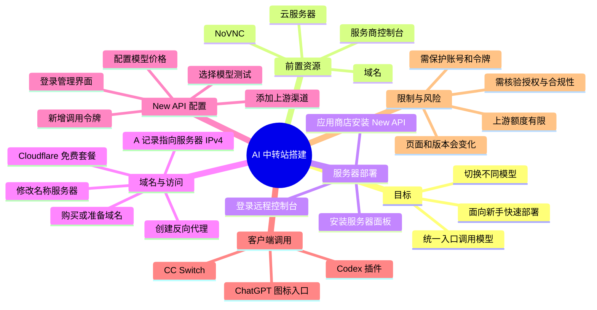
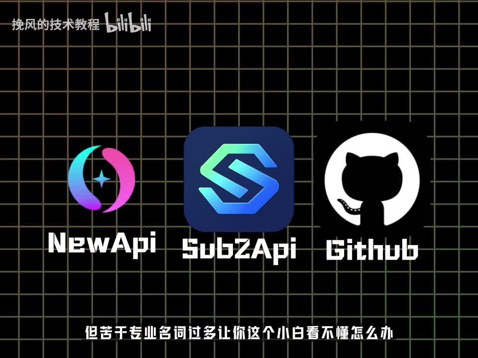
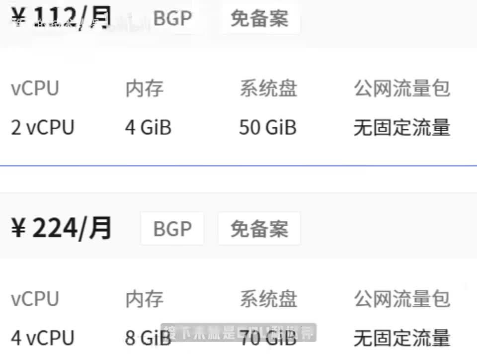
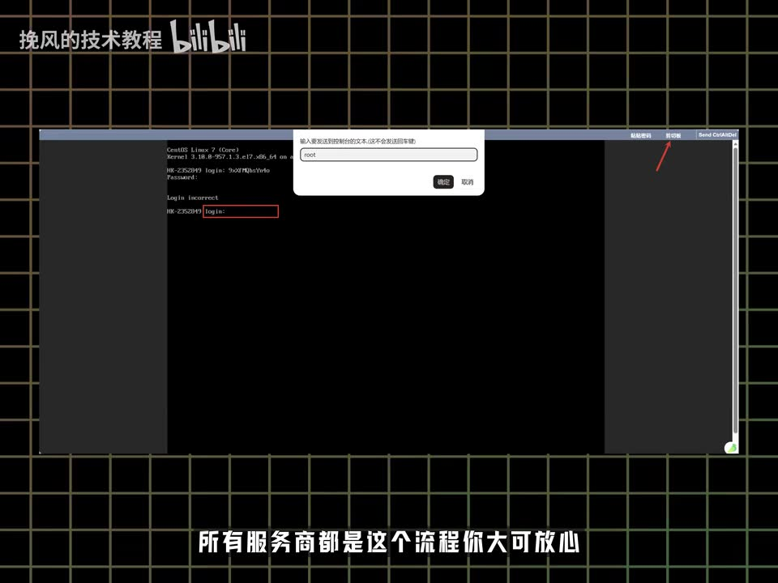
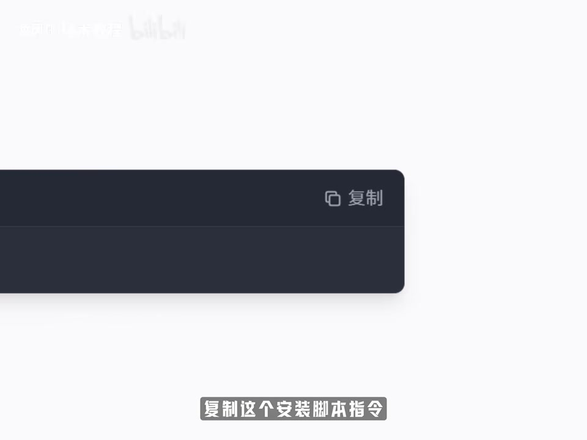

## 小结

视频以“搭建自己的 AI 中转站、统一切换不同模型”为目标，给出一条面向新手的快速部署路径：准备云服务器和域名，通过 NoVNC 登录服务器，安装服务器面板及 New API，接入 Cloudflare DNS，建立反向代理，再配置上游渠道、调用令牌、模型价格及客户端调用。

作者的服务器选购观点是优先关注公网带宽，再考虑 CPU 和内存；对于新手可以先完成部署，后续再根据实际问题扩容。画面展示了两档示例套餐：`2 vCPU / 4 GiB / 50 GiB` 与 `4 vCPU / 8 GiB / 70 GiB`，均标注“无固定流量”。这些是录制时的页面示例，不应视为通用最低配置、固定价格或性能保证。

视频中的核心部署链路可概括为：**云服务器 → NoVNC → 安装服务器面板 → 应用商店安装 New API → 购买/准备域名 → Cloudflare 免费套餐与 A 记录 → 更换名称服务器 → 面板反向代理至 New API 容器 → 配置渠道、令牌与价格 → CC Switch / Codex 相关客户端配置**。

作者提到可以使用其提供的“上游”进行测试，但同时明确表示“额度有限”，因此这只能作为演示性选项，不能视为稳定、长期或具备商业授权的服务承诺。视频没有给出上游地址、密钥、模型映射、价格倍率、限速规则或授权证明。

该视频时长约 3 分 7 秒，属于快速演示，而不是完整运维手册。安装脚本内容、面板版本、New API 容器参数、端口、防火墙、HTTPS、Cloudflare SSL 设置、备份与监控均未在素材中完整展示；实际部署时必须自行查阅对应工具的官方文档并核验安全与合规要求。

## 思维导图

## 目录

- [目标、前置资源与服务器选购](#目标前置资源与服务器选购)
- [登录服务器并安装面板](#登录服务器并安装面板)
- [安装 New API 与准备域名](#安装-new-api-与准备域名)
- [Cloudflare、DNS 与反向代理](#cloudflaredns-与反向代理)
- [配置渠道、令牌、价格与测试](#配置渠道令牌价格与测试)
- [Codex 插件与 CC Switch 配置](#codex-插件与-cc-switch-配置)
- [按视频顺序的操作清单](#按视频顺序的操作清单)
- [参数、限制与时效性](#参数限制与时效性)
- [字幕比对](#字幕比对)
- [评论分析](#评论分析)
- [处理记录](#处理记录)

# 手把手教你怎么搭建AI中转站/找上游?

> 来源：[Bilibili 视频](https://www.bilibili.com/video/BV1j5D9BgESK)  
> UP 主：挽风的技术教程  
> 视频时长：03:07  
> 合集：AIcode  
> 标签：AI、教程、Claude、ChatGPT、NewAPI、Sub2API、网站、中转站

## [目标、前置资源与服务器选购](https://www.bilibili.com/video/BV1j5D9BgESK?t=0)

作者开场提出的需求是：拥有一个自己的 AI 中转入口，从而能够在不同模型之间切换；其假定的受众是对“服务器、域名、面板、上游、反向代理”等概念不熟悉的新手。

在 [00:10](https://www.bilibili.com/video/BV1j5D9BgESK?t=10)，作者把前置资源概括为两项：

1. **一台云服务器**：用于部署服务器面板、New API 及相关反向代理服务。
2. **一个域名**：用于通过域名访问服务，并完成 DNS 与代理配置。

在 [00:19](https://www.bilibili.com/video/BV1j5D9BgESK?t=19)，作者的选购思路是：

- 服务器先以“大带宽”为主要关注项；
- 其次再看 CPU 和运行内存；
- 对新手而言，可以先完成搭建；
- 后续出现性能或资源问题，再按照前述优先级追加配置。

这属于作者的经验性建议。视频没有提供并发量、请求频率、带宽数值、地域、操作系统、延迟或负载测试，因此不能据此得出某一规格足以支持具体业务的结论。

> 图：该关键帧展示 NewAPI、Sub2API 和 GitHub 标识，明确了视频主题是围绕 AI API 聚合、中转或上游接入类工具展开。它也为后文将 ASR 中的“New ePay”校正为“New API”提供了画面依据。

> 图：画面展示两档服务器参数与月价，是理解作者“带宽、CPU、内存”选购讨论的直接依据。它记录的是视频中出现的示例，不构成固定推荐。

### 视频画面中可读到的示例规格

| 套餐项目 | 示例一 | 示例二 |
| --- | ---: | ---: |
| 月价 | ¥112/月 | ¥224/月 |
| CPU | 2 vCPU | 4 vCPU |
| 内存 | 4 GiB | 8 GiB |
| 系统盘 | 50 GiB | 70 GiB |
| 公网流量包 | 无固定流量 | 无固定流量 |
| 页面标签 | BGP、免备案 | BGP、免备案 |

需要注意：

- 视频未给出带宽的具体 Mbps/Gbps 数值。
- 画面价格会随供应商、地域、活动、计费周期变化。
- “无固定流量”不等于没有任何公平使用、限速、带宽峰值或服务条款限制。
- 这些套餐仅为作者演示页面中的方案，并非 New API 或 AI 中转站的官方最低配置。

## [登录服务器并安装面板](https://www.bilibili.com/video/BV1j5D9BgESK?t=26)

在 [00:26](https://www.bilibili.com/video/BV1j5D9BgESK?t=26)，作者进入云服务器控制台并打开 **NoVNC** 界面。NoVNC 可以理解为在浏览器中访问远程服务器控制台的方式。

随后在 [00:34](https://www.bilibili.com/video/BV1j5D9BgESK?t=34)，作者演示了登录过程：

1. 点击界面右上角的剪贴板功能；
2. 输入面板或服务器提供的账号；
3. 复制密码；
4. 使用粘贴密码功能；
5. 完成服务器控制台登录。

> 图：关键帧中可见服务器终端、登录提示与右上角“剪贴板”入口，画面中输入了 `root`。该图说明作者使用剪贴板完成远程控制台凭据输入的方式，也提示 root 账号与密码属于高敏感信息。

作者表示“所有服务商都是这个流程”，但这应理解为简化描述。不同云服务商实际可能提供 SSH、VNC、Web Console、救援模式或其他形式的控制台，默认用户名、密码下发方式和认证机制也可能不同。

### 安装服务器面板

在 [00:46](https://www.bilibili.com/video/BV1j5D9BgESK?t=46)，作者称搜索一个服务器面板官网，复制其安装脚本后回到 NoVNC 终端执行；安装时选择中文并输入 `Y` 确认，之后从终端输出中获得面板登录信息。

ASR 将面板名称识别为“ePano 面板”，该专有名词存在明显识别不确定性。素材没有提供可读的原始网站名称、脚本全文或安装输出，因此本文不把该名称强行规范为某一确定产品，只保留为“作者所称服务器面板”。

> 图：画面展示代码块右上角的“复制”按钮及“复制这个安装脚本指令”的字幕。其价值在于确认作者采用“从官网复制安装脚本，再粘贴到服务器终端执行”的部署方式；但脚本文本未保留，不能根据画面猜写命令。

### 本段操作步骤

1. 在云服务商控制台进入服务器实例。
2. 打开 NoVNC 或同类远程控制台。
3. 通过剪贴板输入账号、密码并登录服务器。
4. 搜索作者所用服务器面板的官网。
5. 复制官网提供的安装脚本。
6. 回到服务器终端粘贴并执行脚本。
7. 按作者演示选择中文，并输入 `Y` 确认。
8. 保存终端输出的面板访问地址、账号及密码。
9. 在浏览器访问面板地址并登录。

### 视频未展示但实际重要的事项

- 安装脚本的完整内容与来源校验；
- 服务器操作系统版本和兼容性；
- 面板开放端口及云安全组设置；
- 防火墙规则；
- 初始密码修改；
- HTTPS 与管理入口访问控制；
- 面板数据备份和升级策略。

因此，不应在不了解脚本来源、权限范围和执行内容的情况下直接运行未知命令。

## [安装 New API 与准备域名](https://www.bilibili.com/video/BV1j5D9BgESK?t=66)

在 [01:06](https://www.bilibili.com/video/BV1j5D9BgESK?t=66)，作者进入服务器面板的“应用商店”，搜索并安装 **New API**；在 [01:13](https://www.bilibili.com/video/BV1j5D9BgESK?t=73) 直接确认安装，等待完成。

ASR 把该名称识别为“New ePay”，但视频标题标签包含 `newapi`，开场关键帧也清楚显示 “NewAPI”，因此本文以 **New API** 记录。

视频仅确认了“通过面板应用商店安装”的动作，没有提供以下决定部署结果的信息：

| 未提供信息 | 影响 |
| --- | --- |
| New API 具体版本 | 功能、界面、漏洞修复与兼容性可能不同。 |
| 容器镜像与标签 | 决定实际运行的程序版本。 |
| 容器端口 | 影响反向代理目标配置。 |
| 数据库类型 | 影响部署、迁移和备份方式。 |
| 环境变量 | 可能涉及管理员初始化、数据库连接与安全配置。 |
| 数据卷路径 | 关系到配置、用户、令牌及账单数据是否持久化。 |
| 升级方式 | 关系到后续维护和回滚能力。 |

在 [01:16](https://www.bilibili.com/video/BV1j5D9BgESK?t=76)，作者转入域名选购环节，称阿里云、腾讯云等均可购买，自己的演示使用了 SpaceShip 上的域名。

这里的域名承担两个作用：

1. 作为用户或客户端访问中转站的地址；
2. 作为后续加入 Cloudflare、配置 DNS 和反向代理的对象。

## [Cloudflare、DNS 与反向代理](https://www.bilibili.com/video/BV1j5D9BgESK?t=88)

在 [01:28](https://www.bilibili.com/video/BV1j5D9BgESK?t=88)，作者表示需要注册 Cloudflare，以帮助加速访问服务器。ASR 识别为“CloudFair”，但结合加入域名、免费套餐和名称服务器切换等操作上下文，可高可信度校正为 **Cloudflare**。

### Cloudflare 添加域名

作者在 [01:32](https://www.bilibili.com/video/BV1j5D9BgESK?t=92) 展示的流程是：

1. 使用快速搜索；
2. 搜索 `Overview`；
3. 进入加入域名的入口；
4. 输入已购买的域名；
5. 点击继续；
6. 在 [01:40](https://www.bilibili.com/video/BV1j5D9BgESK?t=100) 选择免费套餐。

### DNS 记录设置

在 [01:44](https://www.bilibili.com/video/BV1j5D9BgESK?t=104)，作者要求解析类型选择 **A**。在 [01:48](https://www.bilibili.com/video/BV1j5D9BgESK?t=108)，作者说明 IPv4 地址就是服务器地址。

视频可确认的 DNS 关系如下：

| 配置项 | 视频所述 | 含义 |
| --- | --- | --- |
| 解析类型 | A | 用于把域名或子域名解析到 IPv4 地址。 |
| 记录目标 | 服务器 IPv4 地址 | 即服务器对外可访问的 IPv4 地址。 |
| Cloudflare 套餐 | 免费套餐 | 作者录制时选择的套餐。 |
| 后续动作 | 更换名称服务器 | 让域名使用 Cloudflare 提供的 DNS 托管。 |

在 [01:55](https://www.bilibili.com/video/BV1j5D9BgESK?t=115)，作者称复制“两个链接”，回到购买域名的平台编辑“名称服务器”，替换成前面复制的两个值。这里 ASR 的“两个链接”不够准确；根据后续“编辑名称服务器”的操作，应理解为 **Cloudflare 分配的两条名称服务器地址**。

作者口述名称服务器变更后“过个一到两分钟即可”。这只是演示经验，不是 DNS 生效保证。实际时间会受到注册商、TTL、递归 DNS 缓存、域名状态与平台审核等因素影响。

### 创建反向代理

在 [02:02](https://www.bilibili.com/video/BV1j5D9BgESK?t=122)，作者回到服务器面板左侧“网站”区域，安装相关插件；在 [02:08](https://www.bilibili.com/video/BV1j5D9BgESK?t=128) 创建反向代理项目。

在 [02:10](https://www.bilibili.com/video/BV1j5D9BgESK?t=130)，作者的操作是：

1. 在反向代理项目中选择 New API 对应容器；
2. 填写域名；
3. 确认创建；
4. 通过域名成功访问服务。

反向代理在该架构中的作用是让用户通过域名访问 New API 服务，而不必直接访问服务器 IP 或暴露容器端口。

不过，视频未展示以下反向代理关键配置：

- 域名记录名称；
- 回源端口；
- 回源协议；
- TLS/SSL 证书；
- Cloudflare 代理状态；
- HTTP 到 HTTPS 的跳转；
- WebSocket 或长连接支持；
- 访问白名单；
- 管理后台与公开 API 的权限隔离。

因此，“成功访问”仅说明作者当时的演示链路可用，不能替代生产环境的安全配置。

## [配置渠道、令牌、价格与测试](https://www.bilibili.com/video/BV1j5D9BgESK?t=140)

在 [02:20](https://www.bilibili.com/video/BV1j5D9BgESK?t=140)，作者登录 New API 账号。

随后在 [02:22](https://www.bilibili.com/video/BV1j5D9BgESK?t=142)，作者进入“添加渠道”环节，表示可以填写其提供的渠道，但额度有限，只适合用于测试；然后随意选择一个模型测试。

这里应区分三层信息：

- **视频事实**：作者演示了添加渠道、选择模型并测试。
- **作者推广表述**：作者邀请观众使用其上游。
- **素材未验证事项**：渠道来源、服务稳定性、价格、限额、模型真实性、账号授权、数据处理与转售许可。

在 [02:29](https://www.bilibili.com/video/BV1j5D9BgESK?t=149)，作者建议建站时“全选”，随后新增令牌，并说明该令牌用于后续调用。

“全选”对应何种具体配置，视频没有展开说明。它可能涉及渠道、模型、权限或其他界面选项，必须以实际 New API 版本的页面字段为准。对于真实使用场景，不宜在不理解权限含义的情况下无差别赋权。

在 [02:38](https://www.bilibili.com/video/BV1j5D9BgESK?t=158)，作者开始配置模型价格，要求新增刚刚添加的模型，价格可参照官方信息搜索。

这一步体现出中转站的基本运营逻辑：

- 上游模型本身存在成本或额度规则；
- 中转站需要为模型建立相应的价格或额度配置；
- 若价格设置与上游成本不同步，可能造成亏损、余额异常或用户计费争议。

但视频没有提供输入价格、输出价格、缓存价格、模型倍率、币种、计费精度、结算周期或余额策略，不能据此填写任何具体数字。

在 [02:45](https://www.bilibili.com/video/BV1j5D9BgESK?t=165)，作者进行测试并评价“速度可以”。这只是单次演示中的主观观察，不构成延迟、吞吐、成功率或稳定性的性能测试结论。

### 本段配置顺序

1. 通过域名进入 New API 管理界面。
2. 登录管理员或可管理渠道的账号。
3. 添加上游渠道。
4. 选择模型进行连通性测试。
5. 创建后续调用所需的 API 令牌。
6. 为新增模型配置价格。
7. 发起测试请求，确认服务能返回结果。

### 令牌与上游的安全边界

- API 令牌应仅存储在环境变量、密钥管理服务或受保护的配置中。
- 不应将令牌放入公开截图、公开仓库、前端页面或聊天记录。
- 令牌应按用途分开创建，便于撤销、审计和限额。
- 上游渠道是否允许代理、共享、转售或向第三方提供服务，必须自行核对服务条款。
- 作者已说明其提供的测试额度有限，不能据此规划长期业务。

## [Codex 插件与 CC Switch 配置](https://www.bilibili.com/video/BV1j5D9BgESK?t=169)

在 [02:49](https://www.bilibili.com/video/BV1j5D9BgESK?t=169)，作者将配置目标转到 Codex 插件和 **CC Switch**，并描述了以下界面操作：

1. 点击 ChatGPT 图标；
2. 点击添加；
3. 按照画面展示的格式填写配置。

ASR 将 “ChatGPT” 识别为 “Charge GPT”，但结合语境，本文校正为 **ChatGPT**。

视频没有保留“按照这个格式添加”中的具体内容，因此以下信息均不能补写：

- 配置项字段名；
- Base URL；
- API Key 填写位置；
- 模型名称；
- 请求路径；
- JSON、YAML 或其他配置文件格式；
- CC Switch 的版本；
- Codex 插件版本；
- 是否需要重启客户端；
- 是否支持流式输出、工具调用或其他能力。

在 [02:59](https://www.bilibili.com/video/BV1j5D9BgESK?t=179)，作者称现在可以使用“GPT5.4”，也可以“赚零花钱”；在 [03:03](https://www.bilibili.com/video/BV1j5D9BgESK?t=183)，作者邀请观众在评论区讨论，或联系其作为上游。

需要审慎处理这些说法：

- “GPT5.4”仅是作者口述，素材没有官方模型页、模型列表、渠道详情或供应商公告，无法独立确认其正式名称、来源、权限或可用状态。
- “赚零花钱”属于作者的主观营销性表述，不代表可验证的收益承诺。
- 把中转站用于个人测试，与向他人提供 API 服务、收费、分发或转售，面临的授权、成本、安全、数据保护和合规要求不同。

## [按视频顺序的操作清单](https://www.bilibili.com/video/BV1j5D9BgESK?t=10)

以下清单严格按视频讲述的实际顺序整理；视频未提供的命令、端口、域名、密钥和配置格式均不补写。

1. 准备云服务器与域名。
2. 选购服务器时优先考虑带宽，再考虑 CPU 和内存。
3. 在云服务商控制台打开 NoVNC。
4. 通过剪贴板输入账号与密码，登录服务器。
5. 搜索作者所用服务器面板的官网。
6. 复制官网安装脚本。
7. 回到 NoVNC 终端执行脚本。
8. 按演示选择中文并输入 `Y`。
9. 使用安装输出的链接、账号和密码登录面板。
10. 在面板应用商店搜索 New API。
11. 确认安装并等待完成。
12. 购买或使用已有域名。
13. 注册或登录 Cloudflare。
14. 在 Cloudflare 添加域名。
15. 选择免费套餐。
16. 配置 A 类型 DNS 记录。
17. 将 A 记录目标填写为服务器 IPv4 地址。
18. 复制 Cloudflare 分配的两条名称服务器地址。
19. 返回域名注册商，替换域名名称服务器。
20. 等待解析及名称服务器切换生效。
21. 回到服务器面板的“网站”区域。
22. 安装反向代理所需插件。
23. 创建反向代理项目。
24. 选择 New API 容器作为代理目标。
25. 填写域名并确认。
26. 使用域名进入 New API。
27. 登录 New API 管理账号。
28. 添加上游渠道。
29. 选择模型进行测试。
30. 新建调用令牌。
31. 配置新增模型的价格。
32. 再次测试调用。
33. 在 CC Switch 的 ChatGPT 相关入口中添加配置。
34. 按当时界面的格式填写中转站配置并测试。

## [参数、限制与时效性](https://www.bilibili.com/video/BV1j5D9BgESK?t=19)

### 视频明确出现的参数与条件

| 类别 | 视频信息 |
| --- | --- |
| 视频时长 | 页面元数据为 187 秒；ASR 音频时长为约 186.57 秒。 |
| 示例套餐一 | ¥112/月；2 vCPU；4 GiB 内存；50 GiB 系统盘；无固定流量；BGP；免备案。 |
| 示例套餐二 | ¥224/月；4 vCPU；8 GiB 内存；70 GiB 系统盘；无固定流量；BGP；免备案。 |
| DNS 类型 | A 记录。 |
| A 记录目标 | 服务器 IPv4 地址。 |
| Cloudflare 套餐 | 免费套餐。 |
| 作者口述的等待时间 | 更换名称服务器后约 1～2 分钟。 |
| 上游额度 | 作者明确表示额度有限，仅供测试。 |
| ASR 语言 | 中文，语言概率约 `0.99365234375`。 |
| ASR 语音覆盖 | 约 166.92 秒，占音频时长约 89.47%。 |

### 素材未提供、不能补全的技术参数

- 云服务器地区、运营商、操作系统与带宽数值；
- 服务器安全组与防火墙规则；
- 面板安装脚本完整内容；
- 面板名称与版本；
- New API 镜像版本、端口、数据库、环境变量和数据卷；
- HTTPS 证书、Cloudflare SSL 模式及代理开关；
- 反向代理回源地址、端口与协议；
- 上游服务地址、模型清单、密钥、倍率、限速与重试策略；
- New API 的令牌权限模型；
- 模型具体计费单价；
- CC Switch 的具体配置字段；
- “GPT5.4”的官方身份与可验证来源。

### 适用范围与风险

1. **适用范围有限**：视频适合作为理解基本链路的入门演示，不足以直接作为生产环境部署方案。
2. **安全风险**：root 密码、面板账号、API 令牌和上游密钥若泄露，可能导致服务器被接管、额度被滥用或产生费用。
3. **DNS 时效性**：名称服务器切换和 DNS 传播速度不固定，视频中的“1～2 分钟”不是保证。
4. **版本时效性**：服务器面板、Cloudflare、New API、CC Switch 的界面、脚本、应用商店条目和配置格式均可能变化。
5. **价格时效性**：服务器、域名与模型服务价格会变化，视频画面中的金额不宜直接作为预算依据。
6. **上游风险**：第三方上游可能额度有限、变更价格、停止服务或缺乏足够授权。
7. **合规风险**：账号共享、API 代理、模型转售、跨境数据处理及对外收费可能受供应商条款及所在地法律限制，视频未提供合规证明。
8. **无新闻内容**：本视频是操作教程，并未包含可独立核验的行业新闻、产品公告或官方政策更新。

## [字幕比对](https://www.bilibili.com/video/BV1j5D9BgESK?t=0)

| 字幕来源 | 完整性 | 专有名词 | 时间轴 | 主要问题 |
| --- | --- | --- | --- | --- |
| Bilibili 站内字幕 | 未提供可用站内字幕 | 无法评估 | 无法评估 | 素材明确说明站内字幕不可用。 |
| 本次 ASR 字幕 | 共 29 段，覆盖约 166.92 秒语音 | 多处专有名词误识 | 有毫秒级真实起止时间 | “ePano”“New ePay”“CloudFair”“Charge GPT”等词存在误识。 |

本次已检查 ASR 结果，而非仅依赖站内字幕。ASR 使用 `medium` 模型，语言识别为中文，运行参数为 CUDA / float16，音频时长约 `186.572375` 秒，带有可直接使用的 SRT 时间戳。

ASR 诊断中**未标记** `noAudioStream=true`，且素材中包含 `audio/audio.wav`、29 个 ASR 分段和完整 SRT，因此可以确认源视频存在音轨；本文所有章节时间轴优先依据本次 ASR 的 SRT 起止时间换算秒数。

最终字幕策略为：

- 站内字幕不可用；
- 采用本次 ASR 的时间戳作为正文时间轴依据；
- 对专有名词结合视频标题标签、关键帧画面与操作上下文进行审慎校正；
- 对无法从素材确认的内容保留不确定性，不补写命令、参数或配置格式。

| ASR 识别文本 | 正文处理 | 依据与可信度 |
| --- | --- | --- |
| ePano 面板 | 记录为“作者所称服务器面板” | 原始名称及脚本不可读，不能确定具体产品。 |
| New ePay | New API | 标题标签含 `newapi`，`frame-001.jpg` 显示 “NewAPI”。高可信。 |
| CloudFair | Cloudflare | 添加域名、免费套餐、A 记录与名称服务器流程吻合。高可信。 |
| Charge GPT | ChatGPT | 与 CC Switch 中点击 ChatGPT 图标的语境相符。高可信。 |
| 两个链接 | 两条名称服务器地址 | 后续动作为在注册商处编辑名称服务器。高可信。 |
| GPT5.4 | 保留为作者口述 | 缺少官方模型资料、渠道信息和模型列表，不能规范化或验证。 |

## [评论分析](https://www.bilibili.com/video/BV1j5D9BgESK?t=0)

本次仅获取到 2 条热评，少于可处理的“热评前三条”上限；未获取到第三条评论，因此不补造内容。

1. **啊吃一口**（5 赞）：“真是包了又包啊[笑哭]”  
   - 观点概括：以调侃语气表达该方案包含了较多嵌套服务或环节。  
   - 可反映的现象：视频确实串联了云服务器、服务器面板、New API、域名、Cloudflare、DNS、反向代理、上游渠道与客户端配置多个层次。  
   - 边界：这是一条情绪表达，不包含可验证的技术事实，不能据此判断方案质量或复杂度的客观程度。

2. **慕踅**（3 赞）：“有更详细教程吗[笑哭][笑哭]，萌新看不太懂”  
   - 观点概括：认为短视频教程对初学者仍不够详细。  
   - 与素材的对应：视频未完整展示安装脚本、端口、防火墙、HTTPS、上游字段、价格配置字段和 CC Switch 配置格式，确实存在复现信息缺口。  
   - 边界：该评论是个人学习反馈，不等同于对所有观众的结论；但它提示实践者应补充阅读各组件官方文档。

## [处理记录](https://www.bilibili.com/video/BV1j5D9BgESK?t=0)

- **Worker ID**：`worker-mrj0www4-e8d79408`
- **模型**：`gpt-5.6-terra`
- **使用素材与工具产物**：视频元数据、关键帧清单、音频导出文件、`asr/transcript.srt`、ASR 分段结果、ASR 覆盖诊断、评论数据。
- **ASR 工具信息**：`medium`；自动识别语言为中文；CUDA；float16；共 29 个有时间戳的分段。
- **字幕选择**：未提供可用 Bilibili 站内字幕；已检查本次 ASR，未发现 `noAudioStream=true`；正文采用 ASR SRT 的真实起止时间制作时间轴。
- **关键帧选择依据**：
  - `frames/frame-001.jpg`：展示 NewAPI、Sub2API、GitHub，可用于说明主题并校正 “New API” 专有名词；
  - `frames/frame-002.jpg`：展示服务器价格、vCPU、内存、系统盘和流量信息，可用于保留视频实际出现的参数；
  - `frames/frame-003.jpg`：展示 NoVNC 控制台、剪贴板入口和 root 登录操作，可说明登录步骤与凭据安全风险；
  - `frames/frame-004.jpg`：展示复制安装脚本的动作，可说明部署方式但不能推测脚本文本。
- **缓存清理**：未提供缓存清理执行结果。本次仅基于已提供的素材产物整理，不能声明已执行物理缓存删除。
- **未解决问题**：服务器面板准确名称及脚本、New API 版本与容器参数、Cloudflare 的实际名称服务器值、DNS 记录名、反向代理配置、上游授权与密钥、CC Switch 的完整格式，以及“GPT5.4”的官方身份均未在给定素材中完整提供，正文未作推测性补写。

## 评论分析

- 热评 1：真是包了又包啊[笑哭]
- 热评 2：有更详细教程吗[笑哭][笑哭]，萌新看不太懂

以上内容是观众反馈摘录，只用于补充理解视频反响，不作为正文事实依据。
