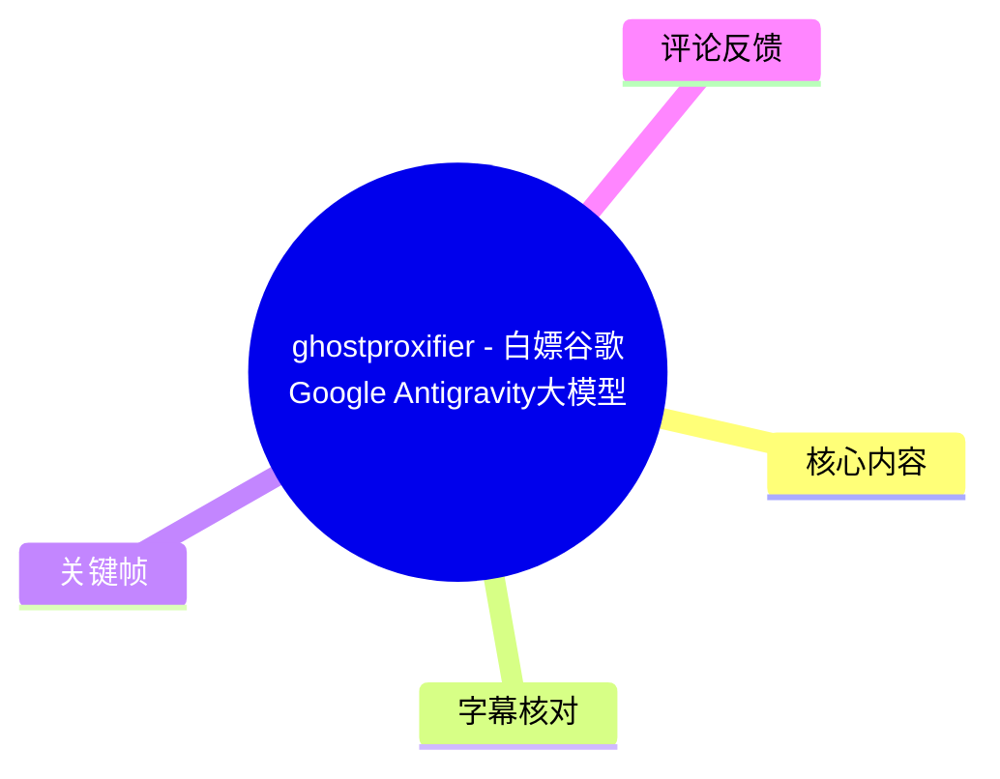
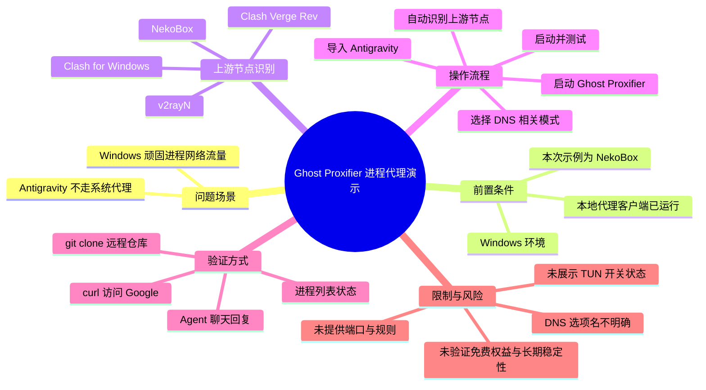
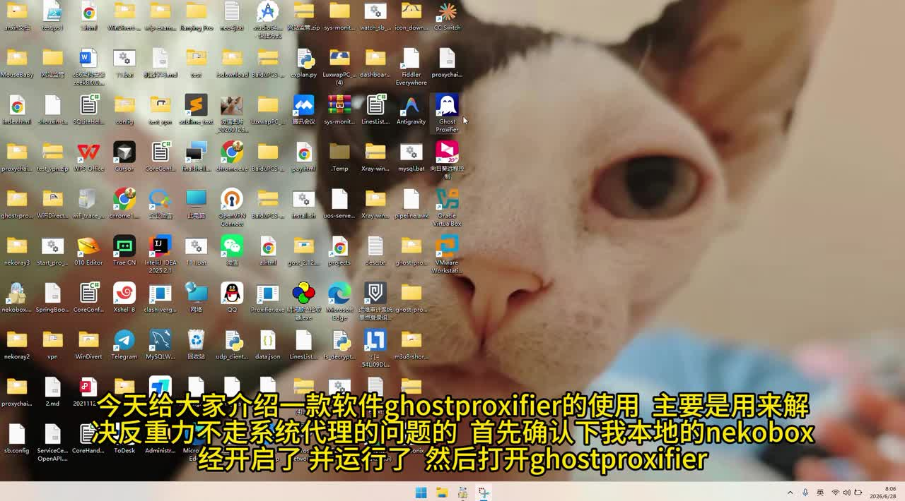
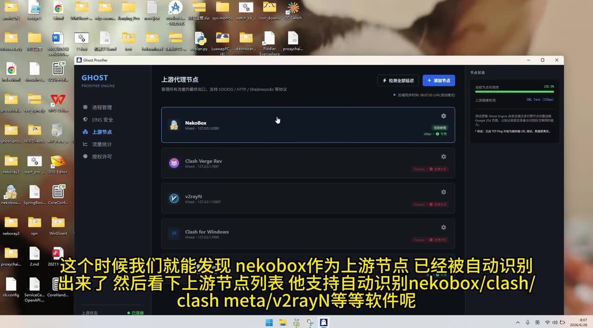
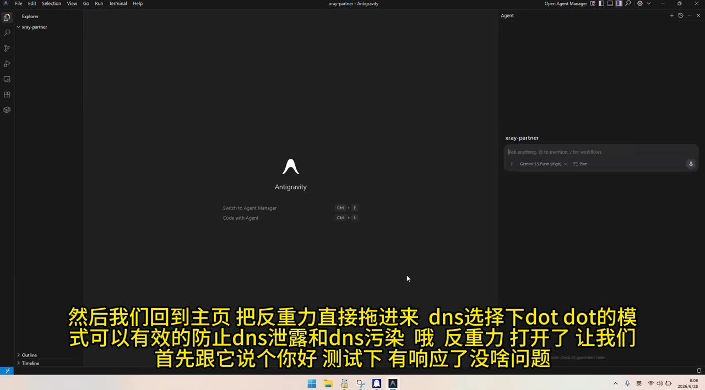
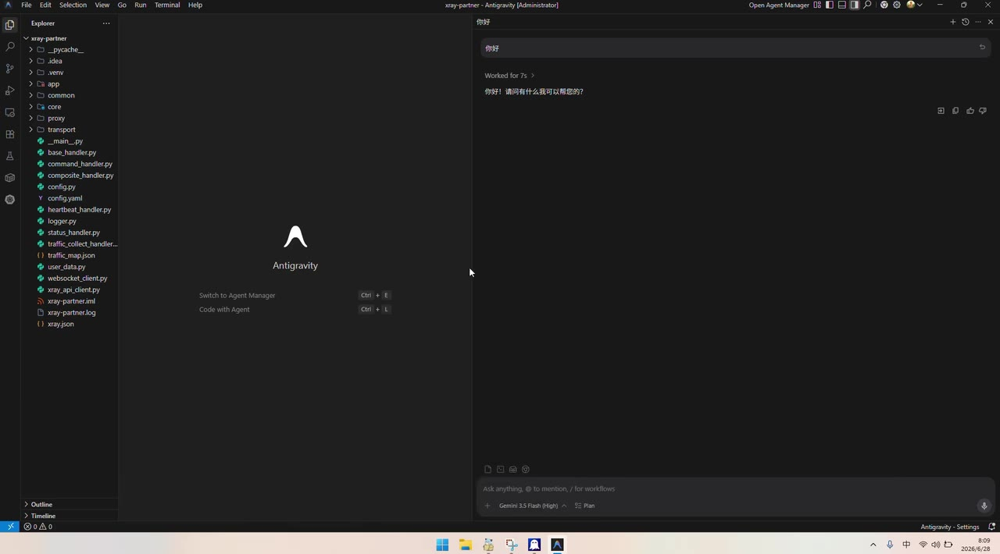

# ghostproxifier - 白嫖谷歌Google Antigravity大模型，不用开启Tun代理模式

> 来源：[Bilibili 视频](https://www.bilibili.com/video/BV1TkTP61Eyb)  
> UP 主：啦啦啦啦啦不要扣屁股｜合集：AIcode｜时长：4 分 56 秒  
> 视频简介中的项目地址：[liliBestCoder/ghost-proxifier-pro](https://github.com/liliBestCoder/ghost-proxifier-pro)

## 小结

视频演示 Windows 工具 **Ghost Proxifier（界面标识为 GHOST PROXIFIER ENGINE）** 的基本用途：当 Antigravity IDE 等程序不遵循系统代理时，将目标程序交给 Ghost Proxifier 按进程处理，再复用本机正在运行的代理客户端作为上游节点。视频以 NekoBox 为实际示例，演示了自动识别上游代理、导入 Antigravity、进行 DNS 相关设置及启动后的网络验证。

UP 主的核心方法是：先确认本地 NekoBox 已启动，再打开 Ghost Proxifier；工具界面自动识别到 NekoBox，并列出 Clash Verge Rev、v2rayN、Clash for Windows 等候选客户端。随后将 Antigravity 拖入工具管理，选择一个被口述为“dot dot”的 DNS 模式，最后以聊天回复、访问 Google 和 Git 克隆远程仓库验证连通性。

视频对“动态注入”或进程接管的说明是：可在进程列表中直接观察被处理的进程状态，而不必只依赖错误日志判断。需要注意的是，素材没有给出 Ghost Proxifier 的版本号、上游代理端口、具体协议、规则配置、管理员权限要求、完整 DNS 选项名称或故障日志，因此不能将演示结果扩展为所有设备和版本均可直接复现的保证。

标题中的“白嫖 Google Antigravity 大模型”是 UP 主的标题表述。视频画面可确认 Antigravity 界面中存在模型选择器，且录制时可见 “Gemini 3.5 Flash (High)”；但素材未展示账户权益、订阅页面、官方价格、地区资格或服务条款。本文不据此认定模型永久免费、所有用户均可使用，或可以规避任何服务限制。

适合阅读本文的人群包括：已经具备可用本地代理客户端、遇到某个 Windows 应用不走系统代理、希望尝试进程级代理接管的用户。使用时仍应遵守服务条款、所在地区法律、组织网络规范及代码仓库访问权限要求。

## 思维导图

## 目录

- [背景、目标与适用边界](#背景目标与适用边界)
- [准备上游代理并自动识别节点](#准备上游代理并自动识别节点)
- [导入 Antigravity 与 DNS 设置提示](#导入-antigravity-与-dns-设置提示)
- [连通性、进程状态与动态注入验证](#连通性进程状态与动态注入验证)
- [Google 访问与 Git 克隆测试](#google-访问与-git-克隆测试)
- [可复用步骤与参数清单](#可复用步骤与参数清单)
- [结论、限制与时效性](#结论限制与时效性)
- [字幕比对](#字幕比对)
- [评论分析](#评论分析)
- [处理记录](#处理记录)

## 背景、目标与适用边界 [00:00](https://www.bilibili.com/video/BV1TkTP61Eyb?t=0)

视频开场将问题描述为：**Antigravity 不走系统代理**。UP 主给出的解决路径不是在 Antigravity 内手动填写代理地址，而是使用 Ghost Proxifier 对指定应用进行进程级网络处理，使其流量转发至已经运行的本地上游代理。

从标题及视频口述看，UP 主强调“不用开启 TUN 代理模式”。严谨地说，素材能够确认的是：**视频演示流程中没有展示开启 TUN 的步骤**。这可以说明该录制环境下，UP 主通过 Ghost Proxifier 完成了进程级处理；但不能证明任意应用、任意协议或任意网络环境都不需要 TUN 模式。

> 图：开场桌面同时可见 Antigravity 与 Ghost Proxifier 图标，画面字幕明确说明“解决反重力不走系统代理的问题”。该帧用于界定视频的实际目标：处理特定应用未遵循系统代理的情况，而不是讲解通用代理搭建。

视频画面中的 Antigravity 是 IDE 风格界面，右侧有 Agent 对话区域。录制画面可见模型下拉位置出现 “Gemini 3.5 Flash (High)” 字样，但这仅代表该录制时的可见界面状态，不代表所有账号、地区、版本或时间点均可使用该模型。

### 视频未能证明的结论 [00:12](https://www.bilibili.com/video/BV1TkTP61Eyb?t=12)

以下结论均超出素材证据范围，不能由本视频直接推出：

- 所有 Windows 应用均可被 Ghost Proxifier 接管；
- Antigravity 的全部子进程、内嵌组件或更新进程都会被覆盖；
- 不启用 TUN 模式一定优于启用 TUN 模式；
- DNS 设置后一定不会发生 DNS 泄漏；
- Google Antigravity 或 Gemini 模型对所有人永久免费；
- 不同代理客户端、不同版本及不同网络环境均可自动识别并稳定工作。

## 准备上游代理并自动识别节点 [00:20](https://www.bilibili.com/video/BV1TkTP61Eyb?t=20)

UP 主首先要求确认本机的 **NekoBox** 已经启动并正常运行。这是视频演示的前置条件：Ghost Proxifier 不是独立提供外网出口的工具，而是将目标程序流量交给一个已经可用的本地上游代理处理。

打开 Ghost Proxifier 后，视频展示“上游代理节点”页面。界面将 NekoBox 识别为可用节点；下方列表还可见其他可被识别的代理客户端。根据关键帧可见信息整理如下：

| 画面可见名称 | 视频中的角色 | 素材可确认的信息 |
| --- | --- | --- |
| NekoBox | 本次演示使用的上游客户端 | 被自动识别，界面显示为当前可用 |
| Clash Verge Rev | 候选代理客户端 | 出现在自动识别列表 |
| v2rayN | 候选代理客户端 | 出现在自动识别列表 |
| Clash for Windows | 候选代理客户端 | 出现在自动识别列表 |

> 图：该帧直接展示 Ghost Proxifier 的“上游代理节点”页面：NekoBox 处于可用状态，列表中同时出现 Clash Verge Rev、v2rayN 与 Clash for Windows。它是“先运行本地代理、再由工具自动识别”的主要画面依据。

站内字幕口述还提到 “Clash Meta”。不过，关键帧中清楚可读的是 Clash Verge Rev、v2rayN、Clash for Windows；因此本文将 Clash Meta 视为字幕补充信息，不将其扩展为已验证的完整兼容性清单。

### 关键前置条件与缺失参数 [00:45](https://www.bilibili.com/video/BV1TkTP61Eyb?t=45)

视频确认的前置条件只有“本地代理客户端已经运行”。以下实际配置细节未在素材中披露：

| 项目 | 视频是否提供 | 说明 |
| --- | --- | --- |
| 本地监听地址 | 未提供 | 未显示 `127.0.0.1`、局域网地址或其他监听地址 |
| 上游端口 | 未提供 | 无法据此填写 SOCKS、HTTP 等端口 |
| 上游协议 | 未提供 | 界面顶部说明支持 SOCKS5、HTTP、Shadowsocks 等，但未展示本次实际使用协议 |
| 代理规则 | 未提供 | 未展示规则优先级、绕过名单或分流策略 |
| 管理员权限要求 | 未明确 | Antigravity 后续标题栏可见 `[Administrator]`，但 Ghost Proxifier 是否需要管理员权限未被明确说明 |
| 手动添加节点方法 | 未提供 | 视频只展示自动识别，不提供手动填写教程 |

因此，若用户本机无法识别 NekoBox 或其他客户端，不能依据视频猜测端口或协议，应以项目仓库的最新文档和实际软件界面为准。

## 导入 Antigravity 与 DNS 设置提示 [00:58](https://www.bilibili.com/video/BV1TkTP61Eyb?t=58)

UP 主接着回到 Ghost Proxifier 的主页面，将 Antigravity “直接拖进来”。这一动作说明工具的使用方式是把目标程序纳入管理，而不是要求用户在 Antigravity 设置页中输入代理服务器。

随后，UP 主口述“DNS 选择下 dot dot 的模式”，并认为其可以“有效防止 DNS 泄漏和 DNS 污染”。关键帧字幕同样写作“dot dot”，但未展示 DNS 下拉菜单、协议名称、DNS 服务器或端口。

> 图：画面显示 Antigravity IDE 主界面，并保留“把反重力直接拖进来”“dns 选择下 dot dot 的模式”的字幕。该帧有助于理解导入目标程序与 DNS 设置在操作顺序上相邻，但未显示具体 DNS 选项，因此不能据此确认配置名称或协议。

### DNS 信息的可靠边界 [01:10](https://www.bilibili.com/video/BV1TkTP61Eyb?t=70)

两份字幕对 DNS 术语的识别均不稳定：

- 站内字幕：`Dota Dota`
- 本次 ASR：`DALT`、`Dot`
- 关键帧字幕：`dot dot`

结合上下文，能确认的是 UP 主建议选择一项 DNS 保护或加密 DNS 相关模式；但无法仅凭现有素材确认它究竟是 DoT、DoH、软件内预设名称，或其他模式。

因此，以下内容应保留为不确定项：

- DNS 模式的完整英文名称；
- 采用的具体 DNS 协议；
- DNS 服务器地址；
- DNS 端口；
- IPv4、IPv6 与系统解析的处理策略；
- 是否能够在所有网络路径下避免 DNS 泄漏。

“可防 DNS 污染和泄漏”是视频中的主张，不构成完整安全审计结论。

## 连通性、进程状态与动态注入验证 [01:30](https://www.bilibili.com/video/BV1TkTP61Eyb?t=90)

启动 Antigravity 后，UP 主先在右侧 Agent 面板发送“你好”进行简单测试，随后获得回复，并据此判断网络没有问题。这是应用层的基础可用性检查：至少说明录制时该 Antigravity 实例可以完成一次对话交互。

> 图：右侧 Agent 面板中，用户输入“你好”后出现回复“你好！请问有什么我可以帮您的吗？”。该帧是视频中最直观的连通性结果，但只能证明该时刻的一次服务请求成功，不能代表所有模型调用、插件请求或文件操作均稳定可用。

随后，UP 主提到 Ghost Proxifier 的“进程列表”，表示可以直接看到许多进程已被处理。两份字幕对该术语识别存在明显错误：

- 站内字幕出现“hold hold住”；
- 本次 ASR 出现“后刻住”“被吓住”等无意义转写。

结合“进程列表”“不用看错误日志”“动态注入”等上下文，较稳妥的解释是：UP 主在说明工具可显示目标进程是否被接管、注入或拦截。由于所给关键帧未包含该进程列表页面，本文不强行确定其状态标签的准确英文原词。

### 验证结果应如何理解 [01:52](https://www.bilibili.com/video/BV1TkTP61Eyb?t=112)

| 验证项 | 视频现象 | 可以支持的判断 | 不能支持的判断 |
| --- | --- | --- | --- |
| Agent 问候测试 | “你好”获得回复 | 录制时基础对话请求成功 | 所有模型和请求均可稳定使用 |
| 进程列表 | UP 主称可直接查看进程状态 | 工具具备面向进程的可视化观察能力 | 所有子进程都已被完整覆盖 |
| Google 访问 | UP 主称访问成功 | 演示环境中存在一次外部访问测试成功 | 所有域名、协议、地区均可访问 |
| Git 克隆 | UP 主称克隆完成 | 演示环境中存在一次仓库访问成功 | 大仓库、私有仓库、SSH 协议都可用 |

## Google 访问与 Git 克隆测试 [02:00](https://www.bilibili.com/video/BV1TkTP61Eyb?t=120)

在基础聊天测试后，UP 主让 Antigravity 使用 `curl` 访问 Google。字幕中对此命令的识别不稳定：站内字幕写作“cl”，ASR 写作“CUR”，但结合“访问一下谷歌”的技术语境，本文将其整理为 `curl` 测试。

视频中，UP 主先表示请求已经成功，但尚未看到响应内容；随后继续要求 Antigravity 输出“响应内容”，并表示获得了回复。该过程用于验证目标 IDE 运行环境中的实际网络请求能力。

接下来，UP 主让 Antigravity 使用 Git 克隆远程仓库。ASR 将其误写为“gate clone”，站内字幕也有口语化缺失；结合“克隆远程仓库”“项目中已经有文件夹”等上下文，应校正为 `git clone`。UP 主称克隆速度较快，并确认项目目录中已出现文件夹。

视频未提供以下信息：

- `curl` 的完整命令；
- 访问的 Google 具体 URL；
- HTTP 状态码、响应头或响应正文；
- Git 仓库 URL；
- `git clone` 使用 HTTPS 还是 SSH；
- 克隆耗时、仓库大小、提交哈希；
- 命令行完整输出或错误日志。

因此，准确表述应为：**视频展示了由 Antigravity 发起 Google 访问与 Git 克隆的测试，并由 UP 主判断其成功；但没有给出可逐字复现的命令和参数。**

## 可复用步骤与参数清单 [00:00](https://www.bilibili.com/video/BV1TkTP61Eyb?t=0)

以下流程严格按视频叙述顺序整理。未出现的配置不补造参数。

1. **在 Windows 中启动本地代理客户端。**  
   视频示例使用 NekoBox。先确认其已开启并运行。

2. **打开 Ghost Proxifier。**  
   进入“上游代理节点”页面，检查工具能否自动识别正在运行的本地代理客户端。

3. **确认可用的上游节点。**  
   视频中 NekoBox 被识别为可用。界面还列出 Clash Verge Rev、v2rayN、Clash for Windows 等候选客户端。

4. **将 Antigravity 导入或拖入 Ghost Proxifier。**  
   UP 主口述为“把反重力直接拖进来”。素材未展示目标可执行文件路径、导入规则名或文件选择对话框。

5. **选择 DNS 相关模式。**  
   视频口述为“dot dot”模式，主张其可降低 DNS 污染和泄漏风险。  
   **注意：** 该模式完整名称不明，不能据此填写 DNS 地址、端口或协议。

6. **启动 Antigravity。**  
   视频中 Antigravity 正常打开，右侧 Agent 面板可供输入提示。

7. **进行基础对话测试。**  
   发送“你好”，确认获得回复，以验证最基础的服务连通性。

8. **查看 Ghost Proxifier 的进程列表。**  
   按 UP 主说法，可据此确认相关进程是否已被工具处理，而非只依赖错误日志。

9. **进行实际网络任务测试。**  
   视频依次测试：
   - 通过 `curl` 访问 Google；
   - 要求显示响应内容；
   - 使用 `git clone` 克隆远程仓库。

### 视频中明确或可见的参数

| 参数项 | 素材内容 | 可靠性说明 |
| --- | --- | --- |
| 系统环境 | Windows 桌面环境 | 可由任务栏和桌面画面确认 |
| 目标工具 | Ghost Proxifier | 标题、桌面图标及软件界面均可见 |
| 目标程序 | Antigravity IDE | 视频直接操作该 IDE |
| 上游示例 | NekoBox | 画面显示自动识别并可用 |
| 候选客户端 | Clash Verge Rev、v2rayN、Clash for Windows | 由上游节点列表可见 |
| DNS 设置 | “dot dot”相关模式 | 完整名称、协议和参数未确认 |
| Google 测试 | `curl` 访问 Google | 命令细节和输出未提供 |
| 仓库测试 | `git clone` | 仓库地址、协议与日志未提供 |
| TUN 模式 | 未展示开启步骤 | 仅能说明视频流程未包含该步骤 |

## 结论、限制与时效性 [04:25](https://www.bilibili.com/video/BV1TkTP61Eyb?t=265)

视频的可迁移经验是：对于 Windows 中不遵循系统代理的特定程序，可以尝试使用 Ghost Proxifier 一类进程级工具，将目标程序流量接入已经运行的本地上游代理。UP 主在 Antigravity 环境中完成了基础聊天、Google 访问及 Git 克隆验证，说明该录制环境下流程能够工作。

但“自动识别”“开箱即用”“不需要 TUN”应被理解为 UP 主演示环境中的体验，而不是普遍承诺。实际结果会受到上游代理状态、端口与协议、权限、系统安全软件、防火墙、IPv6、DNS、目标程序更新、子进程机制和网络策略等因素影响。

### 时效性说明

- 视频元数据发布时间对应 **2026-06-28**；内容反映的是该录制时的 Windows、Ghost Proxifier 与 Antigravity 界面状态。
- Ghost Proxifier 项目的版本、兼容客户端、安装方式、许可证、安全策略及维护状态可能变化。
- Antigravity 的产品形态、模型列表、地区支持、账户资格、额度、价格和服务条款都可能变化。
- 视频标题中的“白嫖”未获得账户权益页面或官方公告佐证，不能作为免费资格或长期可用性的依据。
- 使用前应以项目仓库最新 README、Release、Issue、许可证及相关服务官方条款为准。

### 使用风险与边界

- 仅应在有权使用的账户、服务、网络和代码仓库中进行代理配置。
- 进程接管工具可能需要额外权限，并可能受企业终端管控、杀毒软件或应用自我保护机制影响。
- DNS 防护功能不能替代完整隐私审计；仍需关注系统解析、IPv6、代理节点日志、IDE 插件权限及仓库凭据。
- 视频未提供完整排障日志。若无法连接，应依次核对上游代理是否可用、目标程序是否已正确导入、进程状态、DNS 路径及防火墙策略。

## 字幕比对 [00:00](https://www.bilibili.com/video/BV1TkTP61Eyb?t=0)

本任务中**存在 Bilibili 站内字幕，且本次 ASR 已执行**。两份字幕均覆盖开场介绍、上游节点识别、DNS 设置、聊天测试、Google 访问、Git 克隆及项目结尾，但均在软件名、英文命令和进程术语上存在明显误识别。

本文采用的策略是：**以站内字幕的叙述顺序为主，使用本次 ASR 交叉补充，并以视频标题、项目地址、关键帧中可见界面文字和技术上下文校正专有名词。**

| 字幕来源 | 完整性 | 专有名词质量 | 时间轴 | 主要问题 |
| --- | --- | --- | --- | --- |
| Bilibili 站内字幕 | 覆盖完整，包含开场、配置、测试及结尾 | 相对较好，但将 Ghost Proxifier 写为“ghost profile”“ghost profeprofessor”，NekoBox 写为“ngo boos” | 提供的是无逐句时间戳的文本 | `curl`、`git clone`、进程状态与 DNS 名称识别不稳定 |
| 本次 ASR 字幕 | 覆盖大部分内容，尾部存在重复和截断 | 误识别较多，如“GhostProfile”“GhostProfessor”“LycoBogos”“反动力”“CUR”“gate clone” | 提供的是无逐句时间戳的文本 | 中英文混合术语、产品名与技术命令错误较多 |

### 关键术语校正

| 最终写法 | 校正依据 | 说明 |
| --- | --- | --- |
| Ghost Proxifier | 视频标题、桌面图标、软件窗口标题、项目链接 | 两份字幕均有不同程度误识别 |
| Antigravity | 视频标题、桌面图标、IDE 界面 | 字幕中的“反重力”“反中立”“反动力”均统一校正 |
| NekoBox | 上游节点界面可见文字 | 站内字幕“ngo boos”、ASR“LycoBogos”不准确 |
| Clash Verge Rev | 上游节点界面可见文字 | 以关键帧为准 |
| v2rayN | 上游节点界面可见文字 | 以关键帧为准 |
| `curl` | “访问 Google”的技术语境 | ASR 的“CUR”及站内字幕“cl”均不稳定 |
| `git clone` | “克隆远程仓库”的技术语境 | ASR 写为“gate clone” |
| 进程接管/注入状态 | “进程列表”“动态注入”“不必看错误日志”的上下文 | 无法可靠还原 UP 主所说状态词的精确英文标签 |
| “dot dot”DNS 模式 | 站内字幕、ASR 与关键帧字幕均不一致 | 不强行校正为 DoT 或 DoH，保留不确定性 |

## 评论分析 [00:00](https://www.bilibili.com/video/BV1TkTP61Eyb?t=0)

以下仅分析任务中可获取的热评前三条。评论属于个人观点或经验补充，不能替代独立验证。

1. **bili_25969775612（4 赞）**  
   评论认为 Proxifier 可能“更简便”，并称可以向 AI 获取序列号。前半部分提供了一个替代工具比较方向：Ghost Proxifier 与 Proxifier 的配置成本、兼容性和授权方式或许值得进一步对照；但视频没有进行两者对比，评论也没有给出操作步骤或测试环境，因此无法验证。后半部分涉及序列号获取，可能与绕过软件授权有关，不应作为合法使用建议。

2. **语过添情Sola（2 赞）**  
   评论称“Antigravity 2.2.1 没用，Antigravity IDE 有用”。这提示相近名称的不同产品、版本或发行形态可能存在差异。视频实际展示的是 Antigravity IDE 风格界面，与该评论所称“Antigravity IDE 有用”在对象上相符；不过评论没有提供版本来源、网络环境、报错表现和测试方法，不能推导为通用兼容性结论。

3. **BRS梦幻佼佼者（0 赞）**  
   评论内容是对 UP 主作品的正向评价和互关请求，没有提供配置参数、工具性能、兼容性或风险信息，因此不纳入技术结论。

## 处理记录 [00:00](https://www.bilibili.com/video/BV1TkTP61Eyb?t=0)

- Worker ID：`worker-mrj0www4-e8d79408`
- 模型：`gpt-5.6-terra`
- 调用工具与素材：依据任务提供的视频元数据、素材清单、站内字幕、本次 ASR 字幕、关键帧路径和热评 JSON 整理；素材清单显示已生成 `merged.mp4`、`audio/audio.wav`、`frames/`、`subtitles/`、`asr/` 与 `comments/comments.json`。
- 使用的处理能力：视频素材读取、音频转写结果读取、站内字幕读取、关键帧比对、热评读取与结构化知识整理。
- 字幕选择：站内字幕与本次 ASR 均已比较。正文以站内字幕的内容顺序为主，用 ASR 交叉核对；Ghost Proxifier、Antigravity、NekoBox、Clash Verge Rev、v2rayN、`curl`、`git clone` 等名称通过标题、项目链接、关键帧可见文字和上下文校正。DNS 模式名称证据不足，保留“dot dot”口述及不确定性。
- 关键帧选择依据：
  - `frames/frame-001.jpg`：开场展示问题背景，以及 Antigravity 与 Ghost Proxifier 的桌面图标；
  - `frames/frame-002.jpg`：直接展示上游代理节点自动识别和候选客户端列表；
  - `frames/frame-003.jpg`：对应将 Antigravity 纳入管理及 DNS 设置口述；
  - `frames/frame-004.jpg`：展示 Antigravity 收到“你好”后的响应，是基础连通性证据。
- 热评处理范围：仅处理可获取热评前三条，未扩展分析其他评论。
- 缓存清理：任务素材未提供缓存清理日志或清理结果，无法确认执行环境是否已清理缓存；本文如实标记为未确认。
- 未解决问题：
  - Ghost Proxifier 的具体版本、安装来源、许可证及安全审计信息未提供；
  - DNS 模式的完整名称、协议、服务器与端口未提供；
  - 上游代理实际使用的端口、协议、节点来源和规则未提供；
  - Antigravity 的免费资格、模型可用性、地区限制及服务条款未独立验证；
  - 评论中提到的 Proxifier 对比与 Antigravity 版本差异未作独立复现验证。

## 评论分析

本次流程未获取到可用热评，因此不推断观众态度或额外结论。
