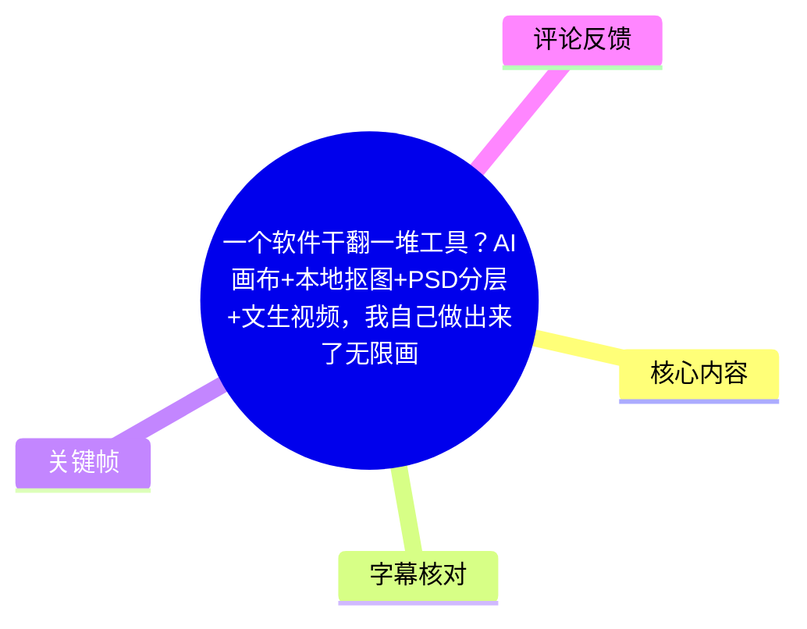
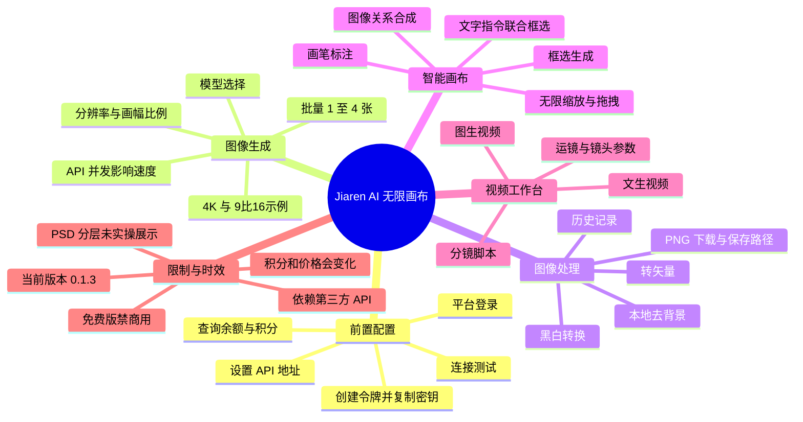
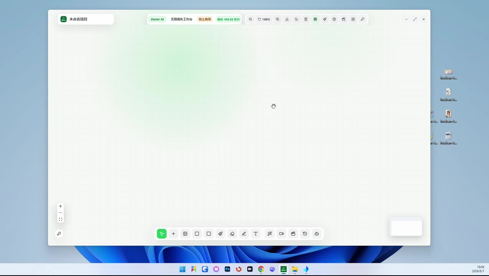
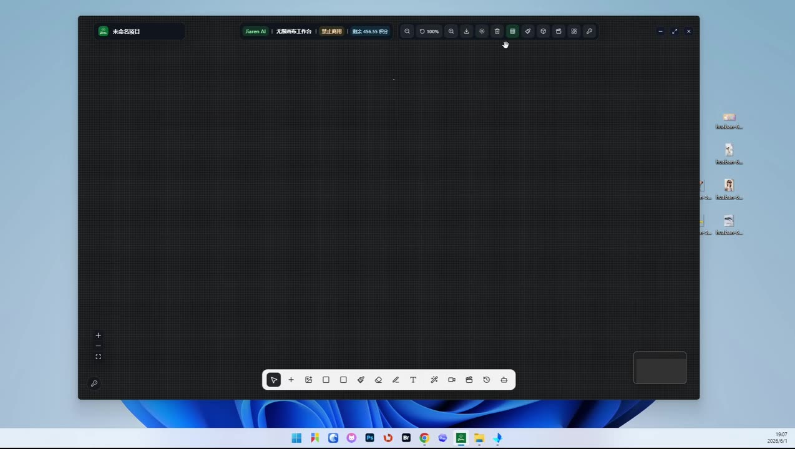
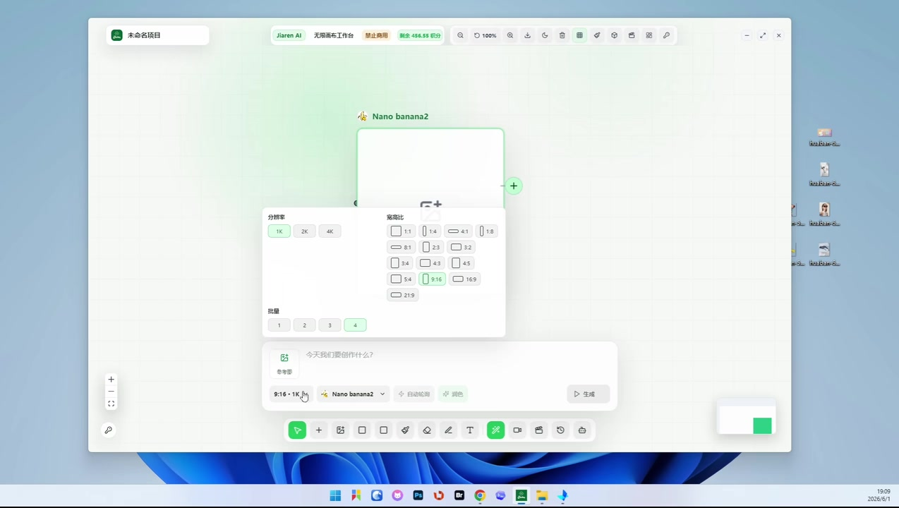
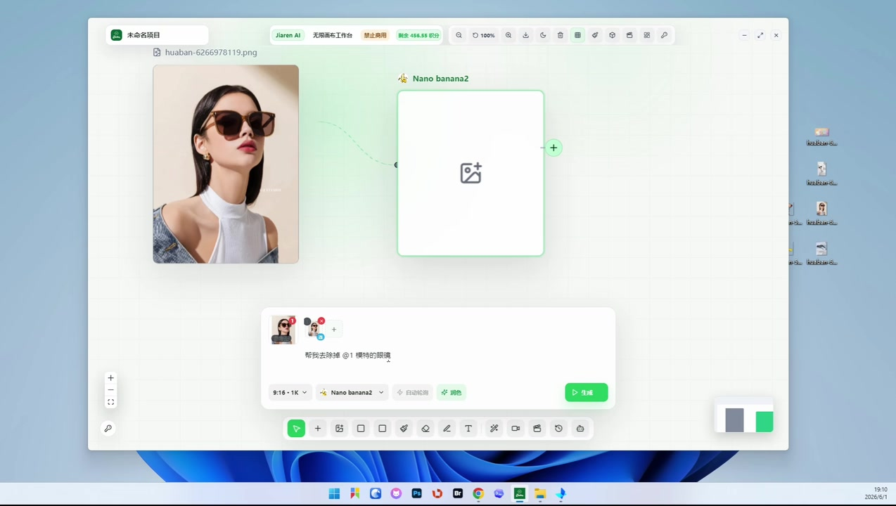

# 一个软件干翻一堆工具？AI画布+本地抠图+PSD分层+文生视频，我自己做出来了无限画布，兼容所有API平台

> 来源：[Bilibili 视频](https://www.bilibili.com/video/BV1deVo6pEhD) 
> UP 主：嘉仁生活日记｜时长：19 分 37 秒｜合集：AIcode  
> 视频简介提供的软件为「Jiaren AI 无线画布」免费版，并标注**禁商用**；下载链接、提取码及可用性应以视频简介和发布者后续说明为准。

## 小结

这是一支对「Jiaren AI 无线画布」桌面软件的功能演示。作者将它定位为一个把 AI 生图、改图、本地抠图、图片转矢量、历史素材管理、智能画布及视频工作台放在同一无限画布中的工具；其模型能力依赖用户自行配置的 API，而非软件本身离线提供生成模型。

使用的首要前置条件是完成 API 配置：进入设置填写 API 地址，随后在所使用的平台创建令牌、复制密钥、粘贴回软件并做连接测试。作者还演示了余额/积分查询，说明生图和视频生成会受第三方 API 的账户余额、模型价格、并发和服务状态影响。

生图部分的核心经验是：首次使用时应重点检查**批量数、分辨率和画幅比例**。视频明确提示，批量默认可能为 4；设置为 1、2、3、4 分别会生成对应数量的图片。作者演示的 9:16、4K 生成结果为 3000×5000 像素，并提示部分标有“官方”的模型测试成本可能约为 100 积分，建议使用前先确认价格。

软件的本地处理能力包括右键去背景、下载 PNG、设置保存目录、转矢量与黑白转换。作者称去背景在本地执行，但首次启动该能力时可能短暂卡顿；导出的 PNG 像素取决于原始图像尺寸，演示案例为 1200×2000。视频没有展示 PSD 文件导入、图层读取或 PSD 导出过程，因此“PSD 分层”仅能确认是作者在开场列举的功能宣称，不能据此推断其格式兼容范围或实际工作流。

智能画布是本视频最具操作性的部分：用户可以拖入多个素材、调整前后层次、用画笔和箭头做视觉标注，再框选素材与标注后调用模型生成。它既能在不输入文字的情况下根据图像关系合成内容，也支持添加文字指令；但文字对象必须与相关图片、选区一起框选，才会进入生成上下文。

视频工作台支持文本生成、图片生成、分镜生成与扩展/演写，并可插入图片和视频、选择 API 支持的模型、设置运镜、镜头类型、柔光、画幅、清晰度和时长。不过，作者没有展示一次完整视频任务的生成结果，也未给出视频模型、价格或时长参数的明确数值。

工具版本具有明显时效性：视频结尾称当前为 **0.1.3**，并表示会持续更新；模型列表、积分价格、第三方 API 兼容性、软件功能及下载资源均可能变化。对希望搭建多模型视觉工作流的用户，本视频可作为界面与操作入口参考；实际用于生产前，仍应自行验证 API 平台、模型授权、费用、素材版权与“禁商用”限制。

## 思维导图

## 目录

- [产品定位、界面与前置条件](#产品定位界面与前置条件)
- [配置 API、令牌与账户余额](#配置-api令牌与账户余额)
- [生图节点：模型、批量、分辨率与生成](#生图节点模型批量分辨率与生成)
- [无限画布与生成历史](#无限画布与生成历史)
- [本地抠图、下载与矢量转换](#本地抠图下载与矢量转换)
- [视频工作台与分镜能力](#视频工作台与分镜能力)
- [智能画布：视觉标注驱动的图片编辑](#智能画布视觉标注驱动的图片编辑)
- [文字指令、素材替换与画布操作](#文字指令素材替换与画布操作)
- [功能边界、限制与时效性](#功能边界限制与时效性)
- [字幕比对](#字幕比对)
- [评论分析](#评论分析)
- [处理记录](#处理记录)

## [产品定位、界面与前置条件](https://www.bilibili.com/video/BV1deVo6pEhD?t=1)

作者开场介绍的是一款自行“手搓”的 AI 画布，列举的功能包含：

- 生图与改图；
- 视频生成；
- 抠图；
- PSD 分层；
- 无限画布式创作空间。

这里需要区分**功能宣称**与**视频实证**：视频后续实际演示了生图、画布编辑、本地去背景、转矢量、历史记录、视频工作台和智能画布；PSD 分层虽在开场被提及，但没有看到 PSD 文件的导入、图层编辑、保存或导出步骤。因此不能仅凭标题和开场，推断该软件完整支持 Photoshop 的图层结构、混合模式、智能对象或 PSD 往返编辑。

软件以无限画布作为主界面，作者展示了亮色和暗色两种外观，网格可保留或关闭。画面顶部还能看到软件名称及“禁止商用”标识，这与视频简介中的“免费版 / 禁商用”表述相互对应。

> 图：亮色主题下的空白无限画布。底部集中放置选择、添加、画笔、文字、视频等工具，左侧有缩放控件。这张图用于理解软件的基本工作区布局与“无限画布”交互形式。

> 图：暗色主题与网格背景示例。它直接佐证视频所述的亮/暗界面调整与网格可见性设置，而非仅靠字幕描述。

### 使用前的必要认识

1. **生成能力依赖 API。** 作者说明 API 地址关系到后续模型调用，意味着软件更像工作流和画布层；模型可用性、响应速度、计费方式并不完全由该软件决定。
2. **需要账户余额或积分。** 右上角查询功能会显示账户余额和积分，作者将积分直接视为余额。
3. **模型支持范围取决于 API。** 作者多次以“API 支持的模型”为条件说明可测试的模型，因此“兼容所有 API 平台”是标题表述，视频本身并未逐一验证所有平台。
4. **免费不等于可商用。** 视频简介明确写有“禁商用”，若用于客户项目、商品图或商业视频，应另行向发布者确认授权范围。

## [配置 API、令牌与账户余额](https://www.bilibili.com/video/BV1deVo6pEhD?t=36)

作者按以下顺序完成连接配置：

1. **安装后进入设置。** 打开软件设置，找到 API 地址；该地址用于后续模型调用。
2. **打开对应 API 平台的网站并登录。** 视频仅说可通过 Google 或其他方式登录，没有明确平台名称。
3. **进入令牌管理。** 找到“创建令牌”，名称可以自行填写。
4. **保持其他选项默认。** 作者称若没有明确不想使用的模型，通常可保持默认留白；这段原话的界面字段识别不够清晰，建议实际操作时以平台字段说明为准。
5. **创建并复制密钥。** 创建后界面会显示密钥名称、启用状态、创建日期与过期日期；点击复制密钥。
6. **回到软件粘贴密钥并测试连接。** 可任意选一个模型进行连接测试；查询显示可用，即表示该连接环节正常。
7. **查询余额/积分。** API 配好后，可通过右上角查询按钮查看账户余额和积分，再开始生成任务。

### 安全与排错建议

- API 密钥是敏感凭据。视频展示“复制—粘贴—测试”流程，但没有说明密钥存储机制；不要在截图、录屏、公开项目文件或共享画布中暴露完整密钥。
- 若测试失败，应优先检查 API 地址、令牌有效期、账户余额、模型权限和平台服务状态。
- “查询可用”只表示当时某模型能连通，不等于全部模型均可用，也不保证后续调用一定成功。
- 视频中“令牌”“密钥”等词在 ASR 里存在较多错字，本文按站内字幕和上下文统一为“令牌 / 密钥”。

## [生图节点：模型、批量、分辨率与生成](https://www.bilibili.com/video/BV1deVo6pEhD?t=171)

工具栏中包含生图、视频、脚本视频、历史和对话等入口；“对话”被作者描述为可自由选择模型的对话能力。进入生图模式后，用户可选择不同模型。作者口述了“香蕉”和“GPT2”等名称，但这些并非可从字幕可靠确认的标准官方模型名；关键帧界面显示为 **Nano banana2**，因此本文保留“香蕉 / Nano banana2”为视频中的展示称呼，不将其扩展解释为特定厂商模型。

### 模型费用提醒

作者特别提示，界面中标有“官方”的某些模型在其测试中较贵，“可能需要到 **100 个积分**”，建议尽量避开。这个数字是作者当时的测试经验，而非固定官方定价；实际扣费应以所接入 API 平台的实时价格为准。

### 生成参数与数量规则

生图前应检查以下三项：

| 参数 | 视频说明 | 实操意义 |
| --- | --- | --- |
| 批量 | 首次使用时可能默认为 4 | 直接影响单次生成张数和可能的积分消耗 |
| 批量 1 | 输出 1 张 | 适合先低成本验证提示词或构图 |
| 批量 2 / 3 / 4 | 分别输出 2 / 3 / 4 张 | 增加候选图，但也可能成倍增加费用 |
| 分辨率 | 可选择如 4K | 生成前确认，以避免不必要的高成本或低清结果 |
| 画幅比例 | 如 9:16、16:9 | 应与短视频、横版封面等成品用途匹配 |

> 图：Nano banana2 生图节点的参数面板，画面能看到 1K、2K、4K 分辨率、多个宽高比选项及 1—4 的批量选择。它是理解“先检查批量和画幅”的直接界面依据。

### 图生图 / 引用素材的操作

作者先把一张图片拖入画布，说明也可直接复制、粘贴到画布。之后通过节点上的加号建立连接，将图片接到生图模型；同类方式也可连接到其他模型。

演示中使用一张模特图，并输入“帮我去掉模特的图片”一类指令。作者还提到可以右键“插入引用”，以把图片纳入生成引用。生成前再次确认目标为 4K、9:16，然后点击生成。

> 图：左侧是模特参考图，右侧是 Nano banana2 节点，二者以连线连接；底部提示框写入了去除模特的需求。这张图说明参考图、提示词、模型节点和输出设置如何在画布中组合。

### 生成速度与结果示例

作者明确说明，出图速度取决于 API 调用速度与当时用户数量：

- 使用人数少时，出图可能更快；
- 使用人数多时，出图可能变慢；
- 这属于外部服务的排队/并发因素，而不是画布本地性能的唯一指标。

视频生成完成后，作者展示了一张 **3000×5000 像素**的图片，并将其称为 9:16 结果。需要注意，3000:5000 的数学比例为 3:5，并非严格 9:16；它可被视为视频所见的实际导出尺寸与作者口述目标比例之间存在差异。若交付比例严格，建议自行用像素值复核。

## [无限画布与生成历史](https://www.bilibili.com/video/BV1deVo6pEhD?t=333)

无限画布支持以下基础编辑方式：

- 对画布进行缩小、放大；
- 持续加入图片节点；
- 选中对象后使用键盘 Delete 删除；
- 通过拖拽布置对象；
- 在画布内组合参考图、模型节点、提示词和输出。

作者在等待生成时打开历史记录，称历史区会保留此前生成过的图片，之后再次打开软件仍会展示。这使历史区可作为素材库使用，但视频未解释数据存储在本地还是云端、是否有容量上限、是否支持项目级管理或清理策略。

### 历史记录的用途与删除边界

作者展示的历史记录操作包括：

- 查看当前图片对应的提示词；
- 点击加号，将历史图片发送回画布；
- 下载图片到指定位置；
- 拖拽选择图片；
- 从历史记录中删除或精简条目。

一个重要边界是：**从历史记录删除图片，不会删除已经放在画布上的图片。** 这意味着历史列表和画布实例是分离的对象管理层。整理历史时不必然会破坏当前画布，但仍建议在删除关键素材前确认项目保存状态。

## [本地抠图、下载与矢量转换](https://www.bilibili.com/video/BV1deVo6pEhD?t=406)

生成图片右键后会出现操作栏。作者列举了继续生成、转矢量、去背景等能力，并以另一张图演示去背景，因为此前的图片是人物图。

### 本地去背景流程

1. 在画布中选中目标图片。
2. 右键选择“去背景”。
3. 软件在本地执行抠图。
4. 首次启动该功能可能出现短暂卡顿，作者建议耐心等待。
5. 完成后可查看透明背景结果，并下载原图/结果图。

“本地抠图”是作者的明确口述，但视频没有提供所用本地模型、是否联网下载权重、CPU/GPU 占用、显存门槛、抠图精度或离线可用性等信息。因此只能确认作者将操作描述为本地执行，不能进一步推断性能和隐私保障。

### 下载路径与文件参数

下载前，可进入存储设置并选择下载目录；下载后可打开文件夹查看结果。作者展示的结果为：

| 项目 | 视频展示 |
| --- | --- |
| 文件格式 | PNG |
| 示例像素 | 1200×2000 |
| 尺寸来源 | 取决于此前原始图片的像素大小 |
| 保存位置 | 用户在存储设置中选定的目录 |

这意味着去背景本身不会被视频证明为自动提升分辨率；导出大小应主要受输入图片尺寸影响。

### 图片转矢量与黑白转换

右键还可选择“转矢量”。作者称可调整尺寸，保存后写入所选路径；还可以再次转换为黑白效果。视频未给出：

- 输出矢量的具体格式，如 SVG、EPS、PDF 或其他；
- 路径数量、颜色数、平滑度等矢量化参数；
- 对照片、人像、复杂纹理的质量表现；
- 保存是否保留透明度和原图颜色。

因此该功能适合先用小样测试，再判断是否满足印刷、Logo 或可编辑图形需求。

## [视频工作台与分镜能力](https://www.bilibili.com/video/BV1deVo6pEhD?t=599)

作者将视频生成入口分为“脚本/分镜”工作方式和常规视频生成方式。

### 脚本与分镜模式

脚本模式可以：

- 插入图片；
- 插入视频；
- 选择模型；
- 使用分镜脚本；
- 对接当前 API 支持的模型进行测试。

作者把更复杂的视频制作内容概括为完整规划、风格、创意、生成要求、素材库、定妆、角色和场景等，并提到可以把内容放入画布，以及生成首帧、末帧等操作。视频没有逐项展示这些参数的实际界面、保存结构和生成结果。

### 常规视频生成流程

作者在常规视频入口中列举：

- 文生视频；
- 图生视频；
- 分镜生成；
- 扩展与演写。

以图生视频为例，步骤是：

1. 写入脚本、场景或视频提示词；
2. 插入参考图片；
3. 选择图生视频；
4. 依据需要设置或参考运镜方式、镜头类型、柔光；
5. 选择画幅尺寸、清晰度和时长；
6. 在所接 API 平台查看对应积分扣除和价格；
7. 再执行生成。

视频明确把视频生成的具体积分扣除交给用户到平台自行查看，因此没有提供可复现的固定成本。也没有展示最终成片、生成耗时、失败重试或音频处理，不能把本视频视为完整的视频生成质量评测。

## [智能画布：视觉标注驱动的图片编辑](https://www.bilibili.com/video/BV1deVo6pEhD?t=712)

作者把“智能画布”与前述文字控制型生成做区分：前者允许在画布里自由摆放素材、做图形标注并基于选区生成。其工作逻辑可概括为：

> **素材布局 + 画笔/箭头标注 + 框选范围 + 模型选择 = 一次视觉上下文生成任务**

### 无提示词的视觉关系合成

作者拖入皮卡丘和哆啦 A 梦两个素材，将哆啦 A 梦放在前、皮卡丘放在后；接着使用画笔进行标注，画出加号、问号等符号，再用选择工具将内容框选。之后可以选择“香蕉”或 GPT 类模型并生成。

作者称结果会把两个角色“联合”，并强调此示例不需要输入关键词。这里的经验是：图像的前后层级、位置和标记可成为模型理解目标的一部分。不过，这不意味着任何模型都稳定支持该能力；作者在同一段中出现了报错，并建议遇到问题时先试“香蕉”模型。

### 模特眼镜替换案例

作者进一步演示局部编辑：

1. 用矩形大致框选模特眼镜区域；
2. 用画笔画箭头，指向希望替换的眼镜；
3. 框选两个图片/相关对象；
4. 点击升级/生成图片；
5. 生成后放大检查结果。

作者称没有输入关键词，生成结果已替换眼镜。这说明该系统尝试以区域、箭头和参考素材表达编辑意图。实际使用时，框选范围过大可能影响人脸或周围服装，过小则可能无法提供足够上下文；视频没有展示失败率，因此应以多次试验验证。

### 报错处理经验

在角色合成示例中，作者明确提到“这边可能报错了”，并给出建议：

- 可先尝试“香蕉”模型；
- 其他用户未必一定会出现相同问题。

这是一条实际操作中的限制信号：画布层可发起生成，并不代表所有所选模型都能无误理解视觉标注、接受相同输入格式或稳定完成任务。

## [文字指令、素材替换与画布操作](https://www.bilibili.com/video/BV1deVo6pEhD?t=861)

智能画布除纯视觉标注外，也支持文字对象作为指令。作者强调文字不是在常规生成输入框中单独提交，而是放到画布中，与目标素材和规划矩形一起框选后再生成。

### 文字控制的标准步骤

1. 在画布添加文字对象。
2. 写明具体需求，例如让模型调整某个眼镜、增加某物。
3. 放置或拖入相关图片。
4. 用矩形/选择工具将**文字、图片和目标区域一起框选**。
5. 选择模型后执行生成。
6. 等待右下角提示生成结果已放入画布。

关键点是第 4 步：**漏选文字对象，模型可能无法收到文字要求；漏选图片或目标区域，则缺少编辑上下文。**

### “超人面罩”案例

作者拖入蜡笔小新图片，使用 Ctrl + 鼠标滚轮缩放画布后，在指定位置添加“帮我生成一个超人的面罩”文字。完成后，将文字与相关内容一起框选并点击生成；结果提示被放入画布，作者称面罩会依据当前产品/场景加入。

这类操作适合：

- 给产品图添加配件、装饰或局部元素；
- 在角色或海报中进行局部替换；
- 用图像位置和文字共同表达修改意图；
- 快速制作同一素材的多轮变体。

### 海报人物替换思路

作者还给出一个海报替换例子：先复制已修改图片，再放入目标海报，添加箭头和文字描述“将海报里面人物替换成我的图片里的人物”，之后生成。该方法将参考人物、目标版式、指向关系和文本说明放在同一画布中，适合作为视觉编辑的提示组织方式。

但使用他人海报、人物肖像、动画角色或品牌素材时，需要自行确认著作权、肖像权、商标和平台模型条款；视频没有提供版权合规方案。

### 其他画布操作

作者还提到：

- Ctrl + 鼠标滚轮：缩放画布；
- 调整画布颜色；
- 重置画布；
- 将历史区图片直接拖回画布；
- 使用橡皮擦；
- 角色锁定；
- 帮助中心；
- 通过交互模式连接下一步操作或节点选择。

这些功能表现出软件试图把素材、提示、模型节点与后续工作流放在一个统一画面中，但视频没有展示项目文件格式、自动保存、协作、撤销层级或跨设备同步能力。

## [功能边界、限制与时效性](https://www.bilibili.com/video/BV1deVo6pEhD?t=1151)

作者在结尾称，目前常用的 AI 功能大致如视频所示，软件当前版本为 **0.1.3**，未来可能继续加入更强功能。基于视频可得出以下边界。

### 已被视频实际演示或明确说明的内容

- API 地址、令牌、密钥和连接测试；
- 余额/积分查询；
- 生图的模型选择、批量、分辨率和比例设置；
- 参考图连接、提示词与画布生成；
- 无限画布缩放、拖拽、删除；
- 历史记录、回传画布与下载；
- 本地去背景、设置下载目录、PNG 导出；
- 转矢量、黑白转换的入口；
- 图生视频/文生视频/分镜等工作台入口；
- 视觉标注和文字框选驱动的智能画布编辑；
- 当前版本 0.1.3、免费版禁商用的相关表述。

### 未被充分演示或无法从视频确认的内容

- “兼容所有 API 平台”的完整兼容清单、协议要求与失败兼容情况；
- PSD 导入、分层读取、图层编辑、PSD 导出及兼容细节；
- 去背景和矢量转换所用算法、模型、性能、离线程度；
- 视频生成的实际成片质量、模型名称、耗时、价格、音频能力；
- 项目文件格式、云同步、多人协作、版本控制；
- 商业授权、模型素材许可和第三方 API 的具体条款；
- 生成结果的稳定性、失败率和隐私处理方式。

### 可迁移的实操经验

1. **先连通，再生成。** 配置 API、测试模型、确认余额后再投入大批量任务。
2. **先把批量调到 1。** 对于按张扣费的服务，先低成本验证画幅、模型和提示效果。
3. **视觉编辑要完整选择上下文。** 目标图、参考图、箭头/画笔标记和文字指令应一起框选。
4. **保存路径先设定。** 本地抠图、转矢量等操作完成前先确认下载目录，避免素材散落。
5. **历史删除不等于画布删除。** 可分别管理素材库与当前项目，但仍要注意备份。
6. **将价格与模型当作动态信息。** 作者提到的约 100 积分仅为测试观察，不能作为长期预算依据。

## [字幕比对](https://www.bilibili.com/video/BV1deVo6pEhD?t=1)

本任务同时获得站内 SRT 字幕和本次 ASR 结果。ASR 诊断显示：语言为中文，音频时长约 1176.53 秒，语音覆盖约 90.39%，带时间戳；**未标记 `noAudioStream=true`**，因此源视频存在音轨，本次 ASR 检查有效，不属于无音轨素材。

| 字幕来源 | 完整性 | 专有名词 | 时间轴 | 主要问题 |
| --- | --- | --- | --- | --- |
| Bilibili 站内字幕 | 覆盖全片，分段较细 | 相对更接近上下文，如“令牌”“密钥”“抠图”“转矢量” | 精确到毫秒，可直接用于时间轴 | 个别口语、重复句与模型名仍不够明确；“GPT2”等称呼未必是标准模型名 |
| 本次 ASR（medium） | 覆盖至 1176.25 秒，语音覆盖约 90.39% | 误识别明显 | 带时间戳，但大多为约 24 秒的长段 | 将“AI 画布”误作“花布/无线画布”，将“令牌/密钥”误作“名牌/密钩”，将“抠图”误作英文或无意义词，模型名与操作词错字较多 |

### 最终字幕选择与校正原则

正文以**站内 SRT 的细粒度时间轴和语义**为主，并用本次 ASR 对照确认音频覆盖及段落边界；对于站内字幕本身难以确认的术语，再结合关键帧和上下文谨慎表述。

已重点校正或保守处理的内容包括：

- “无线画布”统一按画面与语境写为“无限画布”；
- ASR 中“名牌 / 拎排”等统一为“令牌”；
- ASR 中“密钩 / 密钦”等统一为“密钥”；
- ASR 中“code host”等错误识别，不作为真实功能名采用；结合站内字幕与上下文，相关内容应为“抠图”；
- 关键帧显示模型节点为 “Nano banana2”，而口述字幕出现“香蕉”；本文不擅自映射到具体厂商或模型；
- “PSD 分层”只保留为作者开场宣称，不补写未出现的具体 PSD 操作；
- 3000×5000 与“9:16”并列记录，并提示二者数学比例并不严格一致。

## [评论分析](https://www.bilibili.com/video/BV1deVo6pEhD?t=0)

以下仅处理本次可获取的热评前三条，均为用户观点，不构成对软件功能或模型兼容性的已验证事实。

1. **香蕉皮PEELO（5 赞）**  
   评论认为，简单图片处理可以使用闭源模型，并称自己使用的是 “FLUX2 编辑模型”。这提供了一个模型选择方向：如果任务只是常规编辑，用户可能会考虑闭源图像编辑模型。  
   但评论未说明其 API 平台、价格、输入格式、与本软件的实际兼容结果，因此不能据此确认该软件已经适配 FLUX2。

2. **Ykbsing（5 赞）**  
   评论询问是否可适配 “agens”，并称其近期 API 免费、生图效果不错。该评论反映了用户对新增 API 平台适配的需求，也再次说明观众关注工具的模型接入能力。  
   “免费”和“效果不错”均是评论者的主观看法，且 API 免费策略具有强时效性；视频中没有作者回复或演示，不能当作已支持的信息。

3. **跃入春风里（5 赞）**  
   评论提出两个问题：画布是否开源，以及是否兼容第三方 API 中转站平台。这两点正好触及本视频没有充分展开的核心边界。  
   视频未展示代码仓库、许可证或第三方中转站实测，因此目前不能确认开源状态，也不能确认对中转站的普遍兼容性。对有部署或二次开发需求的用户，应直接向作者索取项目地址、许可证及已验证的接口规范。

## [处理记录](https://www.bilibili.com/video/BV1deVo6pEhD?t=1)

- Worker ID：worker-mrj0www4-e8d79408
- 模型：gpt-5.6-terra
- 调用工具与素材：任务提供的视频元数据、站内时间轴字幕 `p01-ai-zh.srt`、本次 ASR 结果 `asr/transcript.srt` 与 `asr/asr-result.json`、关键帧 `frames/frame-001.jpg` 至 `frames/frame-004.jpg`、可获取热评前三条。
- 字幕选择：以站内 SRT 为主，因为其时间粒度更细、中文术语更可靠；已检查本次 ASR，其有正常音轨识别结果，未出现 `noAudioStream=true`。ASR 用于交叉核验时段、音频覆盖和发现术语误识别。
- 关键帧选择依据：  
  - `frame-001.jpg`：亮色无限画布及底部工具栏；  
  - `frame-002.jpg`：暗色主题和网格；  
  - `frame-003.jpg`：生图节点的分辨率、比例、批量参数；  
  - `frame-004.jpg`：参考图片与 Nano banana2 节点的连线、提示词和生成入口。  
  这些画面均直接对应正文操作，不使用未提供或无法对应时段的画面。
- 缓存清理：未提供可执行的缓存清理工具或清理回执；本记录未宣称完成缓存删除。
- 未解决问题：无法从现有素材确认软件是否开源、PSD 分层的实际兼容范围、全部第三方 API 平台兼容性、视频生成的成片质量与定价、矢量导出格式，以及免费版的完整授权条款。

## 评论分析

- 热评 1：简单的图片处理，可以使用闭源模型，我使用的是FLUX2编辑模型
- 热评 2：up 主，可以适配 agens 吗，最近他的 api 免费，生图也不错
- 热评 3：1.请问画布开源吗？ 2.请问兼容第三方api中转站平台吗？

以上内容是观众反馈摘录，只用于补充理解视频反响，不作为正文事实依据。
