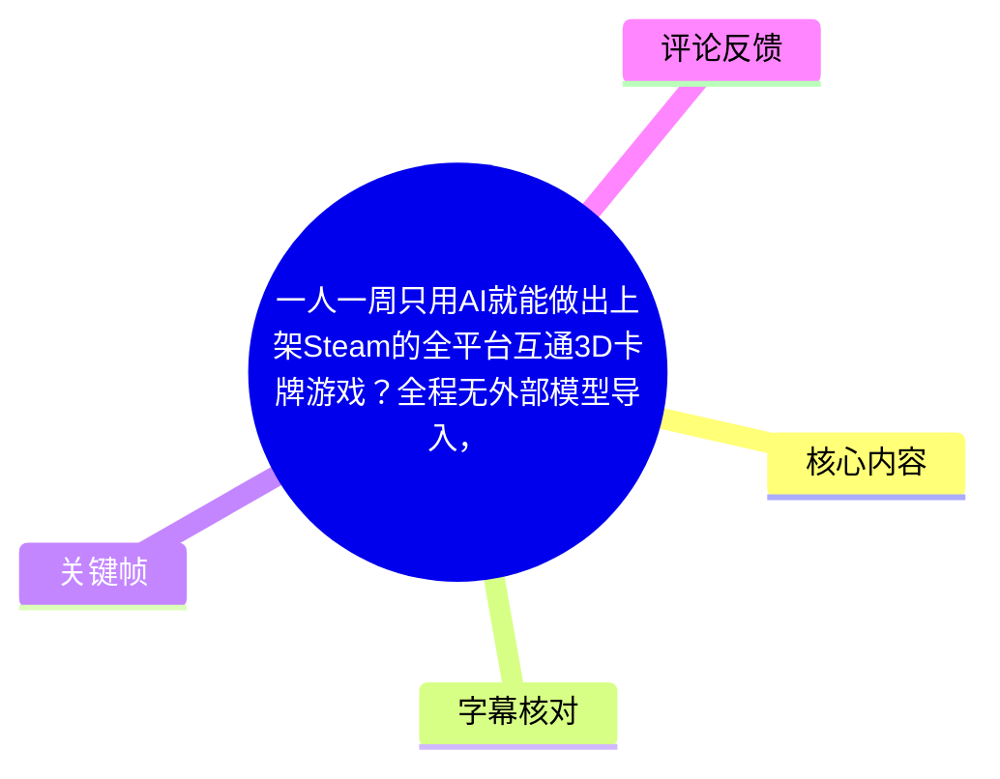
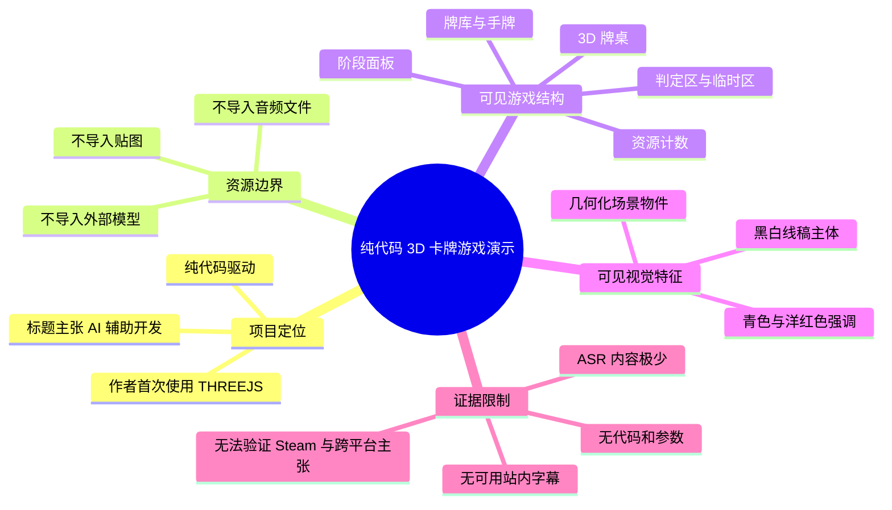
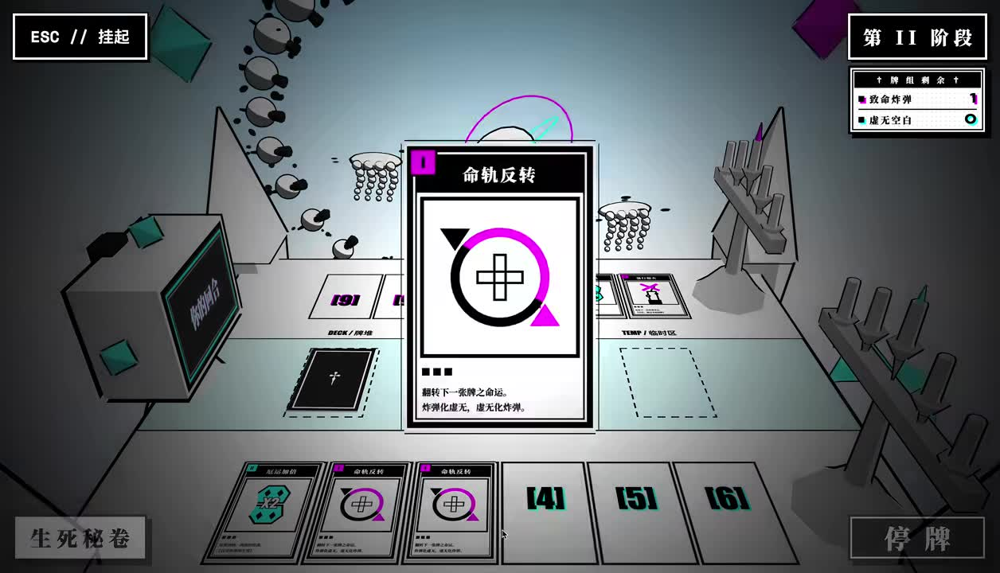
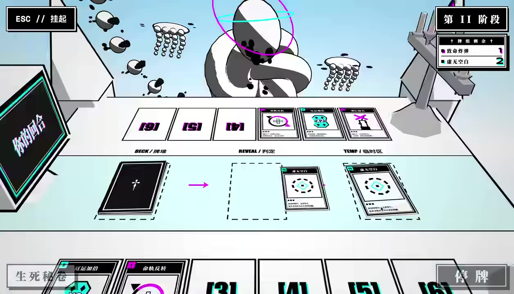
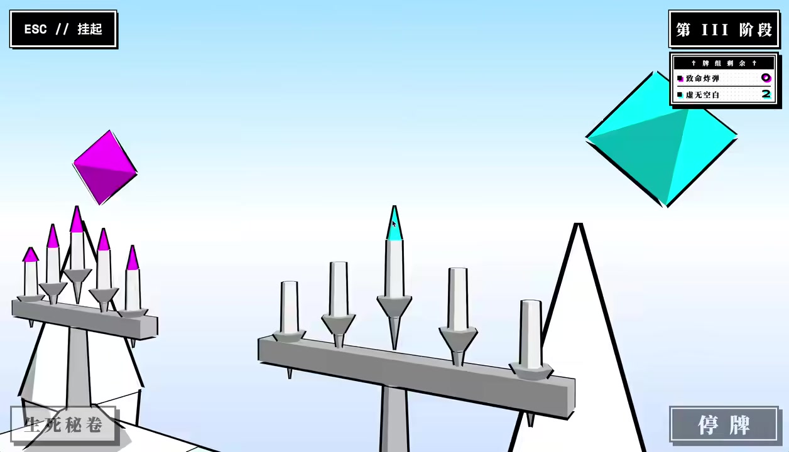

# 一人一周只用AI就能做出上架Steam的全平台互通3D卡牌游戏？全程无外部模型导入，纯代码绘制3D建模，音效和UI界面！！

> 来源：[Bilibili 视频](https://www.bilibili.com/video/BV1WLMG6FEKv) 
> UP 主：RobinsLu_GameDev｜视频时长：01:56｜合集：AIcode  
> 视频简介明确称：这是作者首次使用 **THREEJS** 制作的纯代码驱动 3D 卡牌游戏；不导入外部模型、音频文件和贴图。

## 小结

视频以实机画面展示了一款具有桌面卡牌布局、阶段推进、资源计数和卡牌效果展示的 3D 卡牌游戏。作者在标题与简介中将项目定位为“AI 辅助”“纯代码驱动”的 THREEJS 游戏，并强调美术模型、音频、贴图均不依赖外部导入资源。

从可见画面看，项目采用高对比黑白线稿与青色、洋红色点缀的视觉风格。场景包含可视化牌桌、牌库、判定区、临时区、手牌槽位、阶段面板、资源计数器，以及几何化的立体环境物件；这些元素共同构成了可操作的卡牌对局界面，而不只是静态概念图。

视频最有价值的技术信息是其资源生产边界：作者声称以代码生成或驱动游戏中的 3D 建模、UI 和音效，而非导入传统美术资产。对于希望用 Web 技术快速制作原型、研究程序化视觉风格，或尝试以 AI 加速独立游戏开发的人，这一案例可作为“低外部资产依赖”的设计参考。

但素材中的有效语音转写只有“哦”“喔”，没有可复原的讲解过程、代码、命令、AI 提示词、THREEJS 版本、部署架构或 Steam 上架证据。因此，不能从本视频素材进一步确认“一周完成”“已上架 Steam”“全平台互通”的具体实现范围，也不能据此复现项目。上述表述应被视为标题中的项目主张，而非已由视频材料充分验证的技术结论。

视频时长仅 116 秒，呈现形式更接近功能与视觉演示。可确认的是游戏原型存在并显示了若干交互状态；不可确认的是联网多人、跨端同步、商店审核状态、性能指标、商业化状态及 AI 在制作流程中的具体占比。

## 思维导图

## 目录

- [项目背景与证据边界](#项目背景与证据边界)
- [实机界面与卡牌流程](#实机界面与卡牌流程)
- [纯代码 3D 资产思路](#纯代码-3d-资产思路)
- [可整理的实现步骤与参数缺口](#可整理的实现步骤与参数缺口)
- [结论、限制与时效性](#结论限制与时效性)
- [字幕比对](#字幕比对)
- [评论分析](#评论分析)
- [处理记录](#处理记录)

## 项目背景与证据边界 [00:00](https://www.bilibili.com/video/BV1WLMG6FEKv?t=0)

作者在标题中提出“一人一周只用 AI”制作 3D 卡牌游戏的命题；视频简介则提供了相对明确的技术背景：项目是作者第一次使用 **THREEJS** 技术制作的纯代码驱动 3D 游戏。

可由简介直接确认的作者陈述包括：

1. 使用 THREEJS。
2. 游戏为 3D 卡牌游戏。
3. 项目不使用外部导入的模型、音频文件和贴图。
4. 作者将制作方式概括为“纯代码驱动”。

这里的“纯代码驱动”需要谨慎理解。根据素材，只能确认作者如此描述项目；无法确认其是否包含第三方 JavaScript 库、字体资源、浏览器音频 API、程序化纹理、运行时生成 Canvas 图像，或 AI 生成后再由人工改写的代码。THREEJS 本身通常作为 WebGL 的 3D 渲染库使用，但视频没有展示具体工程配置。

标题中还出现“上架 Steam”“全平台互通”等表述，但现有素材没有提供 Steam 商店页、App ID、构建产物、联机演示、平台列表或同步架构。因此，这些内容仅记录为标题主张，不应延伸为已经验证的事实。

## 实机界面与卡牌流程 [00:20](https://www.bilibili.com/video/BV1WLMG6FEKv?t=20)

关键帧显示的游戏界面具有明确的桌游式空间分区。画面左上角固定有 `ESC // 挂起`，右下角有“停牌”按钮；这说明演示至少包含暂停入口与结束/停牌操作入口。右上方状态栏显示“第 II 阶段”或“第 III 阶段”，并列出两类资源计数。

在第 II 阶段的画面中，右上角资源栏可辨识出：

- 致命筹码：`1`
- 虚无空白：`3`、`6` 或 `2`（不同关键帧状态不同）

这些数值随画面变化，能够说明资源或计分状态存在动态变化；但视频未提供资源增加、消耗或结算的规则说明，不能推断其具体机制。

> 图：该帧清楚呈现牌桌空间、中央放大的卡牌、手牌槽位和“第 II 阶段”资源面板。它是理解本作并非单纯 2D 卡牌 UI、而是将卡牌放置于 3D 桌面场景中的关键证据。

### 牌桌区域划分 [00:38](https://www.bilibili.com/video/BV1WLMG6FEKv?t=38)

从画面中可读到的区域标签包括：

| 区域标签 | 画面位置 | 可见用途 | 证据强度 |
| --- | --- | --- | --- |
| `DECK / 牌堆` | 画面中部偏左 | 显示一叠背面朝上的卡牌 | 画面可直接确认 |
| `REVEAL / 判定` | 画面中部 | 放置已翻开的卡牌 | 画面可直接确认 |
| `TEMP / 临时区` | 画面中部偏右 | 放置临时卡牌或效果卡 | 画面可直接确认 |
| 手牌槽位 | 画面底部 | 有编号的多个卡槽 | 画面可直接确认 |
| 阶段与资源栏 | 右上方 | 显示阶段和资源数量 | 画面可直接确认 |

关键帧中，底部卡槽可见 `[3]`、`[4]`、`[5]`、`[6]` 等编号。编号是否代表手牌序号、操作位、回合步数或快捷键，素材没有解释，不能确定。

> 图：此帧直接显示 `DECK / 牌堆`、`REVEAL / 判定`、`TEMP / 临时区` 三个区域，并能看到牌堆向中间槽位的箭头。其价值在于帮助读者识别游戏界面的功能分区，而不是将其误认为纯装饰性场景。

### 卡牌效果与状态展示 [00:49](https://www.bilibili.com/video/BV1WLMG6FEKv?t=49)

画面中央出现一张被放大的卡牌，标题可辨识为“命轨反转”。牌面下方的规则文字受清晰度限制，无法可靠逐字转录；能够确认的是该卡牌使用图形符号、颜色角标和说明文本组织信息，并且卡牌会在桌面中央以较大的尺寸呈现。

在底部卡牌栏中，还能辨认出“虹运加倍”“命轨反转”等名称或近似文字。由于没有清晰字幕和原始规则文本，不能判断这些卡牌的完整效果、费用、稀有度或触发条件。

> 图：中央放大的卡牌展示了卡牌信息层级：标题、图形、颜色标记与规则文本。该画面支持“游戏具有卡牌效果说明界面”的判断，但不足以可靠还原其具体规则。

### 阶段推进与立体场景 [01:16](https://www.bilibili.com/video/BV1WLMG6FEKv?t=76)

后段关键帧切换至“第 III 阶段”。场景中的立体物件更突出：画面左右存在架设在底座上的尖锥状结构，空中悬浮着青色与洋红色的多面体。它们与前面牌桌区域共享同一视觉语言，即黑色描边、白灰主体和高饱和荧光色点缀。

> 图：该帧突出展示悬浮多面体、尖锥结构与阶段资源栏，是判断项目具有立体环境陈设和阶段切换状态的主要画面依据，也呼应作者“纯代码绘制 3D 建模”的项目定位。

## 纯代码 3D 资产思路 [00:56](https://www.bilibili.com/video/BV1WLMG6FEKv?t=56)

作者在简介中强调“不导入外部模型、音频文件、贴图”。结合可见画面，可以将其项目思路归纳为以下**事实与合理推断的分层**：

### 已明确陈述的内容

- 渲染/开发技术：THREEJS。
- 资产策略：不导入外部模型、音频文件、贴图。
- 项目类型：3D 卡牌游戏。
- 驱动方式：纯代码驱动。

### 由画面支持的实现特征

- 3D 场景中使用了规则的几何体、棱锥、杆状物、牌桌和卡牌实体。
- UI 使用黑白底色、粗边框、荧光青与洋红等有限配色。
- 卡牌主体多用抽象符号和几何图案表达。
- 游戏状态至少包含阶段编号和两项资源数值。

### 不能由素材确认的实现细节

以下均不能作为本视频已披露的方法：

- 模型具体由 `BoxGeometry`、`PlaneGeometry`、`BufferGeometry` 或自定义顶点数据中的哪一种生成；
- 材质是否使用 `MeshBasicMaterial`、`MeshStandardMaterial`、着色器或 Canvas 贴图；
- 卡牌文本是否由 DOM、Canvas、CSS2DRenderer、SDF 字体或其他方案渲染；
- 音效是 Web Audio API 合成、程序生成、AI 生成代码，还是其他方式；
- AI 使用的是哪一个模型、提示词、IDE 插件或代理式开发工具；
- 项目是否具备多人联网、存档、跨端同步、Steam 打包与发行能力。

因此，对开发者而言，本视频可借鉴的是“通过受限素材策略塑造统一风格”的方向：用几何物体替代高复杂度模型，用矢量/图形化卡面替代贴图，用有限色板强化识别度。它不能替代完整的 THREEJS 工程教程。

## 可整理的实现步骤与参数缺口 [01:00](https://www.bilibili.com/video/BV1WLMG6FEKv?t=60)

视频没有给出可执行代码或逐步教学。以下流程是依据作者已声明的技术边界和画面结构整理出的**项目拆解清单**，用于分析开发范围，不代表视频中展示过的实际代码、函数或配置。

### 1. 确定资源约束与视觉规则

先明确项目的资产限制：不导入外部模型、贴图与音频文件。随后建立能在代码中表达的视觉系统：

- 主体：黑、白、灰；
- 强调色：青色、洋红色；
- 几何母题：多面体、锥体、矩形牌面、直线描边；
- 信息面板：黑底白框、粗体高对比文字；
- 卡牌：统一比例、边框、标题区、图形区、规则区。

这类约束会降低素材管理压力，但会把难点转移至排版、动效、镜头、光照和交互反馈的精细调校。

### 2. 建立牌桌与功能区

从关键帧可见，最小可用布局需要包括：

1. 牌堆区；
2. 判定区；
3. 临时区；
4. 手牌区；
5. 阶段信息区；
6. 资源计数区；
7. 暂停与停牌等操作控件。

对于纯代码构建，建议首先完成静态空间关系，再为每个区域建立明确的数据映射。例如，每张卡牌应至少有唯一标识、当前区域、显示顺序和可交互状态。视频未披露这些字段名或数据格式，不能提供原始参数。

### 3. 让状态变化驱动画面

关键帧显示资源值和阶段会变化，因此逻辑层至少需要维护：

- 当前阶段；
- 两类资源的数量；
- 各区域中的卡牌集合；
- 当前被展示或结算的卡牌；
- 暂停/停牌等输入状态。

应当由游戏状态变化驱动 UI 与 3D 场景更新，而不是仅修改屏幕上的文字。这样才能让“第 II 阶段”到“第 III 阶段”、资源变化、卡牌进入判定区等画面保持一致。具体状态机、胜负条件和卡牌结算顺序在素材中均未公开。

### 4. 使用程序化元素替代外部资源

作者的描述表明，项目目标是避免传统资源导入。对这一目标，通常需要分别处理三类内容：

| 内容类别 | 画面中可见结果 | 视频是否给出具体方法 |
| --- | --- | --- |
| 3D 物件 | 牌桌、架子、锥体、多面体等 | 否 |
| 卡牌与 UI | 文字、边框、图标、颜色块、槽位 | 否 |
| 音效 | 作者声称未导入音频文件 | 否 |

特别是音效部分：虽然简介称“没有任何……音频文件导入”，但没有播放或讲解足够清晰的音频实现证据。不能据此断言使用了某种浏览器音频合成 API，也不能评估其音质和兼容性。

### 参数与复现信息缺口

本视频未提供下列决定复现结果的参数：

| 参数类别 | 素材是否提供 | 影响 |
| --- | --- | --- |
| THREEJS 版本 | 未提供 | API 兼容性与工程搭建 |
| 相机类型、位置、视角 | 未提供 | 牌桌透视与构图 |
| 光源、阴影、后处理设置 | 未提供 | 线稿式 3D 质感 |
| 几何体尺寸和顶点参数 | 未提供 | 场景比例与物体外观 |
| UI 字体、字号、间距 | 未提供 | 信息可读性 |
| 卡牌规则数据 | 未提供 | 对局逻辑与平衡 |
| 音效生成参数 | 未提供 | 声音效果与跨端行为 |
| 构建、发布和 Steam 打包方式 | 未提供 | 实际发行可行性 |
| 联机协议与同步方案 | 未提供 | “全平台互通”验证 |

## 结论、限制与时效性 [01:40](https://www.bilibili.com/video/BV1WLMG6FEKv?t=100)

这段视频的核心价值在于展示了一种明确的独立游戏原型方向：在 THREEJS 环境中，以程序化/代码驱动的方式完成 3D 牌桌、几何化环境、卡牌 UI 和游戏状态展示，并尽量减少外部传统资产的导入。

从成片效果看，作者通过有限配色、黑色描边、抽象几何物和桌游式空间分区，获得了辨识度较高的视觉风格。对于早期原型而言，这种方法可以避免高成本建模、贴图绘制与素材采购，并能让视觉元素与游戏规则符号保持一致。

不过，“纯代码”不等于“无需美术设计、无需工程工作”。相反，这种路线要求开发者将模型、排版、材质、动态效果、输入、状态管理和音频行为都转化为可维护的代码结构。随着卡牌数量、规则复杂度、动画需求和多平台适配需求增长，代码资产本身也会成为需要版本管理、测试和迭代的生产内容。

时效性方面，视频元数据抓取时间为 2026-07-13，视频发布 Unix 时间戳换算约为 2026-07-08。THREEJS、浏览器音频能力、AI 编程工具、Steam 提交流程与跨平台发布方式都可能随时间变化。本笔记仅记录此次素材可验证的内容，不应视为当前版本工具链或发行政策的实时指南。

## 字幕比对 [00:00](https://www.bilibili.com/video/BV1WLMG6FEKv?t=0)

本次任务已执行 ASR，但可获得的 ASR 文本仅为“哦”“喔”，没有可用时间戳、技术讲解或规则说明。站内字幕则未提供可用内容。

| 字幕来源 | 完整性 | 专有名词 | 时间轴 | 主要问题 |
| --- | --- | --- | --- | --- |
| Bilibili 站内字幕 | 无可用字幕 | 无法核对 | 无法核对 | 素材明确说明未提供可用站内字幕 |
| 本次 ASR 字幕 | 极低，仅有“哦”“喔” | 未识别出 THREEJS、卡牌名或规则术语 | 未提供有效句级时间轴 | 无法转写视频讲解内容，不能作为技术事实来源 |

最终字幕选择：**不采用任何一份字幕作为正文事实依据**。正文优先依据视频元数据、作者简介、标题和关键帧中可直接辨识的文字与界面构成。

通过画面校正或确认的信息包括：

- `THREEJS`：来自作者简介，不来自 ASR；
- `DECK / 牌堆`、`REVEAL / 判定`、`TEMP / 临时区`：来自关键帧界面文字；
- `第 II 阶段`、`第 III 阶段`：来自关键帧右上角状态栏；
- “致命筹码”“虚无空白”：来自关键帧资源面板；
- “命轨反转”等卡牌名称：来自卡面可见文字，但其完整规则描述因画质不足未作转录。

## 评论分析 [01:46](https://www.bilibili.com/video/BV1WLMG6FEKv?t=106)

以下仅分析本次可获取的热评前三条。评论是玩家感受与期待，不构成对游戏机制、AI 工具或发行状态的验证。

### 1. 花泽戈娅：`邪恶冥刻的感觉`

- 点赞数：3
- 观点概括：评论者认为作品在氛围或卡牌桌游呈现上，让人联想到《邪恶冥刻》。
- 可补充的信息：说明黑白对比、桌面卡牌、略带神秘感的界面设计，容易触发同类作品联想。
- 可信度与边界：这是审美和体验层面的主观类比。视频没有明确宣称借鉴《邪恶冥刻》，也不能据此判断玩法、叙事或规则相同。

### 2. 想那么多干嘛头会疼的：`为什么你的gemini美术审美还行，我ai Studio做出来跟换皮flash小游戏一样[笑哭]`

- 点赞数：23
- 观点概括：评论者肯定了视频中呈现的 AI 视觉审美，并将其与自己使用 AI Studio 的结果作对比。
- 可补充的信息：这反映观众关注的不只是“有没有用 AI”，还包括 AI 输出能否形成统一风格，以及人工筛选、提示、后处理可能对结果造成的影响。
- 可信度与边界：评论没有提供提示词、模型版本、工作流或可复现样本；且视频素材本身未展示 Gemini 或 AI Studio 的使用过程。因此，不能得出“某一模型美术能力更好”的结论。

### 3. b雨b：`挺有意思的，类恶魔轮盘，但比恶魔轮盘要更有博弈性，很期待后续多人模式的开发。`

- 点赞数：4
- 观点概括：评论者将其与《恶魔轮盘》作类型联想，并认为其可能具有更强的博弈性，期待多人模式。
- 可补充的信息：这表明现有实机画面能够让观众感受到风险决策或回合博弈的潜力，也暴露出多人模式是观众关注的后续方向。
- 可信度与边界：关于“更有博弈性”属于个人评价；“后续多人模式”是评论者期待，并非作者在所给素材中确认的开发计划。不能据此认定游戏已有或必将推出多人功能。

## 处理记录 [01:56](https://www.bilibili.com/video/BV1WLMG6FEKv?t=116)

- Worker ID：`worker-mrj0www4-e8d79408`
- 模型：`gpt-5.6-terra`
- 调用工具与素材：基于任务提供的 Bilibili 元数据、视频素材清单、站内字幕状态、ASR 输出、热评 JSON 与 4 张关键帧进行整理；未提供额外的代码仓库、Steam 页面、工程文件或联网实测结果。
- 使用的应用工具：素材采集流程已产出 `merged.mp4`、`audio/audio.wav`、`frames/`、`comments/comments.json`、`subtitles/`、`asr/` 等目录/文件；本知识整理仅使用任务中实际提供的内容。
- 字幕选择：站内字幕不可用；本次 ASR 已执行但仅输出“哦”“喔”。两者均不足以支持技术转写，正文改以元数据、简介与关键帧可见信息为准。
- 关键帧选择依据：
  - `frames/frame-002.jpg`：展示第 II 阶段、中央卡牌、资源栏和手牌，是分析卡牌信息层级与状态面板的主要依据；
  - `frames/frame-003.jpg`：清晰呈现牌堆、判定区、临时区和手牌区，是界面区域分析的主要依据；
  - `frames/frame-004.jpg`：展示第 III 阶段、悬浮多面体和立体装置，用于说明 3D 场景视觉特征；
  - `frames/frame-001.jpg`：展示桌面与阶段 UI，但信息密度低于上述帧，未在正文重复插入。
- 缓存清理：未提供缓存清理执行记录；为避免编造，无法确认是否已清理临时缓存。
- 未解决问题：
  - 缺少可用讲解字幕，无法还原作者的完整设计思路；
  - 缺少源代码、依赖版本、AI 工具链、提示词和部署配置；
  - 无法验证“一周完成”“Steam 上架”“全平台互通”及多人模式的实际状态；
  - 卡牌文本与规则因关键帧清晰度不足无法完整转录。

## 评论分析

本次流程未获取到可用热评，因此不推断观众态度或额外结论。
