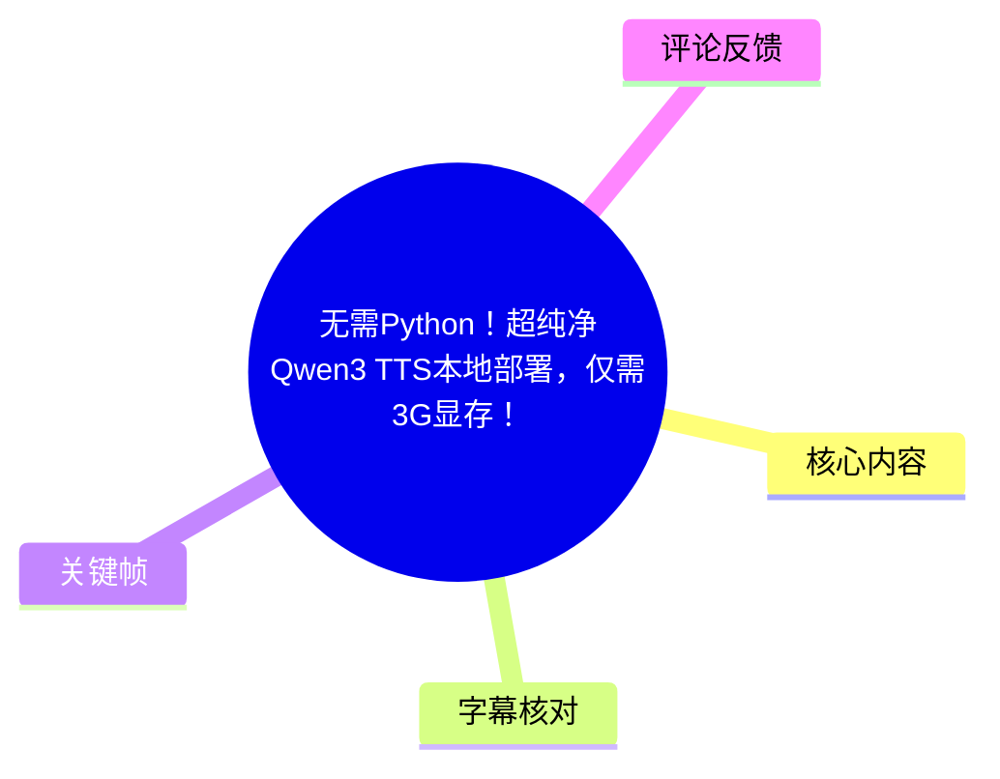
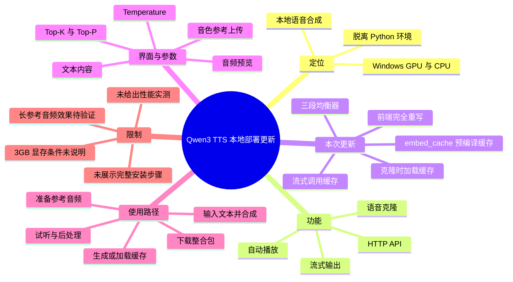
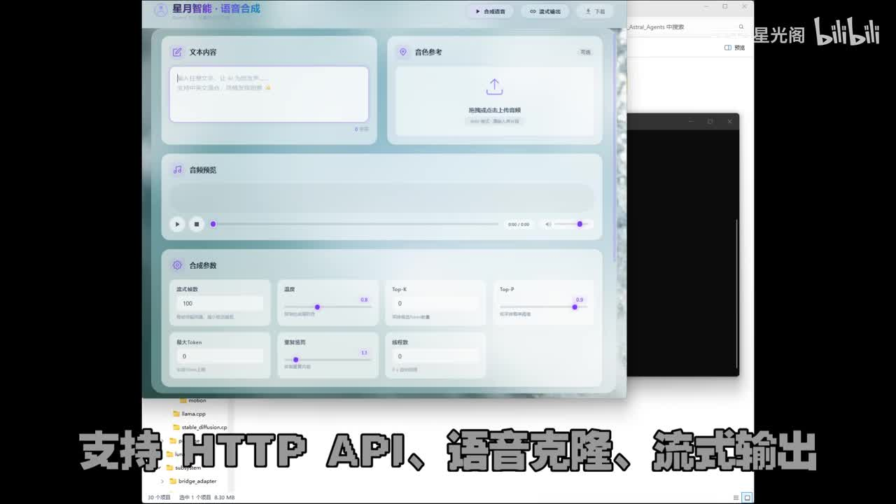
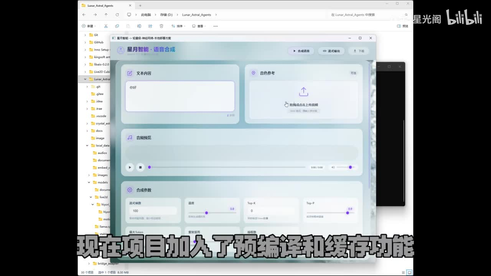
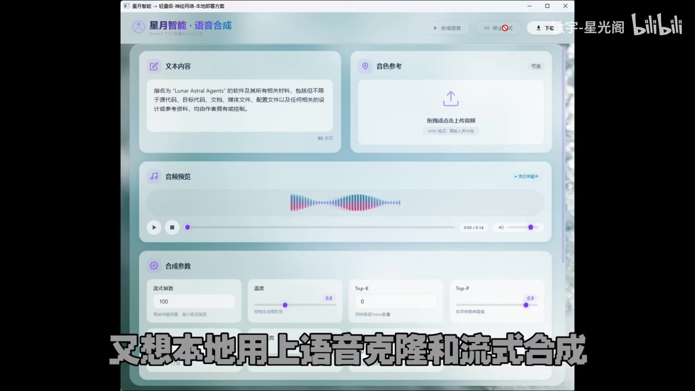
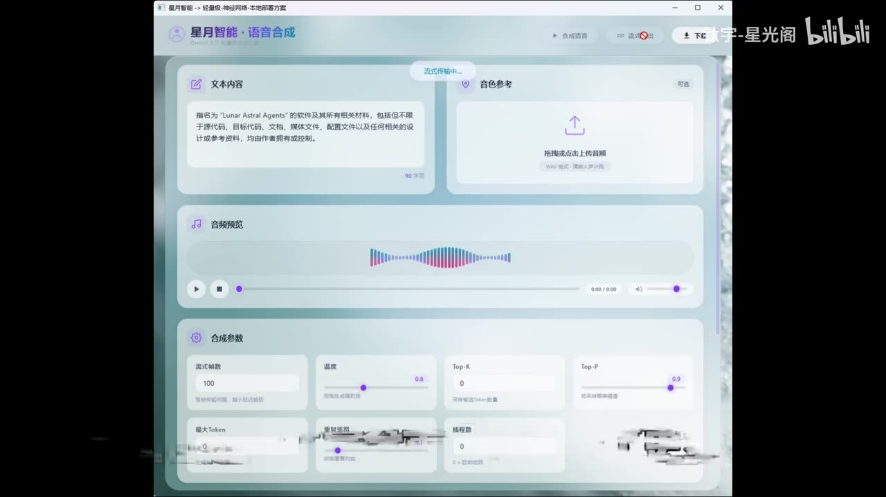

# 无需Python！超纯净Qwen3 TTS本地部署，仅需3G显存！

> 来源：[Bilibili 视频](https://www.bilibili.com/video/BV1rqGL6jEp7)<br>
> UP 主：钛宇-星光阁｜合集：AIcode｜视频时长：03:16｜标签：TTS、本地部署、Qwen3、语音合成、开源

## 小结

这是一则关于 **Qwen3-TTS.CPP 本地部署整合包** 的更新介绍。UP 主强调该方案可脱离 Python 环境使用，面向希望在 Windows 的 GPU 或 CPU 上进行本地语音合成、语音克隆和流式输出的用户。

本次更新的核心是 **`embed_cache` 预编译缓存机制**：针对同一参考音频，先生成并保存其语音特征缓存；后续克隆时直接加载缓存，以避免反复计算音频特征。视频将其定位为提升重复克隆效率的重要改进，但没有提供具体的耗时、加速倍率或测试机器数据。

流式合成也接入了缓存调用，并支持自动播放。前端被完全重写，画面中可见文本输入、音色参考上传、音频预览以及采样/生成类参数；UP 主同时说明新增了音频均衡器，可对生成后的音效进行处理。

视频标题宣称“仅需 3G 显存”，但站内字幕、ASR、关键帧及简介中均未给出显存占用的测试条件、模型规格、量化等级、上下文长度或 GPU 型号。因此，**3GB 应视为标题中的部署主张，而非本视频已展示的可复现实测结论**。

资源方面，简介给出了 123 云盘、百度网盘、夸克网盘、GitHub、Gitee、ModelScope 模型页及上游 `qwen3-tts.cpp` 项目链接；并指定应下载 `Qwen3-TTS-Lunar-2026-05-24.7z` 版本。软件、模型与链接均可能在视频发布后变化，部署前应以仓库最新说明、许可证和发布包校验信息为准。

## 思维导图





## 目录

- [项目定位与适用对象](#项目定位与适用对象)
- [更新一：embed_cache 预编译与语音特征缓存](#更新一embed_cache-预编译与语音特征缓存)
- [更新二：流式合成、自动播放与前端重写](#更新二流式合成自动播放与前端重写)
- [界面、可见参数与演示内容](#界面可见参数与演示内容)
- [实践路径与资源获取](#实践路径与资源获取)
- [限制、时效性与使用边界](#限制时效性与使用边界)
- [字幕比对](#字幕比对)
- [评论分析](#评论分析)
- [处理记录](#处理记录)

## [项目定位与适用对象](https://www.bilibili.com/video/BV1rqGL6jEp7?t=0)

站内字幕在 [00:00:00](https://www.bilibili.com/video/BV1rqGL6jEp7?t=0) 至 [00:00:12](https://www.bilibili.com/video/BV1rqGL6jEp7?t=12) 说明，该项目是一个“完全脱离 Python”的 Qwen3 TTS 本地部署方案，支持：

- **HTTP API**；
- **语音克隆**；
- **流式输出**；
- 在 **Windows GPU 与 CPU** 上运行语音合成。

这里的“脱离 Python”应理解为 UP 主提供的使用/分发方案不要求用户自行搭建繁杂的 Python 环境，而不能据此推断项目生态、底层依赖或所有运行场景都完全不存在 Python 成分。视频未展示安装包目录、启动文件、端口、API 路由或调用示例。



> 图：画面展示“星月智能·语音合成”前端，包含文本内容、音色参考上传、音频预览和合成参数区域；它直观佐证视频展示的是可操作的桌面式前端，而非仅命令行说明。画面底部也强调 HTTP API、语音克隆和流式输出三项能力。

适合关注以下需求的用户：

1. 希望本机生成语音，而不优先依赖云端 TTS 服务；
2. 希望使用参考音频进行音色克隆；
3. 需要将生成能力接入本地工作流，且可能需要 HTTP API；
4. 不想自行处理复杂 Python 环境配置的 Windows 用户。

## [更新一：embed_cache 预编译与语音特征缓存](https://www.bilibili.com/video/BV1rqGL6jEp7?t=16)

### [问题：重复克隆会重复计算特征](https://www.bilibili.com/video/BV1rqGL6jEp7?t=16)

UP 主在 [00:00:16](https://www.bilibili.com/video/BV1rqGL6jEp7?t=16) 至 [00:00:29](https://www.bilibili.com/video/BV1rqGL6jEp7?t=29) 描述旧版问题：在克隆同一声音时，会重复计算参考音频的音频特征。这意味着，对于同一个音色参考反复发起合成时，前置特征处理会成为重复成本。

### [改进：预编译并保存 `embed_cache`](https://www.bilibili.com/video/BV1rqGL6jEp7?t=20)

项目新加入预编译和缓存功能。按视频表述，流程是：

1. 对参考音频进行预编译；
2. 保存得到的语音特征缓存，即 `embed_cache`；
3. 后续语音克隆时直接加载已自动编译完成的缓存；
4. 省去重复特征计算。

这项设计尤其适用于“**固定角色音色 + 多轮文本合成**”的工作流，例如为虚拟角色、旁白角色或应用内固定发音人连续生成多段语音。



> 图：画面中仍可见文本、音色参考、预览与参数区域，底部字幕指出项目已加入预编译和缓存功能。该帧的价值在于将本次更新与实际前端使用入口关联起来：缓存机制服务于参考音频驱动的克隆流程。

需要注意的是，视频只说明“速度大幅提升”，未给出以下可复现信息：

- 首次预编译耗时；
- 缓存文件大小；
- 同一参考音频重复调用的平均耗时；
- CPU 与 GPU 的差异；
- 缓存失效条件；
- 缓存是否随模型、量化版本、采样参数或参考音频变更而失效。

因此，不能从视频材料进一步量化其实际加速倍数。

## [更新二：流式合成、自动播放与前端重写](https://www.bilibili.com/video/BV1rqGL6jEp7?t=29)

### [流式输出支持缓存与自动播放](https://www.bilibili.com/video/BV1rqGL6jEp7?t=29)

在 [00:00:29](https://www.bilibili.com/video/BV1rqGL6jEp7?t=29) 至 [00:00:37](https://www.bilibili.com/video/BV1rqGL6jEp7?t=37)，视频说明两项改进：

- 流式合成同样支持调用缓存；
- 流式输出会自动播放。

前者意味着在流式合成路径中，也可复用已经生成的参考音频特征，避免每次流式请求重复准备同一音色信息。后者则改善试听体验：用户不必等待完整音频生成结束后再手动打开文件。



> 图：音频预览区域显示波形，并在右侧出现“流式传输中”的状态提示；底部字幕说明本地可使用语音克隆和流式合成。这是判断视频确实演示流式工作状态的关键画面依据。

不过，视频未说明流式输出的首包延迟、音频分片格式、是否支持中断、并发限制、HTTP API 的流式协议，或自动播放在浏览器/桌面环境中的兼容性。若需要将其接入应用，应以实际发行包文档和接口行为为准。

### [前端完全重写与音频均衡器](https://www.bilibili.com/video/BV1rqGL6jEp7?t=37)

[00:00:37](https://www.bilibili.com/video/BV1rqGL6jEp7?t=37) 至 [00:00:49](https://www.bilibili.com/video/BV1rqGL6jEp7?t=49) 的内容包括：

- 前端页面进行了完全重写；
- 新增更多可调参数；
- 新增音频均衡器；
- 均衡器用于处理生成的音效。

简介进一步将均衡器描述为“三段均衡器”。视频没有解释三个频段的具体划分、增益范围、默认值或均衡器位于实时播放链路还是导出后处理链路，因此不能据此确定其声音处理精度与用途边界。

## [界面、可见参数与演示内容](https://www.bilibili.com/video/BV1rqGL6jEp7?t=40)

关键帧中的前端标题为“星月智能·语音合成”。从画面可识别的功能区包括：

- **文本内容**：输入待合成的文字；
- **音色参考**：上传参考音频，画面提示支持拖拽或上传音频；
- **音频预览**：显示播放、停止、进度条、时长与音量控制；
- **合成参数**：控制生成行为；
- 顶部操作区：可见“合成语音”“流式输出”“下载”等入口或状态。



> 图：该帧完整呈现合成参数区域，是提取视频可见参数的主要依据。与只保留功能宣传相比，它让读者能看到该前端确实暴露了采样与生成控制项。

画面中可辨识的参数与当时显示值如下；它们是**演示画面中的数值**，并不等同于官方推荐配置：

| 参数 | 画面可见值 | 可从画面确认的含义 |
| --- | ---: | --- |
| 尝试帧数 | 100 | 前端提供该数值输入项；视频未解释其算法含义。 |
| 温度（Temperature） | 0.8 | 前端提供采样温度控制。 |
| Top-K | 0 | 前端提供 Top-K 控制。 |
| Top-P | 0.9 | 前端提供 Top-P 控制。 |
| 最大 Token | 0 | 前端提供最大 Token 项；`0` 的具体语义未在视频说明。 |
| 重复惩罚 | 1.1 | 前端提供重复惩罚控制。 |
| 线程数 | 0 | 前端提供线程数控制；`0` 是否代表自动选择未获视频说明。 |

演示后半段还播放了若干合成样例：

- [01:48](https://www.bilibili.com/video/BV1rqGL6jEp7?t=108)： “你好，我是月华”；
- [02:04](https://www.bilibili.com/video/BV1rqGL6jEp7?t=124)：再次播放“你好，我是月华”；
- [02:15](https://www.bilibili.com/video/BV1rqGL6jEp7?t=135)： “你叫什么名字”；
- [02:31](https://www.bilibili.com/video/BV1rqGL6jEp7?t=151) 起：多次播放“我的妹妹叫琉璃哦”；
- [03:05](https://www.bilibili.com/video/BV1rqGL6jEp7?t=185)： “喜欢果茶，还有哥哥画的画，你呢”。

这些片段说明视频展示了多轮短句合成/播放结果，但没有明确标注每段样例是否使用相同参考音频、是否属于不同模型、是否启用缓存，以及是否采用相同参数。因此不应将样例间的听感差异直接归因于某个参数或功能。

## [实践路径与资源获取](https://www.bilibili.com/video/BV1rqGL6jEp7?t=49)

### [视频明确给出的获取信息](https://www.bilibili.com/video/BV1rqGL6jEp7?t=49)

UP 主在 [00:00:49](https://www.bilibili.com/video/BV1rqGL6jEp7?t=49) 至 [00:01:06](https://www.bilibili.com/video/BV1rqGL6jEp7?t=66) 表示，更新已推送至 GitHub 与 Gitee；不想折腾 Python 环境、又希望本地使用语音克隆与流式合成的用户可以尝试该项目，链接位于视频简介。

简介中列出的资源为：

- 项目整合包（123 云盘）：<https://www.123865.com/s/soKjTd-Z8F7?pwd=klKs>
- 项目整合包（百度网盘）：<https://pan.baidu.com/s/5YgCCUwowXavcNdOVOGvW0g#list/path=%2F%E6%9C%88%E5%8D%8E%2FTTS>
- 项目整合包（夸克云盘）：<https://pan.quark.cn/s/24221919ec49>
- GitHub 仓库：<https://github.com/TayunStarry/Lunar_Astral_Agents.git>
- Gitee 仓库：<https://gitee.com/TayunStarry/Lunar-Astral-Agents>
- 模型下载：<https://modelscope.cn/models/qwqpotato/qwen3-tts-gguf>
- 上游项目：<https://github.com/predict-woo/qwen3-tts.cpp>

简介特别要求下载：

```text
Qwen3-TTS-Lunar-2026-05-24.7z
```

### [依据视频可整理的实际使用顺序](https://www.bilibili.com/video/BV1rqGL6jEp7?t=20)

视频没有录制完整安装与启动操作，因此以下是按界面和功能关系整理的**使用路径**，不是视频已逐步演示的安装教程：

1. 从简介链接获取 UP 主指定版本的整合包，并根据需要获取对应模型。
2. 启动项目提供的前端；视频未展示具体启动命令或可执行文件名称。
3. 在“文本内容”输入需要合成的文字。
4. 在“音色参考”上传或拖入参考音频，用于语音克隆。
5. 若需要反复使用同一音色，先利用项目的预编译/缓存能力生成 `embed_cache`。
6. 后续合成或流式合成时加载该缓存，减少重复特征计算。
7. 按需求调整温度、Top-K、Top-P、最大 Token、重复惩罚、线程数等前端暴露项。
8. 使用普通合成或流式输出，试听音频预览；流式模式按视频描述会自动播放。
9. 如需调整生成后的听感，可使用新增的均衡器；简介称其为三段均衡器。
10. 通过前端下载入口保存生成结果。

### [视频未覆盖、部署前应自行核实的事项](https://www.bilibili.com/video/BV1rqGL6jEp7?t=59)

以下信息在提供素材中均未出现，不能补写为既有步骤：

- 支持的 Windows 版本；
- CUDA、显卡驱动或 CPU 指令集要求；
- 模型文件应放置的目录；
- 模型量化文件与显存需求的对应关系；
- HTTP API 的监听地址、认证方式、请求参数与返回格式；
- `embed_cache` 的生成按钮、命名规则和保存位置；
- 音色参考音频的推荐格式、时长、采样率或授权要求；
- 下载包的校验和与安全验证方式。

## [限制、时效性与使用边界](https://www.bilibili.com/video/BV1rqGL6jEp7?t=59)

### 证据边界

1. **“3G 显存”缺乏条件说明**  
   标题含“仅需 3G 显存”，但正文字幕与画面没有给出模型大小、量化格式、GPU 型号、是否含系统/缓存开销、单次生成长度或并发条件。该数字不能直接泛化到所有模型和任务。

2. **未展示完整部署过程**  
   虽然项目主打无需 Python，但视频没有演示解压、模型放置、启动、报错处理或 API 调用。它是更新介绍与功能展示，不是端到端部署教学。

3. **性能表述不可量化**  
   “速度大幅提升”是 UP 主对缓存机制效果的描述，未附前后对照测试或基准数据。

4. **效果样例不足以覆盖稳定性**  
   视频播放了若干短句，但没有覆盖长文本、不同语言、噪声参考音频、多人声干扰、长时连续输出等情况。

5. **语音克隆涉及授权与合规风险**  
   使用他人声音作为参考音频前，应确保获得合法授权，并遵守平台政策、当地法律与模型/软件许可证。视频并未提供相关合规指引。

### 时效性

本视频关联更新包名称为 `Qwen3-TTS-Lunar-2026-05-24.7z`，属于视频发布时点的版本信息。仓库代码、模型文件、下载链接、前端参数、兼容性及资源可用性均可能已经变化。尤其是整合包与模型下载，建议：

- 优先核对 GitHub/Gitee 的最新发布说明；
- 确认上游 `qwen3-tts.cpp` 的当前兼容性；
- 检查下载文件来源、版本号及校验信息；
- 不将本视频中的默认参数直接当作通用最佳实践。

## 字幕比对

| 字幕来源 | 完整性 | 专有名词 | 时间轴 | 主要问题 |
| --- | --- | --- | --- | --- |
| Bilibili 站内字幕 | 覆盖 00:00:00–03:09 的说明、版权文本与样例语音，整体完整 | 存在识别/转写误差，如“QN3TTS”“关TTS”“泰语星光阁” | 细分到多条短句，和视频内容顺序一致，可直接定位 | 项目名、UP 主名及个别技术词存在误写；版权文本有重复。 |
| 本次 ASR 字幕 | 有 15 段，检测到约 70.88 秒语音，覆盖率约 36.22% | 误识别较多，如“Q1.3 TTS”“Walken”“客隆”“流逝输出”“太宇星光格” | 有时间戳，但主说明被压缩在 00:00:35–01:06，与站内字幕 00:00:00–01:06 明显错位 | 分段过粗，首段包含大量连续内容；项目名、术语和中文词语准确性较低。 |

### 最终字幕选择

正文以 **Bilibili 站内字幕** 作为主时间轴依据，原因是其时间切分细、完整覆盖视频主要说明，并与后续样例语音的顺序相符。

本次 ASR 已被检查：其诊断显示音频语言为中文，置信度约 `0.9702`，使用 `medium` 模型、CUDA、`float16` 处理；未标记 `noAudioStream=true`，说明源视频存在音轨，不能将 ASR 问题归因于无音轨。ASR 的主要问题是主说明段时间位置整体异常、分段极粗且专有名词误识别多，故不作为正文时间轴来源。

结合元数据、简介和关键帧，对站内字幕中的重要词语作如下校正：

| 站内字幕写法 | 采用写法 | 校正依据 |
| --- | --- | --- |
| QN3TTS | Qwen3 TTS / Qwen3-TTS | 视频标题、简介、ModelScope 链接及上游项目名。 |
| 关TTS项目 | Qwen3 TTS 项目 | 上下文及标题；站内字幕该处存在明显误识别。 |
| 泰语星光阁 | 钛宇-星光阁 | 视频元数据中的 UP 主名称。 |
| git仓库 | Gitee 仓库 | 简介明确同时给出 GitHub 与 Gitee 链接。 |
| 音频均衡器 | 三段均衡器 | 视频简介的更新说明。 |

## 评论分析

仅处理当前可获取的热评前三条。评论属于用户反馈或提问，未经过视频材料验证，不能直接视为项目已实现或效果已证实的事实。

1. **坤寻｜4 赞**  
   > “纯本地的话，如果再加上角色扮演添加灵魂不过我写了史山一个在修bug”

   评论者希望在纯本地 TTS 基础上加入“角色扮演”能力，以增强表达或人格化效果，并表示自己正在开发一个尚有 Bug 的实现。该评论反映出用户对“固定音色克隆之外的角色化表达”的需求，但视频没有介绍角色扮演模块，也没有证实该评论者的实现可用。

2. **亿壹粟｜2 赞**  
   > “1.7b的basemodel有吗，我只看到0.6b的”

   评论提出模型规格与资源可得性问题，称其只看到 0.6B 模型并询问是否存在 1.7B Base Model。这与标题中的低显存主张存在实际关联：不同模型规模和量化版本通常会影响显存/内存需求。素材中没有 UP 主回复，也没有模型清单可验证，因此不能据此确认 1.7B 模型是否提供。

3. **Akasi_梦梦没做梦｜1 赞**  
   > “长一点的音频参考是否会有更好的效果呢？试了几次不同长度，偶现音色更好的情况”

   评论者基于个人试验观察到，不同长度的参考音频有时会带来更好的音色效果，并询问长参考是否更优。这是值得测试的经验线索，但“偶现”本身说明结果不稳定；视频没有提供参考音频时长建议、控制变量或客观评测，不能得出“参考音频越长越好”的结论。

## 处理记录

- **Worker ID**：`worker-mrj0www4-e8d79408`
- **模型**：`gpt-5.6-terra`
- **ASR 模型与执行参数**：`medium`；语言自动识别为中文；CUDA；`float16`；语音时长检测约 70.88 秒。
- **使用的素材/工具输出**：视频元数据、视频简介、站内 SRT 字幕 `p01-ai-zh.srt`、本次 ASR 结果 `asr/asr-result.json`、ASR SRT、12 张关键帧、热评前三条。
- **字幕选择**：采用站内字幕作为正文的主时间轴；ASR 已检查但因说明段错位、分段粗糙及专有名词误识别较多，仅用于交叉核验与诊断。
- **关键帧选择依据**：选用 `frame-001.jpg` 展示主界面与核心能力、`frame-002.jpg` 对应预编译缓存更新、`frame-003.jpg` 提取可见参数、`frame-004.jpg` 展示流式传输和音频预览状态；未将画面外不可辨认文字补写为事实。
- **缓存清理**：提供的素材未包含缓存清理执行记录；无法确认是否进行了缓存清理，因此不作已清理声明。
- **未解决问题**：3GB 显存对应的模型与测试条件未知；完整安装/启动步骤未知；HTTP API 协议未知；`embed_cache` 文件格式、保存位置和失效条件未知；不同参考音频长度对克隆质量的影响尚未由视频验证。
