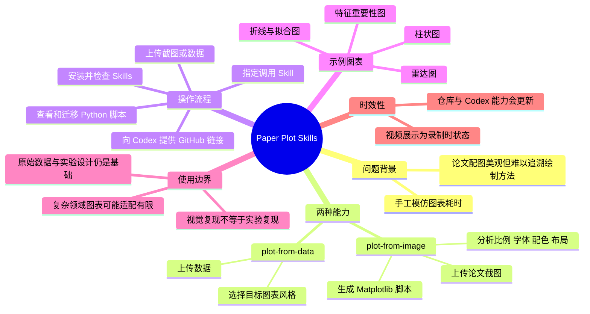
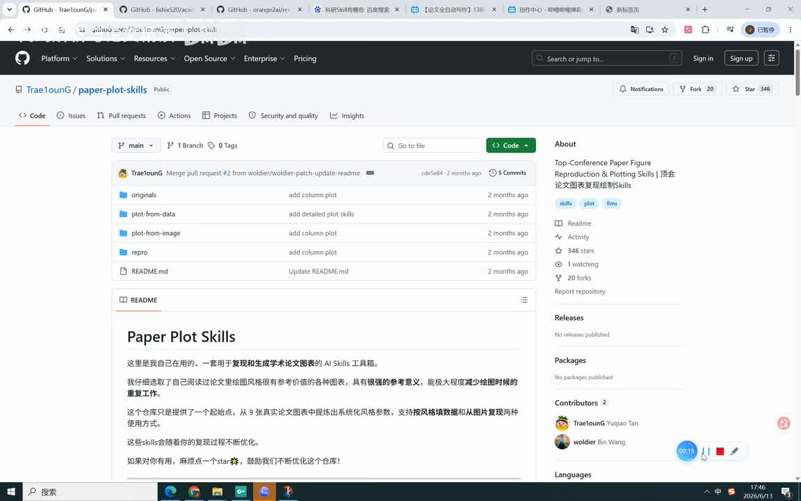
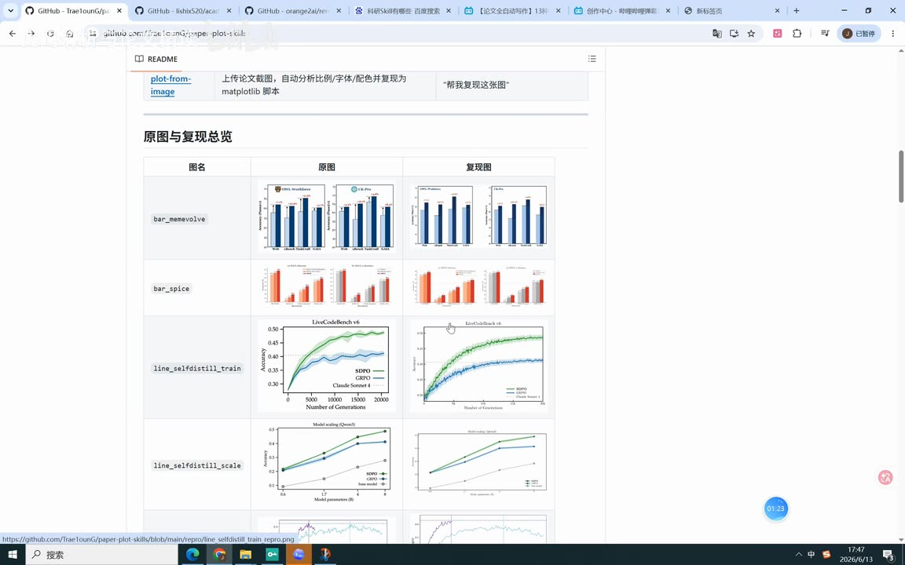
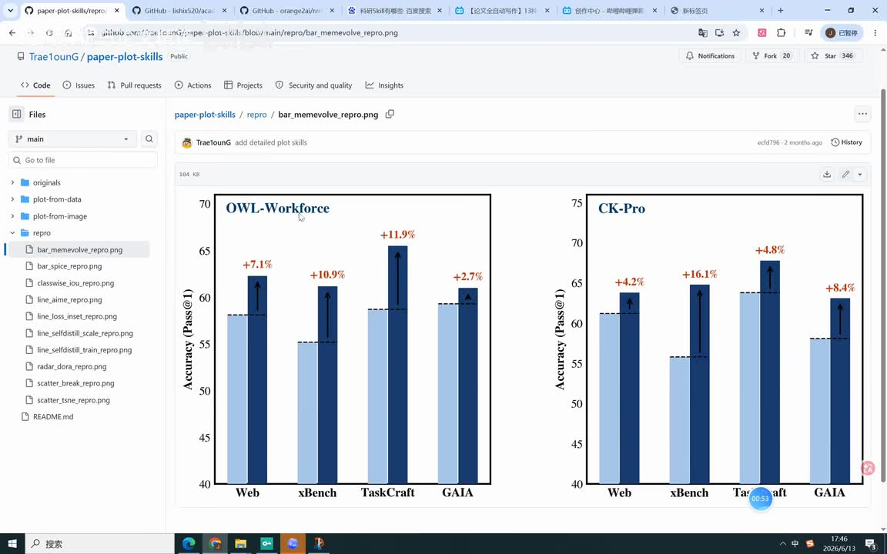

# Codex又杀疯了！论文里的顶级图表，Paper Plot Skill一句话直接复现顶刊绘图，直接1:1还原

> 来源：[Bilibili 视频](https://www.bilibili.com/video/BV1fT7j6WEH5)<br>
> UP 主：代码解析与论文精读｜视频时长：6 分 48 秒｜合集：AIcode  
> 视频描述给出的仓库：[Trae1ounG/paper-plot-skills](https://github.com/Trae1ounG/paper-plot-skills)

## 小结

本视频介绍了 `paper-plot-skills`：一套面向科研绘图复现与生成的 AI Skills 工具。视频的核心演示是把论文图表截图上传给 Codex，调用 `plot-from-image` 后，让模型分析原图的比例、字体、配色与布局，并生成以 Python / Matplotlib 为主的绘图脚本。

视频将工具能力分为两条路径：其一是 **plot-from-image**，从图片反向复现图表风格；其二是 **plot-from-data**，上传数据后选择目标图表风格，生成可用于论文的图。画面展示的示例包含柱状图、折线/拟合图、雷达图等，并对比了原始论文图与复现图。

实际操作上，UP 主建议优先把 GitHub 仓库的精确链接直接发给 Codex，让其安装 Skill；随后确认已安装的 `plot-from-image`，上传论文截图，并使用“帮我复现这张图”或明确指定 Skill 的提示词调用。视频称一次示例复现耗时约 4 分钟，完成后可查看并复用生成的 Python 脚本。

应当区分“**视觉风格复现**”与“**科研结论复现**”：该工具可以帮助复刻图的样式、组织方式和绘图代码，但不能替代原始实验数据、统计设计、方法有效性验证及论文写作中的规范引用。视频关于“1:1 还原”“任意论文图”的表述是演示者的评价与愿景，不能据此推断所有学科、所有图表类型均可无误复现。

本视频适合需要快速制作论文图、迁移图表样式、理解 Matplotlib 绘图脚本的科研人员与学生。工具、Codex 的 Skill 安装机制、仓库内容及模型效果都可能随版本变化；视频录制画面显示日期为 2026-06-13，本文只记录该视频素材中可确认的状态。

## 思维导图




## 目录

- [背景：为何需要图表复现工具](#背景为何需要图表复现工具)
- [工具与仓库概览](#工具与仓库概览)
- [两种工作模式：从图与从数据](#两种工作模式从图与从数据)
- [使用 Codex 安装和调用 Skill](#使用-codex-安装和调用-skill)
- [复现结果与脚本迁移](#复现结果与脚本迁移)
- [适用范围、限制与时效性](#适用范围限制与时效性)
- [字幕比对](#字幕比对)
- [评论分析](#评论分析)
- [处理记录](#处理记录)

## 背景：为何需要图表复现工具 [00:00](https://www.bilibili.com/video/BV1fT7j6WEH5?t=0)

视频从科研论文中“图表优美但难以知道如何绘制”的痛点开始。UP 主指出，读者可能看到期刊论文中的配图，却不知道作者具体使用了什么软件、代码或配置来完成字体、颜色和排版，因此难以模仿相近的视觉效果。

视频将 `paper-plot-skills` 定位为降低这一门槛的工具：从已有论文图片中提取其可见的图表表达形式，再生成可编辑的绘图实现。这里的“降低门槛”主要体现在：

1. 不必从零手调坐标轴、字体、颜色、图例和误差线；
2. 可以把参考论文的图表视觉语言转化为可检查的脚本；
3. 得到脚本后，可在自己的项目中替换数据并继续使用；
4. 对需要快速产出规范化科研图的场景有实际价值。

但图表外观与研究质量是两个不同层面。视频后半段强调生产效率的提升；而从科研实践看，图表是否可信仍取决于数据来源、实验控制、统计显著性、图注说明及结论是否被数据支持。

## 工具与仓库概览 [00:31](https://www.bilibili.com/video/BV1fT7j6WEH5?t=31)

根据视频描述，项目名称为 `paper-plot-skills`，GitHub 地址为：

<https://github.com/Trae1ounG/paper-plot-skills>

视频描述中列出的主要功能包括：

- 从论文图片直接复现图表：`plot-from-image`；
- 从数据直接生成适合论文使用的图：`plot-from-data`；
- 内置多个顶会论文风格模板；
- 尝试自动统一字体、配色、布局、图例（legend）与误差线（error bar）。

画面中的仓库页面显示了主要目录，包括：

- `originals`：原始参考图；
- `plot-from-data`：根据数据绘图的相关内容；
- `plot-from-image`：根据图片复现的相关内容；
- `repro`：复现结果示例；
- `README.md`：项目说明文档。



> 图：关键帧展示 `Trae1ounG/paper-plot-skills` 仓库主页、项目目录及 README 标题。它可用于确认视频讲解的具体开源项目，以及 `plot-from-data`、`plot-from-image` 与 `repro` 三类目录确实出现在录制画面中。

视频口述称工具展示了多类论文图表。由于 ASR 对“八大类”等数量性表述存在转写不确定性，本文不将其作为经独立验证的精确类别总数；可以从后续画面确认的是，示例至少涉及柱状图、折线图与其他组合图形。

## 两种工作模式：从图与从数据 [01:03](https://www.bilibili.com/video/BV1fT7j6WEH5?t=63)

### 1. `plot-from-image`：上传截图并复现可见样式

视频重点演示的是 `plot-from-image`。用户将论文中的目标图表截图上传给 Codex，并要求其复现。UP 主概括该模式会自动分析：

- 图表比例；
- 字体；
- 配色；
- 布局；

并将结果转化为 Matplotlib 脚本。需要注意，截图所含信息是视觉层面的：坐标、色彩、图例、线型、柱形排列、标题等可以被观察和近似重建；但原论文实际数据、精确统计计算过程或不可见的绘图参数，未必能只通过一张图片可靠恢复。

### 2. `plot-from-data`：上传数据并选择目标风格

另一种模式是 `plot-from-data`。视频说法是：上传数据后，在可选样式中选择所需图形或风格。UP 主列举或画面提到的图表类型包括：

- 柱状图；
- 曲线/拟合图；
- 散点图；
- 雷达图；
- 折线图；
- 用于展示特征重要性的图。

与从图片反推不同，`plot-from-data` 的关键前提是用户掌握自己的源数据。它更适合将可靠实验结果按参考风格进行展示，而不是把论文截图中的视觉数值当作可直接用于新研究的数据。



> 图：画面显示“原图与复现总览”表格，左侧为原始图，右侧为复现图，包含 `bar_memevolve`、`bar_spice`、`line_selfdistill_train`、`line_selfdistill_scale` 等示例名称。该对照是理解“从图复现”目标的直接证据：它追求的是图形结构与视觉表达的相似性。

### 视频展示的柱状图示例

视频特别展示了一组双面板柱状图，面板标题为 `OWL-Workforce` 与 `CK-Pro`，纵轴标注为 `Accuracy (Pass@1)`，横轴含 `Web`、`xBench`、`TaskCraft`、`GAIA` 等类别。图中有浅蓝和深蓝两组柱，并配有箭头、百分比增幅标注及虚线参考线。



> 图：该关键帧展示仓库 `repro` 目录中名为 `bar_memevolve_repro.png` 的图。它清楚呈现柱宽、配色、坐标轴边框、增幅文字与箭头等细节，是视频“复刻图表风格”的具体案例，而非仅有口头描述。

## 使用 Codex 安装和调用 Skill [02:13](https://www.bilibili.com/video/BV1fT7j6WEH5?t=133)

视频给出了一套以 Codex 为中心的操作顺序。以下为按视频内容整理的步骤；视频未提供具体终端命令、Codex 界面按钮路径或完整提示词模板，因此不能补写不存在的命令。

### 步骤 1：向 Codex 提供项目链接

UP 主推荐将 GitHub 上的**精确仓库链接**直接发送给 Codex，让 Codex 协助自动安装该 Skill。

- 视频认为：相较于只提供 Skill 名称，给出精确链接更准确；
- 原因是：仅输入名称时，Codex 可能找不到对应 Skill；
- 结论是：链接必须指向正确项目，才能降低安装目标不明确的风险。

可直接引用视频描述中给出的链接：

```text
https://github.com/Trae1ounG/paper-plot-skills
```

> 这不是传统意义上的安装命令。视频只演示“把链接发给 Codex，由其协助安装”的使用策略；实际是否支持、具体权限与安装流程取决于当时的 Codex 环境。

### 步骤 2：检查已安装的 Skills

安装成功后，视频建议展示或查询当前可用的 Skills，并确认列表中出现 `plot-from-image`。这是一个必要的验证环节：如果没有确认安装结果，后续即使上传图片，也无法确定模型是否真的调用了目标 Skill。

### 步骤 3：准备输入材料

根据任务选择输入：

| 目标 | 建议输入 | 视频对应模式 |
| --- | --- | --- |
| 尽量模仿一张论文图的视觉样式 | 目标图表截图 | `plot-from-image` |
| 用自己的可靠数据生成论文图 | 原始或整理后的数据 | `plot-from-data` |

若使用截图，应尽量保证截图包含完整坐标轴、图例、标题、标注及足够高的分辨率。视频没有明确说明截图质量阈值，但缺失边缘文字、图例或坐标刻度会减少模型可分析的可见信息。

### 步骤 4：明确调用意图

视频给出的基础提示语为：

```text
帮我复现这张图
```

UP 主建议使用更明确的方式：指定要调用的 Skill，再要求复现该图。这样可以减少模型把任务理解为泛泛的图片分析、文字描述或其他绘图任务的可能性。

### 步骤 5：检查产出并人工校验

视频称一次示例处理耗时约 **4 分钟**。这一时间仅是录制中单次演示的口述结果，不应视为稳定性能指标；实际耗时会受图片复杂度、模型、网络、环境和迭代次数影响。

完成后，应检查：

1. 坐标轴标题、单位和刻度是否正确；
2. 图例、颜色、线型、标记是否满足目标要求；
3. 柱形、误差线、趋势线等是否被错误解释；
4. 图中的数值是否来自自己的真实数据；
5. 导出的分辨率、文件格式与期刊要求是否匹配。

## 复现结果与脚本迁移 [04:06](https://www.bilibili.com/video/BV1fT7j6WEH5?t=246)

视频展示的主要产出不是只有一张静态图片，还包括其生成的 Python 绘图脚本。UP 主称该脚本可被迁移到自己的项目中：将其中使用的数据替换为自己的数据，即可在相近样式下重新生成图表。

这一思路的可迁移价值在于：

- **样式复用**：保留色板、字号、坐标轴样式、图例布局等；
- **数据替换**：把示例或复现过程中的数据换成自己的真实实验结果；
- **代码可审阅**：相比仅得到一张图片，脚本可以被修改、版本控制和复查；
- **批量生成**：在多组实验中复用同一套绘图结构。

但脚本迁移不应机械替换变量。不同数据的量纲、范围、类别数、误差定义和统计方法会影响纵轴范围、是否需要对数坐标、误差线含义及图例组织。换句话说，“相同风格”不意味着“相同统计呈现方式”。


> 图：该关键帧继续呈现原图与复现图的并列对照，并包含柱状与曲线类案例。它的价值在于说明项目并非只面向单一柱状图；同时也能看出这是视觉对比页面，不能据此验证底层数据、统计计算或每一个像素级细节是否完全一致。

## 适用范围、限制与时效性 [05:18](https://www.bilibili.com/video/BV1fT7j6WEH5?t=318)

### 视频中的判断

UP 主认为，这类 AI Skill 能显著降低科研绘图的时间成本，并可能打破以往由课题组积累、不易外传的绘图代码与经验壁垒。视频还预测，随着 AI 普及，科研投稿量与整体绘图水平可能上升。

这些是视频作者对技术影响的观点，不是视频内提供数据支撑的事实结论。

### 可确认的边界

1. **不能替代实验基础**  
   图表是实验与分析的表达结果。没有可靠数据、合理实验设计和充分工作量，再美观的图也不能支撑研究结论。这一点与热评中获得最多点赞的质疑相呼应。

2. **图片输入存在信息损失**  
   图像只能提供可见结果。原始数据点、精确颜色值、字体文件、绘图环境、统计代码、随机种子等，往往无法从截图中完整恢复。

3. **“1:1”应理解为目标而非保证**  
   视频用“基本上一模一样”“1:1 复原”描述示例效果，但并未给出像素差异、数值误差、字体匹配率或跨领域基准测试。因此更稳妥的表述是：它能尝试生成高度相似的可编辑图，而实际一致程度需逐图核验。

4. **图表类型与学科适配性不同**  
   常见二维柱状图、折线图、散点图可能更容易描述和复刻；地学等涉及地图投影、地层符号、空间坐标系、专业色标或复杂多面板表达的图，可能需要更专业的数据处理与绘图流程。视频未就此提供系统评测。

5. **论文伦理与版权仍需考虑**  
   参考他人图的视觉风格不等于可以直接复制其图、数据、结论或标注。若图表结构明显源于已有工作，应按研究规范引用来源；使用自己的数据时，也应确保数据处理与图表呈现可追溯。

### 时效性说明

- 元数据显示视频发布时间为 **2026-06-26**；录制画面右下角可见 **2026/6/13**。
- 仓库的目录、示例、Stars/Forks 数、安装方式及 Codex 对 Skill 的支持状态会随时间变化。
- 本文不对视频录制之后的仓库更新、模型能力变化或安装可用性作未经素材支持的断言。
- 视频元数据抓取时间为 **2026-07-13**，播放量、收藏、点赞等统计数字也仅反映抓取时状态。

## 字幕比对

本次任务**已执行 ASR**。素材中没有提供可用的 Bilibili 站内字幕，因此不能进行逐句对齐校验；正文以本次 ASR 为基础，并结合关键帧中可见的英文项目名、目录名和图表文字进行必要校正。

| 字幕来源 | 完整性 | 专有名词 | 时间轴 | 主要问题 |
| --- | --- | --- | --- | --- |
| Bilibili 站内字幕 | 未提供可用字幕 | 无法评估 | 无法评估 | 素材明确标注“未提供可用站内字幕” |
| 本次 ASR 字幕 | 覆盖完整视频口述内容，但无逐词时间戳 | 存在误识别与中英混写 | 仅能依据内容段落及关键帧估算章节时间 | 如将项目名识别为“Paper Cloud Skills”、将 `Skill` 误转为“Skyl”，以及部分图表类型、人名化词语不稳定 |

### 最终字幕选择与校正

最终采用：**本次 ASR 字幕 + 视频元数据 + 关键帧视觉校正**。

已校正或统一的重点术语如下：

| ASR 原始转写或疑似误识别 | 正文采用写法 | 校正依据 |
| --- | --- | --- |
| Paper Cloud Skills | `paper-plot-skills` / Paper Plot Skills | 视频标题、简介 GitHub 链接、关键帧仓库标题 |
| CodeX | Codex | 视频标题与上下文 |
| Skyl / Skills 混写 | Skill / Skills | 上下文为 AI Skills 安装与调用 |
| MATPLOT 脚本 | Matplotlib 脚本 | 视频口述语义及工具用途 |
| 指方图 / 制服光图 | 柱状图 | ASR 语音误识别，结合画面与上下文判断 |
| 风潮图 / 风潼图 | 特征重要性相关图（原话含混） | ASR 不稳定；视频未给出可核验的精确英文图名，避免过度校正 |

由于 ASR 没有提供词级时间码，本文时间轴为依据视频叙事进度和关键帧画面进行的章节级定位，不应视为逐句精确字幕时间码。

## 评论分析

以下仅处理素材中可获取的热评前三条。评论反映的是观众观点，不作为已经验证的技术事实。

### 1. yunqing7438（1 赞）

> “@MilkyAi 总结并发送至邮箱”

- **观点概括**：评论者希望借助 AI 对视频进行总结并通过邮件发送。
- **补充信息**：没有对工具本身的效果、安装方法或科研有效性提供实质性信息。
- **分析**：这体现了观众对自动化知识整理的需求，但未构成对 `paper-plot-skills` 能力的评价，也没有可供验证的事实主张。

### 2. 37294728（46 赞）

> “实验数据才是基础啊，光图好看，没有扎实的实验基础和工作量不是本末倒置吗”

- **观点概括**：强调实验数据与研究工作是基础，警惕把注意力过度放在图表美观上。
- **补充信息**：该评论没有否定绘图工具的效率价值，而是指出图表呈现不能取代研究本身。
- **分析**：这是与视频主题高度相关且具方法论意义的提醒。视频展示的是绘图复现能力，不包含对实验质量的验证；因此该评论提出的边界合理，但它是原则性观点，并未针对该工具给出具体测试证据。

### 3. 宁遇Arrow（2 赞）

> “对地学的复现好像不太行”

- **观点概括**：评论者认为该工具对地学图表的复现效果可能不佳。
- **补充信息**：评论未附具体输入图、失败结果、模型版本、提示词或复现环境。
- **分析**：这条评论提示跨学科泛化可能存在限制，尤其是地学图可能涉及地图投影、专业符号和空间数据处理；但由于缺少实例与测试条件，不能据此断定工具整体不支持地学，只能将其视为待进一步验证的用户反馈。

## 处理记录

- **Worker ID**：`worker-mrj0wjed-b0c290ad`
- **模型**：`gpt-5.6-terra`
- **调用工具与素材**：基于任务提供的视频元数据、视频描述、ASR 字幕、12 张关键帧路径、热评 JSON 与素材清单完成整理；未提供可执行工具调用日志。
- **使用的应用工具**：视频素材提取产物已包含 `merged.mp4`、`audio/audio.wav`、`frames/`、`comments/comments.json`、`subtitles/`、`asr/`；本文使用其中已提供的文本与关键帧信息。
- **字幕选择**：站内字幕不可用；本次 ASR 已执行并作为主体。通过标题、视频描述和关键帧校正 `paper-plot-skills`、Codex、Matplotlib 等专有名词；对无法可靠辨识的图表名称保留谨慎表述。
- **关键帧选择依据**：  
  - `frame-001.jpg`：展示 GitHub 仓库、目录和 README，用于项目身份与结构说明；  
  - `frame-002.jpg`：展示具体双面板柱状图复现结果，用于解释可复刻的视觉元素；  
  - `frame-003.jpg`、`frame-004.jpg`：展示原图/复现图对照列表，用于支撑两类图像对比与多图类型示例。  
  未使用其余帧，原因是已选画面足以覆盖仓库、具体案例与总体对照，避免重复插图。
- **评论范围**：仅分析可获取热评前三条，未扩展至其余评论。
- **缓存清理**：未提供缓存目录、删除命令或清理执行日志；无法验证缓存清理是否发生，故不作“已清理”声明。
- **未解决问题**：未提供 Codex 的实际安装日志、完整生成脚本、原始论文图来源、复现前后数值误差及跨领域测试数据；视频中的“1:1 还原”“任意图表”等强表述不能据现有素材独立验证。
