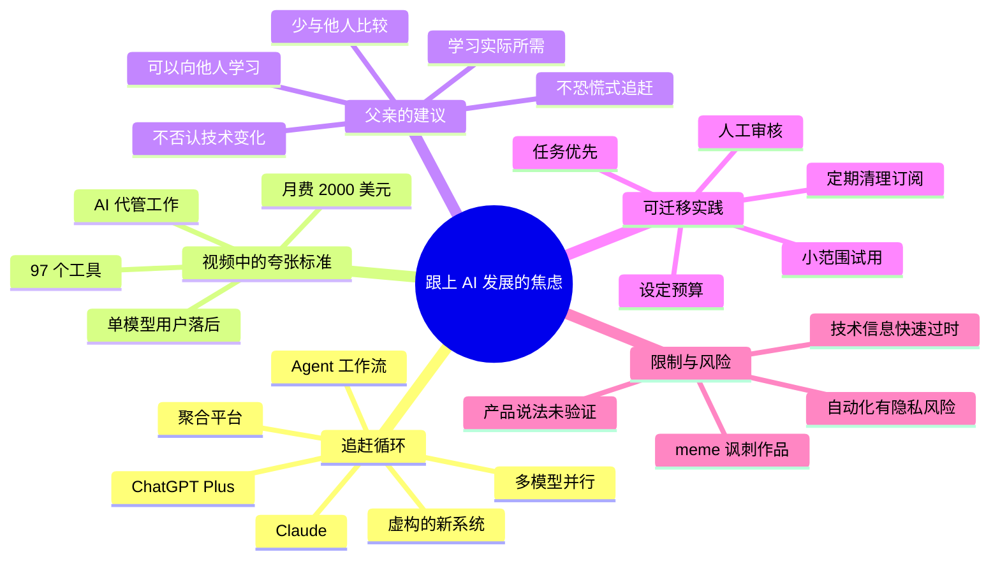

# 试图跟上ai发展就很...

> 来源：[Bilibili 视频](https://www.bilibili.com/video/BV1PoVV6UEHd) 
> UP 主：FisSion_PrOb｜合集：AIcode｜视频时长：09:00｜标签：AI、人工智能、社会、搞笑、Doomer、meme、Wojak  
> 视频简介引用原始来源链接：<https://www.youtube.com/watch?v=ACqMQAACuo8>；并附有“ai币驱逐绝大部分币”的文字说明。

## 小结

视频是一则以 Wojak/meme 角色演绎的 AI 焦虑讽刺短片。主角反复试图“跟上 AI 发展”：先订阅 ChatGPT Plus，继而被告知 Claude 才是新标准；接着又被要求同时运行 Claude、Gemini、Grok 并交叉验证；之后还被展示了多智能体工作流、聚合式 AI 平台等“更高级”的使用方式。每次刚完成升级，新的标准又立刻出现。

片中呈现的主要问题不是某一款模型的具体能力，而是**以比较、订阅数量和工具覆盖率为导向的技术追赶模式**：把“拥有更多工具”“掌握最新名词”误当成实际能力，从而不断产生落后感、订阅成本和心理疲劳。

视频给出的相对稳健的经验来自父亲角色：面对新技术，不必否认变化，也不必恐慌式追赶；应当先承认自己已有兴趣和学习意愿，再只学习真正与自身需求相关的部分，同时避免过度和他人比较。主角一度决定取消多余服务，仅保留 Claude 并聚焦实际需求。

不过，结尾马上以“Neural Sync 一夜之间超越全部模型 9000%”的虚构式新潮流反转，表明该片的核心是讽刺而非产品新闻。视频中关于 Claude、Gemini、Grok、Higgsfield、OpenArt、智能体代发邮件、月费和“Neural Sync”的陈述均应视为**角色台词或叙事夸张**，不能直接作为产品能力、价格、行业趋势或安全实践的可靠依据。

适合正在经历 AI 工具选择焦虑、订阅膨胀、职场自动化焦虑的观众阅读。实际使用中应以具体任务、预算、数据风险、人工审核要求为依据选择工具，而不是按照视频角色的夸张标准配置。

## 思维导图

## 目录

- [背景：从“订阅 AI”到“担心落后”](#背景从订阅-ai-到担心落后)
- [第一轮升级：ChatGPT、Claude 与多模型并行](#第一轮升级chatgptclaude-与多模型并行)
- [第二轮升级：从网页使用到 Agent 工作流](#第二轮升级从网页使用到-agent-工作流)
- [第三轮升级：工具堆叠、聚合平台与订阅成本](#第三轮升级工具堆叠聚合平台与订阅成本)
- [父亲的建议：学习必要内容，而非追逐全部趋势](#父亲的建议学习必要内容而非追逐全部趋势)
- [结尾反转：虚构“Neural Sync”与追赶悖论](#结尾反转虚构neural-sync与追赶悖论)
- [可执行的工具选择步骤](#可执行的工具选择步骤)
- [参数、限制与时效性](#参数限制与时效性)
- [关键帧索引](#关键帧索引)
- [字幕比对](#字幕比对)
- [评论分析](#评论分析)
- [处理记录](#处理记录)

## 背景：从“订阅 AI”到“担心落后” [00:12](https://www.bilibili.com/video/BV1PoVV6UEHd?t=12)

视频开场，主角宣布自己终于订阅了 ChatGPT Plus，并认为自己“正式成为 AI 革命的一员”。这构成整部短片的初始误区：将订阅某项热门 AI 服务等同于已经进入、理解或掌握 AI 变革。

随后，其他角色不断抬高“跟上 AI”的门槛。叙事没有介绍任务目标、工作场景或可衡量的产出改进，而是围绕“你还在用什么”“别人已换成什么”“你订了多少”展开。这种刻画指向一种常见的工具焦虑机制：

1. 某个工具成为热门选择；
2. 用户刚完成订阅或学习；
3. 他人宣称已有更新、更强或更专业的替代方案；
4. 用户为了避免显得落后而再次增加工具；
5. 新工具并未消除焦虑，反而形成更高维护成本。

视频的表现形式为办公室、地铁和家庭场景中的 meme 角色对话，具有明显喜剧和夸张属性。其目标是表达体验和情绪，而不是发布经过验证的 AI 行业报告。

> 图：画面用办公室工位和主角的夸张表情建立“普通职场人面对 AI 潮流”的情境；它有助于理解视频并非教程录屏，而是角色化讽刺叙事。

## 第一轮升级：ChatGPT、Claude 与多模型并行 [00:24](https://www.bilibili.com/video/BV1PoVV6UEHd?t=24)

角色先嘲笑主角“还在用 ChatGPT”，并声称大家在约六个月前就转向 Claude。对话中列举的理由是 Claude“写得更好、代码更好、不会每两次提示就说教”。这些是角色的主观评价，视频没有给出测试任务、模型版本、提示词、输出样本、评测指标或日期，因此不能据此比较产品能力。

主角刚准备取消 ChatGPT、改订阅 Claude，另一角色又提出新的门槛：若想“跟上”，应同时运行 **Claude、Gemini 和 Grok**，并对输出进行交叉参考；“单模型用户已经完了”。这里可以分辨两层内容：

- **可迁移的方法概念**：对重要结论进行多来源交叉验证确有价值，尤其适用于事实核验、代码审阅、方案比较和高风险决策。
- **视频中的不可靠极端化**：并不意味着每个任务都必须同时订阅或运行多个模型。多模型会提高费用、上下文管理成本、输出比较成本及数据分散风险，且“多数模型一致”也不等于内容正确。

> 图：中文画面字幕直接呈现“同时搞起 Claude、Gemini 和 Grok”的要求，是“升级标准不断加码”这一段的视觉证据；它也帮助核对 ASR 中的产品名与画面字幕。

主角在 [01:26](https://www.bilibili.com/video/BV1PoVV6UEHd?t=86) 表示“这次不会错过炒作列车”。这句台词明确了其行动驱动力是害怕错过（FOMO），而非问题导向的工具评估。

## 第二轮升级：从网页使用到 Agent 工作流 [01:43](https://www.bilibili.com/video/BV1PoVV6UEHd?t=103)

主角完成 Claude 订阅后，自认为“回到游戏中”，但同事立即问他是通过网站使用，还是通过“自己的 pipeline（流水线）”使用。主角回答“网站”，于是又被隐含为较初级的用法。

在 [02:10](https://www.bilibili.com/video/BV1PoVV6UEHd?t=130)，同事描述自己在后台运行了一个“agent stack（智能体栈）”：

| 片中分工 | 角色所称职责 | 视频未提供的信息 |
| --- | --- | --- |
| Claude | 写作 | 具体模型版本、权限和写作任务 |
| 另一智能体 | 研究 | 信息来源、事实核查机制、引用规则 |
| 另一智能体 | 安排会议 | 日历授权范围、冲突处理与人工确认 |
| 另一智能体 | 处理邮件 | 邮箱访问权限、发送审批、隐私控制 |
| 工作流工具 | 让智能体彼此交流 | 工具名称、节点逻辑、错误恢复与审计日志 |

> 图：画面字幕列出了写作、研究、会议和邮件分工，并说明它们在工作流中交流；这使“多智能体工作流”在视频中的叙事位置和任务划分更直观。

该角色进一步声称：自己已有三个月没打开收件箱，智能体已学会他的语调和声音，甚至上周代为谈成 **12% 加薪**，经理还以为电话另一端是本人；他远程工作时可去健身或度假，只在周一工作。这些说法是为了制造荒诞效果，视频没有提供任何可验证证据。

尤其应注意，现实中让 AI 自动阅读、生成或发送邮件，或者代替本人参与薪资谈判，涉及以下限制：

- **身份与授权**：不得在未披露或未获授权的情况下冒充本人进行关键沟通。
- **隐私与数据最小化**：邮箱和日历常含客户、同事及企业敏感信息，接入前需明确第三方处理范围与组织政策。
- **人工审核**：报价、合同、薪酬、招聘、付款、账户与法律事项不宜设置无审核自动发送。
- **可追溯性**：需要保留输入来源、草稿、审批记录、操作日志和失败处理机制。
- **可靠性**：智能体可能误解上下文、调用错误工具、重复执行或未执行操作；不能因自动化而放弃监督。

片中“手动提示词已经有点是老年人才做的事”的说法同样是嘲讽性台词。手动提示、模板提示和工作流自动化各有适用边界，不能按“先进/落后”的二元标准评价。

## 第三轮升级：工具堆叠、聚合平台与订阅成本 [04:24](https://www.bilibili.com/video/BV1PoVV6UEHd?t=264)

经过一段无语和转场后，主角展示自己已几乎拥有“所有存在的 AI 模型”，并说自己前一晚“All-in”，拥有几乎所有重要 AI 工具。对话给出量化的荒诞参数：

| 项目 | 片中数值或说法 | 证据性质 |
| --- | --- | --- |
| 已拥有 AI 工具数量 | 97 个 | 角色自述 |
| 目标数量 | 午饭前达到 100 个 | 角色自述 |
| 多订阅月成本 | 2,000 美元/月 | 角色自述 |
| 对比对象成本 | 其兄弟约 30 美元/月即可访问“一切” | 角色自述 |
| 平台例子 | Higgsfield、OpenArt | 角色举例，非评测或推荐 |
| 聚合平台能力 | 图片、视频、语音在同一池中按需选用 | 角色描述 |
| 模型接入速度 | 新模型发布当天就添加 | 角色主张，未验证 |

在 [04:49](https://www.bilibili.com/video/BV1PoVV6UEHd?t=289)，另一角色认为没人再单独下载应用，而应使用“combined platforms（聚合平台）”；并以 Higgsfield 和 OpenArt 为例，称一个平台可在同一资源池使用图像、视频和语音生成能力，不再需要 50 个独立订阅。主角反驳“每个应用都更擅长特定事情”，对方则称这只是几个月前的情况，平台已经追上且会快速加入模型。

这段并未裁定哪一种模式一定更优，而是展示“行业标准不断被别人重新定义”的叙事压力。现实选择可以按下面的取舍判断：

| 选择 | 可能优势 | 典型限制 |
| --- | --- | --- |
| 单一专业工具 | 功能深入、工作流稳定、支持与权限更明确 | 覆盖面有限，可能需额外工具 |
| 多个独立订阅 | 便于选用特定工具的独有能力 | 成本高、账号与素材分散、学习负担大 |
| 聚合平台 | 统一入口、便于试用多模型、可能降低订阅数量 | 可用模型、额度、输出控制、隐私条款和更新速度需逐项核实 |
| API/自建工作流 | 可编排、可审计、适合重复任务 | 要求工程能力，仍须承担密钥、费用、失败恢复和安全责任 |

视频中“2,000 美元/月对比 30 美元/月”的数字只服务于夸张冲突，不能外推为现实平均价格。订阅费用、免费额度、地区可用性、API 计费、模型接入范围均会随平台和日期变化。

## 父亲的建议：学习必要内容，而非追逐全部趋势 [06:14](https://www.bilibili.com/video/BV1PoVV6UEHd?t=374)

主角向父亲坦言：自己连续数周试图跟上 AI，却每天都感到更加落后；他提到同事“把自己完全外包给 AI”，又提到有人认为自己订阅花费过多。父亲先将 AI 误解为电子游戏，主角把它解释为“像人一样思考的机器人”，父亲又将其类比为 Microsoft Word。这个轻松的错位梗表明，视频并不试图严格界定人工智能。

真正的建议出现在 [07:00](https://www.bilibili.com/video/BV1PoVV6UEHd?t=420) 至 [07:31](https://www.bilibili.com/video/BV1PoVV6UEHd?t=449)：

1. 父亲回忆，互联网、智能手机、社交媒体兴起时，人们也曾集体恐慌。
2. 他认为极力恐慌、极力否认的人更可能落后。
3. 但那些放慢节奏、只学习自己所需要内容的人，也过得不错。
4. 已经愿意接触并对新技术有真实兴趣，本身就说明并非完全落后。
5. 不必过度比较，但向他人学习也并无错误。

这不是“完全忽视 AI”的建议，而是一种介于技术拒斥和工具囤积之间的策略：**有选择地学习、根据实际任务应用、保留独立判断**。

主角对此表示释然。紧接着父亲请他周末来帮忙处理打印机，形成反差：即便能谈论新技术，日常设备问题仍可能需要他人帮助；技术熟练度不应被简化成是否追到最新模型。

## 结尾反转：虚构“Neural Sync”与追赶悖论 [07:48](https://www.bilibili.com/video/BV1PoVV6UEHd?t=468)

主角决定停止追逐全部趋势，取消除 Claude 之外的订阅，专注实际需求。这是全片最接近可执行策略的转折。但他刚作出决定，就听闻当天又有“announcement（公告）”。

对话声称：

- 新系统“一个晚上杀死整个行业”；
- 人们不再使用语言模型；
- 新系统不需要提示词，只要“思考”就能完成任务；
- 名称似乎是 “Neural Sync”；
- 所有人当天都在切换；
- 它在一夜间超过所有 AI 模型 **9000%**。

这些台词均没有来源、产品页面、发布者、演示、技术参数或第三方验证，并采用明显的绝对化和夸张数字。因此，本文将 “Neural Sync” 视为视频为反转效果构造的**虚构或未证实叙事元素**，不将其记录为真实产品或行业新闻。

结尾主角因自己刚花一晚了解“所有 AI 模型”而崩溃，另一角色说这时已可以忘掉它们，因为 Neural Sync 已全面超越。这一结局回扣全片主题：如果把“永远掌握全部最新技术”当作目标，那么技术更新本身会使目标不可完成；将能力建设建立在任务、基础方法和可验证成果上，才不会被每一轮叙事性热点完全打断。

> 图：画面中的“订阅上 Claude 了，哥们重回主战场”对应主角每次短暂获得安全感的时刻；它为结尾再次被新潮流冲击的反差提供了视觉铺垫。

## 可执行的工具选择步骤 [07:00](https://www.bilibili.com/video/BV1PoVV6UEHd?t=420)

以下步骤不是视频直接展示的操作教程，而是基于视频“只学习需要内容、不要比较式追赶”的观点整理出的低风险实践框架；它不构成对任何产品的推荐。

### 1. 先写清一个任务，而不是先列工具名

用一句话界定需求，例如：

- “把每周会议录音整理成待办事项，并由我确认后发送。”
- “为固定格式的报告生成初稿，但引用必须可追溯。”
- “批量生成社交媒体配图，接受一定风格差异。”
- “辅助解释代码报错，但不自动部署或修改生产环境。”

避免将“学会所有模型”“订满所有 AI 服务”设为目标，因为它们没有可验证的完成标准。

### 2. 为任务定义验收指标

在订阅前记录成功条件，例如：

| 维度 | 可操作的问题 |
| --- | --- |
| 准确性 | 是否有事实错误、遗漏或幻觉？ |
| 时间 | 是否比原流程显著节省时间？ |
| 成本 | 订阅费、按量费用和人工复核时间合计多少？ |
| 可控性 | 能否导出结果、复现步骤、查看使用记录？ |
| 隐私 | 是否会上传客户、公司或个人敏感数据？ |
| 审核 | 哪些环节必须由人最终批准？ |

### 3. 从最小工具组合开始试用

对一个任务先选一个最合适的工具或平台，在有限样本上测试。若结果无法满足指标，再明确缺口：是需要第二模型复核、需要专业工具，还是应改善输入材料和人工流程。不要仅因“别人都在用”而增加订阅。

### 4. 对高影响输出保留人工确认

特别是邮件外发、会议安排、费用、薪资、合同、代码执行、账号权限和对外公开内容，应采用“生成草稿—人工复核—明确批准—再执行”的流程。视频里智能体自行回邮件和谈薪的情节不应被直接模仿。

### 5. 建立订阅和权限台账

至少记录：

- 工具名称、用途、负责人；
- 月费或按量预算；
- 是否使用工作账号；
- 上传的数据类型；
- 已授予的邮箱、日历、云盘、代码仓库等权限；
- 续费日期及取消方式；
- 是否存在人工审批和审计日志。

### 6. 以固定周期复盘，而非实时追逐发布

可按月或按季度检查：该工具是否仍有明确产出、成本是否合理、是否出现更合适替代方案。这样既能持续学习，也不会因每天的新品消息而频繁重构工作流。

## 参数、限制与时效性 [04:24](https://www.bilibili.com/video/BV1PoVV6UEHd?t=264)

### 视频中出现的名称与数字

| 内容 | 视频中出现的位置 | 应如何理解 |
| --- | --- | --- |
| ChatGPT Plus | [00:12](https://www.bilibili.com/video/BV1PoVV6UEHd?t=12) | 主角的初始订阅，不含套餐价格或版本信息 |
| Claude | [00:28](https://www.bilibili.com/video/BV1PoVV6UEHd?t=28) | 被角色称为更优选择，属于主观台词 |
| Gemini、Grok | [00:58](https://www.bilibili.com/video/BV1PoVV6UEHd?t=58) | 被要求与 Claude 并行交叉参考，不代表必需配置 |
| Agent Stack / Workflow Tool | [02:10](https://www.bilibili.com/video/BV1PoVV6UEHd?t=130) | 概念性描述，没有工具名、配置和实现细节 |
| 12% 加薪 | [02:42](https://www.bilibili.com/video/BV1PoVV6UEHd?t=162) | 角色夸张经历，未验证 |
| 97 个工具、目标 100 个 | [04:31](https://www.bilibili.com/video/BV1PoVV6UEHd?t=271) | 用于讽刺工具囤积，非建议参数 |
| Higgsfield、OpenArt | [04:56](https://www.bilibili.com/video/BV1PoVV6UEHd?t=296) | 角色举的聚合平台例子，功能与价格需单独核验 |
| 2,000 美元/月、30 美元/月 | [05:36](https://www.bilibili.com/video/BV1PoVV6UEHd?t=336) | 叙事对比数字，不能作为市场价格 |
| Neural Sync、9000% | [08:00](https://www.bilibili.com/video/BV1PoVV6UEHd?t=480) | 无证据支持的夸张反转，不应视为真实技术新闻 |

### 信息边界

- 视频标题、标签和叙事均显示其为搞笑/meme 内容；不宜把角色对模型优劣、平台覆盖、订阅价格或行业替代关系的判断当作事实。
- 视频没有提供测试集、提示词、模型版本、上下文长度、延迟、价格页、截图、工作流配置、代码或实际输出，因此无法复现其中的任何产品比较。
- “AI 可以代管邮件、协商加薪、仅周一工作”的表达没有披露授权、合规或安全条件，现实中风险很高。
- AI 产品、套餐、可用地区、模型接入和计费结构变化快。即使视频提到的服务当时存在，具体能力也必须以使用当日的官方说明、组织政策和实际测试为准。
- 元数据记录的发布时间为 2026-05-30；本整理仅描述所给素材内容，未对其后的产品更新或公告进行外部验证。

## 关键帧索引 [00:58](https://www.bilibili.com/video/BV1PoVV6UEHd?t=58)

| 关键帧 | 正文用途 | 选择依据 |
| --- | --- | --- |
|  | 背景段落 | 建立职场 AI 焦虑与 meme 演绎形式 |
|  | 第一轮升级 | 画面字幕明确出现 Claude、Gemini、Grok 的并行要求 |
|  | 结尾反转铺垫 | 呈现主角短暂“重返赛场”的心理状态 |
|  | Agent 工作流段落 | 画面字幕完整列出写作、研究、会议、邮件和工作流协作 |

其余已提供关键帧未在正文重复插入：当前四帧已覆盖视频的核心叙事节点，且与 ASR 的明确时间段、可见中文字幕和主题对应最直接。本文未对未展示内容的帧强行推断画面含义。

## 字幕比对 [00:12](https://www.bilibili.com/video/BV1PoVV6UEHd?t=12)

| 字幕来源 | 完整性 | 专有名词 | 时间轴 | 主要问题 |
| --- | --- | --- | --- | --- |
| Bilibili 站内字幕 | 未提供可用字幕 | 无法评估 | 无法评估 | 抓取过程返回 `Invalid URL`，素材中没有可使用的站内 SRT |
| 本次 ASR 字幕 | 72 段英语语音，覆盖约 321.08 秒，占 539.56 秒视频约 59.51% | 基本识别出 ChatGPT、Claude、Gemini、Grok、Higgs Field、Open Art、Neural Sync | 完整提供分段起止时间，可直接换算并用于本文链接 | 存在叙事留白和转场造成的大间隔；个别词形不稳定，如 `ChatGpT`、`Clawde`、`Duma`、`amps` |

本次 ASR 已实际检查：识别语言为英语，语言置信度约 **0.9902**，模型标记为 `medium`，音频时长约 **539.56 秒**，并**没有** `noAudioStream=true` 标记。因此，源视频有可识别音轨；字幕不足并非无音轨导致。

最终正文以**本次 ASR 的带时间戳分段**作为时间轴依据，并结合提供关键帧中的可见中文字幕校对专有名词和语义。由于没有可用站内字幕，不能进行逐句差异比较。重要校正如下：

- ASR 中的 `Clawde` 按上下文及画面字幕统一记为 **Claude**。
- `ChatGpT` 统一规范为 **ChatGPT**。
- ASR 中的 `Higgs Field`、`Open Art` 在正文保留为角色所述的 **Higgsfield、OpenArt**，但不据此确认官方拼写、服务状态或具体能力。
- `Duma life` 和 `amps` 的含义无法单凭素材可靠确定，正文未将其扩写为事实。
- ASR 诊断的最大静音/无语音间隔是 [03:22–04:24](https://www.bilibili.com/video/BV1PoVV6UEHd?t=202)，约 62.11 秒。本文不把这段无 ASR 台词的画面内容虚构为新的观点。

## 评论分析

以下仅基于可获取热评前三条，评论是观众反应，不是经过验证的事实或产品建议。

1. **kuronig（536 赞）**：“一个月不学完全跟不上，一年不学一点没落下”。  
   - 观点：用矛盾式表达总结 AI 领域高频更新带来的短期焦虑，以及长期回看时部分热点并未形成根本差距的体验。  
   - 与视频关系：呼应视频“刚学会就过时”的循环和结尾反转。  
   - 可信度边界：这是个人感受，不可推导为停止学习不会造成能力差异；不同职业和任务对更新的敏感度不同。

2. **分词杠（243 赞）**：“不跟风龙虾今天依旧0损失好吧”。  
   - 观点：以“龙虾”这一网络化代称调侃不跟风者没有因 AI 热潮而产生直接损失。  
   - 与视频关系：呼应主角因订阅、工具堆叠而承担成本的讽刺。  
   - 可信度边界：评论没有说明“损失”的定义，且不追随热点也可能错过对某些实际任务有价值的效率提升，不能理解为拒绝尝试 AI 的普适建议。

3. **QiQiKanna（220 赞）**：“写作业已经离不开AI了[doge]”。  
   - 观点：表达 AI 已进入日常学习流程，带有表情符号，语气偏轻松。  
   - 与视频关系：补充了片中以职场为主的场景，显示学生群体也可能产生工具依赖。  
   - 可信度边界：未说明 AI 的具体用途、审核方式或学习效果；若用于作业，应遵守课程规定、核验内容并保留自己的理解和署名责任。

## 处理记录

- **Worker ID**：worker-mrj0wjed-b0c290ad
- **模型**：gpt-5.6-terra
- **调用工具与素材**：视频元数据、关键帧提取结果、音频 ASR 结果（`medium`）、ASR SRT 时间轴、ASR 覆盖诊断、热评 JSON。
- **站内字幕检查**：未获取到可用站内字幕；素材警告为字幕工具进程返回 `Invalid URL`。该情况不等同于源视频没有音轨。
- **ASR 检查与字幕选择**：已检查本次 ASR；检测到英语音轨，带时间戳 72 段，且未标记 `noAudioStream=true`。最终采用 ASR SRT 的真实起止时间建立 Bilibili 时间轴，并以关键帧可见中文字幕辅助校对。
- **关键帧选择依据**：选用 `frame-001` 至 `frame-004`，因为它们分别覆盖办公室背景、多模型并行要求、Claude 订阅后的短暂安全感、Agent Stack 任务分工；均与正文讨论的核心节点直接相关。
- **评论处理范围**：仅处理接口提供的热评前三条，未扩展到其他评论或将评论观点当作事实。
- **缓存清理**：本次仅基于任务已提供的素材清单生成文档；未执行额外下载、转码或可报告的缓存写入操作，因此无额外缓存清理记录。
- **未解决问题**：无法核验原始英文视频或站内字幕；无法确认视频中提及平台在该视频时间点的真实功能、价格和可用模型；“Neural Sync”缺少可验证来源，按讽刺性未证实内容处理。
