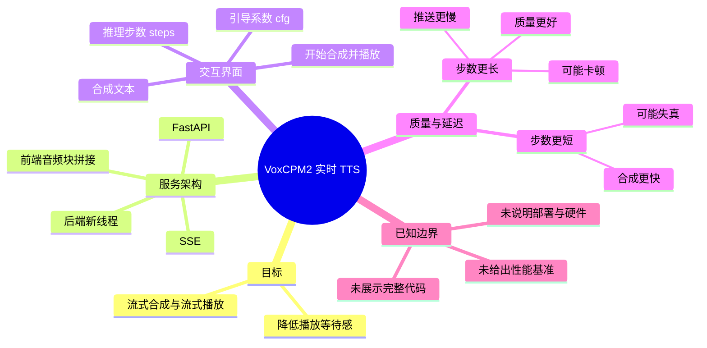
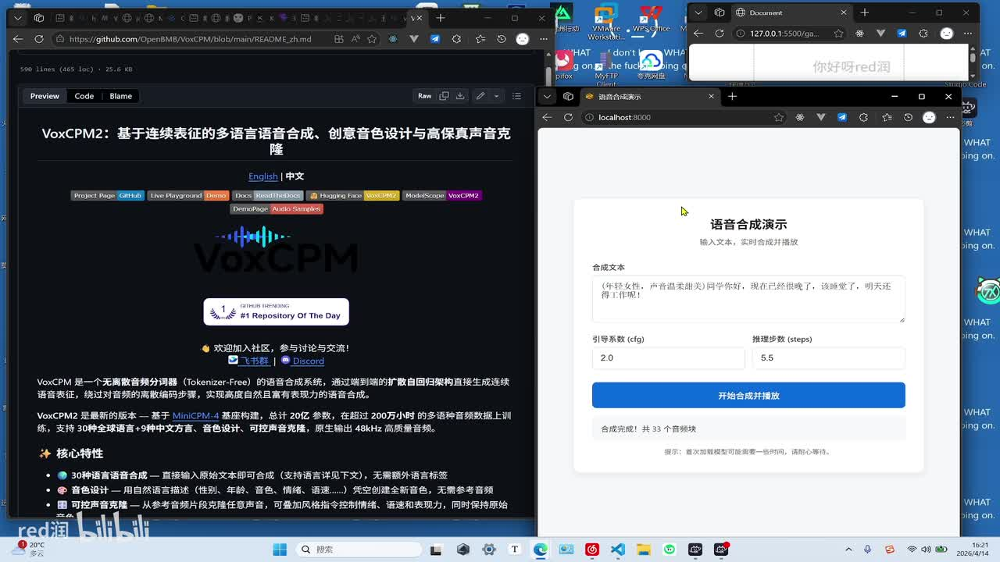
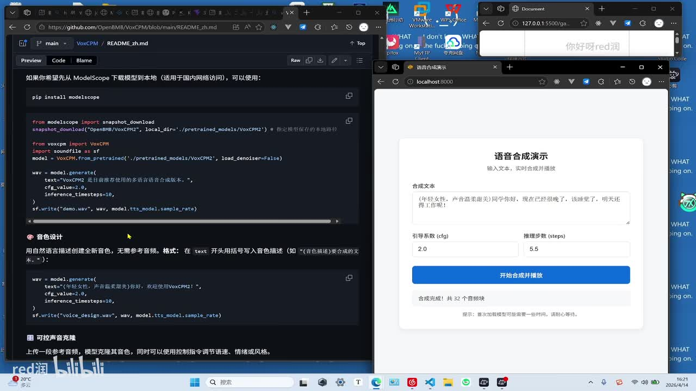
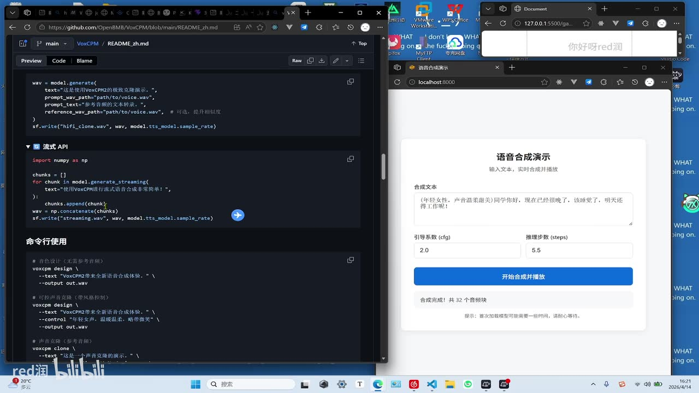
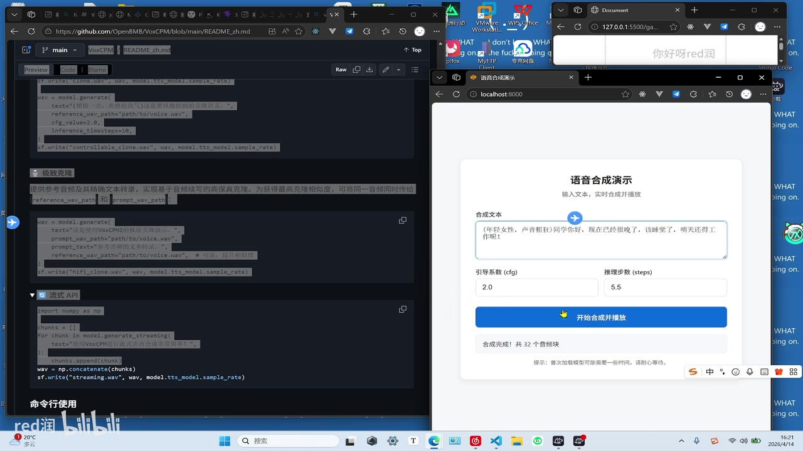

# 我做了一个毫秒级TTS语音合成项目

> 来源：[Bilibili 视频](https://www.bilibili.com/video/BV1d5QvBnEjv) 
> UP 主：red润｜视频时长：03:23｜简介：基于 VoxCPM2 的实时语音合成 
> 数据抓取时间：2026-07-16；视频页面显示统计数据会随时间变化。

## 小结

视频展示了一个基于 **VoxCPM2** 的实时文本转语音（TTS）网页项目。UP 主将模型的流式生成能力封装进 FastAPI 服务，再通过 SSE（Server-Sent Events）持续向浏览器推送音频字节流；前端将音频块逐步拼接并开始播放，以减少用户等待整段语音完全生成的时间。

项目的核心不是宣称模型总推理耗时为某个固定毫秒数，而是通过“**分段生成—分段传输—前端尽早播放**”降低首段声音到达后的感知等待。视频中“毫秒级”属于作者对交互效果的描述，未提供首包延迟、端到端延迟、硬件环境、并发量或基准测试数据，因此不能据此推导可复现的定量性能结论。

可调参数包括界面上的 `cfg`（引导系数）与 `steps`（推理步数）。视频重点说明：推理步数增加通常有助于音频质量，但会让音频块生成和推送更慢、实时播放可能产生卡顿；步数太短则速度快，但声音可能失真、听感异常。作者的实际建议是，在实时 SSE 场景中将推理步数设得较短，但需要根据质量要求取舍。

从画面可见，网页允许输入待合成文本、填写 `cfg` 与推理步数，并点击“开始合成并播放”；一次示例显示“合成完成！共 32 个音频块”，另一处显示 33 个音频块。该数字反映对应演示文本与配置下的分段结果，不应当作所有输入都会产生固定块数的参数。

适合希望把流式 TTS 接入 Web 前端的开发者参考。视频展示了系统结构与使用效果，但未公开完整项目代码、接口格式、鉴权、部署方式、异常处理、浏览器音频解码策略及硬件配置；若要投入生产，还需自行补全这些环节。

## 思维导图

## 目录

- [项目目标与演示界面](#项目目标与演示界面)
- [流式 TTS 的服务链路](#流式-tts-的服务链路)
- [参数、示例与质量—延迟权衡](#参数示例与质量延迟权衡)
- [实现步骤与可复用经验](#实现步骤与可复用经验)
- [结论、限制与时效性](#结论限制与时效性)
- [字幕比对](#字幕比对)
- [评论分析](#评论分析)
- [处理记录](#处理记录)

## 项目目标与演示界面 [00:00:01](https://www.bilibili.com/video/BV1d5QvBnEjv?t=1)

视频开头将项目描述为基于 VoxCPM2 的实时语音合成。ASR 把模型名多次识别为“WorksCPM2”“流 CPI”等，但画面左侧 GitHub README 标题明确显示为“**VoxCPM2**”，且视频简介、标签也均写为 `voxcpm2`，因此本文统一采用 VoxCPM2。

作者演示的目标是：点击播放后，用户无需等待整段语音都生成完成即可听到声音。演示文本包含“现在已经很晚了，该睡觉了，明天还得工作呢”等句子，页面同时用于展示文本输入、参数输入和播放触发。

> 图：左侧是 VoxCPM2 的 GitHub README，右侧是本地 `localhost:8000` 的“语音合成演示”页面。该帧直接佐证了模型名称、网页交互形态，以及项目并非仅停留在命令行推理。

### 页面中可见的操作项 [00:00:25](https://www.bilibili.com/video/BV1d5QvBnEjv?t=25)

界面上可见以下字段和状态：

| 项目 | 画面中可见内容 | 作用或含义 |
| --- | --- | --- |
| 合成文本 | 多行文本输入框 | 输入需要实时合成的文字；示例还带有括号形式的声音描述。 |
| 引导系数（cfg） | 示例值 `2.0` | 可调生成配置；视频只说明“可以改变声音效果”，未解释其精确定义或推荐范围。 |
| 推理步数（steps） | 示例值 `5.5` | 影响质量与实时性，是视频重点讨论的取舍参数。 |
| 按钮 | “开始合成并播放” | 触发文本合成与前端播放流程。 |
| 完成信息 | “合成完成！共 32 个音频块”或“共 33 个音频块” | 提示本次任务已收到并处理多个音频块。 |

> 图：README 中展示了模型加载及 `generate` 调用示例；右侧页面显示 `cfg=2.0`、`steps=5.5`。它说明前端参数与模型侧生成参数存在对应关系，但视频没有展示实际后端如何校验、换算或限制这些输入。

## 流式 TTS 的服务链路 [00:01:43](https://www.bilibili.com/video/BV1d5QvBnEjv?t=103)

作者表示项目代码量约为“几百行”，其中关键是 SSE 服务。根据视频口述，处理链路可整理为：

1. 前端通过接口向 SSE 服务传递字符串，即要实时合成的文本。
2. 后端调用模型的流式 API。
3. 模型不必等到完整音频全部完成，而是逐段返回合成音频的字节流。
4. 后端在收到流式结果后，新开线程执行实时语音合成相关处理。
5. 后端将得到的音频数据继续返回前端。
6. 前端逐步接收音频块，拼接完成可播放部分后开始播放。

这里的“SSE”是服务端向客户端持续发送事件的 HTTP 单向流机制。视频的方案中，SSE 负责让后端持续向浏览器下发结果；而浏览器端的重点是不能只等最终文件，而是需要处理连续到来的音频块。

> 视频表述中将模型侧过程称作“流式 API”并称其“识别完成之后”返回音频字节流；在 TTS 语境下，应理解为模型的流式生成过程，而非把它确认成独立的语音识别（ASR）服务。由于未展示接口源码，具体 API 名称、请求/响应协议和音频编码格式均未知。

### 流式生成接口的画面线索 [00:02:01](https://www.bilibili.com/video/BV1d5QvBnEjv?t=121)

画面中的 VoxCPM2 README 可见“流式 API”示例，其结构包括遍历 `model.generate_streaming(...)` 产生的 `chunk`、收集各个块、再将块拼接为完整波形并写出文件。这与作者所述的“模型分段产生字节流、前端拼接播放”的总体思路一致。

> 图：左侧文档出现“流式 API”及 `generate_streaming` 相关代码结构，右侧网页显示“合成完成！共 32 个音频块”。该帧对“以音频块为单位处理”的叙述有直接的多模态依据；不过截图未展示作者自己的 FastAPI 路由代码。

## 参数、示例与质量—延迟权衡 [00:01:00](https://www.bilibili.com/video/BV1d5QvBnEjv?t=60)

作者用相同或相近的示例文本反复播放不同推理步数下的效果，并给出以下经验判断：

- **推理步数更长**：音频质量更好。
- **推理步数过长**：每个音频片段产生得慢，在 SSE 持续推送的场景中，前端可能等待下一片段，表现为卡顿。
- **推理步数较短**：合成速度更快，数据块更快到达前端，更利于持续播放。
- **推理步数过短**：音频可能失真，听起来“很奇怪”。

因此，实时系统的优化目标不是孤立地把每次推理做得最长或最短，而是保证音频块到达的节奏能维持前端连续播放，并在可接受的失真范围内控制步数。

### 视频中出现的参数值 [00:00:49](https://www.bilibili.com/video/BV1d5QvBnEjv?t=49)

视频没有给出系统性的参数表或推荐的生产配置，但画面中可以确认以下实例：

| 参数或结果 | 可见值 | 证据与边界 |
| --- | ---: | --- |
| `cfg` | `2.0` | 演示界面可见；作者称可改变声音效果，但未说明变化规律。 |
| `steps` | `5.5` | 演示界面可见；是实时性与质量权衡的核心。 |
| README 静态生成示例 `inference_timesteps` | `10` | 左侧文档示例可见，属于文档调用示例，不能等同于网页实时服务的实际参数。 |
| 音频块数量 | `32`、`33` | 分别见不同画面中的完成提示，受具体文本和运行情况影响。 |

> 图：右侧演示页面聚焦文本框、`cfg=2.0`、`steps=5.5` 与开始按钮；左侧仍可见流式 API 代码。该帧有助于理解“用户输入—参数配置—流式处理—播放”的操作闭环。

## 实现步骤与可复用经验 [00:02:01](https://www.bilibili.com/video/BV1d5QvBnEjv?t=121)

以下是依据视频所述架构整理的实现顺序；其中“应自行补充”的项不代表视频已实现，而是将视频方案落地时不可忽略的工程环节。

1. **准备可流式生成的 TTS 模型**
   - 视频所用模型为 VoxCPM2。
   - 优先确认模型接口是否支持逐块生成；画面中的 README 显示 `generate_streaming(...)` 形式的调用线索。
   - 如果模型只支持整段 `generate(...)`，即使外层采用 SSE，也无法获得模型端的逐块产出优势。

2. **建立后端服务**
   - 作者使用 FastAPI。
   - 服务接收前端传来的文本字符串。
   - 后端调用模型流式 API，并处理持续产生的音频结果。
   - 视频提到后端“开了一个新的线程”，但没有说明线程生命周期、任务队列、GPU 并发控制或取消策略。

3. **以 SSE 推送连续结果**
   - 服务端在每个音频片段可用后尽快推送给前端。
   - SSE 适合服务端持续向网页单向传送事件；若需要客户端实时回传取消、暂停或更复杂的双向状态，视频未讨论是否需要其他通信方式。
   - 音频块的 MIME 类型、编码格式、二进制转码方式、事件字段名均未公开，不能从视频补写为确定实现。

4. **前端接收并管理音频块**
   - 作者的描述是前端将音频数据“一点一点地拼接”，有音频块后即开始播放。
   - 这一步决定了用户是否真能提前听到内容：仅把全部片段下载后再合成播放，并不能达到视频强调的实时体验。
   - 视频没有展示 Web Audio API、`MediaSource`、`AudioContext` 或 HTML `<audio>` 的具体实现，实际选型须根据音频编码和浏览器兼容性自行验证。

5. **调节推理步数并试听**
   - 以连续播放是否稳定、声音是否明显失真为主要观察点。
   - 作者明确建议实时 SSE 情形下使用较短的推理步数，但没有给出普适的数值阈值。
   - `cfg=2.0`、`steps=5.5` 是演示值，不构成通用推荐配置。

## 结论、限制与时效性 [00:02:57](https://www.bilibili.com/video/BV1d5QvBnEjv?t=177)

该项目的可迁移经验是：要改善实时 TTS 的主观响应速度，应将优化范围扩展到模型输出、后端传输和前端播放三个阶段。模型能逐块生成、后端能及时推送、前端能在完整音频前消费数据，三者缺一不可。

但“点击即听到声音”“毫秒级”的效果在本视频中仅为演示性结论，尚缺少以下决定可复现性的指标：

- 首个音频块生成时间、首包网络时间、首声播放时间及完整音频生成时间；
- 使用的 GPU/CPU、显存、模型精度、操作系统与依赖版本；
- 输入文本长度、音频采样率、编码格式和单块时长；
- 单用户与多并发场景下的吞吐量、排队延迟和资源占用；
- SSE 断连重连、浏览器兼容性、音频缓冲不足、异常恢复与安全控制；
- 模型许可、声音克隆或声音描述功能的使用边界。画面中 README 出现音色设计、可控声音克隆等内容，但视频没有展开项目是否启用这些能力。

本条视频发布于 **2026-04-14**（以素材元数据为准），素材抓取于 2026-07-16。VoxCPM2 的仓库文档、模型接口、依赖包和作者项目代码均可能在之后更新；本文只记录该视频及所给关键帧中可核验的状态，不将其视为当前版本的官方部署文档。

## 字幕比对

| 字幕来源 | 完整性 | 专有名词 | 时间轴 | 主要问题 |
| --- | --- | --- | --- | --- |
| Bilibili 站内字幕 | 未提供可用字幕 | 无法核验 | 无法核验 | 素材记录显示字幕工具请求因 `Invalid URL` 退出，未取得站内字幕。 |
| 本次 ASR 字幕 | 共 12 段，覆盖约 176.87 秒语音；视频总时长约 202.27 秒 | 存在误识别 | 有逐段起止时间，可直接用于章节链接 | 将 “VoxCPM2”误作“WorksCPM2”；将“流式 API”“SSE 服务”“字符串”“推理步数”等多处识别为近音词；51.60—60.56 秒存在约 8.96 秒无语音段。 |

最终采用 **本次 ASR 的时间戳与口述内容**，并结合视频简介、标签和关键帧对术语进行谨慎校正。源音频存在：ASR 诊断未标记 `noAudioStream=true`，且识别语言为中文、置信概率约 `0.9990`，因此不存在“无音轨而改用视觉理解”的情形。

重要校正如下：

- `WorksCPM2` / `流 CPI` → **VoxCPM2 / 流式 API**：由视频标题简介、标签以及关键帧中 GitHub README 的“VoxCPM2”标题共同支持。
- `支付串` / `支符串` → **字符串**：结合后文“实时要合成的文字”及服务接口上下文校正。
- `退离步数` / `推理部署` → **推理步数**：由页面字段“推理步数（steps）”与上下文校正。
- ASR 中“识别完成之后”在 TTS 流程里语义不够准确；保留其“分段返回音频字节流”的事实，不将其扩展成已确认的 ASR 模块设计。

## 评论分析

仅处理素材中可获取的热评前三条。评论反映观众关注点，不作为已验证事实或项目功能说明。

1. **做游戏的人**（1 赞）：“请教下这个是需要部署服务器的吗”
   - 该评论指出部署形态是观众最关心的实际问题之一。
   - 视频画面显示本地地址 `localhost:8000`，并提到 FastAPI 服务，但没有明确回答是否需要远程服务器、如何部署、是否支持本地单机运行或对应硬件要求。因此该问题仍未由视频材料解决。

2. **35gzzzcss**（1 赞）：“看不懂，虽然看不懂，但我一下就明白这东西有啥用了”
   - 评论表达了对应用价值的直观认可：即使未理解流式、SSE 等细节，也能感知“更快听到合成语音”的用途。
   - 它没有提供技术补充或性能验证，不能据此证明项目易用性或实际性能。

3. **烂番茄倒腾臭鸡蛋**（1 赞）：“好视频喵~ 支持一下喵~ (该评论由AI生成)喵~”
   - 这是一条明确标注由 AI 生成的支持性评论。
   - 不含技术观点、使用反馈或可核验信息，对项目评估的参考价值有限。

## 处理记录

- Worker ID：`worker-mrj0wbly-5dc4e50c`
- 模型：`gpt-5.6-terra`
- 素材处理工具与产物：视频元数据读取、音频提取（`audio/audio.wav`）、关键帧提取（`frames/`）、ASR 转写（`asr/transcript.srt`、`asr/asr-result.json`）、评论抓取（`comments/comments.json`）。
- ASR 配置与状态：`medium` 模型、`cuda`、`float16`、自动语言识别为中文；ASR 具有时间戳，音轨存在，未触发 `noAudioStream=true`。
- 字幕选择：未获得可用站内字幕；以本次 ASR 的真实分段时间为时间轴依据，并通过关键帧、视频简介和标签修正 VoxCPM2、流式 API、字符串、推理步数等明显近音误识别。
- 关键帧选择依据：选用 `frame-001` 至 `frame-004`，因为其同时展示 VoxCPM2 README、实时网页 UI、`cfg=2.0`、`steps=5.5`、音频块完成提示与流式 API 代码线索；未对未展示内容的其余帧作推断。
- 站内字幕获取情况：素材警告为 `subtitles: Tool process exited with code 1 / Invalid URL`，故无站内字幕可比对。
- 缓存清理：提供的素材未包含缓存清理执行记录；本文不声称已执行缓存清理。
- 未解决问题：完整源码与接口协议、模型与依赖版本、硬件和部署拓扑、性能基准、音频编码和前端播放实现均未在素材中给出。
