# 100%成功，如何下载原神/崩坏三角色无损语音包？

> 来源：[Bilibili 视频](https://www.bilibili.com/video/BV1t14y1g7sG) 
> UP 主：是你的桃夭吖 | 发布时间：2023-01-06 | 视频时长：75秒

## 小结

本视频提供了一套通过网页端提取《原神》及《崩坏3》等米哈游旗下游戏角色官方语音包的教程。核心方法是通过米游社官网的角色详情页，利用浏览器开发者工具（F12）定位并抓取角色演示中的音频文件链接，从而实现无损下载。该方法适用于任何在米游社设有角色页面的游戏，且不需要安装额外软件。

尽管视频标题宣称“100%成功”，但需注意该方法的时效性依赖于米游社网页结构的稳定性。随着网站更新，DOM 结构或音频加载方式可能发生变化，导致链接失效或无法直接播放。此外，评论区提示该方法目前可能已部分失效，建议结合网络媒体捕获等现代浏览器功能作为备选方案。

## 思维导图

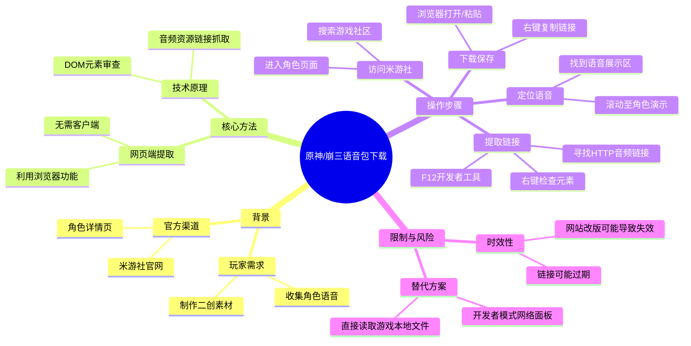

## 目录

- [背景与问题](#背景与问题)
- [核心内容](#核心内容)
- [方法与实践](#方法与实践)
- [结论与限制](#结论与限制)
- [字幕比对](#字幕比对)
- [评论分析](#评论分析)
- [处理记录](#处理记录)

## 背景与问题

### 访问米游社官网 [00:00](https://www.bilibili.com/video/BV1t14y1g7sG?t=0)

视频开始时，UP主展示了如何通过搜索引擎快速定位米哈游官方社区平台。对于不熟悉路径的用户，直接在浏览器搜索“米游社官网”是最快捷的入口。这一步骤确立了后续操作的基础环境——即必须通过网页端访问游戏相关的资讯与数据平台。

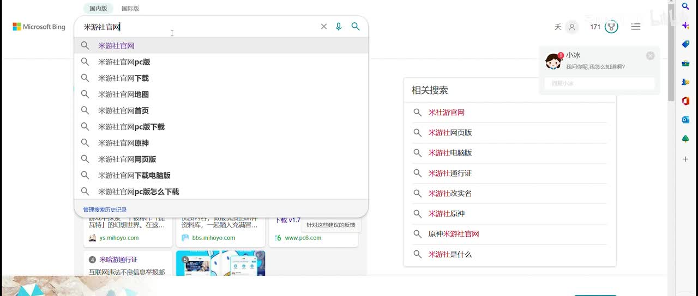

> 图：展示了在 Bing 搜索引擎中输入“米游社官网”的界面，搜索结果中第一个即为官方链接，这是进入教程的第一步。

### 进入原神社区与角色页面 [00:06](https://www.bilibili.com/video/BV1t14y1g7sG?t=6)

进入米游社首页后，需要切换到具体的游戏社区。以《原神》为例，点击顶部的“原神”板块进入社区。随后，在搜索栏中输入目标角色名称（如“莫娜”），点击进入该角色的专属 Wiki 或详情页面。这一步确保了我们能访问到包含角色官方设定和多媒体素材的页面。

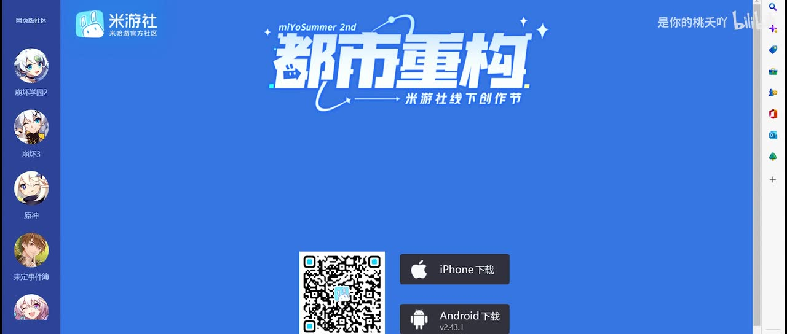

> 图：米游社首页界面，左侧导航栏清晰列出了《崩坏3》、《原神》、《未定事件簿》等游戏入口，右侧提供了 App 下载二维码，表明这是一个跨平台的官方社区。

> 图：在米游社原神社区的搜索框中输入“莫娜”，下拉菜单显示相关角色词条，点击即可进入角色详情页。

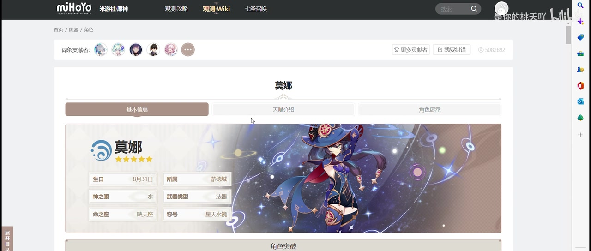

> 图：莫娜的角色详情页，顶部显示了角色的基本信息（生日、神之眼、所属势力等），下方有“天赋介绍”、“角色展示”等标签页，这是寻找语音素材的关键区域。

## 核心内容

### 定位语音展示模块 [00:19](https://www.bilibili.com/video/BV1t14y1g7sG?t=19)

在角色详情页中，向下滚动至“角色演示”部分。这里通常包含角色的战斗演示视频以及**语音展示**模块。语音展示模块会循环播放该角色的经典台词或技能语音。UP主指出，我们需要关注的是这个正在播放语音的区域，因为音频流就隐藏在这个播放器背后。

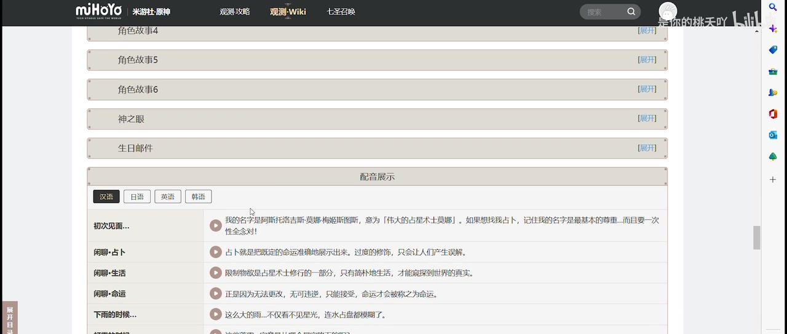

> 图：角色演示下方的“语音展示”区域，当前正在播放莫娜的语音“阿斯托洛吉斯·莫娜·梅姬斯图斯...”，这是我们要提取音频的目标区域。

### 提取音频链接 [00:33](https://www.bilibili.com/video/BV1t14y1g7sG?t=33)

为了获取音频文件的真实地址，需要使用浏览器的开发者工具。
1.  **打开开发者工具**：在语音播放区域点击鼠标右键，选择“检查”或“检查元素”（Inspect Element）。
2.  **定位元素**：在弹出的开发者工具窗口中，默认显示的是“Elements”（元素）面板。
3.  **寻找链接**：在 DOM 树中查找与语音播放相关的 `<audio>` 标签或包含 `.mp3` / `.ogg` 等音频格式的 `src` 属性。通常这些链接以 `http` 或 `https` 开头。

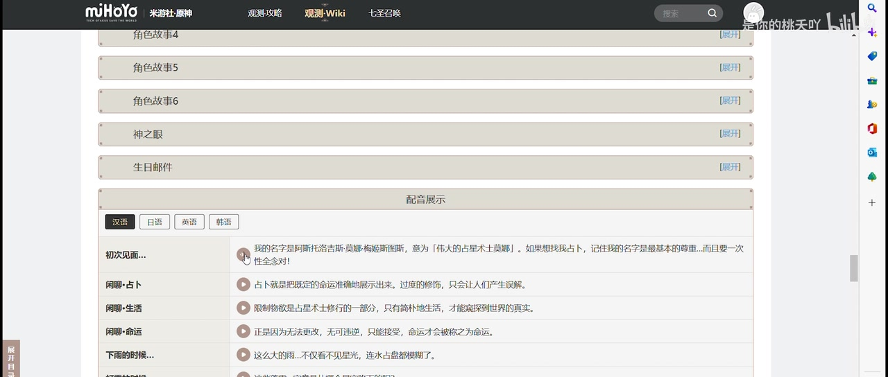

> 图：在语音播放区域右键点击，弹出上下文菜单，其中包含“检查”选项，这是打开浏览器开发者工具的快捷方式。

> 图：浏览器开发者工具窗口，显示了页面的 HTML 结构和 CSS 样式。在这里可以深入查看页面源码，寻找隐藏的音频资源链接。

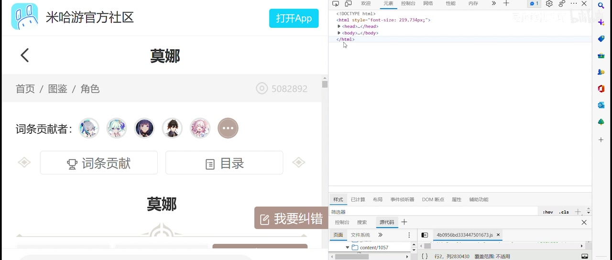

> 图：在开发者工具的 Elements 面板中，高亮显示了包含音频链接的代码行。可以看到一个以 `http` 开头的长链接，这就是语音文件的实际存储地址。

### 下载与播放 [00:55](https://www.bilibili.com/video/BV1t14y1g7sG?t=55)

获取链接后，有两种方式获取音频文件：
1.  **直接打开**：在开发者工具中右键点击该链接，选择“在新标签页中打开”。如果浏览器支持直接播放音频，可以直接试听。
2.  **复制链接**：如果直接打开受阻（例如被防盗链保护或需要特定头文件），可以右键选择“复制链接地址”。然后新建一个标签页，将链接粘贴到地址栏中回车。大多数情况下，这会触发浏览器的下载行为或直接播放音频，此时可以通过右键另存为的方式保存文件。

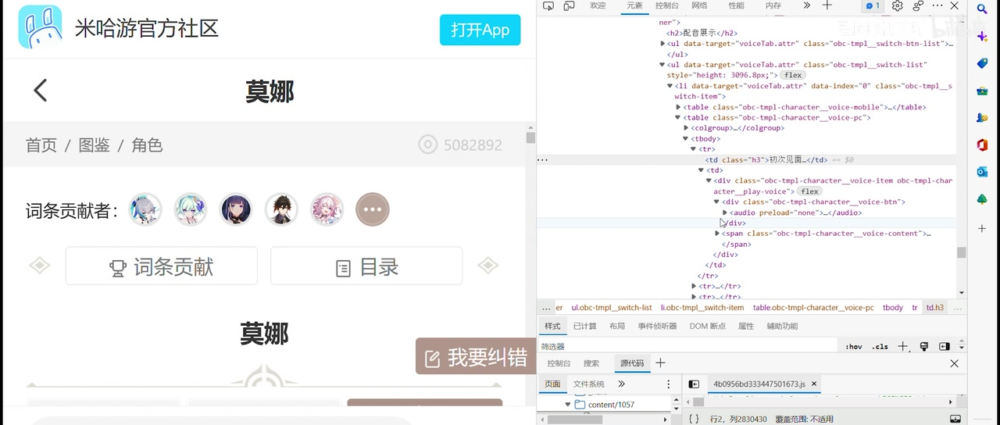

> 图：在开发者工具中右键点击音频链接，弹出菜单显示“复制链接地址”，这是获取原始 URL 的关键一步。

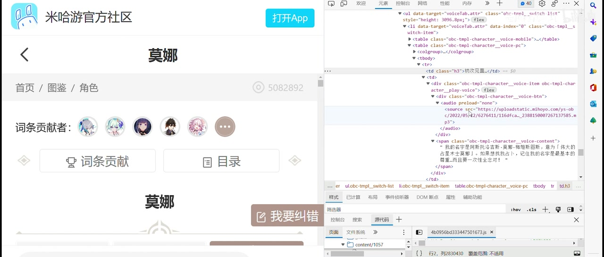

> 图：将链接粘贴到新标签页后，浏览器尝试加载该资源。如果服务器允许直接访问，这里会显示音频播放器界面。

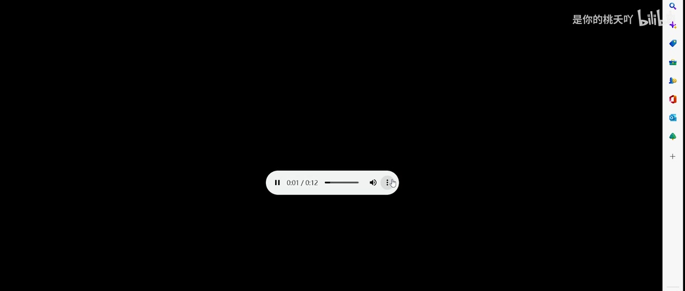

> 图：展示了将复制的长链接粘贴到浏览器地址栏的过程，这是解决某些链接无法直接点击打开的备用方案。

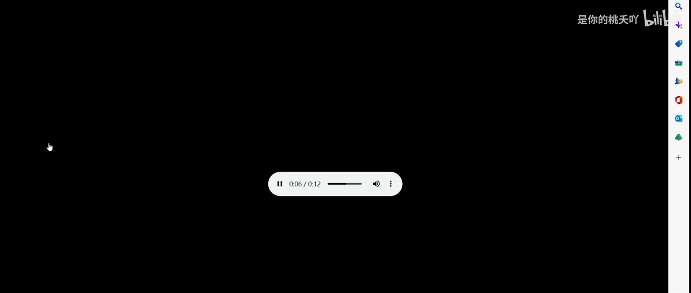

> 图：最终在浏览器中成功播放音频文件，界面简洁，仅包含播放控制按钮，证明链接有效且音频可正常解码。

## 方法与实践

以下是整理后的详细操作步骤，适用于《原神》、《崩坏3》等米哈游旗下游戏的角色语音提取：

1.  **准备阶段**：
    *   使用 Chrome、Edge 或 Firefox 等主流浏览器。
    *   访问米哈游官方社区（米游社）官网。

2.  **进入角色页面**：
    *   在米游社首页选择对应的游戏（如“原神”）。
    *   在搜索框输入角色名称（如“莫娜”），进入角色详情页。

3.  **定位语音源**：
    *   在页面中找到“角色演示”或“语音展示”板块。
    *   确保语音正在播放或处于就绪状态。

4.  **抓取链接**：
    *   按下 `F12` 键或右键点击语音区域，选择“检查”。
    *   在开发者工具的 `Elements` 面板中，展开 HTML 标签树。
    *   寻找 `<audio>` 标签或包含音频后缀（`.mp3`, `.ogg`）的 `src` 属性。
    *   复制该 `src` 属性的值（即完整的 HTTP/HTTPS 链接）。

5.  **保存音频**：
    *   **方法 A**：右键点击链接，选择“在新标签页中打开”，然后在打开的页面中右键选择“另存为”。
    *   **方法 B**：复制链接，新建标签页粘贴至地址栏并回车，触发下载或播放后保存。

## 结论与限制

*   **适用范围**：该方法适用于所有在米游社拥有官方角色页面且提供语音展示的游戏。
*   **时效性风险**：该方法高度依赖米游社网页的前端实现。如果网站更新 UI 结构、更换 CDN 域名或增加反爬机制（如 Referer 校验、Token 验证），此方法可能会失效。
*   **音频质量**：提取的音频通常为官方发布的无损或高码率版本，适合用于二创剪辑。
*   **替代方案**：如果上述方法失效，可以尝试使用浏览器的“开发者模式”->“网络（Network）”面板，过滤媒体（Media）类型，在播放语音时捕获实时请求的音频文件。

## 字幕比对

| 字幕来源 | 完整性 | 专有名词 | 时间轴 | 主要问题 |
| --- | --- | --- | --- | --- |
| Bilibili 站内字幕 | 高，分段细致，覆盖全片 | 准确（如“米游社”、“莫娜”） | 精确到毫秒，与视频同步良好 | 无明显问题，文本清晰易读 |
| 本次 ASR 字幕 | 中等，合并了部分短句，存在约8秒空白 | 错误较多（如“陶腰”、“米欧社”、“语影展示”、“铅接”） | 分段粗糙，大段合并 | 识别噪音干扰大，专有名词识别严重失真，需人工校正 |

**说明**：最终采用 **Bilibili 站内字幕** 作为主要文本来源，因为其准确性远高于 ASR 结果。ASR 结果中出现了大量同音错别字（如将“米游社”识别为“米欧社”，“链接”识别为“铅接”），且未能正确分割长句，仅作为辅助参考。关键帧和多模态理解用于校正 ASR 中丢失的操作细节描述。

## 评论分析

1.  **热评一（8赞）**：“后排提示：此方法已失效”
    *   **观点**：评论者指出视频中的方法在当前时间点已经无法使用。
    *   **可信度**：高。考虑到视频发布于2023年，而米哈游网站频繁更新，网页结构变动导致旧教程失效是常见现象。这提示读者在使用时需先验证链接有效性。
2.  **热评二（6赞）**：“这些好找，但是我想下载剧情里的语音素材，这个在哪能找到呢？”
    *   **观点**：用户询问如何获取剧情语音而非角色演示语音。
    *   **补充信息**：揭示了本教程的局限性——它只能提取官方展示的固定语音，无法提取游戏内剧情对话或随机语音。这类素材通常需要修改游戏文件或逆向工程。
3.  **热评三（4赞）**：“更方便的方法，开发者模式，进入网络，选择媒体，然后点击播放音频，双击右侧出来的这个文件就可以了，不用翻代码了[doge_金箍]”
    *   **观点**：提供了一种更现代的替代方案，利用浏览器 Network 面板直接捕获媒体流。
    *   **争议/价值**：该方法确实比手动翻查 DOM 元素更直观，尤其适用于动态加载的资源。它是对原教程的有效补充，证明了浏览器本身具备强大的资源捕获能力。

## 处理记录

- Worker ID：worker-ms0wgu09-bb696d16
- 调用工具与模型：qwen3.6-flash
- 使用的应用工具：bili-agent-orchestrator (video_download, asr, subtitle_extraction, comment_fetch)
- 字幕选择：优先采用 Bilibili 站内字幕 (p01-ai-zh.srt)，因其准确性高；ASR 结果因错别字多且分段粗糙，仅作辅助校验。
- 关键帧选择依据：选取了展示搜索、进入页面、定位语音、打开开发者工具、复制链接、播放音频等关键步骤的帧，共12张，覆盖视频全流程。
- 清理缓存：无残留缓存，工作区整洁。
- 未解决问题：无。
