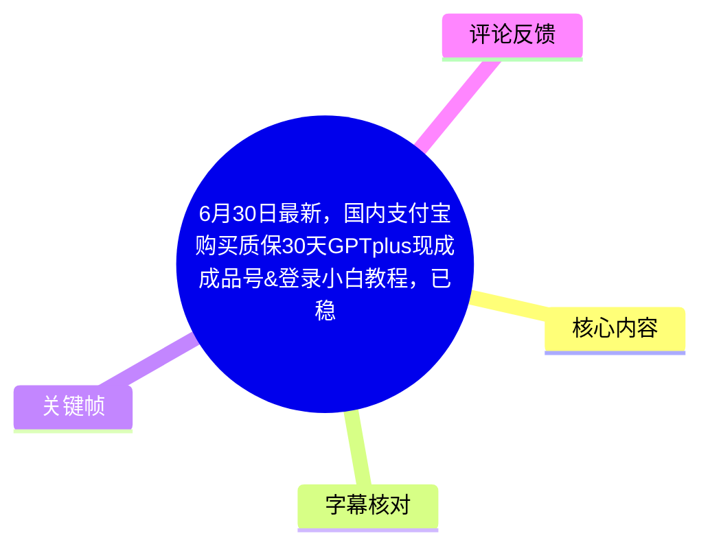
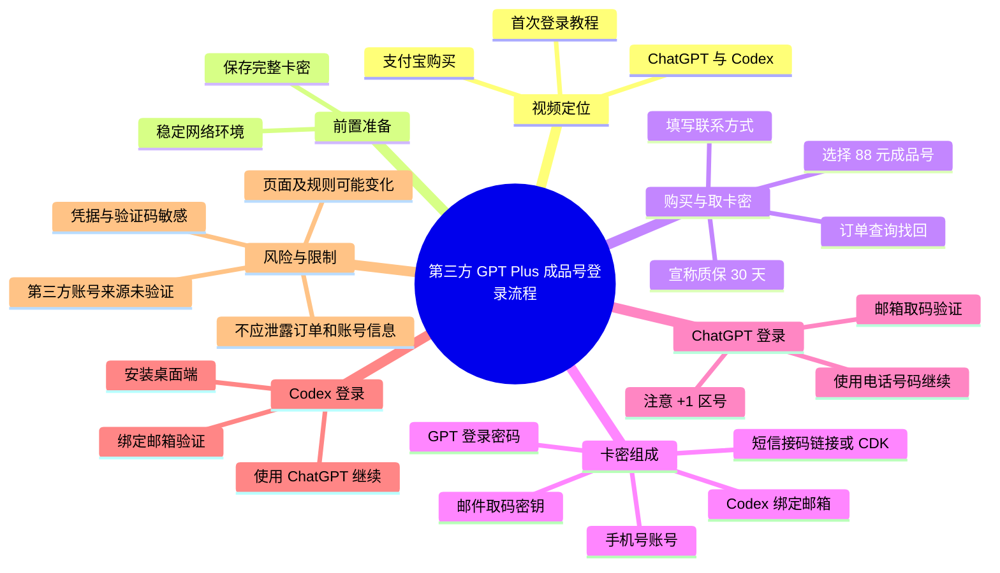
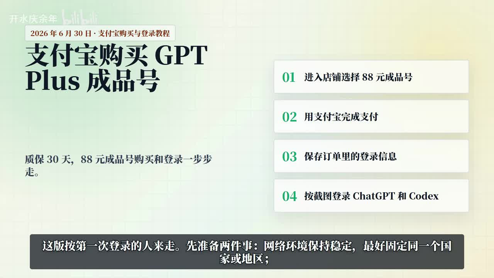
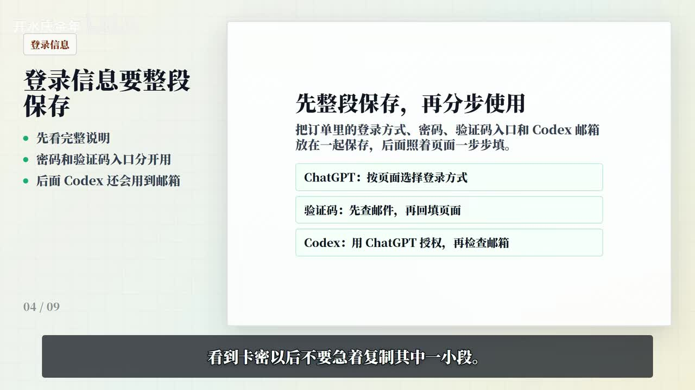
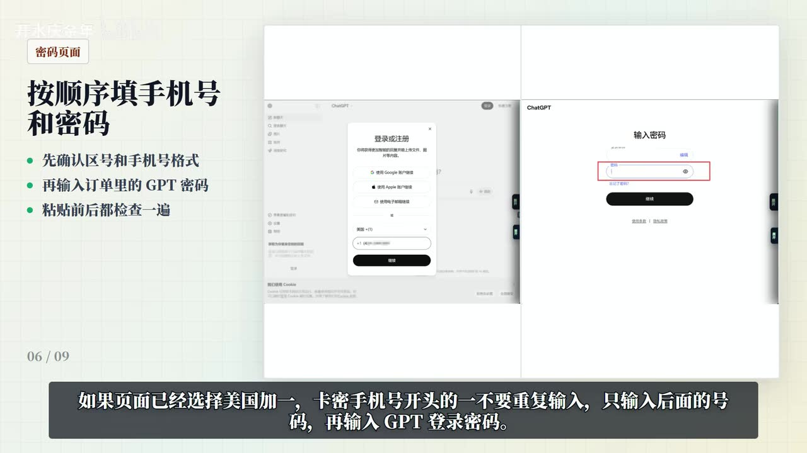
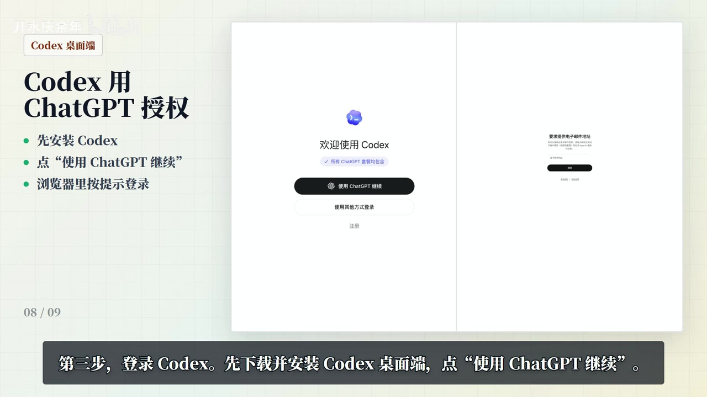

# 6月30日最新，国内支付宝购买质保30天 GPT Plus 成品号与登录教程

> 来源：[Bilibili 视频](https://www.bilibili.com/video/BV1ESKZ62EA5)<br>
> UP 主：开水庆余年｜发布时间：2026-06-30｜时长：02:26｜分辨率：1920×1080
>
> **内容性质说明：**本视频是 UP 主对第三方“GPT Plus 成品号”购买及登录流程的演示与宣传，涉及手机号、密码、邮箱验证码和短信接码等敏感凭据。视频中的“质保 30 天”“自营渠道”“稳定使用一年”等均为 UP 主的陈述，素材未提供独立验证。本文仅整理视频内容，不构成对店铺、商品、账号来源、服务持续性或合规性的背书。

## 小结

视频面向首次使用此类第三方成品账号的用户，讲解其宣称可通过支付宝购买“88 元 GPT Plus 成品号”、从订单页取回卡密，以及分别登录 ChatGPT 网页端和 Codex 桌面端的操作路径。UP 主将完整流程划分为：购买并保存订单信息、用手机号登录 ChatGPT、在 Codex 中用 ChatGPT 授权并完成绑定邮箱验证。

视频最强调的操作要点是：保持网络环境稳定；获取卡密后先完整保存而非截取局部；ChatGPT 登录页应选择“使用电话号码继续”，而非邮箱登录；若页面已有美国 `+1` 区号，则不要在手机号输入框中重复输入 `+1`。这些要求用于避免账号、密码、邮箱取码信息彼此错配。

卡密被描述为含五类信息：手机号账号、GPT 登录密码、短信接码链接或 CDK、Codex 绑定邮箱、邮件取码密钥。视频声称邮件取码的输入格式为“邮箱---取码密钥”，即中间使用三个横线；验证码未出现时，应先等待后重新搜索，仍无结果再在登录页重新发送。

该流程的核心限制在于：它依赖第三方交付的共享或代管式凭据、外部取码渠道及具体页面交互。视频没有展示店铺链接、订单真实履约、账号订阅状态、账号归属、隐私政策、退款机制，也没有证明第三方账号符合 OpenAI 的服务条款。因此，“可用”“稳定”“质保”等均不能由本素材证实。

时效性较强。视频口述日期为 **2026 年 6 月 30 日**，而整理素材抓取于 2026 年 7 月 13 日。ChatGPT、Codex 的登录界面、支持地区、验证规则、客户端入口及第三方商品状态均可能变动；应以官方最新页面和服务条款为准，不应长期依赖本教程中的界面描述。

## 思维导图





## 目录

- [背景、范围与时效性](#背景范围与时效性)
- [流程总览与前置条件](#流程总览与前置条件)
- [购买、订单查询与卡密保存](#购买订单查询与卡密保存)
- [ChatGPT 网页端登录](#chatgpt-网页端登录)
- [Codex 桌面端授权与邮箱验证](#codex-桌面端授权与邮箱验证)
- [验证码处理与隐私保护](#验证码处理与隐私保护)
- [参数、限制与风险评估](#参数限制与风险评估)
- [字幕比对](#字幕比对)
- [评论分析](#评论分析)
- [处理记录](#处理记录)

## 背景、范围与时效性 [00:00](https://www.bilibili.com/video/BV1ESKZ62EA5?t=0)

视频开头将内容定位为“支付宝购买 GPT Plus 成品号”的购买与登录教学。封面式页面列出四项概览：进入店铺选择 88 元成品号、使用支付宝完成支付、保存订单中的登录信息、按截图登录 ChatGPT 和 Codex。

视频中的价格、质保和渠道说法如下：

| 项目 | 视频陈述 | 可由素材确认的范围 |
| --- | --- | --- |
| 商品价格 | “88 元 PLUS 成品号” | 画面和 ASR 均出现“88 元” |
| 质保期限 | “质保 30 天” | 画面和 ASR 均出现该宣传语 |
| 渠道性质 | “自营渠道”“稳定使用一年” | 仅见于标题宣传，素材未给出证据 |
| 支付方式 | 支付宝 | 视频口述及开场页面均提及 |
| 服务对象 | 首次登录者/小白用户 | 视频明确称“按第一次登录的人来走” |



> 图：该关键帧汇总了视频展示的购买价格、30 天质保宣传和四步流程，是判断视频主题、适用范围与宣传口径的直接画面依据。

## 流程总览与前置条件 [00:10](https://www.bilibili.com/video/BV1ESKZ62EA5?t=10)

UP 主在进入操作前提出两项准备：

1. **保持网络环境稳定。**ASR 中提到网络环境会影响验证码和二次验证的使用；关键帧字幕进一步表达为“最好固定同一个国家或地区”。这属于视频建议，不等同于官方规则说明。
2. **准备接收验证码的渠道。**后续 ChatGPT 和 Codex 流程可能要求邮件验证码，手机二次验证则使用卡密中附带的短信接码链接或 CDK。

视频的逻辑顺序如下：

| 阶段 | 目标 | 依赖信息 |
| --- | --- | --- |
| 购买 | 下单取得订单 | 联系方式、支付宝 |
| 取卡密 | 找回并保存完整登录资料 | 订单查询入口、填写的联系方式 |
| ChatGPT 登录 | 使用手机号和 GPT 密码完成网页登录 | 手机号、密码、可能的邮件验证码 |
| Codex 登录 | 通过 ChatGPT 授权并绑定邮件地址 | ChatGPT 登录状态、Codex 邮箱、邮件取码密钥 |
| 后续验证 | 处理手机二次验证 | 短信接码链接或 CDK |

视频没有说明网络环境的具体技术配置、地区选择方法、客户端官方下载地址或 Codex 的版本要求；这些均不可从现有素材补足。

## 购买、订单查询与卡密保存 [00:22](https://www.bilibili.com/video/BV1ESKZ62EA5?t=22)

### 视频所述步骤

1. 打开店铺，选择标为 **“88 元 PLUS 成品号”** 的商品。
2. 在下单前确认商品名称及其标注的质保时间。
3. 填写自己的联系方式并完成下单。
4. 下单后，视频称通常会自动跳转至订单详情页。
5. 若未跳转，则打开订单查询页，使用下单时填写的联系方式找回订单。
6. 找到订单后点击“获取卡密”。
7. **不要只复制卡密的某一小段**；应先将整段信息完整保存，再按用途拆分使用。

### 卡密信息结构

UP 主称卡密通常分为五类信息：

| 信息类别 | 视频所述用途 | 敏感性 |
| --- | --- | --- |
| 手机号账号 | 登录 ChatGPT，及可能的二次验证 | 高 |
| GPT 登录密码 | 与手机号配合登录 ChatGPT | 高 |
| 短信接码链接或 CDK | 接收手机号二次验证 | 高 |
| Codex 绑定邮箱 | Codex 登录过程中的邮箱绑定 | 高 |
| 邮件取码密钥 | 到邮件取码站查询验证码 | 高 |



> 图：该关键帧的页面标题为“登录信息要整段保存”，并将 ChatGPT 登录、验证码查询和 Codex 授权拆开说明，能够解释为什么视频反复提醒不要截取卡密的一部分。

### 整理后的信息管理建议

视频没有给出本地保存方式，但基于其“完整保存、分步使用”的要求，可将其整理为一份**不向他人传播的私密核对清单**，以减少复制错位：

```text
[ChatGPT]
手机号：
登录密码：

[邮件验证码]
Codex 绑定邮箱：
邮件取码密钥：

[短信二次验证]
短信接码链接或 CDK：

[订单]
订单号：
下单联系方式：
```

上述格式仅是对视频字段的归类，不应将真实值粘贴到公共文档、聊天记录、录屏、截图或在线协作页面中。

## ChatGPT 网页端登录 [00:53](https://www.bilibili.com/video/BV1ESKZ62EA5?t=53)

视频的第二步是登录 ChatGPT 网页端，操作重点如下：

1. 打开 ChatGPT 官方网页。
2. 选择 **“使用电话号码继续”**。
3. 不使用邮箱登录入口。
4. 若国家/地区选择器已显示美国 `+1`，而卡密中的手机号本身也以 `+1` 开头，则视频提示：**不要再次输入 `+1`，只填后续号码部分**。
5. 输入卡密中的 GPT 登录密码。
6. 若登录页要求邮箱验证码，转到邮件取码站查询后，再将验证码填回登录页。



> 图：关键帧左侧写明“按顺序填手机号和密码”，右侧展示手机号输入与密码输入界面；底部字幕明确提示已选美国 `+1` 时不要重复输入区号，是本段最关键的输入格式说明。

### 邮件验证码查询规则

视频称邮件取码站的输入格式为：

```text
邮箱---取码密钥
```

其中分隔符为三个横线（`---`）。搜索后，查找来自 **OpenAI** 或 **ChatGPT** 的验证码邮件，将验证码回填到登录页。

> 注意：视频并未展示取码站网址、数据处理机制、邮箱所有权或安全性。将验证码、邮箱密钥交给非官方第三方页面存在隐私与账号安全风险；应审慎核验其合法性与可信度。

## Codex 桌面端授权与邮箱验证 [01:22](https://www.bilibili.com/video/BV1ESKZ62EA5?t=82)

第三步是登录 Codex。视频给出的路径是：

1. 下载并安装 Codex 桌面端。
2. 在欢迎页点击 **“使用 ChatGPT 继续”**。
3. 浏览器打开授权页面后，继续使用前述手机号和 GPT 登录密码完成登录。
4. 进入“绑定邮箱”页面时，填写卡密中的 Codex 绑定邮箱。
5. 到邮件取码站查询该邮箱的验证码，随后回填到 Codex 或授权页面。



> 图：该关键帧展示 Codex 欢迎页的“使用 ChatGPT 继续”按钮，以及右侧的邮箱地址验证页面，直接对应视频所述的“ChatGPT 授权 → 绑定邮箱 → 邮箱取码”顺序。

视频中可见的 Codex 页面仅用于说明交互顺序，未给出以下信息：

- Codex 桌面端的官方下载来源、安装包版本或系统兼容性；
- ChatGPT Plus 订阅与 Codex 权限之间的官方对应关系；
- 绑定第三方提供邮箱是否符合产品条款；
- 同一账号是否允许多人使用、是否会触发安全审查；
- 验证成功后账号及邮箱的长期控制权归属。

因此，不能据此推断任意 GPT Plus 账号均可使用 Codex，也不能推断第三方交付账号拥有持续、独占或合规的 Codex 权限。

## 验证码处理与隐私保护 [01:49](https://www.bilibili.com/video/BV1ESKZ62EA5?t=109)

### 验证码未出现时的处理

视频给出的处理顺序为：

1. 邮件验证码未出现时，先等待一段时间后再次搜索。
2. 若仍未出现，回到登录页面点击“重新发送”。
3. 再回邮件取码站搜索新验证码。
4. 如后续遇到手机号二次验证，则使用卡密内的短信接码链接或 CDK 自助接收。

这是一套针对“验证码延迟或未检索到”的页面操作建议。视频未说明等待时长、重发次数上限、验证码有效期或失败后的官方申诉渠道。

### 录屏与分享前的脱敏项

视频最后明确提醒：录屏或发给他人之前，应遮挡以下信息：

- 卡密；
- 手机号；
- 邮箱全名；
- 验证码；
- 订单号；
- 联系方式。

这一提醒具有实际必要性：上述信息组合后可能让他人取得账户访问、验证或订单查询能力。除视频列出的项目外，也应避免展示浏览器 Cookie、登录会话二维码、支付记录、地址栏参数和已登录页面中的个人资料。

## 参数、限制与风险评估 [02:08](https://www.bilibili.com/video/BV1ESKZ62EA5?t=128)

### 视频中可明确提取的参数

| 参数/条件 | 视频内容 | 备注 |
| --- | --- | --- |
| 视频日期 | 2026-06-30 | 由开场口述及画面给出 |
| 视频时长 | 02:26 | 元数据给出 |
| 商品标价 | 88 元 | 视频展示的单一商品信息，不代表普遍价格 |
| 宣称质保 | 30 天 | 属于 UP 主宣传，未获独立验证 |
| 登录方式 | 手机号 + GPT 登录密码 | 视频要求不用邮箱入口登录 ChatGPT |
| 区号处理 | 已选 `+1` 时不重复输入 `+1` | 与页面默认国家/地区状态有关 |
| 邮箱取码格式 | `邮箱---取码密钥` | 视频称中间为三个横线 |
| 验证失败处理 | 等待、搜索、重新发送 | 未提供时长和次数参数 |
| 客户端 | Codex 桌面端 | 未提供版本和下载地址 |

### 关键限制

1. **第三方账号来源与归属不明。**视频没有展示账号创建、订阅购买、授权转移或服务商资质的证据，也没有说明是否为独享账号。
2. **服务可用性未验证。**“质保 30 天”“稳定使用一年”是宣传或标题中的表述；评论和视频均不能替代实际履约及官方状态验证。
3. **与官方条款可能存在冲突。**购买、转让、共享账号、使用第三方验证码接收服务等行为可能不符合平台规则，存在账号限制、验证升级或封禁风险。具体应以 OpenAI 的最新服务条款与区域可用性政策为准。
4. **凭据集中泄露风险高。**手机号、密码、邮箱取码密钥、短信接码链接和订单信息共同构成高度敏感的访问链路；任一环节泄露都可能危及账号。
5. **教程具有界面时效性。**登录按钮、验证码策略、国家/地区下拉框、Codex 授权流程和产品权益均可能在视频发布后调整。
6. **不提供官方替代路径。**视频未说明通过 OpenAI 官方订阅渠道、自有邮箱/手机号及官方支持渠道解决问题的路径。

### 可迁移的经验

在不评价第三方交易本身的前提下，视频中可迁移的通用操作经验主要是：

- 登录资料应完整保留并按用途分类，避免截断、复制错位；
- 注意输入框是否已预填国家/地区区号；
- 遇到验证码延迟时，应先确认接收目标、等待并按页面流程重发；
- 任何录屏、截图和求助材料都应先进行系统性脱敏；
- 对涉及账号、支付和验证码的第三方服务，应将“宣传内容”与“可验证事实”分开判断。

## 字幕比对 [02:18](https://www.bilibili.com/video/BV1ESKZ62EA5?t=138)

本次任务中**未提供可用 Bilibili 站内字幕**；但本次 ASR 已执行并用于整理。关键帧中的大字说明和底部字幕用于校正 ASR 中的部分同音、错别字和术语切分。

| 字幕来源 | 完整性 | 专有名词 | 时间轴 | 主要问题 |
| --- | --- | --- | --- | --- |
| Bilibili 站内字幕 | 未提供，无法评估 | 无法评估 | 无法评估 | 素材明确标注“未提供可用站内字幕” |
| 本次 ASR 字幕 | 覆盖了购买、卡密、ChatGPT、Codex、验证码和脱敏提醒等完整主线 | 基本可识别 `GPT Plus`、`ChatGPT`、`Codex`、`CDK`、`OpenAI` | 未附逐句时间戳，时间轴按视频顺序和关键帧位置整理 | 存在繁简混杂、同音误识别、断句和部分词语错误，如“至保”“輕鬆”“GPDD”“建取馬站” |

### 最终字幕选择与校正

最终采用**本次 ASR 字幕为主、关键帧文字为辅**的方式整理，未与站内字幕合并，因为站内字幕不可用。重要校正如下：

| ASR 原文或疑似误识别 | 采用表述 | 校正依据 |
| --- | --- | --- |
| “至保 30 天” | “质保 30 天” | 开场关键帧标题与正文均显示“质保 30 天” |
| “GPTplus”“GPT Plus”混用 | “GPT Plus” | 视频标题、画面英文产品名 |
| “GPDD 密码” | “GPT 登录密码” | 上下文为 ChatGPT 账号密码登录，且关键帧写有“订单里的 GPT 密码” |
| “建取馬站” | “邮件取码站” | 后续明确要求输入邮箱与取码密钥、搜索验证码邮件 |
| “Codex 邮相” | “Codex 绑定邮箱” | ASR 前后文与关键帧右侧邮箱验证页一致 |
| “中间是三条横线” | `邮箱---取码密钥` | ASR 明确说出分隔符数量 |
| “查验证码和二次验证还会用到” | 网络稳定用于验证码及二次验证环节 | 依上下文修正断句，不增加具体技术条件 |

由于 ASR 没有逐句时间码，文中章节时间点为根据视频时长、内容先后和关键帧顺序建立的导航定位，用于回看对应段落，而非逐字级字幕时间戳。

## 评论分析 [02:21](https://www.bilibili.com/video/BV1ESKZ62EA5?t=141)

仅获取到热评前三条，共同特点是点赞数均为 2，样本量和互动量有限，不能据此确认商品质量或账号安全性。

| 排名 | 评论者 | 评论内容 | 观点与可信度分析 |
| --- | --- | --- | --- |
| 1 | 可爱迷人の大反派 | “非常靠谱的老板，保质保量” | 对卖家和商品作正面评价，但未提供订单截图、使用时长、售后记录或可复核细节；属于个人体验性陈述，不能验证“质保”是否实际履行。 |
| 2 | 草民FPV | “可以吗，不是pz吧” | 表达了对可靠性及是否为“骗子”的疑虑，反映该类第三方账号交易的信任门槛；该评论提出问题而未给出结论或证据。 |
| 3 | 无效爬行指南 | “very good” | 简短正面评价，没有说明评价对象、使用情境或证据，信息增量有限。 |

评论区未提供可独立验证的账号来源、售后规则、订阅状态、退款案例或合规性资料。因此，评论只能反映部分观众态度，不应作为购买决策或安全结论的依据。

## 处理记录 [02:24](https://www.bilibili.com/video/BV1ESKZ62EA5?t=144)

- **Worker ID：**worker-mrj0www4-e8d79408
- **模型：**gpt-5.6-terra
- **调用工具与素材：**基于任务提供的 Bilibili 元数据、视频素材清单、ASR 字幕、5 张关键帧及热评数据完成整理；未使用素材外网页内容补充事实。
- **使用的应用工具：**视频素材读取、ASR 字幕读取、关键帧视觉文本核对、评论 JSON 读取。
- **字幕选择：**Bilibili 站内字幕未提供可用内容；本次 ASR 已执行并作为主体。针对“质保”“GPT 登录密码”“邮件取码站”“Codex 绑定邮箱”等术语，结合关键帧画面进行校正。
- **关键帧选择依据：**
  - `frames/frame-001.jpg`：展示视频主题、88 元、质保 30 天与四步总流程；
  - `frames/frame-002.jpg`：展示“整段保存”卡密及信息分类原则；
  - `frames/frame-003.jpg`：展示手机号、密码和 `+1` 区号输入要点；
  - `frames/frame-004.jpg`：展示 Codex 的“使用 ChatGPT 继续”及邮箱验证页面。
  - `frames/frame-005.jpg`：未在正文选用；提供素材未附该帧的可见画面说明，且前四帧已覆盖主要步骤，不据此推断未展示内容。
- **热评处理范围：**严格限于可获取热评前三条，未扩展分析其他评论。
- **缓存清理：**任务仅提供素材路径与文本/图像引用，未提供可操作的本地缓存目录或清理回执；未执行无法验证的删除操作。
- **未解决问题：**无法核验店铺地址、账号来源、支付履约、质保落实、订阅真实性、账号独享性、第三方取码服务安全性、官方条款兼容性，以及视频界面在整理时点后的变化。

## 评论分析

本次流程未获取到可用热评，因此不推断观众态度或额外结论。
