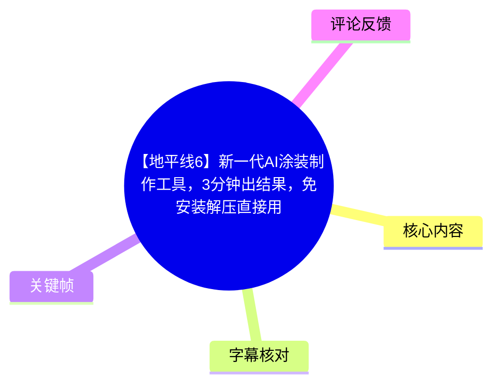
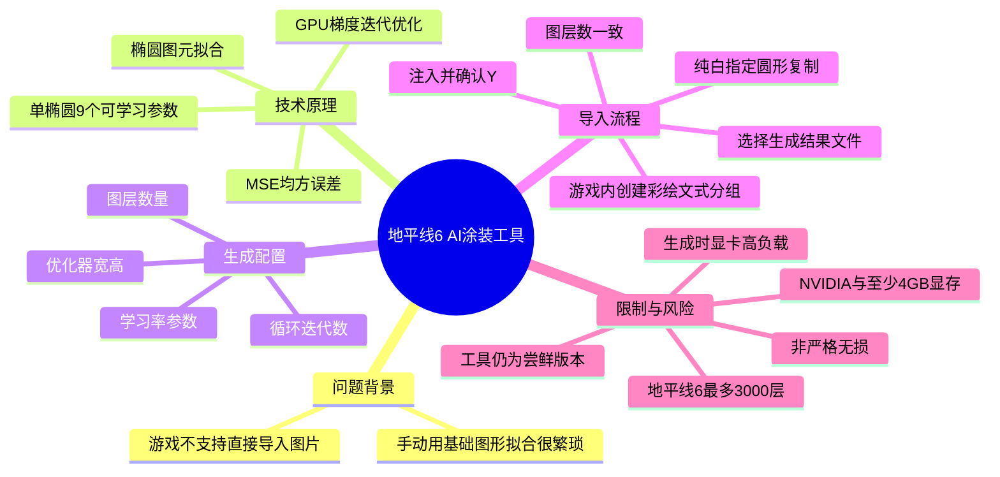
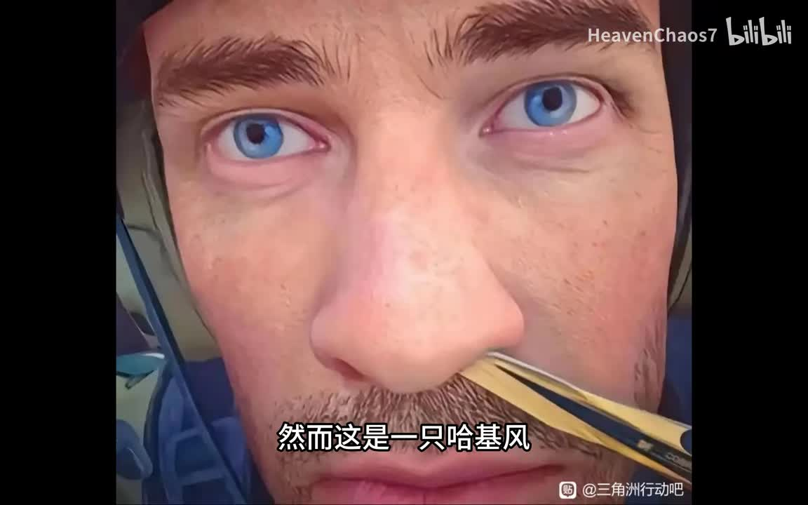
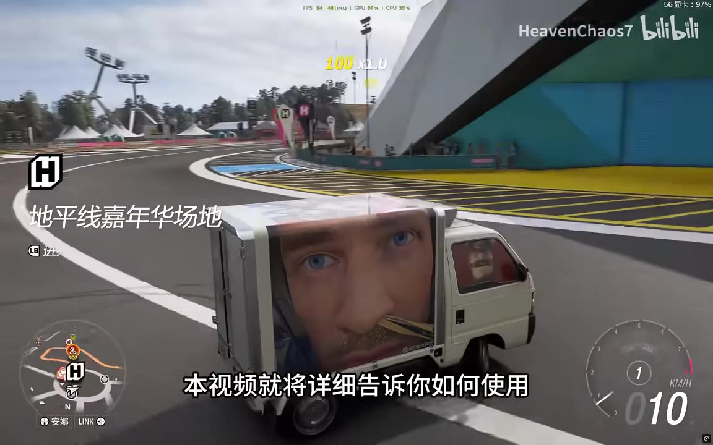
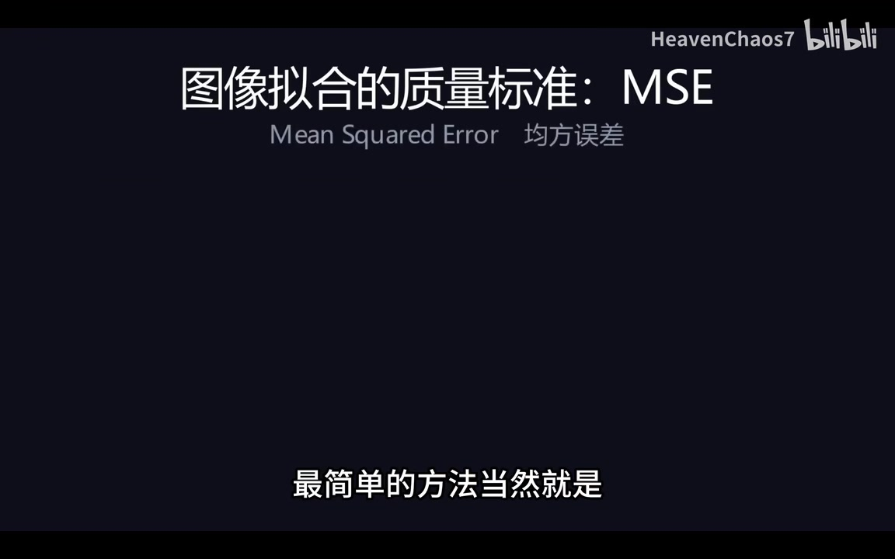
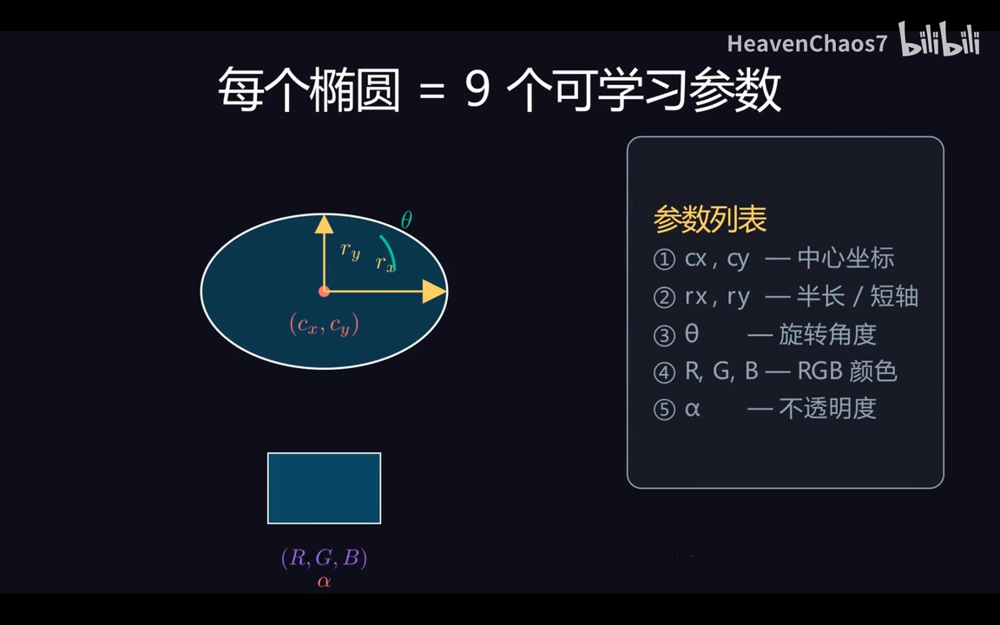

# 【地平线6】新一代AI涂装制作工具，3分钟出结果，免安装解压直接用

> 来源：[Bilibili 视频](https://www.bilibili.com/video/BV1rRjz6dEan) 
> UP 主：HeavenChaos7｜视频时长：06:04｜合集：AIcode  
> 视频简介提供下载链接与 GitHub 地址：[`Heavenchaos/vinylizer`](https://github.com/Heavenchaos/vinylizer)

## 小结

视频介绍了一款面向《极限竞速：地平线 6》涂装制作的 AI 工具。其目标不是把图片直接导入游戏，而是将输入图片自动拟合为大量游戏内可用的基础图形参数，再通过注入流程写入游戏中的涂装图层，从而减少手工拼图的工作量。

工具的技术核心是：用**椭圆**作为统一图元，以原图与拟合结果之间的**均方误差（MSE，Mean Squared Error）**为优化目标；每个椭圆含中心坐标、长短轴、旋转角度、RGB 颜色和不透明度，共 9 个可学习参数。程序通过计算参数对应的梯度，并在 GPU 上迭代降低 MSE，使图像逐渐清晰。

实操上，作者演示了“解压即用—选图—设定分辨率、迭代次数、图层数—生成—在游戏中预建等量白色圆形图层—填写图层数并注入”的完整链路。其中游戏端选择的基础图形必须是指定圆形、颜色必须为纯白，并且游戏显示的图层数必须与生成文件层数完全一致；任一环节错误都可能导致导入失败。

性能与硬件限制很明确：作者称一次循环通常需约 **10–30 秒**，多数图片约第 **5 轮**已有较好效果、**10 轮内**通常收敛，**15 轮**多半足够，默认 **25 轮**较保守。生成会基本占满显卡，并占用约 **4 GB 显存**；视频简介要求至少 **4 GB 显存 + NVIDIA 显卡**。作者提到 AMD 显卡当前只能等待后续适配，虽然其认为迁移到 HIP 理论上“不应太难”，但这不是已实现功能。

“无损”应谨慎理解：视频开头以“无损转换”作宣传性表述，但简介已明确写出“实际上当然不能真无损”。因此，更准确的理解是：该工具以有限数量的游戏图层逼近图片，视觉效果取决于图层数、优化分辨率、迭代程度和图像内容，不能视为像素级严格无损复现。

## 思维导图

## 目录

- [背景、定位与时效性](#背景定位与时效性)
- [拟合原理：MSE、椭圆与梯度优化](#拟合原理mse椭圆与梯度优化)
- [软件启动与图片选择](#软件启动与图片选择)
- [生成参数：分辨率、迭代、图层与学习率](#生成参数分辨率迭代图层与学习率)
- [生成过程与显存占用](#生成过程与显存占用)
- [导入地平线 6 的严格流程](#导入地平线-6-的严格流程)
- [结论、限制与使用建议](#结论限制与使用建议)
- [字幕比对](#字幕比对)
- [评论分析](#评论分析)
- [处理记录](#处理记录)

## 背景、定位与时效性

### 工具解决的问题 [00:40](https://www.bilibili.com/video/BV1rRjz6dEan?t=40)

作者指出，《极限竞速：地平线 6》的涂装系统不支持直接导入图片。若要做复杂图案，通常只能用游戏官方提供的基础形状逐层拼合，手工拟合耗时且繁琐。该工具的定位正是自动完成这一拟合过程，并将生成与导入整合在一个工作流内。

视频以人物头像等案例展示：输入原始图片后，车辆上的涂装能够呈现对应图像效果。作者特别说明画面中的水印不是后期叠加，而是涂装结果的一部分；这一点属于作者的演示陈述，本文不对其导入机制或最终视觉一致性作独立验证。

> 图：关键帧展示作者用于演示的原始人物近景图片。这张图有助于理解工具的输入并非游戏原生图层，而是待自动拟合的普通图片。

> 图：关键帧展示图像被呈现在游戏车辆侧面的结果，是视频“用基础图形逼近图片”这一目标的直观示例；它也说明复杂头像细节会被映射到有限图层的游戏涂装中。

### 版本状态、获取方式与时效性 [00:40](https://www.bilibili.com/video/BV1rRjz6dEan?t=40)

根据视频简介与作者口述：

- 简介提供了夸克网盘下载链接，以及 GitHub 仓库地址 `Heavenchaos/vinylizer`。
- 作者称程序下载后可直接打开使用，不需要额外安装依赖。
- 这是“尝鲜版本”；作者表示源码之后会发布，但当时源码仍较混乱。
- 作者称制作工具花费了数百元，并请求观众通过点赞、投币、收藏或分享支持。
- 技术参考文献是 *Differentiable Vector Graphics Rasterization for Editing and Learning*。

这些内容具有明显时效性：下载链接有效性、GitHub 仓库状态、源码是否整理发布、支持的游戏版本与导入兼容性，都可能在视频发布后变化。本文记录的是该视频及其抓取元数据所体现的状态，不将其视作长期不变的产品文档。

## 拟合原理：MSE、椭圆与梯度优化

### 以均方误差衡量图像接近程度 [01:05](https://www.bilibili.com/video/BV1rRjz6dEan?t=65)

作者将“拟合得好不好”定义为：拟合图与原图的所有像素差异应尽可能小，并用 **MSE（均方误差）**衡量这种差异。

可以将其概念化为：

\[
\mathrm{MSE}=\frac{1}{N}\sum_{i=1}^{N}(I_i-\hat{I}_i)^2
\]

其中，\(I_i\) 是原图某个像素（或颜色通道）的值，\(\hat{I}_i\) 是由一组游戏图形渲染得到的对应结果。作者给出的判断关系是：

- MSE 越小，图像整体误差越小；
- 误差越小，拟合质量越高；
- 程序的工作，就是寻找一组图形参数，使 MSE 尽量低。

> 图：关键帧直接给出了“图像拟合的质量标准：MSE / Mean Squared Error / 均方误差”。它为后续“为什么要迭代”和“为什么参数影响质量”提供了统一的衡量标准。

### 单个椭圆的 9 个可学习参数 [01:29](https://www.bilibili.com/video/BV1rRjz6dEan?t=89)

工具使用《地平线 6》中的椭圆作为拟合图像的基础图元。作者展示的单个椭圆具有 9 个可学习参数：

| 参数类别 | 参数 | 视频中的含义 |
| --- | --- | --- |
| 位置 | `cx`、`cy` | 椭圆中心坐标 |
| 尺寸 | `rx`、`ry` | 半长轴、半短轴 |
| 朝向 | `θ` | 旋转角度 |
| 颜色 | `R`、`G`、`B` | RGB 颜色 |
| 透明度 | `α` | 不透明度 |

因此，若用 \(N\) 个椭圆拟合图像，MSE 可理解为由 \(9N\) 个参数共同决定的目标函数。作者的关键思路是：确定所有椭圆的全部参数，就等于确定了最终渲染图像，也就确定了 MSE 的值。

> 图：关键帧完整列出了椭圆的中心、两轴、旋转、RGB 与不透明度。这是理解图层数为何影响表达能力、以及程序为何要优化大量变量的核心画面。

### 用梯度迭代寻找较小 MSE [01:53](https://www.bilibili.com/video/BV1rRjz6dEan?t=113)

作者说明，尽管无法“完美求解”这个高维目标函数的全局最小值，但可计算 MSE 对所有椭圆参数的导数（梯度），并让 GPU 按梯度方向持续迭代，从而逐步找到更低误差的结果。

视频将这种方法与神经网络训练类比：神经网络适合处理大量可学习参数和梯度更新的问题，因此可用于自动寻找图像拟合参数。这里的“神经网络”在视频中主要是对优化过程的通俗表述；已明确呈现、可直接确认的技术要点是：

1. 以图像误差 MSE 为目标；
2. 椭圆参数为待优化变量；
3. 对这些变量计算梯度；
4. 在 GPU 上进行迭代更新；
5. 结果随迭代逐步接近输入图像。

## 软件启动与图片选择

### 解压、启动与界面切换 [02:17](https://www.bilibili.com/video/BV1rRjz6dEan?t=137)

视频中的使用起点是下载简介中的文件并解压。作者说解压后可双击启动其中的 EXE 文件，无需用户自行安装额外依赖或做额外配置。

启动后，程序分为两部分，作者称可通过点击切换，也可按 `Tab` 键切换。随后点击“开始”按钮并选择要处理的图片，进入参数配置阶段。

按视频顺序整理：

1. 从视频简介提供的位置获取压缩包。
2. 解压压缩包。
3. 找到其中的 EXE 可执行文件并双击启动。
4. 在程序内通过点击或 `Tab` 在两个页面间切换。
5. 点击开始，选择待转换为涂装的图片。
6. 进入优化器参数配置。

> 注意：视频 ASR 将可执行文件名识别为“ESC 文件”，该名称可能是识别误差；素材未提供可核验的软件界面文字或完整文件名，因此本文不将其固化为准确文件名。

## 生成参数：分辨率、迭代、图层与学习率

### 优化器宽度与高度 [02:39](https://www.bilibili.com/video/BV1rRjz6dEan?t=159)

“优化器宽度”和“优化器高度”是图片在神经网络/优化过程中的实际分辨率，默认值为输入图片分辨率。作者给出的取舍关系如下：

| 设置方式 | 质量 | 速度与资源 |
| --- | --- | --- |
| 低于输入图片分辨率 | 会下降 | 速度提升、资源消耗降低 |
| 接近输入图片分辨率 | 较平衡 | 取决于图片和显卡 |
| 超过 1600 | 未见必要质量收益说明 | GPU 与显存占用会大幅增加 |
| 调至 4000 | 游戏内实际显示分辨率没有那么高，作者认为无意义 | 资源浪费风险高 |

作者明确建议：**不要将优化分辨率设得超过 1600**。原因不是程序绝对不能运行，而是更高值会显著增加 GPU 和显存使用量，而游戏内涂装的有效显示分辨率并不相应提高。

### 循环迭代次数与收敛经验 [03:03](https://www.bilibili.com/video/BV1rRjz6dEan?t=183)

循环迭代次数控制优化过程进行多少轮。作者给出的实测经验参数为：

| 项目 | 视频给出的说明 |
| --- | --- |
| 单轮时间 | 通常约 10–30 秒 |
| 初步可用效果 | 多数图片约第 5 轮左右 |
| 常见收敛区间 | 10 轮内基本收敛 |
| 作者推荐经验值 | 通常 15 轮已足够 |
| 默认值 | 25 轮，作者称该值“非常保守” |

这意味着“3 分钟出结果”不是所有输入、所有硬件上的保证时长，而是与单轮耗时、所设轮数、图像尺寸和 GPU 性能相关的经验性宣传。若按视频给出的单轮 10–30 秒估算，迭代总耗时可能有较大浮动。

### 图层数量、游戏上限与学习率 [03:27](https://www.bilibili.com/video/BV1rRjz6dEan?t=207)

图层数量控制拟合时允许使用的最大图层数。作者的结论是“图层越多，效果越好”，但存在游戏硬上限：

- 《地平线 6》最多支持 **3000 层**。
- 图层增加意味着可用更多椭圆表达局部颜色、边缘和细节。
- 生成文件最终所需图层数，必须在游戏导入前被预先复制为相同数量的白色圆形图层。

对于界面中的两个学习率参数，作者建议普通用户不用调整，认为影响不大；若确实要调，建议先理解神经网络学习率概念。视频没有给出两个学习率字段的名称、默认值、取值范围或推荐数值，因而不宜自行补充具体配置。

## 生成过程与显存占用

### 开始优化与中间结果观察 [03:51](https://www.bilibili.com/video/BV1rRjz6dEan?t=231)

完成参数设置后点击“开始生成”，软件进入自动优化。作者强调：

- 优化过程会基本吃满显卡；
- 约占用 **4 GB 显存**；
- 生成期间尽量不要同时玩游戏；
- 初始画面很模糊是正常现象；
- 随迭代推进，图像会逐渐清晰；
- 演示片段未加速、未剪辑，在不到 1 分钟时已呈现较不错的效果；
- 后续过程在视频中被跳过。

结合简介中的硬件要求，建议将“至少 4 GB 显存”理解为最低运行门槛而非宽裕配置：在程序约占用 4 GB 显存时，同时运行游戏或其他 GPU 应用可能带来资源冲突、性能下降或失败风险。视频未展示不同显卡、不同显存容量下的完整兼容性测试。

## 导入地平线 6 的严格流程

### 选择生成结果，但暂不注入 [04:16](https://www.bilibili.com/video/BV1rRjz6dEan?t=256)

作者称导入过程“同样很重要”，并警告任何一步出错都会导致导入失败。视频说明其导入代码来自 **Forza.Painter**，因此流程与该工具大致相近。

程序侧的开始步骤：

1. 切换到导入页面。
2. 找到生成的结果文件。
3. 该结果文件与输入图片同名。
4. 点击结果文件后，**不要立即导入**。
5. 先切换至《地平线 6》游戏内完成图层准备。

### 游戏内创建白色圆形占位图层 [04:46](https://www.bilibili.com/video/BV1rRjz6dEan?t=286)

游戏内操作是整个导入流程的关键前置条件。按作者说明，应执行：

1. 打开“设计与喷漆”。
2. 选择“创建彩绘文式分组”（具体中文 UI 名称以游戏实际版本为准）。
3. 选择“应用彩绘文式分组”。
4. 在“基本形状”中选择视频指定的**圆形**。
5. **只能选择这个圆形，不能换成其他图形。**
6. 将颜色设为**纯白色**。
7. 将该纯白圆形复制，直到数量与生成文件所需图层数一致。

这里的圆形不是随意的视觉底图，而是注入流程所依赖的预置图层对象。作者强调“只能选这一个”，故不能用其他基础图形替代，也不能忽略纯白色这一要求。

> ASR 在 `05:10–05:21` 存在约 11.71 秒的无语音间隔。素材未提供该段可核验的语音字幕，本文不根据操作顺序补写该段可能出现的界面点击；可确认的信息仅限前后相连的“复制白色圆形至所需层数”和“读取游戏内显示层数”。

### 回填图层数并确认注入 [05:21](https://www.bilibili.com/video/BV1rRjz6dEan?t=321)

完成游戏内复制后，记下游戏显示的图层数，再回到程序：

1. 在程序的对应输入位置填写游戏内显示的图层数。
2. 该值**必须**与游戏内图层数一致。
3. 点击“注入”。
4. 程序会询问信息是否正确。
5. 确认无误后，在下方输入框输入大写 `Y` 或小写 `y`。
6. 发送确认。
7. 程序会自动执行导入；作者称随后进入游戏即可看到涂装。

### 导入成功的必要条件清单 [05:41](https://www.bilibili.com/video/BV1rRjz6dEan?t=341)

根据作者反复强调的步骤，可将高风险检查项归纳为：

- [ ] 已选择生成完成的、与输入图片同名的结果文件。
- [ ] 在程序中点击结果文件后，没有跳过游戏内准备而立即导入。
- [ ] 游戏内进入的是正确的彩绘/图案编辑路径。
- [ ] 基础形状为视频指定的圆形，而非其他形状。
- [ ] 圆形颜色为纯白色。
- [ ] 白色圆形的复制数量与生成文件层数一致。
- [ ] 程序中填写的是游戏界面实际显示的图层数。
- [ ] 两端图层数完全一致。
- [ ] 注入确认框出现后，已输入 `Y` 或 `y` 并发送。

## 结论、限制与使用建议

### 核心价值 [00:40](https://www.bilibili.com/video/BV1rRjz6dEan?t=40)

这款工具将原本需要人工摆放、缩放、旋转、着色大量基础图形的工作，转化为一个可配置的图像优化任务。对想把头像、插画或复杂图案制作成《地平线 6》痛车涂装的玩家而言，它的价值在于：

- 以 MSE 为目标自动优化，而不是全程手工拼图；
- 把生成与导入整合为连续流程；
- 提供分辨率、迭代次数、图层数等质量—速度—资源之间的调节杠杆；
- 用游戏支持的基础图形来表达结果，避免“直接导图”不可用的问题。

### 已知限制与风险 [02:39](https://www.bilibili.com/video/BV1rRjz6dEan?t=159)

| 类别 | 限制或风险 | 应对建议 |
| --- | --- | --- |
| 严格无损 | 作者在简介中承认不可能真正无损 | 将其视作视觉拟合，不要期待像素级完全还原 |
| 显卡 | 至少需要 4 GB 显存与 NVIDIA 显卡 | 生成前确认显存余量；避免并行运行大型 GPU 程序 |
| AMD 支持 | 当前未实现；作者仅称移植到 HIP 理论上不难 | 不应把理论可移植性当作已支持功能 |
| 图层上限 | 游戏最多 3000 层 | 图层数不能超过上限，且必须匹配导入预置层数 |
| 分辨率 | 超过 1600 会明显增加 GPU/显存开销 | 优先从不超过 1600 的设置开始 |
| 时间成本 | 单轮约 10–30 秒，输入与硬件不同会波动 | 不要将“三分钟”视作固定承诺 |
| 导入稳定性 | 任一步骤错误可能失败 | 严格按白色圆形、层数一致、`Y/y` 确认的顺序执行 |
| 版本成熟度 | 作者称为尝鲜版，源码当时仍混乱 | 使用前检查下载链接、仓库说明与最新兼容情况 |

## 字幕比对

| 字幕来源 | 完整性 | 专有名词 | 时间轴 | 主要问题 |
| --- | --- | --- | --- | --- |
| Bilibili 站内字幕 | 未提供可用字幕 | 无法评估 | 无法使用 | 字幕抓取过程报出 `Invalid URL`，素材中没有可用站内 SRT |
| 本次 ASR 字幕 | 覆盖约 304.67 秒语音，约占视频 83.86% | 有多处误识别 | 有真实 SRT 起止时间，可用于定位 | 首段 `00:40.750–00:40.990` 容纳大量文本，时间粒度异常；另有约 11.71 秒语音空段；部分术语识别错误 |

本次 ASR 诊断显示：识别语言为中文，置信度约 `0.9995`，音频时长约 `363.30` 秒；结果中**没有** `noAudioStream=true` 标记，因此不能将视频视为无音轨。本文以本次 ASR 的 SRT 时间段作为时间轴链接依据，同时使用关键帧和上下文对明显术语错误进行谨慎校正。

重要校正与处理如下：

| ASR 原文或近似识别 | 本文采用表达 | 校正依据 |
| --- | --- | --- |
| “军方误差” | 均方误差（MSE） | 关键帧明确写有“Mean Squared Error / 均方误差” |
| “RGAA” | RGB 与 α（不透明度） | 参数关键帧明确列出 `R、G、B` 及 `α` |
| “拈核 / 拈盒” | 拟合 | 上下文讨论图像逼近、MSE 最小化 |
| “练试法则”“T度方向” | 链式法则、梯度方向 | 上下文为求导、梯度迭代；但视频未展示公式推导 |
| “ESC 文件” | EXE 可执行文件（存疑） | 上下文是解压后双击启动；素材未提供文件名核验 |
| “导异 / 导录 / 导输” | 导入或注入 | 后文明确出现“注入”按钮及导入流程 |
| “Forza.Painter” | Forza.Painter | 作者口述与工具语境可对应，但未在画面中提供版本信息 |

由于没有可用站内字幕，无法进行逐句一致性比较；最终采用策略为：**ASR 的真实时间段 + 关键帧中可读文字 + 视频简介元数据 + 不超出素材范围的语义校正**。对于无法由素材核验的文件名、菜单精确文字和软件内部实现细节，均保留不确定性。

## 评论分析

以下仅分析可获取的热评前三条，评论是用户观点，不构成对软件性能或实现方式的独立验证。

1. **枕头羊驼｜48 赞**  
   > “回想起战地以前手搓二次元头像，那才叫工匠精神啊”

   该评论将本工具与早期玩家手工制作复杂图案的经历对比，认可自动化工具降低了重复劳动，也隐含怀念手工创作的“工匠精神”。它没有提供工具兼容性、画质或使用方法方面的可验证信息。

2. **Ticn711｜8 赞**  
   > “我去，首先速度没得喷，还那么清晰。”

   评论聚焦视频展示出的速度与清晰度，和作者“约三分钟出结果”的宣传相呼应。但它是基于演示观感的评价，没有说明使用的图片类型、显卡型号、迭代参数或图层数，不能推导为普遍性能结论。

3. **国潮盖茨比｜4 赞**  
   > “vibe code出来的是吧”

   该评论以“vibe coding”方式调侃或猜测工具的开发方式。视频素材没有说明代码具体由何种方式完成，因此这只是评论者推测，不应当作工具技术来源或代码质量的事实依据。

## 处理记录

- Worker ID：`worker-mrj0www4-e8d79408`
- 生成模型：`gpt-5.6-terra`
- ASR 模型与运行信息：`medium`；语言自动识别为中文；CUDA / `float16`；音频时长约 `363.30` 秒。
- 使用的素材处理工具：根据任务产物使用了音频提取、ASR 转写、关键帧抽取、视频元数据读取与热评获取流程；站内字幕抓取曾报错：`Invalid URL`。
- 字幕选择：站内字幕未提供可用结果；采用本次 ASR SRT 的实际分段时间作为时间轴来源，并借助关键帧校正“均方误差（MSE）”“RGB + α”“椭圆 9 参数”等关键术语。
- 音轨检查：ASR 结果未标记 `noAudioStream=true`，且提供了音频路径、中文识别诊断与带时间戳分段，因此按“视频存在音轨”处理。
- 关键帧选择依据：
  - `frames/frame-001.jpg`：展示输入人物图像；
  - `frames/frame-002.jpg`：展示车辆上的涂装结果；
  - `frames/frame-003.jpg`：直接显示 MSE 的中英名称；
  - `frames/frame-004.jpg`：直接列出椭圆的 9 个可学习参数。  
  以上帧均与正文的演示目标和技术原理直接对应，未对未提供画面文字的界面步骤作额外推断。
- 缓存清理：素材中未提供缓存清理执行记录，无法确认是否已清理；本文不虚构清理结果。
- 未解决问题：
  - 未获得可用的 Bilibili 站内字幕，无法做逐字交叉验证；
  - ASR 首段时间跨度仅约 0.24 秒却含大量语句，时间粒度存在异常，故章节时间轴仅定位到该 SRT 真实段起点，不将其误当成逐句精确时间；
  - 未提供完整软件界面帧，无法核验可执行文件全名、学习率字段名称、默认参数值及导入页面全部控件；
  - 未提供跨硬件、跨图片类型或跨游戏版本的复现实验，性能与兼容性结论仅记录作者陈述。
