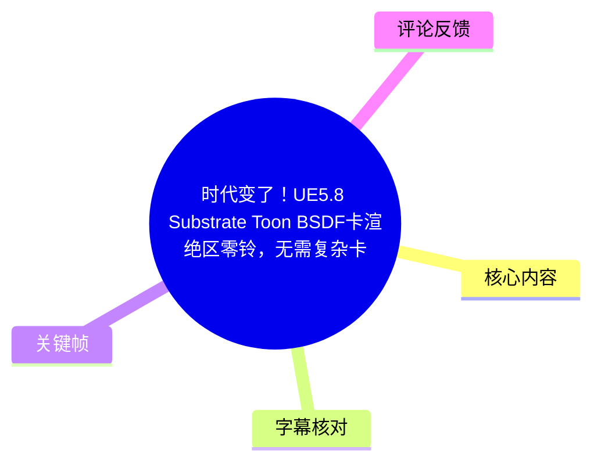
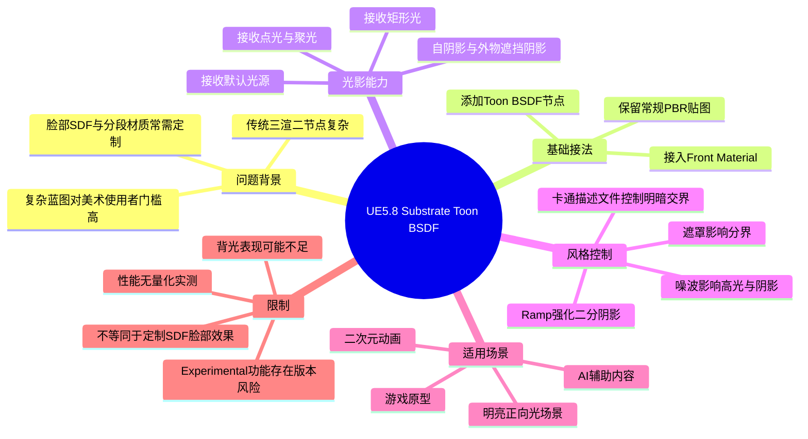
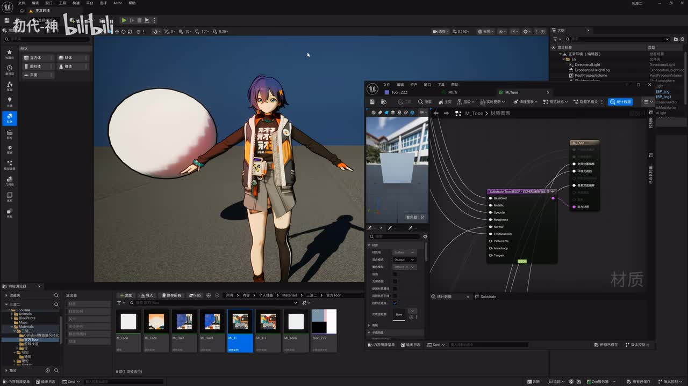
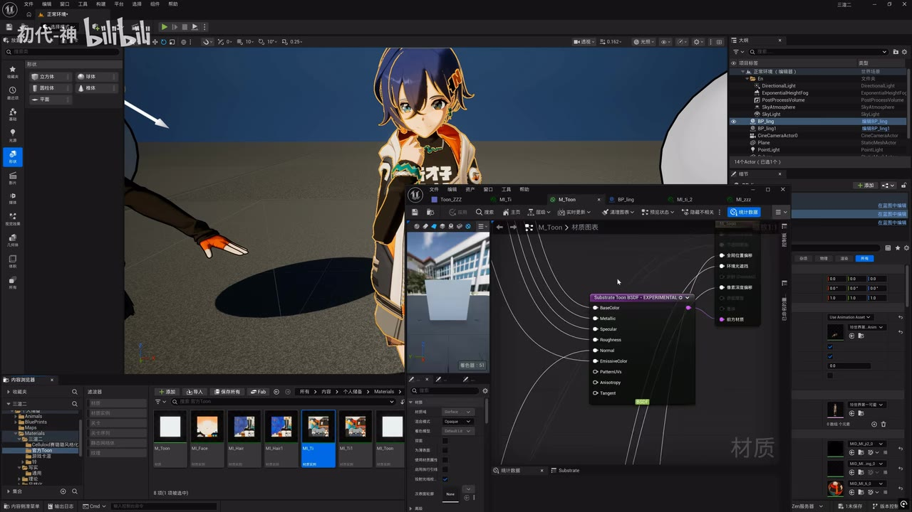
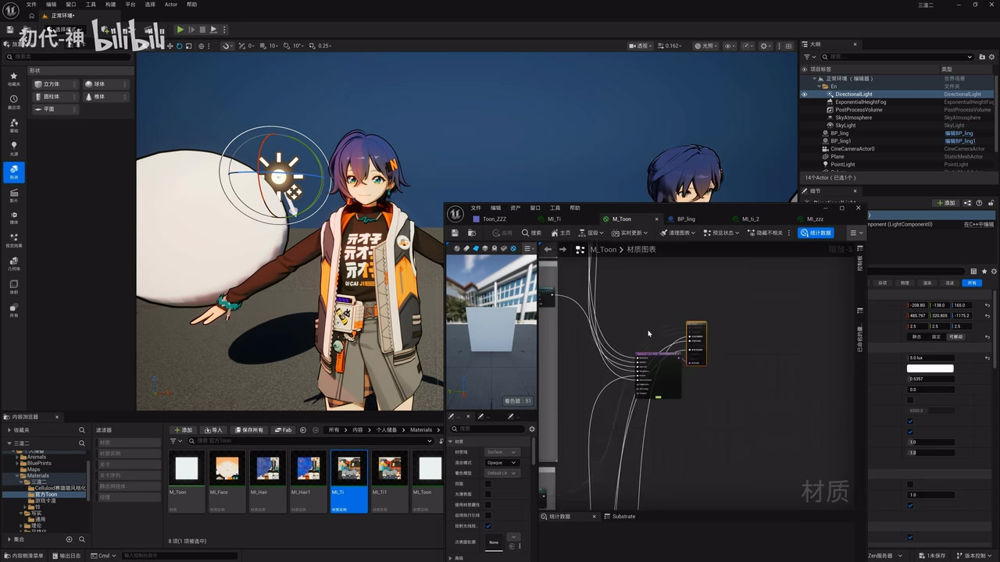
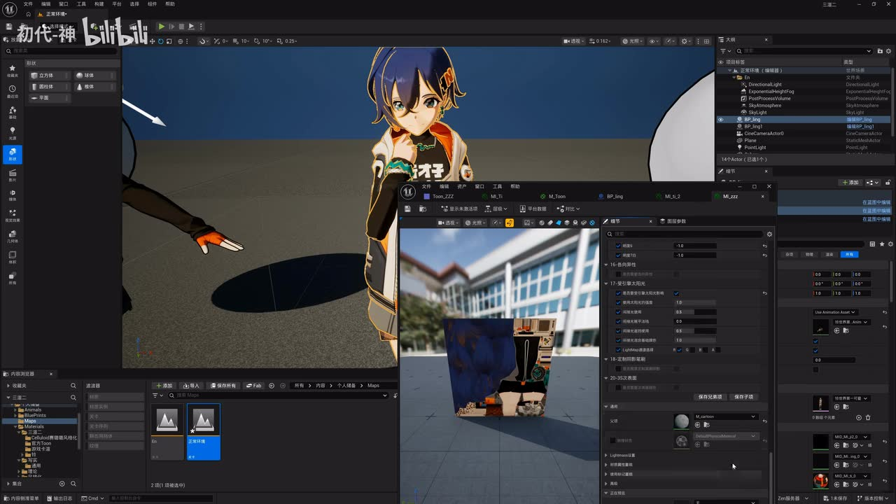

# 时代变了！UE5.8 Substrate Toon BSDF卡渲绝区零铃，无需复杂卡渲材质和蓝图节点，全受光照和阴影

> 来源：[Bilibili 视频](https://www.bilibili.com/video/BV12Ljw6ZEpS)  
> UP 主：初领域｜合集：AIcode｜时长：12 分 58 秒  
> 元数据发布时间：Unix 时间戳 `1781760376`（未提供时区，不额外换算）  
> 标签：UE5.8、Substrate Toon BSDF、卡通渲染、三渲二、铃

## 小结

视频演示了作者以《绝区零》角色“铃”为例，在 UE5.8 中试用官方的 **Substrate Toon BSDF**（画面节点标注为 `Substrate Toon BSDF - EXPERIMENTAL`）实现卡通化受光材质的过程与观感。作者的核心结论是：对于不追求完全复刻商业二游角色光影的美术使用者，可将常规 PBR 贴图接入官方 Toon BSDF，以显著减少自行搭建卡通分段、脸部 SDF、复杂材质函数和蓝图逻辑的需求。

该方法最重要的价值不只是“二分色”，而是保留了引擎光照响应：角色可以接收点光、聚光与矩形光等默认光源，也能接收自身及外部物体投下的阴影。作者认为，这使它适合较明亮、以正面光或太阳光为主的二次元动画、AI 辅助内容和游戏原型场景。

操作路径可概括为：保留普通 PBR 工作流，准备基础颜色、金属度、高光/粗糙度等常规贴图及必要的通道拆分；在材质中加入 Toon BSDF，并将其接入前表面（Front Material）输出。作者材质中仍有较多节点，但明确说明那些节点主要用于 PBR 颜色控制，并非制作三渲二效果本身所必需。

视频还展示了“卡通描述文件”（原话如此，具体资产/功能英文名称未被可靠识别）对明暗交界的控制，以及用遮罩、噪波贴图影响高光和阴影的思路。可调目标包括阴影强弱、明暗过渡以及暗部间接反射；将用于二分效果的 ramp 更充分地作用于阴影，可降低暗部的 PBR 感，使画面更卡通。

限制同样明确：作者承认该方案的脸部效果无法与专门定制的脸部 SDF 相比，尤其在背光或高要求的角色脸部光影场景中可能不够理想。性能部分只有编辑器性能可视化的定性对比，没有帧率、GPU 时间、分辨率、硬件、渲染路径或资产规模等可复现实测参数，不能据此得出通用性能结论。

视频的版本信息具有时效性：内容围绕标题所称的 UE5.8 及当时画面中标为 Experimental 的功能展开。后续引擎版本可能改变节点名称、接口、默认行为、稳定性或性能表现；实际项目接入前仍应以所用 UE 版本的官方文档与测试结果为准。

## 思维导图

## 目录

- [背景：为何尝试官方 Toon BSDF](#背景为何尝试官方-toon-bsdf)
- [最小材质接法：从 PBR 接入 Toon BSDF](#最小材质接法从-pbr-接入-toon-bsdf)
- [受光、投影与适用光照](#受光投影与适用光照)
- [性能说法：视频展示了什么、未证明什么](#性能说法视频展示了什么未证明什么)
- [卡通描述文件、遮罩与阴影风格控制](#卡通描述文件遮罩与阴影风格控制)
- [可执行工作流与检查清单](#可执行工作流与检查清单)
- [结论、限制与时效性](#结论限制与时效性)
- [字幕比对](#字幕比对)
- [评论分析](#评论分析)
- [处理记录](#处理记录)

## [背景：为何尝试官方 Toon BSDF](https://www.bilibili.com/video/BV12Ljw6ZEpS?t=29)

作者在约 00:29 开始说明背景：UE5.8 推出/提供了官方自带的卡通渲染材质节点，因此他尝试用其制作角色“铃”的卡通渲染效果。这里的“UE5.8 已发布”的表述来自作者口述与视频标题，本文不将其扩展为对具体发行渠道、版本性质或功能正式程度的独立验证。

作者将传统流程概括为以下负担：

1. **材质节点数量与结构复杂**：过去制作三渲二时，需要自行处理卡通分段、脸部 SDF、身体表现、金属与高光等效果。
2. **可能需要蓝图辅助**：作者提到旧做法还会涉及一些蓝图或额外设置。
3. **美术使用者的门槛**：作者强调自己定位为“美术使用者”，并非专业 TA；其诉求不是完整复刻商业项目的所有技术细节，而是获得一个可直接用于创作的可用方案。
4. **传统简化方案的光照问题**：作者表示，若不会写代码或搭建复杂蓝图，旧式简化卡渲可能基本“不受光”；而官方 Toon BSDF 的关键改进是让角色仍响应真实灯光和阴影。

> 图：画面同时给出角色的卡通化预览、材质编辑器及标注为 `Substrate Toon BSDF - EXPERIMENTAL` 的节点。它直接支撑了视频的讨论对象：不是独立后处理滤镜，而是接入 UE 材质图的 Substrate 节点。

### 作者的目标与取舍

作者并未宣称这种方法可以替代所有深度定制方案。其实际取舍是：

- 用较少的“专为三渲二而设”的节点，换取较低的搭建门槛；
- 接受脸部 SDF 等专用表现可能缺失；
- 换取在引擎默认光照下的受光、投影和较方便的场景布光；
- 面向“够用”的二次元美术产出，而非以商业游戏级角色脸部光影为硬目标。

## [最小材质接法：从 PBR 接入 Toon BSDF](https://www.bilibili.com/video/BV12Ljw6ZEpS?t=148)

约 02:28 起，作者说明了基础接法。核心是：**以已有的 PBR 贴图和参数为基础，在材质输出前加入 Toon BSDF，而不是从零自建一套大量卡渲节点。**

### 视频中可确认的连接思路

1. 打开角色材质。
2. 保留常规 PBR 数据来源，例如基础颜色（Base Color）、金属度（Metallic）、高光（Specular）与粗糙度（Roughness）等。
3. 添加 `Substrate Toon BSDF` 节点。
4. 将相应 PBR 数据接至 Toon BSDF 的输入。
5. 将 Toon BSDF 的 BSDF 输出接入材质的前表面/Front Material 通路。
6. 继续保留正常贴图工作流：作者提到可把颜色贴图与拆分后的贴图通道，按金属、高光、粗糙度等用途接入对应输入。

> 图：节点面板可见 BaseColor、Metallic、Specular、Roughness、Normal、EmissiveColor、Anisotropy、Tangent 等常规材质输入，以及底部 BSDF 输出。这说明视频方案以 PBR 数据为输入基础，再由 Toon BSDF 改变着色响应。

### “节点少”不等于“材质没有其他控制”

作者特别澄清：其项目材质图中仍然存在不少节点，但这些不是实现三渲二本体所必须的复杂卡渲节点，而主要是对 PBR 颜色等内容的调节。换言之：

- **Toon BSDF 的最小接入**可以比较直接；
- **最终资产的外观控制**仍可能需要调色、贴图处理、通道拆分和角色资产适配；
- 视频没有给出所有贴图文件、通道布局、具体数值、完整材质图或项目设置，因此不能从视频复刻出一份逐参数一致的材质。

### 视频提及、但不能据此量化的材质项

| 项目 | 视频中的说明 | 可得出的结论 | 不能得出的结论 |
| --- | --- | --- | --- |
| 基础颜色 | 常规颜色贴图可直接接入 | 不必先构造纯卡渲专用色图流程 | 未给出贴图色彩空间或采样设置 |
| 金属度、高光、粗糙度 | 拆包后按对应通道接入 | 现有 PBR 贴图可复用 | 未给出通道顺序、数值范围或压缩格式 |
| AO、深度等 | 作者口述提及仍可在相应位置处理 | 并非所有数据都必须改写 | 未说明是否为本案例实际必接项 |
| 发光 | 作者提到“还有发光什么的” | 节点包含/可结合发光类处理 | 未展示完整发光材质设计 |
| 脸部 SDF | 本例没有做出该类效果 | 此方案不天然等同于 SDF 脸部阴影 | 不能推断 UE5.8 完全不支持任何 SDF 方案 |

## [受光、投影与适用光照](https://www.bilibili.com/video/BV12Ljw6ZEpS?t=240)

从约 04:00 起，作者集中演示其认为最有价值的能力：角色不仅呈现卡通化明暗，还能对场景光源与遮挡阴影作出响应。

### 视频展示的光影现象

- **角色受光**：角色在场景中有随灯光变化的明暗。
- **自身投影/自阴影**：作者展示头发在脸部或身体上的阴影，说明角色局部可以出现阴影关系。
- **点光响应**：约 05:26 起，作者明确演示点光照射角色的效果。
- **聚光响应**：作者切换/展示聚光灯时，角色同样发生受光变化。
- **矩形光响应**：约 05:44 起，作者提到并展示矩形光也可对角色产生效果。
- **外物遮挡阴影**：约 05:58 起，作者展示其他物体的阴影遮挡到人物身上。

> 图：角色旁显示灯光操控器，角色身体出现明确亮暗区域；右侧仍是材质编辑器。该画面有助于理解视频重点是“在场景灯光下的卡通着色”，而不是固定光照贴图。

### 作者认为适合的画面条件

作者的判断具有明确的美术前提：

- 二次元角色在不少作品中常采用较亮的正向光或太阳光；
- 若镜头不是极端背光、不是完全黑暗的重遮蔽场景，则当前效果已能满足一部分需求；
- AI 图像/视频常见的正面、明亮人物光影，也与该方案的较优表现区间相近；
- 对动画制作、AI 辅助二次元内容或游戏中较亮的角色展示场景，作者认为这一方案“足够”。

这属于作者的制作经验判断，不是跨项目测试结论。实际效果仍取决于角色法线、贴图、灯光位置、曝光、场景 GI、渲染路径和后处理等条件；上述具体条件在视频中没有被系统列出。

### 与纯定制卡渲的差异

作者的比较逻辑是：

| 维度 | 官方 Toon BSDF 路线 | 深度定制卡渲路线 |
| --- | --- | --- |
| 搭建门槛 | 作者认为较低，能直接复用 PBR 工作流 | 通常需更多材质函数、特殊数据或蓝图 |
| 光照与投影 | 视频中展示可响应默认灯光与遮挡阴影 | 可实现，但具体实现依项目而异 |
| 脸部 SDF 等精细控制 | 本例未实现，作者承认有缺口 | 可针对角色需求深度定制 |
| 视觉上限 | 作者认为难满足特别高的还原要求 | 通常有更高的可控上限 |
| 适合人群 | 非专业 TA 的美术使用者、快速原型 | 有 TA、渲染工程或高还原需求的团队 |

## [性能说法：视频展示了什么、未证明什么](https://www.bilibili.com/video/BV12Ljw6ZEpS?t=457)

约 07:37 起，作者表示自己没有使用过去制作角色时所需的复杂蓝图节点，并将其与更低的性能消耗联系起来。随后画面展示了编辑器中的性能可视化颜色：作者口述此前某方案的指标“爆到粉红色”，而当前方案只位于靠前的暗红色区域，并据此判断性能表现较好、渲染会更快。

> 图：画面中能看到角色、编辑器材质窗口与右侧参数面板。它的价值在于记录视频确实以编辑器可视化方式观察过效果和性能状态，但画面本身未给出可供复算的毫秒或 FPS 数据。

### 应如何理解这段性能比较

视频能支持的结论仅限于：

- 作者在其当前工程、当前角色和当前演示条件下，观察到新方案的性能可视化状态优于其此前方案；
- 作者认为减少复杂蓝图与节点，有利于降低制作和可能的运行开销；
- 作者预期渲染速度会更快。

视频**没有**提供以下关键数据：

- GPU/CPU 型号；
- 分辨率、目标帧率、画质档位；
- UE 具体小版本、渲染器、Lumen、阴影方案或后处理配置；
- Draw Call、Shader Complexity、GPU Frame Time、CPU Frame Time；
- 材质编译统计、实例数量、角色数量；
- 新旧方案在相同镜头下的逐帧对照；
- 是否存在平台差异、编译缓存或调试视图开销。

因此，“性能消耗很低”应视为作者对当前演示的定性评价，不能直接换算为通用项目的性能承诺。若要决定是否用于项目，应在目标硬件、目标镜头、目标角色数量和目标渲染设置下做基准测试。

## [卡通描述文件、遮罩与阴影风格控制](https://www.bilibili.com/video/BV12Ljw6ZEpS?t=520)

约 08:40 起，作者介绍了他认为 UE5.8 官方功能的另一项重点：可借助“卡通描述文件”控制角色脸部及整体的明暗交界。由于 ASR 对该资产的精确英文名称识别不稳定，且素材未提供该界面的可读文本，本文保留作者使用的中文描述，不擅自补写正式 API 或文件名。

### 1. 用描述文件控制明暗分界

作者将其与过去手工制作的曲线功能类比：过去需自行做曲线来调整卡通二分效果，现在可通过一个描述文件实现类似的调整能力。视频表达的效果目标包括：

- 定制卡通风格的明暗交界；
- 形成更明确的二分阴影；
- 对角色尤其是脸部的阴影过渡进行风格化处理。

### 2. 以遮罩影响明暗边界

约 09:17 起，作者说明可叠加遮罩影响明暗交界效果。其意义是把“统一的光照分界”变为“受局部贴图控制的分界”，让不同部位可以有不同的卡通化处理倾向。

### 3. 用噪波贴图进一步影响高光和阴影

约 10:22 起，作者说明：

- 高光可进一步通过噪波贴图影响；
- 阴影也可由噪波贴图进一步影响；
- 阴影强弱、过渡方式和暗部的间接反射可调。

作者在展示高光时先调暗相关效果，以使高光点更容易观察；他还提到，自己此前对 PBR 材质做过控制，因此当前示例没有呈现默认的“圆球效果”。这表明高光外观会同时受到 Toon BSDF 与前置 PBR 控制的影响，不能仅凭某一处节点就推断最终形态。

> 图：多条贴图/参数连线汇入 Toon BSDF，反映视频中“以常规输入为基础、再通过 Toon 模型控制着色”的结构；也提醒实践者，最终材质仍可能包含多项资产级调节，而非完全零节点配置。

### 4. 用 ramp 强化卡通阴影

约 11:07 起，作者提出进一步风格化的方向：减少 PBR 暗部反射感，并让用于二分效果的 ramp 更直接地参与阴影定制。作者给出的视觉判断是：

- 保留较多 PBR 暗部反射时，画面会更写实；
- 将阴影进一步二分并融入 ramp 后，画面会更卡通；
- 二者并无绝对优劣，应按作品需求选择。

约 11:52 起，作者以球体的阴影变化说明：PBR 的阴影也可被纳入二分式卡渲效果。约 12:19 起，他认为加入二分后，脸部光影效果会好很多；但在约 12:34 又再次强调，仍无法与专门的 SDF 方案相提并论。

## [可执行工作流与检查清单](https://www.bilibili.com/video/BV12Ljw6ZEpS?t=167)

以下流程严格按视频明确表达的思路整理；凡视频没有提供的菜单路径、开关名称和数值均不补造。

### 步骤 1：先定义目标质量

先判断项目真正需要的是哪种卡渲：

- **快速获得可受光的二次元观感**：可优先评估 Toon BSDF 路线。
- **高精度角色脸部控制、复杂背光、商业角色还原**：不能把该视频方案直接等同于完整 SDF/定制卡渲方案，应预留进一步定制的技术预算。
- **镜头总体偏明亮、正向光**：与作者展示的优势区间更吻合。
- **大量极暗、侧逆光、脸部阴影需要严格按设计稿变化**：应重点验证，不能只参考视频中的较明亮镜头。

### 步骤 2：整理现有 PBR 资产

准备角色既有材质所需的常规数据。视频明确提到或画面节点可见的包括：

- Base Color；
- Metallic；
- Specular；
- Roughness；
- Normal；
- Emissive Color；
- 可能的 AO、深度及其他项目特定数据；
- 需要拆包时，对应的金属度、高光、粗糙度通道。

> 视频没有给出贴图分辨率、RGB/A 通道分配、色彩空间、压缩格式或具体数值；这些应依项目原有资产规范和实际 UE 版本确定。

### 步骤 3：接入 Toon BSDF

在材质中：

1. 添加 `Substrate Toon BSDF` 节点；
2. 将已有 PBR 数据接入相应输入；
3. 将节点的 BSDF 输出接至材质的前表面/Front Material；
4. 保留用于颜色校正等的已有控制节点，仅避免把“资产调节节点”误解成“制作卡渲必需的大量节点”。

### 步骤 4：建立最小灯光验证场景

不要一接入就只看静帧。按视频演示应至少检查：

- 正向主光下的整体明暗；
- 点光；
- 聚光；
- 矩形光；
- 头发等自身部件对身体/脸部的阴影；
- 外部物体投到角色身上的阴影。

建议记录相同镜头下的前后对比，但这属于基于视频方法延伸出的验证建议，并非视频中给出的固定操作指令。

### 步骤 5：按风格需求调节分界与阴影

- 使用视频所称的“卡通描述文件”控制明暗交界；
- 以遮罩局部影响分界；
- 以噪波贴图影响高光或阴影；
- 调整阴影强度、过渡与暗部间接反射；
- 若画面太写实，尝试让 ramp 更充分参与阴影二分；
- 若出现脸部阴影不符合美术需求，应回到定制脸部方案评估，而不是假设 Toon BSDF 能自动解决。

### 步骤 6：做性能基准而非只看颜色

作者使用性能可视化颜色做了观察，但项目落地应补足量化数据。至少在同一资产、同一镜头、同一分辨率与同一硬件下对比：

- GPU 帧时间；
- CPU 帧时间；
- 实际 FPS；
- 角色数量增加后的变化；
- 阴影、GI、后处理开启后的变化；
- 目标平台的材质编译与运行结果。

这一步是对视频“性能较好”主张的必要验证，不应被省略。

## [结论、限制与时效性](https://www.bilibili.com/video/BV12Ljw6ZEpS?t=739)

作者在结尾认为，加入二分阴影后角色脸部观感改善明显，后续可尝试制作 AI 或游戏类二次元作品。综合全片，可迁移的经验是：

1. **先复用已有 PBR，再替换/接入着色模型**，通常比从零搭建完整卡渲节点网络更适合快速试验。
2. **“能受光和阴影”是本方案的核心价值**：它让角色能被放入实际场景灯光中，而不只是在固定条件下看起来像卡通。
3. **风格化不是单一开关**：明暗交界、遮罩、高光、阴影、暗部反射与 ramp 的共同配置，决定最终画面在“写实”与“卡通”之间的位置。
4. **复杂度下降不代表美术判断消失**：灯光、曝光、贴图、法线和镜头依然直接影响角色效果。
5. **高还原需求应保留定制路线**：视频明确承认本例不如脸部 SDF；把它定位为可用、快速、易上手的方案更准确。

### 明确限制

- 视频未提供完整工程、材质资产、蓝图、描述文件、贴图及参数表。
- “卡通描述文件”的正式名称、创建方法、文件格式和具体接口未被可靠转写，不能依据本视频文字记录直接复刻。
- 不存在可复核的 FPS、GPU 毫秒、测试硬件与画质配置。
- 未展示极端逆光、复杂多光源、暗场、密集角色、移动端或主机平台表现。
- 未证明它能替代面部 SDF、头发各向异性专用方案或商业项目的完整 NPR 管线。
- 画面节点带有 `EXPERIMENTAL` 标注；这意味着应特别关注版本稳定性和接口变更风险，但视频未提供更细的官方稳定性说明。

### 时效性提示

本片讨论的是标题所称 UE5.8 环境下的功能表现，且素材抓取时间为 2026-07-15。引擎测试版、实验性功能和 Substrate 相关接口在后续版本中都可能调整。阅读时应将视频视为特定版本的案例演示，而非长期不变的生产规范。

## 字幕比对

| 字幕来源 | 完整性 | 专有名词 | 时间轴 | 主要问题 |
| --- | --- | --- | --- | --- |
| Bilibili 站内字幕 `p01-ai-zh.srt` | 严重不匹配 | 几乎未覆盖 UE、Substrate、Toon、PBR 等主题词 | 有真实 SRT 时间段，但仅覆盖约 00:00—03:30 且内容与视频不符 | 文本是擦桌子、借钱、喝酒等无关对白/歌词，不能用于本视频内容整理 |
| 本次 ASR（medium） | 较完整，共 61 段；语音覆盖约 637.57 秒、覆盖率约 82.01% | 有明显音近误识别，但可结合画面和标题校正核心术语 | 有真实时间戳，首段 00:00.750，末段 12:54.250 | 多处词语错误或断裂，如“三星彩球/三星二”“SURF TRADE”“TOMBSDF”“BSTF”“pva”“run”等 |

### 最终字幕选择与校正原则

最终以**本次 ASR 时间轴**作为章节链接和内容时序的依据，因为它与视频主题、画面中的 UE 编辑器内容以及标题高度一致。站内字幕虽含有真实时间段，但内容明显属于无关音频文本，未被采用为事实依据。

本次 ASR 已实际检查：诊断信息中**没有** `noAudioStream=true`，并记录音频时长约 `777.45` 秒、语言为中文、语言置信度约 `0.9976`，因此本视频并非“没有音轨”的情况。

结合标题、ASR 上下文和关键帧画面，对下列重要词作谨慎校正：

| ASR 表述 | 采用的整理表述 | 校正依据 |
| --- | --- | --- |
| “三星彩球”“三星二” | 三渲二 | 标题标签含“三渲二”，且上下文持续讨论卡通渲染 |
| “SURF TRADE” | Substrate | 标题及关键帧节点文字 |
| “TOMBSDF” | Toon BSDF | 标题及关键帧中的 `Substrate Toon BSDF` |
| “BSTF” | BSDF | 上下文指官方卡通材质节点 |
| “pva” | PBR | 上下文反复讨论基础颜色、金属、高光、粗糙度等 PBR 输入 |
| “run” | ramp | 语义为将二分控制作用于阴影；原音识别不稳定，采用常见图形术语时保留不确定性 |
| “照播贴图” | 噪波贴图 | 结合其“进一步影响高光/阴影”的上下文作出的审慎校正 |

其中，“卡通描述文件”的准确英文术语无法由现有字幕可靠确认，因此不补造具体名称。

## 评论分析

仅处理可获取的热评前三条；评论反映的是观众态度或传闻，不作为已验证事实。

1. **Kor0seNse1（67 赞）**  
   评论以“学得越晚越不用学”调侃技术工具逐渐降低门槛，并提到“UE6 未来成熟时可能弃用蓝图”、美术学习 C++ 等说法。  
   - 补充价值：反映观众将该视频理解为“减少蓝图依赖、降低技术门槛”的案例。  
   - 可信度：其中关于 UE6、蓝图和 C++ 的说法未附官方来源，也未在视频中得到论证，属于未经验证的评论观点。

2. **Nevrwind（33 赞）**  
   评论认为 Epic 在二游热潮“到尾声”时才推出 Toon 能力，语气带有行业时机评价。  
   - 补充价值：反映观众对 UE 官方 NPR/Toon 能力推出时点的关注。  
   - 可信度：这是主观行业判断；“二游是否到尾声”以及功能推出与行业周期的关系，视频和现有素材均未提供数据支持。

3. **浓眉大眼桃（8 赞）**  
   评论继续用“越不学越不用学”的梗，表达工具进步让旧流程学习成本显得尴尬的感受。  
   - 补充价值：与视频的“无需复杂材质和蓝图节点”的传播点一致。  
   - 可信度：属于情绪化评价，不含可核验技术信息；不能据此推断传统材质、蓝图或渲染知识已失去价值。

## 处理记录

- Worker ID：`worker-mrj0wbly-5dc4e50c`
- 模型：`gpt-5.6-terra`
- 工具与素材：视频元数据、站内 SRT、ASR 时间轴结果/诊断、关键帧目录、热评前三条。
- 字幕选择：已核查站内字幕与本次 ASR。站内 `p01-ai-zh.srt` 内容与视频主题严重不符；采用本次 ASR 的真实时间戳作为正文时间轴，并以标题、关键帧和上下文审慎校正关键术语。
- ASR 状态：ASR 语言为中文，带时间戳；诊断未标记 `noAudioStream=true`，音频流存在，不属于无音轨源视频。
- 关键帧选择依据：选用 `frames/frame-001.jpg` 展示角色预览与 Toon BSDF 节点，`frames/frame-002.jpg` 说明编辑器性能观察场景，`frames/frame-003.jpg` 说明 Toon BSDF 的 PBR 输入结构，`frames/frame-004.jpg` 说明角色受灯光影响。图片未提供独立时间戳，故未将其时间位置作为章节时间轴依据。
- 时间轴依据：所有正文时间链接均按本次 ASR SRT/segments 的真实起始秒数生成，未按文字顺序猜测时间点。
- 缓存清理：本任务提供的素材清单未包含缓存清理执行日志；未将“已清理”作为既成事实记录。
- 未解决问题：未获得完整工程、节点参数、性能量化数据、卡通描述文件的正式名称与配置细节；这些内容无法从现有素材中可靠补全。
