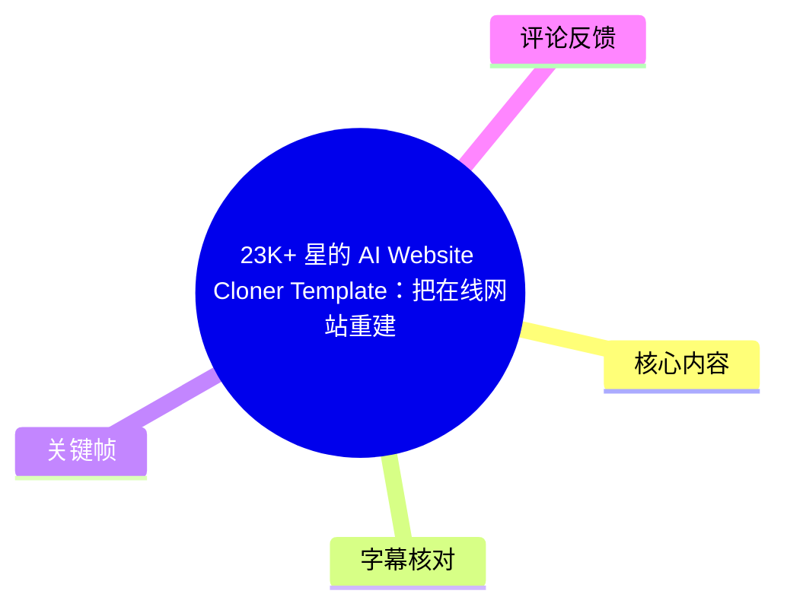
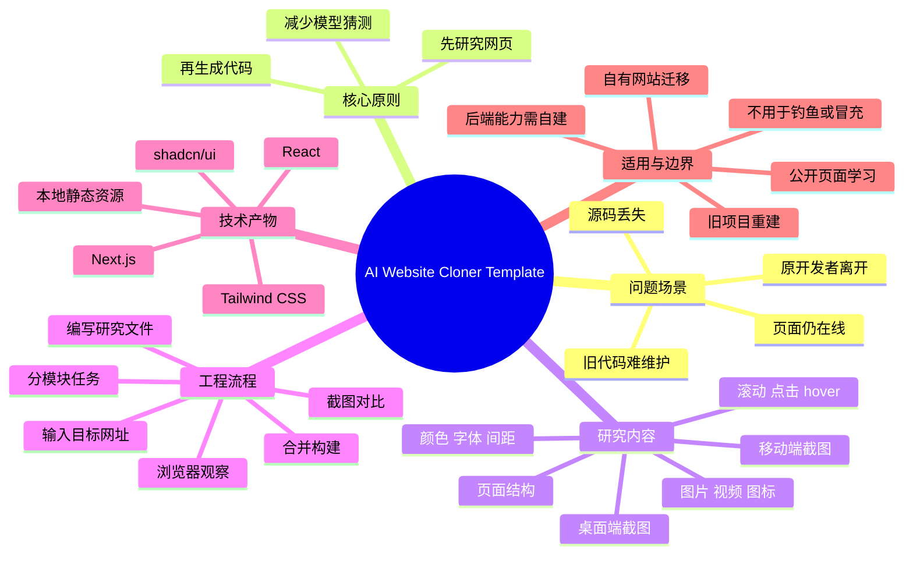
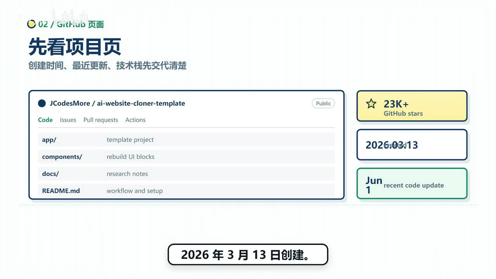
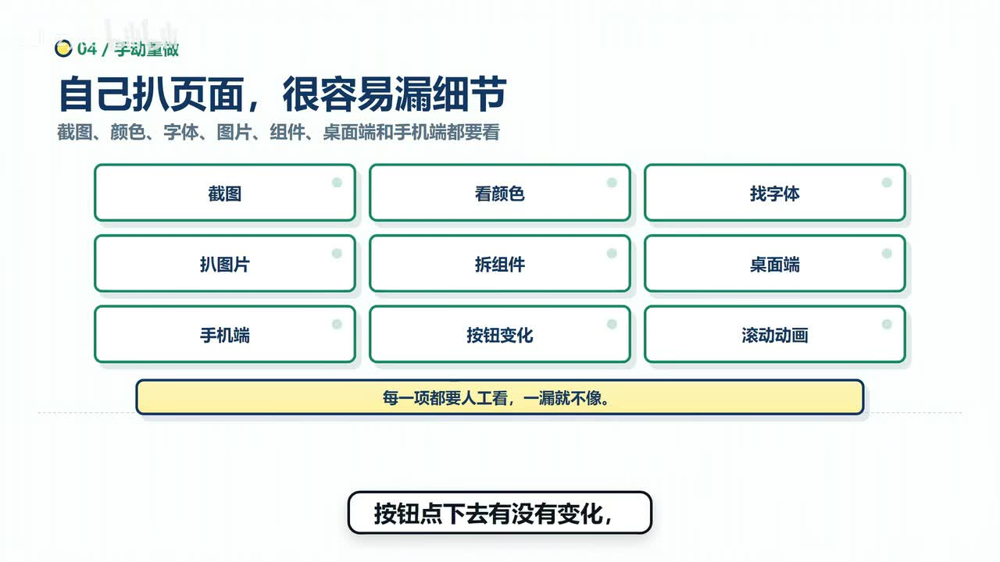
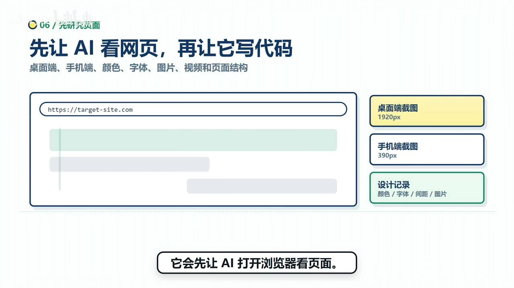
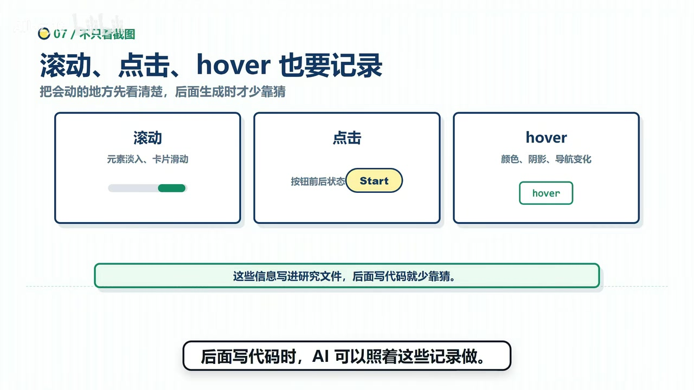

# 23K+ 星的 AI Website Cloner Template：把在线网站重建成 Next.js 项目

> 来源：[Bilibili 视频](https://www.bilibili.com/video/BV1dvTh6NE5z)  
> UP 主：AIlazy俊｜发布时间：2026-07-01（按元数据时间戳换算）｜时长：4 分 17 秒｜合集：AIcode  
> 项目地址：[JCodesMore/ai-website-cloner-template](https://github.com/JCodesMore/ai-website-cloner-template)

## 小结

视频介绍了 GitHub 项目 **AI Website Cloner Template**：这是一个给 AI 编程工具使用的网站前端重建模板，目标是把仍可访问、但源码丢失或难以维护的网站页面，重建为可继续开发的 **Next.js 项目**。视频口述该项目已有 **23K+ GitHub stars**。

核心方法不是“给 AI 一个网址，直接生成一页相似网页”，而是遵循 **先研究、后编码** 的流程：让 AI 通过浏览器查看目标页面，分别记录桌面端与移动端的布局，以及颜色、字体、间距、图片、视频、图标、结构和交互细节；再把这些观察结果写入研究或说明文件，作为后续生成代码的依据。

对于复杂页面，模板强调模块化拆分：导航栏、Hero 首屏、卡片区、页脚等分别成为独立任务，各自配套说明文件；完成后合并模块、运行构建，并与原网站截图进行对照。视频称最终前端项目使用 Next.js、React、Tailwind CSS 与 shadcn/ui，页面文字、组件和本地静态资源均可继续修改、接入接口并部署。

它适合迁移自己的 Webflow、WordPress、Squarespace 官网，找回仍在线但源码遗失的旧项目，或将公开网页作为设计与前端实现的学习对象。它不负责自动迁移登录、数据库、支付、后台、实时消息等后端业务能力，也不应被用于钓鱼或冒充他人品牌。

时效性方面，视频展示该仓库创建于 **2026 年 3 月 13 日**、最近一次代码更新为 **6 月 1 日**。星标数、更新时间、README 推荐工具、安装方式和兼容范围均可能变化，实际使用应以仓库当前文档为准。

## 思维导图





## 目录

- [项目背景、状态与问题场景](#项目背景状态与问题场景)
- [为什么直接让 AI 仿站容易失真](#为什么直接让-ai-仿站容易失真)
- [核心流程：先研究网页，再生成代码](#核心流程先研究网页再生成代码)
- [说明文件与模块化生成](#说明文件与模块化生成)
- [技术栈、前置条件与适用对象](#技术栈前置条件与适用对象)
- [限制、合规边界与时效性](#限制合规边界与时效性)
- [字幕比对](#字幕比对)
- [评论分析](#评论分析)
- [处理记录](#处理记录)

## 项目背景、状态与问题场景 [00:00](https://www.bilibili.com/video/BV1dvTh6NE5z?t=0)

视频介绍的仓库为 `JCodesMore/ai-website-cloner-template`，定位是一个面向 AI 编程工具的网站重建模板。根据视频展示与口述：

- 项目名称：AI Website Cloner Template；
- 视频展示星标数：23K+；
- 创建日期：2026 年 3 月 13 日；
- 最近代码更新：6 月 1 日；
- 展示的仓库组织包括：
  - `app/`：模板项目；
  - `components/`：重建出的 UI 模块；
  - `docs/`：研究笔记；
  - `README.md`：工作流与配置说明。



> 图：该帧同时给出项目仓库名、23K+ 星标、创建日期、最近更新日期，以及 `app/`、`components/`、`docs/`、`README.md` 的职责说明，是理解视频所述项目状态、规模与组织方式的直接视觉依据。

视频聚焦的真实问题是：一个网站的页面仍然在线，但原有代码可能已经不好修改、源代码遗失、原开发者离开，或团队不敢继续触碰旧项目。此时，需求不是保存一张网页截图，而是将页面重新实现为能长期维护的前端项目。

视频没有展示一个特定真实网站从输入网址到成品上线的完整操作录像，也没有提供视觉相似度、重建耗时、自动化成功率或性能测试数据。因此，“重建”应理解为该模板的工作目标，而非对任意网站一键完整迁移效果的保证。

## 为什么直接让 AI 仿站容易失真 [00:38](https://www.bilibili.com/video/BV1dvTh6NE5z?t=38)

视频指出，直接把网址交给 AI，通常能得到一个“看起来相似”的页面，但关键细节容易偏离。口述中列出的常见问题包括：

- 按钮间距不对；
- 字体观感不像原站；
- 图片缺少原页面中的层次；
- 一涉及手机端，布局容易混乱；
- 页面存在 `hover`、滚动变化或导航栏状态变化时，AI 容易遗漏；
- 点击按钮后的交互状态没有被记录。



> 图：画面将截图、颜色、字体、图片、组件、桌面端、手机端、按钮变化和滚动动画列为观察项，并强调“每一项都要人工看”。它解释了只依赖静态截图或单次提示词为何会遗漏页面细节。

网页重建至少需要覆盖三类信息：

| 信息类别 | 视频中对应的观察内容 | 影响 |
| --- | --- | --- |
| 视觉表现 | 颜色、字体、间距、图片、视频、图标 | 决定页面是否“像”原站 |
| 响应式布局 | 桌面端、移动端 | 决定不同屏幕下组件如何重排 |
| 动态行为 | 滚动、点击、`hover`、导航变化 | 决定页面使用过程是否接近原站 |

视频的经验判断是：若这些信息未在写代码前被显式记录，AI 在编码阶段就需要自行补全，复杂页面中的误差会逐步累积。

## 核心流程：先研究网页，再生成代码 [01:05](https://www.bilibili.com/video/BV1dvTh6NE5z?t=65)

该模板将重建过程拆为以下顺序：

1. 输入目标网址；
2. 让 AI 打开浏览器查看页面；
3. 采集桌面端、移动端和设计细节；
4. 观察页面结构与动态交互；
5. 将结果写入研究文件；
6. 根据研究记录生成前端代码；
7. 构建项目，并与原网页截图进行比对。

### 1. 采集跨端视觉信息 [01:10](https://www.bilibili.com/video/BV1dvTh6NE5z?t=70)

视频描述，AI 会通过浏览器实际查看目标页面，而不只分析一张静态截图。其观察范围包括：

- 桌面端页面截图；
- 移动端页面截图；
- 颜色、字体和间距；
- 图片、视频和图标；
- 自上而下的页面结构；
- 导航栏、Hero 首屏、卡片区等模块位置。



> 图：该帧展示输入目标网址后，分别保留 `1920px` 桌面端截图与 `390px` 手机端截图，并记录颜色、字体、间距、图片等设计信息。这说明该流程要求跨端采样，而非仅复刻单个视口。

视频中的画面参数为：

| 页面视口 | 视频展示值 | 用途 |
| --- | ---: | --- |
| 桌面端截图 | `1920px` | 记录宽屏布局与内容分布 |
| 手机端截图 | `390px` | 记录移动端重排与响应式表现 |

这些数值是视频画面所展示的示例尺寸；素材未说明它们是否为模板唯一支持的固定视口。

### 2. 记录动态与交互状态 [01:30](https://www.bilibili.com/video/BV1dvTh6NE5z?t=90)

视频强调，模板“不只看静态截图”。AI 还需要：

- 滚动页面，观察元素是否淡入、卡片是否滑动；
- 点击按钮，观察交互前后是否发生状态变化；
- 检查 `hover` 状态，例如颜色、阴影或导航栏变化。



> 图：该帧明确将动态研究划为“滚动、点击、hover”三项，示例包含元素淡入、卡片滑动、按钮前后状态、颜色、阴影与导航变化。它是区分“截图仿制”和“可交互前端重建”的关键证据。

视频的逻辑是：动态信息先被写入研究文件，后续 AI 生成代码时才能基于具体记录实现，而不是仅凭静态外观猜测动画和状态。

## 说明文件与模块化生成 [01:52](https://www.bilibili.com/video/BV1dvTh6NE5z?t=112)

### 先写说明，再写代码 [01:52](https://www.bilibili.com/video/BV1dvTh6NE5z?t=112)

视频将“先写说明文件、再写代码”视为工作流中的重要步骤。说明文件承担将视觉与行为观察转成可执行开发约束的作用。

视频明确举例的记录内容如下：

| 对象 | 应记录的信息 |
| --- | --- |
| 按钮 | 字号、颜色、圆角、内边距、Hover 状态 |
| Hero／首屏 | 背景图、前景图、叠加层 |
| 页面整体 | 颜色、字体、间距、图片、视频、图标、页面结构 |
| 交互行为 | 滚动动画、点击前后状态、导航栏变化 |

这样做的目的，是避免 AI 只依据某一张截图完成页面，从而遗漏层级、状态或响应式细节。视频认为，说明文件可以减少代码生成阶段的“靠猜”。

素材没有提供研究文件的实际文件格式、字段名、提示词内容或完整样例，因此不能将以上内容视为仓库中固定不变的配置规范。

### 按页面模块拆分任务 [02:12](https://www.bilibili.com/video/BV1dvTh6NE5z?t=132)

复杂页面不会被交给一个 AI 一次性完成。视频建议按页面区域拆分：

1. 导航栏作为一个任务；
2. 首屏作为一个任务；
3. 卡片区作为一个任务；
4. 页脚作为一个任务；
5. 每个任务都有自己的说明文件；
6. 完成后再将模块合并；
7. 运行构建；
8. 与原网页截图对照。

这种组织方式的价值在于：

- 将生成目标缩小到可验证的组件范围；
- 让每个模块的视觉和交互约束更清晰；
- 方便定位问题属于导航、首屏、卡片区还是页脚；
- 避免在一次性生成整页时因任务过大而丢失细节。

视频未展示具体组件代码、构建输出或截图差异结果，因此无法依据现有素材评价该流程的实际复刻精度。

## 技术栈、前置条件与适用对象 [02:35](https://www.bilibili.com/video/BV1dvTh6NE5z?t=155)

### 生成项目与技术栈 [02:35](https://www.bilibili.com/video/BV1dvTh6NE5z?t=155)

视频称，工作流最终产出的是可继续维护的前端项目，使用的技术包括：

| 类别 | 视频提及内容 | 视频所述作用 |
| --- | --- | --- |
| 前端框架 | Next.js | 作为重建项目基础 |
| UI 框架 | React | 组件化页面开发 |
| 样式方案 | Tailwind CSS | 编写页面样式 |
| 组件方案 | shadcn/ui | 提供 UI 组件能力 |
| 静态资源 | 图片、视频、图标放入本地项目 | 将页面资源纳入项目管理 |
| 页面内容 | 文字与组件变为代码 | 支持后续编辑、接接口和部署 |

ASR 将 `shadcn/ui` 识别为“ShadyCNUI”，本文依据技术栈上下文采用常见项目名称 `shadcn/ui`；这属于字幕校正，不代表素材提供了额外的配置细节。

视频提到，生成后的页面可以继续改内容、接接口和部署上线。但这表示前端代码具备继续开发的基础，不表示原网站的业务服务、用户数据或权限体系已被迁移。

### 本地与工具条件 [02:55](https://www.bilibili.com/video/BV1dvTh6NE5z?t=175)

视频提及的使用条件包括：

- 本机需要安装 **Node.js**；
- AI 工具需要具备控制浏览器的能力；
- README 推荐使用 **Claude Code**；
- 视频还提到其他工具的支持说明，包括：
  - Codex CLI；
  - Cursor；
  - Windsurf；
  - Gemini CLI。

视频称创建个人仓库与安装命令已显示在画面中，但当前提供的 ASR 文本没有保留可核验的完整命令，关键帧素材也未包含命令内容。因此本文不补写、猜测或伪造安装命令；具体安装、环境变量、依赖版本和运行方式应以仓库当前 README 为准。

### 适合的使用者 [03:08](https://www.bilibili.com/video/BV1dvTh6NE5z?t=188)

视频列出的适用人群有三类：

1. 希望把自己的官网从 Webflow、WordPress、Squarespace 迁出的用户；
2. 拥有仍可访问的旧网站，但找不到源代码或源代码难以维护的用户；
3. 希望通过拆解公开网页学习布局、配色、响应式和交互实现的开发者或学习者。

## 限制、合规边界与时效性 [03:28](https://www.bilibili.com/video/BV1dvTh6NE5z?t=208)

### 功能边界

视频明确表示，该工具处理的是**前端页面**。下列能力需要自行处理：

- 登录；
- 数据库；
- 付款或支付；
- 后台管理；
- 实时消息；
- 复杂权限逻辑；
- 目标站点关联的数据逻辑。

若原站本身存在较多权限控制与数据业务，不应期待通过该模板一次性将整个系统完整搬迁。

### 合规边界

视频明确提出两项不应使用该工具的场景：

- 不用于钓鱼业务；
- 不用于冒充他人品牌。

视频认为更合理的使用方式是：

- 迁移自己的网站；
- 找回自己的旧项目；
- 学习公开页面如何实现。

即使目标页面可公开访问，复刻其视觉、品牌、图片、文案或交互，也不自动获得相关素材、商标和内容的使用授权；实际项目仍需自行确认权利归属与合规要求。

### 与截图工具的区别

视频将截图工具与该模板作了区分：

- 截图工具只保留一张图；
- AI Website Cloner Template 试图保留的是可运行、可修改的前端代码。

这一差异的前提是研究记录、页面模块拆分和构建对比都能被实际执行。视频没有展示其对任意网站的完整成功案例，因此结果质量仍取决于目标页面复杂度、资源可访问性、浏览器自动化能力及后续人工校验。

### 时效性说明

以下信息均为视频录制或展示时的状态：

- 23K+ 星标；
- 2026 年 3 月 13 日创建；
- 6 月 1 日最近代码更新；
- Claude Code、Codex CLI、Cursor、Windsurf、Gemini CLI 等工具支持说明；
- README 中的安装与使用流程。

仓库提交记录、星标、依赖版本、AI 工具兼容性和命令参数都可能发生变化。使用前应以 GitHub 仓库最新 README 与实际代码为准。

## 字幕比对 [00:00](https://www.bilibili.com/video/BV1dvTh6NE5z?t=0)

本次任务已执行 ASR。站内字幕与视频主题明显不匹配，因此正文以本次 ASR 为主，并以视频标题、简介、元数据、关键帧和上下文校正专有名词。

| 字幕来源 | 完整性 | 专有名词 | 时间轴 | 主要问题 |
| --- | --- | --- | --- | --- |
| Bilibili 站内字幕 | 无法覆盖本视频主题 | 未包含项目名称、技术栈或工作流 | 未提供可用分段时间信息 | 内容为英文歌词及“假期赶作业崩溃”相关对白，与本视频主题错配 |
| 本次 ASR 字幕 | 基本覆盖项目背景、流程、技术栈、适用对象和限制 | 大部分可辨识，少数词语有误识别 | 提供连续文本，未附逐句时间码 | 存在“自体”“手屏”“夜角”“Howard”等识别偏差 |

采用策略：

- **不采用站内字幕作为事实来源**：其内容与视频主题无关；
- **以本次 ASR 为正文基础**：其内容完整覆盖视频叙事；
- **用关键帧、标题、简介与语境校正术语**；
- **时间轴按叙事段落定位**：由于素材未提供逐句时间码，不能宣称精确到每一句话。

重要校正如下：

| ASR 原文或疑似误识别 | 本文采用表述 | 校正依据 |
| --- | --- | --- |
| AI Web site Cloner Template | AI Website Cloner Template | 视频标题、简介、项目地址一致 |
| 自体 | 字体 | 与颜色、间距并列的设计信息语境 |
| 手屏 | 首屏 | 与 Hero 模块及页面区域拆分语境一致 |
| 夜角 | 页脚 | 与导航栏、首屏、卡片区并列 |
| Howard | `hover` | 关键帧画面明确写有 `hover` |
| ShadyCNUI | shadcn/ui | 常见技术栈名称与视频语境一致 |
| Cloud Code | Claude Code | 元数据标签与 AI 编程工具语境一致 |
| Windsor | Windsurf | 与 Cursor、Gemini CLI 并列出现的工具语境 |

## 评论分析 [00:00](https://www.bilibili.com/video/BV1dvTh6NE5z?t=0)

本次仅处理可获取的热评前三条。热评数据返回：

```text
items: []
```

因此，本次没有可获取的热评可供分析。虽然视频元数据显示总回复数为 1，但该回复未出现在本次可访问的热评前三条结果中。

没有可分析的评论观点、额外补充、争议或可信度信息；本文不会将不可获取的评论内容推断为观众立场或项目事实。

## 处理记录 [00:00](https://www.bilibili.com/video/BV1dvTh6NE5z?t=0)

- Worker ID：`worker-mrj0www4-e8d79408`
- 模型：`gpt-5.6-terra`
- 调用工具与素材：视频元数据读取、站内字幕读取、本次音频 ASR、关键帧提取、热评数据读取。
- 可用素材输出：`merged.mp4`、`audio/audio.wav`、`frames/`、`info.json`、`comments/comments.json`、`subtitles/`、`asr/`。
- 字幕选择：本次 ASR 已执行；站内字幕与视频主题错配，正文以 ASR 为主，并通过标题、简介、关键帧与上下文校正专有名词。
- 关键帧选择依据：
  - `frames/frame-001.jpg`：展示仓库名、23K+ 星标、创建/更新时间及目录职责，用于项目状态与工程组织；
  - `frames/frame-002.jpg`：展示截图、字体、颜色、跨端、按钮变化和滚动动画等检查项，用于解释仿站易漏细节；
  - `frames/frame-003.jpg`：展示目标网址、1920px 桌面端、390px 手机端和设计记录，用于说明研究阶段的输入与参数；
  - `frames/frame-004.jpg`：展示滚动、点击、`hover` 的记录范围，用于说明动态交互采集。
- 评论处理：仅检查可获取的热评前三条；返回为空，未扩展分析普通评论或不可见评论。
- 缓存清理：提供的素材与执行信息中未包含缓存清理日志，无法确认清理是否执行；不将其表述为已完成。
- 未解决问题：
  - 素材未提供逐句字幕时间码，正文链接按视频叙事阶段定位；
  - 未提供完整 README、安装命令、依赖版本与真实运行日志，具体操作须以仓库当前文档为准；
  - 视频展示的星标数、创建日期、更新时间和工具支持范围均具有时效性。

## 评论分析

本次流程未获取到可用热评，因此不推断观众态度或额外结论。
