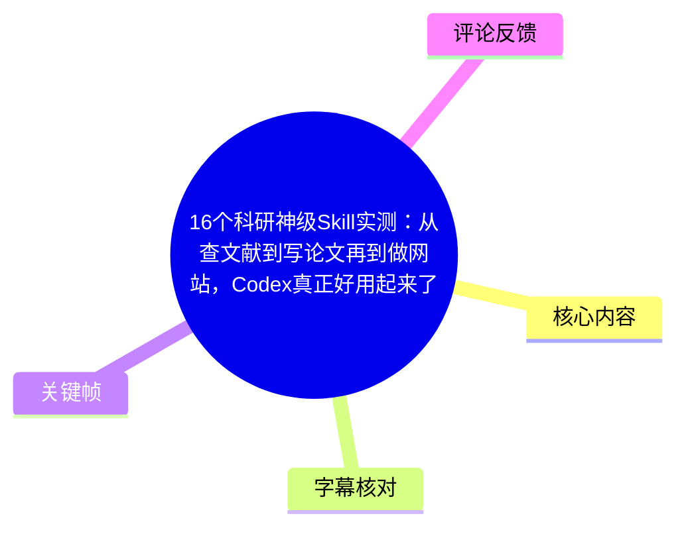
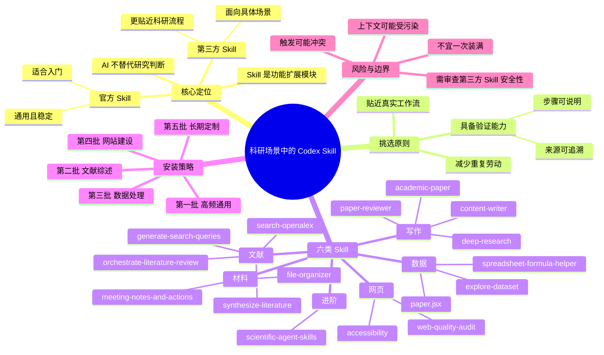
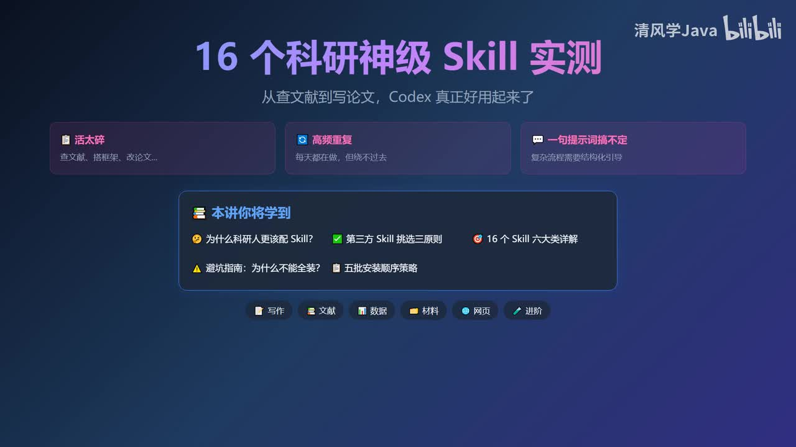
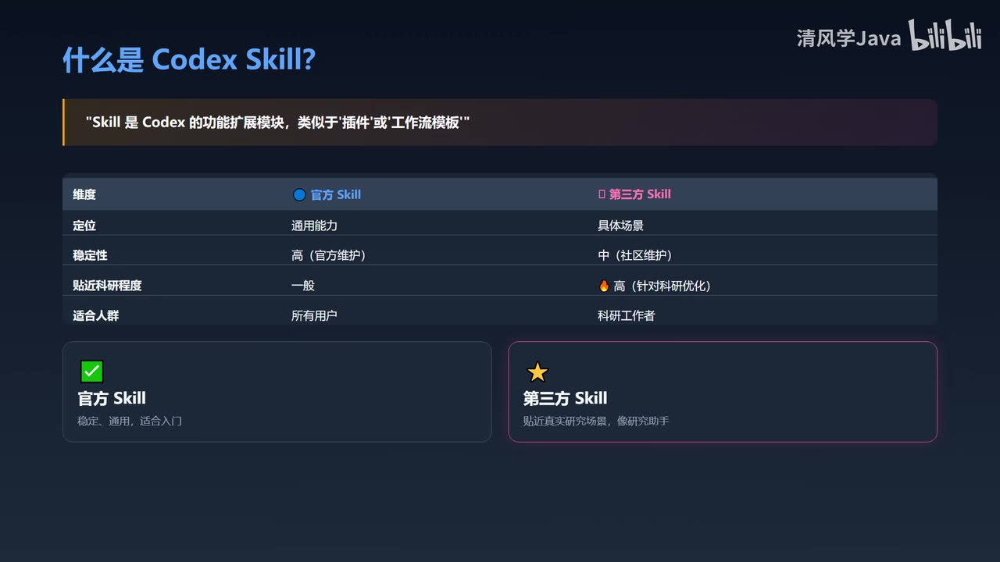
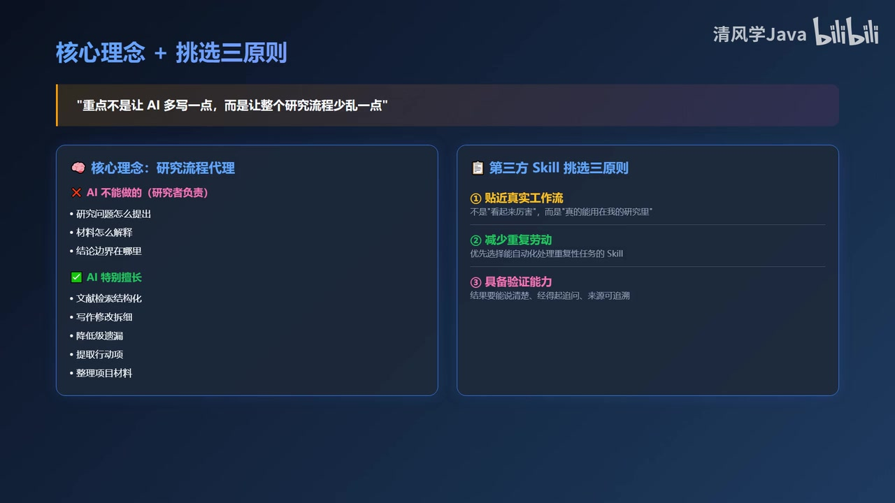
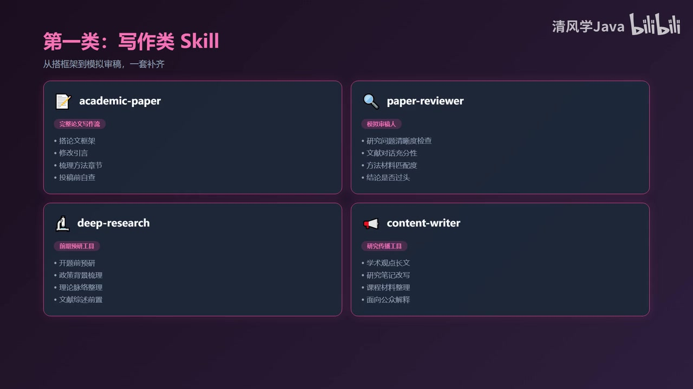

# 16个科研神级Skill实测：从查文献到写论文再到做网站，Codex真正好用起来了

> 来源：[Bilibili 视频](https://www.bilibili.com/video/BV1nqN16VENC) 
> UP 主：清风学Java｜时长：12 分 35 秒｜合集：AIcode  
> 主题：面向科研工作流的 Codex 第三方 Skill 选型、16 个 Skill 的用途梳理，以及分批安装策略。

## 小结

视频将 Codex Skill 定义为功能扩展模块，类似“插件”或“工作流模板”。作者的核心主张不是让 AI 替科研人员作出研究判断，而是让它承担高频、重复、可流程化的环节：文献检索与综合、论文结构和投稿前检查、数据表处理、会议纪要转行动项、项目文件归档，以及研究网页的质量与可访问性检查。

作者将官方 Skill 与第三方 Skill 区分为“通用能力”和“具体场景”：官方 Skill 更稳定、适合入门；第三方 Skill 未必全能，但可能更贴合科研场景。第三方 Skill 的选择标准有三项：是否贴近真实工作流、能否减少重复劳动、是否具备可解释和可追问的验证能力。

视频共列出 16 个 Skill，分为写作、文献、数据、材料、网页和进阶六类。其中，写作类覆盖论文框架、模拟审稿、前期研究梳理与研究传播；文献类覆盖检索式生成、OpenAlex 初筛、文献综合和完整综述编排；数据类关注表格公式、数据集概览和标准化报告输出。

最重要的实践建议是**不要一次装满 Skill**。作者指出，安装过多可能造成多个 Skill 同时争夺任务、导致触发混乱，也会因规则和流程说明叠加而使上下文“变脏”。推荐按照“高频通用 → 文献综述 → 数据 → 网站 → 长期定制”五批逐步安装。

视频中的推荐属于作者对 Skill 用途的介绍与评价，未展示具体安装命令、仓库地址、版本号、权限范围、执行日志或可复现的性能对比。因此，实际使用前仍应自行审查 Skill 的来源、代码、依赖、数据权限、网络访问行为和输出可靠性。科研问题的提出、材料解释与结论边界，仍须由研究者负责。

## 思维导图

## 目录

- [背景：为什么科研人员需要 Skill](#背景为什么科研人员需要-skill)
- [核心理念与第三方 Skill 挑选原则](#核心理念与第三方-skill-挑选原则)
- [写作类：从框架到模拟审稿](#写作类从框架到模拟审稿)
- [文献类：搜准、筛清、综合好](#文献类搜准筛清综合好)
- [数据类：表格处理与标准化输出](#数据类表格处理与标准化输出)
- [材料类：会议行动项与项目归档](#材料类会议行动项与项目归档)
- [网页类：质量审计与可访问性](#网页类质量审计与可访问性)
- [进阶类：沉淀课题组工作流](#进阶类沉淀课题组工作流)
- [五批安装顺序与实践步骤](#五批安装顺序与实践步骤)
- [限制、风险与时效性](#限制风险与时效性)
- [字幕比对](#字幕比对)
- [评论分析](#评论分析)
- [处理记录](#处理记录)

## 背景：为什么科研人员需要 Skill [00:00:30](https://www.bilibili.com/video/BV1nqN16VENC?t=30)

视频从科研工作中的“碎片化高频任务”切入：查文献、搭论文框架、模拟审稿、整理会议纪要、检查数据缺失值、归档项目材料等。作者认为，这些任务单独看通常不难，却因重复频繁、步骤零散，难以仅靠一句临时提示词稳定完成。

作者将 Skill 视为预先沉淀的流程，而非单次问答。其价值在于把常见任务的步骤、检查点和输出形式固定下来，减少研究流程中的混乱与低级遗漏。

> 图：关键帧集中展示“16 个科研神级 Skill 实测”的主题、六大分类和“五批安装顺序策略”。它为全文的分类框架和后续安装策略提供了视觉总览。

### 官方 Skill 与第三方 Skill 的定位 [00:00:54](https://www.bilibili.com/video/BV1nqN16VENC?t=54)

作者认可先安装官方 Skill 的路径：官方 Skill 的特点是稳定、通用，适合初学者建立基本使用方式。但在长期科研场景中，第三方 Skill 可能更贴近具体工作流，例如持续写论文、做综述、整理数据、归档材料和研究传播。

视频给出的对比可整理如下：

| 维度 | 官方 Skill | 第三方 Skill |
| --- | --- | --- |
| 定位 | 通用能力 | 具体场景 |
| 稳定性 | 较高，作者归因于官方维护 | 中等，作者归因于社区维护 |
| 科研场景贴合度 | 一般 | 较高，面向研究任务优化 |
| 适用对象 | 所有用户、适合入门 | 有特定流程需求的科研工作者 |

> 图：画面以表格明确比较两类 Skill 的定位、稳定性、科研贴合程度与适用人群；可用于避免把“第三方”简单等同于“更好”或“完全替代官方工具”。

## 核心理念与第三方 Skill 挑选原则 [00:01:43](https://www.bilibili.com/video/BV1nqN16VENC?t=103)

作者提出应将 Codex 理解为“**研究流程代理**”，而不是“研究判断代理”。前者可以帮助研究人员将流程顺下来；后者涉及研究问题、材料解释和结论边界，不能交由 AI 最终决定。

### 研究者必须保留的判断

视频明确列出以下事项仍由研究者负责：

- 研究问题如何提出；
- 研究材料如何解释；
- 结论边界在哪里；
- 对结果、来源和推理过程承担责任。

### Skill 特别适合的流程性任务

作者认为 Skill 更适合处理：

- 让文献检索更结构化；
- 把写作与修改拆分为清晰步骤；
- 检查数据中的缺失值、异常或低级疏漏；
- 将会议讨论转化为可执行的行动项；
- 将分散的项目文件整理成可维护的结构。

### 第三方 Skill 的三项挑选原则 [00:02:31](https://www.bilibili.com/video/BV1nqN16VENC?t=151)

1. **贴近真实工作流**：不以“看起来厉害”为标准，而看能否进入自身研究流程。
2. **减少重复劳动**：优先处理科研中反复出现、规则明确的任务。
3. **具备验证能力**：结果不仅要通顺，还应能说明资料来源、分析步骤并经得起追问。

> 图：左侧强调 AI 不应承担研究判断，右侧列出“贴近真实工作流、减少重复劳动、具备验证能力”。这张图是理解视频立场与风险边界的关键依据。

## 写作类：从框架到模拟审稿 [00:02:55](https://www.bilibili.com/video/BV1nqN16VENC?t=175)

写作类共有 4 个 Skill。作者的思路不是只用 AI 润色局部句子，而是把论文写作拆解为选题、文献、结构、论证、摘要、格式与投稿前检查等环节。

| 序号 | Skill | 视频所述定位 | 适用任务与检查点 |
| --- | --- | --- | --- |
| 1 | `academic-paper` | 完整论文写作流 | 搭论文框架、修改引言、梳理方法章节、检查讨论部分、投稿前系统自查 |
| 2 | `paper-reviewer` / `academic-paper-reviewer` | 模拟审稿人 | 检查研究问题清晰度、文献对话充分性、方法与材料匹配度、论证跳步、结论是否过度 |
| 3 | `deep-research` | 前期研究梳理工具 | 开题前预研、政策背景梳理、理论脉络整理、研究路径规划 |
| 4 | `content-writer` | 研究传播工具 | 将研究内容改写为公众号文章、课程讲义、研读笔记、长推文等 |

### 1. `academic-paper`：将论文写作变成完整流程 [00:03:19](https://www.bilibili.com/video/BV1nqN16VENC?t=199)

作者将其描述为完整论文写作流程，而非单段润色工具。覆盖的环节包括：选题、文献、结构、论证、摘要、格式、投稿前检查。适合用于建立论文框架和系统化自查。

### 2. `paper-reviewer`：投稿前的反向质检 [00:03:44](https://www.bilibili.com/video/BV1nqN16VENC?t=224)

该 Skill 的价值在于“提前挑问题”，而不是对文本给出泛泛好评。视频重点强调以下审稿式问题：

- 研究问题是否清楚；
- 是否与既有文献形成充分对话；
- 方法和材料是否真正匹配；
- 论证过程是否存在跳步；
- 结论是否超过证据支持范围。

### 3. `deep-research`：用于研究前期，而非自动代写 [00:04:08](https://www.bilibili.com/video/BV1nqN16VENC?t=248)

作者特别限定其使用边界：适合围绕研究议题梳理背景、争论、可能材料和研究路径；不适合被理解为自动写论文的工具。

### 4. `content-writer`：科研内容转向公众传播 [00:04:32](https://www.bilibili.com/video/BV1nqN16VENC?t=272)

该 Skill 并非传统论文写作工具，更适合将学术内容转化为面向不同读者的表达，如课程讲义、研究笔记和公众传播文本。

> 图：画面给出 `academic-paper`、`paper-reviewer`、`deep-research`、`content-writer` 四张功能卡片。其价值在于将“写论文”拆为框架、审稿、前期梳理与传播四种不同任务，避免单一 Skill 承担所有环节。

## 文献类：搜准、筛清、综合好 [00:04:57](https://www.bilibili.com/video/BV1nqN16VENC?t=297)

作者认为，文献工作的效率差距不只在于是否能“搜到”，更在于能否“搜准、筛清、综合好”。

| 序号 | Skill | 视频所述用途 | 注意点 |
| --- | --- | --- | --- |
| 5 | `generate-search-queries` | 将自然语言研究问题拆为可执行检索词组合 | 特别适合中英文混合、概念多义、同义表达复杂的场景 |
| 6 | `search-openalex` | 基于 OpenAlex 做国际文献的第一轮摸底 | 不能替代正式学术数据库 |
| 7 | `synthesize-literature` | 将一批文献整理为结构化认知 | 可按问题、方法、样本、发现、局限、争议点归纳 |
| 8 | `orchestrate-literature-review` | 编排完整综述流程 | 覆盖检索、去重、筛选、摘要、质量评价与主题综合 |

### 检索式先于检索结果 [00:04:57](https://www.bilibili.com/video/BV1nqN16VENC?t=297)

`generate-search-queries` 的目标是把自然语言研究问题转换为可操作的关键词组合。视频认为，综述效果不好，原因未必是数据库能力不足，也可能是检索式过粗。

### OpenAlex 适用于初步摸底 [00:05:21](https://www.bilibili.com/video/BV1nqN16VENC?t=321)

作者推荐 `search-openalex` 用于快速建立文献池，识别高被引文章、核心作者、DOI 和相关主题；同时明确指出，它不能替代正式数据库。对于系统综述、证据综合或需满足特定检索规范的研究，仍应使用适用的正式数据库、完整检索记录和人工筛选流程。

### 从文献集合到结构化综述 [00:05:45](https://www.bilibili.com/video/BV1nqN16VENC?t=345)

`Synthesize-literature` 更偏向“文献综合器”：将文献按研究问题、方法、样本、发现、局限和争议点等维度组织。`orchestrate-literature-review` 则覆盖整条综述链路，包括检索、去重、筛选、摘要、质量评价、主题综合，适用于系统综述、范围综述与开题前文献梳理。

## 数据类：表格处理与标准化输出 [00:06:09](https://www.bilibili.com/video/BV1nqN16VENC?t=369)

视频指出，并非每位研究者都会写 Python，但绝大多数人都要处理 Excel、Google Sheets 或结构化数据。因此，这一类 Skill 的重点是降低表格操作与数据检查中的重复成本。

| 序号 | Skill | 视频所述用途 | 典型场景 |
| --- | --- | --- | --- |
| 9 | `spreadsheet-formula-helper` | 处理公式、透视表、数组公式和表格报错 | 问卷数据整理、访谈编码表、变量重编码、公式排错 |
| 10 | `explore-dataset` | 在建模或统计前快速了解数据 | 查看行列数量、缺失值、变量分布、异常情况、样本结构 |
| 11 | `paper.jsx` | 将结构化数据转成标准化输出 | 报告、课题简报、附录、进展会材料 |

### 先探索数据，再进入分析 [00:06:34](https://www.bilibili.com/video/BV1nqN16VENC?t=394)

作者建议在正式建模、统计或编码之前，先使用 `explore-dataset` 了解数据的基础形态：有多少行列、缺失值在哪里、变量分布是否异常、样本结构是否合理。这个步骤旨在减少后续分析建立在错误数据认知上的风险。

### `paper.jsx` 的定位是标准化输出 [00:06:58](https://www.bilibili.com/video/BV1nqN16VENC?t=418)

视频强调 `paper.jsx` 的主要价值不在“自动排版”本身，而在将已有结构化数据快速转化为可交付的报告、课题简报、附录或进展汇报材料。

## 材料类：会议行动项与项目归档 [00:07:22](https://www.bilibili.com/video/BV1nqN16VENC?t=442)

科研项目的风险常不在于“不会做”，而在于完成后材料分散、决策丢失、文件难找。视频推荐两个面向项目管理的 Skill。

| 序号 | Skill | 视频所述作用 |
| --- | --- | --- |
| 12 | `meeting-notes-and-actions` | 将组会、访谈复盘、项目讨论转成结构化纪要；提取决策、分歧、开放问题和行动项 |
| 13 | `file-organizer` | 对 PDF、访谈记录、数据表、代码、图表、投稿文件、补充材料进行项目级归档与文件整理 |

### 会议纪要不等于行动管理 [00:07:22](https://www.bilibili.com/video/BV1nqN16VENC?t=442)

作者强调 `meeting-notes-and-actions` 不只是生成文字纪要，更重要的是把讨论中不同性质的信息拆开：

- 已达成的决策；
- 未解决的分歧；
- 开放问题；
- 后续行动项。

这能让“讨论充分”转化为可追踪的执行结果。

### 文件整理应前置，而不是事后补救 [00:07:46](https://www.bilibili.com/video/BV1nqN16VENC?t=466)

`file-organizer` 面向项目级归档。作者的判断是：如果 PDF、访谈记录、数据表、代码、图表、投稿文件和补充材料在前期没有整理，后期会进入“找文件找半天”的低效状态。

## 网页类：质量审计与可访问性 [00:08:10](https://www.bilibili.com/video/BV1nqN16VENC?t=490)

视频认为研究网站“能打开”并不足够。对于研究项目网站、数字人文展示页、课程资料站和公开数据展示页面，还应考虑其是否能被顺利阅读、检索和引用。

| 序号 | Skill | 视频所述作用 |
| --- | --- | --- |
| 14 | `web-quality-audit` | 从性能、可访问性、SEO 基础和网页规范检查页面质量 |
| 15 | `accessibility` | 优先改善不同设备、网络和阅读条件下的访问体验 |

### `web-quality-audit`：检查网页质量下限 [00:08:10](https://www.bilibili.com/video/BV1nqN16VENC?t=490)

作者指出，研究网站容易只追求视觉或功能“上限”，忽略基础质量。该 Skill 被描述为可从性能、可访问性、SEO 基础和网页规范等角度进行检查。

### `accessibility`：让研究传播不排除部分读者 [00:08:34](https://www.bilibili.com/video/BV1nqN16VENC?t=514)

作者称，如果网页类 Skill 只安装一个，会优先选择 `accessibility`。理由是研究传播不应只服务于设备最好、网速最快、阅读条件最优的人群；可访问性不足会使一部分读者天然被排除在外。

## 进阶类：沉淀课题组工作流 [00:08:58](https://www.bilibili.com/video/BV1nqN16VENC?t=538)

第 16 个 Skill 是 `scientific-agent-skills`。视频将其描述为较大型的科研 Skill 集合，覆盖写作、文献、数据分析、图表、海报、Python 包和研究流程等多个方向，对跨学科研究者有吸引力。

但作者不建议一开始就安装其全部内容，而是先查看清单、根据实际需求选择。视频最终将“自己课题组的工作流”视为长期最有价值的资产：相比直接使用别人写好的通用 Skill，将本课题组的研究记录、质量检查、文件组织和协作流程沉淀为自定义 Skill，更可能产生持续价值。

## 五批安装顺序与实践步骤 [00:09:23](https://www.bilibili.com/video/BV1nqN16VENC?t=563)

### 为什么不能“看见好用就全装” [00:09:23](https://www.bilibili.com/video/BV1nqN16VENC?t=563)

作者给出两个主要问题：

1. **触发混乱**：多个 Skill 都可能认为自己匹配当前任务，Codex 反而难以判断该进入哪条流程。
2. **上下文变脏**：每个 Skill 都会带来规则、说明和流程逻辑；积累过多可能干扰当前任务判断。

因此，视频建议遵循“先高频、再专业、最后进阶”的顺序。

### 推荐的五批安装策略 [00:10:11](https://www.bilibili.com/video/BV1nqN16VENC?t=611)

| 批次 | 目标 | 视频列举的 Skill | 使用前提 |
| --- | --- | --- | --- |
| 第一批 | 解决最通用的写作、审稿、会议、表格需求 | `academic-paper`、`paper-reviewer`、`content-writer`、`meeting-notes-and-actions`、`spreadsheet-formula-helper` | 已明确存在高频对应任务 |
| 第二批 | 文献综述 | `generate-search-queries`、`search-openalex`、`synthesize-literature`、`orchestrate-literature-review` | 正在做综述、开题或持续文献追踪 |
| 第三批 | 数据处理与报告输出 | `explore-dataset`、`spreadsheet-formula-helper`、`paper.jsx` | 有结构化数据、表格或阶段性汇报需求 |
| 第四批 | 研究网站建设 | `web-quality-audit`、`accessibility` | 正在维护项目站、展示页或课程资料站 |
| 第五批 | 长期进阶与定制 | `scientific-agent-skills`、自定义 Skill | 已形成较稳定的个人或课题组流程 |

### 可执行的落地流程

结合视频建议，可将试用过程整理为以下步骤：

1. **盘点任务**：连续记录一段时间内最重复、最耗时、规则最明确的科研任务。
2. **选一个高频环节**：不要按“Skill 数量”选，而按实际痛点选，例如会议纪要、检索式设计或表格公式排错。
3. **建立输入与输出标准**：明确输入材料范围、期望输出格式、是否必须保留来源、是否要求列出不确定项。
4. **小范围试运行**：先在非关键或可人工复核的任务上运行，不要直接将其用于不可逆的研究决策。
5. **人工验证**：核查文献来源、数据处理逻辑、引用、结论是否越界，以及文件操作是否误删或误归档。
6. **保留可复用模板**：将稳定的提示、目录规范、输出表格和检查清单沉淀为本人的工作流。
7. **按需扩展**：当前一批 Skill 已能稳定服务于任务后，再加入下一批；发生冲突时优先减少而非继续叠加。

## 限制、风险与时效性 [00:10:57](https://www.bilibili.com/video/BV1nqN16VENC?t=657)

### 视频明确强调的边界

作者再次强调，Skill 不能替代研究判断。研究问题、材料解释和结论边界仍由研究者负责；Skill 更适合处理重复材料处理、标准流程执行、可疑结果检查、研究记录维护、项目文件归档和写作前后自查。

### 本视频未提供的信息

以下内容未在给定视频字幕、关键帧或元数据中出现，不能据此补全或推定：

- 各 Skill 的安装地址、代码仓库、维护者、许可证与版本号；
- 具体安装命令、配置文件、依赖项或 API 密钥要求；
- 各 Skill 的实际运行界面、任务输入样例、输出样例和失败案例；
- “实测”的评价指标、测试数据集、对照组、成功率、速度或成本；
- 第三方 Skill 的数据上传范围、联网行为、文件读写权限和安全审计情况；
- 对 OpenAlex、SEO、可访问性检查或 `paper.jsx` 的具体技术实现。

### 使用第三方 Skill 的额外风险

视频推荐第三方 Skill，但没有展示安全审查过程。科研人员在安装或授予文件、网络、代码执行权限前，至少应自行确认：

- 是否来自可信维护者，是否有可审阅的源代码与更新记录；
- 是否读取、上传或保留未公开论文、原始数据、受访者材料或项目文件；
- 是否会执行 shell 命令、写入文件、修改目录或调用外部服务；
- 是否能保留文献来源、筛选理由和数据变换记录；
- 输出是否经过人工核对，尤其是引用、统计结论和研究性表述。

### 时效性

本视频围绕 Codex 与第三方 Skill 的工作流建议，工具名称、可用性、兼容性、功能范围、维护状态和安全策略都可能随时间变化。视频元数据记录的发布时间为 2026 年 7 月；实际安装前应以对应 Skill 的官方说明、代码仓库或平台当前页面为准。视频所提“16 个”名称应视作当期清单，而非永久有效的标准配置。

## 字幕比对

| 字幕来源 | 完整性 | 专有名词 | 时间轴 | 主要问题 |
| --- | --- | --- | --- | --- |
| Bilibili 站内字幕 `p01-ai-zh.srt` | 与本视频完全不匹配 | 内容为沃尔玛食品、烘焙与超市商品评价，与视频主题无关 | 0:00–6:32，看似完整但对应另一支视频 | 不能用于本视频事实提取或时间定位 |
| 本次 ASR 字幕 | 较完整：32 段，语音覆盖约 723.89 秒，占视频约 95.93% | 多个中文词和 Skill 名称存在错听、断词或连写 | 30.42–754.57 秒，有可用真实时间戳 | 开场第一段被切为极短片段；如“科研/研究”“文献”等存在错字，部分英文名识别不稳定 |

### 最终字幕选择

正文以**本次 ASR 时间轴**作为时间定位依据。该 ASR 检测到中文音轨，诊断中未标记 `noAudioStream=true`；因此不存在“源视频没有音轨”的情形。站内字幕虽可获取，但内容与本视频标题、ASR 内容和关键帧完全冲突，故不采用。

结合关键帧和上下文，对 ASR 中影响理解的术语作了有限校正：

| ASR 表述或问题 | 正文采用 | 校正依据 |
| --- | --- | --- |
| “科砘人”“科砷工作者”“研修” | 科研人、科研工作者、研究 | 语境和视频标题 |
| “content-research-writer” | `content-writer` | 写作类关键帧中的卡片名称 |
| “academic paper reviewer” | `paper-reviewer`，并保留 ASR 所述模拟审稿功能 | 写作类关键帧显示 `paper-reviewer` |
| “search, walks, openelix” | `search-openalex` | 上下文明确提到 OpenAlex；此为基于语音纠错的规范化写法 |
| “去蟲” | 去重 | 文献综述工作流语境 |
| “paper JSX” | `paper.jsx` | ASR 英文发音与上下文 |
| “ac cessibility” | `accessibility` | ASR 断词及网页可访问性语境 |

上述校正仅用于恢复视频明显表达的名称，不代表已经核验这些 Skill 的实际仓库、包名或安装方式。

## 评论分析

仅处理本次可获取的热评前三条。评论反映的是观众态度或需求，不构成已验证的工具事实。

| 评论者 | 点赞 | 评论内容概括 | 分析 |
| --- | ---: | --- | --- |
| 努力学设计的程序员 | 1 | 请求通过私信获取视频总结 | 表明观众对可保存、可复用的知识整理有需求；没有补充任何 Skill 的性能或使用证据。 |
| bili_3707023472462356 | 1 | 表示“每次看都有收获” | 是正向观看反馈，反映内容对该观众具备启发性；属于主观评价，不能据此验证推荐工具的实际效果。 |
| 官方20刀可开票149r | 0 | “有货有货” | 缺少明确上下文，无法判断其指向的是资料、服务还是其他内容；不应据此推导价格、购买渠道或资源真实性。 |

## 处理记录

- Worker ID：`worker-mrj0wjed-b0c290ad`
- 模型：`gpt-5.6-terra`
- 素材工具产物：视频元数据、关键帧 `frames/`、音频 `audio/audio.wav`、本次 ASR 结果 `asr/asr-result.json`、ASR SRT、站内字幕、热评 JSON。
- 字幕选择：检查了站内 SRT 与本次 ASR。站内字幕实际为沃尔玛食品评测内容，与本视频不符；采用有时间戳、覆盖率约 95.93% 的本次 ASR 作为正文时间轴来源，并依据关键帧校正少量明显错听的 Skill 名称。
- 关键帧依据：选用 `frame-001` 说明主题、六大类别与五批策略；`frame-002` 对比官方和第三方 Skill；`frame-003` 说明研究流程代理边界与三项选型原则；`frame-004` 呈现四个写作类 Skill 的画面名称和分工。未将未展示内容的其他关键帧强行关联到正文。
- 时间轴依据：章节时间链接均优先按照本次 ASR SRT 的真实起始时间换算为秒数；ASR 首段语音起于 30.42 秒。
- 缓存清理：提供的素材中未包含缓存清理执行日志，无法确认是否已执行清理；本记录不将其表述为已完成。
- 未解决问题：无法从现有素材核验 16 个 Skill 的仓库来源、安装方法、维护状态、代码安全性、权限要求、实际运行结果及性能对比。
