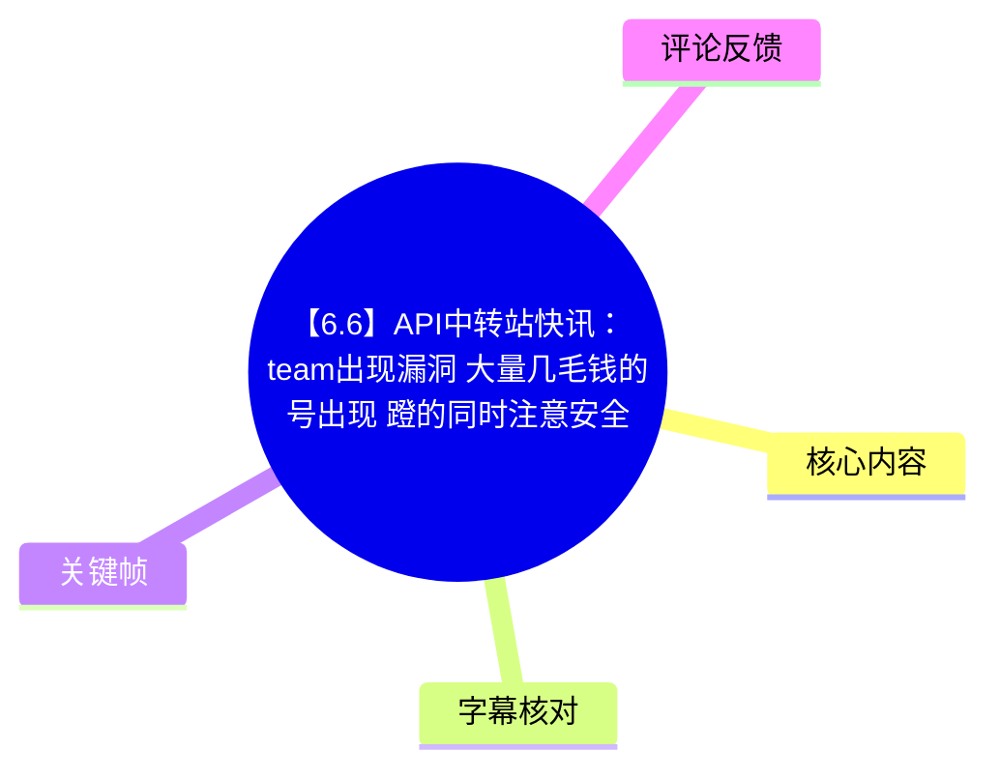
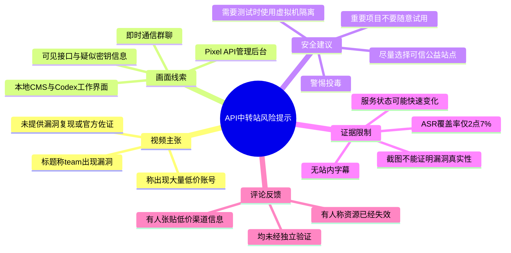
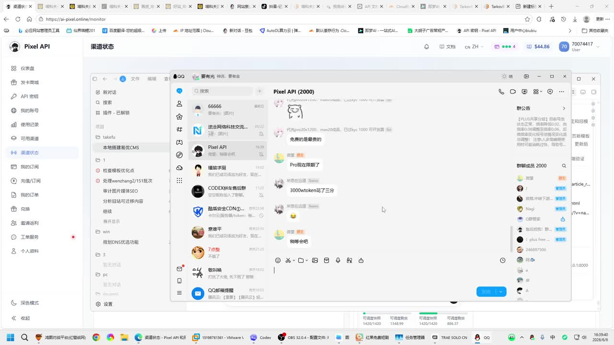
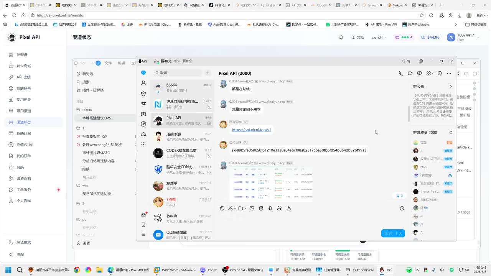
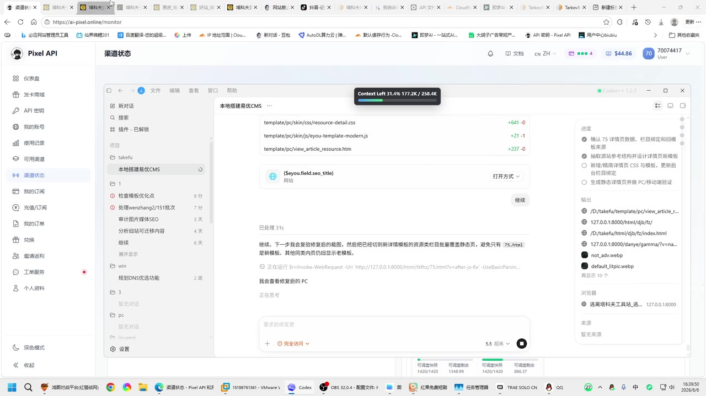
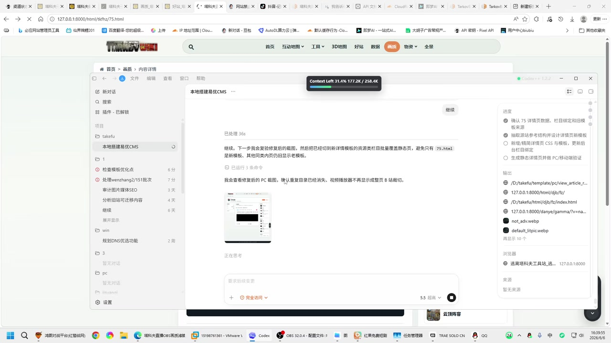

# 【6.6】API中转站快讯：team出现漏洞 大量几毛钱的号出现 蹬的同时注意安全

> 来源：[Bilibili 视频](https://www.bilibili.com/video/BV1Kj7Q6NEQf) 
> UP 主：生于忧患死于忧患｜视频时长：65 秒｜标签：网络安全、API、中转站 
> 数据抓取时视频统计：2,172 播放、8 点赞、15 收藏、3 回复（抓取时间：2026-07-16）。

## 小结

视频以“API 中转站快讯”为主题。UP 主在标题和简介中称，某个被称为 “team” 的对象“出现漏洞”，并导致市场上出现大量低价账号；但视频未给出漏洞编号、受影响产品的准确名称、复现步骤、官方公告或独立验证材料。因此，这应被视为**风险提示与市场传闻转述**，而不是已经证实的安全通报。

视频简介最明确、可直接执行的经验是：面对网上大量出现的公益 API 中转站，应区分真伪；若项目或数据重要，不建议随意试用；如确有测试需要，可在虚拟机等隔离环境中进行，以降低“投毒”风险，并尽量选择可信来源。

画面中可见名为 “Pixel API” 的管理后台、即时通信群聊，以及本地 CMS 项目与 Codex 工作界面。群聊里出现低价、Token 消耗、API 地址和疑似密钥等内容，说明视频展示了围绕 API 服务、账号和转发接口的讨论场景；不过聊天记录和截图本身不能证明服务合法性、密钥有效性、漏洞真实性，亦不能证明任何账号或接口具有授权使用资格。

本次 ASR 仅在 00:34.960—00:36.700 识别出一句低置信度、语义不完整的文本，覆盖约 2.7% 的音频时长。站内未提供可用字幕，故正文主要依据视频标题、简介、元数据、已给关键帧和有限 ASR 片段整理；无法从音频可靠还原完整旁白，也不能为未显示内容补写步骤。

内容适合需要评估第三方 API 中转站、公共接口和低价账号风险的开发者、项目维护者阅读。核心结论不是“如何获取低价服务”，而是：**低价、来源不明、带有泄露凭据或非授权账号迹象的 API 资源，应首先按安全与合规风险处理。**

## 思维导图

## 目录

- [背景、时效性与证据边界](#背景时效性与证据边界)
- [视频提出的风险消息](#视频提出的风险消息)
- [画面中的 API 与群聊线索](#画面中的-api-与群聊线索)
- [开发与项目画面：不能据此推导的结论](#开发与项目画面不能据此推导的结论)
- [可执行的安全处理步骤](#可执行的安全处理步骤)
- [参数、限制与时效性](#参数限制与时效性)
- [字幕比对](#字幕比对)
- [评论分析](#评论分析)
- [处理记录](#处理记录)

## 背景、时效性与证据边界 [00:35](https://www.bilibili.com/video/BV1Kj7Q6NEQf?t=35)

视频标题为“【6.6】API中转站快讯：team出现漏洞 大量几毛钱的号出现 蹬的同时注意安全”。简介进一步表示，网上出现大量公益 API 中转站，其中“有真有假”；对于宝贵项目，UP 主不建议随便尝试，并提醒防范“黑产投毒”。

这里应严格区分三层信息：

1. **视频明确陈述**：UP 主提出了有关 “team 出现漏洞”、低价账号增加及公益中转站安全性的说法。
2. **画面可观察信息**：关键帧展示了 API 后台、群聊、接口地址、疑似密钥及本地开发界面。
3. **无法由素材验证的信息**：漏洞是否真实存在、漏洞范围、低价账号来源、相关账号是否为授权账号、接口是否安全可用，均没有得到视频内的技术证据或官方材料支撑。

本视频标题具有明显的快讯性质，且评论中已有“已经无了”的反馈。API 可用性、价格、账号状态、接口配置和漏洞修复状态都可能在短时间内变化，不能将视频发布时的画面或评论当作当前状态。

> **时间轴说明：** 当前可直接使用的 ASR 时间段仅为 00:34.960—00:36.700，因此本篇各章节统一链接至可核验的 00:35 音频位置；关键帧素材未提供逐帧对应时间戳，不能根据帧序号臆测其精确出现秒数。

## 视频提出的风险消息 [00:35](https://www.bilibili.com/video/BV1Kj7Q6NEQf?t=35)

### 1. “漏洞”与“低价账号”是视频主张，不是已证实漏洞公告

视频标题声称 “team 出现漏洞”，并称出现“大量几毛钱的号”。但素材中没有出现以下关键信息：

- 漏洞所属平台、产品或 Team 的精确定义；
- CVE 编号、公告链接、修复说明或受影响版本；
- 漏洞触发条件、复现过程、请求样例或日志；
- 账号的来源、授权关系与合法性；
- 对漏洞真实性进行交叉验证的第三方证据。

因此，不能将标题理解为可操作的漏洞利用信息，更不能据此尝试登录、购买、使用或传播来源不明账号。对于涉及账号、令牌、密钥或接口的内容，合规授权与数据安全应优先于价格或可用性。

### 2. 视频实际强调的是“使用时注意安全”

简介中的风险控制思路比标题中的快讯更具可执行性：

- 公益 API 中转站数量多，但质量和可信度不一；
- 对重要项目而言，随意接入不明中转站存在代码、环境变量、数据和访问令牌泄露风险；
- 即使只是测试，也应避免直接在主力开发环境或真实生产项目中运行不明工具；
- 要警惕所谓公益、低价、免费资源背后的投毒、恶意依赖、恶意脚本或凭据收集风险。

这些提醒并不等于所有公益中转站都不可信，而是要求使用者先完成来源、权限、隔离性和数据边界评估。

## 画面中的 API 与群聊线索 [00:35](https://www.bilibili.com/video/BV1Kj7Q6NEQf?t=35)

关键帧显示一个名为 “Pixel API” 的网页后台，左侧导航包含“仪表盘”“发卡商城”“API 密钥”“我的账号”“使用记录”“可用通道”“渠道状态”“我的订阅”“充值/订阅”等栏目。画面叠加了一个即时通信群聊窗口，群名为 “Pixel API (2000)”。

> 图：画面同时呈现 API 服务管理后台和群聊讨论。聊天中可见与限额、Token 消耗、价格相关的非正式交流。这有助于理解视频讨论的是 API 服务与账号交易生态，但群聊发言并非平台公告，也不足以验证其真实性。

群聊可见的部分文字包括“pro 现在限额了”“3000 token 花了三分”等表述。这些内容只能说明有人在讨论额度和消耗成本，不能证明价格、模型能力、服务稳定性或账号来源。尤其是“Token 花费”会受模型、输入输出长度、缓存、倍率、平台计费规则等因素影响，截图里的单句金额不构成通用报价参数。

另一张关键帧中，群聊出现 API 地址和疑似 `sk-...` 形式的访问密钥。正文不转录、不传播该地址或密钥内容。

> 图：画面中出现了接口地址、疑似 API Key 和服务统计截图。其价值在于直观说明：在公开群聊或来源不明渠道中接触接口配置、令牌和账号信息，本身就是敏感凭据泄露与供应链风险信号；为避免扩散潜在凭据，本文不摘录具体值。

对这类画面应采取的基本判断是：

- **疑似密钥不等于可安全使用的密钥。** 它可能已失效、被回收、遭钓鱼伪造，或本就不属于发布者。
- **公开共享的密钥不应写入项目。** 即便短期可用，也可能导致审计、费用、数据泄露或账号封禁问题。
- **接口域名与后台截图不构成信誉证明。** 还需要考察运营主体、隐私政策、服务条款、日志策略、密钥存储方式、计费规则和历史信誉。
- **不应把截图中的线索转化为访问、撞库或利用行为。** 这既不安全，也可能违反服务条款及法律法规。

## 开发与项目画面：不能据此推导的结论 [00:35](https://www.bilibili.com/video/BV1Kj7Q6NEQf?t=35)

后续关键帧显示名为 “本地搭建易优CMS” 的项目目录，以及 Codex 工作界面。界面中可见上下文使用量、文件变更列表、任务进度和本地地址 `127.0.0.1:8000` 的网页预览。

> 图：该帧展示了本地 CMS 项目与 Codex 的代码处理界面，包括文件修改和任务进度。它反映出视频录制环境中存在本地开发工作流，但没有显示其与前述 API 服务之间的调用关系、权限关系或因果关系。

> 图：画面显示本地网页预览与 Codex 的任务输出，其中涉及图片目录、缩略图和页面展示问题。该帧的价值是说明视频画面包含实际开发场景；但素材未展示 API 请求日志、配置文件、网络流量或安全检测结果，不能据此断言该项目使用了某个中转站或受到投毒影响。

从这两帧只能可靠得出以下结论：

- 录屏环境中存在一个本地 CMS 相关项目；
- 录屏中使用了 Codex 类辅助编码界面；
- 页面预览使用本地回环地址，说明至少有本地 Web 服务运行的画面；
- 视频没有展示 API 请求代码、环境变量文件、代理配置、审计日志或恶意行为证据。

因此，不能将“本地项目画面”和“API 群聊画面”强行连成“某 API 导致项目问题”或“项目已经被投毒”的因果链。安全分析需要可复核的代码差异、依赖清单、网络请求和环境日志，而这些素材均未提供。

## 可执行的安全处理步骤 [00:35](https://www.bilibili.com/video/BV1Kj7Q6NEQf?t=35)

以下步骤按视频简介中明确表达的风险控制思路整理，并将“视频原话层面的建议”与“操作边界”分开说明。

### 视频给出的处理顺序

1. **先判断项目重要性。**  
   对于包含业务代码、真实数据、生产凭据或个人资料的项目，不要因为低价或免费就直接接入未知中转站。

2. **不要随意尝试来源不明的公益 API 站点。**  
   视频明确提醒公益站点“有真有假”。界面精美、群成员较多、可提供密钥或价格低，并不能替代安全评估。

3. **如必须测试，采用虚拟机等隔离环境。**  
   这是视频最具体的防护建议。隔离环境的目标是避免不明客户端、脚本、依赖或配置直接接触主机项目和真实数据。

4. **尽量选择更可信的服务来源。**  
   视频未定义“靠谱”的判断标准，也未给出站点白名单；因此不能据视频推导出任何具体服务的安全结论。

5. **重点防范投毒。**  
   简介将风险指向“黑产投毒”。在素材范围内，这是一项安全提醒，而不是对任何具体站点已被投毒的事实指控。

### 使用边界

- 不使用群聊中出现的疑似泄露 Key、账号或接口配置。
- 不把未核验的低价资源接入生产环境、主力电脑或存放重要项目的开发环境。
- 不因标题中的“漏洞”说法尝试扫描、利用或访问可能不属于自己的服务。
- 不将评论中的域名、价格或赠送额度视为经过认证的服务信息。

## 参数、限制与时效性 [00:35](https://www.bilibili.com/video/BV1Kj7Q6NEQf?t=35)

### 已知参数与数据

| 项目 | 值 | 说明 |
| --- | ---: | --- |
| 视频时长 | 65 秒 | 元数据标注时长；ASR 音频实际分析时长为 64.363 秒。 |
| 视频分辨率 | 1920 × 1080 | 横向录屏。 |
| 可用站内字幕 | 无 | 素材明确标记“未提供可用站内字幕”。 |
| ASR 语言 | 中文 | 识别语言 `zh`，语言概率约 0.957。 |
| ASR 模型 | medium | CUDA / float16 推理。 |
| ASR 有效语音时长 | 1.74 秒 | 仅 1 个识别片段。 |
| ASR 语音覆盖率 | 2.7% | 诊断提示低于 4%，不足以承担完整转写。 |
| 唯一 ASR 时间段 | 00:34.960—00:36.700 | 原始识别文本见“字幕比对”。 |
| 关键帧 | 12 张 | 本文选用画面信息最直接的前 4 张；素材未提供各帧时间戳。 |
| 可获取热评 | 2 条 | 请求上限为 3 条，但返回数据中只有 2 条。 |

### 关键限制

1. **音频信息严重不足。**  
   ASR 诊断提示识别语音不足 4%，可能与静音、音乐、音轨内容或识别不完整有关。素材没有 `noAudioStream=true` 标记，且提供了音频文件，因此不能称源视频“没有音轨”；只能说明本次语音识别结果覆盖不足。

2. **没有可用站内字幕可交叉校正。**  
   无法依据 Bilibili 的 SRT 对专有名词、“team”具体所指、价格或操作语句进行核对。

3. **关键帧没有时间映射。**  
   不能把帧序号等同于某个秒数，也不能根据截图排序虚构画面发生时间。

4. **截图证明力有限。**  
   后台页面、群聊消息和本地开发界面均可能是临时状态、个人环境或未经验证的信息。它们不能独立证明漏洞、账号来源、接口授权状态或安全性。

5. **涉及账号与凭据的风险较高。**  
   视频和评论中的低价账号、赠送额度、疑似密钥与接口信息，都可能涉及违规使用、失效资源、恶意中转或凭据泄露。本文不复述可用于访问相关服务的敏感字符串。

## 字幕比对 [00:35](https://www.bilibili.com/video/BV1Kj7Q6NEQf?t=35)

| 字幕来源 | 完整性 | 专有名词 | 时间轴 | 主要问题 |
| --- | --- | --- | --- | --- |
| Bilibili 站内字幕 | 不可用 | 无法核验 | 无 | 素材明确说明未提供可用站内字幕。 |
| 本次 ASR 字幕 | 很低，仅 1 段、1.74 秒 | 未可靠识别出与主题对应的专有名词 | 可用，00:34.960—00:36.700 | 语音覆盖率仅 2.7%，识别文本语义不完整，不能据此还原完整旁白。 |

本次 ASR 的原始时间轴文本为：

> 00:00:34,960 --> 00:00:36,700  
> “准备一个小日子一起播一下谈”

该句与视频标题、简介及关键帧中的 API 中转站话题无法形成稳定对应关系，可能存在识别偏差、语境缺失或音频内容不足。因此，**不采用该句作为正文事实依据**，仅保留其时间轴作为本素材唯一可直接核验的 ASR 定位信息。

最终字幕策略如下：

- 不存在可用站内字幕，无法进行站内字幕优先采用；
- 已检查本次 ASR，确认其含时间戳但覆盖严重不足；
- 不存在 `noAudioStream=true` 标记，不能将低覆盖率归因为“源视频无音轨”；
- 正文对“team”“低价账号”“公益 API 中转站”等词语，采用视频标题、简介和画面可见文字进行保守表述；
- 对关键帧中可见的接口地址与疑似密钥进行脱敏处理，不将其作为可使用信息传播。

## 评论分析 [00:35](https://www.bilibili.com/video/BV1Kj7Q6NEQf?t=35)

> 本次仅获取到 2 条热评，少于“热评前三条”的请求上限；以下仅分析实际可获取的两条，不补充不存在的第三条。

### 1. 忘池朝：提供低价渠道、额度与充值比例说法

评论声称存在极低价的 GPT/CC 服务、新人赠送额度，并给出一个站点名称及“充值比例 1:10”的信息。

- **补充信息价值：** 反映部分观众将视频理解为低价 API 或账号资源的讨论入口。
- **可信度限制：** 该评论没有提供服务主体、条款、可审计计费规则、安全策略或授权证明；价格、赠送额度和充值比例均可能随时变化。
- **安全与合规风险：** 评论含有引导访问与低价使用的倾向。结合视频“有真有假”“注意投毒”的提醒，不应将其当作经过验证的推荐，更不应将不明服务直接接入重要项目。

### 2. AI运粮官：称“已经无了”

该评论仅写“已经无了”，通常可理解为其所指的某项资源、渠道或可用状态已失效。

- **补充信息价值：** 从侧面提示此类资源时效性很强，视频发布后状态可能已变化。
- **可信度限制：** 评论未说明“无了”的具体对象、发生时间、原因，也没有截图或官方说明。
- **结论：** 不能据此确认任何平台已经关闭或漏洞已经修复，但可以将其作为“不要依赖快讯、低价资源或旧截图判断当前状态”的旁证。

## 处理记录 [00:35](https://www.bilibili.com/video/BV1Kj7Q6NEQf?t=35)

- **Worker ID：** `worker-mrj0wjed-b0c290ad`
- **整理模型：** `gpt-5.6-terra`
- **ASR 模型与推理参数：** `medium`，中文自动识别，CUDA，`float16`
- **使用的素材与工具结果：**
  - 视频元数据与统计信息；
  - `audio/audio.wav` 对应的 ASR 结果、SRT 与覆盖诊断；
  - 关键帧目录 `frames/`；
  - 热评数据 `comments/comments.json`；
  - 站内字幕检查结果。
- **字幕选择：** 未发现可用 Bilibili 站内字幕；已检查本次 ASR。ASR 仅识别 00:34.960—00:36.700 的单句、覆盖率约 2.7%，不作为完整旁白依据。未见 `noAudioStream=true` 标记，因此如实记录为“有音频素材但识别覆盖不足”，而非“视频没有音轨”。
- **关键帧选择依据：**
  - `frames/frame-001.jpg`：同时展示 Pixel API 后台与群聊中的额度、Token 讨论；
  - `frames/frame-002.jpg`：展示群聊中出现接口和疑似凭据，适合说明敏感信息与中转站风险；
  - `frames/frame-003.jpg`：展示本地 CMS 项目与 Codex 工作流；
  - `frames/frame-004.jpg`：展示本地站点预览与开发任务输出。  
  关键帧素材未提供对应秒数，未根据帧顺序猜测时间位置。
- **敏感信息处理：** 对画面中的疑似 API Key、可用于访问服务的接口信息不予转录和扩散。
- **缓存清理：** 未提供缓存清理工具的执行日志，无法确认是否已清理；不作已清理声明。
- **未解决问题：**
  - “team”在标题中具体指代何种产品、服务或机制；
  - 所称漏洞是否真实、影响范围为何、是否已经修复；
  - 画面中的服务、账号、密钥及低价信息是否经过授权和安全审计；
  - ASR 覆盖不足导致的大部分旁白内容缺失。

## 评论分析

- 热评 1：0.02gpt 0.08cc新人送15刀，速蹬 hubway点cc 充值比例1:10
- 热评 2：已经无了

以上内容是观众反馈摘录，只用于补充理解视频反响，不作为正文事实依据。
