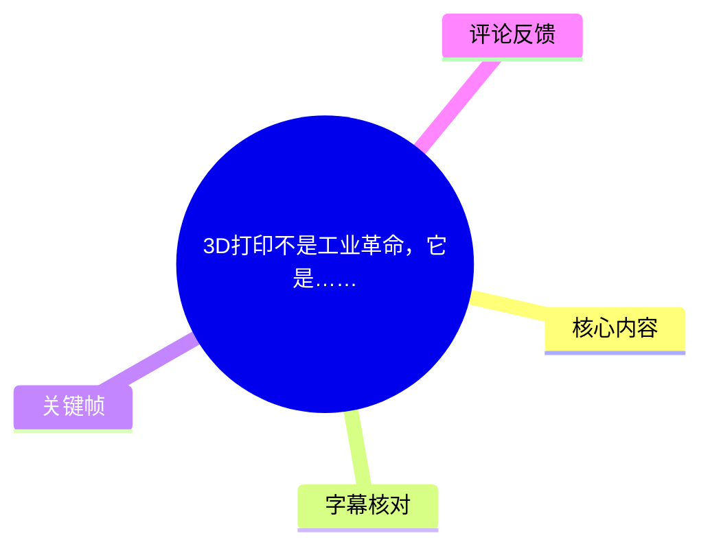
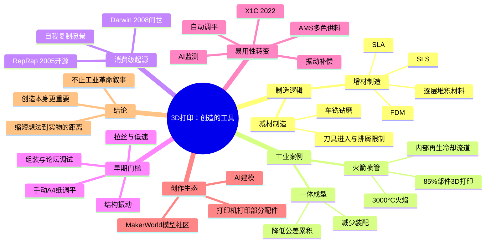
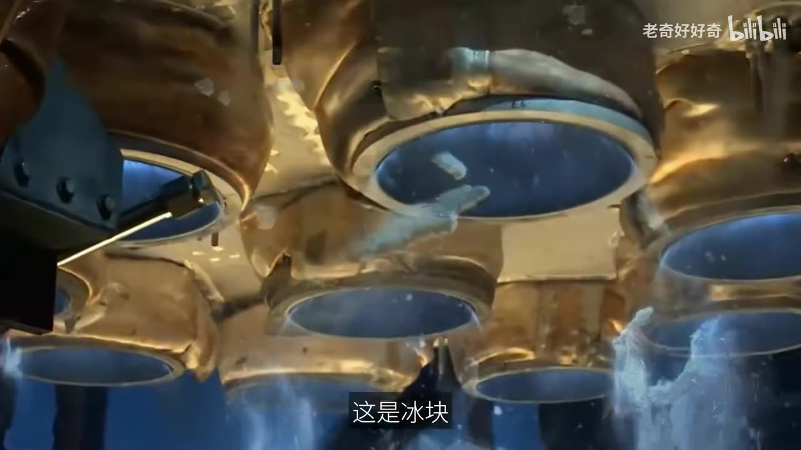
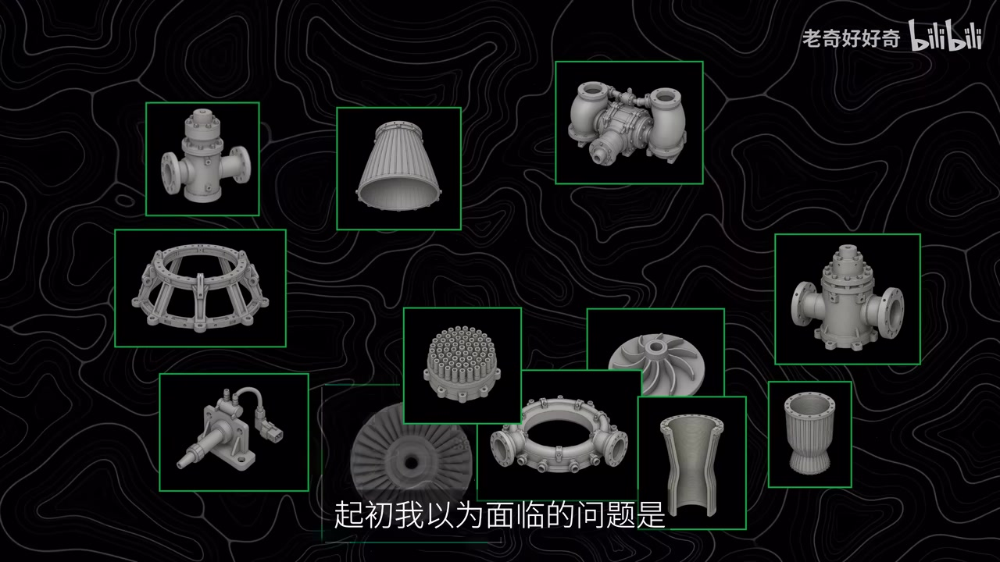
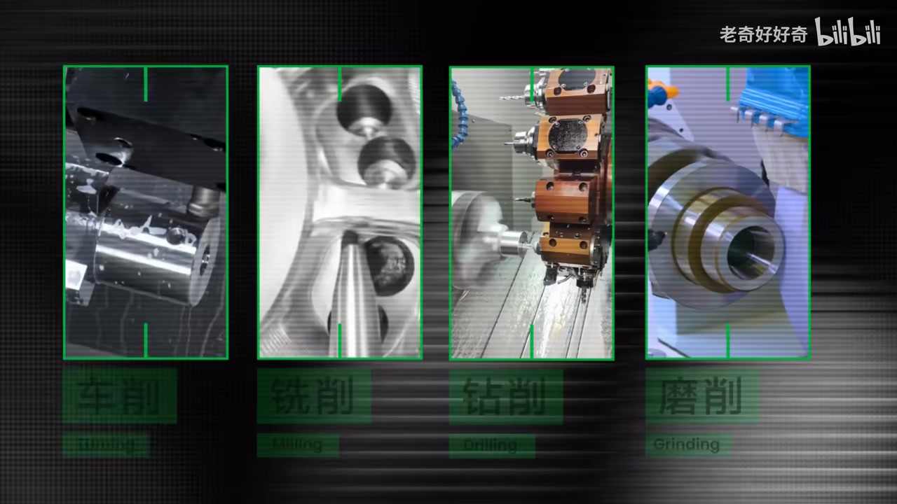

# 3D打印不是工业革命，它是……

> 来源：[Bilibili 视频](https://www.bilibili.com/video/BV1aj756zE36) 
> UP 主：老奇好好奇｜时长：08:09｜分辨率：3840×2160｜合集：AIcode  
> 本文以视频陈述为核心整理；其中涉及企业营收、市场地位和产品能力的内容均为视频中的说法，未在本文中额外核验。

## 小结

视频以“制造一颗钢铁心脏”为引子，说明传统切削、铸造等**减材制造**面对复杂内部结构时的限制：刀具需要进入与排屑路径，铸造需要脱模路径；而增材制造能够逐层堆积材料，适合形成复杂的内部流道和一体化结构。

火箭发动机喷管是视频的核心工业案例。视频称，人族一号（Terran 1）火箭约 **85% 部件由 3D 打印完成**；喷管附近火焰温度约 **3000°C**，内部低温液态燃料通过冷却管道吸热。传统方案需要加工内外壁、逐条加工冷却管、再钎焊封闭外壁；增材制造则可将结构直接逐层构建。视频强调其价值不只在于“少工序”，还在于减少多部件装配造成的**公差累积**。

视频随后回顾消费级 3D 打印的发展路径：2005 年开源的 RepRap 项目提出“自我复制快速原型机”理念，2008 年 Darwin 原型机出现。开源降低了复制门槛，却没有消除使用门槛；早期桌面机仍要求用户自行组装、调试、查论坛、控制振动、处理拉丝，并手动用 A4 纸进行平台调平。

视频把 2022 年拓竹科技发布 X1 Carbon（X1C）作为体验转折点：通过刚性框架、主动振动补偿、轻量化打印头、运动控制算法、摄像头 AI 监测、测距自动调平与 AMS 自动供料等组合，将高速打印和开箱可用性推向更广泛创作者。视频给出的速度变化是从 **50–100 mm/s 提升至 500 mm/s**。

但视频的最终判断不是“3D 打印等于又一次工业革命”。它把 3D 打印定位为一种将复杂校准、调参、排错交给机器与算法，并结合模型社区、AI 建模降低创作门槛的工具：从宏大的航天喷管，到小小的冰箱闭门器，其重要价值在于让普通人更接近“把想法变成实物”的创造乐趣。

适合阅读者包括：想理解 FDM、SLA、SLS 与减材制造差异的初学者；考虑购买桌面 FDM 打印机的人；以及希望从“设备性能”进一步理解模型、调平、振动、参数与社区生态之间关系的创作者。需要注意，视频带有明显的拓竹产品及 MakerWorld 叙事，涉及“全球最大模型社区”“三年营收超百亿元”等说法需按视频发布时点理解，不能直接当作持续有效的独立事实。

## 思维导图

## 目录

- [复杂结构为何需要增材制造](#复杂结构为何需要增材制造)
- [火箭喷管：内部流道、公差与一体成型](#火箭喷管内部流道公差与一体成型)
- [减材制造与 3D 打印的技术边界](#减材制造与-3d-打印的技术边界)
- [RepRap：消费级桌面打印的开源起点](#reprap消费级桌面打印的开源起点)
- [早期桌面机的实际门槛](#早期桌面机的实际门槛)
- [拓竹 X1C：从调机到体验工程](#拓竹-x1c从调机到体验工程)
- [模型社区与自我复制愿景](#模型社区与自我复制愿景)
- [结论、限制与时效性](#结论限制与时效性)
- [字幕比对](#字幕比对)
- [评论分析](#评论分析)
- [处理记录](#处理记录)

## [复杂结构为何需要增材制造](https://www.bilibili.com/video/BV1aj756zE36?t=3)

视频开场借由胚胎心脏发育的画面，提出一个制造问题：血管可以延伸、打结成环，并在内部形成心房与心室；自然生长可形成连续且复杂的内部结构。但如果要“造一颗钢铁心脏”，传统制造方法会面临加工可达性问题。

视频给出的两类约束是：

1. **切削加工的可达性约束**：刀具必须能进入加工位置，切屑也需要有排出路径；对于封闭、弯曲且复杂的内部腔道，这些条件可能无法同时满足。
2. **铸造的脱模约束**：复杂内部结构如果没有可行的脱模路径，传统铸造也难以直接完成。
3. **增材制造的结构自由度**：材料由层层堆积形成，因此能够在制造过程中逐步“封入”内部结构，而非要求刀具或模具在成型后仍可进入内部。

视频的比喻并不表示 3D 打印能完全复制生物细胞的生长过程；它表达的是，增材制造在复杂结构的成形路径上更接近“由无到有地逐层形成”，而不是从实体材料中切除，或从模具中脱出。

> 图：该关键帧以“钢铁雄心”的设问承接生物心脏画面。它的价值在于直观引出全文的核心问题：复杂内部几何并非只靠更高精度的传统加工就能解决，还受限于刀具路径、排屑与脱模条件。

## [火箭喷管：内部流道、公差与一体成型](https://www.bilibili.com/video/BV1aj756zE36?t=47)

视频以人族一号（Terran 1）火箭及其发动机喷管说明增材制造的工业应用边界。按视频说法，该火箭有 **85% 的部件由 3D 打印完成**，其中包括发动机喷管。

### 喷管的热环境与冷却逻辑

视频称喷管附近的火焰温度高达 **3000°C**。镜头中喷管外表面出现冰层，视频解释这并不是喷管在燃烧时“结冰失效”，而是内部冷却系统造成的低温现象：

- 将喷管剖开后可见内部管道；
- 管内流动的是低温液态燃料；
- 燃料吸收喷管壁面的热量，避免喷管被高温尾焰熔毁；
- 喷管温度可降至冰点以下，外界水汽凝结、冻结并脱落；
- 吸热后的高温燃料回到燃烧室，点火后喷出。

这段叙述描述的是视频所展示的再生冷却逻辑。其关键不在“外部结冰”这个视觉效果，而在于喷管壁内部需要布置连续、复杂且密集的冷却流道。

> 图：画面直接呈现喷管附近的冰层。它帮助理解视频的因果关系：喷管内部低温燃料吸热并使壁面降温，外侧水汽才可能冻结；这也是复杂内部冷却流道具有工程意义的前提。

### 传统制造的三步与增材制造的一步

视频将传统喷管制造概括为三步：

1. **加工内壁和外壁**；
2. **逐条加工冷却管道**；
3. **通过钎焊封闭外壁**。

与之对比，视频称在“Stargate”3D 打印机中，可通过材料逐层堆积完成该类结构。这里的“一步”应理解为相对传统多件加工与装配的结构成形路径更连续，而不是说实际工业打印完全没有后处理、检测、热处理或质量控制环节；视频并未展开这些后续工序。

### 公差累积为什么重要

在 [02:07](https://www.bilibili.com/video/BV1aj756zE36?t=127)，视频拆解喷管并展示大量零部件，先提出“装配复杂”的直觉，再指出真正关键在于**公差**。

视频对公差的定义是：机械工程中允许存在的尺寸变动量。其逻辑链条如下：

- 没有机床能制造绝对完美的零件；
- 公差是制造中允许存在的尺寸波动；
- 超出允许范围的变动才属于误差；
- 若复杂总成由大量零件组成，多个尺寸偏差、装配偏差可能叠加；
- 对高温高压火箭喷管而言，偏差累积会带来严重风险，视频以“变成大号烟花”形容其后果；
- 一体成型能减少零件和装配界面，从而减少公差累积的来源。

视频据此解释了 2010 年前后 3D 打印为何曾被称为“又一次工业革命”，并补充“至少奥巴马是这么说的”。这一段是对当时产业叙事的回顾，不等于视频最终接受该标签。

> 图：该帧将多个复杂零部件置于同一画面中，用于支持“拆开后面对数百个不同零件”的讨论。它的理解价值在于把抽象的装配复杂度与公差累积风险具象化。

## [减材制造与 3D 打印的技术边界](https://www.bilibili.com/video/BV1aj756zE36?t=90)

视频在 [01:30](https://www.bilibili.com/video/BV1aj756zE36?t=90) 对两种制造范式作出基础区分。

| 维度 | 减材制造 | 增材制造 / 3D 打印 |
| --- | --- | --- |
| 基本过程 | 从材料块上削去多余部分 | 逐层增加材料形成实体 |
| 视频列举方式 | 车、铣、钻、磨 | FDM、SLA、SLS |
| 形象比喻 | 类似旧石器时代打制石器，但精度可至亚微米级 | 将材料一层层堆叠 |
| 关键限制或优势 | 刀具进入、排屑、内部可达性受限 | 更适合形成复杂内部结构与一体化几何 |
| 本视频的主案例 | 喷管内外壁及冷却管的传统加工 | 复杂喷管流道的一体化成形 |

### 视频提及的工艺

- **FDM（Fused Deposition Modeling，熔融沉积成型）**：视频称其为最常见方式，并比作“高级热熔枪”。材料经喷嘴熔融挤出，按路径逐层沉积。
- **SLA（光固化）**：视频作为其他 3D 打印方式之一列出，但未进一步说明树脂、光源或后处理。
- **SLS（选择性激光烧结）**：视频同样仅作列举，未讨论材料体系、粉末处理或设备要求。

> 图：画面列出车削、铣削、钻削、磨削等加工方式。它的价值在于建立“从材料中移除部分”的共同概念，从而与后文“层层堆叠”的增材制造形成清晰对照。

需要避免把视频的对比理解为“增材制造全面取代减材制造”。视频只针对复杂内腔、一体化结构、装配公差等场景突出增材制造的优势；它没有提供成本、材料性能、表面质量、批量效率、尺寸范围或后处理成本的系统比较。

## [RepRap：消费级桌面打印的开源起点](https://www.bilibili.com/video/BV1aj756zE36?t=179)

视频从工业设备转向桌面级设备，并提出一个时间判断：像拓竹这样的桌面级打印机，其历史约 **20 年**。随后回顾 RepRap 项目：

- **2005 年**：RepRap 项目开源；
- **RepRap** 是 **Self Replicating Rapid Prototyper** 的缩写，视频译作“自我复制快速原型机”；
- **三年后**：初代机 Darwin 问世；
- Darwin 的喷嘴沿 **X、Y 轴**移动，打印平台沿 **Z 轴**移动；
- 它能打印出若干塑料结构件；再购买电路板、电机和金属杆，用户可以组装出另一台 Darwin；
- 视频将此描述为桌面大小的机器“复制它自己”，并指出项目开源使更多人可以获得与改造这一方案。

“自我复制”在此并非完整意义上的机器自给自足。根据视频描述，Darwin 仍需要外购电路板、电机和金属杆；它能复制的是自身**部分塑料结构件**，而非独立制造一台完整机器所需的所有部件。

视频还提及 RepRap 以 GPL 许可证发布。这一信息出现在日语站内字幕中，而英文站内字幕未包含该句；由于 ASR 在相近位置也识别出 GPL 相关表述，本文将其作为视频提及内容记录。

## [早期桌面机的实际门槛](https://www.bilibili.com/video/BV1aj756zE36?t=236)

视频认为，开源意味着“每个人都有机会复制一份”，却不意味着“每个人都会用”。早期消费级打印机仍属于少数极客，使用者需要处理组装、调试和论坛检索等问题。

### 1. 振动、共振与打印速度

视频回顾早期论坛中的问题：

- 打印机支撑结构不够稳固时，喷头高速移动会带动整机抖动；
- 机身共振可能让耗材挤出到错误位置；
- 成品会下垂、拉丝，呈现“面条”状；
- 为抑制共振，喷嘴移动速度可能只能降至 **50 mm/s**；
- 于是一次打印可能持续一整天。

这说明“打印速度”不是单独的电机速度指标，而与整机刚性、运动质量、振动控制、材料挤出和路径误差耦合。

### 2. 手动调平的 A4 纸流程

视频指出，初学者最常见的问题之一是没有正确调平。这里的调平，本质是调整喷嘴与构建板之间的距离。

视频给出明确的判断规则：

- **喷嘴离构建板太远**：耗材难以黏附；
- **喷嘴离构建板太近**：可能划伤构建板；
- 操作时将一张 **A4 纸**放入喷嘴与平台间隙，来回抽动；
- 通过纸张摩擦的手感判断间隙；
- 对四个角分别操作；
- 调完四角后，可能发现最先调整的一角又发生偏差，需要重新来一遍。

这是一套视频描述的早期手动调平经验，不同机型的调平方式、调节点数量和平台结构可能不同。视频借罗永浩与西门子冰箱闭门器的网络梗说明：即使只想复现一个小配件，早期设备的操作门槛也可能阻碍实际创造。

## [拓竹 X1C：从调机到体验工程](https://www.bilibili.com/video/BV1aj756zE36?t=295)

视频称，论坛中“半小时组装就能开打”“自动调平、自动误差修正”一类评论几乎都集中在 **2022 年以后**；同年，拓竹科技发布 X1 Carbon（X1C）。视频将其叙事重点放在：不是单个技术突然出现，而是把机械、算法、检测与供料系统组合成更低门槛的体验。

### 视频叙述的研发与商业信息

按视频说法：

- 拓竹科技创立初期，创始人陶冶一度在约 5 分钟内否决“做 3D 打印机”的想法；
- 团队购买市售打印机后，认为产品存在大量可优化细节；
- 研发中制造了 **700 多台测试机**，打印了 **3 吨材料**；
- 视频称其“三年后营收超过 100 亿元”；
- 视频还称美国的 3D 打印农场中摆放了大量拓竹打印机，并认为其在某种程度上开启了新行业。

上述为视频的企业案例叙述，未提供原始财报、统计口径、时间范围或“打印农场”规模数据，因此不宜据此推导市场份额、盈利状况或所有机型的实际表现。

### 视频列举的技术组合

| 技术或设计 | 视频中的作用 | 对应早期痛点 |
| --- | --- | --- |
| 刚性框架 | 提升机身稳定性 | 高速运动时整机抖动 |
| 主动振动补偿算法 | 降低机身共振 | 共振导致路径与挤出偏差 |
| 轻量化打印头 | 减少高速运动负担 | 速度与稳定性难兼顾 |
| 运动控制算法 | 预先补偿高速运动误差 | 高速运动带来的定位误差 |
| 摄像头 + AI 监测 | 发现潜在“面条/意大利面”失败时调整或暂停 | 打印失败不能及时处理 |
| 激光雷达或电磁感应线圈测距 | 测喷嘴与平台距离 | 手动 A4 纸调平 |
| 自动调平算法 | 基于测距结果完成调平 | 四角反复手动调整 |
| AMS 自动供料系统 | 支持多色耗材打印 | 换料与多色创作需求 |

### 视频给出的性能参数

视频称，最大打印速度由早期常见的 **50–100 mm/s** 提升到 **500 mm/s**。该数值应按视频语境理解为其所叙述的设备速度指标，不能直接等同于任意材料、任意模型、任意质量要求下的实际稳定打印速度。实际输出还会受到耗材、层高、喷嘴、模型几何、加速度、冷却与质量目标等因素影响；这些细节视频未展开。

视频的关键观点是：技术进步的核心变化在于“有人在乎你的体验”——通过机器和算法承担复杂校准、参数调整与故障排查，让 3D 打印从极客工具走向更多创作者。

## [模型社区与自我复制愿景](https://www.bilibili.com/video/BV1aj756zE36?t=392)

视频指出，即使打印机已更易用，普通用户仍有一个关键问题：**模型从哪里来？**

按视频说法，MakerWorld 是拓竹的模型社区，用户可：

1. 上传自己的模型；
2. 下载其他人的模型；
3. 一键发起打印。

视频称其为“全球最大的模型社区”。这一地位性表述没有给出统计口径、平台比较范围或截至日期，本文不作外部验证。

在 [06:48](https://www.bilibili.com/video/BV1aj756zE36?t=408)，视频还提及“Let’s Make It 创造基金”，并展示在 MakerWorld 中找到的打印模型，例如：

- 料盘架；
- 耗材盒；
- 工具收纳架。

这类模型的重要意义是，打印机能打印一些用于改善自身使用体验的配件。它并不意味着机器能完全复制自身，而是延续了 RepRap 的部分愿景：使用者将自己解决过的问题固化为可分享的实体方案，让下一位用户或下一台机器“少走弯路”。

视频最后将门槛降低归因于两条路径：

- **设备侧**：复杂校准、调参、排错由机器与算法尽可能承担；
- **内容侧**：AI 建模与模型社区降低从想法到可打印文件的门槛。

## [结论、限制与时效性](https://www.bilibili.com/video/BV1aj756zE36?t=449)

视频在结尾回到标题：3D 打印可以是“自我复制机”、航天梦想，也可以只是冰箱上一个小小的闭门器；但比这些具体对象更重要的是创造本身。它将人类从石斧、铜器到工业流水线的工具演变，归结为持续不变的动手创造能力。

### 可迁移的理解框架

1. **先判断几何与制造路径**  
   当零件具有复杂内部流道、难以拆分、装配界面多、或传统刀具无法进入的区域时，增材制造更值得评估。

2. **不要只比较“打印速度”**  
   速度提升背后是刚性、运动控制、振动补偿、挤出能力、检测与算法协同。单独追求速度，可能放大共振、路径误差、拉丝和失败风险。

3. **设备易用性不等于零门槛**  
   自动调平、AI 监测和 AMS 能减少操作负担，但视频并未说明它们能够消除所有失败、材料适配、模型设计、后处理和安全问题。

4. **模型来源是创作链路的一部分**  
   从“有打印机”到“做出有用物件”之间，仍需要模型设计、模型选择、打印参数与实际用途验证。社区模型可缩短起点，但不能自动保证尺寸、强度、耐热性或安全性满足需求。

### 视频未覆盖或未充分验证的限制

- 没有比较 FDM、SLA、SLS 在精度、材料、成本、后处理和使用环境上的具体差异；
- 没有讨论 FDM 成品在层间强度、耐热、耐候、食品接触、电气安全等方面的限制；
- 没有提供火箭喷管案例的完整材料、打印工艺、后处理、无损检测和可靠性数据；
- “85% 部件 3D 打印”“三年营收超 100 亿元”“全球最大模型社区”等是视频陈述，缺少本文可直接核验的来源与统计口径；
- 视频大量围绕拓竹及其生态展开，适合作为“消费级易用性如何改善”的案例，不宜直接外推为整个 3D 打印行业的全面结论。

### 时效性说明

视频元数据显示发布时间为 **2026-06-26**。型号、固件、AI 功能、AMS 兼容性、模型社区规模、企业营收和市场格局都可能在发布后变化。文中所有产品与市场相关信息应以该视频的叙述时间为准；购买设备或用于工程制造前，应进一步查阅当前型号规格、材料数据表、售后政策和独立测试。

## 字幕比对

| 字幕来源 | 完整性 | 专有名词 | 时间轴 | 主要问题 |
| --- | --- | --- | --- | --- |
| Bilibili 站内字幕（英语 `p01-ai-en.srt`） | 覆盖主体完整，分段细 | Terran 1、RepRap、Darwin、FDM、SLA、SLS、Bambu Lab、MakerWorld 等较清楚 | 时间粒度细，适合定位正文链接 | 为机器英文字幕；部分中文原意、企业名称中文写法与语气需结合音频确认；未出现 GPL 句 |
| Bilibili 站内字幕（日语 `p01-ai-ja.srt`） | 覆盖主体完整，分段细 | 对 RepRap、Darwin、GPL、X1C、AMS 等保留较多信息 | 时间轴可直接使用 | 为日语机器字幕；个别译法与英语字幕存在措辞差异，不能单独作为中文转写依据 |
| 本次 ASR（`medium`，中文） | 38 段，语音覆盖约 417.52 秒，占总时长约 85.48% | 对 3D 打印、A4、X/Y/Z 轴、500 mm/s 等有识别，但多处人名、品牌、术语误识别 | 带真实时间戳，首段 00:02.860，末段 00:08:05.440 | “心脏/钢铁雄心”“切削/增材”“公差”“拓竹”“X1C”“MakerWorld”“RepRap”等频繁误识别；长段合并过多，语义可读性较差 |

### 最终字幕选择与校正原则

本文采用**站内英语字幕的细粒度时间轴**作为主要定位依据，并以**本次中文 ASR**确认原始语音为中文、确认段落覆盖和时间位置；必要时参照日语站内字幕补足英语字幕中未出现的 GPL 信息。

已根据站内字幕、ASR 上下文及关键帧校正的主要词语包括：

| ASR 常见误识别 | 本文采用写法 | 校正依据 |
| --- | --- | --- |
| “心脟”“钢铁雄心” | 心脏、钢铁心脏 | 英语/日语站内字幕语义与开场画面 |
| “剪裁制造”“供插/供差” | 减材制造、公差 | 英语字幕中的 subtractive manufacturing、tolerance |
| “人族一号” | 人族一号（Terran 1） | 英语站内字幕为 Terran 1；中文名按 ASR 音近记录 |
| “新门” | Stargate | 英语站内字幕 |
| “RipRap / Raprap” | RepRap | 英语、日语站内字幕 |
| “报业” | Bowyer | 英语站内字幕上下文 |
| “搭入” | Darwin | 英语、日语站内字幕 |
| “三星打印机/三星打印” | 3D 打印机 / 3D 打印 | ASR 将“3D”持续误识别为“三星” |
| “拓主、拓铸、拓州” | 拓竹 / Bambu Lab | 视频标题、标签、站内字幕与元数据 |
| “XEC” | X1C / X1 Carbon | 日语站内字幕与语境 |
| “Make a World” | MakerWorld | 英语、日语站内字幕 |
| “自动调屏/自动调频” | 自动调平 | 英语字幕中的 auto leveling 与上下文 |

## 评论分析

以下仅处理可获取的热评前三条，评论内容属于观众观点或消费建议，不作为已验证事实。

1. **Gobin_Jan（99 赞）**  
   - 观点：认为视频前半部分铺垫宏大，后半部分收束到桌面级塑料打印，叙事较散、内容不够充实。  
   - 可讨论之处：该评论指出了视频范围从工业金属喷管到消费级 FDM 设备的跨度。正文确实可见这种转场：前半段强调复杂工业结构，后半段重点转为拓竹、自动调平和模型社区。  
   - 可信度边界：这是对叙事结构与内容深度的主观评价，不构成对技术事实的证伪。

2. **小叶络石（9 赞）**  
   - 观点：指责疑似“拓竹别买 bot”污染评论区，表达对评论区营销或水军现象的不满。  
   - 可讨论之处：视频内容确实集中展示拓竹设备、MakerWorld 与创造基金，因而观众可能对品牌宣传属性敏感。  
   - 可信度边界：评论未提供账号、行为记录或平台审核结果，无法据此确认存在机器人账号或评论操纵。

3. **无敌小可爱琳（10 赞）**  
   - 观点：提出“有这钱买创想 K2C 不香吗”，给出另一款设备的购买偏好。  
   - 可讨论之处：该评论说明观看者会把视频中的品牌案例转化为实际选购比较。  
   - 可信度边界：未给出预算、使用场景、材料需求、售后地区、配置与价格信息，也没有性能对比依据；因此不能作为设备选购结论。

## 处理记录

- Worker ID：`worker-mrj0www4-e8d79408`
- 整理模型：`gpt-5.6-terra`
- 本次 ASR 模型：`medium`
- ASR 运行环境：CUDA / `float16`；识别语言为中文，语言置信度 `0.99609375`；音频时长 `488.4266875` 秒。
- 使用的素材与工具输出：视频元数据、站内时间轴字幕（英语与日语 SRT）、本次 ASR 时间轴字幕与分段 JSON、关键帧目录、热评前三条。
- 字幕选择：采用英语站内 SRT 的细分时间轴作为正文时间定位主依据；以中文 ASR 确认中文语音、覆盖情况与起止时间；以日语 SRT 补充 GPL 等英语字幕遗漏的内容。未直接采用 ASR 原文作为正文转写，原因是其专有名词和术语误识别较多。
- 时间轴依据：所有章节链接均按站内 SRT 或 ASR 的真实起始时间换算为秒，不按文字顺序臆测位置。
- 关键帧选择依据：
  - `frames/frame-001.jpg`：开场“钢铁心脏”设问，适合说明复杂结构制造问题；
  - `frames/frame-002.jpg`：喷管结冰画面，支持再生冷却与低温燃料的解释；
  - `frames/frame-003.jpg`：车铣钻磨画面，支持减材制造分类；
  - `frames/frame-004.jpg`：复杂部件组合画面，支持多部件装配与公差累积的讨论。
- 评论范围：仅使用可获取热评前三条，未扩展至其他评论。
- 缓存清理：素材未提供缓存清理执行日志；无法确认是否已删除下载文件、音频、帧图或中间转码文件。
- 未解决问题：
  - 未提供关键帧与精确时间点的一一映射表，因此图片仅用于与其可见内容明确对应的章节；
  - 视频中的企业营收、市场地位、火箭部件比例与产品功能未附原始出处，本文按视频陈述保留并明确其未独立核验状态。
