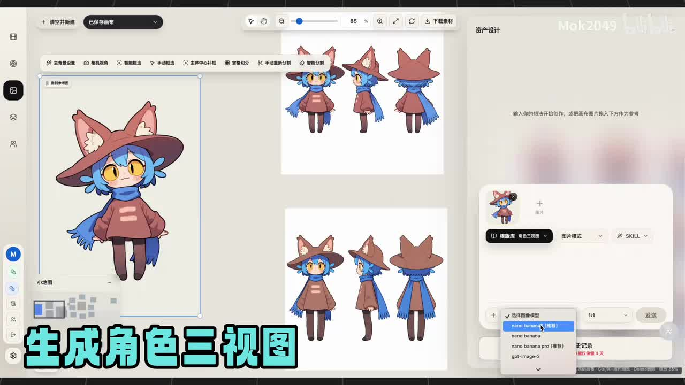
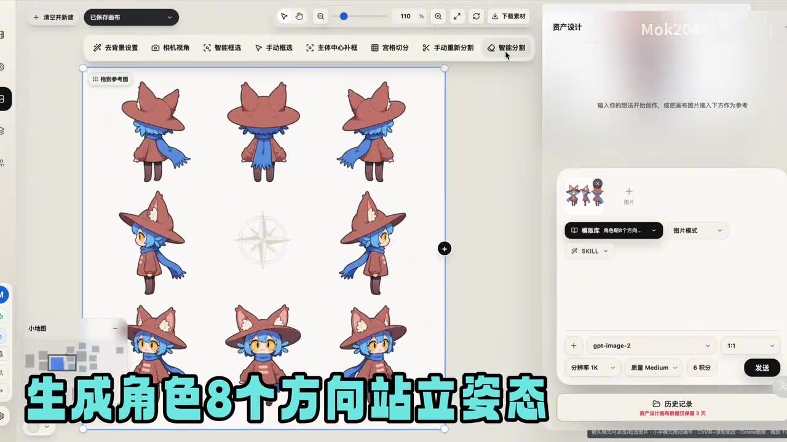
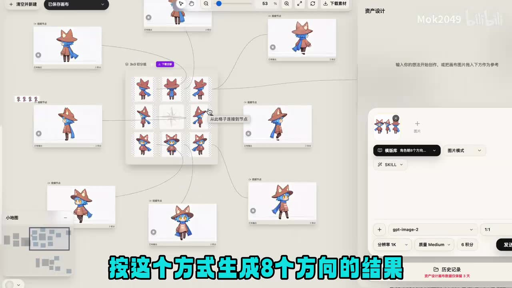
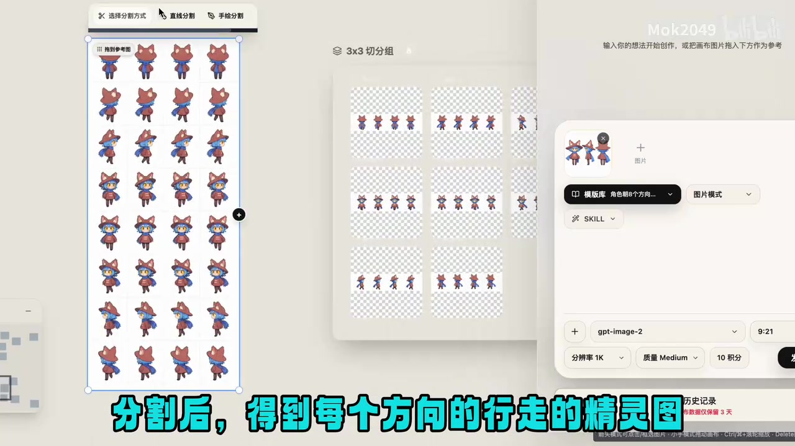
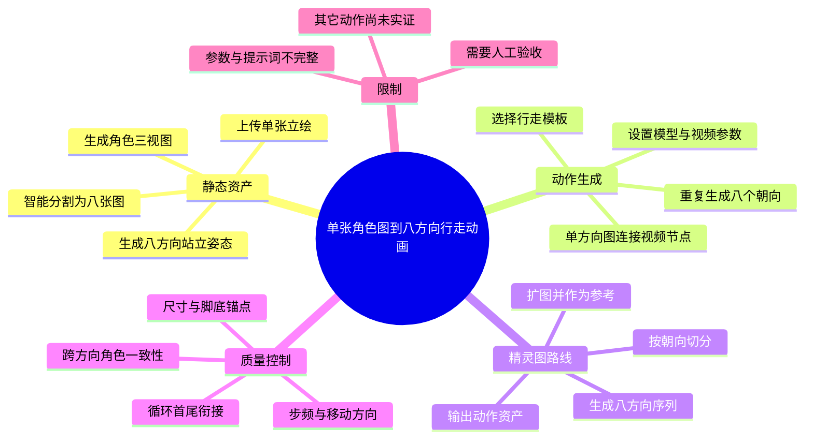

# 一张角色图，如何用AI做出2D角色8方向行走动画？

> 来源：[Bilibili 视频](https://www.bilibili.com/video/BV151Mn6rERd)  
> UP 主：Mok2049 | 发布时间：2026-07-09 20:37（UTC+8） | 视频时长：02:21  
> 工具入口：[Playmo Studio](https://www.playmo.studio/)

## 小结

视频演示了一条从单张角色立绘出发，生成八方向 2D 行走动画的 AI 工作流。核心不是让模型一次完成所有方向和动作，而是把任务拆成可检查的中间资产：先得到角色三视图，再生成八方向站立姿态，随后分割为独立朝向，最后分别驱动视频节点或生成精灵图序列。这样能让角色方向、服装和轮廓在每一步都可以人工检查与返工。

工作在 Playmo 的“资产设计”画布中完成。图像阶段使用模板和参考图约束视角，画面明确展示了 `gpt-image-2`；动作阶段则把某一朝向的站立图连接到视频节点，选择行走模板、模型、时长、分辨率和画幅参数。重复处理八个朝向后，即可得到八组方向一致的行走动画。

视频还给出另一条面向游戏资产的路线：先生成八方向行走精灵图，再将每个朝向的序列帧切分、扩图并作为视频参考。这种方法不只适用于走路；作者在结尾指出，同样的结构也可迁移到施法、攻击等其它动作，但视频没有实际验证这些动作的质量。

这套方法适合快速制作原型或低成本游戏美术资产。它仍需要人工处理跨方向一致性、序列循环衔接、透明背景、尺寸对齐和最终引擎导入；视频也没有给出完整提示词、随机种子、逐项参数和引擎侧帧率，因此不能把演示结果视为无需调整即可生产使用的成品。

## 目录

- [背景与问题](#背景与问题)（[00:00](https://www.bilibili.com/video/BV151Mn6rERd?t=0)）
- [生成角色三视图](#生成角色三视图)（[00:03](https://www.bilibili.com/video/BV151Mn6rERd?t=3)）
- [生成八方向站立姿态](#生成八方向站立姿态)（[00:30](https://www.bilibili.com/video/BV151Mn6rERd?t=30)）
- [生成每个朝向的行走动画](#生成每个朝向的行走动画)（[00:52](https://www.bilibili.com/video/BV151Mn6rERd?t=52)）
- [精灵图路线](#精灵图路线)（[01:25](https://www.bilibili.com/video/BV151Mn6rERd?t=85)）
- [方法与实践](#方法与实践)
- [结论与限制](#结论与限制)
- [思维导图](#思维导图)
- [字幕比对](#字幕比对)
- [评论分析](#评论分析)
- [处理记录](#处理记录)

## 背景与问题

八方向角色动画通常至少要覆盖上、下、左、右、左上、右上、左下、右下八种观察角度。若直接分别生成八条视频，角色的服装、比例、朝向和动作节奏很容易漂移。视频的解决思路是先建立静态方向资产，再把动作生成建立在这些方向参考图上，从而把“角色一致性”和“动作生成”拆成两个阶段。[00:00](https://www.bilibili.com/video/BV151Mn6rERd?t=0)

必要输入是一张可辨识的角色立绘。实际生产还应准备明确的背景要求、目标画幅、角色尺寸、动作周期和透明通道规范；这些并未在视频中完整展开。

## 核心内容

### 生成角色三视图 [00:03](https://www.bilibili.com/video/BV151Mn6rERd?t=3)

1. 打开 Playmo 的“资产设计”模块，在画布中上传本地角色图。
2. 将角色图加入右侧图像生成区域，作为参考图。
3. 选择角色三视图模板；也可以在对话框中自行输入提示词生成三视图。
4. 将生成结果放回画布，作为后续八方向生成的参考资产。

> 图：单张蓝发角色立绘被放入资产设计画布，右侧生成区域选择三视图模板；画布中已有正面、侧面和背面结果。这一步先建立角色外观基准，减少后续方向漂移。

### 生成八方向站立姿态 [00:30](https://www.bilibili.com/video/BV151Mn6rERd?t=30)

将三视图作为参考图，选择“角色八方向站立姿态”一类模板，再配置图像模型与参数。画面中可确认使用了 `gpt-image-2`，并展示了 `1:1` 画幅、`1K` 分辨率和 `Medium` 质量等界面选项；这些是本次演示画面中的设置，不代表所有角色都必须采用相同参数。

> 图：角色围绕中心罗盘形成八种朝向。方向图先于动作生成，可逐个检查帽子、围巾、尾巴和身体朝向是否连贯。

生成结果是一张包含多个角色的整图，需要使用画布的“智能分割”或网格切分能力，将其拆为八个独立朝向。画面中出现 `3x3` 切分组：中心可留空，周围八格对应八个方向。[00:43](https://www.bilibili.com/video/BV151Mn6rERd?t=43)

### 生成每个朝向的行走动画 [00:52](https://www.bilibili.com/video/BV151Mn6rERd?t=52)

从八张方向图中选择一个朝向，将其连接到视频节点作为参考图。随后选择行走模板，并设置视频模型、时长、分辨率、画幅等参数。生成完成后得到该朝向的角色行走视频；对其余七个方向重复同一流程，即可得到完整八方向动画集合。

> 图：中心是八方向静态姿态，周围是多个独立方向节点与生成结果。节点化画布使每个方向都能单独重试，而不必推翻其它已通过的方向。

建议在每个方向完成后检查：

- 脚步是否真的沿目标方向移动，而不是原地滑动；
- 角色左右侧特征是否镜像错误；
- 帽子、武器、尾巴等高辨识度元素是否跨帧变形；
- 循环首尾是否衔接，八个方向的速度和步频是否一致；
- 输出尺寸、角色脚底基准点和背景透明度是否统一。

### 精灵图路线 [01:25](https://www.bilibili.com/video/BV151Mn6rERd?t=85)

除“每个方向各生成一条视频”外，视频还展示了精灵图思路：

1. 使用八方向站立图作为输入。
2. 调用方向行走精灵图模板，生成八方向行走序列。
3. 将每个朝向对应的序列帧单独切分出来。
4. 对序列帧进行扩图，使其成为更适合视频节点读取的参考图。
5. 输入提示词、选择模型并设置参数，继续生成目标动作结果。

> 图：左侧是一张纵向八方向行走序列，右侧 `3x3` 区域是拆分后的方向序列。相较只保存最终视频，精灵图更接近游戏引擎需要的逐帧资产结构。

作者在结尾说明，这一方法还可以扩展到其它动作。[02:10](https://www.bilibili.com/video/BV151Mn6rERd?t=130) 但施法、攻击、受击等动作往往包含更明显的轮廓变化、特效遮挡和节奏要求，不能直接假设其稳定性与走路相同。

## 方法与实践

### 推荐操作顺序

1. **整理源角色图**：尽量使用轮廓清晰、遮挡少、背景简单的立绘。
2. **先生成三视图**：检查正面、侧面和背面的服装结构与配色，不一致时先修正这一层。
3. **生成八方向静态姿态**：使用三视图作为参考，避免只凭单张正面图猜测背面细节。
4. **智能分割**：将八方向整图拆成独立透明资产，统一画布尺寸和脚底锚点。
5. **逐方向生成动作**：一次处理一个朝向，记录同一套模型、时长、分辨率和提示词参数。
6. **形成循环**：剪裁或补帧，使每个方向的第一帧与最后一帧自然衔接。
7. **统一规格**：将八组动画整理成同帧数、同尺寸、同帧率的精灵图或动画文件。
8. **引擎验收**：在实际移动速度、方向切换和缩放比例下检查，而不是只看单条预览。

### 可迁移的工程经验

- 把大型生成任务拆成“三视图 -> 八方向静态图 -> 单方向动作”，能把不一致问题定位到具体阶段。
- 每个方向独立成节点，适合局部重试和版本比较，也有利于多个 Agent 或人工并行验收。
- 静态参考图决定角色一致性，动作模板决定运动语义；两者不应混成一次不可控的生成。
- 生成结果应保留中间资产。只保留最终视频会失去修复方向错误、重做单个动作或重新打包精灵图的能力。

## 结论与限制

这是一条适合原型和中小型 2D 游戏资产制作的工作流：它把 AI 图像生成、智能分割和视频生成串成了可检查的节点流水线。最有价值的部分不是某个具体模型，而是“先固定方向，再生成动作”的分层思路。

限制如下：

- 视频没有公布完整提示词、随机种子和所有节点参数，复现时仍需自行调试。
- `gpt-image-2` 等模型、模板名称、积分成本和界面选项可能随平台更新而变化。
- 视频没有展示游戏引擎导入、碰撞框、脚底锚点、帧率和循环边界处理。
- AI 生成的八方向资产可能在左右侧细节、背面服饰和肢体长度上不一致。
- 视频只实际演示行走；其它动作的可行性是作者提出的扩展方向，不是已经展示的完成结果。

## 思维导图

## 字幕比对

| 字幕来源 | 完整性 | 专有名词 | 时间轴 | 主要问题 |
| --- | --- | --- | --- | --- |
| Bilibili 站内字幕 | 不可用 | 与视频内容不符 | 被拒绝 | 接口返回的 AI 字幕时间轴长达 475.8 秒，明显超过本视频的 141 秒，内容也与本视频无关；工具以 `SUBTITLE_DURATION_MISMATCH` 拒绝该资源 |
| 本次 ASR 字幕 | 完整覆盖主要口播 | 一般，经画面校正后可用 | 52 段，覆盖 00:00-02:19 | 将“三视图、对话框、参考图、站立姿态、序列帧、精灵图”等识别成近音词 |

最终采用本次 faster-whisper ASR 的时间轴和句子结构，并结合视频简介与关键帧校正术语。Bilibili 字幕原始 JSON 仅作为异常诊断记录保留，不参与总结。主要校正包括：

- `play mode AI` -> `Playmo`（简介给出 `playmo.studio`）；
- `30图` -> `三视图`；
- `对话光` -> `对话框`；
- `参号图` -> `参考图`；
- `八个方向占力姿态` -> `八方向站立姿态`；
- `序列针/精灯图` -> `序列帧/精灵图`。

ASR 使用项目内 faster-whisper `small` 多语言模型、CUDA `float16`、10 秒物理 WAV 分块和贪心解码。140.16 秒音频的最终一次转写耗时 4.475 秒。

## 评论分析

接口请求热评前三条，但当时仅返回 1 条评论：

1. **洛米条**：“这个可以做较眩晕施法之类的吗”。评论关注的不是行走，而是眩晕、施法等动作扩展。视频结尾确实说方法可迁移到其它动作，因此方向上具有可行性；不过视频没有演示特效、施法节奏或大幅轮廓变化，这条评论不能作为效果已经验证的证据。更合理的做法是保留八方向静态资产，为施法动作单独设计模板和时长，再逐方向测试。

## 处理记录

- Worker ID：`worker-mre6voao-512ae3ba`
- 调用端与模型：`codex-desktop` / `GPT-5 Codex`
- 最终素材包运行：`1783646446481-material-bundle-c4601a`，状态 `succeeded`
- 站内字幕复核：`1783647241615-bili-subtitles-335693`，状态 `succeeded`；索引为 `available: false`，错误字幕因时间轴超出视频时长被拒绝
- 最终 ASR：faster-whisper `small` / CUDA `float16`，52 段，4.475 秒
- 字幕选择：没有通过校验的站内字幕；采用 ASR 时间轴，并用视频简介和关键帧校正专有词
- 关键帧选择：保留三视图、八方向站立姿态、节点化方向结果和精灵图切分四张；舍弃信息量很低的第 5 张
- 热评：请求上限 3 条，实际返回 1 条
- 清理缓存：`1783646636358-clean-cache-df2f49`，状态 `succeeded`；已删除 `audio/audio.wav` 与 `merged.mp4`，保留 Markdown、字幕、关键帧、评论和元数据
- 未解决问题：视频未提供完整提示词、随机种子、所有视频节点参数和游戏引擎导入设置
