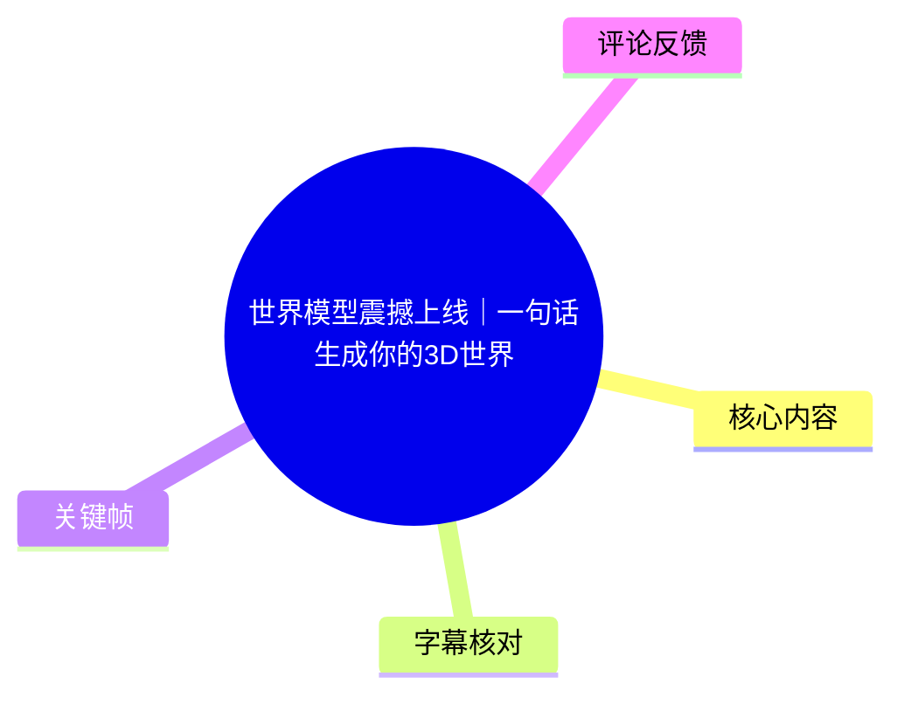
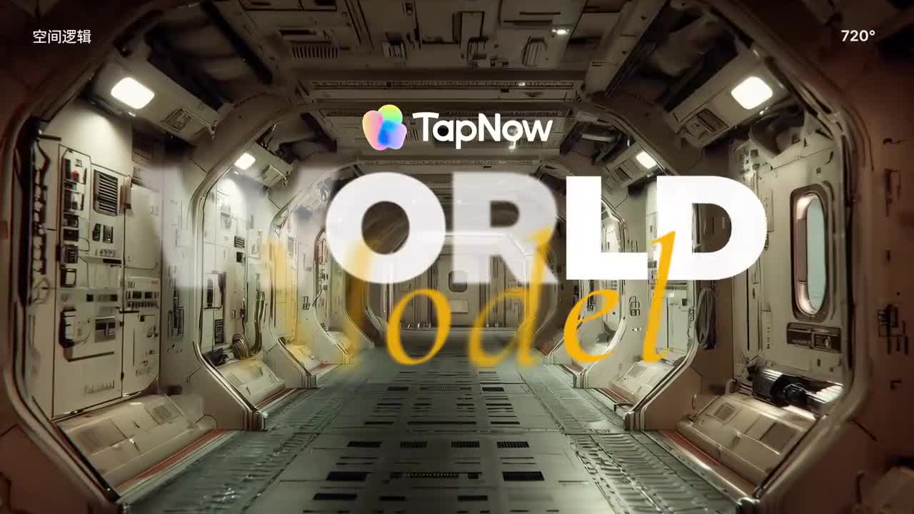
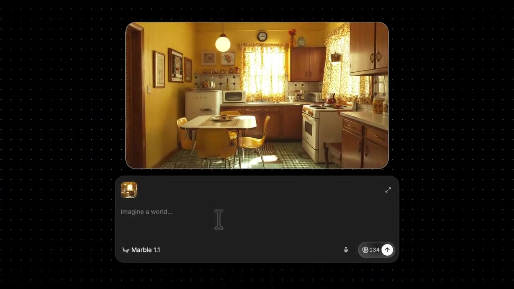
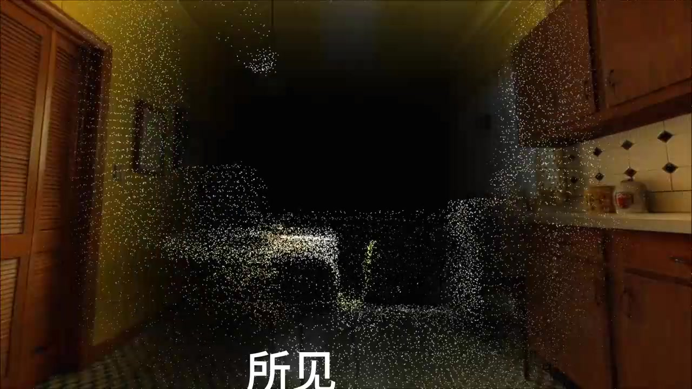

# 世界模型震撼上线｜一句话生成你的3D世界

> 来源：[Bilibili 视频](https://www.bilibili.com/video/BV1vVo1B8EEN)  
> UP 主：TapNow ｜时长：43 秒｜分辨率：1920×1080  
> 主题：TapNow 宣传其上线的世界模型 **Marble**，展示由文本或图片向可浏览三维场景生成的创作方向。

## 小结

视频是一支时长 43 秒的产品宣传片，核心新闻是：TapNow 宣布其“世界模型” **Marble** 正式上线。片方将其定位为面向影视与空间内容创作的 AI 工具，目标是降低传统 3D 场景建模、布线等工作的门槛。

根据视频简介，Marble 支持在 2D 画布中使用**文本、图片**作为输入，生成“高保真、可持久”的 3D 空间；视频画面则直观展示了厨房、科幻舱体和城堡等不同风格场景，并以点云/粒子般的视觉效果强调其对空间结构的建构过程。

画面中可识别到产品输入界面：模型标注为 **Marble 1.1**，输入框提示语为 “Imagine a world...”，旁边出现了“134”的图标数值。但素材未说明该数值的具体含义，不能据此断定它是积分、成本、余额或生成参数。

该视频没有提供可用的站内字幕；本次 ASR 也未识别出任何语音片段。因此，本文不能把画面宣传语扩写为逐字口播内容，而是以视频简介、可见 UI 与关键帧为依据整理。适合关注 AI 3D、虚拟片场、游戏/影视预可视化和空间生成工作流的读者参考。

需要注意：视频是产品宣传素材，展示的是理想化样例，未披露模型的几何精度、纹理分辨率、导出格式、生成耗时、价格、版权归属、商用条款、可编辑性及硬件要求。热评中也有人指出演示厨房存在重复炉具等结构不合理现象，说明“空间一致性”仍应通过实际生成结果验证。

## 思维导图

```mermaid
mindmap
  root((TapNow Marble 世界模型))
    新闻
      Marble 正式上线 TapNow
      面向虚拟片场与空间创作
    输入方式
      文本描述
      图片输入
      2D 画布
    画面展示
      科幻舱体
      城堡场景
      厨房场景
      点云式空间建构视觉
    产品主张
      降低建模与布线门槛
      生成高保真且可持久的3D空间
      改善场景空间一致性
    已见界面信息
      Marble 1.1
      Imagine a world 输入框
      134 数值用途未说明
    限制与验证
      无可用站内字幕
      ASR未识别语音
      未披露价格与导出规格
      宣传样例不等于稳定能力
```

## 目录

- [发布信息与视频证据范围](#发布信息与视频证据范围)
- [核心展示：从世界概念到场景样例](#核心展示从世界概念到场景样例)
- [输入与生成界面：Marble 1.1](#输入与生成界面marble-11)
- [产品能力、实践步骤与可验证边界](#产品能力实践步骤与可验证边界)
- [关键参数与限制](#关键参数与限制)
- [字幕比对](#字幕比对)
- [评论分析](#评论分析)
- [处理记录](#处理记录)

## [发布信息与视频证据范围](https://www.bilibili.com/video/BV1vVo1B8EEN?t=0)

TapNow 在视频标题与简介中宣布“世界模型 Marble 正式上线 TapNow”。简介将其描述为一种用于构建 3D 世界、虚拟片场及 AI 影视创作的能力，并提出“让 AI 真正理解脑海的三维空间结构”。

视频时长仅 43 秒，内容以视觉演示和产品概念传达为主。由于没有可用的语音转写，本片能够确认的信息应分为三类：

1. **视频简介明确陈述**  
   - 支持文本与图片输入；
   - 在 2D 画布上生成高保真、可持久的 3D 空间；
   - 主张减少建模、布线等传统流程负担；
   - 宣称改善场景空间一致性；
   - 引导用户前往 `https://app.tapnow.ai/home` 使用产品。

2. **画面直接可见**  
   - TapNow 与 “WORLD Model” 标识；
   - 科幻走廊、山地城堡、复古厨房等场景；
   - 具有空间深度感的相机运动；
   - 厨房画面向点云/粒子空间形态转化；
   - “Marble 1.1” 与 “Imagine a world...” 输入 UI。

3. **尚不能从素材确认**  
   - 具体生成时长、算力消耗、价格或积分规则；
   - 是否支持网格、点云、NeRF、Gaussian Splatting 等具体技术表示；
   - 是否支持 GLB、FBX、USD 等格式导出；
   - 是否能够直接进入 DCC、游戏引擎或视频生成工具；
   - 生成结果是否能保持长期编辑、多人协作或物理可用性。

## [核心展示：从世界概念到场景样例](https://www.bilibili.com/video/BV1vVo1B8EEN?t=0)

视频开场将 TapNow 标识叠加在科幻舱体走廊画面上，并显示 “WORLD Model”。画面左上角出现“空间逻辑”，右上角出现“720°”字样。这里可以确认产品强调空间维度与多方向观看体验；但“720°”在该片中没有进一步定义，不能直接等同于某种正式技术指标。

> 图：画面将 TapNow、WORLD Model、空间逻辑与科幻舱体放在同一视觉语境中，说明该片的叙事重点不是单张图像，而是带有空间感的环境生成与浏览体验。

随后出现一座位于山地环境中的城堡。镜头面对城堡入口与台阶，场景包含山体、植被、建筑立面、旗帜及远处环境。该样例用于展示室外大型环境的氛围与透视关系，但它只能证明宣传片展示了此类结果，不能单独证明模型在任意视角、任意距离、遮挡区域都保持正确几何结构。

> 图：城堡、山体、桥/台阶和远景共同构成复杂室外环境。它有助于理解 Marble 的宣传目标覆盖的不仅是单一物体，也包括具备前后景层次的整体场景。

视频还呈现了复古厨房。厨房内可见桌椅、橱柜、窗帘、冰箱、微波炉、炉灶与墙面装饰，属于相对日常、对象较密集的室内空间。与宏大城堡样例相对，该画面展示工具同样面向小尺度室内布景或虚拟片场场景。

> 图：画面上方是厨房参考图，下方是输入框；模型选择栏标明“Marble 1.1”，文本提示为“Imagine a world...”。这是本片中最直接的产品交互证据。

## [输入与生成界面：Marble 1.1](https://www.bilibili.com/video/BV1vVo1B8EEN?t=0)

关键帧显示的创作界面包含以下可见元素：

| 界面元素 | 可确认内容 | 不应过度推断的部分 |
| --- | --- | --- |
| 输入画布/预览区 | 上方显示一张厨房图像 | 不能确认该图是上传图片、预设示例还是生成结果 |
| 文本输入框 | 占位提示为 `Imagine a world...` | 不能确认提示词语法、语言限制、长度限制或负面提示词能力 |
| 模型选择 | 显示 `Marble 1.1` | 不能确认是否有多个模型、版本差异或更新日志 |
| 发送按钮 | 右下角存在箭头样式按钮 | 可推断其承担提交/生成操作，但无法确认完整生成流程 |
| 数值标识 | 发送按钮附近显示 `134` | 用途未标注，不能认定为积分、代币、价格或剩余额度 |
| 麦克风图标 | 输入区右侧可见 | 仅能说明界面有语音相关入口；不能确认语音输入已实际可用或支持哪些语言 |

据视频简介，完整的输入范围包括**文本和图片**。结合界面画面，可将其宣传中的最小工作流整理为：

1. 准备世界设定：可用一句文字描述目标空间，或准备参考图片。
2. 在 TapNow 的 2D 画布/输入界面中放入文本或图片。
3. 选择视频可见的 **Marble 1.1** 模型。
4. 提交生成，获得宣传中所称的 3D 空间结果。
5. 对生成结果进行浏览、取景或用于虚拟片场创作——这是片方的应用定位；但本片未展示进一步的编辑按钮、镜头轨道、资产替换、导出或渲染步骤。

这里的“步骤 4—5”是依据简介和界面功能做的保守工作流归纳，不是视频展示的逐帧操作教程。若用于生产，仍需在实际产品内确认生成队列、失败重试、保存、导出与版权选项。

## [产品能力、实践步骤与可验证边界](https://www.bilibili.com/video/BV1vVo1B8EEN?t=0)

### 视频提出的能力主张

TapNow 在简介中提出四项核心主张：

| 能力主张 | 视频/简介中的表述 | 对创作流程的潜在含义 |
| --- | --- | --- |
| 零门槛创作 | 告别繁琐的建模与布线 | 减少从概念到场景草案的前期人工制作负担 |
| 全向输入 | 支持文本、图片，在 2D 画布生成空间 | 可从语言设定或视觉参考启动创作 |
| 极简操作 | 内置智能指引与快捷功能 | 降低界面与操作复杂度；具体功能未展示 |
| 场景优化 | 解决场景空间一致性问题 | 指向跨视角/空间关系稳定性，但未给出测试指标 |

从创作角度看，最有价值的并非“生成了一张好看的图”，而是片方所强调的：将一个场景作为可持续观看、可用于取景的空间来处理。厨房点云转化镜头正是对这一概念的视觉化表达。

> 图：厨房物体和室内轮廓在点云式粒子中显现，服务于“由画面理解空间结构”的宣传表达。该图能说明视频的视觉叙事，但不能证明底层一定采用点云、Gaussian Splatting 或其他特定数据结构。

### 面向实际使用的建议流程

在不超出素材证据的前提下，若将 Marble 作为概念设计或虚拟片场前期工具，可采用如下验证流程：

1. **先定义用途**：明确是做室内布景、室外环境概念、镜头预可视化，还是素材参考；不要在未验证导出能力前将其作为最终资产生产环节。
2. **选择输入形式**：  
   - 有明确美术风格或构图参考时，优先准备图片；  
   - 需要从零构思时，使用文本描述。  
   这是由片方声明“文本、图片输入”得出的选择建议。
3. **描述空间关系**：提示中应尽量包含主体、前中后景、尺度、入口/通道、光照氛围和主要物件位置。这是为检验其“空间一致性”主张而设计的实践方法，不代表平台已公布官方提示词规范。
4. **生成后重点检查空间逻辑**：检查重复物体、家具是否合理摆放、门窗与墙面是否连贯、远近景是否稳定、不同观看方向是否出现变形。
5. **保留对比记录**：对同一场景分别以文本和图片输入生成，记录结果差异、失败案例和可用镜头范围。
6. **确认生产可交付性**：在实际项目接入前，核对是否可保存、导出、商用及进入后续工具链。视频对此没有给出答案。

## [关键参数与限制](https://www.bilibili.com/video/BV1vVo1B8EEN?t=0)

### 已知参数与元数据

| 项目 | 已知信息 |
| --- | --- |
| 视频时长 | 43 秒 |
| 视频画面 | 1920×1080，横屏 |
| 视频可见模型版本 | Marble 1.1 |
| 输入方式 | 文本、图片（来自视频简介） |
| 产品入口 | `https://app.tapnow.ai/home`（来自视频简介） |
| 视频中的 UI 数值 | `134`，含义未披露 |
| 展示场景类型 | 科幻室内、山地城堡、复古厨房 |
| 站内数据快照 | 播放 357,259；点赞 1,790；收藏 1,431；评论 57（抓取元数据时的快照，随时间变化） |

### 重要限制

- **没有操作级教程**：视频未展示从输入到生成完成的完整屏幕录制，也没有给出可复现实例提示词。
- **没有性能指标**：未披露生成耗时、并发限制、失败率、可生成场景尺寸或视角范围。
- **没有资产规格**：未披露结果是不是网格、点云、辐射场或其他表示，也未说明贴图、碰撞、骨骼、材质和导出兼容性。
- **没有商业信息**：未披露价格、免费额度、积分规则、地区可用性、版权归属和商用授权。
- **宣传演示的代表性有限**：样例具备较强审美表现，但样例质量不能直接外推至任意文本、任意图片和复杂生产场景。
- **空间一致性仍需验收**：热评指出厨房画面可能有“两套火炉加烤箱”等不合常理的对象组合。该问题来自用户观察，不能作为对模型的最终定论，但它提示实际使用时必须检查物体数量、功能逻辑和空间关系。

### 时效性说明

本视频中的“正式上线”、模型版本号 **Marble 1.1**、页面入口以及可用能力均属于发布时点信息。AI 产品可能快速更新模型版本、套餐、可用区域和功能范围；在使用前应以 TapNow 当前产品界面与官方条款为准。本视频元数据显示发布时间为 2026-04-28，本文不将其后续状态倒推回视频内容。

## [字幕比对](https://www.bilibili.com/video/BV1vVo1B8EEN?t=0)

| 字幕来源 | 完整性 | 专有名词 | 时间轴 | 主要问题 |
| --- | --- | --- | --- | --- |
| Bilibili 站内字幕 | 无可用字幕 | 无法核验 | 无 | 素材明确标注“未提供可用站内字幕” |
| 本次 ASR 字幕 | 空 | 未产生可用文本 | ASR 具备时间戳能力，但无分段 | `sentenceCount=0`、`speechSeconds=0`、`speechCoverage=0`，未识别到语音片段 |

本次 ASR 使用 `medium` 模型、自动语言识别，诊断结果语言为英语（置信度约 0.541），但最终没有生成任何 segment。诊断警告为“未识别到语音片段”；现有素材中**没有** `noAudioStream=true` 标记，因此不能将其表述为“源视频没有音轨”。更准确的结论是：已提供音频文件并完成 ASR 检查，但 ASR 未检测到可转写的语音内容，可能对应无口播、音乐/音效为主或语音不可识别等情况，素材不足以进一步确定。

最终未采用任何字幕文本。本文中的术语校正和内容识别依据如下：

- **TapNow、WORLD Model、空间逻辑、720°**：来自开场可见画面；
- **Marble 1.1、Imagine a world...、134**：来自产品界面关键帧；
- **文本、图片输入；高保真、可持久 3D 空间；空间一致性**：来自视频简介；
- **厨房、城堡、科幻舱体、点云式视觉效果**：来自关键帧多模态画面理解。

由于不存在 ASR 或站内 SRT 的真实分段时间，本文所有章节时间轴均链接到视频起点 `t=0`，用于回到原片核对，不将文字顺序伪造为精确时间定位。

## [评论分析](https://www.bilibili.com/video/BV1vVo1B8EEN?t=0)

以下仅处理可获取热评前三条，按抓取结果排序。评论是用户观点或个人经历，不构成已验证的产品事实。

1. **majinrantomorrow（99 赞）**  
   - 观点：演示视频里已有明显问题，例如厨房中疑似出现两套火炉与烤箱，认为产品仍需要时间成熟。  
   - 价值：该评论直接指出应以室内物体布局、数量合理性等细节检验“空间一致性”，对实际验收具有启发性。  
   - 可信度边界：评论没有提供逐帧标注或生成复现过程；“两套火炉加烤箱”是对演示画面的观察，宜作为待核验问题，而非模型整体性能结论。

2. **Dawn狗勾（43 赞）**  
   - 观点：设想将这种 3D 生成的结果截图后输入“高斯 AI”，可能使场景建模能力显著增强。  
   - 价值：反映用户对多工具串联工作流的兴趣，即把世界生成结果作为后续三维重建/渲染流程的参考。  
   - 可信度边界：视频没有展示与“高斯 AI”或 Gaussian Splatting 工作流的对接，也未说明导出格式；该设想不能视作 Marble 已支持的官方能力。

3. **lucky幸运龙正版（41 赞）**  
   - 观点：称在闲鱼上通过代理以半价购买并认为“挺好用”。  
   - 价值：提示社区可能存在非官方购买或代理渠道。  
   - 风险与可信度边界：该评论没有提供订单、授权或服务条款证据。非官方渠道可能涉及账号安全、付款风险、服务稳定性、订阅归属与授权合规问题，不应据此认定为官方价格或推荐购买路径。

## [处理记录](https://www.bilibili.com/video/BV1vVo1B8EEN?t=0)

- Worker ID：`worker-mrj0wbly-5dc4e50c`
- 模型：`gpt-5.6-terra`
- ASR 模型：`medium`，CUDA，`float16`，自动语言识别；检测语言为英语，置信度 `0.541015625`。
- 调用/使用的素材工具：已提供的视频合并文件、音频提取文件 `audio/audio.wav`、关键帧目录 `frames/`、ASR 输出目录 `asr/`、元数据、评论抓取结果；本次整理未获得站内字幕文件。
- 字幕选择：站内字幕不可用；本次 ASR 已检查但输出为空，未采用任何转写文本。未发现 `noAudioStream=true` 标记，故不把 ASR 空结果归因于“源视频没有音轨”。
- 时间轴依据：没有可用站内 SRT，也没有 ASR 语音分段时间；为避免按文字顺序猜测时间位置，全部章节只使用已知真实视频起点 `t=0` 链接。
- 关键帧选择依据：  
  - `frames/frame-001.jpg`：展示 WORLD Model、空间逻辑与科幻室内语境；  
  - `frames/frame-002.jpg`：展示室外大型城堡环境；  
  - `frames/frame-003.jpg`：展示 Marble 1.1 及文本输入 UI；  
  - `frames/frame-004.jpg`：展示厨房向点云式空间视觉转化。  
  所选帧覆盖品牌定位、室外样例、实际界面和空间表达四类关键证据。
- 缓存清理：提供的素材清单未包含缓存清理执行记录；无法确认是否已清理，本文不编造清理结果。
- 未解决问题：Marble 的实际可用地区、账户准入、价格/积分含义、生成耗时、输出格式、编辑与导出能力、商用授权、技术实现及稳定性均无法从本视频素材确认。

## 评论分析

- 热评 1：演示视频里都有明显问题的话（谁家有两套火炉加烤箱啊）说明还需要点时间才能用。不急。
- 热评 2：我曹 这种3d生成 截下来喂给高斯ai 那场景建模岂不是无敌了
- 热评 3：闲鱼上有代理卖 只要半价 我买了好几个挺好用

以上内容是观众反馈摘录，只用于补充理解视频反响，不作为正文事实依据。
