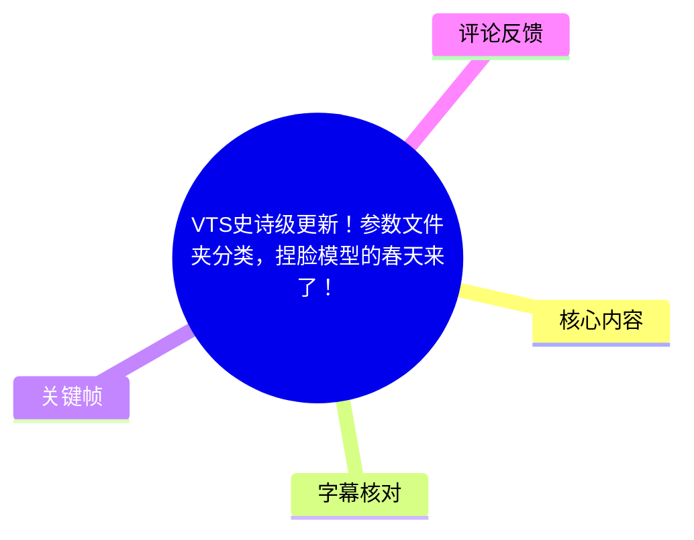
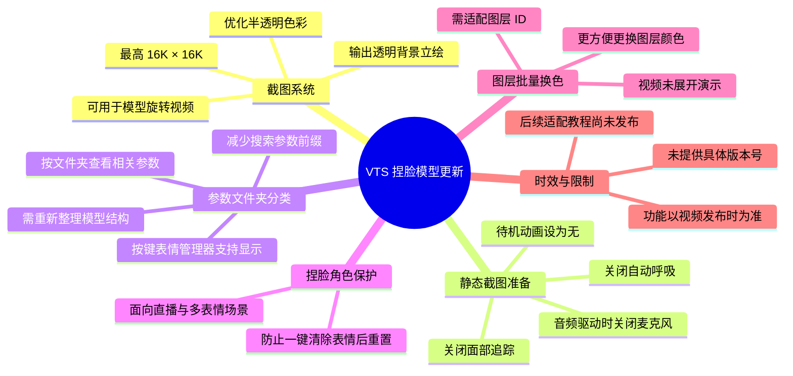
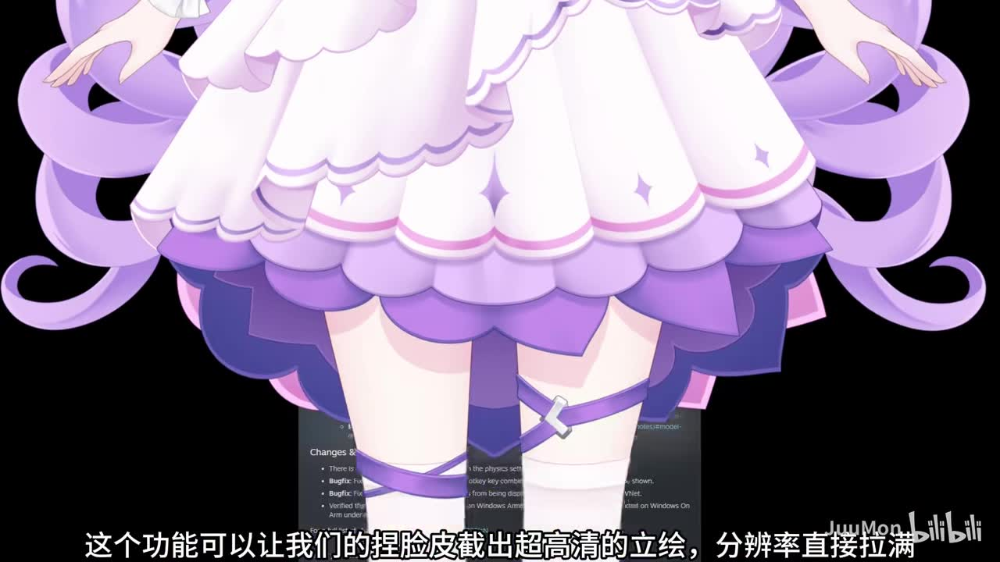
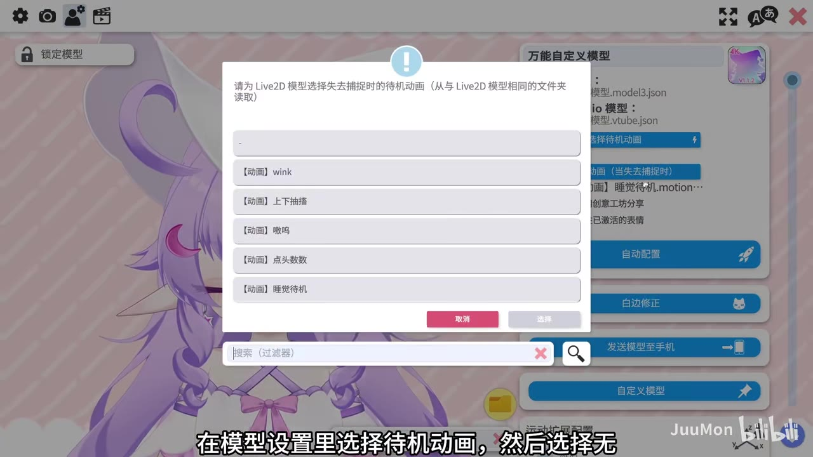
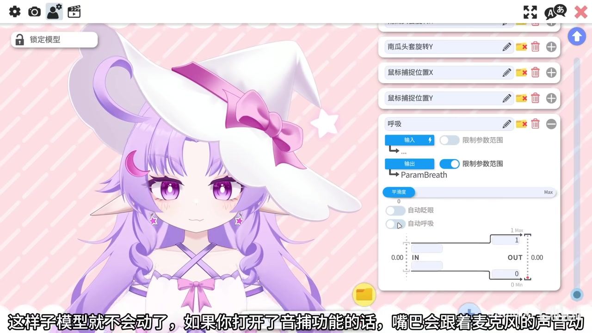

# VTS史诗级更新！参数文件夹分类，捏脸模型的春天来了！

## 小结

视频介绍了 VTube Studio（以下简称 VTS）近期连续更新后，面向“捏脸模型”工作流的几项变化。UP 主重点关注四类能力：新版截图系统、按键表情管理器中的参数文件夹分类、捏脸角色保护，以及模型图层批量换色。

最具操作价值的内容是超高清透明背景立绘导出。视频称新版截图系统支持最高 **16K × 16K** 的任意分辨率，并优化了半透明色彩处理。为了得到静止、干净的截图，需要依次关闭面部追踪触发的待机动画、自动呼吸，并在启用音频驱动时关闭麦克风，最后在截图设置中开启透明部分的捕获。

对于经常通过大量参数组合调整角色外观的用户，按键表情管理器能够显示参数文件夹分类，意味着不必再依赖搜索参数前缀来定位功能。UP 主表示，自己此前虽然已经建立文件夹，但由于旧版 VTS 不显示文件夹，并未认真维护分类；新版支持后，计划重新整理其捏脸模型的文件夹结构，使其兼顾美观、逻辑与实用性。

视频还说明了“捏脸角色保护”的实际场景：直播游戏时，如果同时使用手柄表情、酷酷脸等按键表情，一键清除按键表情可能导致角色回到默认状态；开启保护开关后，清除表情不会再把捏脸角色重置为默认角色。

需要注意：本视频没有给出 VTS 的具体版本号、下载地址、完整的截图设置界面参数，也没有实际演示图层批量换色的操作。UP 主明确表示模型仍需调整图层 ID 等内容，之后才会制作针对新版 VTS 的进一步适配教程。因此，本文记录的是视频所述功能与流程，不将其扩展为已验证的官方完整说明。

## 思维导图

## 目录

- [更新背景与信息范围](#更新背景与信息范围)
- [截图系统：16K 透明背景立绘导出](#截图系统16k-透明背景立绘导出)
- [静态截图操作步骤](#静态截图操作步骤)
- [参数文件夹分类：减少前缀搜索](#参数文件夹分类减少前缀搜索)
- [角色保护与图层批量换色](#角色保护与图层批量换色)
- [限制、适用范围与时效性](#限制适用范围与时效性)
- [关键帧索引](#关键帧索引)
- [字幕比对](#字幕比对)
- [评论分析](#评论分析)
- [处理记录](#处理记录)

## [更新背景与信息范围](https://www.bilibili.com/video/BV17tXQB6Edn?t=0)

视频开头称 VTS“连着三天更新”，并认为这次更新专门对捏脸模型进行了适配优化。这里的“史诗级”是标题与 UP 主的评价，反映其对工作流改善程度的主观判断，并非视频提供的官方评级。

视频的核心受众是：

- 在 VTS 中使用可自定义外观、由参数驱动的“捏脸模型”的用户；
- 需要导出高分辨率角色立绘或透明背景素材的创作者；
- 使用按键表情管理器、手柄表情或其他表情程序进行直播控制的用户；
- 需要维护大量模型参数、图层 ID 与模型文件夹结构的模型制作者。

视频仅展示和讲解部分界面及操作结果。它没有提供 VTS 的完整更新日志、测试环境、系统配置、导出文件格式或截图所耗用的显存／内存情况。

## [截图系统：16K 透明背景立绘导出](https://www.bilibili.com/video/BV17tXQB6Edn?t=10)

UP 主在 [00:10](https://www.bilibili.com/video/BV17tXQB6Edn?t=10) 介绍新版截图系统，视频中的明确参数为：

| 项目 | 视频陈述 |
| --- | --- |
| 截图分辨率上限 | 最高 **16K × 16K** |
| 分辨率设置 | 支持用户自行调整分辨率 |
| 渲染改进 | 优化半透明色彩的处理效果 |
| 透明内容 | 开启对应功能后，可截取模型的透明部分 |
| 预期产物 | 捏脸形象的超高清、透明背景立绘 |
| 后续用途 | 可用立绘制作“3D 模型旋转视频” |

> 图：画面以捏脸模型的服装与半透明装饰为例，字幕说明可输出“超高清的立绘”。它直观说明本次截图能力的目标并非普通屏幕截屏，而是为角色素材导出服务。

视频以带透明效果的星星为例说明开关差异：开启透明部分捕获时，透明效果能被保留；不开启时，导出效果将不同。视频没有说明该选项的精确中文界面名称，因此不宜据此杜撰菜单字段。

UP 主进一步指出，导出的透明背景立绘可作为制作模型旋转视频的素材。这里说的是一种内容制作用途，并不意味着 VTS 会直接从截图自动生成旋转视频。

## [静态截图操作步骤](https://www.bilibili.com/video/BV17tXQB6Edn?t=22)

以下按视频实际讲述顺序整理，时间均取自站内中文时间轴字幕，并以本次 ASR 的对应语段交叉核对。

### 1. 关闭面部追踪，并处理自动触发的待机动画 [00:22](https://www.bilibili.com/video/BV17tXQB6Edn?t=22)

1. 打开设置。
2. 关闭面部相关功能／面部追踪。
3. 视频提示：关闭面部后会自动触发“睡觉待机动画”。
4. 若目标是输出静态立绘，需要在模型设置中找到待机动画，将其选择为“无”。

> 图：画面显示模型设置中的待机动画选择弹窗，字幕同步说明“在模型设置里选择待机动画，然后选择无”。这是避免关闭面部追踪后模型自动进入睡眠待机动作的关键设置依据。

### 2. 关闭自动呼吸，使模型停止运动 [00:34](https://www.bilibili.com/video/BV17tXQB6Edn?t=34)

1. 在模型设置中向下滚动。
2. 展开“呼吸”参数。
3. 关闭“自动呼吸”。

视频说明，完成上述设置后模型将不再因自动呼吸而运动。这一步与关闭待机动画共同服务于“导出静态画面”，否则同一角色在截图时可能处于不希望的动作帧。

> 图：画面展示“呼吸”参数面板，其中可见 `ParamBreath` 及“自动呼吸”开关。该关键帧证明视频所说的是在参数设置中禁用自动呼吸，而非仅暂停画面或缩放模型。

### 3. 排除音频驱动造成的嘴部动作 [00:46](https://www.bilibili.com/video/BV17tXQB6Edn?t=46)

视频提示，如果已开启音频驱动相关功能，模型嘴巴会随麦克风声音运动。为避免在截图中捕捉到不期望的嘴型，可以：

- 在截图前先关闭麦克风／闭麦；
- 再进行截图。

站内字幕将功能表述为“音捕功能”或“音谱”，ASR 也将该词识别为“音补／英普”，两者在词面上不稳定；但中英文站内字幕都明确了其效果是“嘴巴跟随麦克风音频运动”。因此本文保留为“音频驱动相关功能”，避免将不稳定识别结果误写为精确功能名。

### 4. 缩放模型、启用透明捕获并保存 [00:55](https://www.bilibili.com/video/BV17tXQB6Edn?t=55)

1. 将模型缩放至适合全身展示的大小。
2. 点击截图功能。
3. 开启可捕获模型透明部分的选项。
4. 在截图界面自行调整目标分辨率。
5. 点击“确定”执行截图。
6. 对结果满意后保存。
7. 点击旁边的文件夹图标，可跳转至输出位置。

视频在 [01:16](https://www.bilibili.com/video/BV17tXQB6Edn?t=76) 总结结果：用户会得到捏脸形象的超高清、透明背景立绘。

### 截图前检查清单

| 检查项 | 原因 |
| --- | --- |
| 面部追踪已关闭 | 进入静态准备状态 |
| 待机动画已设为“无” | 防止关闭面部后自动播放睡觉待机动画 |
| 自动呼吸已关闭 | 防止身体或呼吸参数持续变化 |
| 麦克风已关闭或无声音输入 | 防止音频驱动嘴型变化 |
| 模型缩放范围正确 | 确保导出画面符合全身或局部构图需求 |
| 透明部分捕获已开启 | 保留半透明装饰及透明背景需求 |
| 分辨率符合用途 | 在清晰度与本机资源压力之间取舍 |

## [参数文件夹分类：减少前缀搜索](https://www.bilibili.com/video/BV17tXQB6Edn?t=86)

在 [01:26](https://www.bilibili.com/video/BV17tXQB6Edn?t=86)，视频转向按键表情管理器。UP 主指出，此次更新优化了其中的**文件夹参数分类**。

旧工作流的问题是：调整捏脸效果时，用户需要搜索各种参数前缀才能定位对应功能，操作繁琐。新工作流中，可以直接打开文件夹，查看该文件夹下相关的参数。

视频给出的变化可以概括为：

| 旧版痛点 | 更新后的使用方式 |
| --- | --- |
| 参数定位依赖搜索不同前缀 | 直接打开参数所属文件夹 |
| 文件夹即使存在，旧版 VTS 也无法显示 | 新版可在对应管理器中显示并利用文件夹分类 |
| 分类维护意愿较低 | 分类变为影响实际操作效率的模型资产 |

UP 主透露，这些文件夹原本是为自己建立的；因为旧版 VTS 看不到文件夹，所以过去没有特别重视其分类。现在 VTS 能显示文件夹后，UP 主计划同步更新自己的捏脸模型，重新优化文件夹分类，目标是“美观、合理且实用”。

这意味着模型作者需要承担新的适配工作：文件夹名称、层级和参数归属应足够清晰，才能把“按文件夹查找”真正转化为用户体验提升。视频没有展示具体的文件夹命名规范或参数树，因此不能从中推导出通用命名标准。

## [角色保护与图层批量换色](https://www.bilibili.com/video/BV17tXQB6Edn?t=119)

### 捏脸角色保护 [01:59](https://www.bilibili.com/video/BV17tXQB6Edn?t=119)

视频描述的风险场景是直播玩游戏时，同时打开手柄相关表情和“酷酷脸”表情等按键表情。如果此时执行“一键清除按键表情”，角色可能会回到默认角色状态。

新增的捏脸角色保护开关用于避免这一重置：

| 操作状态 | 视频描述的结果 |
| --- | --- |
| 未开启保护，一键清除按键表情 | 可能变回默认角色 |
| 开启捏脸角色保护后，一键清除按键表情 | 不会变回默认角色 |

该能力的价值在于保护用户已经配置好的捏脸结果，尤其适用于表情映射复杂、直播中频繁切换控制器或外部表情程序的情况。视频没有展示开关所在的精确页面，也未说明保护是否覆盖全部重置路径，因此其保护范围应以实际新版 VTS 界面和官方说明为准。

### 模型图层批量换色 [02:21](https://www.bilibili.com/video/BV17tXQB6Edn?t=141)

视频还提到 VTS 增加了模型图层批量换色功能。UP 主没有展开教程，仅给出以下信息：

- 该功能总体上让图层换色更方便；
- 自己还需要花时间修改模型，包括图层 ID 等内容；
- 新版 VTS 的模型适配需要时间；
- 等适配完成后，会另行制作视频，详细讲解捏脸模型的更新内容。

因此，批量换色是视频中的“已提及功能”，但并非本视频已完成演示和可复现的完整教学。不能据本视频判断其支持的颜色空间、批处理规则、可操作图层范围或兼容模型格式。

## [限制、适用范围与时效性](https://www.bilibili.com/video/BV17tXQB6Edn?t=149)

### 视频内明确限制

1. **图层批量换色未讲解。** UP 主仅概述其为更方便的图层换色方式。
2. **模型仍在适配。** 图层 ID 等内容需要修改，文件夹分类也计划重新整理。
3. **后续教程尚待制作。** 视频结束时，UP 主表示会在适配完成后再详细讲解捏脸模型更新。
4. **未给出具体版本号。** 因此无法仅凭视频确认功能首次出现于哪一个 VTS 版本。
5. **未给出资源要求。** 虽然视频称截图最高可达 16K × 16K，但没有测试不同硬件、模型复杂度与分辨率下的耗时、内存或显存占用。

### 可迁移经验

- 若要导出稳定的角色素材，应系统性排查所有动态源：待机动画、自动呼吸、面部追踪和麦克风音频驱动。
- 当工具开始支持文件夹层级展示时，模型作者应将参数分类视为用户界面的一部分，而非仅供自己维护的内部结构。
- 对于包含多个表情映射与外部控制来源的直播模型，配置保护机制可以降低误操作导致角色状态丢失的风险。
- 新工具版本带来批量处理能力时，模型的图层 ID、命名和分类质量会直接影响实际适配成本。

### 时效性说明

视频发布时间按元数据时间戳换算为 **2026-03-29**。视频描述的是该时间点附近的 VTS 更新体验；软件后续可能继续迭代，菜单位置、开关名称、功能边界和性能表现均可能变化。实际使用前应以当前安装版本的界面与官方更新说明为准。

## 关键帧索引

| 关键帧 | 对应内容 | 价值 |
| --- | --- | --- |
|  | 高分辨率角色立绘导出 | 展示捏脸模型作为高清立绘素材的视觉目标。 |
|  | 将待机动画设为“无” | 对应静态截图准备中最容易遗漏的设置。 |
|  | 关闭自动呼吸 | 直观显示 `ParamBreath` 与自动呼吸开关，支撑“模型不会动”的操作结论。 |

> 未将其余关键帧强行用于正文：给定素材中仅以上画面能够直接支撑视频中的具体设置步骤和输出目标；其余帧未在提供的可视内容中获得足够上下文，不作超出素材的解释。

## 字幕比对

| 字幕来源 | 完整性 | 专有名词 | 时间轴 | 主要问题 |
| --- | --- | --- | --- | --- |
| Bilibili 站内中文字幕 `p01-ai-zh.srt` | 完整覆盖 00:00:00.040–00:02:45.440 | VTS、16K×16K、`ParamBreath` 所述语义较完整；“音捕／音谱”词面仍有歧义 | 71 个短分段，适合定位操作步骤 | 为 AI 字幕；个别口语、术语和结尾“加纳”存在识别或翻译痕迹 |
| 本次 ASR `medium` | 覆盖约 153.99 秒，语音覆盖率 91.93% | 能识别 VTS、16K×16K、待机动画、自动呼吸等主干内容 | 10 个长分段，有时间戳但粒度较粗 | 多处错别字与同音误识别，如“优划”“历绘”“文件加”“捏连”“涂层”；部分句子合并过长 |
| 站内英文字幕 `p01-ai-en.srt` | 完整覆盖相同时段 | 有助于确认“音频驱动导致嘴巴跟随麦克风”“透明部分捕获”等语义 | 与中文字幕分段一致 | 同为 AI 字幕；部分术语采取意译，不能替代中文界面实证 |

### 最终字幕选择

正文以 **Bilibili 站内中文时间轴字幕 `p01-ai-zh.srt`** 为主，因为它具有细粒度、连续的真实分段时间，可直接用于章节时间轴链接；同时已检查本次 ASR 结果，并以 ASR 的中文语音识别内容核对主题、顺序和关键参数。

本次 ASR 诊断中未出现 `noAudioStream=true`；相反，诊断显示音频时长约 167.51 秒、语言为中文、语言置信度约 0.9917，因此源视频存在音轨，ASR 可作为站内字幕的交叉验证来源。

### 重要校正与保留策略

- ASR 将“立绘”多次识别为“历绘”，依据站内中文字幕及画面语境统一校正为“立绘”。
- ASR 将“文件夹”识别为“文件加／文件家”等，依据站内中文字幕统一校正为“文件夹”。
- ASR 将“图层”识别为“涂层／涂存”，依据站内中文字幕统一校正为“图层”。
- “音捕功能／音谱”在站内中文和 ASR 中都有不稳定表记；结合站内英文字幕中“lip-sync”“microphone audio”的解释，正文只确认其“由麦克风音频驱动嘴部动作”的效果，不虚构其官方中文名称。
- 关键帧中的待机动画选择弹窗、呼吸参数 `ParamBreath` 与自动呼吸开关，进一步支持了站内字幕对应的操作语义。

## 评论分析

以下仅分析可获取的热评前三条。评论反映用户感受，不作为软件功能或硬件需求的已验证事实。

1. **星与系-XYX（5 赞）**：  
   > “哇哦，看来核显能播这玩意儿的时代结束了[doge]”  
   评论以玩笑方式表达对高分辨率截图能力可能提高硬件负担的担忧。视频本身并未展示 16K 截图的硬件占用，也未比较核显与独显性能，因此该观点只能视为社区的性能联想，不能据此得出“核显无法使用”的结论。

2. **雨默glass（4 赞）**：  
   > “太强了这个功能，感觉以后市面上会蹦发出更多的捏脸模型……”  
   评论认为新功能可能促进更多捏脸模型出现。这与视频强调的参数文件夹分类、角色保护和更方便换色所降低的使用／维护门槛相呼应，但“会出现更多模型”属于对生态发展的预测，视频没有提供市场数据或开发者计划予以验证。

3. **YYpma（3 赞）**：  
   > “史诗级更新，自定义捏脸福音！”  
   评论认可更新对自定义捏脸用户的价值，与 UP 主的总体评价一致。其可信范围限于主观使用体验；视频能够直接支持的具体改善包括参数文件夹可见、重置保护与截图导出流程，而非对所有 VTS 用户场景的普遍结论。

## 处理记录

- Worker ID：`worker-mrj0wbly-5dc4e50c`
- 模型：`gpt-5.6-terra`
- 使用的素材与工具结果：Bilibili 元数据、站内时间轴字幕（中文、英文及其他语言版本）、本次 ASR 结果（`medium`，CUDA、`float16`）、关键帧素材、热评接口结果。
- 字幕选择：以 `p01-ai-zh.srt` 作为正文时间轴依据；已与本次 ASR 的 10 个时间段、中文语义和诊断信息交叉核对；以英文站内字幕辅助消除“音频驱动”相关表述歧义。
- ASR 音轨检查：ASR 结果未标记 `noAudioStream=true`，且诊断显示存在约 167.51 秒音频；未将 ASR 错字视为无音轨或工具失败。
- 关键帧选择依据：选用 `frames/frame-002.jpg` 支撑高清立绘输出语境，`frames/frame-003.jpg` 支撑待机动画设为“无”的步骤，`frames/frame-004.jpg` 支撑呼吸参数和自动呼吸开关；未对未获得充分画面上下文的关键帧作推测性描述。
- 缓存清理：提供的素材清单未包含缓存清理执行记录，无法确认是否已清理；本文不虚构清理结果。
- 未解决问题：素材未提供 VTS 精确版本号、官方更新日志、图层批量换色的实际操作界面、16K 导出性能测试数据，以及角色保护开关的完整覆盖范围。
