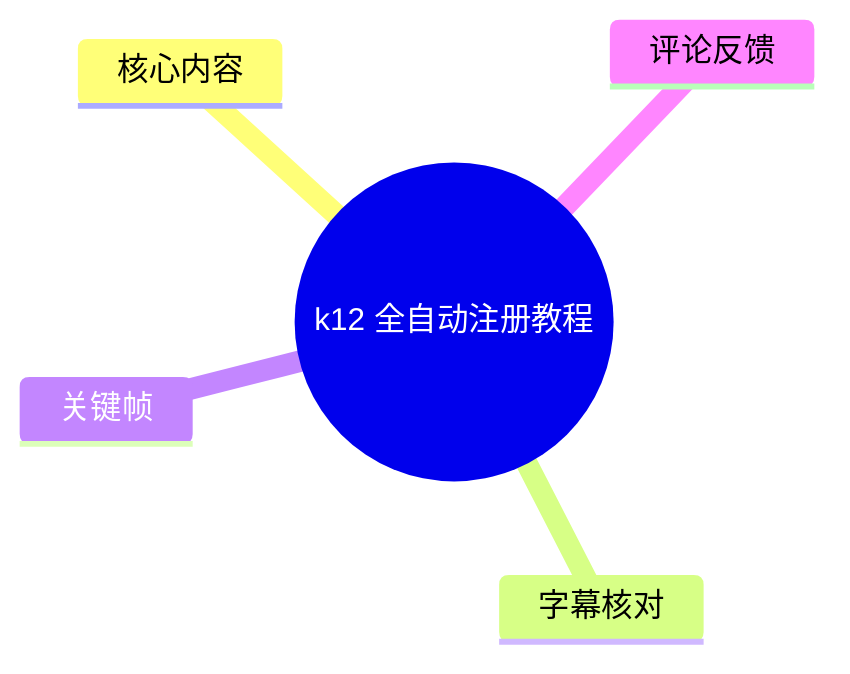
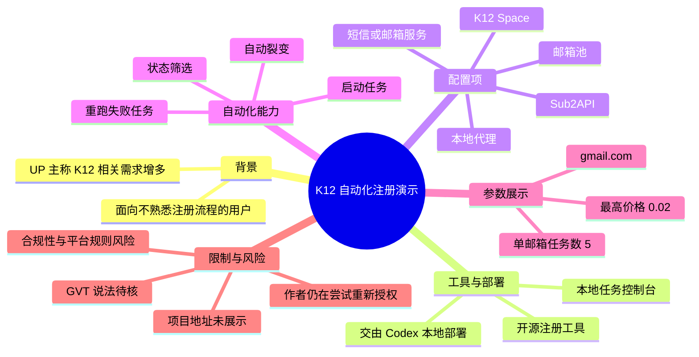
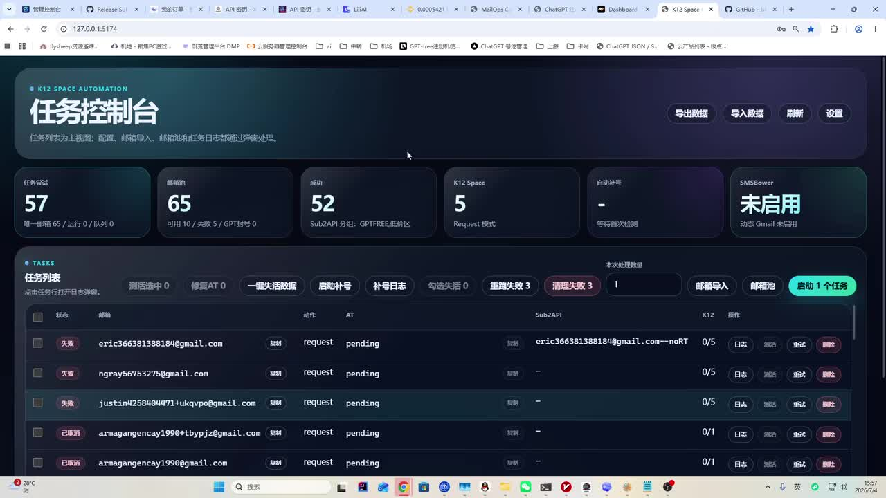
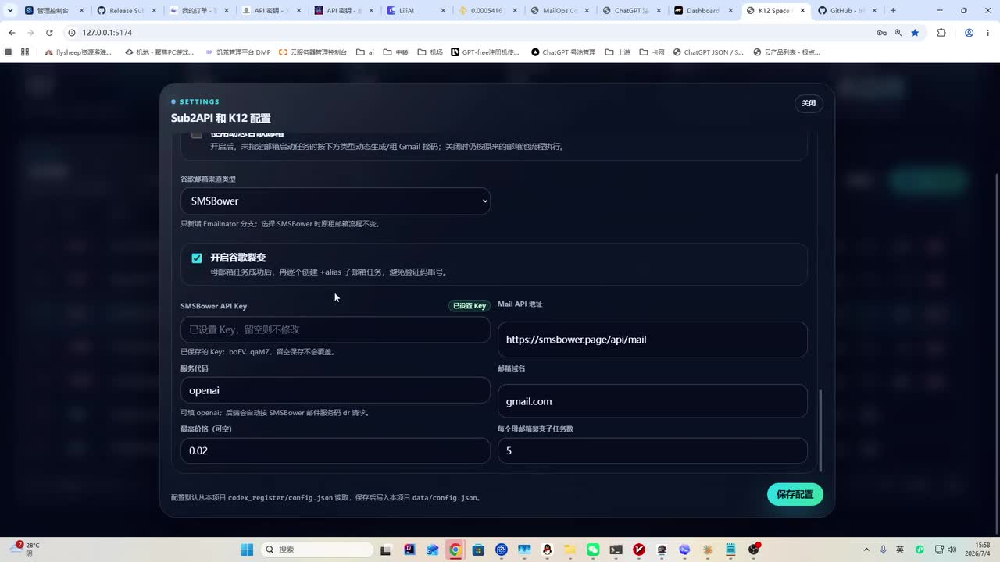
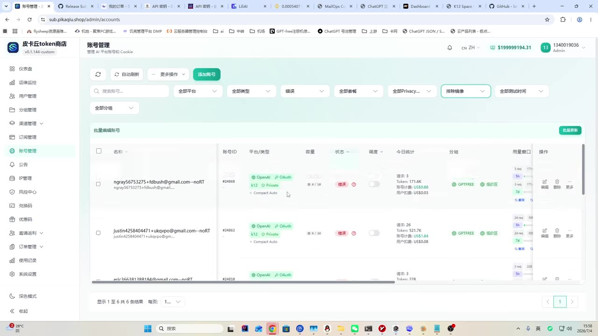
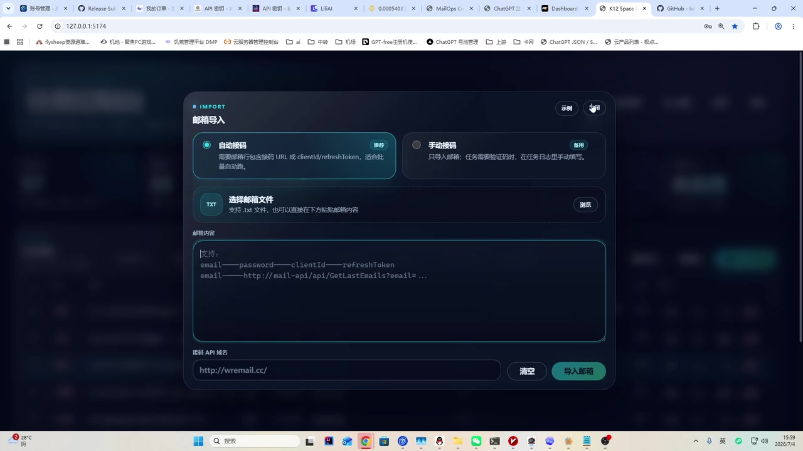

# k12 全自动注册教程

> 来源：[Bilibili 视频](https://www.bilibili.com/video/BV1NhMF6hENX) 
> UP 主：皮卡丘嘤嘤嘤吗｜时长：1 分 51 秒｜合集：AIcode 
> 视频简介：`k12 全自动刚注册教程，可裂变`

## 小结

视频展示了一个本地运行的“K12 Space Automation”任务控制台，并将其描述为可用于批量处理 K12 相关注册流程的开源注册工具。UP 主称，可以把项目地址交给 Codex 在本地部署，再在界面中配置 K12 Space、Sub2API、邮箱池与任务参数。

视频中最关键的功能包括：导入邮箱数据、创建/启动任务、查看任务状态、筛选结果、重跑失败任务，以及开启“裂变”选项。UP 主表示，自己在原有工具基础上修改了裂变流程，使其由原先的手动操作变为自动化；同时增加了失败任务的直接重跑和筛选项。

该流程依赖本地代理，UP 主称注册时“可能要连 GVT”，因此需要具备相应的代理网络条件；还提到需要购买 Google 邮箱并导入邮箱池。视频没有提供项目地址、完整部署命令、代理配置细节、K12 服务条款、账号来源合法性或成功率数据。

画面中的设置页显示了 `Sub2API 和 K12 配置`、短信/邮箱服务类型、裂变开关、邮箱域名、单邮箱最大任务数等字段。部分可见参数包括邮箱域名 `gmail.com`、每个邮箱最大任务数 `5`、最高价格 `0.02`；但视频未说明价格单位、计费来源及这些值的通用性。

需要注意：批量注册、购买账号、自动化处理第三方服务账户以及通过代理改变网络出口，可能违反相关平台规则、服务条款或适用法律。视频仅证明作者在演示环境中展示过该界面，不构成对工具可用性、合规性、稳定性或账户权益的验证。

## 思维导图

## 目录

- [背景、定位与时效性](#背景定位与时效性)
- [任务控制台与可见状态](#任务控制台与可见状态)
- [配置：Sub2API、K12 与裂变](#配置sub2apik12-与裂变)
- [邮箱池导入与任务执行](#邮箱池导入与任务执行)
- [视频中的操作流程整理](#视频中的操作流程整理)
- [参数、限制与风险](#参数限制与风险)
- [关键帧索引](#关键帧索引)
- [字幕比对](#字幕比对)
- [评论分析](#评论分析)
- [处理记录](#处理记录)

## 背景、定位与时效性 [00:00](https://www.bilibili.com/video/BV1NhMF6hENX?t=0)

UP 主开场称“最近这个 K12 有点泛滥”，并认为仍有用户不知道如何注册。这里的“K12”在视频及提供素材中没有展开定义；从界面可见的 `K12 Space`、`OpenAI / OAuth`、账号管理等标签看，它更像是某个与账户或空间配置相关的工作流名称，但其具体服务对象不能仅凭视频确认。

UP 主的核心主张是：目前已有“开源的注册机”，用户可将项目地址交给 Codex 部署在本地。素材未附项目仓库、下载地址、许可证、版本号、依赖清单或部署日志，因此无法复现或验证这一主张。

视频发布元数据时间为 2026 年 7 月。此类自动化项目通常受第三方网页流程、接口策略、验证码、账号政策、代理可用性与上游服务价格影响，时效性较强。即使视频录制时界面可运行，也不能推断当前仍可用。

## 任务控制台与可见状态 [00:20](https://www.bilibili.com/video/BV1NhMF6hENX?t=20)

画面展示本地地址访问的深色界面，标题为 `K12 SPACE AUTOMATION` 与“任务控制台”。界面上方提供“导出数据”“导入数据”“刷新”“设置”等入口；下方是任务列表及批量操作区。

> 图：该帧展示了视频所称“自动化”的实际承载界面。它能够帮助读者确认，演示内容并非只有口头描述，而是包含任务列表、邮箱池统计、成功状态和任务操作入口；但画面本身不能证明任务真实完成或服务端已接受注册结果。

从该帧可见的统计信息包括：

| 界面字段 | 画面可见内容 | 可确认范围 |
| --- | --- | --- |
| 任务尝试 | `57` | 表示界面记录的任务数量或尝试数，具体统计口径未说明。 |
| 邮箱池 | `65` | 画面同时显示可用、失败等细分数，但细节不宜据此推断账号有效性。 |
| 成功 | `52` | 界面标识为成功的记录数；未提供外部验证。 |
| K12 Space | `5` | 标注为 `Request 模式`。 |
| SMSBower | `未启用` | 画面明确显示未启用状态。 |

任务列表中可见状态标签如“失败”“已取消”，每行包含邮箱、动作、AT、Sub2API、K12 与操作区域。批量按钮包括“一键失活数据”“启动补号”“补号日志”“勾选失活”“重跑失败”“清理失败”等。UP 主对应说明，原版需要逐个点击失败项，修改后能够直接重跑失败任务。

视频还提到增加了筛选项，可按成功等状态查看数据；但其后对“掉数权/掉授权”的口述不清晰，无法准确还原术语。UP 主表示可尝试“重新授权”与“检验”，但也明确说“这个不知道能不能实现，我还在尝试”，因此这部分应视为未完成验证的设想，而不是已交付功能。

## 配置：Sub2API、K12 与裂变 [00:42](https://www.bilibili.com/video/BV1NhMF6hENX?t=42)

UP 主称，部署后需要在设置中配置“空间”“K12 空间”，并接入 `Sub2API`。关键帧的设置页标题为“Sub2API 和 K12 配置”，因此 `Sub2API` 是画面可确认的拼写；ASR 中的“sub2”据此校正为 `Sub2API`。

> 图：该帧直接展示了配置页中的服务类型、裂变开关与可见数值字段，是核对 ASR 中“开启裂变”“设置邮箱域名”“每邮箱任务数”等说法的主要依据。为避免泄露或复用潜在敏感配置，本文不转录画面中的密钥内容。

该页可辨认的配置要素如下：

| 配置项 | 画面/口述信息 | 说明 |
| --- | --- | --- |
| 谷歌邮箱来源类型 | `SMSBower` | 下拉框显示该类型；任务页同时显示该服务未启用。 |
| 裂变 | “开启谷歌裂变”已勾选 | UP 主称已把原本手动裂变改为自动化。 |
| SMSBower API Key | 已设置 Key | 密钥属于敏感信息，视频画面虽可能局部显示，本文不记录。 |
| Mail API 地址 | 可见为 `https://smsbower.page/api/mail` | 这是画面中显示的地址，不代表其当前可用或可信。 |
| 邮箱域名 | `gmail.com` | 配置字段的当前示例值。 |
| 最高价格 | `0.02` | 未说明币种、计费单位、适用服务或是否含税。 |
| 每个邮箱最大任务数 | `5` | 仅为录屏中的当前配置，非推荐值或通用上限。 |
| 配置文件提示 | `codex_register/config.json`，保存后写入 `data/config.json` | 该路径来自界面底部提示，未获得文件内容。 |

UP 主还称，使用时要“配合好本地代理”，原因是“可能要连 GVT 去注册”。`GVT` 是 ASR 结果，视频没有对其全称、网络地址、用途或必要性作出可核验说明，故保留原词并标注为待确认，不应据此配置网络规避措施。

## 邮箱池导入与任务执行 [01:12](https://www.bilibili.com/video/BV1NhMF6hENX?t=72)

UP 主表示需要购买 Google 邮箱，再将邮箱导入“号池”。画面中另有一个账号管理页面，能看到“OpenAI”“OAuth”“K12”“Private”等标签及账号状态列，说明导入后的数据可能会在另一套管理界面中呈现；但视频未说明该界面与本地注册工具之间是否为同一系统、如何同步，也未展示导入成功过程。

> 图：该帧的价值在于展示作者所说“号池/账号管理”可能对应的后续管理界面，包括状态、分组、用量窗口等列。它不能证明画面内任何账号的来源、有效性、授权状态或合法性。

在约 01:30 后，视频转至“邮箱导入”弹窗。弹窗提供“自动接码”与“手动接码”两种方式，其中“自动接码”被选中；下方显示支持文本文件和文本输入的导入区域，以及“接码 API 域名”字段。

> 图：该帧能说明导入模块的交互结构：选择接码模式、提供文本数据、填写接码 API 域名并执行导入。画面包含可能与账户访问有关的字段格式，因此本文只概述其结构，不复述可直接用于批量账户操作的完整数据模板。

视频画面提示导入内容包含多个以分隔符组织的字段，其中可辨认出 `email`、`password`、`clientId`、`refreshToken` 等词。此类信息属于高敏感认证数据：应避免在聊天、截图、公开仓库、日志或第三方 SaaS 中传播；也不应导入无授权来源的邮箱或令牌。

## 视频中的操作流程整理 [00:08](https://www.bilibili.com/video/BV1NhMF6hENX?t=8)

以下是对视频**已展示或明确口述**的顺序整理，不补充视频未提供的命令、项目地址、绕过步骤或凭据格式。

1. **取得并在本地部署工具**
   - UP 主称存在开源注册工具，并建议将项目地址交给 Codex 部署到本地。
   - 未展示仓库地址、安装命令、依赖版本、操作系统要求或部署成功标准。
   - 评论中有人反馈 Codex 不帮助部署，侧面反映“交给 Codex”不是无需人工处理的一键方案。

2. **打开设置并配置 K12/接口相关项**
   - 设置页标题为“Sub2API 和 K12 配置”。
   - 视频中提到设置“空间”“K12 空间”以及自动接入 `Sub2API`。
   - 画面显示谷歌邮箱来源类型、API Key、Mail API 地址、邮箱域名、价格和每邮箱任务数等字段。

3. **确认网络与上游服务条件**
   - UP 主明确要求准备本地代理。
   - 其“可能要连 GVT 去注册”的说法缺乏说明，且未演示连通性检测、地区选择或代理失败处理。
   - 不应将此表述理解为绕过平台网络、风控或地区限制的操作建议。

4. **配置裂变与失败处理**
   - 勾选“开启谷歌裂变”。
   - UP 主称其改动目标是将原来的手动裂变自动化。
   - 任务页提供“重跑失败”相关入口，UP 主称改动后可直接重跑失败任务。

5. **导入自有且经授权的邮箱数据**
   - 视频称将 Google 邮箱导入号池。
   - 导入页显示自动/手动接码选项与接码 API 域名。
   - 视频没有说明数据授权、保管、加密、删除策略与服务商合规要求；这些是实际使用前必须自行确认的事项。

6. **启动任务并查看结果**
   - 控制台提供启动任务、刷新、日志、筛选等操作。
   - 可按任务状态查看“成功”“失败”“已取消”等记录。
   - UP 主提到“成功的”记录仍可能出现授权失效或状态变化，但这一功能能否重新授权仍在尝试中，未得到演示验证。

## 参数、限制与风险 [01:35](https://www.bilibili.com/video/BV1NhMF6hENX?t=95)

### 视频中可见参数

| 项目 | 值或状态 | 来源 | 注意事项 |
| --- | --- | --- | --- |
| 视频时长 | 111 秒 | 元数据 | 单集内容，未含外部文档。 |
| 分辨率 | 1920 × 1080 | 元数据 | 横屏桌面录制。 |
| K12 Space 数量 | 5 | 任务控制台画面 | 不明确定义及统计时间。 |
| 任务尝试数 | 57 | 任务控制台画面 | 不代表成功注册数。 |
| 邮箱池数 | 65 | 任务控制台画面 | 不代表均可用。 |
| 成功数 | 52 | 任务控制台画面 | 无第三方验证。 |
| 短信/邮箱服务 | SMSBower | 配置页 | 当前画面显示任务页“未启用”。 |
| 邮箱域名 | `gmail.com` | 配置页 | 是示例配置，不是普遍要求。 |
| 最高价格 | `0.02` | 配置页 | 单位与计费规则未知。 |
| 单邮箱最大任务数 | `5` | 配置页 | 当前配置，不构成建议。 |
| 裂变 | 已开启 | 配置页 | 具体机制和影响未公开。 |

### 已明确的限制

- **项目资源缺失**：素材没有开源项目地址、版本、代码、文档或部署日志，无法独立复现。
- **术语不完整**：K12、K12 Space、GVT、Sub2API 的具体服务关系没有完整解释。
- **功能验证不足**：UP 主明确表示重新授权功能尚在尝试，不能视为稳定能力。
- **结果不可外推**：控制台中的“成功”是界面状态，不等于相关账户长期可用、已获得平台授权或没有风控风险。
- **参数语境不足**：`0.02`、`5` 等数值没有单位、成本模型、并发模型或适用范围。
- **接口易变**：外部邮件、短信、账号、OAuth、代理和第三方平台接口均可能变更或限制自动化访问。

### 合规与安全边界

视频涉及邮箱池、自动接码、OAuth 类字段、代理和批量任务。此类流程可能触及账号滥用、未授权访问、规避服务限制、隐私泄露、支付纠纷和服务条款违约等风险。尤其是 `password`、`refreshToken`、API Key 等认证材料，不应收集、购买、共享、上传或导入不属于自己的数据。

若用于正当的内部测试或自有系统，应至少满足：数据来源有明确授权、测试环境隔离、凭据加密存储、访问日志可审计、最小权限、任务速率受控，并以目标服务的公开 API、测试账号与书面许可为准。

## 关键帧索引 [00:20](https://www.bilibili.com/video/BV1NhMF6hENX?t=20)

| 关键帧 | 对应内容 | 选择价值 |
| --- | --- | --- |
| [frame-001.jpg](frames/frame-001.jpg) | K12 Space Automation 任务控制台 | 展示任务统计、状态列表、失败重跑与批量操作，是理解工具整体结构的主图。 |
| [frame-002.jpg](frames/frame-002.jpg) | Sub2API 和 K12 配置页 | 验证裂变开关、邮箱域名、价格、任务数及配置文件路径等关键口述。 |
| [frame-003.jpg](frames/frame-003.jpg) | 账号管理页 | 补充“号池”在后续管理系统中的可能呈现方式，但不用于验证账号有效性。 |
| [frame-004.jpg](frames/frame-004.jpg) | 邮箱导入页 | 说明自动/手动接码与导入入口的存在，同时提示认证字段的敏感性。 |

## 字幕比对 [00:00](https://www.bilibili.com/video/BV1NhMF6hENX?t=0)

| 字幕来源 | 完整性 | 专有名词 | 时间轴 | 主要问题 |
| --- | --- | --- | --- | --- |
| Bilibili 站内字幕 | 不可用 | 无法评估 | 无法评估 | 素材明确标注“未提供可用站内字幕”；抓取过程报错：`Missing JSON resource URL`。 |
| 本次 ASR 字幕 | 覆盖了主要口述内容 | 部分可由画面校正 | 未提供逐句时间戳，仅能按画面段落估计 | 存在同音、断句和术语不清，如“sub2”“掉数权”“入3”“GVT”等。 |

最终采用**本次 ASR 字幕为主、关键帧为交叉校正依据**。本次 ASR 已执行，站内字幕未能取得，因此不存在两份完整字幕的逐句合并。

重要校正与保留原则：

- ASR 的“sub2”结合设置页标题校正为 **`Sub2API`**。
- ASR 的“K12 空间”与画面中的 **`K12 Space`** 对应。
- ASR 中“开启裂便”根据配置页文字校正为 **“开启谷歌裂变”**。
- “GVT”虽被 ASR 转写出来，但没有更多画面或上下文可证实其含义，保留为待确认词。
- “掉数权”“入3”等表达无法可靠辨识，正文未将其扩展为确定技术结论。
- ASR 所称“我稍微修改了一下”“我还在尝试”等，反映的是 UP 主个人陈述，不等于已验证的产品能力。

## 评论分析 [00:00](https://www.bilibili.com/video/BV1NhMF6hENX?t=0)

本次仅获取到 2 条热评，少于要求处理上限“前三条”；以下仅分析可获取内容，不将评论视为事实验证。

1. **曦澄基尼：`codex不帮我部署怎么搞啊`**
   - 观点：评论者在部署环节受阻，说明视频中“把地址丢给 Codex 去部署”的描述对部分用户并不足以完成实际配置。
   - 补充价值：强调该流程仍需要用户具备一定的环境配置、排错或项目理解能力。
   - 可信度与边界：这是个人问题反馈，无法据此判断 Codex 是否普遍无法部署，也无法确认其所用环境、提示词或项目资源是否完整。

2. **哈皮父子23：`低价gpt plus号，这里下单https://xkj666.chat/[doge]`**
   - 观点：该评论为第三方账号交易推广，与视频技术内容无实质补充。
   - 风险：账号交易链接及“低价号”宣传没有可靠来源证明，可能涉及账户安全、支付、封禁、隐私或服务条款风险。
   - 处理结论：不采纳其作为工具、账号或服务推荐，也不将其链接作为视频资料来源。

## 处理记录 [00:00](https://www.bilibili.com/video/BV1NhMF6hENX?t=0)

- Worker ID：`worker-mrj0wbly-5dc4e50c`
- 模型：`gpt-5.6-terra`
- 调用工具与素材：视频元数据、视频合并文件、音频 ASR、站内字幕获取尝试、4 张关键帧、热评 JSON。
- 使用的应用工具：视频素材整理流程；ASR 转写；站内字幕资源请求；关键帧抽取；评论获取。
- 字幕选择：站内字幕不可用，且字幕工具报 `Missing JSON resource URL`；已执行本次 ASR，并以 ASR 为主、关键帧文字为校正依据。
- 关键帧选择依据：`frame-001` 用于任务控制台和结果状态；`frame-002` 用于配置及参数核对；`frame-003` 用于账号管理场景；`frame-004` 用于邮箱导入结构。所有图片均与正文相应段落直接相关。
- 评论范围：请求上限为热评前三条，实际仅获取 2 条，未虚构第 3 条。
- 缓存清理：提供的素材未包含缓存清理执行回执；无法确认处理环境是否已完成缓存清理。
- 未解决问题：开源项目地址与版本缺失；K12、GVT、Sub2API 的服务关系不明；重新授权功能未验证；ASR 个别术语存在歧义；第三方接口、账号来源与使用合规性无法由视频确认。

## 评论分析

本次流程未获取到可用热评，因此不推断观众态度或额外结论。
