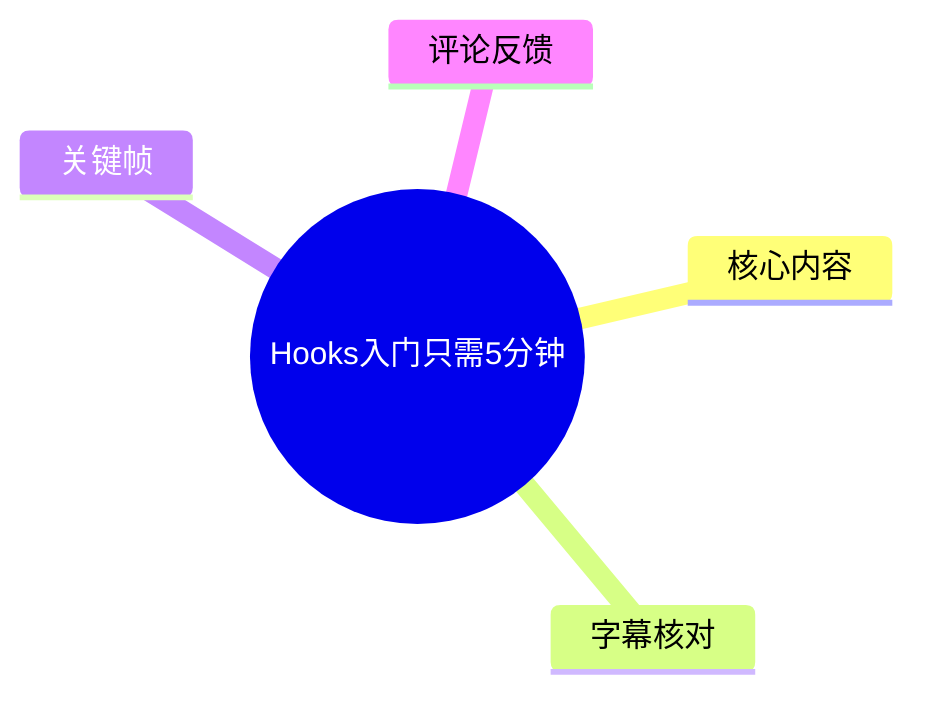
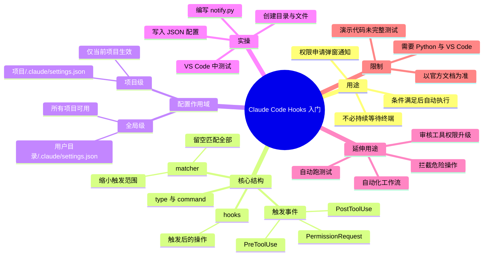
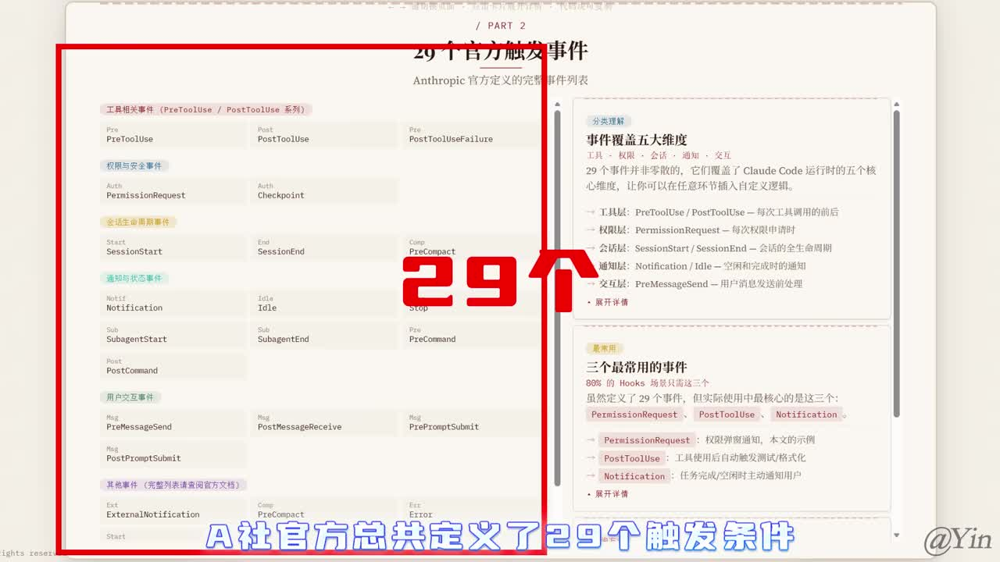
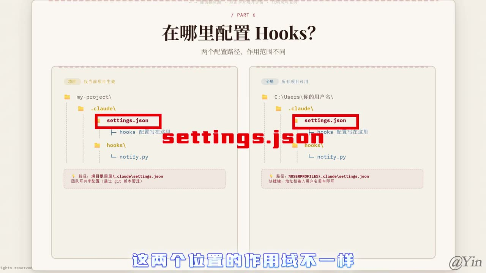
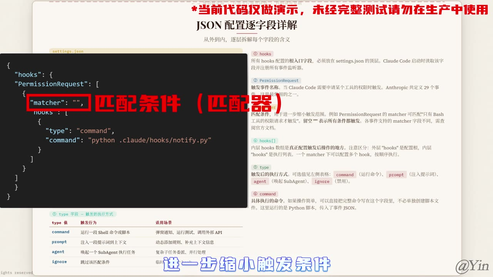

# Hooks入门只需5分钟

> 来源：[Bilibili 视频](https://www.bilibili.com/video/BV1yDLG6DE39)<br>
> UP 主：Yin_Code｜时长：4 分 33 秒｜标签：AI、教程、Claude Code、agent、hooks  
> 视频简介称相关教学素材已开源至 GitHub：`KYinCode/claude-code-popup-hooks`。

## 小结

这是一则围绕 Claude Code Hooks 的入门实操教程。视频用“当 Claude Code 需要权限时弹出系统通知，并将用户选择同步回 Claude Code”的案例，说明 Hooks 可以在特定条件满足时执行命令、脚本或提示词，从而把原本需要等待人工处理的节点接入自动化流程。

视频给出的核心结构是：**触发事件（event）→ 匹配条件（matcher）→ 执行配置（hooks）→ 执行方式（type）与具体内容（如 command）**。UP 主称 Anthropic 官方定义了 29 个触发事件，并以 `PermissionRequest` 为例讲解如何在权限请求时触发脚本。

配置可置于项目级 `.claude/settings.json`，也可置于用户目录 `.claude/settings.json`。前者仅对当前项目有效，适合随项目版本管理；后者为全局配置。脚本则可放在项目内或用户目录的 `.claude/hooks/` 下，作用域与配置位置相对应。

实操部分创建 `.claude/settings.json`、`.claude/hooks/notify.py`，并通过 `command` 调用 Python 脚本。脚本会从标准输入读取 JSON、解析后处理，并通过标准输出返回结果。视频未完整展示脚本源码和通知实现细节，因此不能据此推断其跨平台兼容性、权限安全策略或错误处理逻辑。

重要限制是：画面明确标注“**当前代码仅做演示，未经完整测试请勿在生产中使用**”。此外，视频中关于事件数量、`type` 枚举、匹配器与路径规则均属于特定版本 Claude Code 的配置说明；工具迭代后应以当前官方文档和实际安装版本为准。

## 思维导图





## 目录

- [背景：Hooks 解决什么问题？](#背景hooks-解决什么问题)
- [Hooks 的组成与触发事件](#hooks-的组成与触发事件)
- [配置位置与作用域](#配置位置与作用域)
- [JSON 配置字段与脚本通信](#json-配置字段与脚本通信)
- [项目级 Hooks 实操步骤](#项目级-hooks-实操步骤)
- [测试通知弹窗与可扩展场景](#测试通知弹窗与可扩展场景)
- [限制、风险与时效性](#限制风险与时效性)
- [字幕比对](#字幕比对)
- [评论分析](#评论分析)
- [处理记录](#处理记录)

## [背景：Hooks 解决什么问题？](https://www.bilibili.com/video/BV1yDLG6DE39?t=9)

视频开场展示的目标效果是：Claude Code 需要用户授权时，可以直接弹出通知请求权限，而不是让用户一直盯着 Claude Code 的界面等待。UP 主将其归因于 Claude Code 的 Hooks 机制。

Hooks 在本视频中的定义是：**当某一条件达成后，执行一段命令、脚本或提示词等内容**。因此，它不是单纯的“弹窗功能”，而是一套把 Claude Code 生命周期事件与外部操作连接起来的机制。


> 图：开场画面展示 Claude Code 的通知弹窗场景，是后文 `PermissionRequest` Hook 示例所要实现的用户体验目标：在权限请求出现时获得可操作提醒。

## [Hooks 的组成与触发事件](https://www.bilibili.com/video/BV1yDLG6DE39?t=28)

UP 主称官方定义了 **29 个触发条件事件**。视频画面将其分为工具相关、权限与安全、会话生命周期、通知与状态、用户交互等类别；此处的“29 个”是视频陈述，实际数量应随官方版本变动而复核。

视频将一个完整 Hook 概括为以下要素：

| 要素 | 视频中的含义 | 示例或作用 |
| --- | --- | --- |
| 触发事件 | 哪类条件到达后触发 | `PermissionRequest` |
| `matcher` | 匹配条件，用于进一步收窄范围 | 空字符串表示不额外筛选 |
| 内层 `hooks` | 真正声明触发后操作的位置 | 可容纳具体 Hook 配置 |
| `type` | 触发后的执行方式 | `command` |
| 执行内容 | 实际运行的命令、脚本或其他内容 | Python 脚本路径 |

视频列举的事件包括：

- `PreToolUse`：使用工具前；
- `PostToolUse`：使用工具后；
- `PermissionRequest`：请求权限时；
- `Notification`：通知相关事件。

UP 主特别指出，`Notification` 事件有 6 个匹配条件；不同事件支持哪些 `matcher`，应查询官方开发文档。`matcher` 留空时，视频解释为所有匹配项均可触发。



> 图：该关键帧将事件列表与“29 个官方力触发事件”的讲解同时呈现，帮助区分“事件本身”与后续具体执行逻辑。画面中的事件命名也为字幕中被识别错误的英文术语提供了校正依据。

## [配置位置与作用域](https://www.bilibili.com/video/BV1yDLG6DE39?t=45)

视频给出两种 Hooks 配置位置：

| 作用域 | 配置文件 | 生效范围 | 视频建议的使用语境 |
| --- | --- | --- | --- |
| 项目级 | `项目目录/.claude/settings.json` | 仅当前项目 | 当前项目的独立自动化；画面提示可与项目共享配置并纳入 Git 版本管理 |
| 全局级 | `用户目录/.claude/settings.json` | 所有项目 | 需要在本机多个项目复用的配置 |

脚本文件也可对应放置：

- **项目级脚本**：项目内的 `.claude/hooks/`；
- **全局脚本**：用户目录的 `.claude/hooks/`。

选择原则是让配置及其脚本的作用域保持一致。若希望项目可移植、可随仓库共享，项目级配置更直观；若是个人机器的通用提醒逻辑，则视频所述全局位置更适合。视频没有解释项目级和全局级配置同时存在时的优先级或合并规则，实际使用前应查阅当前版本官方文档。



> 图：画面并列展示项目目录和用户目录下的 `.claude/settings.json`、`hooks/notify.py`，直观说明两类配置的文件结构及“当前项目”与“全局”的作用域差异。

## [JSON 配置字段与脚本通信](https://www.bilibili.com/video/BV1yDLG6DE39?t=60)

视频以 `PermissionRequest` 展示 JSON 配置层级。根据画面可辨识的示例，结构如下：

```json
{
  "hooks": {
    "PermissionRequest": [
      {
        "matcher": "",
        "hooks": [
          {
            "type": "command",
            "command": "python .claude/hooks/notify.py"
          }
        ]
      }
    ]
  }
}
```

字段含义如下：

1. 顶层 `hooks`：Hooks 配置入口。
2. `PermissionRequest`：触发事件，即 Claude Code 请求某项权限时进入该配置。
3. `matcher`：额外匹配器，进一步缩小触发条件。示例值 `""` 代表不设置额外限制。
4. 内层 `hooks` 数组：实际配置触发后动作的区域；一个 `matcher` 下可配置多个 Hook。
5. `type`：触发后的执行方式。视频画面列出：
   - `command`：运行 Shell 命令或脚本；
   - `prompt`：注入一段提示词到上下文；
   - `agent`：唤起一个 SubAgent 执行任务；
   - `ignore`：跳过该匹配条件。
6. `command`：当 `type` 为 `command` 时要执行的命令。视频示例为 Python 运行 `notify.py`。

视频强调：简单操作可以直接在 `command` 字段写完整命令，不必单独创建脚本文件；而当前示例采用 Python 文件，是为了实现较完整的通知处理。

关于数据传递，UP 主说明脚本会：

```text
标准输入（stdin）读取事件数据
        ↓
解析为 JSON
        ↓
根据 JSON 执行业务操作
        ↓
标准输出（stdout）发送处理结果
```

但视频没有展示事件 JSON 的完整字段、脚本的返回格式、异常退出规则及超时行为，故这些细节不能从本视频直接确定。



> 图：画面展示 `matcher`、内层 `hooks`、`type`、`command` 的配置关系，并列出 `command`、`prompt`、`agent`、`ignore` 四类执行方式；它是理解 JSON 示例层级和字段职责的关键帧。

## [项目级 Hooks 实操步骤](https://www.bilibili.com/video/BV1yDLG6DE39?t=156)

视频从零开始演示项目级配置。前置条件是：

- 本机具备 **Python 环境**；
- 已安装 **VS Code**；
- 需要使用 VS Code 中的 Claude Code 扩展。若左侧没有 Claude Code 图标，视频建议在扩展市场搜索 `Claude Code for VS Code` 并安装。

### 1. 创建项目与目录结构

在项目根目录创建以下文件与目录：

```text
my-project/
└─ .claude/
   ├─ settings.json
   └─ hooks/
      └─ notify.py
```

对应视频操作顺序：

1. 创建并进入项目文件夹；
2. 创建 `.claude` 文件夹；
3. 在 `.claude` 下创建 `settings.json`；
4. 在 `.claude` 下创建 `hooks` 文件夹；
5. 在 `hooks` 中创建 `notify.py`；
6. 返回项目根目录，右键空白区域并选择使用 VS Code 打开。

### 2. 写入 `settings.json`

打开 `settings.json`，将 Hook 配置复制进去。视频使用的是以 `PermissionRequest` 为触发事件、`command` 为执行方式的配置。

当脚本安装在全局目录而非当前项目目录时，视频提醒：`command` 后的路径需要在前面加上波浪线与斜杠，即 `~/`。该说法对应类 Unix 风格路径；视频没有说明 Windows 下应如何处理 `~`、Python 可执行文件路径或空格路径，Windows 用户应自行验证。

保存文件：`Ctrl + S`。

### 3. 写入通知脚本

打开 `notify.py`，复制视频提供的脚本代码并保存。视频只说明该脚本从标准输入读取 JSON，处理后从标准输出返回；本素材未包含完整可核对的脚本文本，因此本文不补写或重构该脚本。

保存文件：`Ctrl + S`。

### 4. 在 Claude Code 中启用与查看 Hooks

视频中的 VS Code 操作顺序：

1. 点击左侧 Claude Code 图标；
2. 点击 **New Session** 创建新对话；
3. 在输入框输入 `"/hooks"`；
4. 选择 **Continue in Terminal**；
5. 在终端中用方向键切换选项；
6. 找到 `PermissionRequest` 后回车进入；
7. 确认可以看到刚才配置的 Hook。

这里 `"/hooks"`、**Continue in Terminal** 与 `PermissionRequest` 的具体菜单位置可能随 Claude Code 扩展版本变化，不能保证在所有版本中完全一致。

## [测试通知弹窗与可扩展场景](https://www.bilibili.com/video/BV1yDLG6DE39?t=237)

测试时，视频让 Claude Code “随便写点东西”。当后续操作需要权限时，配置的 Hook 触发，系统弹出供用户选择的通知。视频称，用户直接在弹窗中选择后，结果可同步回 Claude Code，从而避免用户未注意到终端权限请求而让流程长时间卡住。

视频把该通知功能定位为示例，而不是 Hooks 的唯一用途。UP 主列举的可扩展方向包括：

- 自动运行测试脚本；
- 拦截危险操作；
- 自动审核工具权限升级；
- 搭建完整自动化工作流。

这些方向属于视频提出的应用可能性，不代表视频已逐一给出可直接运行的方案。尤其“拦截危险操作”和“自动审核权限”涉及安全边界，建议明确规则、保留审计记录、先在隔离环境验证，并避免将未经测试的命令直接应用于生产环境。

## [限制、风险与时效性](https://www.bilibili.com/video/BV1yDLG6DE39?t=259)

### 视频明确限制

- 示例要求 Python 与 VS Code 环境；未给出 Python 版本、依赖包和操作系统范围。
- `notify.py` 的具体源码未在当前素材文本中完整提供。
- 视频讲解了标准输入/输出通信的方向，但没有展开 JSON schema、返回值协议与错误处理。
- 演示仅针对项目级 `PermissionRequest` 通知场景，未完整验证其他事件和其他 `type`。
- 关键帧顶部明确标注：**当前代码仅做演示，未经完整测试请勿在生产中使用**。

### 使用风险

1. **路径风险**：`command` 中的相对路径、`~/` 写法、Python 命令名均依赖系统环境

## 评论分析

- 热评 1：个人接触vibe coding时间不长 之前用AI更多是做文本处理 今年以来AI编程明显友好了很多 在海量的”金融卖课式”变现视频内容中 如此精炼的干货视频确实难得 粉丝增长就能说明基本面的支撑 如果博主是计科科班出身 想请教一下在大模型的选择和组合使用上有什么专业建议 身边编程的朋友基本用Claude的比较多 但确实不存在覆盖所有场景的最优解 还是要基于各模型的长处来搭配 我目前阶段的组合是 Dpskv4便宜管饱 用来接入写代码 唯一的缺点就是bug太多 偏偏又不懂编程 故debug阶段会使用GPT 同时因为本身有谷歌全家桶 所以文本处理和Prompt工作都交给Gemini 评论区的朋友如果有好用的组合也可以分享 我们可以在这种优质内容下面多交流探讨 互相调整优化
- 热评 2：其实你可以让Claude自己配置[微笑]
- 热评 3：谢谢佬[星星眼]，根据佬的视频做了一个hoooks，现在我的所有任务都可以在弹窗上进行了。这是我的github链接：https://github.com/deyiwhite/claude-code-hooks

以上内容是观众反馈摘录，只用于补充理解视频反响，不作为正文事实依据。
