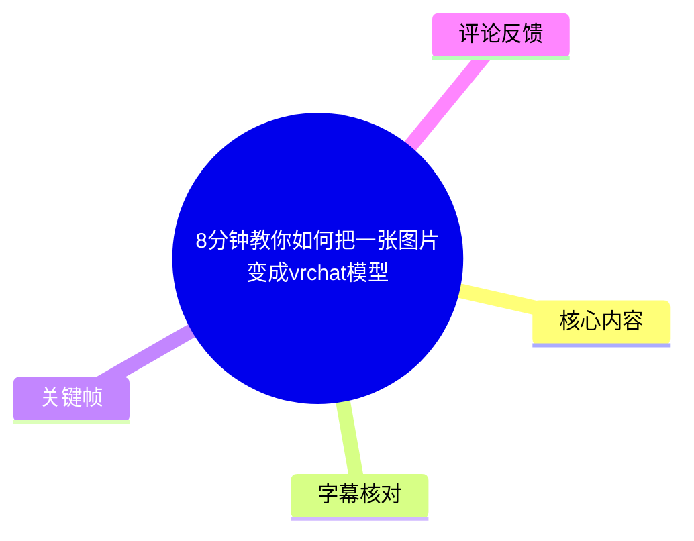
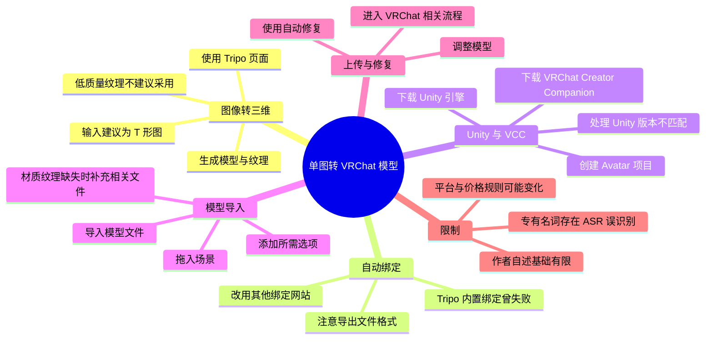
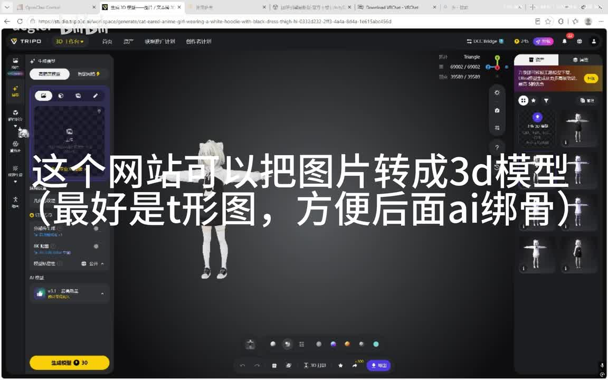
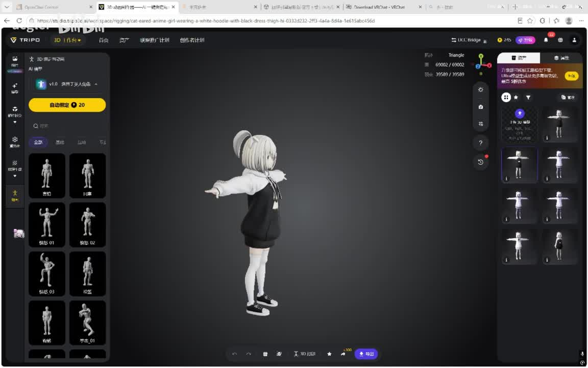
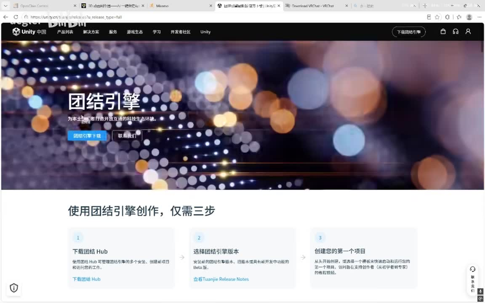
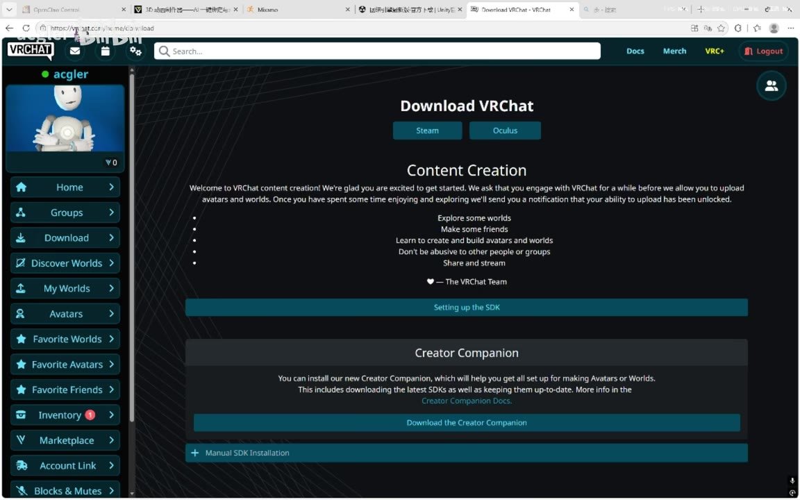

# 8分钟教你如何把一张图片变成vrchat模型

> 来源：[Bilibili 视频](https://www.bilibili.com/video/BV1wmMb6VEy7) 
> UP 主：acgler｜发布时间：2026-07-07｜视频时长：00:07:23｜分辨率：2304×1440  
> 视频简介：目前网上有很多把模型上传到 VRC 的教程，本视频是在常规上传流程前加入 AI 生成建模。

## 小结

- 视频演示了一条从**单张角色图片**到可导入 VRChat 的模型流程：先借助 Tripo 类图片转 3D 服务生成模型与纹理，再通过另一个自动绑定网站完成骨骼绑定，随后把模型放入配置好的 Unity/VRChat Creator Companion（VCC）项目中处理并上传。
- 作者明确表示该教程“只供娱乐”，本人没有 Blender 建模和 Unity 基础，主要通过询问 AI 完成操作。因此，视频适合作为**低门槛流程参考**，不应视为完整的角色建模、拓扑优化或 VRChat Avatar 制作规范。
- 输入图建议使用**T 形图（T-Pose）**。这是全流程中最重要的前置条件：角色四肢展开、主体清晰的图像更方便后续 AI 自动绑定。作者同时提醒，生成时不要使用纹理质量很差的结果。
- 视频中可见的图片转 3D 工具为 **Tripo**；其界面提供“自动绑定”能力，但作者实际操作时称该站点持续失败，遂改用其他网站。画面浏览器标签可见 **Mixamo**，可作为作者切换绑定服务的视觉线索，但具体服务功能、账号条件和格式要求仍应以当时网站页面为准。
- Unity 部分的关键难点是**版本兼容与项目迁移**：作者下载并使用名为“2022.3 RIFE C1 / CE”的 Unity 版本（ASR 对专有名词识别不稳定），导致 VCC 创建的项目无法直接打开，于是新建 Unity 项目，再将 VCC 项目中的文件复制覆盖到新项目中，并修改项目 Unity 版本。
- 最终导入模型时，若发生材质或纹理丢失，作者建议将材质相关文件一并导入。视频仅展示了在 Unity 中拖入模型、添加组件/选项、调整模型、进入 VRChat 相关上传步骤，以及末尾的“自动修复”；未完整说明每个组件名称、上传资格、性能评级和发布确认页面。
- 本视频涉及 Tripo、Mixamo、Unity、VCC 与 VRChat 平台，界面、价格、免费额度、支持的 Unity 版本和上传规则均可能随时间变化。尤其是“某模型免费、其他收费”和 Unity 版本选择，均为视频录制时的经验，不应直接视为当前规则。

## 思维导图

## 目录

- [适用范围、前置条件与风险](#适用范围前置条件与风险)
- [从图片生成 3D 模型](#从图片生成-3d-模型-001177)
- [自动绑定与模型格式](#自动绑定与模型格式-005474)
- [安装 Unity、VCC 与创建项目](#安装-unityvcc-与创建项目-012014)
- [处理 Unity 版本不兼容与项目迁移](#处理-unity-版本不兼容与项目迁移-023496)
- [导入模型、材质与场景配置](#导入模型材质与场景配置-043127)
- [调整、上传与自动修复](#调整上传与自动修复-053542)
- [完整操作清单](#完整操作清单)
- [参数、限制与时效性](#参数限制与时效性)
- [关键帧索引](#关键帧索引)
- [字幕比对](#字幕比对)
- [评论分析](#评论分析)
- [处理记录](#处理记录)

## 适用范围、前置条件与风险

### 作者声明与流程定位 [00:00:00](https://www.bilibili.com/video/BV1wmMb6VEy7?t=0)

作者在开头声明教程“只供娱乐”，并说明自己没有 Blender 建模和 Unity 基础，相关操作主要依靠询问 AI 完成。该表述意味着视频的价值在于呈现一条实际走通的低门槛路径，而不是替代官方文档或专业角色制作教程。

视频实际覆盖的链路为：

1. 准备一张人物/角色参考图；
2. 通过图片转 3D 服务生成模型；
3. 生成或补充纹理；
4. 对模型自动绑定骨骼；
5. 安装 Unity 与 VRChat Creator Companion；
6. 创建并修复/迁移 Unity 项目；
7. 导入模型及可能缺失的材质文件；
8. 在 Unity 中添加 VRChat 所需内容并调整；
9. 进入上传与自动修复步骤。

### 需要预先准备的内容

根据作者说明与画面，至少需要准备：

- 一张用于生成模型的角色图片；
- 推荐为 **T 形图 / T-Pose 图**：角色双臂横向展开，身体结构遮挡较少；
- 可访问图片转 3D、自动绑定、Unity 与 VRChat 官方页面的网络环境；
- Unity 编辑器；
- VRChat Creator Companion（VCC）；
- 已生成并导出的模型文件；
- 在材质丢失时，与模型配套的材质/纹理文件。

> 注意：视频没有列出模型的精确格式后缀、贴图格式、面数、骨骼数、贴图尺寸或 VRChat 性能等级阈值。不能据此推断任何未展示的技术参数。

## 从图片生成 3D 模型 [00:11:77](https://www.bilibili.com/video/BV1wmMb6VEy7?t=11)

作者首先打开一个图片转 3D 网站。关键帧中可辨识到页面左上角为 **TRIPO / 3D 创作**，画面中央显示一名白发、黑白服装的角色三维预览。

作者的操作与判断包括：

- 使用参考图生成三维模型；
- 推荐上传 **T 形图**，以帮助后续 AI 自动绑定；
- 生成模型时不要选择纹理质量很差的结果；
- 在后续页面上传参考图以生成纹理；
- 作者称“1E2.5 模型是免费的，其他都要收费”。由于 ASR 对该模型名称的识别不可靠，文中保留为 ASR 原始近似转写，不将其扩展为确定的产品型号。

> 图：该帧展示 Tripo 的 3D 创作界面、角色三维预览及右侧候选姿态/模型区域，是确认视频第一阶段使用图片转 3D 工具、且推荐 T-Pose 输入的重要画面依据。

### 输入图为什么建议为 T-Pose

作者只给出“方便后面 AI 绑骨”的经验判断，没有展开原理。结合视频呈现的自动绑定流程，可将其理解为一项操作条件：当双臂、腿部与躯干之间边界更清楚时，自动绑定服务更容易识别四肢位置。

但这不意味着任意 T-Pose 图片都能保证成功。视频未验证以下情况：

- 宽大衣物、长发或披风遮挡关节；
- 角色侧身、透视过强；
- 手臂与身体贴合；
- 复杂多层服装；
- 图片只有正面、背面细节缺失；
- 原图版权和角色授权问题。

### 生成纹理与收费信息 [00:26:01](https://www.bilibili.com/video/BV1wmMb6VEy7?t=26)

作者提到一个被 ASR 转为“1E2.5”的模型免费，其余模型收费；随后展示上传参考图以生成纹理的步骤。该信息属于录制时的网站套餐/模型策略，存在较强时效性。

建议实际操作时逐项确认：

- 当前所选生成模型是否免费；
- 免费额度是否受账户、活动或地区限制；
- 生成模型是否允许下载；
- 导出的网格、贴图与骨骼格式是否满足后续绑定站和 Unity；
- 生成结果是否存在明显纹理破损、穿模或比例异常。

## 自动绑定与模型格式 [00:54:74](https://www.bilibili.com/video/BV1wmMb6VEy7?t=54)

作者说明，图片转 3D 网站本身也可以进行自动绑定，但自己持续操作失败，因此转至“其他网站”完成绑定。接着展示绑定网站页面，并说明在右侧上传模型后按引导操作即可。

> 图：该帧可见 Tripo 左侧“自动绑定”入口与黄色“自动绑定”按钮，右侧/中部展示角色及多种姿态缩略图。它说明原图片转 3D 服务确有绑定入口，也佐证了作者“该站可绑骨、但自己未成功”的流程分歧。

### 作者明确提示：关注文件格式 [01:06:25](https://www.bilibili.com/video/BV1wmMb6VEy7?t=66)

作者在上传模型后专门提示“注意模型文件的格式要求”，并在导出时展示可以更改格式的入口。

可确定的操作原则是：

1. 先查看自动绑定网站的上传格式要求；
2. 回到模型生成服务的导出页面；
3. 按绑定网站需求选择对应格式；
4. 再上传模型并跟随网站引导；
5. 完成绑定后，保留原模型和带骨骼的导出版本，避免覆盖唯一源文件。

视频没有说清具体要求的是 FBX、OBJ、GLB、GLTF 还是其他格式，也没有说明是否需包含纹理、是否必须三角面、是否要求特定坐标轴。因此不应把“可改格式”误写为某个确定格式。

### 可见网站线索与不确定性

在展示后续网页的关键帧中，浏览器标签可见 “Mixamo”。这与“切换到其他网站绑定”的口述在上下文上相符。但：

- ASR 没有清晰识别该网站名称；
- 视频没有在可提取字幕中逐字说明具体平台；
- 因此，**Mixamo 仅作为关键帧可见页面线索记录**，不能据此补充视频未展示的账户要求、上传限制或授权条款。

## 安装 Unity、VCC 与创建项目 [01:20:14](https://www.bilibili.com/video/BV1wmMb6VEy7?t=80)

在完成建模/绑定流程说明后，作者进入 Unity 与 VRChat 工具配置环节。

### 下载 Unity 引擎 [01:28:83](https://www.bilibili.com/video/BV1wmMb6VEy7?t=88)

作者首先进入 Unity 网站下载引擎，并提示向下找到一个被 ASR 识别为“2022.3 RIFE C1”的版本；紧接着又说“最好下载 2022.3 RIFE 版本”。其中 `RIFE C1`、`CE` 等字串明显可能存在语音识别偏差或屏幕文字识读偏差，无法据提供素材可靠还原为正式 Unity 版本名称。

> 图：该帧展示的是 Unity 中国页面，页面主标题为“团结引擎”，并带有“团结引擎下载”入口。它说明作者确实从 Unity 相关下载页开始准备编辑器，但不能仅凭该画面确认最终安装包的精确版本号。

作者还提到：下载包后缀带“CE”的版本“好像代表中文版，但也能用”。这是作者带有不确定语气的个人判断，不是经过验证的官方定义。

### 下载 VRChat Creator Companion [01:56:76](https://www.bilibili.com/video/BV1wmMb6VEy7?t=116)

接着作者前往 VRChat 官网下载页面，从 Creator Companion 区域下载 VCC。

> 图：该帧清晰显示 VRChat 的 “Download VRChat” 页面、“Content Creation” 说明和 “Creator Companion” 区块，以及 “Download the Creator Companion” 按钮。这是视频中 VCC 获取来源的直接画面依据。

画面中的英文还提示：VRChat 要求用户先花时间体验和探索，之后才可能解锁上传 Avatar 与 World 的能力。视频未讲解账号等级、验证状态或上传资格判定机制，但该页面提示意味着“完成本地模型制作”不等于“账号一定可以上传”。

### 在 VCC 中创建项目 [02:14:00](https://www.bilibili.com/video/BV1wmMb6VEy7?t=134)

作者打开已下载的 VCC 后，操作顺序为：

1. 开头选择 Unity 版本的页面直接跳过；
2. 进入主界面后点击右上角“创建”；
3. 页面提供四项选择时，选择第二项；
4. 点击创建。

视频没有在 ASR 中识别出第二项的完整名称；结合主题，它很可能与 Avatar 项目有关，但为避免把推断当事实，本文仅记录为“第二项”。

## 处理 Unity 版本不兼容与项目迁移 [02:34:96](https://www.bilibili.com/video/BV1wmMb6VEy7?t=154)

这是全片最需要注意的工程问题之一。

作者称：由于使用的是先前下载的“2022.3 RIFE C1”版本，VCC 创建的项目“无法直接打开”。为解决此问题，作者没有直接在 VCC 里继续处理，而是采用新建 Unity 项目、复制 VCC 项目文件的方式迁移。

### 视频展示的迁移操作

按 ASR 时间顺序，操作为：

1. **[02:43:46](https://www.bilibili.com/video/BV1wmMb6VEy7?t=163)** 打开一开始下载的 Unity 引擎；
2. **[02:47:59](https://www.bilibili.com/video/BV1wmMb6VEy7?t=167)** 新建一个项目；
3. **[02:54:73](https://www.bilibili.com/video/BV1wmMb6VEy7?t=174)** 创建即可，“不用打开”；
4. **[03:03:67](https://www.bilibili.com/video/BV1wmMb6VEy7?t=183)** 打开新建项目对应文件夹；
5. **[03:11:30](https://www.bilibili.com/video/BV1wmMb6VEy7?t=191)** 打开 VCC 创建项目的文件夹；
6. **[03:24:74](https://www.bilibili.com/video/BV1wmMb6VEy7?t=204)** 执行“全部附近”的操作。这里 ASR 语义不清，结合下一步更可能是在进行全选/复制相关操作，但视频字幕无法可靠确认具体文字；
7. **[03:36:07](https://www.bilibili.com/video/BV1wmMb6VEy7?t=216)** 将内容“盖到 Unity 项目上”，即以 VCC 项目文件覆盖/复制至新建 Unity 项目；
8. **[04:02:12](https://www.bilibili.com/video/BV1wmMb6VEy7?t=242)** 将版本改成下载好的“2022.3 RIF E C1”。

### 风险提示

“复制覆盖项目文件”属于可能影响工程状态的操作。视频没有说明覆盖了哪些目录，也未展示备份过程。因此执行前应至少保留：

- VCC 原始创建项目的完整副本；
- 新建 Unity 项目的完整副本；
- 导入前的模型与纹理文件；
- 记录所用 Unity、VCC、SDK 的版本。

不要把视频中的临时兼容方案视为官方推荐迁移方法。热评中也有观众提出应从 VCC 相关页面获取 Unity，而不是自行寻找所谓“C1 特供版”；详见后文评论分析。

## 导入模型、材质与场景配置 [04:31:27](https://www.bilibili.com/video/BV1wmMb6VEy7?t=271)

在 Unity 项目加载完成后，作者说明当界面显示“VRChat AID”时就对了。这里的 `AID` 可能是 ASR 对界面名称的误识别；视频提供的文本不足以确认它究竟是 SDK、菜单项、项目状态还是其他字段，故保留原始近似转写。

### 导入模型 [04:31:27](https://www.bilibili.com/video/BV1wmMb6VEy7?t=271)

作者操作顺序如下：

1. 在某个位置右键；
2. 点击对应选项；
3. 将已经生成并绑定的模型导入项目；
4. 若出现材质纹理丢失，则将材质文件一起导入；
5. 将模型“拖到左边”，即拖入 Unity 场景区域。

### 材质纹理丢失的处理 [04:37:82](https://www.bilibili.com/video/BV1wmMb6VEy7?t=277)

作者给出的排障建议非常直接：如果模型材质或纹理丢失，还要把材质文件导入。

这条建议至少包含两个实际含义：

- 不应只保存网格模型文件；
- 导入 Unity 时需要保留并一并导入关联资源。

视频未展示如何手动重新关联 Shader、贴图槽位、材质球或 UV，也没有说明生成站导出文件的目录结构。若导入后仍是白模、粉色材质或贴图错位，则已超出本视频可验证范围，需要查阅对应工具或 VRChat SDK 文档。

### 添加选项/组件 [05:00:38](https://www.bilibili.com/video/BV1wmMb6VEy7?t=300)

作者说“点右边的按钮，搜索这个选项添加”。ASR 未识别出被搜索的选项名称，画面素材也未提供该步骤对应的清晰关键帧，因此不能确定其为哪一个组件或菜单命令。

可以确认的仅是：

- 作者在模型拖入场景后，通过右侧面板的按钮进行搜索；
- 搜索到目标选项后进行添加；
- 该步骤是继续使模型适配 VRChat 工作流的一环。

## 调整、上传与自动修复 [05:35:42](https://www.bilibili.com/video/BV1wmMb6VEy7?t=335)

作者表示右侧面板可以调整模型，但不逐项赘述；遇到问题可以留言评论区。视频没有细讲具体可调项目，因此不能将其泛化为完整的骨骼、表情、PhysBone、碰撞体、视角、动画控制器或性能优化教程。

### 进入 VRChat 相关步骤 [05:57:88](https://www.bilibili.com/video/BV1wmMb6VEy7?t=357)

作者在约 05:57 说“然后点击 SDA”，约 06:04 说“VRChat”。`SDA` 显然可能是 ASR 对某个 SDK/菜单文字的误识别，无法依据素材可靠确定。可确认的是，此处开始从 Unity 内的模型配置转向 VRChat 相关的后续操作。

在 06:05 至 07:05 之间，ASR 未检出有效语音，但视频仍在继续操作。根据诊断数据，这段约 60.24 秒是全片最大语音空白区，因此不能据 ASR 推断该期间的具体按钮、参数或上传结果。

### 自动修复 [07:05:32](https://www.bilibili.com/video/BV1wmMb6VEy7?t=425)

视频最后一句为“直接自动修复”。这表明作者在临近结尾时使用了界面提供的自动修复功能处理问题。

需要注意：

- 视频没有说明自动修复修复的具体错误类型；
- 未展示修复前后的完整检查报告；
- 未展示最终上传成功页、Avatar 在 VRChat 内的实际表现或性能评级；
- 因此，不能把“点击自动修复”理解为所有模型问题均能被自动解决。

## 完整操作清单

以下清单严格按视频展示顺序整理，并将未明确项标为“需以页面实际提示为准”。

1. 准备角色参考图，优先使用 T-Pose 图。  
2. 打开 Tripo 类图片转 3D 网站。  
3. 上传图片，生成三维模型。  
4. 选择纹理质量可接受的生成结果，避免低质量纹理。  
5. 上传参考图并生成纹理。  
6. 尝试在生成站内进行自动绑定；若失败，切换到另一个绑定网站。  
7. 在绑定网站上传模型，按网站向导执行。  
8. 先核对绑定网站支持的模型格式；必要时在模型导出页面修改格式。  
9. 下载 Unity 编辑器。视频提及“2022.3”系列，但正式版本名称受 ASR 误识别影响，必须以 VCC/VRChat 当前官方要求为准。  
10. 前往 VRChat 下载页，下载 VRChat Creator Companion。  
11. 在 VCC 中创建项目：跳过初始 Unity 版本选择，点击创建，在四个选项中选择作者所选的第二项后创建。  
12. 若项目因 Unity 版本问题无法直接打开：  
    - 打开下载的 Unity；  
    - 新建项目但先不打开；  
    - 打开新项目文件夹与 VCC 项目文件夹；  
    - 复制/覆盖文件。  
    此步骤有工程风险，务必先备份。  
13. 将项目 Unity 版本切换至实际安装、且与 VRChat/VCC 兼容的版本。  
14. 在 Unity 项目中通过右键菜单导入模型。  
15. 若材质/纹理丢失，追加导入材质与纹理相关文件。  
16. 将模型拖入场景。  
17. 在右侧面板通过搜索添加视频所需选项；具体名称未被可靠识别。  
18. 在右侧面板调整模型。  
19. 进入 VRChat 相关 SDK/上传步骤；视频中的具体入口文字未被可靠识别。  
20. 出现可自动处理的问题时，使用“自动修复”。  
21. 在实际发布前，另行核对账号上传资格、SDK 版本、模型性能与 VRChat 当前规则。

## 参数、限制与时效性

### 视频中出现或可确认的参数

| 项目 | 视频信息 | 可靠性与说明 |
| --- | --- | --- |
| 视频时长 | 443 秒 | 元数据明确给出。 |
| 视频分辨率 | 2304×1440 | 元数据明确给出。 |
| 参考图姿态 | 建议 T 形图 | 作者明确口述。 |
| 图片转模型平台 | Tripo | 关键帧界面可见。 |
| 自动绑定 | 原站可尝试，但作者失败后换站 | 作者明确口述。 |
| Unity 大版本 | 2022.3 | ASR 多次稳定出现“2022.3”，但后续完整字符串不可靠。 |
| Unity 后缀/版本名 | “RIFE C1”“CE”等 | ASR 可能误识别，不能作为安装依据。 |
| 免费模型名称 | “1E2.5” | ASR 近似转写，不能确认产品正式名。 |
| 自动修复 | 最后使用 | 作者明确口述，但未说明具体修复项。 |

### 主要限制

1. **作者经验边界**：作者自述缺乏 Blender 与 Unity 基础，视频是实践路径分享而非权威技术规范。  
2. **字幕覆盖不足**：本次 ASR 总语音覆盖约 108 秒，占 442.55 秒总时长约 24.4%；大量屏幕操作没有语音说明。  
3. **专有名词不稳定**：Unity 版本、模型名称和后续 VRChat 入口名称存在明显 ASR 误识别。  
4. **未覆盖完整 Avatar 制作项**：没有完整讲解表情、动画、物理系统、视角、碰撞、性能优化、发布权限与测试流程。  
5. **生成质量不可保证**：单图生成模型可能出现比例、拓扑、背面、纹理和骨骼问题；视频仅提供“避免低质量纹理”“材质丢失则补导入”的有限排障。  
6. **版权与使用权未讨论**：视频未说明参考图、生成模型、第三方网站资产与 VRChat 发布的版权/授权要求。实际使用者应自行确认。  

### 时效性判断

本视频发布时间为 2026-07-07，整理时抓取时间为 2026-07-15。以下内容需优先以当前官方页面为准：

- Tripo 的免费/收费模型、代币及导出政策；
- 自动绑定服务支持的文件格式和使用条款；
- Unity 版本与下载方式；
- VRChat Creator Companion 的项目模板；
- VRChat SDK、上传资格、账户限制和模型校验规则；
- 自动修复功能所处理的具体问题与当前行为。

## 关键帧索引

| 关键帧 | 对应阶段 | 图片价值 |
| --- | --- | --- |
|  | 图片转 3D，约 00:13 | 可见 TRIPO/3D 创作界面、角色模型预览和 T-Pose 相关字幕，是确认首个工具与输入姿势建议的关键依据。 |
|  | 自动绑定，约 00:44 | 可见自动绑定按钮、预设姿态和模型预览，说明原网站具备绑定入口，也解释作者为什么会先在该网站尝试。 |
|  | Unity 安装，约 01:28 | 展示 Unity 中国页面及团结引擎下载入口，用于记录作者的引擎获取环节。 |
|  | VCC 下载，约 01:56 | 清楚展示 VRChat 下载页 Creator Companion 区域，是 VCC 获取来源及上传资格提示的直接视觉证据。 |

> 其余关键帧路径虽已生成，但未提供对应画面内容描述。为避免臆测，正文仅选用能够从提供画面中明确辨识、且与核心步骤直接相关的四帧。

## 字幕比对

| 字幕来源 | 完整性 | 专有名词 | 时间轴 | 主要问题 |
| --- | --- | --- | --- | --- |
| Bilibili 站内字幕 | 无可用字幕 | 无法评估 | 无法使用 | 字幕工具请求报错：`Invalid URL`；素材明确标注“未提供可用站内字幕”。 |
| 本次 ASR 字幕 | 有 41 段语句；语音覆盖约 108 秒，占总时长约 24.4% | 一般偏低 | 可直接使用；提供毫秒级 SRT 起止时间 | 多处词语及专有名词误识别；存在 11 个较大无语音间隔，最大间隔约 60.24 秒。 |

### 最终字幕选择

本次整理采用**本次 ASR 的带时间戳 SRT**作为唯一可用时间轴依据。所有章节链接均优先按照 SRT 起始时间换算为秒数生成，未依据文字顺序猜测时间位置。

### 依据关键帧与上下文进行的校正/保留

| ASR 转写 | 处理方式 | 依据与说明 |
| --- | --- | --- |
| “这个罗站” | 表述为“图片转 3D 网站/Tripo” | 关键帧可见 `TRIPO` 标识。 |
| “T形图” | 规范为“T 形图（T-Pose）” | 关键帧字幕与角色张臂姿态共同支持。 |
| “绑鼓 / 绑古” | 规范为“绑骨/自动绑定” | 上下文为模型 Rigging，关键帧有“自动绑定”按钮。 |
| “文理” | 规范为“纹理” | 上下文为上传参考图生成 texture。 |
| “RIFE C1 / RIF E / CE” | 保留为 ASR 近似转写，不断言正式名称 | 无站内字幕，且画面不足以可靠确认完整正式版本字符串。 |
| “VRChat AID” | 保留近似转写，不扩展 | 无法确认实际界面术语。 |
| “SDA” | 保留近似转写，不强行校正为 SDK | 语境可能相关，但提供素材不足以做确定校正。 |
| “全部附近” | 标记为语义不清 | 推测涉及全选/复制，但不将推测写为视频事实。 |

## 评论分析

仅处理本次可获取的热评前三条；评论均为用户观点或经验补充，不视为已验证事实。

### 1. 水綾｜10 赞

> “好家伙，这不是我前公司的产品吗，现在居然做起来了”

- **观点概括**：评论者称视频所用产品曾属于其前公司，并对产品目前的发展表示惊讶。
- **可提供的信息**：侧面反映评论者可能与该产品有从业关联。
- **可信度与限制**：未说明具体产品名称、任职时间、职位或可核验来源，也没有提供与教程操作直接相关的技术建议。因此仅可作为个人经历陈述，不能据此确认产品所属关系或商业发展情况。

### 2. 李蔺昊｜3 赞

> “其实下载unity和22.3.22f1那一步，不要自己去找，开加速器，在vrchat的vcc下载界面信息那里，那个sdk按钮，点击打开链接，网页里有个unity蓝色的，点击打开网站，然后在里面下载，不要c1特供版”

- **观点概括**：评论者建议不要自行寻找 Unity 版本，而应在 VRChat VCC 下载页面的信息/SDK 链接中进入对应网页下载；并反对使用所谓“C1 特供版”。
- **对视频的补充**：这直接回应了视频中因 Unity 版本不兼容而需要复制覆盖项目文件的难点，提出了优先从 VRChat 相关官方链路获取 Unity 的替代方案。
- **可信度与限制**：该建议具有明确操作路径，也与“版本兼容应优先遵循 VRChat 当前要求”的原则一致；但它仍是单条评论，且未附官方链接、截图或版本兼容结果。实际操作时应在 VRChat 官方 VCC/文档页面核对当前推荐版本。

### 3. acgler｜5 赞

> “还有就是我想上lv6[doge]”

- **观点概括**：UP 主表达了希望达到“Lv6”的愿望，语气轻松。
- **可提供的信息**：可能与 VRChat 平台账号等级或上传权限有关，但评论没有展开。
- **可信度与限制**：该评论不构成技术教程内容，也不能用于推断 VRChat 的等级机制、当前账号状态或上传资格。它只说明作者对某一等级目标有所期待。

## 处理记录

- **Worker ID**：worker-mrj0wjed-b0c290ad
- **任务模型**：gpt-5.6-terra
- **ASR 模型与运行参数**：medium；语言 `zh`；语言置信度 `0.9951171875`；CUDA；`float16`；音频时长 `442.549125` 秒。
- **使用的素材工具结果**：
  - 视频素材已生成合并视频、WAV 音频、12 张关键帧、ASR SRT、带时间文本与 ASR JSON。
  - 站内字幕抓取工具执行失败，错误为：`subtitles: Tool process exited with code 1` / `Invalid URL`。
  - 评论素材成功获取，限制为热评前三条。
- **字幕选择**：站内字幕不可用；本次 ASR 已执行且带毫秒级时间戳，因此采用 `asr/transcript.srt` 作为时间轴唯一依据。对明显误识别词仅在有关键帧或明确上下文支持时进行谨慎规范化，其余保留不确定性。
- **关键帧选择依据**：从提供画面中选择能明确验证核心工具与步骤的 `frame-001.jpg`（Tripo 建模）、`frame-002.jpg`（自动绑定）、`frame-003.jpg`（Unity 下载页）、`frame-004.jpg`（VCC 下载页）。未使用其余帧，原因是未提供可供可靠判读的画面描述，避免编造。
- **缓存清理**：未提供缓存清理执行结果或日志；本记录不宣称已完成缓存清理。
- **未解决问题**：
  - “2022.3 RIFE C1 / CE”对应的正式 Unity 版本名称无法由现有 ASR 与关键帧可靠确认；
  - “1E2.5”免费模型名称无法确认；
  - “VRChat AID”“SDA”等界面/功能名称可能为 ASR 误识别；
  - 视频大段为无语音屏幕操作，无法从字幕恢复完整按钮路径与全部参数；
  - 未提供最终 VRChat 上传成功、Avatar 实机表现及性能检测的直接证据。
