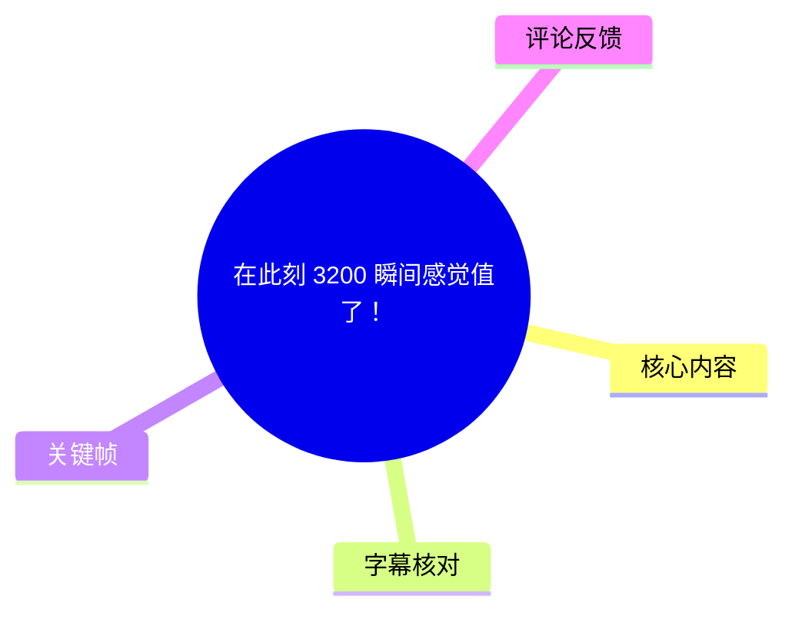
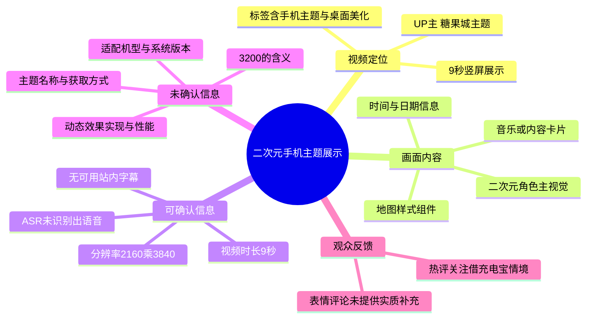
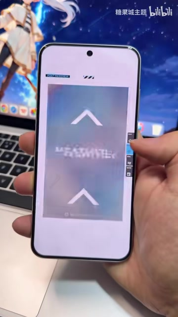
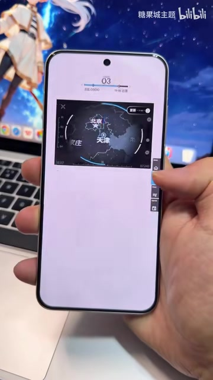

# 在此刻 3200 瞬间感觉值了！

## 小结

视频是糖果城主题发布的一段 9 秒竖屏手机桌面展示。画面核心是一台手机上的二次元风格主题界面：顶部包含时间、日期信息，中部为角色视觉主体，下方配置音乐/内容卡片；随后切换到带箭头图形的页面和地图样式组件页面。

UP 主在简介中以“主题商店做不到的，我全包了！”描述其主题能力，并邀请观众点赞、关注以获取更多手机主题。结合标签中的“小米”“手机主题”“桌面美化”等信息，可以确认该视频面向手机桌面美化兴趣者；但视频本身没有展示安装入口、适配机型、主题名称、下载链接、价格或授权信息，不能据此推导具体获取方式。

标题中的“3200”是原始标题的一部分，但画面与字幕素材均未解释它代表价格、型号、分辨率或其他含义，因此不能将其作为确定参数记录。视频亦未给出主题所用软件、系统版本、耗电、动态效果机制或兼容性数据。

本次 ASR 检测到音频文件时长约 8.27 秒，但没有识别到任何语音片段；站内也未提供可用字幕。故本文对画面内容的整理以关键帧和元数据为依据，所有无法从画面直接确认的主题配置、操作步骤与技术实现均明确保留为未知。

视频数据抓取时显示播放量 202,237、点赞 4,623、收藏 3,221、投币 740、分享 154、评论 552。这些数值为抓取快照，后续会随平台实时变化，不应视为恒定统计。

## 思维导图

## 目录

- [视频背景与素材边界](#视频背景与素材边界-000000)
- [桌面主界面展示](#桌面主界面展示-000000)
- [组件切换与地图页面](#组件切换与地图页面-000000)
- [可复用的桌面设计观察](#可复用的桌面设计观察-000000)
- [参数、限制与时效性](#参数限制与时效性-000000)
- [字幕比对](#字幕比对)
- [评论分析](#评论分析)
- [处理记录](#处理记录)

## 视频背景与素材边界 [00:00:00](https://www.bilibili.com/video/BV1wr5r64EAu?t=0)

视频标题为“在此刻 3200 瞬间感觉值了！”，由 **糖果城主题**发布，归入收藏集 **AIcode**。元数据标记的视频总时长为 **9 秒**，画幅为 **2160 × 3840** 的竖屏比例，适合以手机全屏方式展示桌面视觉效果。

UP 主描述原文为：

> 主题商店做不到的，我全包了！  
> 喜欢就点个赞吧！  
> 关注我用上更好看的手机主题 ٩(❛ัᴗ❛ั⁎）

这段文字属于创作者的宣传性表述，可用于理解其内容定位，但不能直接证明主题具备所有主题商店不具备的功能。标签包含“壁纸”“软件”“二次元”“小米”“手机主题”“桌面美化”等，说明视频与手机主题/壁纸展示高度相关；不过标签不能替代设备型号、ROM 版本或应用清单。

由于没有可用的逐句字幕时间轴，且 ASR 没有输出语音分段，后续章节统一链接至视频起点，而不虚构秒级画面出现时间。关键帧文件按素材提供的序号展示画面序列，但素材未提供每张帧对应的精确采样秒数。

## 桌面主界面展示 [00:00:00](https://www.bilibili.com/video/BV1wr5r64EAu?t=0)

视频前段展示手机主屏。可直接观察到的界面元素包括：

1. **二次元角色主视觉**：屏幕中央为高饱和蓝、紫、粉色调的角色插画，是整套桌面的主要视觉焦点。
2. **时间信息**：画面顶部显示时间“18:41”。
3. **日期信息**：右上区域可见“2026”“MAY. 14TH”等英文日期样式文字；这只能说明演示画面的日期组件如此呈现，不应将其理解为视频实际拍摄日期。
4. **左侧大型装饰文字**：存在竖向、浅色的大字号英文/字母装饰，但因画面清晰度与遮挡原因，无法可靠转写全部文字。
5. **底部内容卡片**：下方有一张横向卡片，能辨认出“Rage Your Dream”字样及部分附加文本；它看起来像音乐播放或媒体内容模块，但视频未展示其实际交互与数据来源。
6. **黑色“X”图形**：屏幕左下存在醒目的黑色叉形图案，承担版式装饰和视觉平衡作用。

> 图：该帧记录主屏的整体层级：顶部信息区、中部角色壁纸、左侧竖向文字与底部卡片共存。它是判断视频确实在展示手机主题布局、而非仅展示静态壁纸的重要画面依据。

> 图：该帧比前一帧更清楚地展示“18:41”、日期区域、角色插画和底部卡片之间的相对位置，说明该设计强调信息组件与二次元视觉内容的整合。

从视觉组织方式看，主题并非只替换一张壁纸：至少画面中同时存在时钟、日期、装饰性文字和底部内容区域。这里的结论仅限于“演示画面包含这些元素”；并不能确认它们分别由桌面小组件、主题包、第三方启动器、图片合成，还是其他工具实现。

## 组件切换与地图页面 [00:00:00](https://www.bilibili.com/video/BV1wr5r64EAu?t=0)

随后画面从主屏状态切换到其他页面/组件展示状态。由于没有语音说明与可用字幕，以下仅记录可见效果，不将其扩展为明确的操作教学。

> 图：画面中央出现上下两个箭头样式图形，中间文字因失焦无法可靠辨认。该帧的价值在于证明视频并不只停留在单一主屏，而是展示了进一步的页面或组件状态；无法据此确认其是滑动提示、动画页、控制页还是加载过渡页。

> 图：画面中部出现深色地图风格卡片，可辨认“北京”“天津”等地点文字，并有环形/弧线式图形元素。它展示了主题内存在信息面板式的视觉设计，但视频没有说明数据是否实时、地图是否可操作，也没有给出该组件的名称。

### 基于画面的实际展示顺序

可整理出的展示流程只有以下层级：

1. 呈现带二次元角色壁纸、时钟、日期和底部卡片的主界面。
2. 画面切至包含上下箭头图形的页面或过渡状态。
3. 展示带地图视觉元素的信息卡片/组件。

上述是**演示顺序**，不是可复现的安装步骤。视频没有展示主题下载、导入、应用、授权、部件添加、图标替换、锁屏配置或返回主屏的操作过程，因此不应据此编写虚构的设置教程。

## 可复用的桌面设计观察 [00:00:00](https://www.bilibili.com/video/BV1wr5r64EAu?t=0)

尽管视频没有给出制作方法，仍可从画面中提炼出有限的桌面设计经验。这些是对可见版式的观察，不是 UP 主明确教学的技术规范。

### 1. 用高对比主视觉建立识别点

角色画面使用蓝紫色为主、辅以红粉和浅色高光。与浅色底部卡片、黑色“X”装饰形成对比，使中央角色成为第一视觉焦点。对于同类主题，壁纸主体应避开时钟、通知或常驻组件的文字区域，避免信息可读性被画面干扰。

### 2. 让信息组件服从统一视觉语言

时钟、日期、左侧纵向装饰和底部横向卡片使用几何化、工业/科技感较强的排布，与角色插画形成“二次元 + 机械/UI”混合风格。视频中能观察到的重点并不是单个组件的功能，而是各区域在字体、留白、线条和配色上的共同风格。

### 3. 用局部信息面板增加主题层次

地图样式卡片使用深色底图、浅色地点文字与蓝色圆弧线条。即使无法确认其具体功能，这种做法也说明桌面设计可以在主视觉之外加入“数据面板”式组件，形成信息密度更高的界面观感。

### 4. 复刻时必须补齐的验证环节

若观众希望自行实现类似效果，视频没有提供以下关键条件，需要自行向作者或主题来源核实：

- 主题或壁纸的准确名称与下载渠道；
- 对应手机品牌、机型、系统版本及桌面启动器；
- 时钟、日期、音乐卡片、地图卡片分别使用的组件工具；
- 是否需要额外权限，例如通知读取、媒体控制、位置或网络权限；
- 动态效果是否会造成耗电、卡顿、锁屏异常或桌面重载；
- 所涉角色图像、字体和音乐内容是否具有可再分发授权。

## 参数、限制与时效性 [00:00:00](https://www.bilibili.com/video/BV1wr5r64EAu?t=0)

### 可确认参数

| 项目 | 内容 | 依据 |
| --- | --- | --- |
| 视频时长 | 9 秒 | 视频元数据 |
| 视频画幅 | 2160 × 3840，竖屏 | 视频元数据 |
| ASR 音频分析时长 | 8.2663125 秒 | ASR 诊断 |
| ASR 识别语言 | 英语（自动判断概率 0.5859375） | ASR 诊断 |
| 识别出的语音段 | 0 段 | ASR 诊断 |
| 视频标签 | 含“小米”“手机主题”“桌面美化”等 | 页面元数据 |
| 数据抓取时间 | 2026-07-16 | 元数据 `fetchedAt` |

### 不能确认的参数

以下信息没有出现在可用字幕、ASR 文本或可辨认画面中：

- “3200”的具体指代与单位；
- 手机品牌、型号、屏幕尺寸、刷新率；
- 主题包名称、版本号、作者授权与价格；
- 桌面启动器、组件工具、图标包或字体名称；
- 地图组件的数据源、刷新频率与定位权限；
- 音乐卡片是否可播放、曲目是否完整、其播放量“96”对应何种指标；
- 主题安装与卸载步骤；
- 系统兼容性、性能开销和续航影响。

### 时效性提醒

1. 视频发布页的播放、点赞、收藏、投币、分享和评论数均为抓取时快照，后续会变化。
2. 日期组件中展示的“2026 / MAY. 14TH”是桌面演示内容，不应当用来推定视频的拍摄时间。
3. 主题下载链接、主题商店规则、系统主题兼容性及第三方组件功能均可能随版本更新而变化；视频没有给出可供验证的链接或版本号。
4. 元数据中的发布时间可记录为 2026-05-16，但不应与画面内的日期组件混为一谈。

## 字幕比对

| 字幕来源 | 完整性 | 专有名词 | 时间轴 | 主要问题 |
| --- | --- | --- | --- | --- |
| Bilibili 站内字幕 | 无可用字幕 | 无法核验 | 无 | 素材明确标注“未提供可用站内字幕” |
| 本次 ASR 字幕 | 空 | 无法识别 | 无有效分段 | ASR 输出 `segments` 为空，语音覆盖率为 0；未识别到任何可转写语音 |

本次 ASR 使用的识别模型为 `medium`，自动语言判断为英语，置信概率为 `0.5859375`；但最终没有识别到语音片段，诊断显示：

- `sentenceCount: 0`
- `speechSeconds: 0`
- `speechCoverage: 0`
- `firstSpeechAt: null`
- `lastSpeechAt: null`

诊断提示“未识别到语音片段”，但素材中**没有** `noAudioStream=true` 标记。因此，不能断言源视频没有音轨；准确表述应为：已提取到约 8.27 秒音频进行 ASR，但未得到可用的语音转写结果。音轨可能是无语音内容、音乐/环境声，或因音质、混音、语言识别不确定性而未被识别，现有素材无法进一步确认。

最终未采用任何字幕文本作为事实来源，正文使用以下证据层级：

1. 视频元数据与 UP 主公开简介；
2. 已提供的关键帧画面；
3. ASR 的“无可用语音文本”诊断结果。

通过画面可校正/确认的文字仅包括“18:41”“2026”“MAY. 14TH”“Rage Your Dream”，以及地图卡片中的“北京”“天津”等可辨认字样；模糊画面中的其他英文、图标含义和功能名称均未作强行转写。

## 评论分析

仅获取到 2 条热评，少于请求上限“前三条”；以下不补造第 3 条评论，也不将评论内容视作已验证事实。

| 排名（按已获取顺序） | 用户 | 点赞 | 评论内容 | 分析 |
| --- | --- | ---: | --- | --- |
| 1 | 简菱 | 801 | “这种借充电宝最狠了” | 这是一条带调侃性质的评论，可能将视频画面或主题效果联想到“借充电宝”的社交场景。评论未解释具体关联，也没有提供主题功能、价格、获取渠道或适配性的可验证信息。 |
| 2 | AAA春不老批发 | 177 | “[吃瓜]” | 纯表情反馈，表达围观或玩笑式情绪，不包含可用于补充视频事实的信息。 |

评论区可观察到的只是观众对短视频展示的娱乐化反应。尤其第一条热评点赞较高，说明该联想获得部分用户共鸣；但它不是对主题本身功能、技术实现或购买价值的证据。

## 处理记录

- Worker ID：`worker-mrj0wjed-b0c290ad`
- 生成模型：`gpt-5.6-terra`
- ASR 模型：`medium`，CUDA / `float16`，自动语言检测。
- 使用的素材工具输出：合并视频 `merged.mp4`、音频 `audio/audio.wav`、关键帧目录 `frames/`、ASR 结果 `asr/asr-result.json`、ASR SRT `asr/transcript.srt`、评论文件 `comments/comments.json`、视频元数据与封面素材。
- 字幕检查与选择：已检查站内字幕与本次 ASR。站内字幕不可用；本次 ASR 无识别文本及有效时间段；最终不采用字幕，改以元数据和关键帧进行多模态画面整理。
- 时间轴依据：无站内 SRT 分段，ASR 也没有输出带时间戳的语音段；为避免按文字顺序虚构时间位置，章节链接统一指向可验证的视频起点 `t=0`。
- 关键帧选择依据：选用 `frame-001.jpg`、`frame-002.jpg` 说明主屏构图、时间日期、角色视觉与底部卡片；选用 `frame-003.jpg` 证明存在后续页面/过渡状态；选用 `frame-004.jpg` 说明地图风格组件画面。其余帧未在当前可见素材中获得可可靠辨认的额外事实，故未强行引用。
- 评论处理范围：仅分析已获取的 2 条热评，不补造缺失的第 3 条。
- 缓存清理：素材未提供缓存清理执行日志或结果，无法确认是否已清理；本文不宣称已完成清理。
- 未解决问题：主题名称、安装方式、软件与系统版本、设备型号、地图组件功能、音乐卡片数据源、“3200”含义及性能/授权信息均未在现有素材中得到证实。
