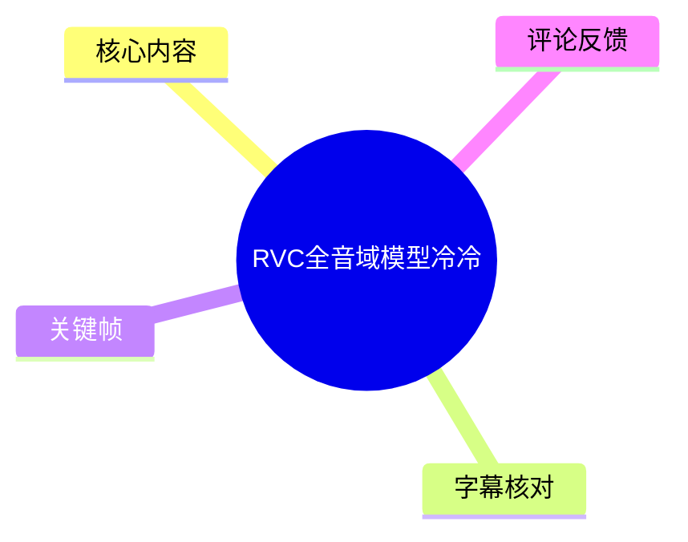
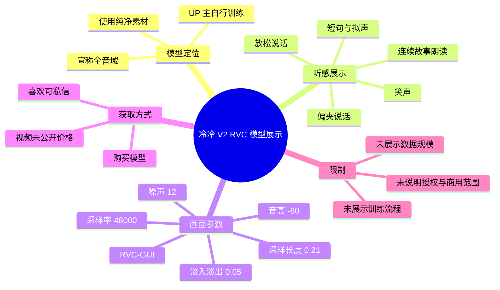

# RVC全音域模型冷冷

> 来源：[Bilibili 视频](https://www.bilibili.com/video/BV1SCA7zoEYV)  
> UP 主：盒装薯条盒｜时长：01:19｜分辨率：2560×1440  
> 视频简介：UP 主称该模型以“纯净素材”自行训练；如有兴趣可联系其购买。

## 小结

视频是对一个名为**“冷冷 V2”**的 RVC 声音转换模型的短展示。UP 主的核心主张是：该模型属于“全音域模型”，在普通放松说话与更偏“夹”的说话方式之间，能够呈现不同的声音效果。

展示分为两段：前半段先用问候、清嗓/拟声与笑声等短声音测试基础表现；后半段以一段完整的小故事检验连续叙述时的听感、情绪与稳定性。故事结束后，UP 主明确说明其仅用于展示模型效果。

画面持续展示 RVC-GUI 的实时变声界面，能读到采样率为 **48000**，并可见音高、噪声、采样长度、淡入淡出等调节项。不过，视频**没有讲解训练集规模、训练轮数、底模、特征提取器、索引文件质量、推理硬件或模型授权范围**，因此不能将本片视作可复现的训练教程或性能测评报告。

对想听辨“全音域”模型在短句、笑声和连续文本中表现的 RVC 使用者，这是一份直观试听素材；对准备实际部署或购买模型的人，仍应向作者核实价格、交付文件、适用的 RVC 版本、商用权利及售后支持。模型效果和价格均具有时效性，以联系 UP 主时的答复为准。

## 思维导图

## 目录

- [模型发布背景与适用范围](#模型发布背景与适用范围-000002)
- [冷冷 V2 的基础音色与全音域主张](#冷冷-v2-的基础音色与全音域主张-000010)
- [连续故事试听：检验长段叙述](#连续故事试听检验长段叙述-000033)
- [RVC-GUI 画面可见参数](#rvc-gui-画面可见参数-000002)
- [获取方式、限制与时效性](#获取方式限制与时效性-000112)
- [字幕比对](#字幕比对)
- [评论分析](#评论分析)
- [处理记录](#处理记录)

## [模型发布背景与适用范围](https://www.bilibili.com/video/BV1SCA7zoEYV?t=2)

视频开头，UP 主“薯条和”介绍自己最近训练的一款模型“冷冷 V2”，并邀请观众先听音色效果。结合视频标题、简介和标签可确认，这是一段围绕 **RVC（Retrieval-based Voice Conversion，检索式语音转换）** 的模型试听展示，而非新闻播报、软件发布公告或训练教程。

视频中的可验证信息包括：

- 模型名称：**冷冷 V2**。
- UP 主称其为最近自行训练的模型。
- 视频简介称训练素材为“纯净素材”，但没有定义“纯净”的筛选标准，也没有披露素材来源、时长、说话人数量或授权情况。
- 标签包含“萝莉音”“模型”“音域”“RVC”等，反映其定位偏向可爱、偏幼态风格的声音转换试听。
- 成片总时长 79 秒，主体内容是试听与界面展示，没有穿插其他新闻或行业动态。

> **前置理解**：RVC 的输出效果不仅取决于模型本身，还会受到输入人声、音高设定、特征检索、噪声处理及推理配置影响。本视频只展示了一组运行画面，无法据此分离判断“模型能力”与“当前参数调校”的各自贡献。

## [冷冷 V2 的基础音色与全音域主张](https://www.bilibili.com/video/BV1SCA7zoEYV?t=10)

在 00:10 至 00:31，UP 主先让观众试听音色效果，随后给出模型定位说明：

1. **00:10–00:17：短声音测试**  
   先出现清嗓/哼声、短促发声和笑声。其目的不是传达语义信息，而是用容易暴露音色断裂、气声处理或非语音拟合问题的声音，展示基础响应。

2. **00:17–00:27：两种说话状态的对比主张**  
   UP 主称，放松讲话和“夹一点”讲话的效果“完全不同”。这里的“夹一点”是口语化的声音风格描述，视频未给出可量化的声学定义；能确认的是，作者希望以输入发声方式变化来体现模型输出的风格差异。

3. **00:27–00:31：全音域模型定位**  
   UP 主将上述差异归因于“这是一款全音域的模型”。这是作者的产品/效果描述，并未展示频率范围、可稳定转换的最低音与最高音、测试音阶，或与其他模型的 A/B 对照，因此不应延伸为经过标准化测试的全频段性能结论。

> 图：关键帧展示了视频持续使用的 RVC-GUI 窗口、输入输出设备区域与参数滑块。它的价值在于证明本片确实处于 RVC 实时变声/推理界面中，而不只是纯音频成品播放；同时可辅助辨认部分运行参数。

## [连续故事试听：检验长段叙述](https://www.bilibili.com/video/BV1SCA7zoEYV?t=33)

从 00:33 起，UP 主转入一段用于展示效果的小故事。完整内容可按站内字幕整理如下：

> 放学的小丫头攥着皱巴巴的糖纸，蹲在公交站。刚刚买的发卡掉了。卖烤红薯的爷爷把最后一块热乎的递到她手里：“哭花脸就不好看了，红薯暖手，糖纸也能当小旗子。”丫头破涕为笑，把糖纸贴在爷爷的红薯车把上。后来每个傍晚，车把上总飘着不同颜色的糖纸，像一串小小的彩虹，暖了整条街的晚风。

这段素材覆盖了叙述、引号内对白和带有温暖情绪色彩的收束句，较短句测试更适合让观众自行听辨以下方面：

- 长句中音色是否连续稳定；
- 叙述与对白之间是否仍保留语气变化；
- 连续输出时是否出现明显的吐字异常、断裂或风格漂移；
- 末尾抒情句是否能维持与前文一致的声音质感。

但视频没有给出原始输入音频与转换后音频的并列对照，也没有提供未处理录音、频谱、客观指标或多说话人测试。因此，观众只能基于这段单一示例作主观听感判断。

> 图：该关键帧与前一帧同样呈现 RVC-GUI，但参数区更清晰地保留了音高、噪声、采样长度、检索相关选项等信息。它有助于理解故事试听并非脱离配置的“裸模型”结论，而是特定界面设置下的输出。

## [RVC-GUI 画面可见参数](https://www.bilibili.com/video/BV1SCA7zoEYV?t=2)

视频没有口头教学参数含义，但关键帧中的 RVC-GUI 界面可辨认出以下数值。它们应被理解为**该次演示画面的当前设置**，而非 UP 主明确推荐给所有模型或所有声音的通用配置。

| 区域 | 画面可见项目 | 可读数值/状态 | 解读边界 |
| --- | --- | ---: | --- |
| 音频设置 | 采样率 | 48000 | 可见为当前界面采样率；未说明模型训练采样率。 |
| 常规设置 | 音高 | -60 | 画面滑块数值；未说明单位、转换逻辑及该值是否为实际生效值。 |
| 常规设置 | 噪声设置 | 12 | 仅能确认数值显示为 12，视频未解释其算法含义。 |
| 常规设置 | 保护音/声（界面文字较小） | 0.00 | 数值可见，但具体字段名称及作用不宜据此作过度推断。 |
| 常规设置 | 检索特征占比 | 0.00 | 画面中为 0.00，说明该演示界面未见使用较高比例的检索特征混合。 |
| 常规设置 | 响度因子 | 0.65 | 可见滑块值。 |
| 音高算法 | harvest | 画面中可见选中状态 | 仅表明界面使用/选中 harvest 相关选项，未做算法优劣比较。 |
| 性能设置 | 采样长度 | 0.21 | 当前演示值。 |
| 性能设置 | harvest 进程数 | 4 | 当前演示值。 |
| 性能设置 | 淡入淡出长度 | 0.05 | 当前演示值。 |
| 性能设置 | 额外推理时长 | 2.99 | 当前演示值。 |
| 底部状态 | 重采样率 | 480 | 可见数值，但画面未提供单位及完整上下文。 |
| 底部状态 | 推理时间 | 约 33–38 ms | 不同关键帧中读数略有变化，不能据此推导稳定延迟或硬件性能。 |

> 图：该帧显示了输入输出设备下拉项、采样率和底部推理状态。画面中的推理时间存在帧间变化，说明它只是某一时刻的界面读数，不能替代规范的延迟基准测试。

### 可从本片整理的实际操作顺序

视频只显式展示了推理操作的结果，未展示从零训练模型的步骤。按画面与旁白可确认的使用流程为：

1. 在 RVC-GUI 中加载模型与对应索引文件；界面顶部可见“选择 pth 文件”“选择 index 文件”按钮。
2. 配置音频输入、输出设备及采样率；画面可见音频设备选择区，采样率显示为 48000。
3. 设置音高、噪声、检索特征占比、响度等推理参数。
4. 选择/启用相应的音高提取设置，画面可见 harvest 选项。
5. 开始音频转换，并以短发声、不同说话状态和连续故事进行试听。
6. 依据听感判断模型是否满足目标音色与稳定性需求。

### 视频未提供、因而无法复现的关键步骤

以下内容在视频中没有出现，不能补写为事实：

- 训练集收集、清洗与切分方法；
- 声音数据总时长、采样率、语料类型及静音处理；
- RVC 版本、底模版本、训练轮数、batch size、学习率及显卡型号；
- `.pth` 与 `.index` 文件的具体版本和校验方式；
- 音高值 `-60` 的设置理由；
- 输入设备、输出设备与 Voicemeeter 路由的完整配置；
- 模型下载渠道、售价、付款方式、使用协议和商用授权。

## [获取方式、限制与时效性](https://www.bilibili.com/video/BV1SCA7zoEYV?t=72)

00:01:07 后，UP 主说明前述故事“只是为了展示效果的一段小故事”，并表示喜欢的话可以私信购买模型，称价格“很划算”。

### 获取信息

- 视频给出的唯一获取路径是：**私信 UP 主“盒装薯条盒”**。
- 视频没有公开标价。
- 视频没有说明出售内容是仅模型文件、模型加索引文件，还是包含配置、调试或售后服务。
- 热评中有人询问价格，但本次可获取评论中未见 UP 主公开回复价格。

### 使用与决策限制

- **效果样本有限**：仅有一位演示者、有限短发声和一段故事，覆盖面不足以验证不同性别、音域、语速、语言或唱歌场景。
- **参数依赖性强**：当前声音效果与可见推理参数共同构成，直接更换输入设备、音高或特征检索比例后，效果可能变化。
- **授权信息缺失**：视频未说明训练素材的权利状态、模型再分发和商用许可。购买或使用前应自行确认。
- **价格与交付具有时效性**：视频发布于 2026-03-20，模型版本、价格、库存、联系渠道及服务承诺都可能在此后变化。
- **没有客观评测**：本片不是模型横评，未提供 SNR、音色相似度、音高准确率、实时性统计或失败案例。

## 字幕比对

| 字幕来源 | 完整性 | 专有名词 | 时间轴 | 主要问题 |
| --- | --- | --- | --- | --- |
| Bilibili 站内字幕 | 高，覆盖 00:00:02.280–00:01:18.040，包含完整故事段 | 较准确，写作“冷冷V2”“RVC”语境明确 | 细分为 28 段，可直接定位 | 个别口语与拟声词表达不够规范；“我是薯条和”与账号名“盒装薯条盒”并非同一写法，但不构成矛盾。 |
| 本次 ASR 字幕 | 中等，仅输出 3 个长分段，覆盖约 46.65 秒 | 存在误识别，如“薯條河”“效过”“模形” | 有时间戳，但 00:33.540–01:01.060 出现 27.52 秒大空档 | 漏掉故事主体的大部分内容；繁简混排，句子未切分。 |

### 最终字幕选择

正文以**站内字幕 `p01-ai-zh.srt` 为主**，并逐段参照本次 ASR 结果核验开头、模型名称、结尾购买说明及时间范围。选择理由如下：

1. 站内字幕完整保留了 00:33–01:06 的故事正文；本次 ASR 在该处存在明显的大段漏识别。
2. 站内字幕的时间轴粒度更细，适合制作章节链接。
3. 本次 ASR 并非没有运行：识别语言为中文，置信度约 **0.9946**，音频时长约 **78.25 秒**，且结果中**没有** `noAudioStream=true` 标记。因此，源视频存在音轨，ASR 的长空档应视为识别覆盖不足，而不是“视频无音轨”或工具失败。
4. 结合站内字幕和上下文，将 ASR 的“薯條河”校正为 UP 主自称“薯条和”，将“模形”校正为“模型”。

关键帧仅用于确认画面中存在 RVC-GUI、参数滑块及实时推理状态；它们不能补足音频中未出现的训练细节。

## 评论分析

本次接口请求热评前三条，但实际仅获取到 **2 条**，因此不虚构第 3 条评论。

1. **训练场主宰｜21 赞**  
   > “原来是rvc啊，我以为是rvc呢”  
   这是一条以重复“RVC”制造反差的玩笑评论，没有补充模型性能、价格或使用经验，也不构成事实性评价。较高点赞更能说明该玩笑获得互动，而非证明模型技术质量。

2. **大西瓜有点甜呀｜4 赞**  
   > “有人买了吗。。想知道价格。”  
   评论反映出观众对价格和购买经验有实际需求，也侧面印证视频本身未公开定价。但该评论是提问而非购买反馈，不能据此推断模型价格、是否有人购买或交付质量。

## 处理记录

- Worker ID：`worker-mrj0www4-e8d79408`
- 模型：`gpt-5.6-terra`
- 调用工具与素材：视频元数据、站内字幕 `p01-ai-zh.srt`、本次 ASR 结果 `asr/asr-result.json` 与 `asr/transcript.srt`、关键帧 `frames/`、热评数据 `comments/comments.json`。
- 字幕选择：以站内字幕为正文时间轴和逐句内容依据；已检查本次 ASR，并在“字幕比对”中记录其 3 段输出、识别误差与 27.52 秒大空档。
- 音轨判断：ASR 诊断未标记 `noAudioStream=true`，且识别到了中文语音；因此按“存在音轨但 ASR 覆盖不完整”处理。
- 关键帧选择依据：选用 `frame-001.jpg`、`frame-003.jpg`、`frame-004.jpg`，因为它们可见 RVC-GUI、采样率、参数滑块、设备配置与推理时间；未将画面难以辨认的模型路径和字段名称作为确定事实。
- 评论处理：按“仅处理可获取热评前三条”执行；请求数量为 3，实际返回 2 条，已明确缺失情况。
- 缓存清理：未提供可验证的缓存清理执行日志；本文不宣称已完成缓存删除。
- 未解决问题：模型训练数据与授权、完整训练参数、模型文件内容、真实售价、交付方式、模型版本及跨场景表现均未在现有素材中披露。
