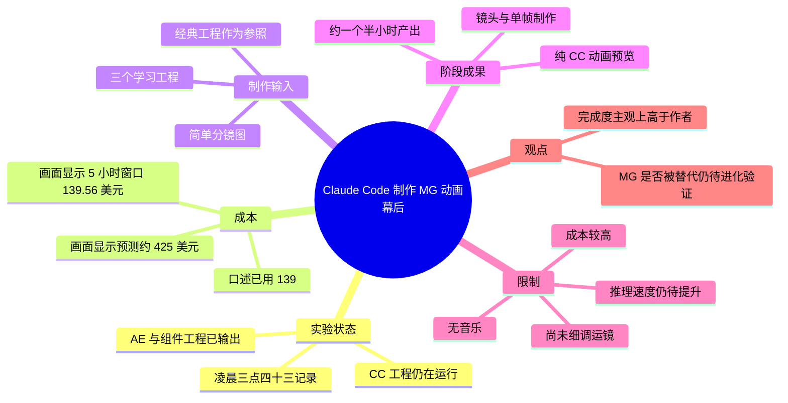
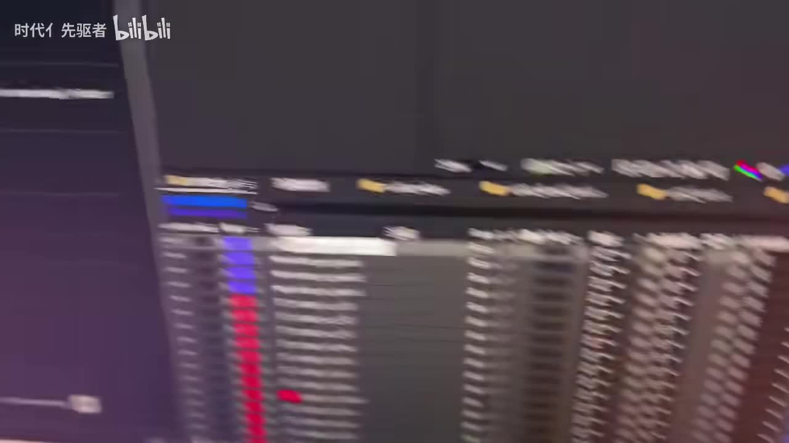
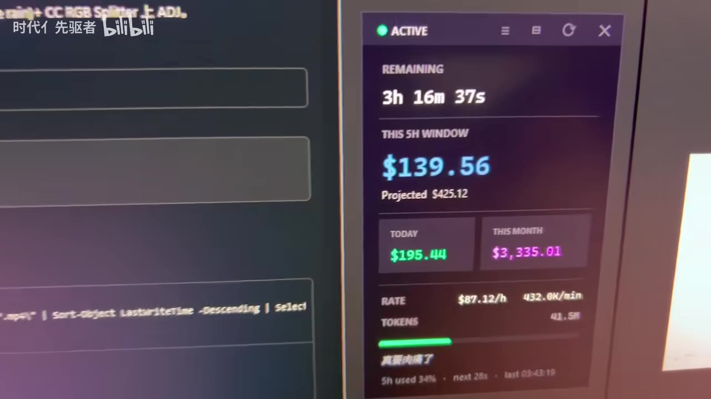
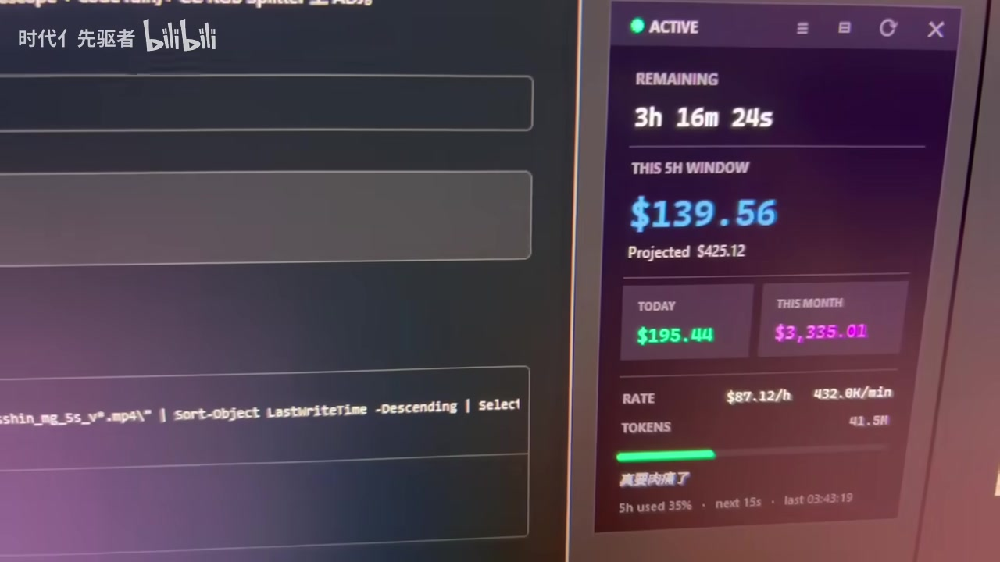
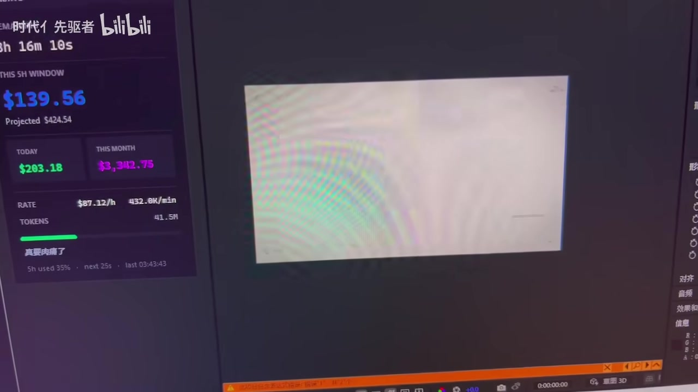

# Claude Code制作Mg动画幕后

> 来源：[Bilibili 视频](https://www.bilibili.com/video/BV1ovLN6mE4m) 
> UP 主：时代亻先驱者｜时长：02:58｜分区/合集：AIcode  
> 视频描述：“帧自己k 形状层自己画 电脑自己动 你只要反复吊AI就行了”。

## 小结

这是一段约三分钟的 MG（Motion Graphics，动态图形）动画实验幕后记录。UP 主展示了让 Claude Code（视频中简称“CC”）参与搭建 After Effects（AE）工程、制作动画的阶段性结果，并直接播放了一段由其完成的动画预览。

视频的关键新信息不是一套可复现的脚本或完整提示词，而是一组实际试验观察：UP 主表示，系统学习了约 3 个工程、耗时约 1 天后，已经能够处理镜头与单帧等其本人过去觉得困难的环节；在一次约 1 个半小时的制作中得到当前成果。

成本是本次实验最明确的限制。UP 主口述已消耗“139”，画面中的计费面板则显示当前 5 小时窗口为 **$139.56**，并显示预测值约 **$425.12 / $425.54**。这些数字属于拍摄时的监控画面，不能外推为 Claude Code 的固定定价、所有项目的标准成本或完整项目总成本。

UP 主的工作方式可概括为：先提供一个较简单的分镜图，再提供若干经典工程作为参照，并要求模型围绕分镜推理工程中的曲线与发散性设计；但配色、曲线是否应直接继承既有工程，ASR 转写存在歧义，不能据此断言具体提示词规则。

本视频适合关注 AI 辅助 AE/MG 制作、希望评估“AI 是否能代做部分动画工程”的设计师、技术美术与创作者阅读。它展示的是尚未精调、且没有配乐的阶段成果；关于质量、稳定性、版权、工程可维护性及商业可行性，视频均未完成验证。

## 思维导图

## 目录

- [实验背景、进度与成本](#实验背景进度与成本)
- [阶段性动画成果](#阶段性动画成果)
- [输入材料与推理式工作流](#输入材料与推理式工作流)
- [可迁移步骤与参数清单](#可迁移步骤与参数清单)
- [结论、限制与时效性](#结论限制与时效性)
- [字幕比对](#字幕比对)
- [评论分析](#评论分析)
- [处理记录](#处理记录)

## [实验背景、进度与成本](https://www.bilibili.com/video/BV1ovLN6mE4m?t=0)

### [凌晨记录与工程状态（00:00:00）](https://www.bilibili.com/video/BV1ovLN6mE4m?t=0)

视频开头，UP 主称当时是“凌晨三点四十三”。随后说明 CC 侧的搭建“差不多了”，但任务仍在运行。约 00:31 起，他提到 AE 及搭建组件相关的工程已经输出，并准备展示当前动画形态。

这里的“CC”在标题与上下文中指 Claude Code；“搭建”具体包含哪些 AE 操作、调用了什么插件或脚本，视频没有展开，因此不能将其理解为一个已公开、可直接安装的自动化工作流。

> 图：画面展示 AE 的时间线/图层区域，层数较多但因拍摄模糊无法可靠识别图层名。它的价值在于印证视频并非仅展示生成式视频成片，而是涉及 AE 工程与多图层动画场景。

### [成本读数与含义边界（00:00:07）](https://www.bilibili.com/video/BV1ovLN6mE4m?t=7)

UP 主口述本次已使用“139”，并称这是“推理动画”的成本；紧接着的句子涉及训练、AE 和组件工程，但 ASR 断句不清。较稳妥的理解是：他正在区分当前推理/生成动画过程的消耗，与前期学习或工程搭建相关成本；具体哪些成本被排除，原始音频并未表述得足够清楚。

画面中计费工具的可辨认信息包括：

| 项目 | 画面读数 | 说明 |
| --- | ---: | --- |
| 当前 5 小时窗口（THIS 5H WINDOW） | **$139.56** | 与口述“139”相互接近。 |
| 预测消耗（Projected） | **$425.12**，后续画面约 **$425.54** | 面板预测值，非最终结算金额。 |
| 当日（TODAY） | $195.44，后续画面约 $203.18 | 拍摄时屏幕读数。 |
| 本月（THIS MONTH） | $3,335.01，后续画面约 $3,342.75 | 拍摄时屏幕读数。 |
| 速率（RATE） | $87.12/h | 面板的瞬时/统计速率；视频未解释计算口径。 |
| Token | 41.5M | 画面可见读数；未给出输入与输出 token 的拆分。 |

> 图：该帧清楚呈现 “THIS 5H WINDOW $139.56” 与预测消耗数值，是核对 UP 主口述“139”的直接画面依据，也说明成本应按实际模型调用与项目规模单独评估。

> 图：该帧同时保留终端/工作区和成本面板，可见任务处于持续运行状态。它有助于理解此处成本对应的是正在进行的自动化制作过程，而不是单纯播放成片的成本。

## [阶段性动画成果](https://www.bilibili.com/video/BV1ovLN6mE4m?t=45)

### [“纯 CC”动画预览（00:00:45）](https://www.bilibili.com/video/BV1ovLN6mE4m?t=45)

UP 主在此处称展示内容为“纯 CC 做的动画”，随后播放预览。从视频语境看，这意味着本段动画的制作主要归因于 CC；但视频此前又明确提到 AE 和组件工程，且没有展示从零到成片的完整操作日志。因此，“纯 CC”应保留为创作者对成果归属的说法，不能严格推导为全过程完全没有人工准备、AE 环境或既有工程素材。

约 00:58，UP 主把“镜头和单帧”称为自己过去最讨厌做的工作，认为系统在约学习 1 天、学习 3 个工程后，已经能做出当前水平。这是其个人观察，并没有提供学习样本、评测标准、失败率或与人工成片的同条件对照。

> 图：该帧显示 AE 中央合成预览区域，右侧仍保留成本面板；预览内容因屏摄曝光和画面较白而难以辨认细节。其价值在于连接“动画输出预览”与“运行中的生成/制作环境”。

### [作者对完成度的判断（00:02:27）](https://www.bilibili.com/video/BV1ovLN6mE4m?t=147)

UP 主对当前成果给出的限制与评价包括：

- **没有音乐**：当前预览并非完整声画成片。
- **运镜尚未细调**：镜头运动仍处在粗加工或待优化状态。
- **耗时约 1 个半小时**：这是他对“做出来的成果”所述的时间量级；视频未明确这是否包含学习、等待、人工沟通、排错和渲染。
- **推理速度仍有提升空间**：UP 主认为若条件更好，推理速度可能更快，但未说明所指模型、硬件、网络或上下文策略。
- **完成度主观上较高**：UP 主认为至少已“比我高很多”，随后也承认自己做 MG 本来就较困难。因此，这一比较是个人能力基准下的主观评价，不是对行业专业水平的客观结论。

## [输入材料与推理式工作流](https://www.bilibili.com/video/BV1ovLN6mE4m?t=91)

### [分镜图是主要任务输入（00:01:31）](https://www.bilibili.com/video/BV1ovLN6mE4m?t=91)

UP 主称自己给出的分镜图“还很简单”。视频没有展示分镜图的高清全貌、镜头数量、时长标注或文本提示，因此无法还原其具体设计规范。不过，这一表述确认了分镜是本次任务约束的核心：AI 不是无目标自由生成，而是需围绕已有分镜完成动画工程。

### [以经典工程为参考进行推理（00:01:47）](https://www.bilibili.com/video/BV1ovLN6mE4m?t=107)

UP 主描述其对系统的要求大意为：

1. 根据提供的分镜图执行；
2. 参考其给出的若干“经典工程”；
3. 围绕工程中的曲线以及更发散性的内容直接进行推理；
4. 当前已经产出此前展示的动画样子。

ASR 在这段将“分镜图”“分镜”“曲线”等词多次误识别为“分镝图”“分镇图”等，但结合语境可校正为“分镜图”。其中“不要学习他之前工程的一些配色和曲线”一句语法与指代均不清，可能涉及“不沿用既有工程的配色和曲线”，也可能是转写遗漏导致语义反转。由于没有站内字幕和清晰书面提示词，本文不将其整理为确定的操作规则。

## [可迁移步骤与参数清单](https://www.bilibili.com/video/BV1ovLN6mE4m?t=107)

以下是依据视频陈述可整理的**实验流程**，并非视频提供的完整教程或保证复现的方案：

1. **准备目标分镜**
   - 给出简化的分镜图作为动画目标。
   - 视频未公开分镜格式、分辨率、镜头数、帧率、时长或镜头注释方式。

2. **准备参考工程**
   - 向系统提供约 3 个可供学习/参考的工程。
   - UP 主称系统“学习了一天吧，学了三个工程”；这是口述近似值，不是精确训练时长或官方模型训练流程。

3. **在 AE/组件工程环境中搭建并运行**
   - 视频画面显示 AE 时间线、合成预览与终端/工作区。
   - UP 主称 CC 端仍在运行，AE 和组件工程已输出。
   - 未展示命令、MCP/插件接口、脚本内容、AE 版本、操作系统版本、渲染器或依赖安装步骤。

4. **让系统围绕分镜与参考工程推理**
   - 可明确的任务方向是生成镜头、单帧及动画相关内容。
   - “曲线”“发散性”是 UP 主提到的工程要素，但没有公开可操作的参数或验收标准。

5. **预览并人工决定后续细调**
   - 当前阶段仍无音乐，运镜尚未细调。
   - 这表明 AI 输出后仍需要创作者进行审阅、节奏调整和成片化处理。

### 视频中可确认的量化信息

| 项目 | 视频中信息 | 适用边界 |
| --- | --- | --- |
| 视频时长 | 02:58 | 页面元数据为 178 秒，ASR 音频有效时长约 177.08 秒。 |
| 学习工程数量 | 3 个 | UP 主口述，不含工程复杂度和内容。 |
| 学习时长 | “可能只学习了一天” | 近似、推测性表达。 |
| 当前成果制作时间 | 约 1 个半小时 | 未说明是否涵盖全部人工与等待时间。 |
| 当前 5 小时窗口成本 | $139.56（画面） | 特定时点、特定账户与任务的监控读数。 |
| 预测成本 | 约 $425.12–$425.54（画面） | 预测，不是最终账单。 |
| 成片状态 | 无音乐、运镜未细调 | 因而不适合直接用作完整交付质量样本。 |

## [结论、限制与时效性](https://www.bilibili.com/video/BV1ovLN6mE4m?t=147)

视频最有价值的经验是：对于已有分镜和参考工程的 MG 项目，AI 可以被用作工程推理与动画搭建的执行者，而不只是文本问答工具；创作者的输入从逐帧操作，转向提供分镜、参考工程、方向约束与反复验收。

但该实验不支持“MG 动画已完全被替代”这一结论。UP 主本人在 01:25 提出“真的做 MG 的死路一条吗”的反问，随后给出的答案是“只能等继续进化了”。这说明视频呈现的是对能力跃迁的观察和担忧，而不是对职业替代的定论。

主要限制如下：

- **成本高且波动大**：画面显示的调用成本已处于较高水平，且预测额远高于当前窗口支出。
- **质量尚未终验**：缺音乐、运镜未细调，无法评价节奏、叙事、交付规范和最终渲染质量。
- **过程不完整**：没有公开提示词、代码、工程文件、版本、插件、错误案例或人工修改量，无法严格复现。
- **样本有限**：只展示单次/单类项目的阶段成果，不能代表不同风格、复杂度、时长与商业要求。
- **评价具有主观性**：完成度“比我高很多”是 UP 主基于自身 MG 能力的判断。
- **工具能力具有时效性**：模型版本、收费规则、调用限制、AE 自动化接口和可用插件均可能在视频发布后变化。本文记录的是视频拍摄时状态，不能作为后续价格与能力承诺。

## 字幕比对

| 字幕来源 | 完整性 | 专有名词 | 时间轴 | 主要问题 |
| --- | --- | --- | --- | --- |
| Bilibili 站内字幕 | 未提供可用字幕 | 无法核验 | 无法使用 | 素材记录显示字幕工具因 `Invalid URL` 退出，未获得站内字幕。 |
| 本次 ASR 字幕 | 较高：13 段，语音覆盖约 146.73 秒 / 177.08 秒（82.86%） | 一般 | 可用：提供毫秒级 SRT 起止时间 | 有口语粘连、断句不稳及词语误识别，尤其是“分镜图”“分镜”等。 |

最终采用**本次 ASR 时间轴字幕**作为章节时间定位依据，所有时间链接均使用 SRT 中真实分段的起始时间换算为秒数。

本次 ASR 使用 `medium` 模型，识别语言为中文，语言置信度约 **0.968**，并具备时间戳。诊断中**没有** `noAudioStream=true` 标记；同时素材中提供了 `audio/audio.wav` 和有效 ASR 结果，说明本次处理实际获得并识别了音频流，不能将站内字幕缺失误判为无音轨。

结合画面、标题与上下文所做的有限校正：

- ASR 中的“CC”按标题和语境记为 **Claude Code**。
- “分镝图”“分镇图”等转写，按上下文校正为 **分镜图**。
- “MG”是标题、标签和结尾语境中明确出现的领域称呼。
- 关于“训练 AE 和搭建组件工程”的具体成本归属，音频表达不清，保留原意边界，不做强行校正。
- 计费数值以关键帧可见文字为准；口述“139”与画面 **$139.56** 分别记录，不将二者混为精确同一数值。

## 评论分析

以下仅分析可获取的热评前三条，评论反映的是观众观点，不构成经验证事实。

1. **火焰棘背龙（9 赞）**  
   评论认为成本“有点吓人”，并用“200 刀够雇个相关专业大学生干一整天”作比较。该观点直接回应了视频中高额调用成本，提示评估 AI 自动化时不能只比较速度与效果，还应比较人力、返工、沟通与交付质量。其“雇大学生”的价格和产能是个人化假设，地区、项目复杂度与用工方式均不同，不能视为统一成本基准。

2. **GattlingCannon（7 赞）**  
   评论以“一把炼化……变成时代先驱者.skill”调侃，表达了观众对创作者经验被 AI 吸收、转化为可调用能力的感受。这与视频中“让系统学习三个工程”的叙事相呼应，但并未提供关于模型是否真正训练、知识归属或技能可迁移性的额外可验证信息。

3. **chocolate_cil（6 赞）**  
   评论“请选择你的摄影流派”是对画面风格或镜头呈现的玩笑式回应。它没有给出可用于技术验证的具体信息，但侧面说明观众注意到了视频展示的镜头/画面表达；不能据此判断实际摄影或运镜质量。

## 处理记录

- **Worker ID**：`worker-mrj0wjed-b0c290ad`
- **模型**：`gpt-5.6-terra`
- **调用工具与素材产物**：视频元数据、页面统计与热评数据；音频提取产物 `audio/audio.wav`；ASR 产物 `asr/transcript.srt`、`asr/asr-result.json`、`asr/asr-transcript.txt`；关键帧目录 `frames/`。
- **ASR 工具/配置**：`medium` 模型、CUDA、`float16`；自动识别为中文，语言置信度 `0.9677734375`。
- **字幕选择**：站内字幕未提供可用结果，且字幕工具记录有 `Invalid URL` 警告；已检查本次 ASR，采用其带毫秒时间戳的 SRT 作为正文时间轴来源。
- **关键帧选择依据**：选用 `frame-001` 展示 AE 多层时间线，`frame-002` 与 `frame-003` 核验成本面板及运行状态，`frame-004` 展示 AE 合成预览；其余列出的帧未提供可供核验的画面内容，故未在正文中臆测使用。
- **评论范围**：仅处理素材中可获取的热评前三条。
- **缓存清理**：素材未提供缓存清理执行记录，无法确认是否已清理；不据此编造清理结果。
- **未解决问题**：未取得站内字幕；未提供完整提示词、AE 工程文件、CC 配置、插件/接口版本、学习数据细节和最终成片，因而无法复现或独立验证效率、成本及最终质量。
