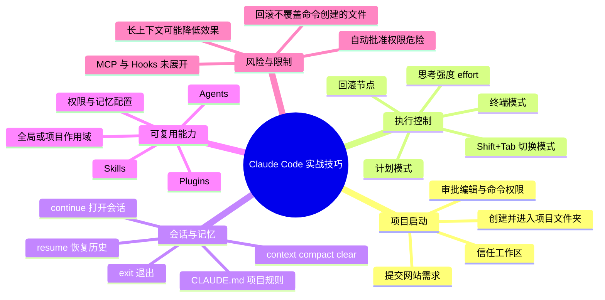
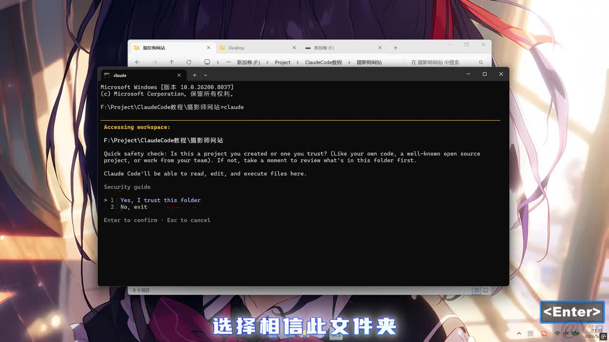
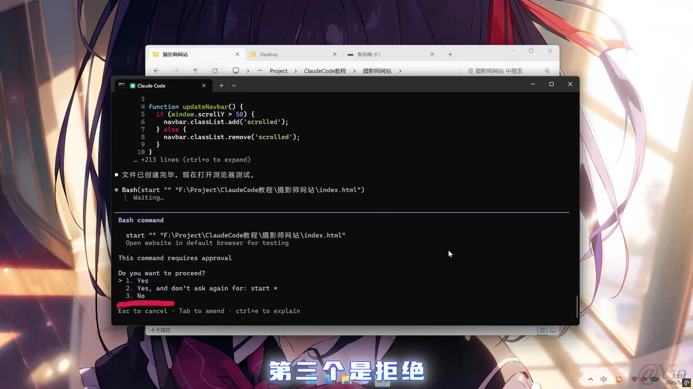
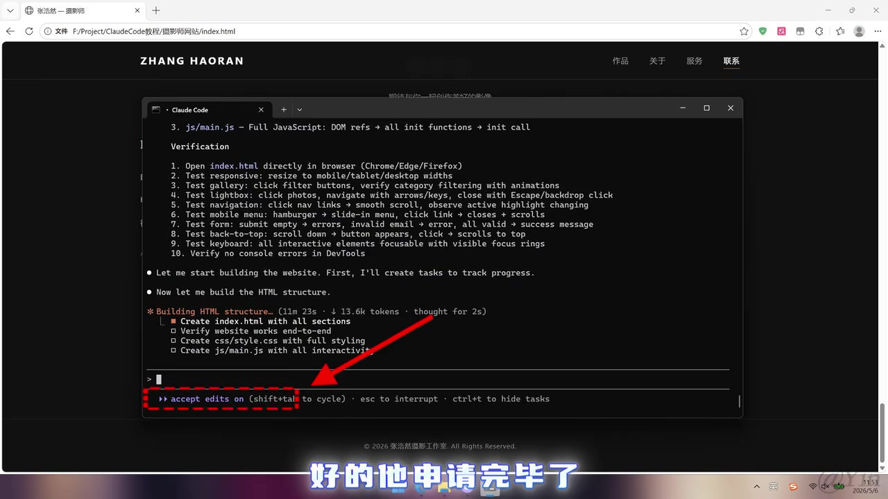
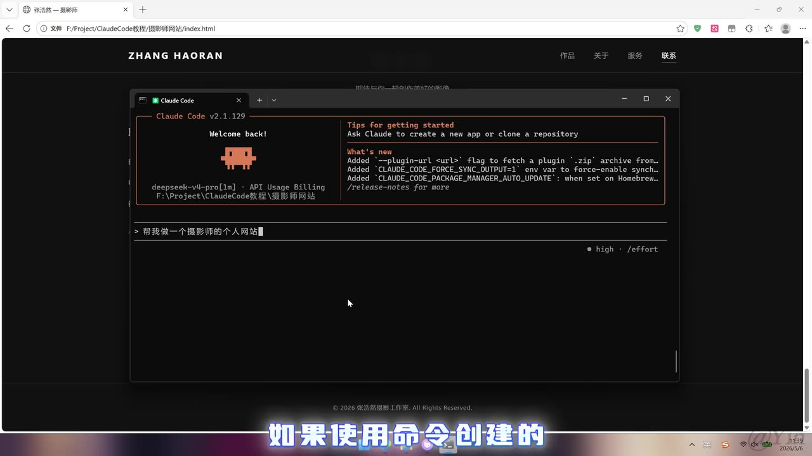

# 10分钟学会24个ClaudeCode使用技巧

> 来源：[Bilibili 视频](https://www.bilibili.com/video/BV1SddcBFESs)<br>
> UP 主：Yin_Code｜时长：10 分 56 秒｜合集：AIcode  
> 视频简介称其面向 Claude Code 新手；未安装 Claude Code 的观众可参考 UP 主上一期安装视频。

## 小结

视频以“制作摄影师个人网站”为连续项目案例，演示 Claude Code 从进入项目目录、信任工作区、生成页面，到重构、回滚、恢复会话、管理上下文、配置 Skills / Agents / Plugins 的一整套基础工作流。其重点不是讲编程语言本身，而是讲如何在 Claude Code 的交互界面中控制执行过程、权限和记忆。

最重要的实践经验是：不要把 Claude Code 当成无约束的一键生成器。对于较大的改造任务，应先进入计划模式讨论需求，再设置合适的思考强度；对于命令执行、编辑工具和插件安装，要按范围授予权限。视频明确将“自动同意所有权限”标为**极其危险**，不建议在真实项目中使用。

视频覆盖的命令与入口包括 `/rewind`、`/effort`、`/exit`、`/resume`、`/init`、`/context`、`/compact`、`/clear`，以及 Skills、Agents、Plugins 的管理入口；另演示了用 `!` 切到终端模式、用 `Shift+Tab` 在模式间切换。热评补充了 `/claude --continue` 用于直接打开上次会话，但这条补充属于评论信息，视频 ASR 对相应命令名称识别不够可靠。

对于新手，推荐顺序是：先在测试目录中完成“计划—执行—查看—回滚”的最小闭环，再学习 `CLAUDE.md` 项目约束和上下文管理，最后再引入全局 Skills、独立 Agents 与 Plugins。视频没有讲解 MCP 与 Hooks 的具体配置，只说明插件可以将 Skills、Agents、MCP、Hooks 打包在一起。

时效性方面，视频画面可见 Claude Code `v2.1.129`，且 Claude Code 的命令、交互选项、权限文案、插件市场和存储位置均可能随版本变化。文中以视频演示为准，实际使用前应在本机通过帮助菜单、官方文档或命令提示确认。

## 思维导图




## 目录

- [项目启动、权限与首轮生成](#项目启动权限与首轮生成)
- [回滚、计划模式与执行控制](#回滚计划模式与执行控制)
- [终端模式、思考强度与危险权限](#终端模式思考强度与危险权限)
- [会话恢复与 CLAUDEmd 项目记忆](#会话恢复与-claudemd-项目记忆)
- [上下文管理：查看、压缩与清空](#上下文管理查看压缩与清空)
- [Skills：将重复任务封装为说明书](#skills将重复任务封装为说明书)
- [Agents：独立子智能体与权限配置](#agents独立子智能体与权限配置)
- [Plugins：整合 Skills、Agents、MCP 与 Hooks](#plugins整合-skillsagentsmcp-与-hooks)
- [完整实操路线与参数清单](#完整实操路线与参数清单)
- [限制、风险与时效性](#限制风险与时效性)
- [字幕比对](#字幕比对)
- [评论分析](#评论分析)
- [处理记录](#处理记录)

## 项目启动、权限与首轮生成 [00:00:32](https://www.bilibili.com/video/BV1SddcBFESs?t=32)

视频用一个摄影师个人网站贯穿演示。开始时，UP 主先创建一个项目文件夹，进入该目录后，在资源管理器地址栏输入 `cmd` 打开命令提示符，再输入 `claude` 启动 Claude Code。

首次访问目录时，Claude Code 弹出工作区安全确认，画面中的选项包括“信任此文件夹”与“退出”。这一步的含义是允许工具在该目录中读取、编辑和执行操作；对于来源不明的项目，不能机械确认信任。



> 图：画面展示 Claude Code 访问工作区时的安全检查和 “Yes, I trust this folder” 选项。这是后续读取、编辑、执行文件操作的前提，因此也构成第一层安全边界。

进入 Claude Code 后，UP 主输入“制作摄影师个人网站”的需求。系统自动进入计划模式，先输出计划而非直接执行；计划完成后要求用户决定是否批准。视频解释的三个选项为：

1. 批准计划，并在之后自动同意使用编辑工具；
2. 批准计划，但之后每次使用编辑工具仍需手动同意；
3. 暂不执行，继续与 Claude Code 讨论计划内容。

视频示例选第一项，以便演示连续生成。该选择适合临时、可控的测试目录；如果项目中存在重要代码、密钥或未提交修改，第二项的逐次确认更稳妥。

随后，Claude Code 请求执行 `start` 命令以在浏览器中打开页面。画面显示三种处理方式：

1. 仅同意本次；
2. 同意本次，并在当前会话内以后不再询问同一 `start` 命令；
3. 拒绝。



> 图：Claude Code 正在为 `start "" "…\\index.html"` 申请 Bash 命令执行许可，并显示“仅本次同意 / 当前会话不再询问 / 拒绝”。该画面说明“编辑权限”和“运行命令权限”是不同的确认点。

页面生成后，视频在浏览器中查看结果，认为初版整体效果尚可。这里的经验是：把“生成结果能否打开、页面是否可用”作为首轮验收，而不是只看终端里是否显示完成。

## 回滚、计划模式与执行控制 [00:01:21](https://www.bilibili.com/video/BV1SddcBFESs?t=81)

当生成的页面不符合预期，或者连续让模型修改后效果越来越差时，视频推荐使用：

```text
/rewind
```

该命令可回到对话/执行历史中的某个节点。进入回滚界面后，可用方向键切换节点；视频还提到可以双击 `Enter` 键进入回滚页面。选中节点后，界面提供以下处理方式：

- 回滚**代码和对话**；
- 仅回滚对话；
- 仅回滚代码；
- 将该节点之前的内容压缩成摘要；
- 取消。

视频示例选择“回滚代码和对话”。需要特别注意其限制：**回滚功能只能回滚由 Claude Code 内置工具创建的文件和文件夹；如果文件由命令创建，则无法通过此回滚功能恢复。** 因此，在执行批量脚本、包管理器、数据库迁移或外部命令前，仍应依赖 Git、备份或快照，而不能把 `/rewind` 当成通用版本控制。

接着，视频解释计划模式：Claude Code 会先与用户讨论，再输出更具体的计划建议。手动切换模式的快捷键为：

```text
Shift + Tab
```

它可在计划模式与“自动同意编辑工具”模式之间切换。重新发送需求后，系统会进一步询问项目细节；用户可通过方向键选择答案、按 `Enter` 提交。视频强调，补充细节后，模型会更新计划，最后再由用户批准并进入执行。



> 图：左下角突出显示 “accept edits on (shift+tab to cycle)”，说明当前编辑工具的自动批准状态可通过 `Shift+Tab` 循环切换。它有助于理解“计划先行”和“自动执行”并非同一模式。

## 终端模式、思考强度与危险权限 [00:03:21](https://www.bilibili.com/video/BV1SddcBFESs?t=201)

### 用 `!` 进入终端模式

视频说明，在输入框中输入英文感叹号：

```text
!
```

Claude Code 会切换到终端模式；此时可直接使用终端命令。示例中通过 `start` 加上目标文件名手动打开生成的网站。终端模式的价值在于：当用户不希望由 Agent 代为决定如何运行命令时，可以明确地自行指定命令。

### 用 `/effort` 调整思考强度

为了将仅靠基础前端技术生成的网站改为使用更现代的技术栈，视频调用：

```text
/effort
```

并称界面中共有六档可选项，示例选 `Max`。设置成功后，右下角的状态从普通强度变为 `Max`。视频的意图是让 Claude Code 对“大工程”进行更久、更深入的思考。

> 视频没有逐项展示或解释六个档位的确切名称、token 消耗与计费差异，因此不能据此推导所有档位的性能或成本。更高思考强度也不等同于必然正确，应通过测试、代码审查和版本控制验收结果。

### 长提示词的输入方式

视频给出两种编辑多行提示词的方法：

- `Ctrl + J`：换行；
- `Ctrl + G`：在文本编辑器中打开后编辑；写完用 `Ctrl + S` 保存，关闭后内容会自动进入 Claude Code 输入框。

该方式适合重构说明、验收标准和较长的任务约束，可减少在单行输入框中编辑复杂需求时的遗漏。

### 自动批准所有权限：仅限隔离测试环境

视频随后演示：另开一个命令提示符窗口，以某个命令启动 Claude Code 后，它会自动同意所有权限申请。ASR 在此处未能可靠识别完整启动命令，因此本文不补写该命令文本。

UP 主对此作出明确风险提示：这“极其危险”，**不建议在真实项目上使用**。自动批准可能让 Agent 无需逐项确认就运行命令、修改文件或执行其他被请求的操作。若必须实验，应至少满足：

- 使用临时目录或容器/虚拟机；
- 不放置密钥、生产配置、重要个人文件；
- 保持 Git 工作区干净，并准备回滚方案；
- 审阅 Agent 将要执行的命令和修改范围。

## 会话恢复与 `CLAUDE.md` 项目记忆 [00:04:09](https://www.bilibili.com/video/BV1SddcBFESs?t=249)

退出 Claude Code 可使用：

```text
/exit
```

之后在相同路径再次运行 `claude`，新的界面中可能看不到前面的对话记录。视频给出两个恢复路径：

```text
/resume
```

用于查看最近历史并加载会话；另一个“直接打开上次项目会话”的命令在 ASR 中出现了明显误识别。热评列出的写法是：

```text
/claude --continue
```

由于这条完整写法来自热评，而非可靠的 ASR 命令识别，应在实际终端中核验其可用性和具体语法。

接着，视频介绍：

```text
/init
```

运行后会生成一个名为 `CLAUDE.md` 的 Markdown 文件。视频将其称为 Claude Code 的“记忆系统”：项目规则、技术栈、编码约定等可以写入其中；每次对话时，系统会带着该文件内容发送给模型。

视频示例中，生成的 `CLAUDE.md` 初始内容为英文。UP 主通过输入框中的文件引用符号选择该文件，请 Claude Code 翻译成中文；随后添加一段“每句话后面加一句‘喵’”的规则。再发送普通消息时，回复每句都附带“喵”，据此演示该文件确实持续约束会话。

这说明 `CLAUDE.md` 适合放置稳定、项目级的约束，例如：

```md
# 项目约定
- 使用现有技术栈，不随意替换构建工具。
- 修改前先说明影响的文件与原因。
- 提交前运行已有测试。
- 不读取、不输出、不修改密钥文件。
```

不宜把频繁变化的临时需求、敏感凭据或大段无关材料塞入其中，否则会持续占用上下文，并可能使项目规则变得难以维护。

## 上下文管理：查看、压缩与清空 [00:05:29](https://www.bilibili.com/video/BV1SddcBFESs?t=329)

视频列出三项上下文操作：

```text
/context
/compact
/clear
```

- `/context`：查看上下文使用情况。示例显示已使用 13%，并展示不同提示词内容的占比。
- `/compact`：压缩上下文，把已有内容浓缩为摘要，以降低上下文占用。
- `/clear`：更极端地清空上下文。

UP 主的判断是：上下文太长可能使模型效果越来越差。示例先进行压缩，若效果仍不好，再直接清空；清空后再次用 `/context` 查看，使用量明显降低。

值得注意的是，清空后模型仍能回答一部分项目相关问题。视频将这一现象归因于 `CLAUDE.md` 仍在发挥作用：聊天上下文被清理，不代表每轮自动读取的项目规则文件失效。因此，较好的分工是：

- **会话上下文**：承载当前任务的过程、临时讨论与中间结果；
- **`CLAUDE.md`**：承载长期、稳定、需要持续遵守的项目规则；
- **Git / 文档 / 测试**：承载可复查的事实、代码版本和验收依据。

## Skills：将重复任务封装为说明书 [00:06:18](https://www.bilibili.com/video/BV1SddcBFESs?t=378)

视频用通俗方式解释 Skills：可以把它理解为一份“说明书”。Claude Code 在需要处理某类工作时，可根据 Skill 的名称选择合适能力。

演示中，UP 主进入用户目录后，打开 Skills 的全局目录；视频称从网上下载的 Skill 安装在此处即可生效。随后新建一个 Skill 文件夹，启动 Claude Code，并要求它创建一个“每日报告” Skill。

创建完成后，视频打开该 Skill 的 Markdown 文件，指出其由三部分构成：

1. `name`；
2. `description`；
3. 完整指令。

之后，通过一个用于查看已安装 Skills 的命令确认刚创建的 Skill 已被识别，再让 Claude Code 生成每日报告，系统成功识别并加载对应 Skill。ASR 没有可靠转写出该查看命令，故不在此臆写具体命令名。

实际落地时，可将 Skill 用于有稳定输入输出和固定流程的工作，例如日报生成、代码风格检查、发布前检查清单等。Skill 的 `description` 应明确说明触发场景，完整指令则应定义输入、步骤、输出格式与边界。

## Agents：独立子智能体与权限配置 [00:07:30](https://www.bilibili.com/video/BV1SddcBFESs?t=450)

视频将 Agents 与 Skills 区分开来：

- **Skills**：为当前 Claude Code 提供可按名称匹配的说明与能力；
- **Agents**：独立于当前主会话的智能体，可理解为另一个 Claude Code。

Agent 完成任务后会把结果返回给主会话；视频强调，其执行过程中的上下文不会全部加载到主会话，从而避免污染主会话的上下文环境。这里的“避免污染”是视频的功能性解释，不代表 Agent 的输出不需要人工审查。

通过 Agents 功能入口后，界面可查看运行中的 Agent，或选择 `Create` 创建新 Agent。演示的创建路径如下：

1. 选择创建 Agent；
2. 选择**项目级别**或**用户级别**：
   - 项目级：只在当前项目有效，其他项目看不到；
   - 用户级：在该用户的不同项目中均可见；
3. 选择由 Claude Code 自动生成，或手动配置；
4. 示例让 Claude Code 生成一个“代码审核” Agent；
5. 在工具权限页，仅保留读取权限；
6. 选择 Agent 驱动模型；视频示例选第一个选项；
7. 选择 Agent 颜色；
8. 配置 Agent 的记忆文件存放位置；
9. 预览 Agent 提示词，使用编辑选项修改，或按 `S` 保存；按 `Esc` 退出。

视频对记忆存放位置给出四类说明：

| 选项 | 视频说明 | 适用理解 |
| --- | --- | --- |
| 项目级记忆 | 可随项目提交到 GitHub；他人拉取项目后也可同步获得 | 团队共享、可版本化的规则 |
| 不保留记忆 | 不保存 | 一次性或严格隔离任务 |
| 用户级记忆 | 保存在用户目录，所有项目可读取 | 个人通用偏好 |
| 本地用户级记忆 | 同属用户级，但保存在本地，Git 提交不会上传，他人无法查看 | 个人且不应共享的偏好 |

视频示例为代码审核 Agent 选择项目级记忆，并把工具权限控制为只读。这是合理的最小权限实践：审核任务通常应输出问题和建议，而不是直接改写代码。



> 图：画面展示 Claude Code 正在构建网站、列出待办任务及文件创建动作。此类任务追踪界面有助于用户检查 Agent 当前准备修改哪些文件，不能只以最终“完成”提示作为验收依据。

保存后，UP 主在主会话中用提示词要求调用该 Agent 做代码审核，演示显示 Agent 成功被调起并返回完整报告。视频未给出该报告的质量评估标准；实际使用时仍应检查报告是否覆盖安全、逻辑、测试、可维护性以及项目特定规范。

## Plugins：整合 Skills、Agents、MCP 与 Hooks [00:09:54](https://www.bilibili.com/video/BV1SddcBFESs?t=594)

视频将插件解释为打包了以下能力的“整合包”：

- Skills；
- Agents；
- MCP；
- Hooks。

其中 MCP 与 Hooks 因篇幅原因未在本视频展开，因此不能从视频得出它们的安装方式、权限模型或具体配置格式。

进入插件功能后，视频称界面有四个页面。在 `discover` 页选择 `frontenddesign` 插件，进入安装页。安装范围有三种：

1. 下载到用户目录：其他项目也生效；
2. 下载到项目目录：当前项目及拉取该项目的用户生效；
3. 下载到本地项目目录：仅当前电脑上的当前项目生效。

视频最后的口述与 ASR 对“选择第几项”的转写存在歧义：前文说明第一项为用户目录，后文却出现“选择第一个下载到当前项目”的表述，二者不一致。因此，可靠结论是**安装前必须以本机界面显示的作用域文字为准，不应仅按数字选项操作**。

安装 `frontenddesign` 后，UP 主新建另一个文件夹并启动 Claude Code，要求使用该插件制作摄影师个人网页。生成完成后，视频主观评价：相比不使用插件的结果，页面效果“明显更好”，后续只需微调。

该结论是单个演示案例的视觉比较，不等价于所有项目都能获得同等提升。插件可能引入额外指令、工具权限或第三方依赖，安装前应确认来源、代码内容、作用域与团队协作影响。

## 完整实操路线与参数清单 [00:00:32](https://www.bilibili.com/video/BV1SddcBFESs?t=32)

以下按视频顺序重组为可执行的学习路线。命令文本仅列出视频 ASR 或热评可明确确认的部分；无法可靠识别的命令不补造。

### 1. 在隔离目录创建最小项目

```text
1. 创建项目文件夹
2. 进入文件夹
3. 在资源管理器地址栏输入 cmd
4. 输入 claude
5. 确认是否信任该文件夹
6. 输入一个小而明确的页面需求
```

建议先从静态页面、文档整理等低风险任务开始，不要直接在生产仓库开启自动权限。

### 2. 先计划，再批准执行

```text
Shift + Tab
```

- 切到计划模式；
- 补充目标用户、页面栏目、风格、技术限制、验收条件；
- 阅读计划；
- 根据风险选择自动批准编辑或逐次批准；
- 在浏览器中检查实际结果。

### 3. 处理失败或偏离需求的生成

```text
/rewind
```

- 选择目标历史节点；
- 判断要回滚代码、对话，还是两者；
- 牢记：命令创建的文件不能保证被该功能回滚；
- 对重要修改优先使用 Git 提交或分支保存节点。

### 4. 管理复杂任务的思考与输入

```text
/effort
Ctrl + J
Ctrl + G
Ctrl + S
```

- 对重构等复杂任务提高思考强度；
- 用 `Ctrl + J` 输入多行说明；
- 或用 `Ctrl + G` 打开编辑器，完成后 `Ctrl + S` 保存；
- 将验收标准写清楚，例如响应式要求、页面区块、性能边界、不可修改的目录。

### 5. 管理会话与长期规则

```text
/exit
/resume
/init
```

- 临时离开时使用 `/exit`；
- 需要加载最近历史时使用 `/resume`；
- 用 `/init` 生成 `CLAUDE.md`；
- 把稳定项目规则放进 `CLAUDE.md`，把临时任务放在当次提示词中。

热评提供但未由可靠 ASR 完整确认的补充命令：

```text
/claude --continue
```

使用前应自行确认版本是否支持。

### 6. 监测与控制上下文

```text
/context
/compact
/clear
```

| 操作 | 目的 | 风险与建议 |
| --- | --- | --- |
| `/context` | 检查使用量及构成 | 定期查看，定位冗长输入 |
| `/compact` | 将既有内容压缩为摘要 | 关键细节可能被概括，压缩前记录重要决定 |
| `/clear` | 清空会话上下文 | 不等于清除 `CLAUDE.md`；清空后应重新陈述当前任务目标 |

### 7. 将成熟流程升级为 Skills、Agents 与 Plugins

- **Skill**：适合固定流程；用名称、描述和完整指令定义可复用能力。
- **Agent**：适合独立的子任务，如代码审核；优先只读权限并明确输出格式。
- **Plugin**：适合成套能力；安装时重点确认用户级、项目级、本地项目级的作用范围。

## 限制、风险与时效性 [00:09:54](https://www.bilibili.com/video/BV1SddcBFESs?t=594)

1. **回滚边界有限**：视频明确指出，`/rewind` 无法回滚用命令创建的文件和文件夹。对外部命令、依赖安装、迁移操作和批量删除，必须使用 Git、备份或环境隔离。
2. **自动权限存在高风险**：视频称自动同意所有权限“极其危险”。真实项目中应坚持最小权限、逐项审查、隔离测试与可回滚提交。
3. **上下文不是越长越好**：视频认为过长上下文可能导致模型表现变差；应通过 `/context` 观察，通过 `/compact` 或 `/clear` 控制，但压缩/清空也可能损失任务细节。
4. **插件安装范围需要看清**：安装页涉及用户目录、项目目录、本地项目目录。由于视频口述在“第几项”上存在前后歧义，不能照搬数字选项，必须以实际界面的范围描述为准。
5. **MCP 与 Hooks 未教学**：视频只将二者列为插件可能包含的组成部分，没有展示具体技术细节、配置和安全模型。
6. **版本可能已变化**：画面中出现 Claude Code `v2.1.129`。命令、快捷键、可选档位、插件名称与权限文案具有版本时效性；本文记录的是视频发布时演示，不构成跨版本操作保证。
7. **“效果更好”是主观演示结论**：`frontenddesign` 插件生成网页的视觉效果被 UP 主评价为更好，但没有对性能、可访问性、可维护性、许可证或安全性做系统测试。

## 字幕比对

| 字幕来源 | 完整性 | 专有名词 | 时间轴 | 主要问题 |
| --- | --- | --- | --- | --- |
| Bilibili 站内字幕 `p01-ai-zh.srt` | 极低；仅覆盖约 00:17–04:22，且内容为歌曲歌词 | 与视频内容无关 | 有真实时间轴，但不对应教程讲解 | 字幕为背景音乐歌词，不能用于本视频知识提取 |
| 本次 ASR 字幕 | 高；覆盖 00:32.660–10:55.070，诊断语音覆盖率 94.5% | 多处误识别，如 Cloud Code、CMD、计划、上下文、Skill 等 | 有逐段真实起止时间，可用于章节定位 | 分段过长；英文命令和界面选项存在明显听写错误或缺失 |

最终采用策略：**以本次 ASR 的真实时间轴和语义主线为基础，以关键帧中可见界面文字、视频上下文及热评的命令清单进行谨慎校正。** 未将站内字幕作为讲解内容来源，因为其内容与视频主题不匹配。

重要校正与保留原则：

- ASR 中的 `CloudCode`、`Cloud Cod` 等统一按视频标题和画面校正为 **Claude Code**。
- ASR 中的 `CMB` 按操作语境校正为 Windows 的 **CMD**。
- ASR 所称“Cloud 文件”结合 `/init` 的说明校正为 **`CLAUDE.md`**。
- `/rewind`、`/effort`、`/exit`、`/resume`、`/init`、`/context`、`/compact`、`/clear` 由热评明确列出，且与 ASR 对应功能段落一致。
- `start`、`frontenddesign`、`Shift+Tab`、`Ctrl+J`、`Ctrl+G`、`Ctrl+S` 可从 ASR 或关键帧上下文得到支持。
- 自动批准权限的启动命令、查看已安装 Skill 的命令、打开 Agents/Plugins 的完整命令未被 ASR 可靠转写，故本文只记载其功能，不编造具体文本。
- ASR 诊断未标记 `noAudioStream=true`；素材存在音频流，且 ASR 已成功识别中文讲解，因此不存在“源视频无音轨”的情况。

## 评论分析

仅分析可获取的热评前三条，不将评论内容直接视为已验证事实。

1. **椰奶我的椰奶嘿嘿（612 赞）**  
   评论认为该视频“全是干货”。这反映观众认可其高信息密度和连续实操风格，但属于主观评价；视频确实在约 10 分钟内覆盖了权限、上下文、Skills、Agents、Plugins 等多个主题，代价是部分命令和机制未展开解释。

2. **冬辰逢君（548 赞）**  
   评论汇总了 `/rewind`、`shift+tab`、`!`、`/effort`、`/exit`、`/resume`、`/claude --continue`、`/init`、`/context`、`/compact`、`/clear`。其价值在于补足了 ASR 对英文命令识别不清的问题，且其中多数与视频相应时段的功能描述吻合。需要保留的疑点是 `/claude --continue`：视频 ASR 未能清晰识别这条命令，应在本机版本中验证语法。

3. **Yin_Code（363 赞）**  
   UP 主评论“燃尽了”，没有补充操作信息或技术争议。它更多表达了制作投入，不构成可验证的教程内容。

## 处理记录

- **Worker ID**：worker-mrj0wjed-b0c290ad
- **模型**：gpt-5.6-terra
- **素材与工具**：使用任务提供的视频元数据、时长信息、站内 SRT、ASR `asr-result.json`、ASR 时间轴字幕、关键帧列表与热评 JSON 进行整理；未对未提供的命令文本进行外部猜测。
- **字幕选择**：检查了站内字幕与本次 ASR。站内字幕为不相干的歌曲歌词，未采用；采用本次 ASR 的真实时间段作为时间轴依据，并结合画面与上下文校正专有名词。
- **关键帧选择依据**：选用工作区信任提示（`frame-001`）、命令权限确认（`frame-002`）、任务执行/文件构建过程（`frame-003`）和模式状态提示（`frame-004`）。这些帧均直接对应正文中的安全边界、权限决策和执行状态，优先于单纯展示网页成品的画面。
- **缓存清理**：未提供可执行的缓存清理日志或结果；本文不虚构清理完成状态。
- **未解决问题**：ASR 对少数英文命令、插件安装选项和自动批准权限启动方式识别不稳定；视频未详细讲 MCP、Hooks，也未给出插件和 Agent 输出质量的客观测试。
