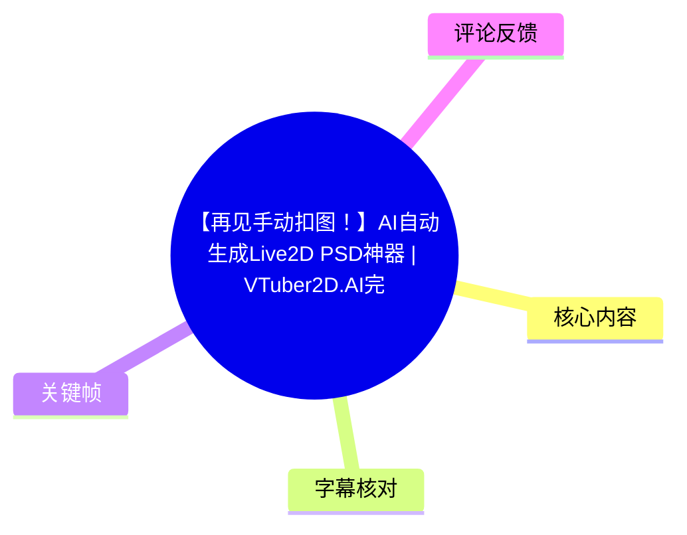
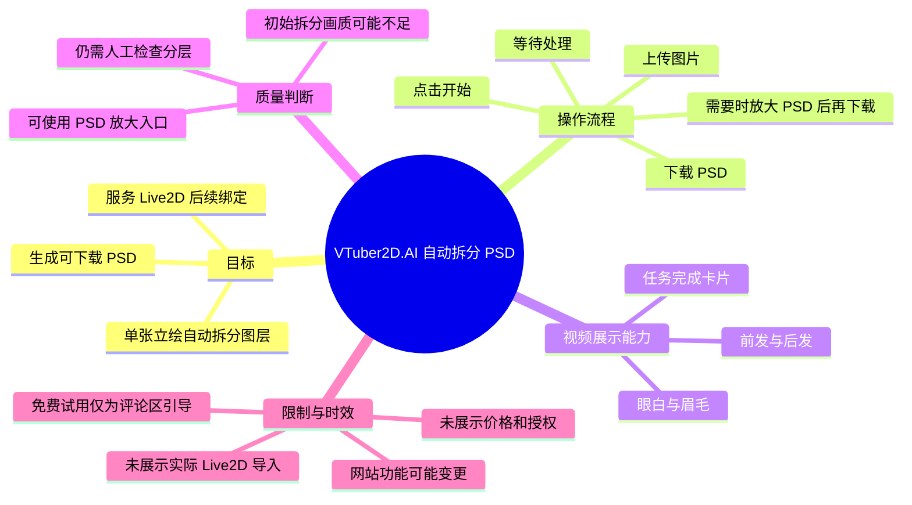
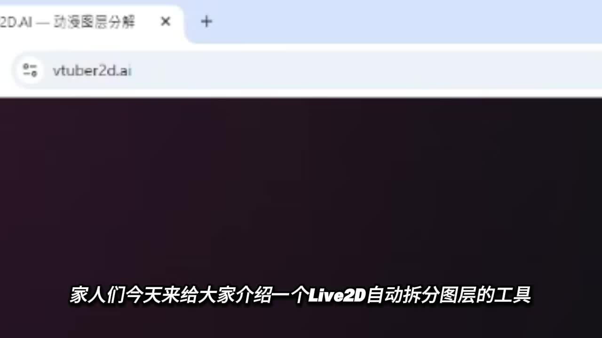
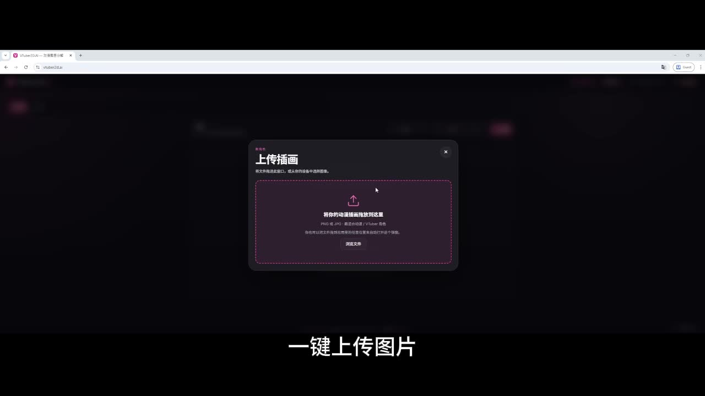
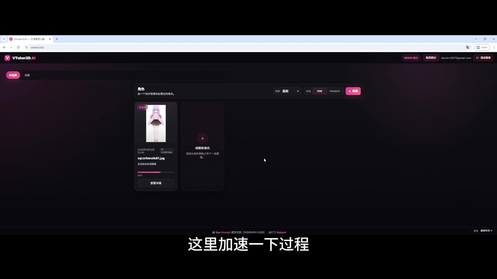
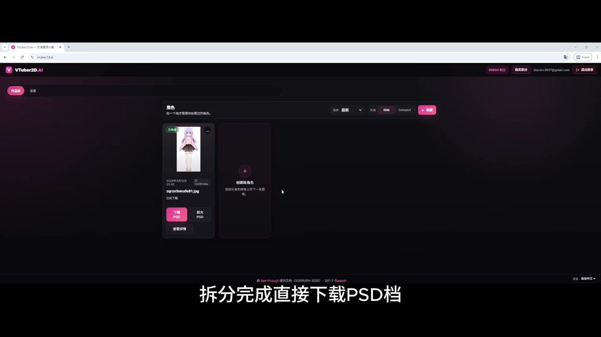

# 【再见手动扣图！】AI自动生成Live2D PSD神器 | VTuber2D.AI完整教学

> 来源：[Bilibili 视频](https://www.bilibili.com/video/BV1QGQhBKEqm)  
> UP 主：狙七在干嘛｜时长：60 秒｜分辨率：1280×720  
> 工具站点（视频简介提供）：<https://vtuber2d.ai>

## 小结

视频演示了 **VTuber2D.AI** 的基础操作：将一张 VTuber／动漫风格立绘上传到网站，启动自动拆分，等待处理结束后下载 PSD 文件。其目标是把原本需要手工扣图、分层的准备工作自动化，以便继续用于 Live2D 的绑定（rigging）与动画制作。

演示中展示的工作流很短：**上传图片 → 开始处理 → 等待拆分 → 下载 PSD → 视情况放大 PSD → 再次下载**。处理页面可见任务卡片、进度／完成状态，以及“下载 PSD”和“放大 PSD”等入口。

视频强调，结果可拆出前发、后发、眼白、眉毛等部件；但 UP 主也明确指出，拆分模型产出的画质“好像不够高”。因此，该工具并非保证一次生成即可直接交付：若初始 PSD 清晰度不足，应使用视频所示的 PSD 放大功能后重新下载，并自行检查结果。

从视频简介可知，该站点自称基于 ComfyUI 专业工作流，可自动分离头发、身体、眼睛、衣服等透明图层并重建可编辑 PSD；不过这属于简介中的产品说明，60 秒实录仅直接展示了上传、任务处理、PSD 下载和放大入口，未逐层验证所有类别、透明度质量或 Live2D 导入兼容性。

该内容适合没有本地 ComfyUI 环境、希望快速获得 Live2D 分层初稿的 VTuber、Live2D 画师和独立动漫创作者。视频末尾称“想要免费试用”的观众可在评论区留言“666”；这是一项视频内引导，不等同于已验证的长期免费、额度、商用授权或隐私政策。

## 思维导图

## 目录

- [工具定位与适用场景](#工具定位与适用场景)
- [基础操作：上传、开始与下载](#基础操作上传开始与下载)
- [拆分结果与可见图层能力](#拆分结果与可见图层能力)
- [画质不足时的 PSD 放大流程](#画质不足时的-psd-放大流程)
- [完整实践步骤与检查清单](#完整实践步骤与检查清单)
- [限制、风险与时效性](#限制风险与时效性)
- [字幕比对](#字幕比对)
- [评论分析](#评论分析)
- [处理记录](#处理记录)

## 工具定位与适用场景 [00:00](https://www.bilibili.com/video/BV1QGQhBKEqm?t=0)

视频开场将 VTuber2D.AI 定位为“Live2D 自动拆分图层”的工具。ASR 首句将名称误识别为“Leaf2D”，并把“图层”识别为“涂层”；结合视频标题、页面地址 `vtuber2d.ai`、画面中的 VTuber2D.AI 标识及画面字幕，可校正为 **Live2D 自动拆分图层工具**。

该工具处理的输入在视频中是单张人物立绘。视频简介进一步称，适用对象是 VTuber 或动漫风格的单张立绘，目标是生成具有透明图层、可编辑的 PSD，后续可送入 Live2D 进行 rigging。需要注意的是，“可直接用于 Live2D”是简介中的宣称；本视频没有展示 Cubism 中的导入、参数绑定、变形器设置或导出动画，因此不能据此推断所有输出都无需修图即可使用。

> 图：该帧同时给出工具网址和视频主题，是校正 ASR 将“VTuber2D／Live2D”误识别为“Leaf2D”的关键视觉依据。

## 基础操作：上传、开始与下载 [00:06](https://www.bilibili.com/video/BV1QGQhBKEqm?t=6)

### 上传单张立绘 [00:06](https://www.bilibili.com/video/BV1QGQhBKEqm?t=6)

ASR 在 00:06.580–00:08.200 提示“一键上传图片”。画面显示网站的“上传插画”弹窗，中心是拖放／选择文件区域；视频用一张角色立绘作为示例输入。截图中的提示还可辨识出 PNG、JPG 等图片格式字样，但视频没有完整展示文件大小、像素上限、透明通道要求或版权审核规则。

> 图：该帧直观对应“上传图片”步骤，证明视频展示的是网页端上传操作，而非本地安装 ComfyUI 的流程。

### 启动任务并等待处理 [00:09](https://www.bilibili.com/video/BV1QGQhBKEqm?t=9)

在 00:09.650–00:10.470，讲解称“按开始”。随后 00:11.380–00:16.000 表示“这里加速一下过程”，说明实际处理等待被视频加速，不能将视频播放中的几秒钟当成真实生成耗时。

任务列表中可见角色卡片、示例立绘缩略图与进度条。处理完成前，视频未给出可复现的运行时长、队列长度、服务器区域或失败重试机制等参数。

> 图：该帧记录了“等待 AI 后台处理”的实际界面；它也说明视频对过程进行了加速，而非实时计时演示。

### 下载拆分后的 PSD [00:11](https://www.bilibili.com/video/BV1QGQhBKEqm?t=11)

讲解在 00:11.380–00:16.000 明确说明：拆分完成后“直接下载 PSD 档”。完成态任务卡上可见“下载 PSD”按钮，并同时出现“放大 PSD”入口。这里能确认输出目标是 PSD 文件；但视频没有打开 Photoshop、展示 PSD 图层树、文件体积、分辨率或命名规则。

> 图：该帧是视频中最直接的交付证据，显示首次拆分完成后可下载 PSD，也为后续画质放大步骤提供界面依据。

## 拆分结果与可见图层能力 [00:21](https://www.bilibili.com/video/BV1QGQhBKEqm?t=21)

在 00:21.500–00:22.660，UP 主转而查看效果；在 00:28.730–00:31.530，明确表示“连前发、后发、眼白、眉毛都能拆”。这表明视频主张拆分颗粒度不止身体和衣服等大块区域，也涉及面部与发型的可动部件。

可将视频中出现或简介列举的层次分为：

| 类别 | 来源 | 视频能够支持的结论 |
| --- | --- | --- |
| 前发、后发 | 语音讲解 | 讲解明确称可拆分。 |
| 眼白、眉毛 | 语音讲解 | 讲解明确称可拆分。 |
| 头发、身体、眼睛、衣服 | 视频简介 | 简介称工具会自动分离这些透明图层。 |
| PSD 输出 | 语音讲解与界面 | 已展示完成态的下载 PSD 按钮。 |
| 可直接完成 Live2D 模型 | 非实录验证 | 视频未展示导入和绑定，不能确认。 |

这里的“能拆”应理解为演示／产品能力描述，而非每一张图都能准确拆开的质量保证。尤其是 Live2D 所需图层不仅要分开，还常要求被遮挡区域补全、边缘干净、层级关系正确；这些细节均未在视频内展开检验。

## 画质不足时的 PSD 放大流程 [00:32](https://www.bilibili.com/video/BV1QGQhBKEqm?t=32)

### 视频提出的质量问题 [00:32](https://www.bilibili.com/video/BV1QGQhBKEqm?t=32)

00:32.030–00:35.330，UP 主表示拆分模型的画质“好像不够高”。ASR 此处误识别为“拆粉的模型”，应按语境校正为“拆分的模型”。这也是视频最重要的限制说明：自动拆分能节省初步分层劳动，但初始结果存在清晰度可能不足的问题。

视频没有说明“画质不够高”具体表现为分辨率偏低、边缘锯齿、纹理损失、遮挡部分补全错误，还是 PSD 中各层本身的缺失；因此不能将问题进一步归因到某个具体算法环节。

### 使用“放大 PSD”并重新下载 [00:36](https://www.bilibili.com/video/BV1QGQhBKEqm?t=36)

00:36.550–00:41.250，讲解称工具还可自动提高 PSD 画质；ASR 的“画贴”应校正为“画质”。紧接着在 00:43.810–00:46.330，讲解称“然后一样下载 PSD”，即放大完成后仍通过下载 PSD 获得结果；00:47.530–00:51.390 宣布“高画质的 Live2D 拆分完成了”。

可从实录整理为以下流程：

1. 先完成一次自动拆分并获取任务完成态。
2. 判断初始拆分图的清晰度是否满足后续制作。
3. 若不足，在完成卡上选择“放大 PSD”。
4. 等待放大处理完成。
5. 再次下载 PSD。
6. 仍需在图像编辑软件或 Live2D 制作流程中检查实际图层质量。

视频只说明可“自动提高 PSD 画质”，未提供倍率、模型名称、耗时、是否改变分层结构、是否额外收费或是否会生成新的任务版本。故“高画质”应视为 UP 主对演示结果的评价，而不是可量化的质量指标。

## 完整实践步骤与检查清单 [00:06](https://www.bilibili.com/video/BV1QGQhBKEqm?t=6)

以下按视频的真实顺序整理，未补充视频未展示的配置参数：

1. **准备一张角色立绘。**  
   视频用单张动漫角色立绘演示；简介称面向 VTuber／动漫风格单张立绘。上传前应确认自己拥有素材的使用权，但视频未讨论版权许可。

2. **打开 `vtuber2d.ai` 并上传图片。**  
   对应视频 [00:06](https://www.bilibili.com/video/BV1QGQhBKEqm?t=6)。通过“上传插画”的拖放或文件选择区域提交图像。

3. **点击开始。**  
   对应视频 [00:09](https://www.bilibili.com/video/BV1QGQhBKEqm?t=9)。视频未展示可调提示词、图层数量、拆分模式或分辨率参数，因此不应假定存在这些设置。

4. **等待后台拆分。**  
   对应视频 [00:11](https://www.bilibili.com/video/BV1QGQhBKEqm?t=11)。视频对此过程加速，真实耗时未知。

5. **下载初始 PSD。**  
   对应视频 [00:11](https://www.bilibili.com/video/BV1QGQhBKEqm?t=11)。在完成态任务卡使用“下载 PSD”。

6. **检查关键部件和画质。**  
   对应视频 [00:21](https://www.bilibili.com/video/BV1QGQhBKEqm?t=21)。优先检查前发／后发、眼白、眉毛等视频点名的细分部件；还应自行检查边缘、遮挡区和部件层级，但后者属于制作上的必要验收，并非视频展示的自动保证。

7. **若初始画质不足，执行“放大 PSD”。**  
   对应视频 [00:36](https://www.bilibili.com/video/BV1QGQhBKEqm?t=36)。完成后按相同方式下载新的 PSD。

8. **进入 Live2D 前进行人工验收。**  
   视频简介将该 PSD 的用途指向 rigging 与后续动画；但视频没有演示这一环。实践中应在实际软件中确认 PSD 的图层可编辑性、层次关系和补图区是否符合项目要求。

视频末尾 [00:54](https://www.bilibili.com/video/BV1QGQhBKEqm?t=54) 说明，想免费试用者可在评论区留言“666”。这是作者给出的参与方式；素材中没有客服回复、兑换步骤或资格条件，不能延伸解释为稳定可获得的试用方案。

## 限制、风险与时效性 [00:32](https://www.bilibili.com/video/BV1QGQhBKEqm?t=32)

- **质量限制已被视频明确提及。** 初始拆分的画质可能不高；虽然有“放大 PSD”入口，但视频未提供前后对比细节或客观指标。
- **拆分正确性没有完全验证。** 视频口述可拆前发、后发、眼白、眉毛，但没有展示 PSD 图层树、隐藏／显示图层测试，亦未验证遮挡区域补全。
- **没有 Live2D 实操闭环。** 标题和简介均关联 Live2D，但视频未展示导入 Cubism、网格、参数、物理、表情或导出。因此该视频应作为“生成分层 PSD 的入口教程”，而不是完整 Live2D 建模教学。
- **服务规则未知。** 视频没有展示价格、免费额度、登录规则、文件保留时间、数据使用方式、隐私政策、商用许可、最大上传尺寸或失败处理。
- **工具时效性强。** 网站按钮、模型效果、免费试用规则和服务可用性均可能随版本调整。元数据中的 `pubdate` 与素材抓取时间存在时间先后不一致，故本文不以其推断网站功能的当前状态；使用前应以站点当日页面和条款为准。
- **素材权利风险。** 上传人物立绘可能涉及委托约定、角色版权或隐私／保密要求。视频没有对此作出说明，用户需自行确认有权上传和处理素材。

## 字幕比对

| 字幕来源 | 完整性 | 专有名词 | 时间轴 | 主要问题 |
| --- | --- | --- | --- | --- |
| Bilibili 站内字幕 `p01-ai-zh.srt` | 不含讲解内容，仅有 9 段“♪ 音乐 ♪”，且止于 00:42.080 | 无法提供 | 有真实 SRT 时间段，但不覆盖口播语义 | 不能用于整理教程步骤、功能或限制。 |
| 本次 ASR（medium，中文） | 11 段口播，诊断语音覆盖率 57.64%，覆盖 00:00–00:58.420 | 多处误识别 | 有逐段真实起止时间，可用于章节时间轴 | 将“Live2D／VTuber2D”识别为“Leaf2D”，并出现“涂层、拆封、拆粉、画贴”等错词。 |

**最终字幕选择：** 以本次 ASR 的真实时间戳和语义覆盖为主，站内字幕仅用于确认该轨道主要标记音乐、无法转写口播。ASR 诊断未标记 `noAudioStream=true`，且实际识别到中文口播，因此源视频并非无音轨。

**通过画面、标题和简介校正的重点词语：**

| ASR 原文 | 校正结果 | 校正依据 |
| --- | --- | --- |
| Leaf2D | Live2D／VTuber2D.AI（按语境分别使用） | 标题、网址 `vtuber2d.ai`、页面标识和画面字幕。 |
| 自动拆分涂层 | 自动拆分图层 | 开场画面字幕“Live2D自动拆分图层的工具”。 |
| 拆封完成 | 拆分完成 | 上下文为图层处理结束并下载 PSD。 |
| 拆粉的模型 | 拆分的模型 | 00:32 前后均讨论图层拆分结果。 |
| 提高 PSD 画贴 | 提高 PSD 画质 | 00:36–00:41 的口播语境及后续“高画质”表述。 |

## 评论分析

素材仅获取到 **2 条**热评，少于要求的前三条；以下仅分析可获取内容，不将评论视为已验证事实。

1. **`abcdefgdasdsa`（8 赞）**  
   评论称自己的电脑配置较弱，长时间未能成功配置 ComfyUI，因此认为网站版工具“很方便”。这反映出该视频可能吸引了希望绕开本地 ComfyUI 部署门槛的用户，也与视频简介“基于 ComfyUI 工作流”的描述形成需求侧呼应。  
   但这只是个人体验和期待，不能证明该网站一定不需要本地资源、所有设备都能顺畅使用，或服务质量优于本地工作流。

2. **`乾乾守望`（4 赞）**  
   评论提出“这不开源项目吗？”的疑问，关注点是项目开源属性。该问题提示观众可能在意模型／工作流的透明度、可自部署性及许可。  
   素材未包含作者答复，视频也没有说明代码仓库、许可证、模型权重来源或是否开源，因此无法确认其开源状态。

3. **第三条热评**  
   未获取到。由于评论素材的 `limit` 为 3 但实际 `items` 仅有 2 条，无法继续分析，也不以普通评论补足。

## 处理记录

- **Worker ID：** `worker-mrj0www4-e8d79408`
- **模型：** `gpt-5.6-terra`
- **ASR 模型与参数：** `medium`；语言自动识别为中文（概率 `0.99462890625`）；CUDA；`float16`；音频时长 `59.9539375` 秒。
- **使用素材／工具产物：** 视频元数据、站内 SRT `p01-ai-zh.srt`、本次 ASR 结果与 SRT、关键帧目录、热评 JSON；未使用素材外网页信息补充功能、价格或开源状态。
- **字幕选择：** 已检查站内字幕与本次 ASR。站内字幕只有音乐标记，正文以 ASR 的 11 个真实时间分段为主，并以视频标题、简介和关键帧校正专有名词与明显错词。
- **关键帧选择依据：** 选用已提供画面中与正文步骤直接对应的 4 帧：工具网址与定位（`frame-001`）、上传对话框（`frame-002`）、处理进度（`frame-003`）、完成后的下载／放大 PSD 入口（`frame-004`）。其余关键帧虽列于路径清单，但未提供可核验画面，不对其内容作推断。
- **缓存清理：** 本任务仅基于给定素材生成文档，未产生或保留额外下载缓存；素材目录中的原始文件不在本 Agent 输出阶段删除。
- **未解决问题：** 未验证 PSD 实际图层结构与 Live2D 导入效果；未获得放大参数、价格、试用规则、授权和数据政策；未获第三条热评；元数据发布时间戳与抓取时间存在先后矛盾。
