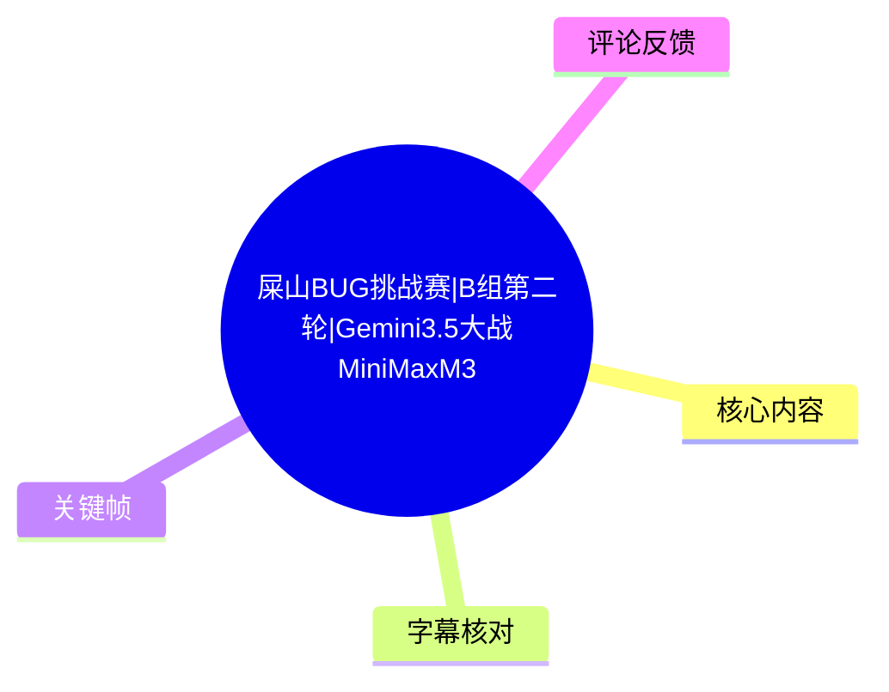
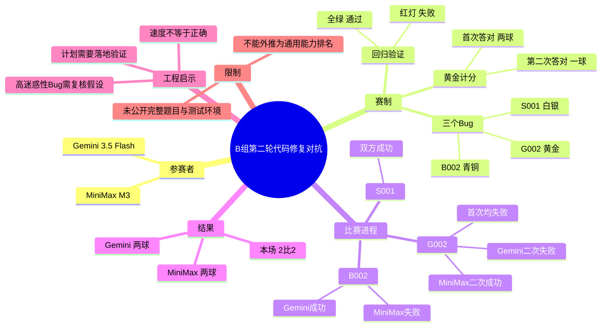
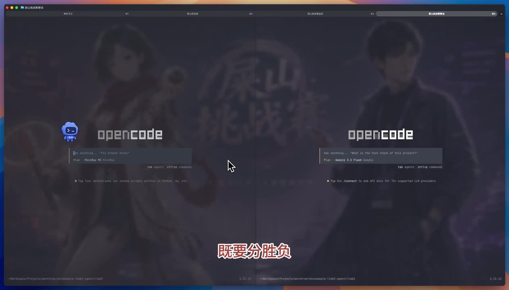
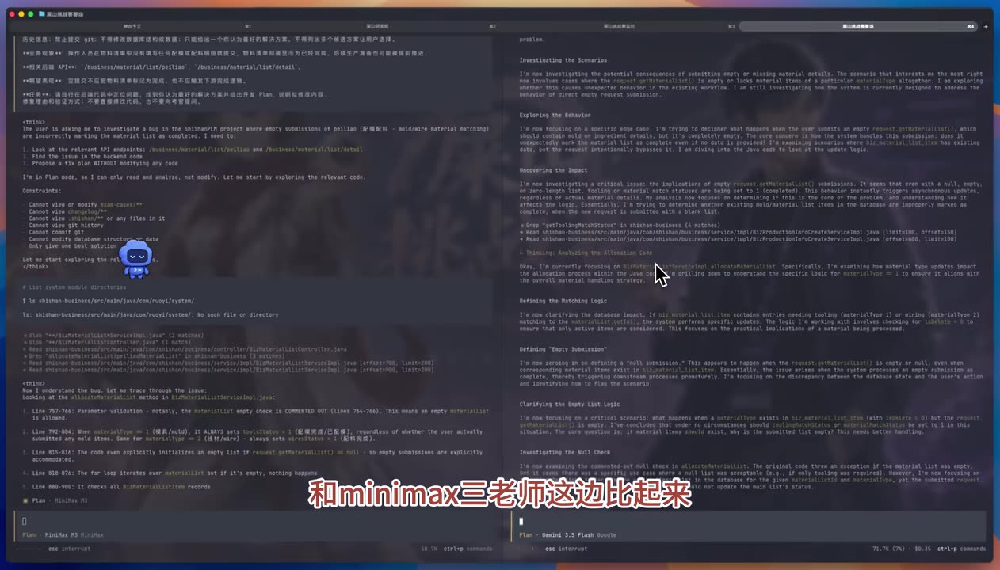
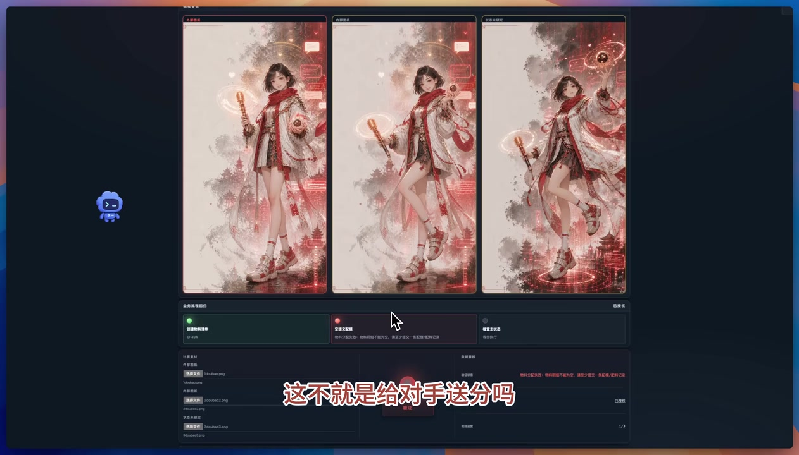
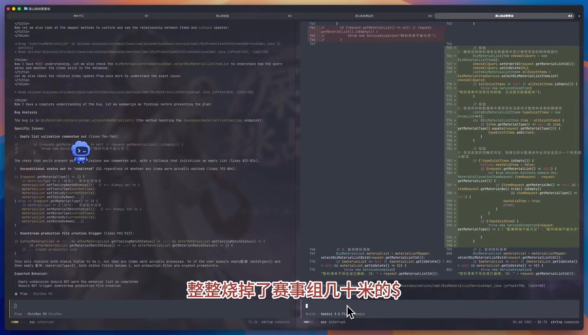

# 屎山BUG挑战赛|B组第二轮|Gemini3.5大战MiniMaxM3

> 来源：[Bilibili 视频](https://www.bilibili.com/video/BV13u796mEiu) 
> UP 主：Token就是词元｜合集：AIcode｜时长：09:05｜视频画面分辨率：3790 × 2160

## 小结

这是一场以体育赛事解说形式呈现的 AI 代码修复对抗：Gemini 3.5 Flash 与 MiniMax M3 分别处理三个预设 Bug——`B002`、`S001`、`G002`。视频将它们按“青铜、白银、黄金”难度组织，并通过修复后业务流程回归结果是否全绿来判定成功；若亮红灯，则说明修复失败或影响了其他代码。

比赛过程显示出鲜明的策略差异：Gemini 3.5 Flash 更快给出计划和修改，MiniMax M3 则明显更长时间地分析、反复等待或规划。速度并没有直接决定最后结果：MiniMax M3 在青铜题失误，但随后拿下白银题，并在黄金题第二次尝试成功；Gemini 3.5 Flash 则拿下前两题，却在黄金题两次验证均失败。

按视频明确说明的计分规则，青铜和白银各按一球计算；黄金题每位选手有两次机会，第一次答对得两球、第二次答对得一球。最终 Gemini 3.5 Flash 获得两球，MiniMax M3 也凭白银题和黄金题第二次修复追至两球，本场以 **2:2** 收束。视频并未给出完整小组积分表，因此不能据此进一步断言两者最终排名或出线结果。

对工程实践而言，视频最有价值的不是将某个模型简单评价为“更强”，而是展示了三点：快速方案可能被高迷惑性问题的表象带偏；冗长分析可提升方案覆盖面但会带来效率损失；最终应以可执行的回归验证结果，而非模型自述、计划长度或自我评价作为判据。

本视频属于特定挑战环境中的单场展示，不构成通用模型基准。题目完整提示词、仓库、测试集、运行环境、模型调用参数、成本与上下文配置均未在素材中完整公开；而且视频中的“已过去 20 分钟、40 分钟”等是解说所述的选手处理等待时间，并非视频播放时长，不能直接拿来作严格吞吐性能比较。

## 思维导图

## 目录

- [赛事背景、规则与证据边界](#赛事背景规则与证据边界)
- [开场与对抗环境](#开场与对抗环境)
- [B002：青铜 Bug，Gemini 先下一城](#b002青铜-buggemini-先下一城)
- [S001：白银 Bug，速度与方案完整性的反差](#s001白银-bug速度与方案完整性的反差)
- [G002：黄金 Bug，二次修复与追平](#g002黄金-bug二次修复与追平)
- [结果汇总与可迁移经验](#结果汇总与可迁移经验)
- [字幕比对](#字幕比对)
- [评论分析](#评论分析)
- [处理记录](#处理记录)

## [赛事背景、规则与证据边界](https://www.bilibili.com/video/BV13u796mEiu?t=0)

视频将本场定位为“第一届祖传 Bug 挑战赛”B 组第二轮的最后一场压轴对抗。解说称，这一场的胜负会影响全球八强出线希望：胜者并不保证出线，败者则会失去出线机会。这里是视频的赛事叙事，素材没有提供完整赛程、积分、同组全部对阵结果或官方赛制文档，因此只能记录其表述，不能推算最终晋级名单。

### 参赛对象与工具画面

对阵双方为：

- **Gemini 3.5 Flash**：视频多处称其为 Gemini 3.5 Flash；站内字幕中存在“GERMANY”“GERMAN”等明显音译/识别错误。
- **MiniMax M3**：视频口播和画面中的模型标识均指向 MiniMax M3；站内字幕偶有“MiniMax3”等省略写法。
- **交互界面**：关键帧显示双方均在 OpenCode 类终端/编码代理界面中工作。画面可见左右并排的两个工作区、计划输入区和代码/分析输出区。

> 图：画面将 MiniMax M3 与 Gemini 3.5 Flash 的 OpenCode 工作区并排展示，是确认本场为同步代码代理对比、而非单纯口播评价的重要视觉依据。界面中的人物背景图属于装饰，不能据此推断模型能力或运行环境。

### 赛题、验证与计分参数

视频在开场说明了以下可确认规则：

| 项目 | 视频中的设定 |
| --- | --- |
| Bug 编号 | `B002`、`S001`、`G002` |
| 难度称呼 | 分别被解说称为青铜、白银、黄金 Bug |
| 输入方式 | 复制提示词后开始比赛 |
| 语言 | 解说称双方均以英文交流 |
| 成功判据 | 修复后业务流程回归“全绿”，同时代表其他代码未被破坏 |
| 失败判据 | 红灯亮起，代表修复失败 |
| 黄金题机会 | 每名选手两次修复机会 |
| 黄金题得分 | 第一次答对算两球；第二次答对算一球 |

这里的“全绿”是综合回归判定，而不只是单个错误是否消失。因此它兼顾了两类要求：**修复目标缺陷**与**避免修改破坏既有业务代码**。素材未展示完整测试用例、断言或 CI 日志，无法进一步说明具体覆盖范围。

## [开场与对抗环境](https://www.bilibili.com/video/BV13u796mEiu?t=54)

比赛开始后，解说观察到 Gemini 3.5 Flash 比 MiniMax M3 更快进入方案输出阶段，并以调侃方式形容 MiniMax M3 对新事物较陌生、变得“畏手畏脚”。这属于解说风格化评价，不应当作模型内部状态的技术诊断。

关键帧显示双方在同一类编码环境中展开问题分析，但输出形态不同：左侧 MiniMax M3 的文本更侧重逐项排查，右侧 Gemini 3.5 Flash 的文本呈现较长篇幅的英文场景说明和分析内容。仅凭单帧无法确认完整上下文、提示词和实际 token 用量。

> 图：该帧直接呈现左右工作区的并行分析状态，并能帮助理解视频之后反复强调的“方案给出速度”和“分析篇幅”差异；它并不证明任一方输出的技术结论正确。

视频还提到 Gemini 3.5 Flash 在此前“大战 GPT”的比赛中曾有较长思考时间和较高成本，但这段内容没有提供前一场的原始数据、计价方式或 token 统计。因此，“烧掉赛事组几十米的刀乐”应理解为解说中的夸张表达，不能转换为可审计的成本指标。

## [B002：青铜 Bug，Gemini 先下一城](https://www.bilibili.com/video/BV13u796mEiu?t=130)

### 过程

在第一道青铜题中：

1. Gemini 3.5 Flash 先给出方案，并很快完成修改。
2. MiniMax M3 随后也给出方案，但解说认为其分析更详细、篇幅更长。
3. 视频跳过了 MiniMax M3 的完整修复过程，直接进入验证。
4. MiniMax M3 验证失败。
5. Gemini 3.5 Flash 验证成功。

解说将 MiniMax M3 的失误归因于“想太多”，并称青铜题无需从大量角度分析。这是比赛叙事下的主观看法；从工程角度，单次失败不能证明失败必然由分析过度造成，还可能受根因定位、改动边界、工具执行或隐藏测试影响。

> 图：画面中可见题目卡片和验证区域，红色状态与“送分”解说相对应，直观说明比赛的最终裁决依赖验证结果，而非模型生成文本看起来是否合理。

### 阶段比分

| Bug | MiniMax M3 | Gemini 3.5 Flash | 阶段结论 |
| --- | --- | --- | --- |
| `B002`（青铜） | 失败 | 成功 | MiniMax M3 暂时以 0:1 落后 |

视频在约 02:44 明确给出“Gemini 3.5 轻松拿下”“老师 0 比 1 落后”的阶段结果。

## [S001：白银 Bug，速度与方案完整性的反差](https://www.bilibili.com/video/BV13u796mEiu?t=178)

白银题 `S001` 被解说称为难度明显提高。视频呈现的过程不是完整实时录屏，而是经过压缩剪辑的比赛回顾；其中“已经过去 3 分钟”“31 秒改完”“20 分钟”“又过 10 分钟”等口播，指向选手在原始比赛环境中的等待/处理时长。

### 双方表现

**Gemini 3.5 Flash**

- 在双方都尚未完成时，再次先给出方案。
- 解说称其随后用约 **31 秒**完成修改。
- 最终验证成功。

**MiniMax M3**

- 在解说描述中持续追问 Bug 根因和修改是否可靠。
- 视频先后称其“已过去 20 分钟”仍在纠结，之后“又过 10 分钟”仍未交卷。
- 最终给出的方案被解说概括为包含：
  1. 理解现象；
  2. 追踪代码；
  3. 分析问题；
  4. 提供修复方案；
  5. 解释修改理由；
  6. 说明修改边界与约束。
- 点击验证后成功。

> 图：该帧中左侧为 MiniMax M3 的结构化分析，右侧为代码改动及中文注释区域。它有助于理解解说所称的“理解现象—追踪代码—分析问题—说明边界”的长方案风格；但截图无法替代完整 diff 和测试报告。

### 阶段结果与工程解读

白银题双方都修复成功，因此 Gemini 3.5 Flash 再得一球、MiniMax M3 得一球，比分变为 **MiniMax M3 1:2 Gemini 3.5 Flash**。

这一题揭示的不是“详细方案一定更好”或“快速方案必然更好”，而是两种可观察到的工作流：

| 工作流特征 | 可能收益 | 可见代价 |
| --- | --- | --- |
| 快速形成假设并修改 | 缩短等待时间；适用于根因明确的场景 | 若问题有误导性，容易基于错误假设过早提交 |
| 扩展分析、追踪调用与边界 | 有机会提升解释性和改动约束意识 | 处理时间显著增长；若陷入循环规划，可能延误提交 |

视频没有公开 `S001` 的源码、修复 diff 与回归清单，不能判断两者补丁质量是否等价，也不能把“31 秒”与“约 30 分钟”泛化为两个模型的固定性能参数。

## [G002：黄金 Bug，二次修复与追平](https://www.bilibili.com/video/BV13u796mEiu?t=395)

`G002` 是最后一道黄金题，也是影响本场结果的决定性环节。规则为每人两次修复机会：第一次成功得两球，第二次成功得一球。

### 第一次修复：双方均失败

Gemini 3.5 Flash 大约一分钟交卷并快速执行修改；MiniMax M3 随后也提交方案。验证结果为：

- MiniMax M3：第一次失败；
- Gemini 3.5 Flash：第一次失败。

视频将 `G002` 描述为“迷惑性太强”的问题：短时间内形成的方案容易被“障眼法”误导，把它误判成简单问题。这个说法与两者首次均失败的结果一致，但视频未公开隐藏条件或真正根因，不能据此确认具体迷惑机制。

### 第二次修复：Gemini 失败，MiniMax 成功

Gemini 3.5 Flash 第二次修改后，解说转述其表示已经测试并“终极验证成功”；但点击平台验证后仍然失败。这个反差强调了一个工程原则：**代理自身声称“测试成功”不等同于赛事或生产环境的完整回归通过**。

MiniMax M3 则在解说称“经过长达 40 分钟的漫长等待”后再次提交；第二次验证成功。由于属于第二次机会，其黄金题得一球。

> 图：界面集中展示多个卡片及底部验证区，适合说明本题不是只看文字答案，而是由系统状态和验证结果决定。图中红、绿状态也能帮助理解“首次失败、再次修复”的比赛机制。

### G002 结果

| 选手 | 第一次修复 | 第二次修复 | 黄金题得分 |
| --- | --- | --- | --- |
| Gemini 3.5 Flash | 失败 | 失败 | 0 |
| MiniMax M3 | 失败 | 成功 | 1 |

视频在约 08:01 后确认 Gemini 3.5 Flash 本场共两球；约 08:21 后确认 MiniMax M3 黄金题第二次修复成功，并将比分追平。

## [结果汇总与可迁移经验](https://www.bilibili.com/video/BV13u796mEiu?t=501)

### 本场比分

| 题目 | MiniMax M3 | Gemini 3.5 Flash | 说明 |
| --- | ---: | ---: | --- |
| `B002` 青铜 | 0 | 1 | MiniMax M3 失败，Gemini 成功 |
| `S001` 白银 | 1 | 1 | 双方均成功 |
| `G002` 黄金 | 1 | 0 | MiniMax M3 第二次成功；Gemini 两次失败 |
| **合计** | **2** | **2** | 本场追平 |

视频以“保留最后一丝出线希望”收尾，并表示小组赛尚有最后一轮。它没有发布最终积分和晋级结论，故本文不对后续结果作预测。

### 可迁移的调试步骤

结合视频可复用的流程，应优先建立在**可验证性**而不是“输出看似完整”之上：

1. **先明确可观测现象**：确定错误发生位置、触发条件与预期行为。
2. **限定修改边界**：识别允许修改的模块、不可触碰的接口和需要保持不变的业务行为。
3. **追踪调用链与状态变化**：特别检查输入为空、状态默认值、条件分支、循环和下游副作用。
4. **形成最小可验证修复**：不要只写解释；应落实为可执行的代码改动。
5. **运行目标验证与回归验证**：既验证目标 Bug 是否消失，也验证其他流程没有被破坏。
6. **失败后修正假设，而非重复原方案**：`G002` 表明首次方案可能被表象误导；第二次尝试应重新检查根因、遗漏条件和测试覆盖缺口。
7. **将模型自评与外部判定分开**：模型“已经测试成功”的表述只能作为待核实信息，最终以独立测试、CI 或验收系统结果为准。

### 适用范围与限制

- 本视频适合关注 AI 编码代理、代码修复验证和提示驱动调试流程的读者。
- 对抗中的昵称、戏谑评价、心理活动拟人化描述属于解说表达，不是可验证的模型机制说明。
- 题库、提示词全文、代码仓库、依赖版本、模型版本号、上下文窗口、工具权限、温度参数、执行成本与网络条件均未完整披露。
- 因缺少可复现实验条件，本场 2:2 只能说明两者在该视频展示的三道题上的结果，不能作为通用代码能力、稳定性、成本或速度排行。
- 视频发布于 2026 年；AI 模型、产品名称、接口策略与实际行为可能已变化。本文仅整理视频素材所呈现的当时信息。

## 字幕比对

本次同时检查了站内字幕与 ASR 结果。ASR 诊断中**没有** `noAudioStream=true` 标记，且音频时长为约 544.02 秒、语音覆盖约 93.31%，因此源视频存在音轨；ASR 不是工具失败，也不需要转入无音轨处理流程。

| 字幕来源 | 完整性 | 专有名词 | 时间轴 | 主要问题 |
| --- | --- | --- | --- | --- |
| Bilibili 站内字幕 | 覆盖 00:00 至 09:04，分段细，接近完整 | 存在“GERMANY”“GERMAN”“GBT”等误写；MiniMax M3 常简写为 MiniMax3 | 可直接使用；与视频总时长和叙事阶段匹配 | 个别口语、英文词和术语被错转写，如“全绿”等表述有杂音 |
| 本次 ASR（medium，zh） | 24 段，语音覆盖率 93.31% | 同样大量误识别，如 Germany/Germanny、Germani 3.0、GBT、POA 等 | 首段从 00:31.360 开始，却已包含开场 00:00 的内容，且每段约 24 秒，时间对齐不可靠 | 分段过粗、首段内容压缩严重、专有名词误识别较多，不能单独承担章节定位 |

### 最终字幕选择与校正

正文以**站内 SRT 的起止时间**作为时间轴链接依据，因为它提供了从 00:00 起的细粒度真实分段；同时对照本次 ASR，确认两者叙事内容总体一致，并据元数据、标题、标签和关键帧进行术语校正。

重要校正如下：

| 原始错误写法 | 正文采用写法 | 校正依据 |
| --- | --- | --- |
| GERMANY / GERMAN / Germanny / Germani | Gemini 3.5 Flash | 视频标题、标签 `Gemini3.5`、关键帧中的模型标识与上下文 |
| MiniMax3 / minimux3 | MiniMax M3 | 视频标题、标签 `MiniMaxM3`、画面模型标识 |
| GBT | GPT | 解说上下文中的“大战 GPT”；素材不足以确认具体 GPT 型号 |
| POA | PUA | 对应口播“我们一顿 PUA 之后”的网络口语表达 |
| “业务流程回归权率”等 | 业务流程回归全绿 | 站内字幕原句语义、比赛绿灯/红灯规则与画面验证区共同支持 |

## 评论分析

以下仅分析可获取的热评前三条，均为观众观点，不作为已经验证的模型能力或赛事事实。

1. **蝶引涟漪（139 赞）**  
   > “我已经写好黑 m3 的话了，没想到这个黄金 bug 他又做对了，浪费了我绝妙的点子[doge]”

   评论呼应了视频的反转叙事：MiniMax M3 前期失误、后期在黄金题第二次修复成功。其核心不是技术分析，而是以玩笑方式表达对结果逆转的意外。它侧面反映观众关注“能否翻盘”的赛事张力，但不能证明 MiniMax M3 的总体能力。

2. **中三（113 赞）**  
   > “我说一天不看这比赛吃不下饭有没有懂的”

   该评论评价的是系列内容的追更吸引力和娱乐性，没有补充赛事规则、模型参数或技术证据。较高点赞说明在当前可见互动样本中，赛事化包装获得了部分观众认可。

3. **海面烧烧炮（65 赞）**  
   > “挺有意思的，别的AI博主都在用AI偷懒，UP这单口相声，直观对比，可以单开一个赛道了”

   评论肯定了“单口相声式解说 + 直观对比”的内容形式，认为其与常见 AI 内容有差异化。这里的“直观对比”是观众感受，不等于实验设计已经严谨；视频仍缺少公开题库、运行条件与统计样本，因而不应把其娱乐呈现直接等同于标准化评测。

## 处理记录

- **Worker ID**：`worker-mrj0wbly-5dc4e50c`
- **整理模型**：`gpt-5.6-terra`
- **素材与工具记录**：
  - Bilibili 元数据与统计信息；
  - 站内字幕：`p01-ai-zh.srt`；
  - 本次 ASR：`asr/asr-result.json`、`asr/transcript.srt`，识别模型为 `medium`，语言 `zh`，CUDA、`float16`；
  - 关键帧：`frames/frame-001.jpg` 至 `frames/frame-012.jpg`；
  - 热评数据：`comments/comments.json`，仅使用可获取前三条。
- **字幕选择**：采用站内 SRT 的时间段生成章节链接；ASR 用于交叉核验内容。由于 ASR 首段时间错位、段落过粗且专有名词误识别较多，未采用其时间戳定位。
- **关键帧选择依据**：选用 `frame-001` 展示双方并列工作区、`frame-002` 展示并行分析状态、`frame-003` 展示分析与代码改动、`frame-004` 展示验证区域与状态卡片；均服务于赛制、过程和结果理解，未将装饰性背景视为技术证据。
- **缓存清理**：提供的素材未包含缓存清理执行日志，无法确认是否已执行清理；本记录不虚构清理结果。
- **未解决问题**：未提供三个 Bug 的完整提示词、源码、补丁 diff、测试日志、模型调用配置、实际等待时间原始记录及完整小组积分，因此无法复现比赛或评估统计显著性。
