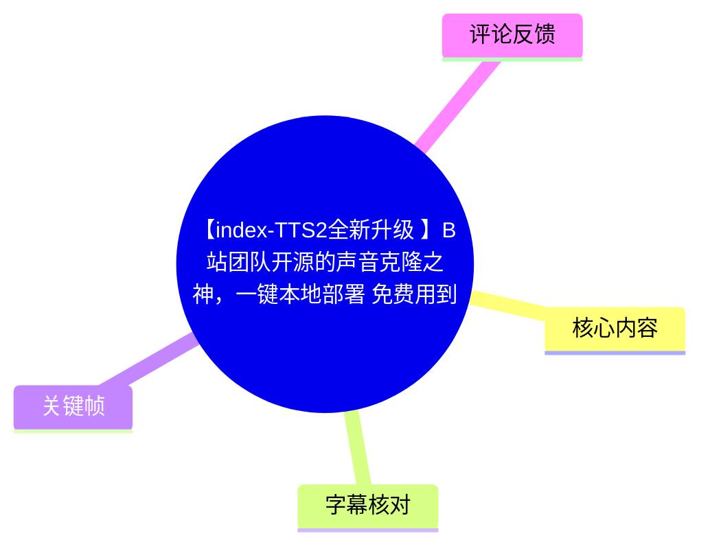
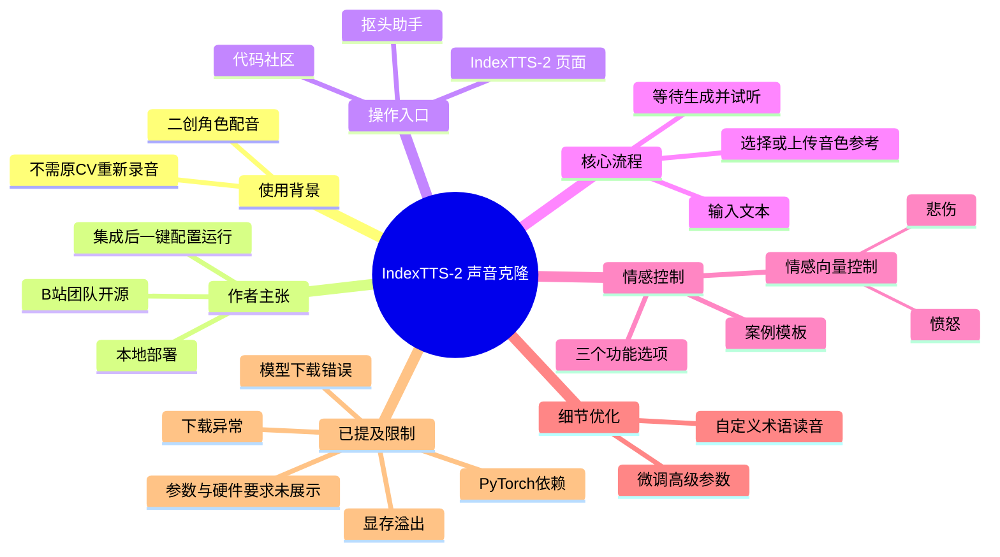
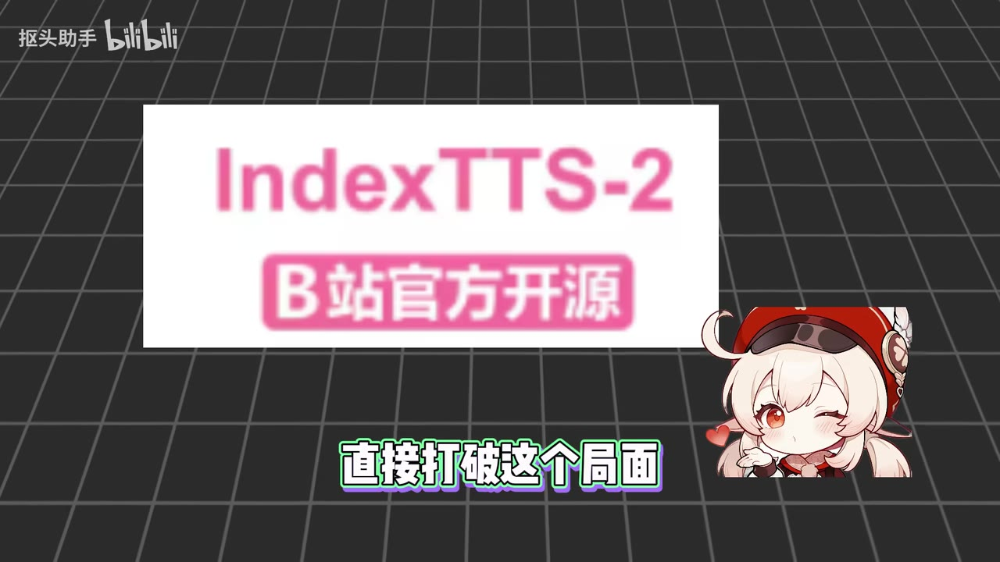

# 【index-TTS2全新升级 】B站团队开源的声音克隆之神，一键本地部署 免费用到入土

> 来源：[Bilibili 视频](https://www.bilibili.com/video/BV19JGQ6eE7o) 
> UP 主：抠头助手｜视频时长：02:55｜分辨率：1920×1080  
> 本文仅整理视频及所给素材中可确认的信息；“永久免费”“一键部署”等为视频作者的陈述，不等同于独立测试结论。

## 小结

视频介绍的是 **IndexTTS-2**：作者将其描述为由 B 站团队开源的声音克隆工具，并展示了经其整合后，在“抠头助手”软件的“代码社区”中进行一键配置与运行的流程。视频主张该方案可本地部署，部署后可长期免费使用，且相较市面上部分工具更易上手。

内容从原神二创配音现象切入，说明声音克隆可用于让角色以接近原角色音色的方式朗读新文案。作者强调，工具不仅关注“像不像”，还提供了调节生成声音情感的能力。

实际操作层面，视频展示的界面至少包含三类主要区域：**音色参考、文本输入、生成结果**；下方另有三个用于调整声音情感的功能选项，并配有可一键套用的案例模板。视频明确演示了上传本地音频、输入文案、等待生成、试听结果，以及使用“情感向量控制”调节悲伤和愤怒。

作者提到自己在整合运行环境时处理过显存溢出、音频下载异常、PyTorch 依赖缺失、模型下载错误等问题。这意味着“一键配置”是针对视频中“抠头助手”内所展示的集成入口；若直接自行部署原项目，仍可能需要面对显存、网络下载、依赖和模型资源等环境问题。

视频未给出模型版本号、显存容量要求、CPU/GPU 配置、推理耗时、音频格式限制、具体三个情感功能的完整名称、参数范围或软件下载地址。因此，不能据此推导实际硬件门槛、效果上限或离线程度。尤其是热评提出“为什么要联网”，视频没有直接回应；作者提到的模型/音频下载问题只能表明运行或首次配置过程可能涉及网络资源，不能据此断言该工具的全部功能都必须联网。

## 思维导图

## 目录

- [背景：二创配音与声音克隆问题（00:00）](#背景二创配音与声音克隆问题0000)
- [工具定位与作者主张（00:10）](#工具定位与作者主张0010)
- [集成部署入口与环境踩坑（00:34）](#集成部署入口与环境踩坑0034)
- [界面结构与模板化情感控制（01:22）](#界面结构与模板化情感控制0122)
- [实操：上传参考音频并生成（01:46）](#实操上传参考音频并生成0146)
- [情感向量、术语读音与高级参数（02:11）](#情感向量术语读音与高级参数0211)
- [完整操作步骤与信息缺口（02:34）](#完整操作步骤与信息缺口0234)
- [限制、适用范围与时效性（02:34）](#限制适用范围与时效性0234)
- [字幕比对](#字幕比对)
- [评论分析](#评论分析)
- [处理记录](#处理记录)

## 背景：二创配音与声音克隆问题 [00:00](https://www.bilibili.com/video/BV19JGQ6eE7o?t=0)

视频开头使用原神角色二创片段作为引子，提出一个常见疑问：二创视频中的角色新台词是如何获得接近原角色的声音效果的？作者给出的答案不是请原始配音演员重新录制，而是使用声音克隆工具。

这里的“声音克隆”在视频中的工作目标可概括为：

1. 提供一段可作为音色依据的参考声音；
2. 输入新的文本内容；
3. 由工具生成与参考音色接近的朗读结果；
4. 进一步调节生成声音的情感表现。

> 图：关键帧展示了多名原神角色形象及对话场景。它直观说明视频所指向的应用背景是角色二创配音，而非真人录音教学；画面顶部还标注了素材来源 BV17HXNYmEix。

## 工具定位与作者主张 [00:10](https://www.bilibili.com/video/BV19JGQ6eE7o?t=10)

作者认为，现有声音克隆工具的常见使用障碍包括：

- 配置或使用过程复杂，不利于新手上手；
- 存在次数限制或付费会员机制；
- 生成的声音在相似度、情感表现方面不够理想。

随后视频引出 IndexTTS-2。依据视频口播及画面文字，作者对它作出如下定位：

| 项目 | 视频中可确认的表述 | 需注意的边界 |
| --- | --- | --- |
| 工具名称 | IndexTTS-2 | 本次 ASR 多处误识别为 “Index TES 2”，已按画面中的 “IndexTTS-2” 校正。 |
| 来源定位 | “B站团队开源” | 视频未展示代码仓库、许可证或具体开发团队信息，本文不延伸核验。 |
| 部署方式 | 支持本地部署 | 未展示原生项目的完整命令行部署过程。 |
| 费用说法 | 部署后可“永久免费使用” | 这是作者宣传性表述；硬件、电力、网络与可能的第三方服务成本均未在视频中讨论。 |
| 操作体验 | 作者称操作简单、声音更像且更有情感 | 视频展示了案例，但没有横向评测、客观指标或盲测。 |

> 图：关键帧中心文字为“IndexTTS-2”“B站官方开源”，是校正 ASR 中工具名称并理解作者产品定位的直接画面依据。画面中的“官方”属于视频呈现的宣传文字，未在本素材中获得外部材料验证。

## 集成部署入口与环境踩坑 [00:34](https://www.bilibili.com/video/BV19JGQ6eE7o?t=34)

作者在进入具体操作前，先说明环境配置曾耗费不少时间，并列举了实际遇到的问题：

- **显存溢出**；
- **音频下载异常**；
- **PyTorch 依赖缺失**；
- **模型下载错误**。

随后作者称，已将该工具开发/整合到“抠头助手”中。视频给出的入口顺序是：

1. 打开“抠头助手”软件；
2. 进入“代码社区”；
3. 找到“IndexTTS-2 B站开源声音克隆”；
4. 点击进入；
5. 使用一键配置与运行功能。

这段内容的关键经验在于：视频展示的是一个已集成的使用入口，目的是把底层环境配置封装起来。它并没有证明任何设备都能无条件成功运行，也没有给出显存阈值、Python 版本、CUDA 版本、PyTorch 版本、模型体积或下载镜像信息。

> 图：关键帧中出现 “IndexT…” 的工具名称动效，能够与口播中的工具介绍阶段相互印证。该帧不含安装命令或硬件参数，因此不能用作配置细节的依据。

### 关于“联网”的素材边界

热评中有用户提问“为什么要联网”。视频没有在口播中回答这一问题。仅根据作者自己提到的“音频下载异常”和“模型下载错误”，可确认其处理过程中涉及下载环节；但以下问题均未被视频说明：

- 首次安装是否必须联网；
- 模型下载完成后，生成阶段是否可完全离线；
- 集成软件是否有账户验证、更新检查或在线接口；
- 是否使用第三方音频下载来源。

因此，“本地部署”不能在本视频素材范围内被等同为“全过程绝对离线”。

## 界面结构与模板化情感控制 [01:22](https://www.bilibili.com/video/BV19JGQ6eE7o?t=82)

工具运行后，作者描述界面为较简洁的结构，包含：

| 界面区域/功能 | 视频说明 |
| --- | --- |
| 音色参考 | 用于选择或指定需要模仿的声音。 |
| 文本输入 | 输入待生成的文案。 |
| 生成结果 | 位于下方，用于查看或试听输出。 |
| 三个功能选项 | 用不同方式调节生成声音的情感。 |
| 案例模板 | 每项功能下均有案例模板，点击即可一键使用。 |

视频只明确说有“三个功能选项”，但并未在提供的字幕中完整念出三个功能的名称和各自参数。因此，除了后续实际展示的“情感向量控制”外，其他两个功能不应擅自命名。

作者在本段还播放了模板或示例音频片段，但 ASR 对具体内容识别不完整，无法可靠还原；本文不将其作为功能参数或示例文案记录。

## 实操：上传参考音频并生成 [01:46](https://www.bilibili.com/video/BV19JGQ6eE7o?t=106)

作者说明，除了使用工具自带的音色模板外，也可以自行上传本地音频。演示选择了原神角色“瑶瑶”的声音作为参考，并播放了角色原始台词片段：

> “晚上还要出门吗？嗯，什么时候才能回来呀？天色已晚，小心为上哦。”

随后作者表示，在选中音频后，于文本框中输入需要生成的文案。

这一步反映出视频中可复用的最小生成流程：

1. 不使用内置模板时，点击上传本地音频；
2. 选定音色参考文件；
3. 在文本区域输入目标文案；
4. 发起生成；
5. 等待生成完成并试听。

视频后续的生成结果朗读为：

> “大家好，我是瑶瑶。”

该结果用于展示克隆完成后的音色效果，但视频没有给出参考音频时长、格式、采样率、是否需要降噪、文本长度上限、生成耗时或输出文件格式，故不能补写这些参数。

## 情感向量、术语读音与高级参数 [02:11](https://www.bilibili.com/video/BV19JGQ6eE7o?t=131)

声音克隆完成后，作者继续展示情感调整。其中明确演示的是 **情感向量控制**：

- 将“悲伤”和“愤怒”两个维度均拉满；
- 再次试听生成结果；
- 用以说明生成声音可在克隆后继续调整情绪倾向。

由于素材只说明“拉满”，没有显示或口述具体数值、滑块范围、默认值与调整后的完整试听文本，本文只能记录其操作方向，不能给出数值参数或效果强度结论。

此外，作者在结尾提到两类用于细节处理的能力：

| 功能 | 视频中的用途 |
| --- | --- |
| 自定义术语词汇读音 | 规定文本中特殊术语的发音。 |
| 微调高级参数 | 处理生成细节，使最终声音尽可能更流畅、自然。 |

“更流畅、更自然”是作者对调参目标的描述，并非由视频提供的客观质量测试。高级参数的具体名称、调整范围及推荐组合均未展示。

## 完整操作步骤与信息缺口 [02:34](https://www.bilibili.com/video/BV19JGQ6eE7o?t=154)

### 按视频顺序整理的操作清单

1. **进入集成入口**：打开“抠头助手”，在“代码社区”找到 IndexTTS-2 对应项目。
2. **配置并运行**：点击项目后进行作者所称的一键配置与运行。
3. **确认界面区域**：识别音色参考、文本输入和生成结果位置。
4. **确定参考音色**：可使用工具预设音色模板，或点击上传本地音频。
5. **输入文本**：填写要让目标音色朗读的文案。
6. **生成并试听**：等待任务完成，在生成结果处试听。
7. **调整情感**：使用界面下方三个功能选项中的相应功能；视频实际示例为情感向量控制。
8. **处理发音与细节**：对特殊术语设置读音；必要时微调高级参数。
9. **再次生成/试听**：根据听感迭代调整。视频虽未逐帧展示反复迭代，但该步骤是“调节后再听一下”所明确呈现的操作闭环。

### 本视频未给出的关键参数

以下信息对实际复现很重要，但素材中没有提供：

- IndexTTS-2 的版本号、项目地址和下载地址；
- “抠头助手”的版本、系统兼容性和安装方式；
- 显卡型号、最低/推荐显存、CPU 内存需求；
- Python、CUDA、PyTorch 的具体版本组合；
- 模型下载地址、模型大小及是否支持断点续传；
- 参考音频的格式、时长、质量和授权要求；
- 生成文本长度上限、生成耗时、并发能力；
- 三个情感功能的完整名称；
- 情感向量和高级参数的数值范围与推荐预设；
- 输出音频格式、采样率与保存位置。

## 限制、适用范围与时效性 [02:34](https://www.bilibili.com/video/BV19JGQ6eE7o?t=154)

### 适用范围

从视频所示案例看，该流程适合希望快速制作角色二创配音、为文本生成指定音色朗读、或尝试对生成声音增加情感变化的用户。它更像是一段面向新手的工具入口与功能概览，而不是完整的原生部署文档或音频质量评测。

### 已明确的限制与风险点

1. **环境并非没有门槛**：作者本人已遇到显存、依赖和下载错误；集成方案是否能覆盖所有设备和环境，视频没有证明。
2. **“永久免费”范围不明**：视频没有界定软件、模型、网络服务和未来版本的费用边界。
3. **本地与联网边界不明**：视频提到了下载相关异常，却未解释联网需求和离线运行范围。
4. **效果缺乏量化验证**：视频提供试听示例，但未提供与其他工具的统一测试、相似度指标或情感质量指标。
5. **声音素材的使用边界未讨论**：视频用游戏角色语音作示例，但未说明参考音频、生成声音和发布内容在不同平台/场景中的授权或规则要求。
6. **参数不可复现**：关键硬件、模型与调参参数缺失，观众无法仅依本视频重建完全一致的环境与效果。

### 时效性说明

视频元数据的发布时间为 2026-05-28。软件集成入口、模型可下载性、依赖版本、网络资源、功能界面和收费策略都有可能在后续版本中变化。本文只反映视频抓取时的素材内容，不应视为当前仍然有效的安装说明或产品承诺。

## 字幕比对

| 字幕来源 | 完整性 | 专有名词 | 时间轴 | 主要问题 |
| --- | --- | --- | --- | --- |
| Bilibili 站内字幕 | 未提供可用字幕 | 无从核验 | 无从核验 | 字幕工具返回 `Invalid URL`，素材中没有可用的站内 SRT。 |
| 本次 ASR 字幕 | 覆盖较完整：8 段、语音覆盖约 160.52 秒，占视频约 91.75% | 存在误识别 | 有效：0.000–174.700 秒 | 工具名、技术名词和部分角色名存在错字或音近字；个别示例内容不完整。 |

本次 ASR 使用 `medium` 模型，语言识别为中文，置信概率为 `0.9931640625`，运行于 CUDA / float16。ASR 诊断中**没有** `noAudioStream=true` 标记，且成功取得约 174.96 秒音频并输出带时间戳的语音片段，因此本视频属于有音轨素材，不存在“无音轨改用画面理解”的情形。

最终采用策略为：**以本次 ASR 的真实时间戳为时间轴基础，结合关键帧及上下文校正明显的专有名词；不凭空补全 ASR 未识别的参数。**

| ASR 原始识别 | 校正写法 | 校正依据 |
| --- | --- | --- |
| `Index TES 2` / `Index TES` | `IndexTTS-2` | 关键帧画面直接显示“IndexTTS-2”。 |
| `Hitorch` | `PyTorch` | 作者在环境依赖语境中提到依赖缺失；“PyTorch”是与该发音和上下文相符的技术名称。 |
| `声音客隆` / `克隴` | 声音克隆 | 同音误识别，且与视频主题一致。 |
| `部罳后` | 部署后 | 语义与上下文校正。 |
| `摇摇` | 瑶瑶 | 视频口播说明为原神中的角色，常用角色名为“瑶瑶”；此项为基于上下文的名称规范化。 |

## 评论分析

仅处理本次可获取的热评前三条。三条评论点赞数均为 0，且均为用户表达，不能作为产品事实或技术结论。

| 评论者 | 评论内容 | 可提取观点 | 分析 |
| --- | --- | --- | --- |
| 凉茶火锅 | “区完了” | 语义不完整，可能是简短感叹或输入不完整。 | 未提供可验证的功能、使用体验或争议信息，无法展开技术分析。 |
| 不二花美男 | “为什么要联网” | 对工具是否联网、以及本地部署边界提出疑问。 | 这是最具信息价值的疑问。视频未正面回答；作者仅提到音频下载和模型下载相关问题，不能据此确认联网机制或离线能力。 |
| 肥猪三 | “大佬，三连了，求求发一下[星星眼]” | 用户希望作者发布某项资源，但对象未明确。 | 可能反映观众期待获取软件、教程或资源，但评论未说明具体所求内容，不能推断作者承诺或资源可用性。 |

## 处理记录

- **Worker ID**：`worker-mrj0wbly-5dc4e50c`
- **整理模型**：`gpt-5.6-terra`
- **ASR 模型与运行信息**：`medium`；中文自动识别；CUDA；float16；音频时长约 174.96 秒。
- **使用的素材工具/产物**：视频合并文件 `merged.mp4`、音频 `audio/audio.wav`、关键帧目录 `frames/`、ASR 分段结果 `asr/asr-result.json`、ASR 时间轴字幕 `asr/transcript.srt`、评论文件 `comments/comments.json`。
- **站内字幕检查**：已检查。站内字幕未提供可用结果；素材记录显示字幕工具失败原因为 `Invalid URL`。
- **字幕选择**：采用本次 ASR SRT 作为全部章节时间轴依据；站内字幕不可用。对 `IndexTTS-2`、`PyTorch`、声音克隆及“瑶瑶”等明显误识别项，使用关键帧或上下文进行有限校正。
- **关键帧选择依据**：选用 `frame-001.jpg` 说明二创角色配音背景，选用 `frame-003.jpg` 直接确认工具名及“B站官方开源”的画面表述，选用 `frame-004.jpg` 辅助对应工具介绍阶段；未将没有展示参数或界面的关键帧用于推断技术配置。
- **评论范围**：仅分析素材中可获取的热评前三条，未扩展至其他评论。
- **缓存清理**：未提供缓存清理执行记录或回执，无法确认是否已清理；不作已清理的虚假声明。
- **未解决问题**：原项目地址、许可证、具体集成软件版本、硬件与依赖要求、模型下载机制、联网边界、参考音频限制、参数范围及效果评价指标均未在素材中给出。
