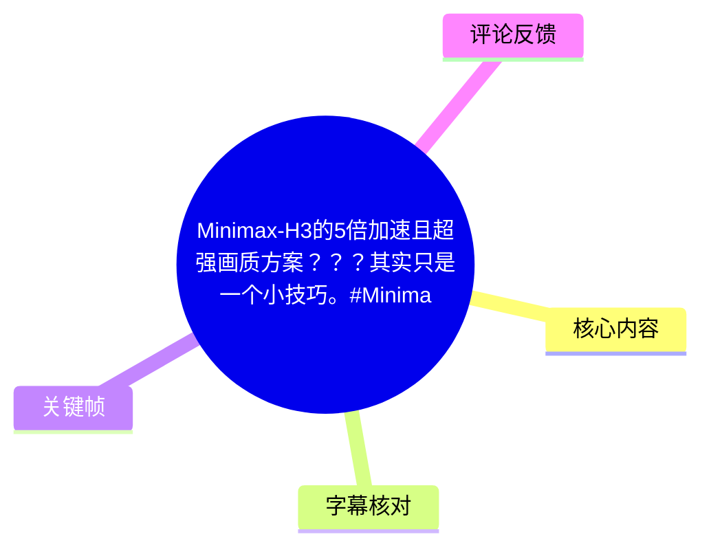
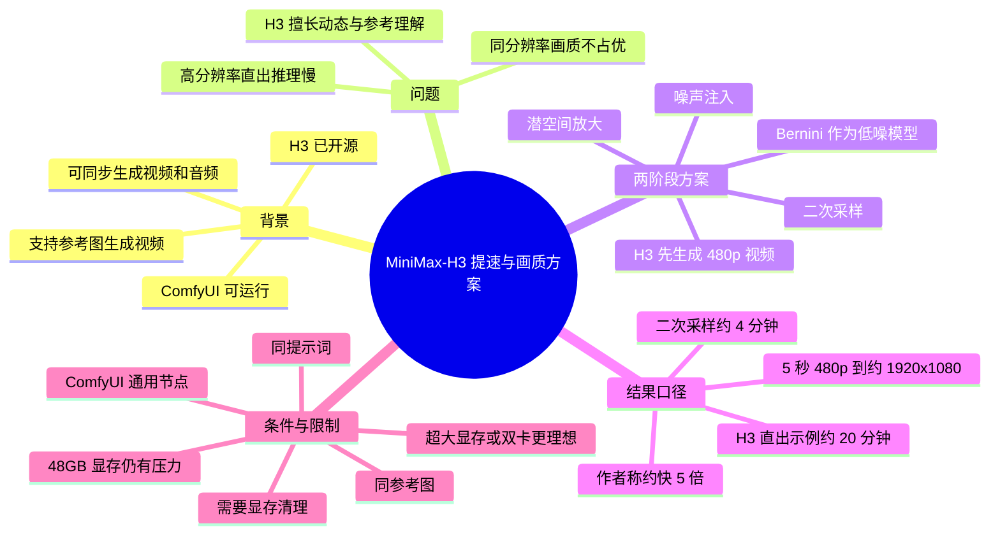
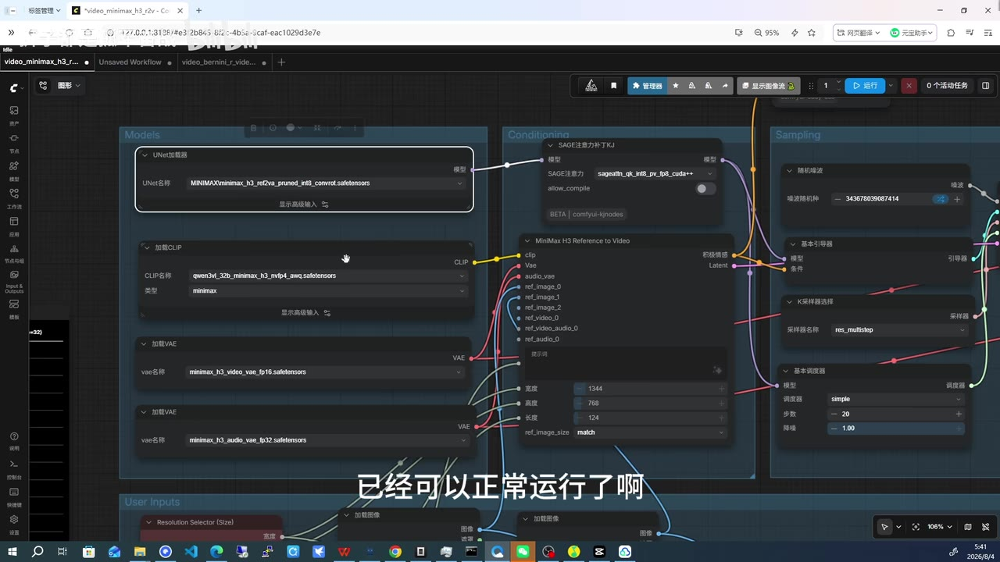
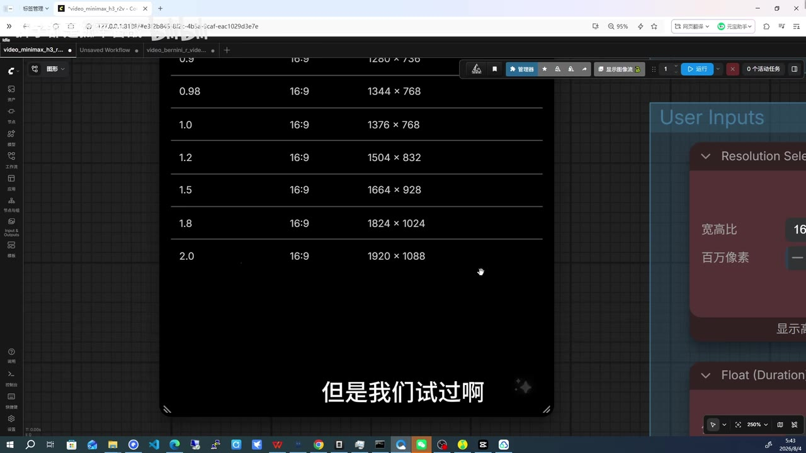
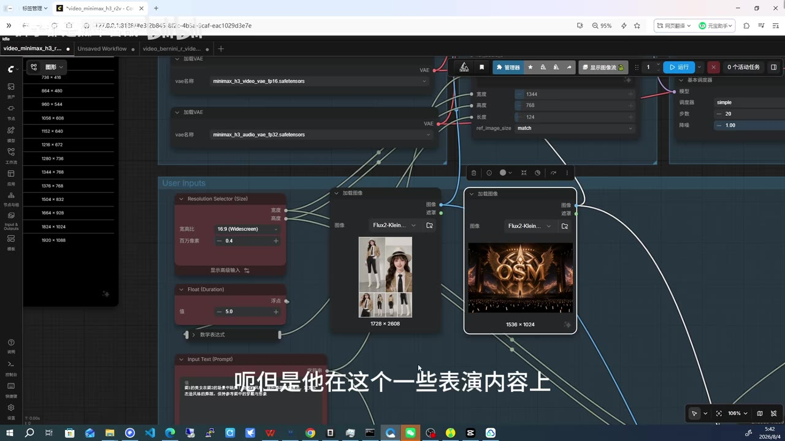
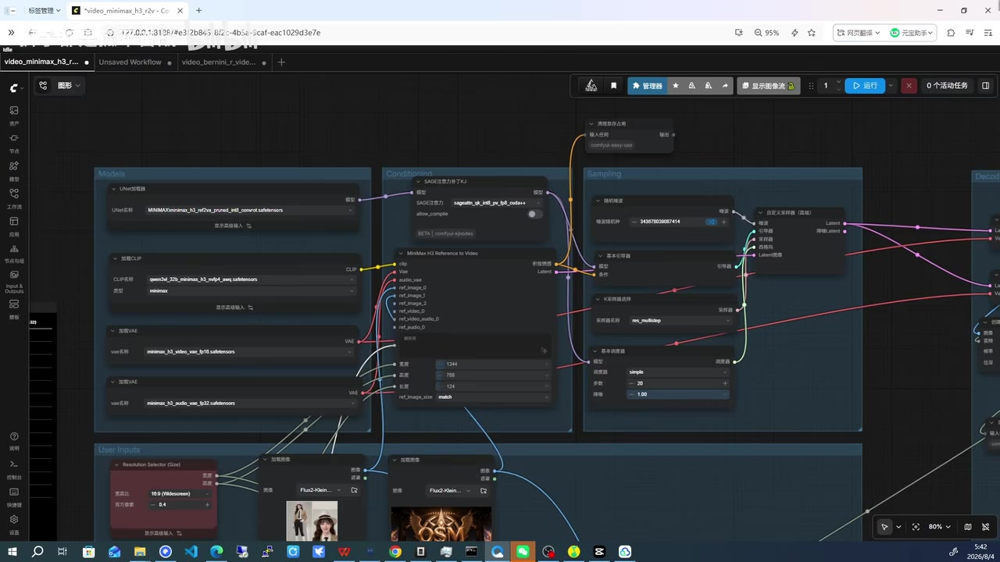

# Minimax-H3 的 5 倍加速且超强画质方案：用 Bernini 二次采样替代 H3 直出高分辨率

> 来源：[Bilibili 视频](https://www.bilibili.com/video/BV1zMMf6nEYM)  
> UP 主：狮子都是孤军奋战｜时长：08:02｜合集：AIcode  
> 本视频讨论的是开源视频模型 **MiniMax-H3** 在 ComfyUI 中的工作流优化；标题中的“5 倍加速”是作者在其测试条件下，对 **5 秒视频由 480p 逐级处理至约 1920×1080** 的对比结果，并非对所有硬件、模型版本和视频时长均成立的通用基准。

## 小结

视频分享了一个面向 MiniMax-H3 的两阶段视频生成方案：先让 H3 在较低分辨率（作者重点使用 480p）生成视频，再使用 **Bernini** 的低噪模型进行二次采样、潜空间放大与噪声注入，从而将画质提升到 720p，并可继续扩展至约 1920×1080。

作者对 H3 的定位很明确：它在**动态、物理规律和参考图理解**方面表现较强，且支持参考图生成视频、视频与音频同步生成；但在相同分辨率下，作者认为其画质不是优势。直接以高分辨率运行 H3 会显著拉长推理时间，因此低分辨率先出动态、后续交由另一模型补画质，是该工作流的核心分工。

作者给出的关键实测口径是：在 RTX 4090 级别显卡上，H3 的 480p、5 秒视频约可在 40 多秒完成；若让 H3 直接输出约 1920×1080，可能需要 20～30 分钟。采用 H3 生成 480p、再以 Bernini 二次采样放大到约 1920×1080的方式，作者称 5 秒视频约需 4 分钟，因此相对“20 分钟直出”的示例约快 5 倍。

该方法的关键前提是 **H3 与 Bernini 都支持多参考输入**：两阶段应使用同一套参考图与同一段提示词。视频强调不需要额外的自定义节点，主要通过 ComfyUI 通用节点即可完成；但模型切换对显存有明显压力，尤其在 48GB 显存环境中需要在各环节清理显存，否则会发生反复加载、卸载模型的额外开销。

适合已经会使用 ComfyUI、能理解模型加载、采样、VAE、参考图与显存管理的本地 AI 视频用户。视频未提供可导入的完整工作流文件、Bernini 的精确版本、所有采样器和噪声参数，因此可复现的是思路与已明确披露的部分参数，而不是一份可逐项照抄的配置单。

## 思维导图





## 目录

- [模型状态、能力与定位](#模型状态能力与定位)
- [性能瓶颈：480p 为何成为起点](#性能瓶颈480p-为何成为起点)
- [核心方法：H3 高噪生成与 Bernini 低噪重绘](#核心方法h3-高噪生成与-bernini-低噪重绘)
- [效果与速度：作者的 5 倍计算口径](#效果与速度作者的-5-倍计算口径)
- [实操流程、参数与显存管理](#实操流程参数与显存管理)
- [限制、适用范围与时效性](#限制适用范围与时效性)
- [字幕比对](#字幕比对)
- [评论分析](#评论分析)
- [处理记录](#处理记录)

## [模型状态、能力与定位](https://www.bilibili.com/video/BV1zMMf6nEYM?t=5)

### [H3 已开源，并可在 ComfyUI 正常运行](https://www.bilibili.com/video/BV1zMMf6nEYM?t=5)

作者称 MiniMax-H3 在视频录制前一天开源，并判断它会成为近期较受开源社区关注的模型之一。这是视频发布时点的资讯性陈述，后续仓库状态、模型权重、ComfyUI 支持方式均可能变化。

在作者实测环境中：

- H3 已能在 **ComfyUI** 中正常运行。
- 工作流支持以**参考图生成视频**。
- 作者称其能同时生成视频和音频。
- 作者主观判断其参考图遵循准确性“基本等于”一个被 ASR 识别为“Cdance2”的系统水准；该专名在音频中不够清晰，无法据素材确认其标准写法，因此保留 ASR 近似转写，不将其扩展为已验证的产品名称。
- 在复杂表演内容上，作者认为 H3 尚难达到上述对比对象的复杂流程能力，但仍代表开源视频能力向前推进。



> 图：画面展示 ComfyUI 工作流的模型区、`MiniMax H3 Reference to Video` 条件节点和采样区域。它直接佐证视频并非只停留在概念讨论，而是在展示可运行的节点工作流；节点中可见多个参考图输入端口，也与作者所说的“多参考”能力相呼应。

### [H3 的优势与不足：动态优先，画质交给后段](https://www.bilibili.com/video/BV1zMMf6nEYM?t=178)

作者在提出方案时，将两种模型分工概括为：

| 模块 | 作者在视频中的定位 | 在工作流中的职责 |
| --- | --- | --- |
| MiniMax-H3 | 更擅长动态分析、参考理解、对物理规律的理解 | 先生成低分辨率视频，保留动作与参考约束 |
| Bernini | 相同分辨率下画质更强；作者称其承继 WAN 2.2 体系的画面质量基础 | 作为低噪模型，对 H3 结果二次采样、重绘和放大 |

这里的“更强”“画质更好”均为作者的经验判断与其展示结果，不等同于独立基准测试。视频也未展示统一数据集、客观画质指标或多个随机种子的统计对照。

作者指出，H3 若要提高画质，通常需要提高分辨率；而分辨率上升会带来更长推理时间。因此，本方案不是试图让 H3 自身在高分辨率下完成全部任务，而是把“动态生成”和“清晰化/放大”拆开。

## [性能瓶颈：480p 为何成为起点](https://www.bilibili.com/video/BV1zMMf6nEYM?t=43)

### [作者的低分辨率速度测试](https://www.bilibili.com/video/BV1zMMf6nEYM?t=43)

作者使用“官方版的 int8 版本”进行测试；ASR 将该词识别为“Intel 8”，结合上下文更可能是在说 `int8` 量化版本，但素材未给出模型文件的正式量化标签，故以“作者所称官方 int8 版本”记录。

视频中可确定的性能口径如下：

| 项目 | 作者陈述 |
| --- | --- |
| 显卡参照 | RTX 4090 级别环境 |
| 低分辨率目标 | 480p |
| H3 低分辨率耗时 | 约 40 多秒生成一个视频 |
| 高分辨率支持 | 画面配置列表中可见 `1920 × 1088`；口述中多次以约 `1920 × 1080` 表达 |
| H3 直接高分辨率耗时 | 作者称可能为 20～30 分钟，后续用于对比的示例按约 20 分钟计算 |
| 示例视频长度 | 5 秒 |

作者把 480p 称为“甜蜜点”：它虽然不适合作为最终成片分辨率，但能以较低成本先生成素材。视频明确承认“480p 本身没用”，其价值在于作为后续二次处理的输入。



> 图：画面中的分辨率表列出多档 16:9 尺寸，最高可见 `1920 × 1088`。这有助于理解视频口述“1920×1080”与界面实际可选 `1920×1088` 之间可能存在的近似表达或模型尺寸对齐差异。

### [为什么不直接让 H3 输出高分辨率](https://www.bilibili.com/video/BV1zMMf6nEYM?t=77)

作者的因果链是：

1. H3 在 480p 下可在约 40 多秒完成 5 秒视频。
2. 提升到约 1920 宽度时，H3 推理时间会急剧上升。
3. 直接高分辨率输出既慢，且作者认为 H3 的核心优势并不是同分辨率画质。
4. 因此应当把 H3 用于其擅长部分，再用画质更有优势的低噪模型处理输出。

视频提到 H3 支持 `1920×1088`，而作者后续比较中说“1920×1080”。在不额外查证模型规格的前提下，应将其理解为作者围绕 1080 级 16:9 输出所作的近似描述；不能把两者强行视作完全相同的技术参数。

## [核心方法：H3 高噪生成与 Bernini 低噪重绘](https://www.bilibili.com/video/BV1zMMf6nEYM?t=119)

### [旧思路与 H3 的缺口](https://www.bilibili.com/video/BV1zMMf6nEYM?t=127)

作者先回顾了此前在 WAN 体系中使用过的二次采样玩法：对视频进行二次采样，并在过程中加入噪声、执行放大。作者尝试让 H3 自身完成类似的“对自身潜空间二次采样”效果，但结论是当前做不到；其推测可能需要修改采样器参数，但未展示具体改法，也未声称已验证成功。

因此，视频的替代方案不是修改 H3 采样器，而是引入第二个模型：

> **H3 负责高噪阶段的视频内容生成；Bernini 负责低噪阶段的重绘与放大。**

### [两阶段模型分工](https://www.bilibili.com/video/BV1zMMf6nEYM?t=178)

按视频描述，完整逻辑如下：

```text
同一组参考图 + 同一段提示词
            │
            ├─ 阶段 1：MiniMax-H3
            │    └─ 以 480p 生成约 5 秒视频
            │
            └─ 阶段 2：Bernini 低噪模型
                 ├─ 接收 H3 视频结果
                 ├─ 潜空间放大
                 ├─ 注入噪声
                 ├─ 二次采样 / 重绘
                 └─ 输出更高分辨率版本，可继续逐级扩展
```

视频强调 H3 与 Bernini 都支持“多参考”。ASR 多处将其误识别为“多餐”“多餌”等；结合 ComfyUI 画面中 `ref_image_0`、`ref_image_1`、`ref_image_2` 等端口，应理解为**多张参考图输入**。作者要求两阶段保持：

- 同一套参考图；
- 同一段提示词；
- 内容由 H3 先生成，Bernini 再基于对应条件完成低噪处理。



> 图：节点可见多个 `ref_image` 输入接口，并连接至参考图加载节点。该画面是将 ASR 中含混的“多餐/多餌”校正为“多参考输入”的主要依据，也说明参考条件需要在流程内保持一致。

### [作者展示的处理方式与已知采样参数](https://www.bilibili.com/video/BV1zMMf6nEYM?t=255)

作者以 480p H3 视频为起点，指出将其简单放大后会模糊；随后使用 Bernini 作为低噪模型，并将“潜空间放大”“噪声注入”等传统处理加入流程。视频明确提到给出一个 **0.4** 的采样设置，但 ASR 没有可靠识别该参数在界面中的正式字段名，因此只能记录为“作者所说的 0.4 采样值”，不能断言它是 denoise、采样强度或其他具体参数。

从关键帧可直接读到的 H3 工作流参数包括：

| 参数 | 画面可见值 | 说明 |
| --- | ---: | --- |
| 宽度 | 1344 | H3 节点内显示值 |
| 高度 | 768 | H3 节点内显示值 |
| 长度 | 124 | 界面字段为“长度”；视频未明确单位，不能擅自认定为帧数 |
| 基本采样器步数 | 20 | 画面可见 |
| 降噪 | -1.00 | 画面可见；具体算法语义未在视频解释 |
| 分辨率选择器 | `0.4` 百万像素 | 画面可见，可能与 480p 预设关联，但视频未完整解释计算关系 |
| 视频时长示例 | 5.0 | 流程的时长节点画面可见，且口述反复以 5 秒进行性能比较 |



> 图：该关键帧展示模型加载、参考条件、采样、解码和用户输入区域的连接关系；可见 20 步、`-1.00` 等界面参数。它的价值在于区分“视频明确展示的参数”与“仅在口述中概括的二次采样思路”。

## [效果与速度：作者的 5 倍计算口径](https://www.bilibili.com/video/BV1zMMf6nEYM?t=283)

### [720p 对比结论](https://www.bilibili.com/video/BV1zMMf6nEYM?t=283)

作者称，将 480p 的 H3 结果交由 Bernini 重绘后得到的 720p 版本，其清晰度已经超过 H3 自己生成的 720p 版本。视频中的表述是“奇迹就出现了”，属于作者对展示结果的强调性评价。

这个结论应限定为：

- 是作者在该工作流、该参考图、该提示词和其硬件环境下的展示性对比；
- 评价指标是肉眼感知的“清晰度”；
- 视频没有提供原始输出文件、放大倍率、压缩编码参数、同种子控制或客观指标；
- 因而可以将它视为值得复测的实践经验，但不能外推为 Bernini 在所有素材上必然优于 H3 直出 720p。

### [4 分钟与 5 倍：如何理解](https://www.bilibili.com/video/BV1zMMf6nEYM?t=304)

作者给出的核心性能对比以 **5 秒视频** 为基准：

| 路线 | 目标 | 作者称耗时 | 备注 |
| --- | --- | ---: | --- |
| 路线 A：H3 直出 | 约 1920×1080 | 约 20 分钟；前文也曾说可能 20～30 分钟 | RTX 4090 级别示例 |
| 路线 B：H3 480p + Bernini 二次采样 | 由 480p 放大到约 1920×1080 | 约 4 分钟 | 作者称可重复应用该方案 |
| 相对结论 | 1080 级输出 | 约快 5 倍 | 以 20 ÷ 4 得出 |

因此，标题中的“5 倍”可还原为作者的示例算式：

\[
20\ \text{分钟（H3 直出）} \div 4\ \text{分钟（H3 + Bernini）} = 5
\]

这不是“480p H3 单次生成比高分辨率 H3 快 5 倍”，也不是不经模型加载、显存清理等开销的绝对吞吐结论。作者自己随后说明，显存不足时反复装卸模型会增加实际耗时。

## [实操流程、参数与显存管理](https://www.bilibili.com/video/BV1zMMf6nEYM?t=331)

### [可按素材复现的操作步骤](https://www.bilibili.com/video/BV1zMMf6nEYM?t=331)

视频没有提供完整工作流 JSON、节点名称清单或全部参数，以下仅整理作者已讲明的操作顺序：

1. **准备 H3 工作流**  
   在 ComfyUI 中加载 MiniMax-H3 相关模型与参考图生成视频节点。画面中可见视频 VAE、音频 VAE、CLIP 与参考图条件节点，但视频未系统说明每个文件的下载来源或版本兼容关系。

2. **输入统一的参考条件**  
   准备多张参考图及一段提示词。后续 Bernini 阶段继续使用同一套参考图和同一提示词，这是作者认为两阶段内容一致性的基础。

3. **以 480p 运行 H3**  
   先以 480p 作为快速生成档位输出视频。作者以约 5 秒的视频长度举例，并称 4090 级环境约需 40 多秒。

4. **不要只做普通图像放大**  
   作者指出 H3 低分辨率视频直接放大会模糊，因此需要进入二次采样路径，而非把普通缩放作为最终处理。

5. **切换 Bernini 低噪模型**  
   让 Bernini 对 H3 结果进行低噪重绘；作者描述该阶段包含潜空间放大和噪声注入，并提到一个 `0.4` 的采样值。

6. **逐级提升分辨率**  
   作者称该逻辑可以重复使用，最终由 480p 扩展至约 1920×1080。视频未明确每一级的分辨率序列、是否每步都使用相同强度、以及每步需不需要重新编码。

7. **在阶段之间清理显存**  
   若显存紧张，必须在每个环节进行显存清理；否则多模型同时驻留会有压力。

### [显存与吞吐：方案并非没有代价](https://www.bilibili.com/video/BV1zMMf6nEYM?t=366)

作者重点提出以下限制：

- **48GB 显存仍有压力。**同时运行多个模型不轻松，需要在阶段之间清显存。
- 如果使用视频中所称“4090 48G”环境，工作流会反复进行模型加载、卸载、再加载和再卸载。
- 这种反复装卸使得端到端速度无法始终保持理想状态。
- 若希望减少模型装载过程、让推理尽可能连续，作者认为需要**超大显存配置**，或使用**两张 4090**。

作者还给出另一个效率描述：H3 低分辨率生成约 40 多秒，放大到 `1280×720` 的过程约 1 分钟；其后对“一高噪一低噪”的口述较快且 ASR 存在断裂，能确定的是作者将两阶段合计处理 5 秒视频的理想吞吐描述为约两分钟量级，并同时强调这需要避免频繁加载模型。鉴于他前面给出“到 1920×1080 约 4 分钟”的完整口径，这两个数字应分别理解为**720p 阶段**与**1080 级终点**的不同目标，而不能混为一个测试结果。

## [限制、适用范围与时效性](https://www.bilibili.com/video/BV1zMMf6nEYM?t=359)

### [已明确的限制](https://www.bilibili.com/video/BV1zMMf6nEYM?t=359)

1. **效果依赖模型分工而非单一万能模型。**  
   H3 不支持直接实现作者所希望的自身潜空间二次采样效果；方案需要通过 Bernini 替代完成低噪环节。

2. **“5 倍”依赖测试条件。**  
   它以 5 秒视频、作者的 H3 官方 int8 版本、4090 级环境、约 20 分钟直出与约 4 分钟两阶段处理作比较。显卡、显存、模型版本、参考图数量、帧数、采样步数和编解码开销变化都会改变结果。

3. **高画质不等于无损还原。**  
   视频只主张“清晰度”提升，并未证明二次采样后的细节全部忠实于原视频；低噪重绘可能带来风格、纹理或局部内容变化，素材未对此作系统测试。

4. **显存管理是流程的一部分。**  
   对显存不足的用户，二次采样不一定带来预期端到端提速，甚至可能因 OOM 或频繁换模型而变慢。

5. **未公开完整参数。**  
   视频未披露 Bernini 的准确模型版本、完整节点连接、每一级目标尺寸、噪声策略、种子策略、完整提示词与工作流文件。不能据此声称已获得“一键复现配置”。

### [时效性](https://www.bilibili.com/video/BV1zMMf6nEYM?t=459)

视频制作时，作者称 H3 刚开源，并表示未来会把这个工具或思路实装到自有工具系统中。该表述是未来计划，不代表工具已经公开、也不构成发布日期承诺。

开源模型、权重格式、ComfyUI 节点、显存优化与推理速度均更新较快。实际部署前应以当前模型仓库说明、节点文档和自身硬件实测为准；本文只记录视频素材在抓取时的内容。

## [字幕比对](https://www.bilibili.com/video/BV1zMMf6nEYM?t=0)

| 字幕来源 | 完整性 | 专有名词 | 时间轴 | 主要问题 |
| --- | --- | --- | --- | --- |
| Bilibili 站内字幕 | 不可用 | 严重失真 | 虽有时间段，但内容与本视频完全不符 | 字幕内容为电动车性能、纽北赛道与试驾访谈，与实际 AI 视频内容无关，明显发生错配 |
| 本次 ASR 字幕 | 较完整，语音覆盖约 424.7 秒，占视频约 88.16% | 有若干音近错误 | 完整覆盖 00:00 至 08:00 的有效时间段 | `conf UI`、`Intel 8`、`Burning`、`多餐/多餌`、`S3`、`1920×180` 等需要结合画面与上下文谨慎校正 |

本次 ASR 使用 `large-v3-turbo`，识别语言为中文，语言置信度为 `0.99755859375`，带时间戳；诊断未标记 `noAudioStream=true`，且音频语音覆盖率为 `0.8816`，说明源视频有音轨。本视频的站内字幕虽然存在，但内容错配，不能作为事实依据。

因此正文的时间轴和口述内容以**本次 ASR 时间段**为主，并以关键帧中的 ComfyUI 界面进行必要校正：

| ASR 写法 | 正文采用写法 | 校正依据与保留原则 |
| --- | --- | --- |
| `conf UI` / `CAMFIA` | ComfyUI | 视频画面为典型 ComfyUI 工作流界面 |
| `Intel 8` | 作者所称官方 `int8` 版本 | 技术上下文更符合量化精度；未验证正式文件名，故保留限定语 |
| `Burning` | Bernini | 视频标题及热评均写作 Bernini；ASR 为音近识别 |
| `多餐` / `多餌` | 多参考 | 画面显示多个 `ref_image` 输入端口 |
| `S3` | H3 | 全片主题、标题和工作流均为 MiniMax-H3，属于 ASR 混淆 |
| `1920×180` | 约 1920×1080 | 前后口述和分辨率界面均指向 1080 级输出；界面实际可见 `1920×1088` |

## [评论分析](https://www.bilibili.com/video/BV1zMMf6nEYM?t=366)

仅处理本次可获取的热评前三条；三条均为用户经验或理解确认，不作为已验证技术事实。

1. **Blkot：Bernini 仍然太吃资源，原生 H3 跑 720p 只是慢一些，但 Bernini 会 OOM。**  
   这条评论直接补充了视频的显存警告：对部分用户而言，二阶段方案的瓶颈不是推理速度，而是 Bernini 带来的显存溢出。它与作者“48GB 显存也有压力、需要清显存”的说法方向一致，但评论未提供显卡、显存容量、工作流、版本或 OOM 日志，不能据此量化需求。

2. **_吉书：开源社区的骚操作越来越强。**  
   该评论表达了对“将不同模型拼接分工”思路的认可，反映观众认为该方案具有社区工程化与技巧性价值。它没有新增可核验的性能或参数信息。

3. **可乐兑辣油：是否可以先跑 480 视频，再单独用 Bernini 放大，只要参考和提示词相同即可？**  
   这是对工作流机制的确认性提问。按视频口述，作者的回答方向就是：H3 与 Bernini 都支持多参考，应使用同一套参考图与同一段提示词；但视频并未逐项说明“单独放大”时所需传递的全部中间数据、是否必须保留特定潜变量、以及所有节点配置。故可视为对核心思路的正确复述，不能扩展为完整操作保证。

## [处理记录](https://www.bilibili.com/video/BV1zMMf6nEYM?t=0)

- Worker ID：`worker-mrj0wbly-5dc4e50c`
- 模型：`gpt-5.6-terra`
- 调用工具与素材：视频元数据、关键帧清单、Bilibili 站内 SRT、本次 ASR 的 `large-v3-turbo` 结果、ASR SRT、热评 JSON。
- 字幕选择：检查了站内字幕与本次 ASR。站内 SRT 内容为汽车试驾，和本视频实际音轨完全错配；采用本次 ASR 的真实时间段作为时间轴主依据，并用关键帧校正 ComfyUI、`int8`、Bernini、多参考等术语。
- ASR 音轨检查：`asr-result.json` 未标记 `noAudioStream=true`；ASR 有时间戳，语音覆盖率 `88.16%`，因此不存在“源视频无音轨”的情况。
- 关键帧选择依据：选取展示 H3 模型加载与参考视频节点的 `frames/frame-001.jpg`、多参考图接口的 `frames/frame-002.jpg`、采样与工作流连接的 `frames/frame-003.jpg`、分辨率列表的 `frames/frame-004.jpg`。这些画面直接服务于模型能力、参数和分辨率口径的核对。
- 缓存清理：本次仅依据已提供素材生成文档，未执行额外下载、临时转码或缓存写入；无新增缓存需要清理。
- 未解决问题：素材未提供 Bernini 的正式模型版本、完整工作流文件、0.4 对应的确切参数字段、完整放大链路以及独立性能日志；文中均未作超出素材的补全。

## 评论分析

- 热评 1：bernini对我来说还是太吃资源了，原生H3跑720p也不过是慢一点，bernini会OOM
- 热评 2：开源社区的骚操作越来越强
- 热评 3：这个是不是可以先跑480的视频，再单独用bernini放大，只要保证参考和提示词相同就行了，对吧

以上内容是观众反馈摘录，只用于补充理解视频反响，不作为正文事实依据。
