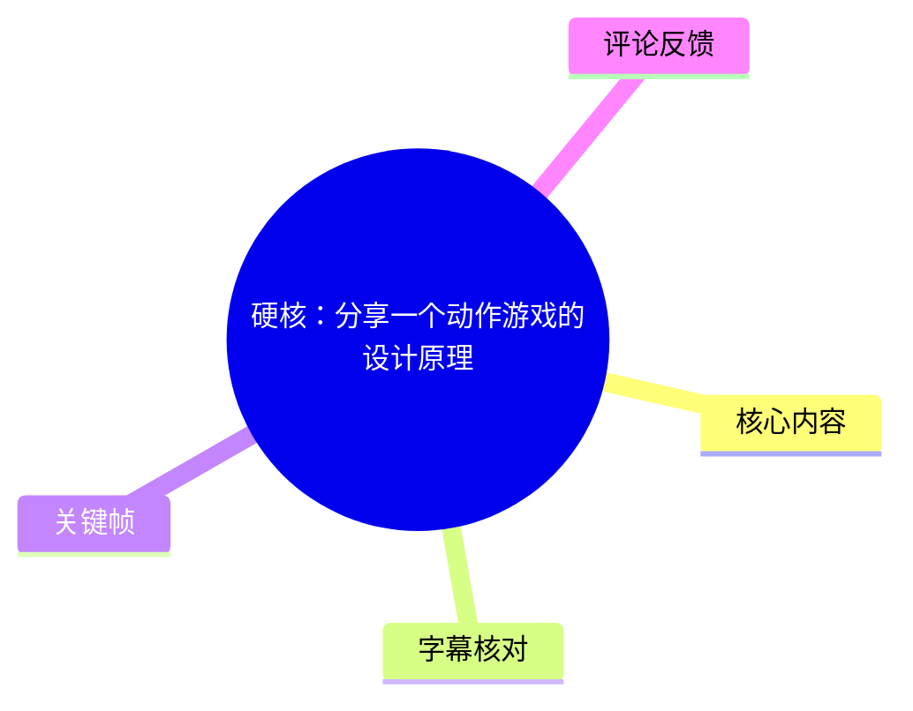
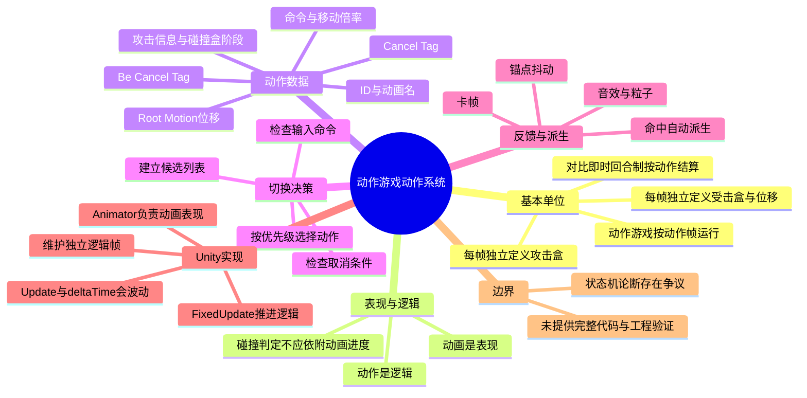
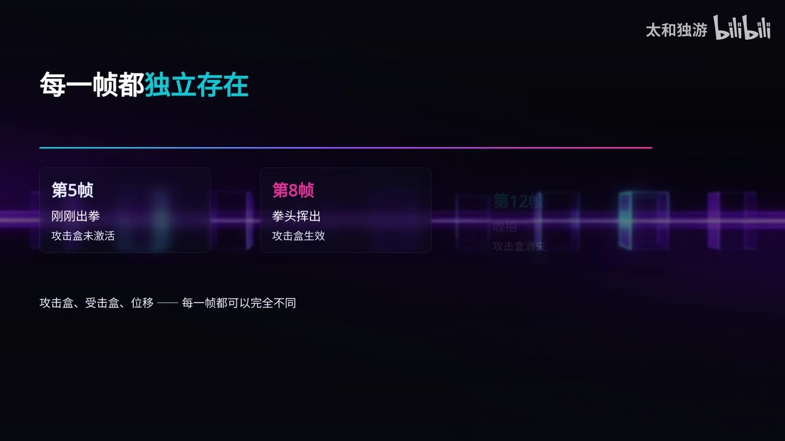
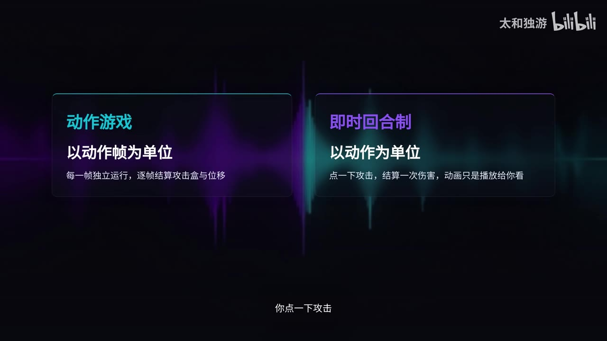
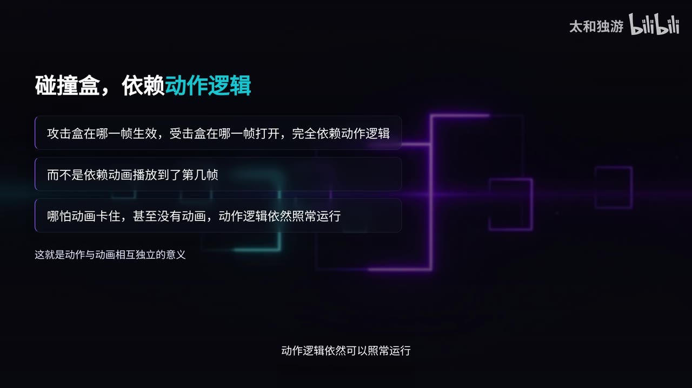

# 硬核：分享一个动作游戏的设计原理

> 来源：[Bilibili 视频](https://www.bilibili.com/video/BV1sX396dEvH)<br>
> UP 主：太和独游｜时长：7 分 35 秒｜收藏夹：AIcode  
> 视频描述：分享一个动作游戏动作系统的设计  
> 整理依据：本次 ASR 时间轴字幕、已提供关键帧、视频元数据及可获取热评。

## 小结

视频围绕动作游戏的“动作系统”展开，核心主张是：动作游戏应以**动作帧**为基本逻辑单位；同一攻击动作在不同帧中，可以拥有不同的攻击盒、受击盒与位移。作者用第 5、8、12 帧举例：第 5 帧刚出拳、攻击盒未激活；第 8 帧拳头挥出、攻击盒生效；第 12 帧收招、攻击盒消失。

最重要的概念区分是“**动画是表现，动作是逻辑**”。按视频的设计思路，动画只是面向玩家的表现引用；攻击盒、受击盒、伤害、硬直、击退与位移等判定，应由独立于动画播放进度的动作逻辑控制。即使动画卡住或缺失，动作逻辑在该架构中仍可继续运行。

作者将一个动作描述为数据集合：包括唯一 ID、动画名、`Cancel Tag`、`Be Cancel Tag`、触发命令、移动倍率、攻击信息、攻击盒/受击盒激活阶段，以及 Root Motion 位移。动作衔接则通过“当前动作允许被何种类型动作取消”与“候选动作的输入命令是否满足”共同决定；若多个候选动作同时成立，再按优先级选取下一动作。

视频还提出命中后的自动派生动作，以及卡帧、锚点抖动、音效与粒子特效等打击感手段。其共同前提是：动作判定按帧独立控制，而非仅依附动画。

实现层面，作者以 Unity 为例指出：`Update` 与 `deltaTime` 随渲染帧率浮动，无法绝对精确复现每一个动作帧。补救办法是维护独立逻辑帧，使用累积 `deltaTime` 推算逻辑帧，或进一步在 `FixedUpdate` 中以固定时间步推进动作逻辑，再让动画跟随逻辑。

需要谨慎对待的是，视频称“动作游戏没有状态机概念”“基于帧与取消标签的框架才是正确做法”。这属于作者的架构判断，不应直接视为行业定论。热评中也有观点指出：状态机或行为树可用于决定“做哪个动作”，而帧判定可用于处理“动作帧内发生什么”，两者可能处于不同层级、可以并存。

适合读者：需要搭建 Unity 或其他引擎动作系统的初学/中级开发者，尤其适合希望理解攻击判定、连招取消、动作数据化和逻辑帧稳定性的人。视频未给出可直接运行的代码、完整数据结构、优先级冲突规则、网络同步方案或性能测试数据，因此应将其作为设计思路而非完整工程方案。

## 思维导图





## 目录

- [动作帧：动作游戏与即时回合制的差异](#动作帧动作游戏与即时回合制的差异)
- [动画是表现，动作是逻辑](#动画是表现动作是逻辑)
- [动作的数据结构与关键参数](#动作的数据结构与关键参数)
- [取消标签、连招与每帧动作决策](#取消标签连招与每帧动作决策)
- [命中派生与打击感实现](#命中派生与打击感实现)
- [Unity 中的逻辑帧问题与补救](#unity-中的逻辑帧问题与补救)
- [结论、适用范围与限制](#结论适用范围与限制)
- [字幕比对](#字幕比对)
- [评论分析](#评论分析)
- [处理记录](#处理记录)

## 动作帧：动作游戏与即时回合制的差异 [00:00](https://www.bilibili.com/video/BV1sX396dEvH?t=0)

作者先将动作系统定义为动作游戏的核心：它负责每个角色的动作管理与切换。其论述的起点是动作游戏与“即时回合制”游戏在结算单位上的区别。

- **动作游戏**：以“动作帧”为单位运行。
- **即时回合制游戏**：以“动作”为单位；玩家按下攻击后，系统可一次性结算伤害，动画主要承担播放和展示作用。
- 对动作游戏而言，一个攻击动作内部并不是固定不变的。攻击盒、受击盒和角色位移都可以逐帧变化。

作者给出的攻击过程示例参数如下：

| 动作帧 | 角色状态 | 攻击盒状态 |
| --- | --- | --- |
| 第 5 帧 | 刚刚出拳 | 尚未激活 |
| 第 8 帧 | 拳头挥出 | 开始生效 |
| 第 12 帧 | 收招 | 消失 |



> 图：画面明确标出第 5、8、12 帧及对应的出拳、攻击盒生效、收招状态，并强调攻击盒、受击盒、位移“每一帧都可以完全不同”。这是理解视频“逐帧逻辑”前提的关键帧。



> 图：画面并列“动作游戏：以动作帧为单位”与“即时回合制：以动作为单位”。它将视频的比较对象和作者所使用的概念边界可视化，便于避免把两类系统混为一谈。

## 动画是表现，动作是逻辑 [00:54](https://www.bilibili.com/video/BV1sX396dEvH?t=54)

作者提出全片最重要的区分：

> **动画是表现，动作是逻辑。**

这里的“动画”被作者定位为玩家可见的表现层，类似 UI：它告诉玩家角色正在做什么，但本身不应直接决定游戏逻辑。相对地，“动作”才承载实际运行的规则，例如：

- 攻击盒在哪一逻辑帧生效；
- 受击盒在哪一逻辑帧打开或关闭；
- 攻击何时产生伤害；
- 位移、硬直和击退在何时执行。

作者特别强调，不能因为攻击动画已经播放，就简单认为攻击判定已经发生；动作判定不应仅由“动画播放到第几帧”决定。在其提出的解耦架构中，即使动画卡顿，甚至没有动画，动作逻辑也可以正常运行。


> 图：关键帧直接写明“动画是表现，动作是逻辑”，并补充“播放了动画，不代表攻击就发生了”。该画面是视频概念框架的核心结论。



> 图：画面说明攻击盒与受击盒的开启帧“完全依赖动作逻辑”，并指出动画卡住或缺失时动作逻辑仍可运行。它进一步解释了前一张概念图在碰撞判定上的实际含义。

### 设计含义

按该思路实现时，可将系统分成至少两个职责层：

1. **动作逻辑层**：推进逻辑帧，维护判定、输入、取消、伤害、位移等可游戏化状态。
2. **动画表现层**：依据当前逻辑动作播放对应动画、特效和声音。

视频没有给出具体接口、事件顺序或同步机制；上述两层是根据作者“动画是表现、动作是逻辑”的表述进行的结构化归纳，而不是视频展示的固定代码结构。

## 动作的数据结构与关键参数 [01:42](https://www.bilibili.com/video/BV1sX396dEvH?t=102)

作者将一个“动作”定义为一组数据集合，而非单纯动画片段。视频逐项列出以下核心属性：

| 属性 | 视频中的作用 | 实现注意点 |
| --- | --- | --- |
| `ID` | 动作的唯一编号，用于标识和查找 | 应保持唯一性；视频未规定编号格式。 |
| 动画名 | 指向该动作应播放的动画表现 | 仅是引用，不决定动作逻辑。 |
| `Cancel Tag` | 当前动作所属类型 | 视频例子包括轻攻击、重攻击、跳跃、受击。 |
| `Be Cancel Tag` | 当前动作可被哪些类型动作打断 | 与 `Cancel Tag` 配合形成取消系统。 |
| 命令信息 | 触发该动作所需输入 | 可以是单个按键，或方向加按键的组合。 |
| 移动倍率 | 控制动作过程中的角色移动速度 | 视频未给出具体数值范围。 |
| 攻击信息 | 伤害、硬直时间、击退方向等 | 这些参数属于攻击的实际逻辑结果。 |
| 攻击盒/受击盒阶段 | 规定碰撞盒在什么帧激活或关闭 | 作者明确要求按帧定义。 |
| Root Motion 位移 | 动作自身产生的角色位移 | 例如前冲斩使角色向前移动一段距离。 |

### 碰撞盒与无敌帧

视频再次用攻击盒说明逐帧配置的必要性：

- 攻击盒可在**第 8 帧至第 12 帧**之间激活；
- 受击盒可在整个动作持续开启；
- 也可在某些帧关闭，从而形成无敌帧。

这里的“第 8 至第 12 帧”是作者用于解释的示例，不是视频给出的通用帧数标准。具体项目需要依角色动作时长、目标帧率、判定需求和游戏节奏设定。

## 取消标签、连招与每帧动作决策 [03:19](https://www.bilibili.com/video/BV1sX396dEvH?t=199)

### 取消与连招的基本过程 [03:19](https://www.bilibili.com/video/BV1sX396dEvH?t=199)

作者以“轻攻击可被重攻击取消”为例说明标签如何协作：

1. 当前正在执行轻攻击。
2. 该轻攻击的数据中定义了某种 `Be Cancel Tag`，表示它在允许阶段可被重攻击类型取消。
3. 动作推进到允许取消的若干帧。
4. 系统检查玩家是否输入重攻击命令。
5. 若输入成立，则切换到重攻击动作。

这就是视频所说的连招/取消：动作不必等到完整播放结束才切换，而可以在设计好的取消窗口中被后续动作接管。

### 每帧候选筛选与优先级 [03:43](https://www.bilibili.com/video/BV1sX396dEvH?t=223)

作者描述的每帧决策流程可整理为：

1. 每一逻辑帧遍历所有可选动作。
2. 针对每个动作检查两个条件：
   - 当前动作是否处于允许被取消的阶段，即取消条件是否成立；
   - 当前玩家输入是否满足该候选动作的触发命令。
3. 两项都成立时，将动作加入候选列表。
4. 一帧内可能出现多个候选动作。
5. 按优先级排序，从候选列表中选出优先级最高的动作，作为下一帧执行的动作。

可将其抽象为以下伪代码。变量名与代码结构为整理表达，不是视频原始代码：

```text
for each logicFrame:
    candidates = []

    for each action in allActions:
        if currentAction.canBeCancelledAt(currentFrame, action.cancelTag)
           and input.matches(action.command):
            candidates.add(action)

    if candidates is not empty:
        nextAction = candidates.maxBy(priority)
        switchTo(nextAction)
```

### 关于“状态机”的争议 [04:07](https://www.bilibili.com/video/BV1sX396dEvH?t=247)

作者明确提出：其动作切换过程“没有任何一个叫做状态机的东西”，并认为传统状态机在动作游戏中会因状态跳转关系爆炸而难以维护；视频将基于帧与取消标签的框架描述为更适合制作动作游戏的基础。

这一段需要区分为**作者的设计立场**，而非无条件成立的技术事实：

- 视频确实呈现了一个“动作数据 + 标签取消 + 输入匹配 + 优先级仲裁”的切换框架。
- 热评中有开发者反驳：状态机或行为树可处理“决定做哪个动作”，而帧判定处理“决定后在动作帧内发生什么”，二者不属于同一层级。
- 因此，实际工程中可以评估是否将高层状态选择、动作切换、帧内碰撞判定拆分；不能仅依据本视频就得出“任何动作游戏都不该使用状态机”的结论。

## 命中派生与打击感实现 [04:55](https://www.bilibili.com/video/BV1sX396dEvH?t=295)

### 命中检测触发派生动作

除由玩家输入触发的动作切换外，作者还提到自动触发逻辑：当一次攻击命中敌人时，系统可自动进入新的动作分支，即“派生动作”。

视频认为，这种由命中检测触发的派生，能丰富连招手感与打击反馈。这里未进一步说明派生条件是否受目标类型、命中次数、受击状态、资源消耗或优先级影响；这些均是工程实现时仍需定义的规则。

### 打击感的两个逐帧手段 [05:19](https://www.bilibili.com/video/BV1sX396dEvH?t=319)

作者认为打击感并不主要依赖“数值”，而是由细节累积形成，并列举两种方法：

| 手段 | 触发时机 | 视频描述的效果 |
| --- | --- | --- |
| 卡帧 | 攻击命中的瞬间 | 动画短暂减速或停顿若干帧，让玩家感到攻击更有重量。 |
| 锚点抖动 | 命中的瞬间 | 让角色锚点产生轻微抖动；与音效、粒子特效结合以强化冲击力。 |

作者的因果关系是：这些效果要准确卡在攻击命中的逻辑帧，因而依赖按帧控制的动作系统；若只有动画、没有独立动作逻辑，就难以精确实现。

视频没有量化卡帧时长、抖动幅度、音效延迟或粒子触发条件。因此，以上仅是效果方向，不能直接当作可复制的参数配方。

## Unity 中的逻辑帧问题与补救 [05:43](https://www.bilibili.com/video/BV1sX396dEvH?t=343)

### 作者指出的实现限制

作者以 Unity 为例说明，通常可依赖 `Animator` 制作动画表现，并借用虚幻引擎 Montage 的思路，将若干帧组合以模拟动作游戏逻辑。

但其指出一个关键代价：

- Unity 中常用 `Update` 配合 `deltaTime` 推进时间；
- `Update` 的调用节奏随渲染帧率变化；
- 帧率较高时，单帧时间较短；帧率较低时，单帧时间较长；
- 因而如果直接依赖动画播放进度或不稳定的渲染帧推进，难以“百分之百精确”还原每个动作帧。

### 视频给出的补救路线 [06:08](https://www.bilibili.com/video/BV1sX396dEvH?t=368)

作者按由弱到强的方式给出两层建议：

1. **维护独立逻辑帧计数**
   - 不直接用动画播放进度判断攻击盒是否激活；
   - 使用累积的 `deltaTime` 推算当前处于第几逻辑帧；
   - 目标是在渲染帧率波动时，令逻辑判定相对稳定。

2. **使用 `FixedUpdate` 推进动作逻辑**
   - 将动作逻辑放入 `FixedUpdate`；
   - 使用固定时间步推进动作帧；
   - 让动画表现跟随逻辑，而非让逻辑反向跟随动画。

可以把作者的推荐关系概括为：

```text
固定时间步 / 逻辑帧
        ↓
动作切换、碰撞盒、伤害、位移、派生判定
        ↓
Animator 动画、音效、特效等表现跟随
```

### 实施边界

视频只讨论了渲染帧率波动下的相对稳定性，没有讨论以下问题：

- `FixedUpdate` 时间步与目标动作帧率如何换算；
- 一次渲染帧内发生多次或零次固定更新时，表现层如何插值；
- 输入采集位于何处，以及如何避免输入遗漏；
- 高速位移下的碰撞检测策略；
- 多人联机中的帧同步、预测与回滚；
- 角色、敌人数量增加后的遍历与性能优化。

因此，在 Unity 中采用此方案时，仍需针对项目类型进行实测和补充设计。

## 结论、适用范围与限制 [06:56](https://www.bilibili.com/video/BV1sX396dEvH?t=416)

视频最后将主要结论归纳为五点：

1. 动作游戏以动作帧为单位，碰撞盒与位移可逐帧独立定义。
2. 动画是表现，动作是逻辑；碰撞盒应依赖动作逻辑，而不是动画本身。
3. 动作是一组数据，包含 ID、动画名、`Cancel Tag`、`Be Cancel Tag`、命令、攻击信息与位移等。
4. 动作切换通过每帧检查取消条件与输入命令，将满足条件的动作纳入候选，再按优先级选择下一动作。
5. 作者认为，基于帧与取消标签的框架是制作动作游戏的基础，并否定将传统状态机作为动作游戏核心结构的做法。

### 可迁移经验

- 将**判定逻辑**与**画面表现**解耦，有助于稳定管理攻击盒、无敌帧、硬直、击退、位移和命中反馈。
- 将动作配置数据化，有利于扩充招式、配置输入命令和维护动作取消关系。
- 明确候选动作的优先级，是解决多输入、多触发条件竞争的必要环节。
- 若追求逐帧一致性，逻辑时间不应完全依赖渲染帧率和动画播放进度。

### 适用限制与时效性

- 本视频为 2026 年 8 月发布的设计讲解，内容主要是概念、数据项与框架思路，不是特定 Unity 版本的官方文档或完整教程。
- 视频没有提供源码、项目样例、数据表、帧率目标、测试场景或性能指标。
- `Animator`、`Update`、`FixedUpdate` 等 API 的具体行为与最佳实践仍应以所使用 Unity 版本的官方文档为准。
- “动作游戏没有状态机”是作者的强判断，已受到热评质疑；更稳妥的实践是按项目复杂度划分高层决策、动作切换和帧内判定职责，而不是把某一种架构绝对化。
- 视频未涉及新闻事件、产品发布、版本更新或市场数据，因此不存在需要追踪的新闻时效结论。

## 字幕比对

| 字幕来源 | 完整性 | 专有名词 | 时间轴 | 主要问题 |
| --- | --- | --- | --- | --- |
| Bilibili 站内字幕 | 未提供可用字幕，无法比较文本完整性 | 无法核验 | 无可用时间轴 | 素材中明确标注“未提供可用站内字幕”。 |
| 本次 ASR 字幕 | 高：共 19 段，语音覆盖约 453.08 秒，占视频约 99.68% | 存在少量同音、错字及英文术语识别不稳 | 高：SRT 提供 00:00:00,000 至 00:07:34,500 的真实分段 | 如“动作系统”偶被识别为“动作细统”，“攻击盒”为“攻净盒/攻几盒”，“帧”为“针”，“状态机”为“状太机”。 |

### 最终字幕选择与校正

最终采用**本次 ASR 的时间轴**作为章节定位依据。已检查 ASR 诊断：识别语言为中文，模型为 `large-v3-turbo`，带时间戳；诊断未标记 `noAudioStream=true`，且显示音频语音覆盖率约为 99.68%，因此可以确认源视频存在可识别音轨。

由于没有站内字幕可供交叉验证，正文对术语进行了基于上下文与关键帧画面的必要校正：

| ASR 原始识别倾向 | 正文采用写法 | 校正依据 |
| --- | --- | --- |
| 动作针、按针 | 动作帧、按帧 | 视频主题、上下文及关键帧中的“第5帧”“第8帧”“第12帧”。 |
| 攻净盒、攻几盒 | 攻击盒 | 与受击盒、碰撞盒并列出现，且关键帧画面文字明确。 |
| 状太机 | 状态机 | 中文技术术语上下文。 |
| cancel tag | `Cancel Tag` | 作者口述的英文标签名；大小写为整理统一。 |
| be cancel tag、B Cancel Tag | `Be Cancel Tag` | 与“当前动作可被哪些类型动作打断”的定义对应。 |
| root motion | Root Motion | 常用引擎术语；视频用其说明动作自身位移。 |
| Fixed Update | `FixedUpdate` | Unity 生命周期函数的常见写法。 |
| Delta Time | `deltaTime` | Unity 中常用属性写法；视频口述为 Delta Time。 |

## 评论分析

以下仅处理可获取的热评前三条。评论代表个人观点，不作为已经验证的技术事实。

### 1. 对内容来源与 AI 文案的质疑

- 评论者：`Pr0crastinaYuki`
- 点赞：7
- 原文：“AI太好用，以至于什么牛鬼蛇神都能来分享了”

该评论质疑 AI 降低内容生产门槛后可能带来的内容质量问题，但没有针对视频中的某项动作系统论述给出技术反例或证据。它可提醒读者不要因视频包装或叙述流畅而直接接受所有结论，但不能独立证明视频内容错误。

### 2. 对“没有状态机”论断的技术反驳

- 评论者：`susanna233`
- 点赞：27
- 原文：“误导新人，状态机或行为树是用来决定做哪个动作的。而帧判定是决定之后在动作帧内的逻辑。不属于同一个逻辑层级。”

这是前三条中技术信息最具体的一条。评论认为：

- 状态机或行为树可用于更高层的动作选择；
- 帧判定用于动作确定之后的帧内逻辑；
- 二者分属不同逻辑层级，不应互相排斥。

该观点直接挑战视频“动作游戏没有状态机概念”的绝对表述，并与视频实际介绍的帧内取消、输入筛选、优先级选择机制形成讨论关系。由于评论未附架构图、代码或具体项目案例，不能据此裁定谁绝对正确；但它是对视频结论范围的重要补充，尤其值得初学者注意。

### 3. 对文案人工性的批评

- 评论者：`我在风中凌乱啊`
- 点赞：3
- 原文：“你先人工写个文案，AI文案看都不想看”

该评论关注文案是否由 AI 生成及其可读性，不涉及动作系统的具体设计、Unity 实现或技术参数。它反映了部分观众对表达方式的负面感受，但未提供可以核验的视频事实补充。

## 处理记录

- Worker ID：`worker-mrj0wbly-5dc4e50c`
- 使用模型：`gpt-5.6-terra`
- ASR 模型：`large-v3-turbo`（中文识别，`cuda`，`int8_float16`）
- 调用工具与素材：已提供的视频元数据、音频提取结果、ASR SRT/分段 JSON、19 张关键帧路径、热评 JSON；未提供可用站内字幕。
- 字幕选择：检查站内字幕后确认无可用文本；检查本次 ASR 后采用其 SRT 真实起止时间制作时间轴。ASR 未标记 `noAudioStream=true`，音轨存在且识别覆盖率约 99.68%。
- 关键帧选择依据：
  - `frames/frame-001.jpg`：展示第 5、8、12 帧攻击盒状态，支撑“逐帧独立”论述；
  - `frames/frame-002.jpg`：并列展示动作游戏与即时回合制的结算单位；
  - `frames/frame-003.jpg`：明确呈现“动画是表现，动作是逻辑”；
  - `frames/frame-004.jpg`：说明碰撞盒依赖动作逻辑、可与动画解耦。
- 缓存清理：提供的素材中没有缓存清理执行记录；本整理未获得可核验的清理结果，因此不宣称已完成缓存清理。
- 未解决问题：
  - 未提供站内字幕，无法进行逐句交叉校验；
  - 未提供完整关键帧时间戳与其余 15 张画面内容，故仅选用画面文本明确、与 ASR 内容可互证的前 4 张；
  - 视频未提供源码、可运行工程、逻辑帧率、输入缓冲、优先级规则与性能数据；
  - “状态机是否适用于动作游戏”的结论存在架构层级争议，需结合具体项目验证。
