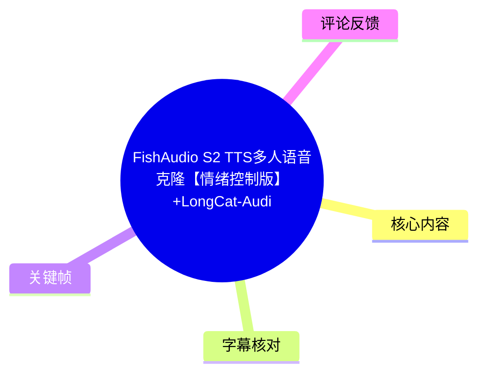
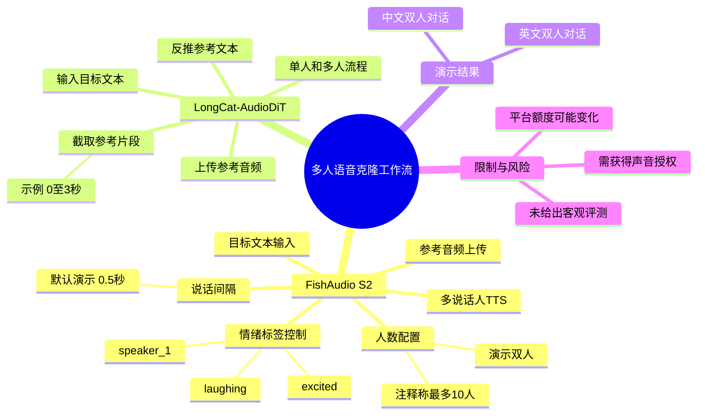
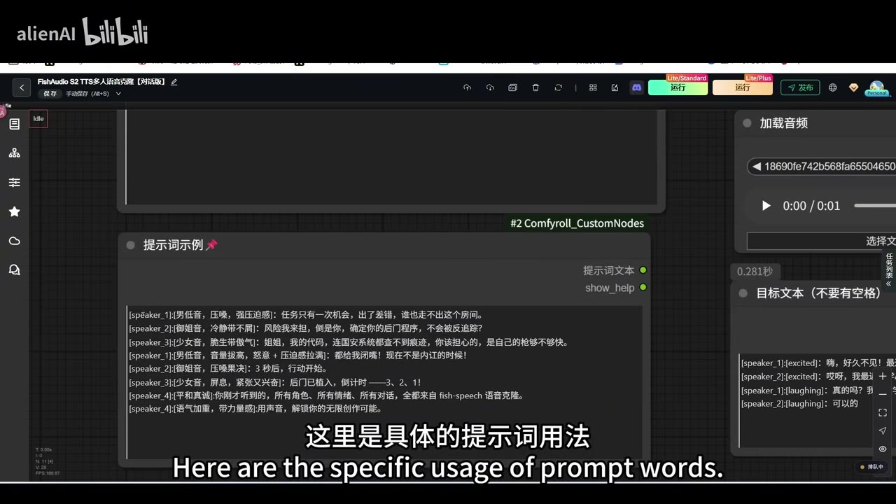
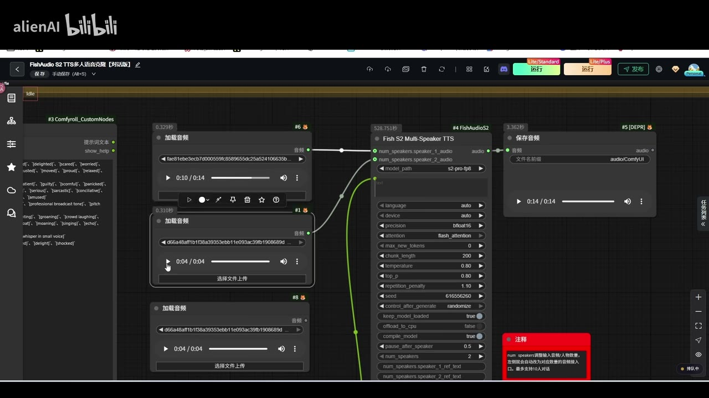
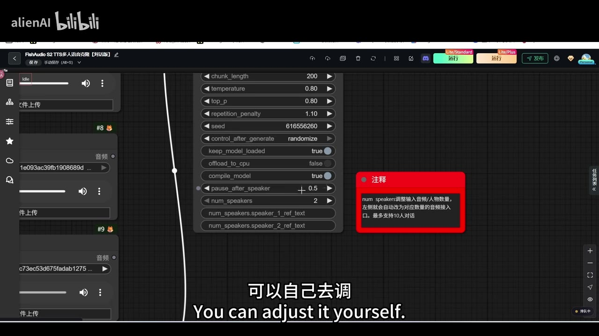
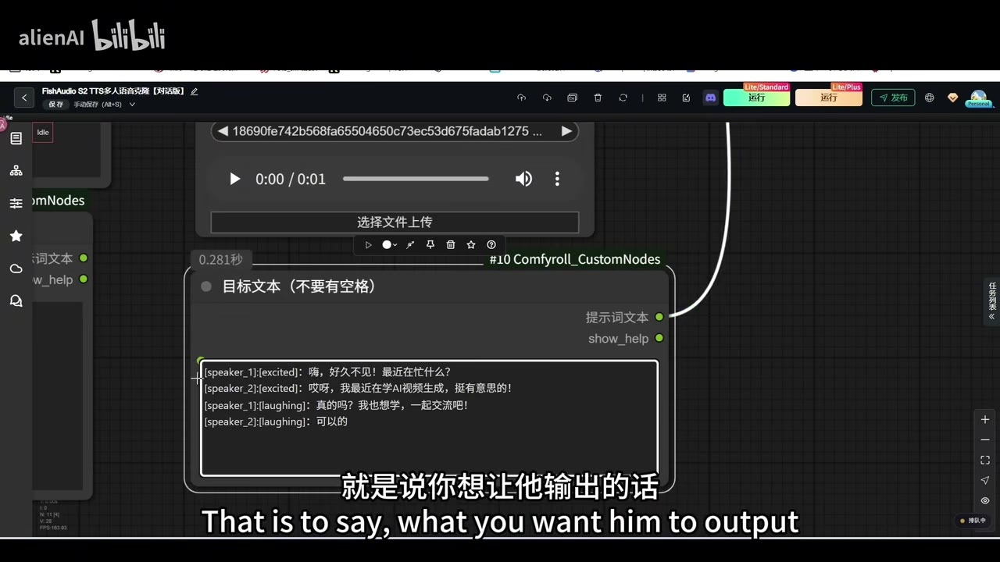

# FishAudio S2 TTS多人语音克隆【情绪控制版】+LongCat-AudioDiT 超真实语气 语音克隆

> 来源：[Bilibili 视频](https://www.bilibili.com/video/BV1xQ3964EKd)<br>
> UP 主：alienAI｜视频时长：4 分 51 秒｜分辨率：1920×1080<br>
> 视频描述提供了两个 RunningHub 体验地址，并宣称可获得“1000 点”、每日登录“100 点”；此类平台额度、活动和链接均可能随时间变化，应以页面实际显示为准。

## 小结

视频在约 5 分钟内演示了两套语音克隆工作流：**FishAudio S2 Multi-Speaker TTS** 与标题中称为 **LongCat-AudioDiT** 的另一套语音模型。前者的重点是通过在每句文本前添加诸如 `[excited]`、`[laughing]` 的标签，对多说话人合成的情绪或语气进行控制；后者则采用“参考音频片段 + 从参考音频反推的文本 + 待输出文本”的连接方式。

FishAudio S2 的核心输入是：为每位说话人上传参考音频、在目标文本中以 `speaker_1`、`speaker_2` 区分角色，并在角色标识后填写情绪提示词。视频界面展示了双人对话配置，且明确指出说话人之间的间隔参数为 **0.5 秒**，可以自行调整；界面注释还显示最多可支持 **10 人对话**。

LongCat-AudioDiT 的单人流程强调先截取参考音频片段。视频举例为从 **第 0 秒截取到第 3 秒**，将该片段接入后续节点；再将一个用于反推参考音频原文的模型输出文本接入相应输入，最后填入希望模型说出的新文本并运行。多人版则为 Speaker 1、Speaker 2 分别准备相应的音频与反推文本。

视频用中文和英文双人对话作试听样例，展示两套流程均能完成轮流发言。但视频并未提供客观音质指标、相似度评分、不同录音条件下的稳定性测试、推理耗时或商用授权说明；“超真实”“情绪控制”等属于视频标题或演示定位，不能直接视为已被独立验证的性能结论。

该内容适合已能使用节点式 AI 工作流、需要制作多角色旁白或数字人对话的用户参考。实践时还需取得参考说话人的明确授权，避免将语音克隆用于冒充、欺诈或未经许可的身份模拟。

## 思维导图





## 目录

- [视频定位、来源与时效性](#视频定位来源与时效性)
- [FishAudio S2：情绪控制与多说话人合成](#fishaudio-s2情绪控制与多说话人合成)
  - [提示词与目标文本格式](#提示词与目标文本格式)
  - [参考音频、角色间隔与界面参数](#参考音频角色间隔与界面参数)
  - [FishAudio S2 试听样例](#fishaudio-s2-试听样例)
- [LongCat-AudioDiT：参考片段与反推文本流程](#longcat-audiodit参考片段与反推文本流程)
  - [单人语音克隆流程](#单人语音克隆流程)
  - [多人语音克隆流程](#多人语音克隆流程)
  - [LongCat-AudioDiT 试听样例](#longcat-audiodit-试听样例)
- [可复用操作步骤与检查清单](#可复用操作步骤与检查清单)
- [结论、限制与合规边界](#结论限制与合规边界)
- [字幕比对](#字幕比对)
- [评论分析](#评论分析)
- [处理记录](#处理记录)

## 视频定位、来源与时效性 [00:00:01](https://www.bilibili.com/video/BV1xQ3964EKd?t=1)

这是一段以节点式界面为主的操作演示，不是模型论文解读或横向测评。UP 主先说明将介绍两款语音克隆方案，随后依次展示 FishAudio S2 的情绪控制型多人 TTS，以及 LongCat-AudioDiT 的单人、多人配置方式。

视频描述中的体验入口为：

1. `https://www.runninghub.ai/zh-cn/post/2083473799642992641/?inviteCode=rh-v1537`
2. `https://www.runninghub.ai/zh-cn/post/2083444788161941505/?inviteCode=rh-v1537`

描述还写有邀请码 `rh-v1537` 及赠送点数信息。这些是视频发布者提供的推广/体验信息，视频素材未包含其有效期、适用地区、资格条件或兑换规则，因此不能将其作为长期有效承诺。

## FishAudio S2：情绪控制与多说话人合成 [00:00:01](https://www.bilibili.com/video/BV1xQ3964EKd?t=1)

### 提示词与目标文本格式 [00:00:01](https://www.bilibili.com/video/BV1xQ3964EKd?t=1)

UP 主介绍，FishAudio S2 的情绪控制方式是在希望说出的内容之前添加对应的情绪/语气标签。界面中的提示词示例区展示了以角色与方括号标签组合的格式，例如：

```text
[speaker_1][excited]: 嗨，好久不见！最近在忙什么？
[speaker_2][excited]: 哎呀，我最近在学 AI 视频生成，挺有意思的！
[speaker_1][laughing]: 真的吗？我也想学，一起交流吧！
[speaker_2][laughing]: 可以的
```

从画面可确认的要点是：

- `speaker_1`、`speaker_2` 用于区分说话角色；
- 角色标记后可紧跟情绪或语气标签；
- 视频实际演示了 `excited` 与 `laughing`；
- 每行的冒号后填写该角色需要输出的具体台词；
- 目标文本节点标题标注“**不要有空格**”，应避免在结构标签与相关文本中加入不必要空格，以降低解析异常风险。



> 图：该帧展示 FishAudio S2 工作流中的“提示词示例”区域，能直接确认它并非只输入自然语言台词，而是要通过 `speaker` 角色标记与方括号情绪标签共同组织文本。

### 参考音频、角色间隔与界面参数 [00:00:34](https://www.bilibili.com/video/BV1xQ3964EKd?t=34)

视频说明先上传希望作为参考的音频，再在目标文本框中填写希望输出的内容。双人模式下，应分别为两位说话人提供参考音频，并使对应音频连接到 FishAudio S2 Multi-Speaker TTS 节点的 Speaker 1 / Speaker 2 输入。

在时间轴约 00:56 处，UP 主强调角色轮流说话的停顿可调：演示设置为 **0.5 秒**。该值对应界面参数 `pause_after_speaker = 0.5`，用于控制一位说话人结束后、下一位说话人开始前的间隙。

画面还显示以下可见参数。视频没有逐项解释其算法含义，以下仅记录界面展示值，不把它们扩展解释为已证实的最佳配置：

| 界面参数 | 演示值 | 视频可确认信息 |
| --- | ---: | --- |
| `max_new_tokens` | 0 | 画面可见，未讲解用途 |
| `chunk_length` | 200 | 画面可见，未讲解调优原则 |
| `temperature` | 0.80 | 画面可见 |
| `top_p` | 0.80 | 画面可见 |
| `repetition_penalty` | 1.10 | 画面可见 |
| `seed` | 616556260 | 画面可见 |
| `control_after_generate` | `randomize` | 画面可见 |
| `keep_model_loaded` | `true` | 画面可见 |
| `offload_to_cpu` | `false` | 画面可见 |
| `compile_model` | `true` | 画面可见 |
| `pause_after_speaker` | 0.5 | UP 主明确表示可自行调节 |
| `num_speakers` | 2 | 演示为两人配置 |

界面旁注释写明：`num_speakers` 调整输入音频/人物数量，参数会自动对应为相应数量的音频接入接口，**最多支持 10 人对话**。此处的“最多 10 人”来自该演示工作流注释，应理解为当前节点/工作流界面的标注，并非对所有部署环境、版本或模型实现的普遍保证。



> 图：该帧完整呈现两路参考音频接入 FishAudio S2 Multi-Speaker TTS 节点的关系，并显示 `pause_after_speaker=0.5`、`num_speakers=2` 与“最多支持 10 人对话”的界面注释，是理解多人配置的关键画面。



> 图：该帧放大了 `pause_after_speaker` 和 `num_speakers` 参数区域，可用于核对视频实际使用的 0.5 秒角色间隔，而不是将其误认为固定不可更改的模型限制。

### FishAudio S2 试听样例 [00:01:12](https://www.bilibili.com/video/BV1xQ3964EKd?t=72)

UP 主随后播放生成效果。样例分为中文与英文：

- **中文片段一（约 00:01:19—00:01:33）**：包含“为什么要约我到这个地方啊，四面都是山”等戏剧化台词；
- **中文片段二（约 00:01:34—00:01:50）**：双人对话，内容为“好久不见，最近在忙什么？”、“我最近在学 AI 视频生成，挺有意思的”等；
- **英文片段（约 00:01:54—00:02:11）**：对应 “Long time no see. What have you been up to lately?” 等对话。

这些内容可证明视频播放了中英文多角色合成样例，但素材中未提供参考原声与合成结果的 A/B 对照、说话人相似度数值或情绪识别评估。因此，只能称其为演示试听，不能据此量化“真实度”或克隆准确率。



> 图：该帧展示双角色目标文本框，`speaker_1`、`speaker_2` 分别搭配 `[excited]`、`[laughing]` 标签，直观说明“情绪控制”在该工作流中落在文本格式层，而非另一个独立滑块。

## LongCat-AudioDiT：参考片段与反推文本流程 [00:02:12](https://www.bilibili.com/video/BV1xQ3964EKd?t=132)

### 单人语音克隆流程 [00:02:12](https://www.bilibili.com/video/BV1xQ3964EKd?t=132)

UP 主在约 02:12 开始介绍第二套模型。根据视频说明，其单人处理顺序如下：

1. **上传参考音频**。
2. **截取参考音频片段**。视频举例为从 **第 0 秒开始，到第 3 秒结束**，即截取 0—3 秒的片段。
3. 将截取后的音频连接到后续模型需要的音频输入。
4. 使用视频所称的“反推语音文本”模型，从原始语音中推导其对应文本。
5. 将反推所得的参考文本接入模型的参考文本输入。
6. 在最后的目标文本位置填写希望该声音说出的新内容。
7. 运行工作流。

这里有一个关键区分：**反推文本对应的是参考音频本身说了什么；目标文本才是要让克隆声音新说的话。** 如果将两者混填，参考音频与文本条件可能不一致，视频虽未展示报错案例，但流程逻辑会被破坏。

ASR 将视频口述的模型名称识别为“签问”等不稳定音近字；结合视频标题的 LongCat-AudioDiT 命名与讲解上下文，本文统一表述为“反推参考音频文本的模型”，不额外断言其确切底层模型名称。

### 多人语音克隆流程 [00:02:57](https://www.bilibili.com/video/BV1xQ3964EKd?t=177)

多人版沿用单人原则，但必须为每位说话人建立独立条件。视频以两人为例，使用与前段 FishAudio S2 相同的两段参考语音：

1. 准备 Speaker 1 与 Speaker 2 的参考音频；
2. 分别截取每位说话人的有效参考片段；
3. 分别为两段参考片段获取对应的反推文本；
4. 将 Speaker 1 音频、Speaker 1 参考文本接入角色 1 的对应输入；
5. 将 Speaker 2 音频、Speaker 2 参考文本接入角色 2 的对应输入；
6. 在最终输出文本中以 `Speaker 1`、`Speaker 2` 组织各自台词；
7. 设置角色间隔并运行。

约 03:57 处，UP 主再次指出双人轮流说话的间隙设为 **0.5 秒**，并表示可以增加人数。这表明“说话人数量”和“说话人间隔”是两种不同的配置：前者决定有多少角色条件输入，后者决定角色切换时的停顿。

### LongCat-AudioDiT 试听样例 [00:04:12](https://www.bilibili.com/video/BV1xQ3964EKd?t=252)

视频在约 04:15—04:27 播放中文双人对话：

```text
好久不见，最近在忙什么？
我最近在学 AI 视频生成，挺有意思的。
真的吗？我也想学，一起交流吧。
可以啊。
```

随后在约 04:30—04:46 播放英文样例，内容与前段英文对话基本对应。末尾 ASR 识别到额外的 “I've been learning too”，但视频未对该句的来源、是否为输出尾音或字幕识别误差作解释，不能据此延伸判断。

## 可复用操作步骤与检查清单 [00:00:34](https://www.bilibili.com/video/BV1xQ3964EKd?t=34)

### FishAudio S2 多人情绪对话

1. 准备每名角色的参考音频，并确认已获得声音使用授权。
2. 在工作流中加载对应数量的参考音频。
3. 设置 `num_speakers`；视频演示值为 `2`，界面注释称最大可到 `10`。
4. 在目标文本中用角色标签区分台词，例如 `speaker_1`、`speaker_2`。
5. 在角色标记后加入所需的情绪标签，例如 `[excited]`、`[laughing]`。
6. 避免目标文本结构中出现不必要空格，遵循节点“不要有空格”的提示。
7. 按节奏设置 `pause_after_speaker`；视频示例是 `0.5` 秒。
8. 运行并试听。若对话转场过急或过慢，可优先调整角色间隔，再根据实际工作流版本检查采样参数。

### LongCat-AudioDiT 单人或多人克隆

1. 上传参考音频。
2. 先截取有效片段；视频示例是 `0` 至 `3` 秒。
3. 将截取片段接到语音克隆模型的参考音频输入。
4. 生成或取得该参考片段的反推文本，并将其接入参考文本输入。
5. 在输出文本输入框填写新台词，勿将其与参考片段原文混淆。
6. 多人模式下，为每个 Speaker 重复“音频片段 + 对应反推文本”的配对操作。
7. 在最终台词中按角色顺序编排文本，设置角色间隔后运行。
8. 分别核听角色身份、台词内容、语言切换与角色间停顿；视频只展示成功样例，未展示异常输入时的容错行为。

## 结论、限制与合规边界 [00:03:57](https://www.bilibili.com/video/BV1xQ3964EKd?t=237)

### 可迁移经验

- 多说话人语音生成的关键不是只增加台词行数，而是要让**每名角色的参考音频、参考文本与角色标签一一对应**。
- FishAudio S2 在视频中采用“角色 + 情绪标签 + 台词”的文本组织法，适合需要明确表达兴奋、笑声等表演提示的对话脚本。
- LongCat-AudioDiT 的演示强调参考片段及其反推文本配对，说明参考音频条件和文本条件需要保持一致。
- 角色切换停顿是影响对话自然度的显式参数。视频使用 `0.5` 秒，但该值只是样例设置，应随语速、语句长度和剧本节奏调整。

### 已知限制

1. **缺少客观评测**：视频没有提供相似度、情感可控性、字词准确率、跨语言稳定性、推理速度、显存占用或失败率。
2. **参数解释有限**：`temperature`、`top_p`、`repetition_penalty` 等值虽然在画面中可见，但视频未说明它们的调参范围或因果效果。
3. **多人上限有上下文**：界面注释中的“最多支持 10 人对话”应视作该工作流版本的说明，不应泛化为所有模型部署的固定能力。
4. **平台信息具时效性**：体验链接、邀请码与点数规则可能失效或调整。
5. **语言表现未充分验证**：视频仅播放有限的中英文样例，不能推论所有语言、口音、长文本或复杂情绪均有相同表现。
6. **授权与安全风险**：克隆真实人物声音需取得明确许可；不得将技术用于仿冒身份、诈骗、绕过授权、虚构他人表态或其他违法违规用途。

## 字幕比对

| 字幕来源 | 完整性 | 专有名词 | 时间轴 | 主要问题 |
| --- | --- | --- | --- | --- |
| Bilibili 站内字幕 | 未提供可用字幕 | 无法核验 | 无法使用 | 素材明确标注“未提供可用站内字幕” |
| 本次 ASR 字幕 | 较高；25 段、语音覆盖约 82.7% | 存在音近字与术语误识别 | 完整；含毫秒级起止时间 | “情绪”被识别为“情绫/情絮”，“LongCat”被识别为“龙毛”，“反推”相关名称出现“签问”等误识别；中英文连续语句缺少自然断句 |

本次 ASR 使用 `large-v3-turbo`，识别语言为中文，语言置信度约 `0.9985`；音频时长约 `290.39` 秒，识别到的语音时长约 `240.16` 秒。诊断结果未标记 `noAudioStream=true`，说明源视频存在音轨，且 ASR 有可用的时间戳，因此正文时间轴以本次 ASR SRT 的真实起止时间换算秒数生成。

由于没有站内字幕，正文以本次 ASR 为主要时间依据，并用视频标题、画面文字和关键帧进行有限校正：

- 将 ASR 的“龙毛”按标题校正为 **LongCat-AudioDiT**；
- 将“情绫控制”“情絮”等按上下文校正为 **情绪控制/情绪**；
- 将反复出现的“签问”保守处理为“反推参考音频文本的模型”，不擅自补写未能由素材明确确认的产品名；
- `pause_after_speaker = 0.5`、`num_speakers = 2`、最多支持 10 人等内容由关键帧界面文字佐证；
- 英文试听内容保留 ASR 可辨识的原句，但不将其断句与拼写错误当作模型输出的精确转写。

## 评论分析

未获取到可分析的热评。素材中的评论数据为：

```json
{
  "limit": 3,
  "items": []
}
```

因此不存在可供概括、验证或讨论的热评观点；不以播放量、收藏量或视频描述替代评论反馈。

## 处理记录

- Worker ID：`worker-mrj0www4-e8d79408`
- 生成模型：`gpt-5.6-terra`
- ASR 模型：`large-v3-turbo`，`cuda`，`int8_float16`
- 使用的素材与工具产物：视频元数据、`asr/transcript.srt`、`asr/asr-result.json`、关键帧目录 `frames/`、评论结果 `comments/comments.json`。
- 字幕选择：站内无可用字幕；已检查本次 ASR，采用带毫秒级时间戳的 ASR SRT 作为章节时间轴依据，并依据标题和关键帧校正明显术语误识别。
- 关键帧选择依据：
  - `frames/frame-001.jpg`：展示 FishAudio S2 提示词示例与情绪标签格式；
  - `frames/frame-002.jpg`：展示双角色目标文本的实际写法；
  - `frames/frame-003.jpg`：展示 `pause_after_speaker=0.5` 与 `num_speakers=2`；
  - `frames/frame-004.jpg`：展示双路参考音频、多人 TTS 节点及“最多支持 10 人对话”注释。
- 缓存清理：提供的素材中未包含缓存清理执行记录；本次整理未额外声明或虚构清理结果。
- 未解决问题：
  - 无可用站内字幕，无法进行逐句字幕一致性校验；
  - LongCat-AudioDiT 流程中“反推文本”节点的准确模型名称未能由 ASR 稳定识别，正文未作超出素材的命名推断；
  - 视频未提供模型版本、运行硬件要求、推理耗时、授权条款和客观质量评测。
