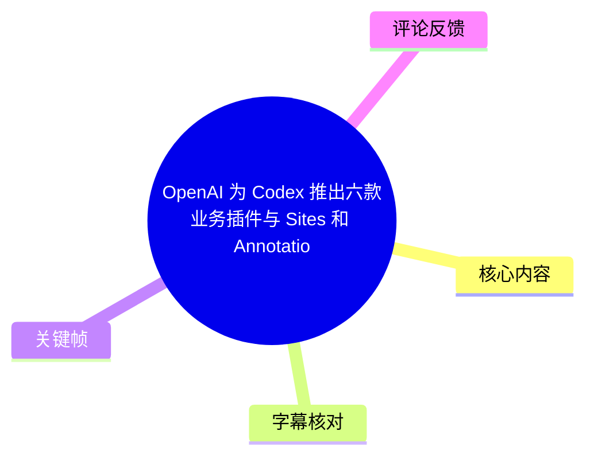
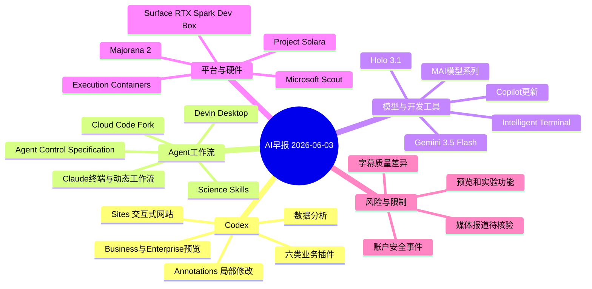
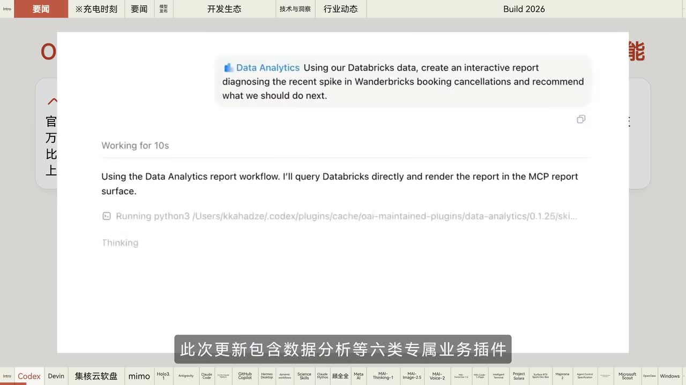
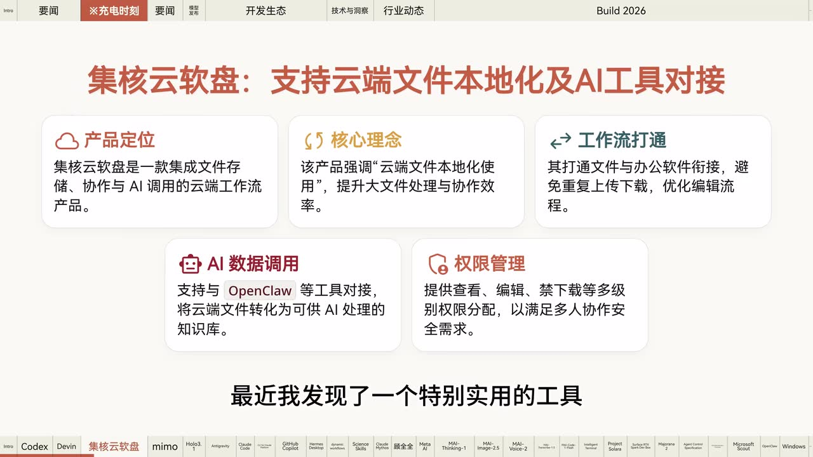
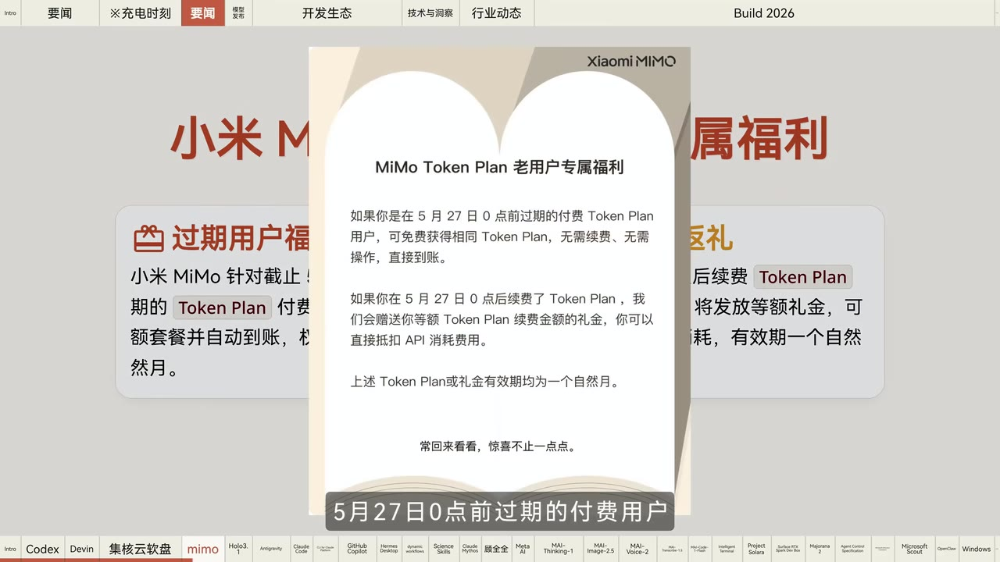
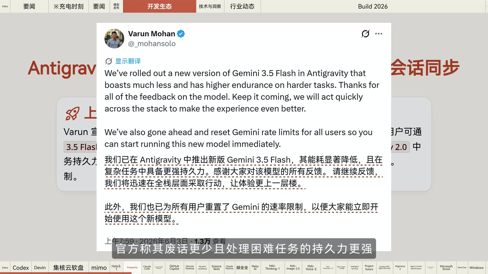

# OpenAI 为 Codex 推出六款业务插件与 Sites 和 Annotations功能【AI 早报 2026-06-03】

> 来源：[Bilibili 视频](https://www.bilibili.com/video/BV19LV26REHK) 
> UP 主：橘鸦Juya｜发布时间：2026-06-03｜视频时长：07:40

## 小结

这是一期集中播报 AI 开发工具、Agent 平台、模型与微软 Build 2026 动态的早报。最核心的新闻是 OpenAI 为 Codex 扩展面向知识工作的能力：推出包括数据分析在内的六类业务插件，并增加 **Sites**（将内容转为交互式网站）与 **Annotations**（局部精确修改）功能；视频称这些能力正在向 Business 和 Enterprise 用户提供预览。

围绕 Agent 工作流，视频还提到 Cognition 将 Windsurf 升级为 **Devin Desktop**，作为管理本地和云端多 Agent 的控制中心；Cloud Code 增加后台 Fork 工作流；Claude 增加终端 API 调用能力与动态多 Agent 工作流；Google DeepMind 开源 Science Skills 科研 Agent 工具包。共同方向是：让 Agent 获得更完整的上下文、工具接入、任务编排与隔离治理能力。

微软是后半段的主要信息源：视频称 Microsoft AI 一次发布 7 款 MAI 模型，覆盖推理、图像、语音、转写与代码；还公布了智能终端、面向 Agent 设备的平台、带 128GB 统一内存的本地 AI 开发主机、量子芯片、Agent 治理标准及容器化隔离方案。

视频中包含一段“集核云软盘”推广。其主张是将云端文件本地化使用、避免预下载、支持 AI 对文件进行总结/提炼/分析并在多设备同步；该段属于产品宣传，读者应自行核实隐私、权限、团队协作和免费试用的具体条款。

所有信息具有强时效性：视频为 **2026 年 6 月 3 日**的新闻汇总，涉及预览版、实验版、分批推送、预计发售和媒体报道的内容，均不等同于当前仍可用、所有地区均可用或已经独立验证的结论。尤其是站内字幕与视频主题完全不符，本文以时间覆盖率较高的本次 ASR 为主，并结合关键帧修正了部分名称。

## 思维导图

## 目录

- [开场与 Codex 业务能力更新](#开场与-codex-业务能力更新)
- [Devin Desktop 与集核云软盘推广](#devin-desktop-与集核云软盘推广)
- [模型、CLI 与开发者生态更新](#模型cli-与开发者生态更新)
- [科研 Agent、安全与行业动态](#科研-agent安全与行业动态)
- [Microsoft AI 模型与编码工具](#microsoft-ai-模型与编码工具)
- [微软 Agent 平台、硬件与量子计算](#微软-agent-平台硬件与量子计算)
- [可执行的关注步骤](#可执行的关注步骤)
- [结论与限制](#结论与限制)
- [关键帧](#关键帧)
- [字幕比对](#字幕比对)
- [评论分析](#评论分析)
- [处理记录](#处理记录)

## 开场与 Codex 业务能力更新 [00:00:00](https://www.bilibili.com/video/BV19LV26REHK?t=0)

视频开场说明日期为 6 月 3 日、星期三，随后进入新闻播报。首条新闻称，OpenAI 为 Codex 推出多项新能力，目标是把应用范围从编程进一步拓展到更广泛的知识工作场景。

### Codex：业务插件、Sites 与 Annotations [00:00:00](https://www.bilibili.com/video/BV19LV26REHK?t=0)

视频中明确提到以下内容：

1. **六类专属业务插件**：包含“数据分析”等六类。ASR 和画面均未完整列出其余五类名称，因此不能据此补全或推断。
2. **数据分析插件**：关键帧展示了一个 `Data Analytics` 工作流示例：用户要求基于 Databricks 数据创建交互式报告，分析 Wanderbricks 预订取消量近期激增的原因并提出后续建议；界面文字显示其会直接查询 Databricks，并在 MCP report surface 中渲染报告。
3. **Sites 功能**：视频标题写为 “Sites”，ASR 将其误识别为 “Size”。其用途被描述为：**将内容转化为交互式网站**。
4. **Annotations 功能**：支持对内容进行**局部精确修改**。
5. **可用范围**：这些功能当时正向 **Business 与 Enterprise** 用户推出预览版，而非视频所称的全量正式发布。

> 图：画面显示 Codex 的 `Data Analytics` 任务示例、Databricks 数据源和 MCP 报告渲染描述。它是“六类业务插件包含数据分析”的直接画面佐证，也说明此类能力面向数据查询与交互式报告产出，而不仅是文本问答。

**实践含义：**如果所在组织拥有相应预览资格，可优先用低风险、可验证的内部数据任务测试插件，例如取消率趋势分析、运营周报或数据异常定位。将生成结果用于决策前，仍应检查数据权限、查询范围、计算逻辑与结论来源。

## Devin Desktop 与集核云软盘推广 [00:00:24](https://www.bilibili.com/video/BV19LV26REHK?t=24)

### Cognition：Windsurf 升级为 Devin Desktop [00:00:24](https://www.bilibili.com/video/BV19LV26REHK?t=24)

视频称 Cognition 将 Windsurf 升级为 **Devin Desktop**，并将其定位为统一管理本地与云端多 Agent 的控制中心。报道中的可确认要点包括：

- 产品已开放下载；
- 支持通过 **ACP 协议**接入 Codex 等第三方 Agent；
- 现有用户会自动更新；
- 现有定价维持不变。

这里的“支持接入”不意味着任意 Agent 均已实现完全相同的能力或权限模型；接入前应分别核对 ACP 兼容性、账户授权范围、代码及数据是否会进入云端，以及本地与远程任务的审计能力。

### 集核云软盘：云端文件本地化与 AI 文件处理 [00:00:51](https://www.bilibili.com/video/BV19LV26REHK?t=51)

这一段是视频中的推广内容。视频将集核云软盘描述为集文件存储、协作与 AI 调用于一体的云端工作流产品，主要卖点为：

- 安装后，电脑会像多出一块本地磁盘；
- 文件无需先从网盘下载，即可直接打开、编辑与操作；
- 可启动 AI Agent 对文件进行总结、提炼和分析，将零散资料整理为知识库；
- 支持不同设备间同步；
- 适用场景包括异地办公团队、个人办公及多设备协同；
- 视频称注册可获免费试用，链接位于评论区。

> 图：画面将产品能力拆为“产品定位、核心理念、工作流打通、AI 数据调用、权限管理”，并写明可对接 OpenClaw 等工具。该图有助于区分视频的产品宣称与已在新闻正文中播报的第三方事实。

**使用限制与核查项：**

- “无需下载即可编辑”通常涉及按需同步、缓存或挂载机制；实际离线可用性、冲突处理和大文件体验需实测。
- 团队使用前应核对文件驻留位置、加密方式、共享链接策略、下载限制、离职交接与审计日志。
- 若将企业资料交由 AI Agent 处理，应先确认模型提供方、数据保留规则、是否用于训练、权限继承及敏感信息脱敏流程。
- “免费试用”是营销权益，视频未提供具体时长、容量或付费规则。

### 小米 MiMo：Token Plan 老用户权益 [00:01:15](https://www.bilibili.com/video/BV19LV26REHK?t=75)

视频称小米 MiMo 发布 Token Plan 老用户福利：

- 在 **5 月 27 日 0 点前过期**的付费 Token Plan 用户，可免费获赠相同 Token Plan；
- 无需操作，权益直接到账；
- **5 月 28 日 0 点后续费**的用户，获得等额礼金，可用于 API 消耗；
- 上述 Token Plan 或礼金的有效期均为**一个自然月**。

> 图：画面明确列出两个用户分组、对应的赠送或礼金方案，并写明有效期为一个自然月。该帧用于保留新闻中最关键的截止日期和时效条件。

## 模型、CLI 与开发者生态更新 [00:01:40](https://www.bilibili.com/video/BV19LV26REHK?t=100)

### Holo 3.1 与 Gemini 3.5 Flash [00:01:40](https://www.bilibili.com/video/BV19LV26REHK?t=100)

视频播报：

- **H Company Holo 3.1**：基于“视觉问答”（ASR 此处专名识别存在不确定性）推出模型系列；新系列强化跨平台控制能力，并首次提供为本地推理优化的量化检查点，以支持完全本地化的端侧部署。
- **AntiGravity Gemini 3.5 Flash**：上线新版模型。官方称其“废话更少”、处理困难任务时具有更强持久力，并已为全体用户重置速率限制。
- **AntiGravity CLI v1.0.4**：支持从 AntiGravity 2.0 同步对话。

> 图：公告原文称新版 Gemini 3.5 Flash “更少废话”、对高难度任务有更高耐力，并提到已为所有用户重置 Gemini 速率限制。该画面可用于校验 ASR 对产品名和功能描述的识别。

这里的“更少废话”“更强持久力”属于官方产品表述，不是视频提供的独立基准测试。评估模型时，仍应在自身任务集上测试完成率、工具调用错误率、上下文保持能力、延迟与成本。

### Cloud Code、Claude 与 GitHub Copilot [00:02:04](https://www.bilibili.com/video/BV19LV26REHK?t=124)

视频继续报道开发工具更新：

- **Cloud Code Fork**：Cloud Devs 更新 Fork 命令，使其能够在后台运行携带完整上下文的 Agent 并返回结果；原有功能更名为 **Branch**。
- **Anthropic 命令行工具**：支持在终端直接调用 Claude Platform 的全部 API 端点，覆盖 Messages API 与 Managed Agents；Cloud Code 原生集成 GitHub。
- **GitHub Copilot**：
  - Copilot App 技术预览扩展至更多订阅层级；
  - Copilot SDK 正式发布；
  - 增加安全沙盒；
  - CLI 引入实验性终端 UI；
  - 支持可定制代码审查；
  - 引入 Partner Agent Apps。

对于后台执行且携带完整上下文的 Agent 任务，重点不只是效率：还要设置任务超时、并发限制、分支隔离、日志留存和敏感变量最小化暴露。

### Hermes Desktop、Dynamic Workflows 与 Science Skills [00:02:53](https://www.bilibili.com/video/BV19LV26REHK?t=173)

- **Nous Research Hermes Desktop**：开源 Agent 的原生桌面应用进入公开预览，支持 macOS、Windows 和 Linux。
- **Anthropic Dynamic Workflows**：官方播客详解该能力；视频称 Claude 可按需编写多 Agent 协作套件，以结构化方式处理复杂任务，并可经 Ultra Code 触发。
- **Google DeepMind Science Skills**：在 GitHub 开源的科研 Agent 工具包，集成 30 多个主流数据库与模型，以提升 Agent 工作流效率；可独立下载，也可集成至 Google AntiGravity 平台使用。

这些项目的共同趋势是把 Agent 从“单轮调用模型”推进到“编排多个角色、连接外部工具、保留执行上下文”的工作流系统。科研场景接入数据库与模型时，需要额外保留文献来源、数据库版本、检索式、运行时间和可重复的工作流定义。

## 科研 Agent、安全与行业动态 [00:03:17](https://www.bilibili.com/video/BV19LV26REHK?t=197)

### Glasswing 与字节跳动人员动态 [00:03:17](https://www.bilibili.com/video/BV19LV26REHK?t=197)

视频称：

- Anthropic 扩展 **Project Glasswing**，将 Claude “Methods Preview”（ASR 对具体名称的转写不够稳定）访问权限扩大到约 150 家新组织，用于扫描关键代码库漏洞。
- 字节跳动 Seed 团队科学家**顾全全**宣布离职；按视频转述，其曾主导 Seed4 等模型以及 Seed2.0 预训练相关技术。视频又引述媒体消息称，知情人士认为其后续可能进入 AI 制药创业。

后半部分是“据媒体报道”“知情人士称”的二手信息，视频未给出原始报道或本人后续计划的直接材料，因此应视为未证实的行业消息，而不是既成事实。

### Meta AI 客服账号安全事件 [00:03:38](https://www.bilibili.com/video/BV19LV26REHK?t=218)

视频称有黑客曾利用 Meta 的 AI 客服聊天机器人劫持 Instagram 账号，诱使助手重置密码；Meta 官方确认该问题已经修复。

可迁移的安全经验包括：

1. 身份验证、密码重置和高风险账户操作不应只依赖自然语言对话引导；
2. 应将高风险动作绑定到更强的二次验证、可信设备、冷却期与人工复核；
3. Agent/客服工具必须限制其可调用的高权限接口，并完整记录决策与调用链；
4. “已修复”只说明相关问题已被官方处理，不代表用户不再需要启用多因素认证、检查登录会话和防范钓鱼。

## Microsoft AI 模型与编码工具 [00:04:02](https://www.bilibili.com/video/BV19LV26REHK?t=242)

### MAI 推理、图像、语音与转写模型 [00:04:02](https://www.bilibili.com/video/BV19LV26REHK?t=242)

视频称 Microsoft AI 发布 **7 款 MAI 模型**，其中明确提到：

| 模型/产品 | 视频所述能力与参数 | 可用状态 |
| --- | --- | --- |
| MAI Thinking E | 旗舰推理模型；总参数量 1T、激活参数量 35B；未使用第三方模型蒸馏的“丛林训练”（ASR 对训练术语存在不确定性）；官方称在 SWE-Bench Pro 等基准达到领先模型水平 | Microsoft Foundry 私有预览 |
| MAI Image 2.5 | 高保真生成、精确局部编辑；视频称在 Arena 图像榜位居第二 | 已集成 PowerPoint，并在 Foundry 开放开发者调用 |
| MAI Image 2.5 Flash | MAI Image 2.5 的 Flash 版本 | 与上项一并提及 |
| MAI Voice 2 | 新一代文本转语音；支持包括简体中文在内的 15 种语言；官方称生成语音已接近与真人录音难以区分 | Azure Foundry 上线，逐步集成至 VS Code 等产品 |
| MAI Transcribe 1.5 | 多语言语音转文本；支持 43 种语言；官方称有同类最佳词错率 | 已集成 Copilot、Teams 等产品，并在 Foundry 可用 |

其中，“领先”“位居第二”“难以区分真人录音”“同类最佳词错率”均为视频转述的官方口径。实际选型要以目标语言、噪声环境、领域词汇、隐私合规、请求配额、价格和自有测试集为准。

### MAI Code OneFlash 与 Intelligent Terminal 0.1 [00:05:14](https://www.bilibili.com/video/BV19LV26REHK?t=314)

视频还称微软推出：

- **MAI Code OneFlash**：编码模型，面向 VS Code 与 GitHub Copilot 个人用户陆续推出；官方称性能优于 “Code Tycoon 4.5”（该对比对象名称为 ASR 转写，存在专名误识别可能）。
- **Intelligent Terminal 0.1**：开源、实验性的 Windows Terminal 分支应用，内置原生 Agent 能力，默认搭载 GitHub Copilot CLI，并支持运行其他兼容 ACP 的 Agent。

“陆续推出”和“实验性”意味着不同账户、地区或订阅层级的实际访问情况可能不同。终端 Agent 的安全重点包括：命令审批、工作目录限制、网络访问控制、密钥脱敏、危险命令拦截和可回滚环境。

## 微软 Agent 平台、硬件与量子计算 [00:05:37](https://www.bilibili.com/video/BV19LV26REHK?t=337)

### Project Solara、Surface RTX Spark Dev Box 与 Majorana 2 [00:05:37](https://www.bilibili.com/video/BV19LV26REHK?t=337)

视频中与平台、硬件相关的内容如下：

- **Project Solara**：面向 Agent 优先设备的端云融合平台，基于 Android 开发；当时以两款概念参考设计进行内部测试，并计划进行企业试点。
- **Surface RTX Spark Dev Box**：面向本地 AI 开发的紧凑主机，搭载 NVIDIA RTX Spark 超级芯片与 **128GB 统一内存**；视频称预计于当年晚些时候在美国市场独家发售。
- **Majorana 2 拓扑量子芯片**：视频称其借助 Agent 将量子比特可靠性提升“千倍”（该数值在 ASR 中转写不稳定，需以微软原始公告复核）；同时 Microsoft Discovery 平台全面可用，微软将可扩展量子计算机一期目标提前至 **2029 年**。

上述硬件与量子计算信息中，内部测试、预计上市、路线图提前均属于计划性表述，不能视为已经面向市场交付的能力。

### Agent Control Specification 与 Execution Containers [00:06:25](https://www.bilibili.com/video/BV19LV26REHK?t=385)

视频称微软发布两项 Agent 治理/隔离能力：

1. **Agent Control Specification**  
   一个开源标准，旨在解决 AI Agent 行为控制碎片化的问题。该规范以 SDK 形式发布，允许开发与合规团队通过单一、可移植的策略文件，在 Agent 运行的多个拦截点进行跨框架统一治理。

2. **Microsoft Execution Containers Max SDK**  
   早期预览版，为 Windows 等平台上的 AI Agent 提供跨平台、策略驱动的沙箱隔离机制。

这一组更新的重点在于：生产环境中的 Agent 不应只有“会做事”的模型，还要有可移植策略、权限边界、隔离执行、拦截点和合规审计。早期预览 SDK 在大规模使用前需评估兼容性、性能、逃逸风险、策略覆盖率与运维成本。

### Autopilot Agent、Microsoft Scout 与 Windows 开发者体验 [00:06:48](https://www.bilibili.com/video/BV19LV26REHK?t=408)

视频最后播报：

- 微软宣布新的 Agent 类别 **Autopilot Agent**，并推出首个产品 **Microsoft Scout**；
- Scout 基于 OpenCloud 构建、集成在 Microsoft 365 应用中，可自主协调日程、识别风险，且不需每次提示；
- 产品当时以实验版本通过私人预览与 Frontier 组织提供；
- OpenCloud 与微软达成合作，企业可借助 Microsoft Execution Containers 安全运行 OpenCloud；
- 微软还为 OpenCloud 打造 Windows Companion App；
- 在 Build 2026，微软称 Windows 11 开发者优化系统将提供原生 Linux 命令行工具、实验性智能终端、新一代端侧 AI Agent，并计划推出搭载英伟达芯片的专用 AI 开发硬件。

自主协调日程和识别风险属于高影响自动化场景。即使产品减少了逐次提示，也应保留授权范围、行动前确认阈值、撤销通道、日程冲突处理策略与人工监督。

## 可执行的关注步骤 [00:00:00](https://www.bilibili.com/video/BV19LV26REHK?t=0)

以下步骤是根据视频中已出现的产品状态和限制整理的实践清单，不代表视频提供了统一安装教程。

1. **确认访问资格与版本状态**  
   Codex 新能力面向 Business、Enterprise 预览；MAI Thinking E 为 Foundry 私有预览；Copilot、Scout 等能力存在技术预览、实验版或分批推送。先在官方控制台、组织管理员设置和地区可用性页面确认权限。

2. **先用低风险任务验证 Agent 工作流**  
   对 Codex 业务插件、Devin Desktop、Dynamic Workflows、Science Skills 等工具，先选择不含敏感数据且有明确正确答案的任务，例如对公开数据做报告、在隔离仓库修复测试失败、整理可公开文档。

3. **为后台与终端 Agent 建立边界**  
   对 Cloud Code Fork、Intelligent Terminal、Copilot CLI 等可能执行命令的能力，至少设置：
   - 独立工作目录或容器；
   - 最小权限 Token；
   - 网络出口与依赖下载限制；
   - 高风险命令审批；
   - 完整日志和结果复核；
   - 超时、成本与并发上限。

4. **评估本地部署与硬件适配**  
   Holo 3.1 提到量化检查点和端侧部署，Surface RTX Spark Dev Box 则是尚未上市的硬件信息。实际部署需从模型量化格式、GPU/统一内存、上下文长度、吞吐、驱动兼容性和数据保密要求逐项测试，而非仅依据宣传语判断。

5. **处理云盘和 AI 知识库前做数据治理**  
   若使用视频推广的集核云软盘或类似工具，应先确定谁可读取云端文件、AI 是否可访问全部目录、是否支持权限继承、删除是否同步、数据如何导出，以及第三方模型是否保留输入内容。

## 结论与限制 [00:07:13](https://www.bilibili.com/video/BV19LV26REHK?t=433)

本期新闻最值得关注的主线有三条：

- **Codex 向知识工作扩张**：业务插件、交互式站点生成和局部编辑，说明代码 Agent 正在尝试承接数据分析与内容生产工作流。
- **Agent 工程化进入治理阶段**：多 Agent 编排、ACP 接入、后台执行、策略规范和执行容器同时出现，表明“如何安全地让 Agent 执行任务”与模型能力同等重要。
- **微软加速构建完整 AI 栈**：从 MAI 模型到 Foundry、Copilot、终端、硬件、容器和量子路线图，覆盖了模型、开发工具、运行环境和基础设施。

但视频是快讯汇总而非官方文档，存在以下限制：

- 多个功能仍处于预览、私有预览、实验或内部测试阶段；
- 部分信息来自官方性能宣称，缺少视频内的独立测试条件；
- 顾全全去向、Meta 事件细节等包含媒体转述，须以原始来源进一步核验；
- 本次 ASR 对部分英文专名、版本名、训练术语和数值存在误识别；
- 站内字幕内容与本视频完全不对应，不能作为事实依据；
- 视频发布日期为 2026-06-03，后续产品策略、资格、价格、功能命名和安全状态均可能变化。

## 关键帧

| 关键帧 | 对应内容 | 选用价值 |
| --- | --- | --- |
|  | Codex Data Analytics 插件 | 直接展示 Databricks 查询与 MCP 报告工作流，支撑“数据分析插件”描述。 |
|  | 集核云软盘推广 | 画面呈现产品定位、云端文件本地化、AI 数据调用和权限管理等卖点。 |
|  | Token Plan 老用户福利 | 明确展示 5 月 27 日、5 月 28 日、一个自然月等关键时效信息。 |
|  | AntiGravity Gemini 3.5 Flash | 含英文公告原文，可辅助校正“更少废话、困难任务持久力、重置速率限制”等 ASR 内容。 |

## 字幕比对

| 字幕来源 | 完整性 | 专有名词 | 时间轴 | 主要问题 |
| --- | --- | --- | --- | --- |
| Bilibili 站内字幕 `p01-ai-zh.srt` | 与时长接近，但内容完全错误 | 不可用 | 有真实毫秒级时间轴，但对应另一段“地球承载力/生物电池”内容 | 与本视频 AI 早报主题、画面和音频均不一致，不能用于正文事实或时间定位 |
| 本次 ASR 字幕 | 高，21 段覆盖约 457.54 秒，覆盖率 99.65% | 中等；多数品牌名可识别，但英文名称、版本号和术语有误识别 | 可用，首段 00:00:00.300，末段 00:07:38.790 | “Sites”识别为“Size”；部分名称如 Holo、Methods、Code 对比对象及数值存在不稳定转写；长段落缺少更细粒度断句 |

**最终字幕选择：**采用本次 ASR 的真实时间戳作为正文时间轴依据。源视频存在正常音轨：ASR 诊断显示 `speechCoverage=0.9965`、无大间隔、未标记 `noAudioStream=true`，因此不是无音轨视频。站内字幕虽具有时间码，但内容错配，已排除。

**关键校正：**

- 标题与画面共同表明 Codex 功能应为 **Sites**，而非 ASR 的 “Size”；
- `Data Analytics`、Databricks、MCP report surface 可由关键帧英文界面确认；
- AntiGravity 的 Gemini 3.5 Flash、速率限制重置可由公告画面确认；
- 对无法由画面或题目可靠消歧的名称、数值，正文保留“ASR 不确定性”说明，不作补写。

## 评论分析

以下仅分析可获取热评前三条；评论体现用户观点与体验，不应视为已核验事实。

1. **“打电话问一下奥特曼，什么时候给我重置[doge]”**（150 赞）  
   评论以玩笑方式呼应视频中的“速率限制重置”新闻，表达用户对配额、限流或账户权益恢复的关注。它没有提供具体产品、账号状态或官方依据，属于情绪化互动。

2. **“现在只想要个v4.1，要个多模态+编程超过glm5.1就够了”**（132 赞）  
   该评论反映部分用户对模型能力的优先级：希望获得兼具多模态和编程能力的模型，并以 GLM 5.1 作为主观比较基线。评论未说明测试集、任务类型、成本、上下文长度或版本来源，因此不能据此得出模型能力排名。

3. **“codex刚开点起色就开始恶心用户，我这种每个月正常花美金充值的账号都要二次验证，气死了”**（64 赞）  
   评论者声称其付费 Codex 账号被要求二次验证，并对体验表示不满。这是单一用户的账户体验陈述，可能涉及风控、地区、支付、身份验证或账户状态等多种因素；视频本身没有讨论该问题，也没有足够证据判断其普遍性或具体原因。

## 处理记录

- Worker ID：`worker-mrj0wjed-b0c290ad`
- 模型：`gpt-5.6-terra`
- 工具与素材：视频元数据、站内 SRT、`asr/transcript.srt`、`asr/asr-result.json` 覆盖诊断、热评 JSON、关键帧 `frames/frame-001.jpg` 至 `frames/frame-004.jpg`
- 字幕选择：检查了站内字幕与本次 ASR；站内字幕内容错配，采用本次 ASR 的时间戳和内容为主，结合标题与关键帧校正可确认的专名。
- 关键帧依据：优先选择直接承载核心新闻或关键条件的画面，包括 Codex 数据分析流程、推广产品能力、MiMo 权益截止条件和 Gemini 官方公告。
- 时间轴依据：正文链接均按本次 ASR SRT 的真实起始时间换算为秒数生成，未按文字顺序猜测时间位置。
- 缓存清理：未提供可执行的缓存清理日志或结果；本文不将其编造为已完成。
- 未解决问题：六类 Codex 业务插件中的其余五类名称未在素材中列出；部分英文专名、训练术语及量子比特提升数值受 ASR 误识别影响，需查阅对应官方公告核验。
