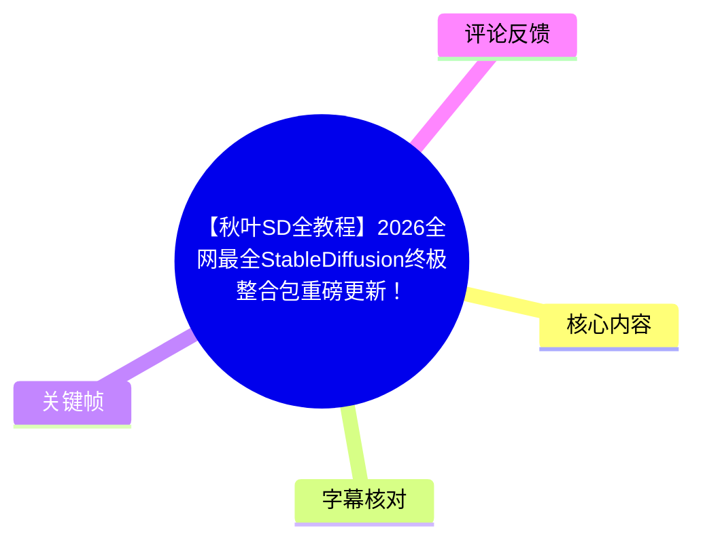
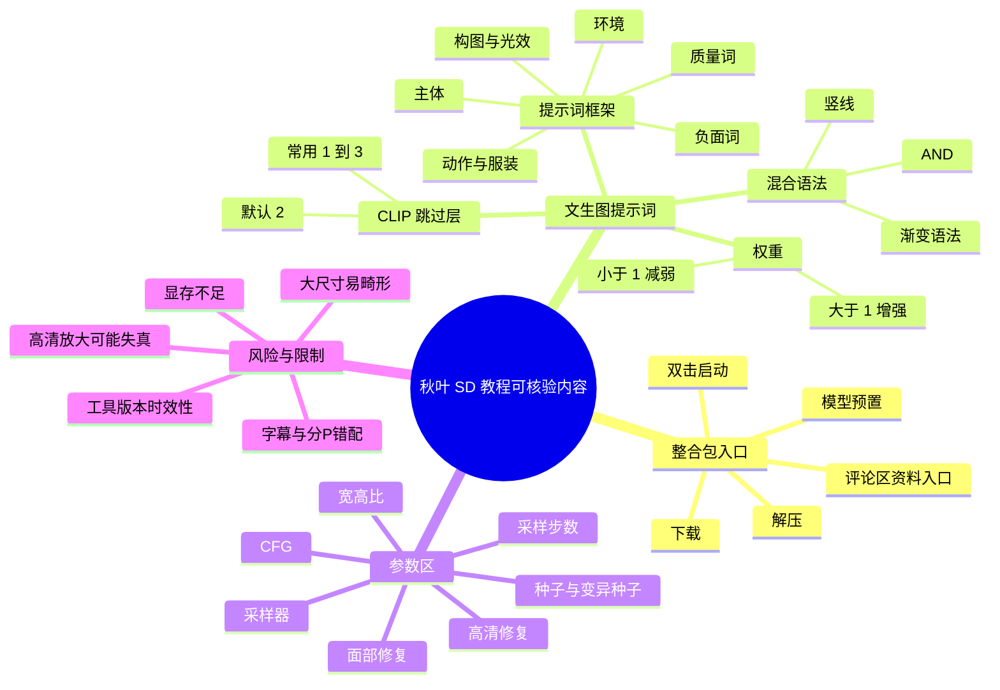

# 【秋叶SD全教程】2026全网最全StableDiffusion终极整合包重磅更新！一键安装抢先使用&最新整合包，附零基础精通出图教程+商业实战案例，效率拉满！

> 来源：[Bilibili 视频](https://www.bilibili.com/video/BV1iZd8BnEw3)  
> UP 主：秋枼aaakki｜合集：AIcode｜元数据总时长：39,216 秒（约 10 小时 53 分 36 秒）  
> 视频简介：`最新秋叶SD整合包看评论区~`

## 小结

该投稿在元数据中被组织为 7 个分 P：开头为约 77 秒的“秋叶 SD5.1 安装”介绍，后续分 P 的标题依次涉及 SD 基础、绘图原理与模型、文生图、参数区、图生图及 ControlNet。可可靠核验的站内字幕中，开场明确宣传一个包含模型与常用配置的 Stable Diffusion 整合包，声称使用流程可简化为“下载、解压、双击打开”，资料入口位于评论区，并强调不应为软件或资料付费。

可确认的技术课程内容主要来自两个与 SD 主题一致的站内字幕片段：其一是文生图提示词与 CLIP 跳过层，重点包括提示词的结构化写法、权重语法、预设管理、从 C 站复制参数的限制，以及混合/渐变语法与采样器的关系；其二是文生图参数区，涉及采样步数、采样器、面部修复、高清修复、画幅尺寸、CFG、种子与变异种子。

视频的核心经验不是“参数越高越好”，而是根据目标和显卡资源做控制：CLIP 跳过层默认值 2 通常即可；采样步数常规建议 30–40，性能较弱可从 20 起；全身人像宜使用纵向尺寸；高清修复适合先小图后放大，但倍数、重绘幅度和显存都需克制；CFG 应和采样步数一起观察，而非机械理解为“提示词服从度”。

需要特别注意素材一致性问题：站内字幕 p02、p03、p06、p07 分别是诺贝尔奖、车机、手机镜头膜、反诈短剧等完全无关内容，显然不能作为本视频 SD 教程的知识依据；本次 ASR 虽识别到了开场 SD 宣传，但其时间轴整体偏移至 00:00:31 之后，且分句严重合并。因此本文以与页面主题相符、具备分段时间轴的站内字幕 p01、p04、p05 为主，明确标注无法验证的部分。

本视频所讲 Stable Diffusion WebUI、模型、插件、整合包界面与参数名称都具有明显时效性。尤其是 UP 主在课程中引用“2023 年 5 月 10 日”的工具状态与插件能力，不能直接视为 2026 年仍然有效；安装包下载入口、模型版本、插件兼容性、收费情况与平台政策均应以当前官方或项目仓库信息复核。

## 思维导图





## 目录

- [素材范围、分 P 与时效性](#素材范围分-p-与时效性)
- [整合包安装与获取提醒](#整合包安装与获取提醒)
- [文生图：CLIP 跳过层与覆盖设置](#文生图clip-跳过层与覆盖设置)
- [文生图：提示词结构、预设与权重](#文生图提示词结构预设与权重)
- [文生图：混合与渐变语法](#文生图混合与渐变语法)
- [参数区：采样步数与采样器](#参数区采样步数与采样器)
- [参数区：面部修复与高清修复](#参数区面部修复与高清修复)
- [参数区：画幅尺寸、CFG 与种子](#参数区画幅尺寸cfg-与种子)
- [可执行工作流与限制](#可执行工作流与限制)
- [关键帧说明](#关键帧说明)
- [字幕比对](#字幕比对)
- [评论分析](#评论分析)
- [处理记录](#处理记录)

## 素材范围、分 P 与时效性

### 分 P 结构与可用性 [00:00:00](https://www.bilibili.com/video/BV1iZd8BnEw3?t=0)

提供的元数据列出以下分 P：

| 分 P | 元数据标题 | 时长 | 累计起点 | 字幕素材可信度 |
| --- | --- | ---: | ---: | --- |
| P1 | 秋叶SD5.1安装 | 77 秒 | 00:00:00 | 高：p01 与主题一致 |
| P2 | SD 教程零基础 | 3,010 秒 | 00:01:17 | 低：p02 实为诺贝尔奖话题 |
| P3 | 绘图原理及模型详解 | 5,845 秒 | 00:51:27 | 低：p03 实为车机/音乐片段 |
| P4 | 文生图详解 | 5,382 秒 | 02:28:52 | 中高：p04 为 SD 文生图课程片段 |
| P5 | 文生图-参数调节区详解 | 6,050 秒 | 03:58:34 | 中高：p05 为参数课程片段 |
| P6 | 图生图详解 | 9,165 秒 | 05:39:24 | 低：p06 实为手机镜头膜评测 |
| P7 | ControlNet 详解 | 9,687 秒 | 08:12:09 | 低：p07 实为反诈短剧片段 |

因此，不能根据分 P 标题替代实际内容，也不能把 p02、p03、p06、p07 的字幕内容编入 SD 教程。本文只整理有明确 SD 内容支持的 P1、P4、P5 片段；图生图与 ControlNet 虽出现在分 P 标题中，但当前提供素材没有与之匹配的可靠字幕，无法展开其具体操作或参数。

### 时效性判断 [00:00:56](https://www.bilibili.com/video/BV1iZd8BnEw3?t=56)

开场将整合包描述为“最新最好用”，而 p04 课程正文中又明确说课程录制时间是“2023 年 5 月 10 日”。这意味着至少存在两层不同时间语境：

1. **投稿与整合包宣传语境**：依据元数据为 2026 年投稿，开场用于宣传更新后的整合包。
2. **课程正文语境**：可核验的文生图课程内容来自较早版本的 WebUI、模型与插件生态。

使用时应区分“课程讲解的原理/经验”和“当前软件界面/插件名称/下载包内容”。前者可作为理解框架，后者必须在当前环境中复验。

## 整合包安装与获取提醒

### 三步启动与免费声明 [00:00:11](https://www.bilibili.com/video/BV1iZd8BnEw3?t=11)

开场可确认的操作承诺为：

1. **下载**
2. **解压**
3. **双击打开**

UP 主声称整合包无需用户自行安装复杂插件、配置环境，且模型已预先准备；其面向对象是初学者。站内字幕还明确表示软件使用及资料分享“完全免费”，并提醒对“软件收费”或“发资料收费”的情况保持警惕。

资料入口被描述为评论区，而不是视频正文中的固定 URL。由于当前可获取热评未提供下载链接，本文不能补写或推断实际下载地址。

### 适用目标与边界 [00:00:45](https://www.bilibili.com/video/BV1iZd8BnEw3?t=45)

视频称只要有电脑与足够时间，可尝试生成 AI 漫画或 AI 短剧。这是 UP 主的使用主张，不等于性能保证。实际可行性受到以下因素影响：

- 显卡型号与显存容量；
- 所用基础模型、VAE、LoRA 与插件；
- 图像尺寸、批次、采样步数和高清修复倍数；
- 操作系统、驱动、Python/依赖与整合包版本；
- 商业项目的版权、人物肖像、模型许可与平台规则。

课程以 Stable Diffusion WebUI 为基础，适合希望掌握本地文生图基础控制逻辑的用户；不应把“零门槛”理解成不需要理解参数或不需要排查兼容问题。

## 文生图：CLIP 跳过层与覆盖设置

### CLIP 跳过层的课程解释 [02:29:09](https://www.bilibili.com/video/BV1iZd8BnEw3?t=8949)

课程把 CLIP 解释为将提示词转换为 Stable Diffusion 可理解信息的中间环节，并用“CPU”作类比。该类比用于帮助初学者理解，并不是严格的工程定义。

讲者将“CLIP 跳过层”解释为：在文本信息经过 CLIP 处理、传递给 SD 的路径上，主动跳过部分处理层。跳过层数越多，模型可能越少地读取或保留提示词信息，因此出图会逐步偏离输入描述。

课程演示使用了类似以下的简单提示词：

```text
a girl
pink hair
green eyes
```

其观察结论是：

- 跳过值 **1、2**：仍能较好遵循人物、发色和眼睛颜色描述；
- 跳过值 **3**：开始出现偏离，但仍可能保留部分色彩特征；
- 跳过值 **4 及以上**：与提示词关系明显变弱；
- 课程称 CLIP 的处理层总数为 **12**，填到 13 时可能得到灰图，填更大可能无法出图。

> 这是该课程及当时模型/界面的经验，不应直接当作所有 SD 模型、所有 WebUI 或所有工作流的通用硬规则。

### 推荐值与 CFG 的区别 [02:36:51](https://www.bilibili.com/video/BV1iZd8BnEw3?t=9411)

课程给出的操作建议是：

- 常用范围：**1–3**
- 默认值：**2**
- 一般没有特殊目的时，不必频繁调整。
- 不建议为了“更强”而无节制提高跳过层数。

讲者特别区分 CLIP 跳过层和 CFG：

- **CLIP 跳过层**：课程将其理解为主动减少模型读取提示词处理过程的一部分；
- **CFG**：在后续参数课中被描述为和全局/局部画面计算相关的参数。

两者都可能影响“画面是否像提示词”，但不是同一个机制，不能互相替代。

### 覆盖设置：导入历史图时的隐藏变量 [02:40:11](https://www.bilibili.com/video/BV1iZd8BnEw3?t=9611)

课程演示从图库或 C 站导入图片到文生图时，可能同时导入原图的生成参数。若不关闭“覆盖设置”，用户后续修改的某些参数可能被原图参数覆盖，导致测试看起来“参数没有生效”。

可复用的排查步骤：

1. 将历史图发送到文生图。
2. 检查是否出现“覆盖设置”及相关已加载参数。
3. 若目的是独立测试当前参数，关闭/删除覆盖项。
4. 固定或清除种子后再生成，避免把随机变化误判为参数效果。
5. 一次只改一个变量，例如仅改 CLIP 跳过层。

这条经验对所有“从图片恢复参数”的工作流都适用：先确认界面中哪些参数来自当前输入，哪些来自历史图片。

## 文生图：提示词结构、预设与权重

### 提示词的结构化写法 [02:41:20](https://www.bilibili.com/video/BV1iZd8BnEw3?t=9680)

课程不鼓励无理解地照抄别人的整段提示词，而建议先形成描述结构。其给出的构成顺序可以整理为：

1. **质量词**：如高质量、高分辨率、精细细节、杰作等；
2. **主体**：人物、物体或场景的主要对象；
3. **动作/状态**：主体正在做什么；
4. **服装/外观**：穿着、发型、颜色、材质等；
5. **构图**：近景、中景、远景、全身等；
6. **光效**：真实光源、电影灯光等；
7. **环境**：空间站、宇宙、操场等；
8. **负面词**：不希望出现的内容或常见错误。

课程示例围绕“宇航员”展开，可抽象成：

```text
质量词,
宇航员,
穿着宇航服,
在空间站中,
中景,
电影灯光,
太空环境
```

课程强调：质量词中尽量不要混入过于具体的主体词。例如质量词里写“美丽的女孩”，而主体实际想生成男性、动物或产品时，就会引入词汇冲突。

### 中文输入、翻译与负面词 [02:48:45](https://www.bilibili.com/video/BV1iZd8BnEw3?t=10125)

课程展示了先以中文输入主体描述、再用插件翻译为英文提示词的方式。讲者的重点不是要求用户背诵英语，而是掌握描述逻辑与本行业的专业词汇。

经验要点：

- 中文描述可作为构思入口，翻译工具用于转化；
- 真正值得积累的是行业词汇，例如珠宝材质、影视镜头语言、服装面料、建筑风格等；
- 负面词用于减少不想要的常见问题，课程建议优先使用整合包提供的模板；
- Embedding 可出现在正向词或负向词中，但前提是当前环境中已安装并可被正确识别。

课程还强调，质量词、模型和提示词共同影响结果；仅替换模型或仅堆叠质量词都不保证获得目标画面。

### 预设、格式化与 C 站参数复用 [02:54:48](https://www.bilibili.com/video/BV1iZd8BnEw3?t=10488)

课程演示的界面功能包括：

- 加载预设样式；
- 保存当前提示词为预设；
- 刷新预设列表；
- 删除当前提示词；
- 对提示词中的中英文逗号、空格等进行格式化；
- 从 C 站复制图片参数，再由 WebUI 解析回填。

课程提醒，C 站图片的复现不是“复制即完全一致”，原因包括：

- 原图可能依赖当前本地没有的 LoRA；
- 基础模型、VAE、采样器、CLIP 跳过层、种子、高清修复等不一致；
- 图片中可能包含无法自动加载的扩展资源；
- 版本差异会改变相同参数的结果。

预设文件的具体存放位置随 WebUI/整合包版本而变化。课程仅建议不要使用 Excel 直接修改样式相关文件，而使用文本编辑器修改并保存；在当前环境中操作前，应先备份目标文件。

### 权重：显式写法优于手算括号 [03:11:34](https://www.bilibili.com/video/BV1iZd8BnEw3?t=115? )

> 本节站内字幕对应分 P4 的本地时间约 00:42:00；由于原始 SRT 段落过长且本节全局定位按分 P 累计换算，以下链接定位至该课程段落附近。

课程给出的显式权重写法为：

```text
(tag:权重)
```

例如：

```text
(green eyes:1.6)
```

课程中对权重的解释：

| 权重范围 | 课程含义 |
| --- | --- |
| `1` | 默认强度 |
| `> 1` | 增强该词影响 |
| `< 1` | 减弱该词影响 |
| `0.1–100` | 课程称界面可输入范围，但不建议设置过高 |
| 常用上限 | 讲者个人通常不超过 `2` |

其示例指出：提高“绿色眼睛”的权重，不只可能让眼睛更绿，也可能把绿色扩散到头发、服饰等其他区域；提高“红嘴唇”权重，也可能影响周边颜色。因此权重是影响画面分配的工具，不是精确的局部蒙版。

课程不推荐依赖多层圆括号进行权重计算，因为每层括号按约 `1.1` 倍叠加，需要手算；更推荐直接使用 `:1.2`、`:1.6` 等显式数值。课程还演示快捷操作：选中词后用 `Ctrl + ↑` 增加权重，但该快捷键属于特定界面配置，当前版本未必一致。

## 文生图：混合与渐变语法

### 竖线、AND 与交替语法 [03:20:40](https://www.bilibili.com/video/BV1iZd8BnEw3?t=120? )

课程讨论多种混合写法，并反复强调其结果具有随机性、可能需要多次“抽卡”。

#### 1. 竖线混合

```text
red | blue hair
```

课程将其视为非官方、社区实践出的写法，可用于混合颜色、动物特征等。例如 `dog | tiger` 可能生成带虎纹或虎类轮廓的犬类特征，但结果并不稳定。

#### 2. 官方 `AND`

```text
dog AND rabbit
```

课程要求 `AND` 使用大写，并提醒某些采样器不能搭配该语法，点名提到 `UniPC` 与 `DDIM` 不可用。该限制应仅视为课程所用环境的结论；实际兼容性需要在当前 WebUI 与采样器版本中验证。

#### 3. 交替语法

```text
[dog|rabbit]
```

讲者解释为按采样步骤交替计算：第 1 步狗、第 2 步兔、第 3 步狗……。课程认为该语法不支持权重，实用性较低，建议了解即可。

### 渐变语法与采样器依赖 [03:34:10](https://www.bilibili.com/video/BV1iZd8BnEw3?t=128? )

课程重点推荐按步数切换概念的渐变写法：

```text
[dog:rabbit:20]
```

按课程解释：

- 若总采样步数是 30；
- `20` 大于 1，代表前 20 步使用 `dog`；
- 后 10 步使用 `rabbit`。

当最后一项小于 1 时，课程将其理解为比例。例如：

```text
[dog:rabbit:0.6]
```

在 40 步下，前 60% 即 24 步偏向 `dog`，后 40% 偏向 `rabbit`。

课程通过对比多个采样器得出经验：渐变/混合效果是否明显与采样器有关。讲者在其测试中提到 DPM2a、DPM++ 2S 等采样器较能表现按步数切换的效果，但这并非普遍验证结论。

可迁移的实验方法是：

1. 固定模型、提示词、分辨率、种子和采样步数；
2. 只替换采样器；
3. 分别观察生成过程与最终结果；
4. 用 XYZ 表批量对照，而不是凭单张图下结论。

## 参数区：采样步数与采样器

### 采样步数的含义与建议 [03:58:45](https://www.bilibili.com/video/BV1iZd8BnEw3?t=14325)

课程把采样步数解释为图像在去噪过程中更新像素的次数。步数增加通常意味着更多计算与更长耗时，但并非无限提升画质。

课程给出的经验范围：

| 场景 | 建议采样步数 |
| --- | ---: |
| 性能较弱或快速试图 | 约 20 |
| 常规文生图 | 30–40 |
| 盲目拉高至 60、100 | 不推荐，可能显著变慢、显存压力升高，甚至黑图/无法出图 |

讲者用 7、20、40 步进行演示，说明步数较低时画面可能不够完整，步数上升后色彩、结构和细节更充分。但这不是单变量保证：采样器、模型、尺寸和提示词都会共同影响结果。

### 采样器选择 [04:08:30](https://www.bilibili.com/video/BV1iZd8BnEw3?t=14910)

课程展示不同采样器在相同步数下从噪点到成图的过程不同，并提到一种“DPM 自适应”模式会自行决定步数，用户设置的步数不再直接生效，但生成时间很长。

课程个人常用/推荐的采样器包含：

- Euler a（字幕识别为“USA”，按上下文应为 Euler a，但不作为未经画面验证的强结论）；
- DPM++ 2M Karras 一类；
- DDIM；
- UniPC；
- 不清楚适合步数时，可尝试自适应 DPM，但会较慢。

应将这些视为讲者个人经验，而不是固定排行榜。更可靠的选择方式是按自己的模型建立测试矩阵，比较速度、构图、细节、稳定性和插件兼容性。

## 参数区：面部修复与高清修复

### 面部修复的适用风格 [04:14:48](https://www.bilibili.com/video/BV1iZd8BnEw3?t=15288)

课程将面部修复形容为对五官、皮肤瑕疵进行二次优化，类似轻度“美颜”。演示中，低分辨率全身图的人脸容易畸形；打开面部修复后，眼睛、嘴部等五官可能更自然。

课程的风格建议：

| 风格 | 建议 |
| --- | --- |
| 真人/写实 | 可尝试开启 |
| 2.5D 写实插画 | 可尝试开启 |
| 二次元 | 通常不建议开启 |

理由是二次元依赖清晰轮廓、高对比线条与色彩，而面部修复可能将其向“真实、柔化”的方向处理，导致原有风格减弱。面部修复并非解决脸崩的最优或唯一方式；小图中的脸部像素不足时，更根本的处理是采用合理画幅并通过高清修复提高有效细节。

### 高清修复：先小图、后放大再重绘 [04:27:55](https://www.bilibili.com/video/BV1iZd8BnEw3?t=16075)

课程把“高分辨率修复/高清修复”解释为：

1. 先按较小尺寸生成初始图；
2. 将图像放大；
3. 在放大后的画面上进行二次去噪/重绘；
4. 使面部和局部拥有更多可计算的像素，从而改善细节。

讲者用 512×512 的低分辨率全身图举例：人脸区域本来占的像素很少，因此容易“鬼畜”；开启高清修复并放大后，面部区域获得更大的计算空间，五官更容易重建。

课程给出两类放大器建议：

| 内容风格 | 课程推荐放大器 |
| --- | --- |
| 真人 | `4x` 开头的真人放大器 |
| 二次元 | `4x` 加 `6B` 一类的二次元放大器 |

具体名称在不同整合包中可能不同，不能仅凭本字幕确定完整模型文件名。

### 高清修复的限制 [04:40:30](https://www.bilibili.com/video/BV1iZd8BnEw3?t=16830)

课程提出以下限制：

- 放大倍数越大，显存需求越高；
- 512×512 放大 2 倍会得到约 1024×1024；
- 课程演示中，使用 24GB 显存时，放大 3 倍已接近较高显存压力；
- 过大放大倍数可能无法出图，也可能出现嘴部缺损、纹理色块化、真实感下降；
- 高清修复的重绘幅度越高，二次重绘与原始构图差异越大；
- 当高分辨率阶段的迭代步数已经很高时，同时开启面部修复，可能造成瞳孔错位等局部问题。

因此，推荐先使用较保守的放大倍数和重绘幅度，再逐步调高；不要把“文件更大”或“尺寸更大”误认为画质一定更好。

## 参数区：画幅尺寸、CFG 与种子

### 画幅尺寸：避免用超大原图硬撑 [04:46:06](https://www.bilibili.com/video/BV1iZd8BnEw3?t=17166)

课程解释，模型训练时常见的尺寸会影响模型对画面布局的适应性。课程列举常见尺寸包括：

- `512 × 512`
- `768 × 768`
- `512 × 768`
- `768 × 1024`

其经验结论：

- **全身人像**：优先使用纵向尺寸，如 `512 × 768`、`768 × 1024`；
- **一比一画幅**：更适合半身、大头、局部主体；
- 不要直接把原始文生图尺寸随意拉到巨大值来追求大图；
- 超出模型常见训练尺寸的宽高组合，可能出现重复人物、多肢体、翅膀、扭曲结构等问题；
- 若需要大图，先在合理基础尺寸出图，再使用高清修复或后续超分方式。

课程将大图畸形归因于模型在较大画布中可能以多个熟悉尺寸块进行布局/拼贴。这是讲者的形象化解释，可用于理解风险，但不应替代扩散模型架构层面的严格解释。

### CFG：需与采样步数一起测试 [05:00:15](https://www.bilibili.com/video/BV1iZd8BnEw3?t=18015)

课程强烈反对把 CFG 简单等同于“提示词服从度”或“仅影响饱和度”。讲者的实验观点是：

- CFG 较小时，倾向于更关注小尺度细节；
- CFG 较大时，倾向于更关注大尺度/全局特征；
- CFG 的视觉效果必须与采样步数共同观察；
- 同一个 CFG 值，在 20 步和 40 步下不一定得到相同的色彩与细节表现；
- 在课程的测试中，20 步时 CFG 约 **7–9** 较稳定；提高采样步数后，可继续探索更高 CFG，但不保证普适。

课程示例的提示词非常简单，仅含“女孩、粉色头发”之类的描述。即使 CFG 提高到很高，结果往往仍保持“女孩、粉色头发”的大方向，因此讲者认为 CFG 与“是否完全违背提示词”没有简单的一一对应关系。

更稳妥的实操方法：

1. 固定模型、提示词、尺寸和种子；
2. 先选定采样步数，例如 20 或 30；
3. 以 `7–9` 为起点测试 CFG；
4. 若提高 CFG，观察局部材质、肤色、对比、曝光、整体结构是否一起恶化；
5. 不要只看“更鲜艳/更锐利”，还要看材质、五官和构图是否自然。

### 种子与变异种子 [05:21:20](https://www.bilibili.com/video/BV1iZd8BnEw3?t=19280)

课程将种子用于复现或控制随机性：

- 在模型、提示词、负面词、尺寸、采样器、步数等条件不变时，固定种子可以复现同一张或高度一致的图；
- 导入历史图片到文生图时，界面可能自动携带原图种子；
- 点击骰子图标可恢复随机种子；
- 只要修改提示词，即便种子固定，图像也会发生变化，但通常仍可能保留一部分构图或姿态关联；
- 更换模型时，即使种子数值相同，图像也可能不同。

变异种子用于在两个种子/图像分布之间做渐变式变化。课程演示表明：

- 变异强度靠近 `0` 时，更接近主种子对应结果；
- 变异强度靠近 `1` 时，更接近变异种子对应结果；
- 可用于生成相近但不完全相同的构图或人物变化；
- 其结果不是严格可控的人物一致性方案，不能替代 ControlNet、参考图适配器或身份一致性模型。

## 可执行工作流与限制

### 建议的基础出图流程 [00:00:11](https://www.bilibili.com/video/BV1iZd8BnEw3?t=11)

基于可核验课程片段，可整理为以下入门流程：

1. **获取与启动**
   - 下载、解压并启动整合包；
   - 不为来源不明的“资料费”或“软件费”付款；
   - 对评论区下载链接进行安全检查。

2. **选择基础模型**
   - 根据目标选择写实、二次元或其他模型；
   - 记录模型名，以便后续复现。

3. **建立提示词**
   - 先写质量词；
   - 再写主体、动作、服装/外观、构图、灯光、环境；
   - 使用负面词模板减少常见问题；
   - 尽量避免质量词与主体词冲突。

4. **设置基础参数**
   - CLIP 跳过层：先保留默认 `2`；
   - 采样步数：性能允许时从 `20–40` 中试；
   - CFG：从 `7–9` 左右起步；
   - 尺寸：半身/头像可方图，全身优先纵向图。

5. **批量试图**
   - 先使用较小的合理尺寸；
   - 可适当提高批次，快速挑选构图和五官更好的结果；
   - 选中目标图后记录种子。

6. **锁种子微调**
   - 固定种子；
   - 每次只调整一个变量：权重、CFG、步数、画幅或重绘幅度；
   - 导入历史图时检查并关闭不需要的覆盖设置。

7. **高清修复**
   - 只对已选中的有效基础图开启；
   - 从较低放大倍率、较低重绘幅度开始；
   - 观察显存；
   - 写实图可尝试与面部修复组合，二次元则谨慎开启面部修复。

### 不能从当前素材确认的内容

以下内容虽然出现在元数据分 P 标题中，但当前没有匹配且可信的 SD 字幕或关键帧，不应补写细节：

- P2 的 Stable Diffusion 零基础完整内容；
- P3 的绘图原理、模型分类与模型下载细节；
- P6 的图生图具体步骤、重绘幅度、局部重绘、蒙版等；
- P7 的 ControlNet 模型、预处理器、权重、控制模式和案例；
- “2026 最新整合包”实际下载地址、文件版本、模型清单、校验值与兼容系统；
- 商业案例中的客户项目、版权授权或收益数据。

## 关键帧说明

本次素材处理结果明确提示：

- `frames failed: ffmpeg 执行失败，退出码 -22`
- 关键帧路径：**无**

因此，正文未插入 `frames/xxx.jpg` 图片，避免引用不存在的相对路径或虚构画面内容。可用的理解依据为：

1. 与主题相符的站内 SRT 时间轴字幕；
2. 本次 ASR 对开场音频的识别；
3. 视频元数据中的分 P 标题、时长与累计起点；
4. 课程字幕中可直接核验的参数、示例和操作陈述。

若后续成功重新抽取关键帧，建议优先补充以下画面：

- P1 的整合包启动/下载说明界面；
- P4 的 CLIP 跳过层位置、提示词预设与权重示例；
- P5 的采样步数、高清修复、画幅尺寸、CFG 和种子控制面板；
- P5 中固定种子前后的对比图与高清修复前后对比图。

这些画面能验证界面位置与参数关系，而不仅是作为装饰图片。

## 字幕比对

| 字幕来源 | 完整性 | 专有名词 | 时间轴 | 主要问题 |
| --- | --- | --- | --- | --- |
| Bilibili 站内字幕 p01 | 高，覆盖 0–77 秒开场 | Stable Diffusion、AI 漫画等基本准确 | 精细到秒级分段 | 与 ASR 语义一致，但无安装包版本与链接详情 |
| Bilibili 站内字幕 p04 | 局部高，内容为 SD 文生图课程片段 | CLIP、Prompt、Embedding、CFG、LoRA 等有较多口语/转写误差 | 具备真实本地时间段 | 只提供课程片段，不足以覆盖整个 P4 |
| Bilibili 站内字幕 p05 | 局部高，内容为 SD 参数课程片段 | Step、CFG、Seed、DPM 等存在口语化和错字 | 具备真实本地时间段 | 只提供课程片段，不足以覆盖整个 P5 |
| Bilibili 站内字幕 p02/p03/p06/p07 | 不可用于本教程 | 与 SD 无关 | 有时间轴，但内容错配 | 分别是诺奖、车机、手机镜头膜、反诈短剧内容 |
| 本次 ASR 字幕 | 仅覆盖开场约 44.4 秒有效语音 | 能识别 Stable Diffusion、下载/解压/双击打开 | 时间戳严重压缩：首段 31.5 秒才开始，且一整段塞入 0.42 秒 | 句子合并、错字较多，如“收贿”“资量”“时操”；不适合作主时间轴 |

### 最终字幕选择

最终采用策略如下：

- **P1**：以站内字幕 p01 为主时间轴与正文依据；ASR 仅用于交叉确认开场确有 SD 整合包、免费分享、下载解压双击启动等语义。
- **P4、P5**：以主题匹配的站内字幕 p04、p05 为正文依据，并使用各分 P 的累计起点换算为全视频秒数生成链接。
- **P2、P3、P6、P7**：不采用其站内字幕内容，因为与元数据标注的 SD 教程主题不一致。
- **ASR 状态**：`asr-result.json` 未标记 `noAudioStream=true`，说明源视频存在音轨；本次 ASR 已实际识别出中文语音。因此不存在“无音轨”情形，也不能将 ASR 质量问题解释为工具失败。

## 评论分析

当前可获取热评只有 2 条，未达到前三条；以下仅处理已获取内容，不补造第三条。

1. **寻樂做歡｜4 赞｜“求一个谢谢大佬”**
   - 观点：向 UP 主索取整合包或相关资料。
   - 关联：与视频简介“最新秋叶SD整合包看评论区”形成呼应，说明观众主要诉求是获取资源。
   - 限制：评论未提供任何有效链接、版本号或安全验证信息，不能据此确认下载地址或资源真实性。

2. **vrwan｜4 赞｜“三连了求一下”**
   - 观点：以点赞、投币、收藏等互动换取或请求资料。
   - 关联：反映观众对整合包入口存在需求。
   - 限制：不构成资料可用、免费、完整或安全的证据，也没有补充技术信息。

3. **第三条热评**
   - 当前素材未获取到第三条，故不作分析。

## 处理记录

- Worker ID：`worker-mrj0wjed-b0c290ad`
- 模型：`gpt-5.6-terra`
- 本次 ASR 模型：`medium`，语言识别为中文，置信度 `0.9970703125`，CUDA / float16。
- 使用素材：
  - 视频元数据、分 P 时长与累计起点；
  - 站内字幕 p01、p04、p05；
  - 本次 ASR 结果与诊断；
  - 可获取热评 2 条。
- 字幕选择：
  - P1 采用站内字幕 p01；
  - P4、P5 采用主题匹配的站内字幕 p04、p05；
  - 本次 ASR 仅作为开场语义交叉验证，不作为时间轴主依据；
  - 已排除与 SD 主题错配的 p02、p03、p06、p07。
- 时间轴换算：
  - P1 使用本地时间；
  - P4、P5 根据前序分 P 时长累计换算为全视频秒数；
  - 未根据文字顺序臆测未提供字幕段落的位置。
- 关键帧依据：
  - 未能选择关键帧。素材记录显示 ffmpeg 抽帧失败且未提供任何 `frames/` 文件；
  - 因无真实关键帧文件，未插入虚构图片路径。
- 缓存清理：
  - 提供素材中未包含缓存清理执行日志；
  - 本文未声称已执行未被记录的清理操作。
- 未解决问题：
  - 大量分 P 的站内字幕与视频标题错配；
  - 当前无法核验整合包真实下载链接、版本、文件清单与安全性；
  - 图生图和 ControlNet 虽列于分 P 标题，但缺少可信对应字幕与关键帧，无法进行参数级整理。
