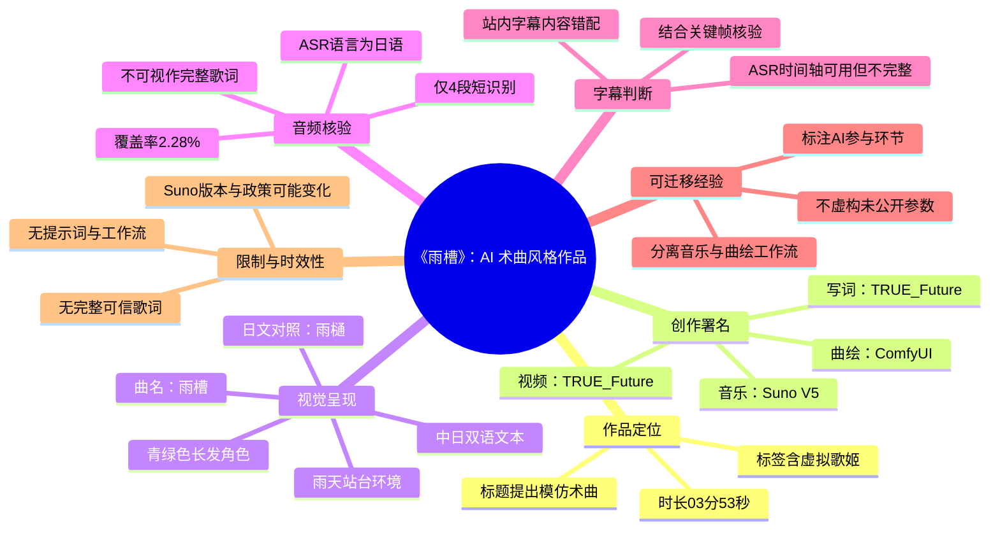
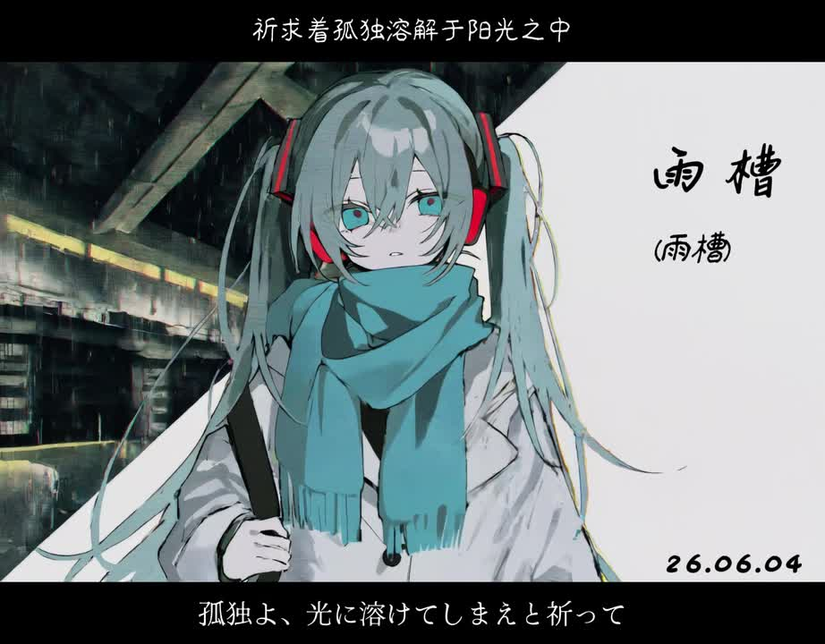

## 小结

《雨槽》是一支时长 **03:53** 的 AI 音乐作品，标题提出“AI也可以模仿术曲了？”，标签包含“AI”“虚拟歌姬”“术曲”“suno v5”“仿术曲”。创作者在简介中明确署名：**音乐使用 Suno V5，曲绘使用 ComfyUI，歌词与视频由 TRUE_Future 完成**。因此，这是一项“人工写词、整合视频 + AI 音乐与 AI 曲绘”的成品展示，而不是生成教程或参数公开视频。

视频以固定的角色曲绘配合中日双语歌词文字呈现：一名佩戴耳机、围青色围巾的长发角色处在雨天站台般的环境中，画面右侧标有“雨槽（雨樋）”。这套主视觉与“虚拟歌姬”“术曲”的标签共同构成作品的风格定位；但现有素材没有说明具体模仿对象，也没有公开旋律、编曲或音色设计所参考的某位音乐人或某首作品。

技术信息的可确认范围有限。视频简介只公开到 **Suno V5** 与 **ComfyUI** 两个工具层级，未披露提示词、歌词输入格式、生成轮次、候选筛选方法、音乐后期、ComfyUI 节点工作流、模型、LoRA、采样器、步数、CFG、种子等决定生成结果的关键参数。因此，不能将本片视为可直接复刻的“术曲生成教程”。

本次 ASR 已检查音轨，未出现 `noAudioStream=true`：源视频存在音频，且识别器将其判定为日语（语言概率约 **0.9780**）。但 ASR 在 232.94 秒中仅识别出 4 段短文本，累计语音覆盖率仅 **2.28%**，最后一个片段止于 00:31.100；这说明旋律化演唱或音乐内容难以被稳定转写，不能据此补全整首歌词。

站内字幕虽然带有精确时间码，却明显属于另一条“脱口秀现场”解说内容，提及“杨幂”“上海脱口秀”“29岁集美”等，与《雨槽》的音乐、日语 ASR 结果和画面歌词均不相符，故不能作为本视频的内容依据。本文采用简介、元数据、关键帧和有限 ASR 片段进行交叉核验，并保留明确的证据边界。

## 思维导图

## 目录

- [作品背景与可确认信息](https://www.bilibili.com/video/BV1B77R6cERL?t=0)
- [主视觉、曲名与画面歌词](https://www.bilibili.com/video/BV1B77R6cERL?t=0)
- [前 31 秒可核验的音频线索](https://www.bilibili.com/video/BV1B77R6cERL?t=0)
- [制作链路、步骤与参数边界](https://www.bilibili.com/video/BV1B77R6cERL?t=0)
- [结论、限制与时效性](https://www.bilibili.com/video/BV1B77R6cERL?t=233)
- [字幕比对](https://www.bilibili.com/video/BV1B77R6cERL?t=0)
- [评论分析](https://www.bilibili.com/video/BV1B77R6cERL?t=233)
- [处理记录](https://www.bilibili.com/video/BV1B77R6cERL?t=233)

---

# AI也可以模仿术曲了？ ·雨槽·

> 来源：[Bilibili 视频](https://www.bilibili.com/video/BV1B77R6cERL)  
> UP 主：TRUE-Future  
> 视频时长：03:53  
> 所属收藏集：AIcode  
> 视频简介署名：音乐 **Suno V5**；曲绘 **ComfyUI**；写词、视频 **TRUE_Future**。

## [作品背景与可确认信息｜00:00](https://www.bilibili.com/video/BV1B77R6cERL?t=0)

本片标题为《AI也可以模仿术曲了？ ·雨槽·》，视频时长 233 秒。标题中的“术曲”以及标签中的“虚拟歌姬”“仿术曲”，说明创作者将该作品放置在术曲／虚拟歌声相关的审美语境中。

但标题使用问号，创作者也没有在简介、字幕或现有素材里说明：

- 模仿的是哪位具体音乐人；
- 参考了哪首具体歌曲；
- 采用了哪些可辨认的术曲编曲规范；
- 是否进行过对照测试或人工修订；
- 音乐的人声、旋律、和声、节奏、混音分别由哪些环节产生。

因此，“模仿术曲”应被理解为创作者对成品风格的定位，而非一项可由现有素材验证的技术结论。

截至素材抓取时，页面统计为：

| 指标 | 数值 | 说明 |
| --- | ---: | --- |
| 播放 | 7,537 | 页面抓取快照，后续会变化。 |
| 点赞 | 1,104 | 页面抓取快照，不代表技术验证。 |
| 收藏 | 441 | 反映当时的收藏量。 |
| 投币 | 68 | 页面互动数据。 |
| 分享 | 22 | 页面互动数据。 |
| 评论 | 45 | 页面抓取时的评论总数。 |
| 弹幕 | 118 | 页面抓取时的弹幕总数。 |

创作者公开的制作分工如下：

| 环节 | 署名工具／作者 | 能够确认的事实 | 未公开内容 |
| --- | --- | --- | --- |
| 音乐 | Suno V5 | 成品音乐使用 Suno V5。 | 提示词、风格标签、歌词输入、生成模式、延展方式、候选数量、筛选标准、后期处理。 |
| 曲绘 | ComfyUI | 曲绘使用 ComfyUI 制作。 | 基础模型、LoRA、ControlNet、IP-Adapter、VAE、采样器、步数、CFG、种子、重绘流程。 |
| 写词 | TRUE_Future | 创作者署名负责写词。 | 完整歌词及逐句时间码。 |
| 视频 | TRUE_Future | 创作者署名负责视频制作。 | 剪辑软件、字幕制作流程、字体、转场、特效与编码参数。 |

## [主视觉、曲名与画面歌词｜00:00](https://www.bilibili.com/video/BV1B77R6cERL?t=0)

视频关键帧显示，本片的视觉主体是一幅持续复用的角色曲绘：角色拥有青绿色长发、红黑色耳机和青色围巾，背景为带雨意的站台／城市建筑环境。画面右侧固定书写曲名“雨槽”，下方为“雨樋”。

“雨槽”与“雨樋”均指向建筑排水结构相关的词义；但视频没有公开标题命名的解释，因此不能进一步断定它在歌词叙事中的象征意义。

> 图：该关键帧清晰展示曲名“雨槽”、日文对照“雨樋”、雨天环境与角色主视觉，也是确认作品以曲绘和歌词文字为主要画面形式的直接依据。右下角可见“26.06.04”，与元数据中的发布日期相呼应。

画面上、下黑色区域承载中日双语文字。首个提供的关键帧可见：

- 中文：**祈求着孤独溶解于阳光之中**
- 日文：**孤独よ、光に溶けてしまえと祈って**

该文字能够证明视频有中日双语歌词式排版，但关键帧素材未提供对应的精确抽帧时间。因此，这些文字可作为画面内容记录，不能被强行标记为某一秒的官方歌词时间轴。

> 图：该帧展示中文“本来以为这便是结束”及日文“これで終わるって、そう思っていたのに”。它说明视频在固定主视觉上切换歌词文本，而非展示 Suno 或 ComfyUI 的操作界面。

> 图：该帧顶部为“是有什么事情要发生吗？”，底部为“ねぇ、何かが始まるの？”。它为作品的文本呈现提供了可见证据，但因缺少关键帧时间码，不能用于构建逐句精确歌词轴。

> 图：该帧顶部为“可是一直，一直”，底部为“だけど ずっと、ずっと”。固定角色与背景、变化的双语文字共同体现了本片的剪辑策略：以统一曲绘承载音乐和文本氛围。

## [前 31 秒可核验的音频线索｜00:00](https://www.bilibili.com/video/BV1B77R6cERL?t=0)

本次 ASR 读取了 `audio/audio.wav`，说明处理素材中存在可用音轨；ASR 结果未标记 `noAudioStream=true`，因此不能将低识别率解释为“源视频无音轨”。

ASR 使用 `medium` 模型，在 CUDA / float16 环境下自动识别语言，结论为：

| 项目 | 结果 |
| --- | --- |
| 音频时长 | 232.942625 秒 |
| 自动识别语言 | 日语 |
| 语言概率 | 0.97802734375 |
| 已识别片段数 | 4 段 |
| 已识别语音总时长 | 约 5.3 秒 |
| 语音覆盖率 | 2.28% |
| 首段识别位置 | 00:00.300 |
| 最后一段识别位置 | 00:31.100 |
| 诊断提示 | 识别语音不足 4%，可能是音乐、静音、错误音轨或识别不完整。 |

ASR 的可用原始片段如下。文本均按识别结果保留，不修订、不补写，也不当作完整歌词：

| 时间轴 | ASR 原文 | 证据强度与使用限制 |
| --- | --- | --- |
| [00:00.300–00:01.700](https://www.bilibili.com/video/BV1B77R6cERL?t=0) | 火の沙汰 | 短片段，可能存在演唱切分或词语误识。 |
| [00:05.660–00:06.800](https://www.bilibili.com/video/BV1B77R6cERL?t=5) | 孤独よ 日 | 与画面中出现的“孤独よ”存在局部字面重合，但断句不完整。 |
| [00:15.160–00:16.660](https://www.bilibili.com/video/BV1B77R6cERL?t=15) | が掛け違え | 缺少稳定上下文，不能确定完整语义。 |
| [00:29.840–00:31.100](https://www.bilibili.com/video/BV1B77R6cERL?t=29) | ですだけ | 片段残缺，不宜作为正式歌词引用。 |

ASR 检出的主要空档包括：

| 空档区间 | 时长 | 含义 |
| --- | ---: | --- |
| 00:06.800–00:15.160 | 8.36 秒 | ASR 未形成可用文本。 |
| 00:16.660–00:29.840 | 13.18 秒 | ASR 未形成可用文本。 |
| 00:31.100–03:52.943 | 约 201.84 秒 | 后续几乎没有可用的机器转写。 |

这类低覆盖率常见于旋律化演唱、混响较重、伴奏密集或非语音主导的音乐内容。现有结果只能支持“音轨中存在被识别器判断为日语的短演唱／语音片段”，不能支持“ASR 已转写完整日文歌词”的结论。

## [制作链路、步骤与参数边界｜00:00](https://www.bilibili.com/video/BV1B77R6cERL?t=0)

从创作者简介和成片形态中，可以谨慎复原的只是高层制作链路：

1. **人工写词**  
   简介署名“写词：TRUE_Future”。这表明创作者将歌词创作归于自身，但并未公开完整歌词文本、写作过程或中日文本的具体翻译关系。

2. **使用 Suno V5 生成音乐**  
   简介明确写明“音乐：Suno V5”。这是本片最明确的音乐技术信息。创作者另称“还是 Suno v5 好用啊……”，可视为个人使用感受。

3. **使用 ComfyUI 制作曲绘**  
   简介明确写明“曲绘：Comfyui”。关键帧中的统一角色、雨天背景与题字版式，可作为该曲绘被用于视频视觉包装的结果证据。

4. **由创作者完成视频整合**  
   简介署名“视频：TRUE_Future”。视频将音乐、曲绘和中日文字组织为 03:53 的成片，但未展示剪辑工程或制作过程。

### 已公开工具与版本信息

- **Suno V5**：本片音乐使用的版本标注。
- **ComfyUI**：本片曲绘的制作工具标注。
- **Suno V6**：创作者在简介中写有“`Suno v6 快点出吧`”，属于对未来版本的期待，而不是本片使用 V6 的证据。

### 未公开、不可补写的参数

以下参数通常会显著影响 AI 音乐与 AI 绘图的输出，但在当前素材中没有出现：

- Suno 的提示词、风格描述、排除描述；
- 歌词是否完整输入到 Suno，以及结构标签如何书写；
- 是否使用延展、重制、裁切或多段拼接；
- 生成了多少候选曲目、如何进行筛选；
- 是否对音乐进行了修音、混音、母带或人工编曲；
- ComfyUI 使用的模型、LoRA、ControlNet、工作流节点图；
- 图像尺寸、采样器、采样步数、CFG、种子与局部重绘策略；
- 视频帧率、字体、特效、字幕时间轴和导出编码。

因此，本片能够提供的经验主要是创作组织层面的，而非直接可复刻的参数方案：

- 将**人工创作内容**与**AI 参与环节**明确署名；
- 将音乐生成、曲绘生成、歌词写作和视频整合拆分为不同职责；
- 在发布 AI 音乐时说明工具版本，以便观众理解成品的技术来源；
- 不将“风格接近”描述为对某位创作者、某首歌曲的精确复刻，除非提供明确对照和许可信息。

## [结论、限制与时效性｜03:53](https://www.bilibili.com/video/BV1B77R6cERL?t=233)

《雨槽》可被记录为一支以 AI 生成工具参与制作的术曲风格音乐视频案例。现有证据能够确认：

- 音乐使用 **Suno V5**；
- 曲绘使用 **ComfyUI**；
- 歌词和视频由 **TRUE_Future** 署名负责；
- 视频采用虚拟歌姬风格角色、雨天场景和中日双语歌词文本；
- 本次 ASR 将有限音频片段判断为日语；
- 站内字幕与本片内容严重错配，不能采用。

但以下问题仍无法由当前素材解决：

1. 无法复现音乐生成过程，因为没有提示词、生成模式、候选版本、后期处理信息。
2. 无法复现曲绘，因为没有 ComfyUI 工作流、模型和参数。
3. 无法建立完整歌词时间轴，因为站内字幕错配、ASR 覆盖率极低、关键帧又缺少抽帧时间。
4. 无法验证“模仿术曲”具体模仿了什么，也无法判断其与某首既有作品之间的风格距离。
5. 无法从单一成片判断 AI 音乐是否已经普遍具备某种稳定的艺术或商业质量。

时效性需要特别注意：

- 本片使用 **Suno V5**，后续模型版本、功能、输出效果、可用地区与授权规则均可能变化。
- 创作者“还是 Suno v5 好用啊”“Suno v6 快点出吧”的表述是发布前后个人体验，不是长期技术评测结论。
- 视频互动数据为抓取时快照，会持续变化。
- 站内字幕若被平台后续修复，本文关于其“当前素材错配”的结论应重新核验。

## [字幕比对｜00:00](https://www.bilibili.com/video/BV1B77R6cERL?t=0)

| 字幕来源 | 完整性 | 内容／专有名词一致性 | 时间轴 | 主要问题 |
| --- | --- | --- | --- | --- |
| Bilibili 站内字幕 `p01-ai-zh.srt` | 覆盖 00:00.080–00:53.800。 | 严重不一致：字幕内容为“杨幂的回旋镖”“上海脱口秀现场”“29岁的集美”等，与本片音乐、标题和画面均无关。 | 有真实精确时间码。 | 明显串入另一条中文解说视频，不能用于本片叙事或歌词。 |
| 本次 ASR `asr/transcript.srt` | 共 4 段，约 5.3 秒，覆盖率 2.28%。 | 自动识别为日语，与画面中的日文文字、音乐视频语境不冲突；但片段过短且残缺。 | 有真实精确时间码，覆盖 00:00.300–00:31.100。 | 音乐性演唱导致转写不完整，存在切分和误识风险。 |

### 字幕选择结论

本片**不采用站内字幕**，原因是其内容与视频实际素材明显错配。

本片也**不采用 ASR 作为完整歌词**。ASR 仅保留原始短片段及其真实时间码，用于记录“识别器检测到有限日语片段”这一事实。

关键帧与多模态画面理解提供的补充核验包括：

- 画面右侧曲名为“**雨槽**”，下方对照“**雨樋**”；
- 画面上、下存在中文与日文文本；
- 关键帧中可见“祈求着孤独溶解于阳光之中”“本来以为这便是结束”“是有什么事情要发生吗？”“可是一直，一直”等文本；
- 这些画面文字与站内字幕中的“脱口秀”事件叙事完全不一致；
- 因关键帧未提供抽帧秒数，不能为画面文字虚构精确歌词时间轴。

## [评论分析｜03:53](https://www.bilibili.com/video/BV1B77R6cERL?t=233)

以下仅分析可获取热评前三条。评论反映的是观众体验，不作为音乐质量、健康功效或技术能力的已验证事实。

### 1. 初音ミクHatsuneMiku_｜76 赞

评论者表示，自己在痛苦、颓废且对既有术曲失去感受的状态下，偶然听到该 UP 的 AI 音乐后感到“重新活过来了一样”，并将旋律形容为“冰凉的薄荷水一样灌入混沌脑子”。评论者表达了强烈的情绪触动与持续支持意愿。

这条评论的补充价值在于：它显示部分受众会将本片的旋律、新鲜感和氛围体验为强烈的情绪提振。

需要保留的边界是：评论中出现“想要消失”“活下去的动力”等表述，应理解为个人处境下的情绪表达。音乐可以带来陪伴感或短期情绪支持，但不能被视为心理危机干预、治疗或专业支持的替代品。

### 2. 忧郁的蓝色裤头5497｜53 赞

评论为：“好听，至少标注是ai了”。

该评论的重点在于 AI 内容标注透明度，而非具体音乐技法。它与视频简介中“音乐：Suno V5”“曲绘：Comfyui”的署名相呼应，反映观众认可创作者明确说明 AI 参与环节。

不过，明确标注所用工具并不等于已经公开完整制作过程；提示词、生成参数和后期细节仍未披露。

### 3. 辞去山河｜16 赞

评论为：“听完治好了我多年顽疾”。

这是一种夸张式的正向玩笑表达，意在强调作品“好听”“有效果”或“令人舒畅”。其中没有可验证的医学信息，不应按字面理解，更不能推导出任何健康功效结论。

## [处理记录｜03:53](https://www.bilibili.com/video/BV1B77R6cERL?t=233)

- **Worker ID**：`worker-mrj0wjed-b0c290ad`
- **模型**：`gpt-5.6-terra`
- **使用素材与工具产物**：
  - Bilibili 视频元数据；
  - 已合并视频：`merged.mp4`；
  - 音频：`audio/audio.wav`；
  - 关键帧目录：`frames/`；
  - 站内字幕：`subtitles/p01-ai-zh.srt`；
  - 本次 ASR：`asr/asr-result.json`、`asr/transcript.srt`；
  - 热评数据：`comments/comments.json`。
- **ASR 检查结果**：
  - 使用 `medium` 模型；
  - 设备为 `cuda`，计算类型为 `float16`；
  - 自动识别语言为日语，语言概率 `0.97802734375`；
  - 共识别 4 段，语音覆盖率 `2.28%`；
  - 未出现 `noAudioStream=true`，因此确认问题是音乐内容转写不完整，而非源视频无音轨或工具失败。
- **字幕选择**：
  - 站内字幕有真实时间码，但内容明显属于另一条脱口秀解说视频，故弃用；
  - 本次 ASR 有真实时间码，但内容过少且不完整，仅保留为有限音频线索；
  - 画面中日文本用于视觉核验，不扩写为带时间轴的完整歌词。
- **关键帧选择依据**：
  - `frames/frame-001.jpg`：展示曲名“雨槽（雨樋）”、角色和雨天场景；
  - `frames/frame-002.jpg`：展示“本来以为这便是结束”的中日文本；
  - `frames/frame-003.jpg`：展示“是有什么事情要发生吗？”的中日文本；
  - `frames/frame-004.jpg`：展示“可是一直，一直”的中日文本；
  - 这些帧均有助于确认视觉主题与双语文字呈现；由于素材未提供帧对应时间，未虚构其秒数。
- **评论处理范围**：仅处理可获取的热评前三条，未将其他评论、弹幕或站外讨论纳入结论。
- **缓存清理**：任务提供的素材中没有缓存清理执行日志；未对未记录的清理操作作出声称。
- **未解决问题**：
  - 缺少完整可信的歌词与逐句时间轴；
  - 缺少 Suno 的提示词、生成设置和音乐后期信息；
  - 缺少 ComfyUI 工作流、模型与参数；
  - 缺少对“模仿术曲”具体对象的说明；
  - 因此无法给出可复现生成教程或精确的风格对照结论。

## 评论分析

- 热评 1：听完感觉AI的曲子竟然能也能打动人心，我最近生活很痛苦很颓废，想要消失，听之前喜欢的术曲也无法重新拯救我，听什么都没有感觉。偶然间听了up的AI曲感觉重新活过来了一样，耳目一新 AI独特旋律如同冰凉的薄荷水一样灌入混沌脑子[雪花]精神得到洗礼，清凉冰爽感让我清醒，感觉被救赎了[少女乐团派对_感想]。已三连[打call]一定要一直更下去啊！已经成为我活下去的动力了[初音未来_大笑]
- 热评 2：好听，至少标注是ai了[doge]
- 热评 3：听完治好了我多年顽疾

以上内容是观众反馈摘录，只用于补充理解视频反响，不作为正文事实依据。
